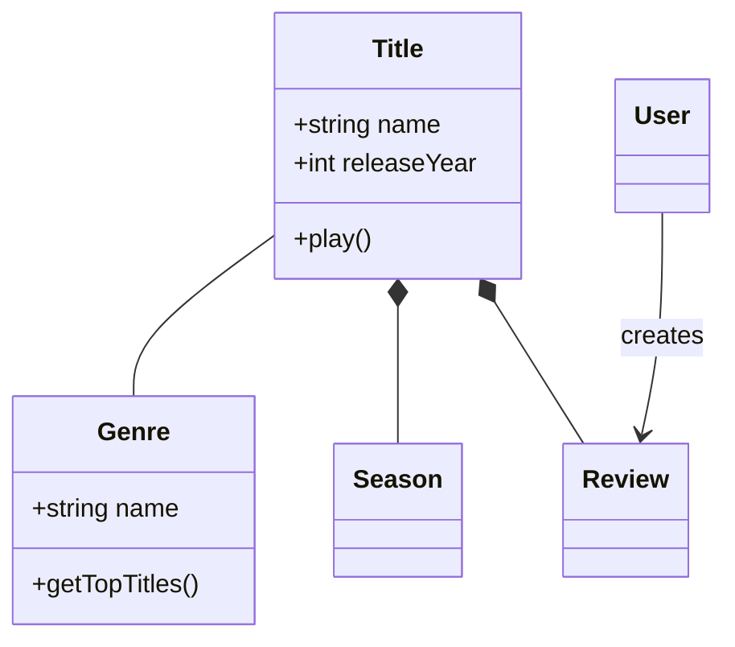
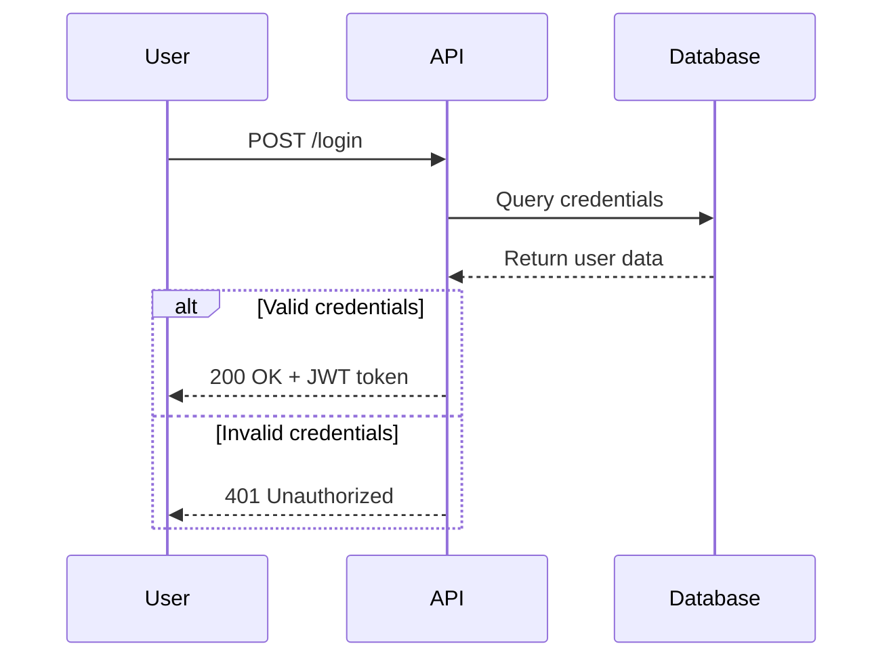
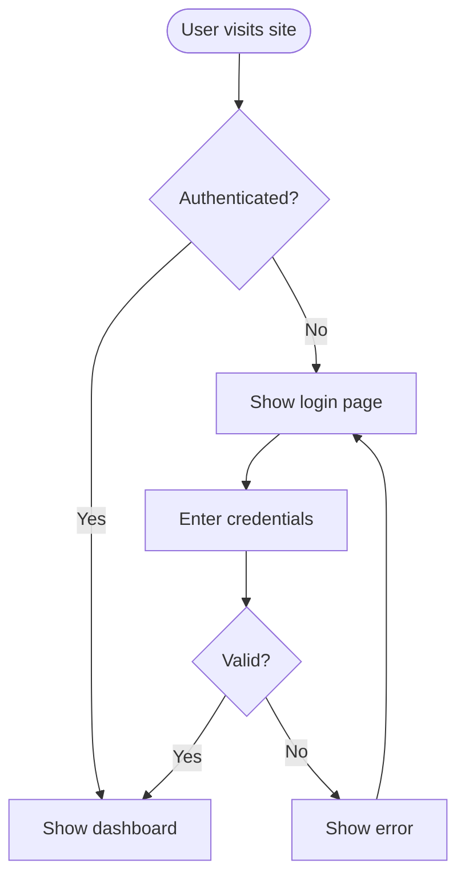
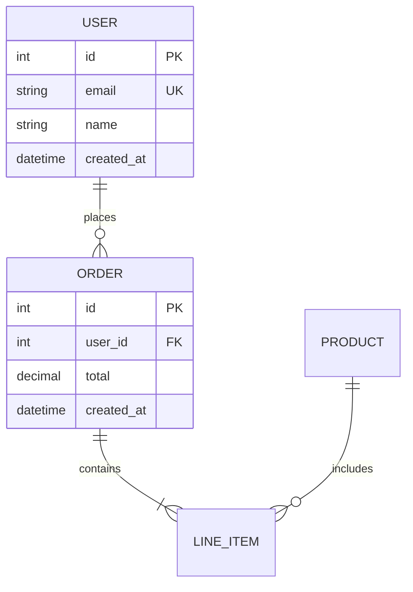
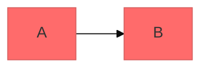

# Mermaid Diagramming

Create professional software diagrams using Mermaid's text-based syntax. Mermaid renders diagrams from simple text definitions, making diagrams version-controllable, easy to update, and maintainable alongside code.

## Core Syntax Structure

All Mermaid diagrams follow this pattern:

```mermaid
diagramType
  definition content
```

**Key principles:**
- First line declares diagram type (e.g., `classDiagram`, `sequenceDiagram`, `flowchart`)
- Use `%%` for comments
- Line breaks and indentation improve readability but aren't required
- Unknown words break diagrams; parameters fail silently

## Diagram Type Selection Guide

**Choose the right diagram type:**

1. **Class Diagrams** - Domain modeling, OOP design, entity relationships
   - Domain-driven design documentation
   - Object-oriented class structures
   - Entity relationships and dependencies

2. **Sequence Diagrams** - Temporal interactions, message flows
   - API request/response flows
   - User authentication flows
   - System component interactions
   - Method call sequences

3. **Flowcharts** - Processes, algorithms, decision trees
   - User journeys and workflows
   - Business processes
   - Algorithm logic
   - Deployment pipelines

4. **Entity Relationship Diagrams (ERD)** - Database schemas
   - Table relationships
   - Data modeling
   - Schema design

5. **C4 Diagrams** - Software architecture at multiple levels
   - System Context (systems and users)
   - Container (applications, databases, services)
   - Component (internal structure)
   - Code (class/interface level)

6. **State Diagrams** - State machines, lifecycle states
7. **Git Graphs** - Version control branching strategies
8. **Gantt Charts** - Project timelines, scheduling
9. **Pie/Bar Charts** - Data visualization

## Quick Start Examples

### Class Diagram (Domain Model)


### Sequence Diagram (API Flow)


### Flowchart (User Journey)


### ERD (Database Schema)


## Detailed References

For in-depth guidance on specific diagram types, see:

- **[references/class-diagrams.md](references/class-diagrams.md)** - Domain modeling, relationships (association, composition, aggregation, inheritance), multiplicity, methods/properties
- **[references/sequence-diagrams.md](references/sequence-diagrams.md)** - Actors, participants, messages (sync/async), activations, loops, alt/opt/par blocks, notes
- **[references/flowcharts.md](references/flowcharts.md)** - Node shapes, connections, decision logic, subgraphs, styling
- **[references/erd-diagrams.md](references/erd-diagrams.md)** - Entities, relationships, cardinality, keys, attributes
- **[references/c4-diagrams.md](references/c4-diagrams.md)** - System context, container, component diagrams, boundaries
- **[references/architecture-diagrams.md](references/architecture-diagrams.md)** - Cloud services, infrastructure, CI/CD deployments
- **[references/advanced-features.md](references/advanced-features.md)** - Themes, styling, configuration, layout options

## Best Practices

1. **Start Simple** - Begin with core entities/components, add details incrementally
2. **Use Meaningful Names** - Clear labels make diagrams self-documenting
3. **Comment Extensively** - Use `%%` comments to explain complex relationships
4. **Keep Focused** - One diagram per concept; split large diagrams into multiple focused views
5. **Version Control** - Store `.mmd` files alongside code for easy updates
6. **Add Context** - Include titles and notes to explain diagram purpose
7. **Iterate** - Refine diagrams as understanding evolves

## Configuration and Theming

Configure diagrams using frontmatter:



**Available themes:** default, forest, dark, neutral, base

**Layout options:**
- `layout: dagre` (default) - Classic balanced layout
- `layout: elk` - Advanced layout for complex diagrams (requires integration)

**Look options:**
- `look: classic` - Traditional Mermaid style
- `look: handDrawn` - Sketch-like appearance

## Exporting and Rendering

**Native support in:**
- GitHub/GitLab - Automatically renders in Markdown
- VS Code - With Markdown Mermaid extension
- Notion, Obsidian, Confluence - Built-in support

**Export options:**
- [Mermaid Live Editor](https://mermaid.live) - Online editor with PNG/SVG export
- Mermaid CLI - `npm install -g @mermaid-js/mermaid-cli` then `mmdc -i input.mmd -o output.png`
- Docker - `docker run --rm -v $(pwd):/data minlag/mermaid-cli -i /data/input.mmd -o /data/output.png`

## Common Pitfalls

- **Breaking characters** - Avoid `{}` in comments, use proper escape sequences for special characters
- **Syntax errors** - Misspellings break diagrams; validate syntax in Mermaid Live
- **Overcomplexity** - Split complex diagrams into multiple focused views
- **Missing relationships** - Document all important connections between entities

## When to Create Diagrams

**Always diagram when:**
- Starting new projects or features
- Documenting complex systems
- Explaining architecture decisions
- Designing database schemas
- Planning refactoring efforts
- Onboarding new team members

**Use diagrams to:**
- Align stakeholders on technical decisions
- Document domain models collaboratively
- Visualize data flows and system interactions
- Plan before coding
- Create living documentation that evolves with code

## Critical Syntax Rules

Always follow these rules to prevent parsing errors:

### Rule 1: Avoid List Syntax Conflicts

- ❌ WRONG: [1. Perception]       → Triggers "Unsupported markdown: list"
- ✅ RIGHT: [1.Perception]         → Remove space after period
- ✅ RIGHT: [① Perception]         → Use circled numbers (①②③④⑤⑥⑦⑧⑨⑩)
- ✅ RIGHT: [(1) Perception]       → Use parentheses
- ✅ RIGHT: [Step 1: Perception]   → Use "Step" prefix

### Rule 2: Subgraph Naming

- ❌ WRONG: subgraph AI Agent Core  → Space in name without quotes
- ✅ RIGHT: subgraph agent["AI Agent Core"]  → Use ID with display name
- ✅ RIGHT: subgraph agent          → Use simple ID only

### Rule 3: Node References

- ❌ WRONG: Title --> AI Agent Core  → Reference display name directly
- ✅ RIGHT: Title --> agent          → Reference subgraph ID

### Rule 4: Special Characters in Node Text

- ✅ Use quotes for text with spaces: ["Text with spaces"]
- ✅ Escape or avoid: quotation marks → use 『』instead
- ✅ Escape or avoid: parentheses → use 「」instead
- ✅ Line breaks in circle nodes only: ((Text<br/>Break))

### Rule 5: Arrow Types

- --> solid arrow
- -.-> dashed arrow (for supporting systems, optional paths)
- ==> thick arrow (for emphasis)
- ~~~ invisible link (for layout only)

For complete syntax reference and edge cases, see references/syntax-rules.md

## Configuration Options

All diagrams accept these parameters:

### Layout:

- direction: "vertical" (TB), "horizontal" (LR), "right-to-left" (RL), "bottom-to-top" (BT)
- aspect: "portrait" (default), "landscape" (wide), "square"

### Detail Level:

- simple: Core elements only, minimal labels
- standard: Balanced detail with key descriptions (default)
- detailed: Full annotations, explanations, and metadata
- presentation: Optimized for slides (larger text, fewer details)

### Style:

- minimal: Monochrome, clean lines
- professional: Semantic colors, clear hierarchy (default)
- colorful: Vibrant colors, high contrast
- academic: Formal styling for papers/documentation

Additional Options:

- show_legend: true/false - Include color/symbol legend
- numbered: true/false - Add sequence numbers to steps
- title: string - Add diagram title