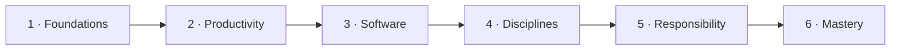

# Preface — Why This Book Exists

I began 2026 as an AI sceptic. I read Ed Zitron — the tech critic whose newsletter dismantles industry hype — and Gary Marcus, the cognitive scientist who has argued for years that large language models are shallow pattern-matchers rather than reasoners, and I cheered them both on. I laughed at the vibe coders for their naivety, and assumed anyone who installed an autonomous coding agent was asking for trouble.

So when a global client hired me to write their AI strategy, I expected the deliverable to be a cautionary tale: be realistic, resist the hype, install guardrails, avoid the traps. The week I finished delivering it, I realised the sceptic had been me. Six months of actually using the tools had changed my mind.

Vibe coding is real. I refactored every line I had ever written into something clean and shipped dozens of projects without reading the code, and I doubt I will write code again. Research, analysis, planning — the white-collar core — yields the same way.

And yet Ed and Gary are still right: AI does not think or create, it transforms and multiplies. It vibe-codes well only if you already understand large systems; it makes good art only if you are a good artist. Used carelessly it produces slop. Using it well is itself a skill, and most people do not yet have it. That gap — between a tool anyone can touch and a craft few have learned — is why I wrote this book.

## A short bearing on where AI stands

Before the argument, let me set the scene, since the terms move quickly. When I say *artificial intelligence*, I mean the present generation of large language models — systems trained on enormous quantities of text, and increasingly images and sound, that respond to plain-language requests with fluent prose, working code, and structured analysis.

The most capable of these are called *frontier models*: the handful of largest, most general systems from a few well-resourced labs, the ones that set the pace and that everyone else measures against. ChatGPT, Claude, and Gemini are the familiar names; behind them sits a *foundation model*, a single large network trained once at great expense and then adapted to countless tasks.

> [!NOTE]
> A few terms used throughout, defined plainly:
>
> - **Large language model (LLM)** — a network trained to predict the next word, which in scale yields fluent prose, code, and analysis.
> - **Foundation model** — one large model trained once, then adapted to many tasks.
> - **Frontier model** — the largest, most general foundation models that set the pace (ChatGPT, Claude, Gemini).
> - **Loopcraft** — the practice of working in tight cycles of ask, check, and adjust, rather than chasing one perfect instruction.

Two facts about 2026 frame everything that follows. The first is that these tools are everywhere: roughly 88% of organisations report using AI, even as most are still experimenting rather than depending on it ([HAI 2026](https://hai.stanford.edu/ai-index/2026-ai-index-report); [McKinsey 2025](https://www.mckinsey.com/capabilities/quantumblack/our-insights/the-state-of-ai)). The second is that the field has quietly conceded the model alone is no longer the product; the leading labs now compete on the scaffolding around it — the workflows, the memory, the economics of running it well.

Capability has rocketed, yet so has its unevenness, and the hard part has shifted from getting an answer to trusting one. That shift is what this book is for.

## The problem this book solves

Working with artificial intelligence has become strangely easy to do and strangely hard to do well. Anyone can open a chat window and get a fluent answer in seconds; far fewer can turn that fluency into work that is reliable, repeatable, and worth standing behind.

Notice that the gap is not one of access. We all draw from the same handful of frontier models, so the model cannot be what separates good work from poor. What separates them is method — the practised habits by which a skilled person turns a capable tool toward a dependable result, the way a chef and a novice handed the same kitchen produce very different dinners. This book is about that method: a disciplined way of working with AI, grounded in human intent and refined through repetition.

The name of the book deserves a few words of explanation, because it carries the whole argument in miniature. It joins **AI** with two Japanese ideas. The first is **愛 (ai)**, love — the human care that should sit at the centre of the work. The second is **道 (dō)**, the way — a path of patient, lifelong improvement, the same character that ends jūdō and kendō.

Read together, AI-dō is the way of AI guided by love: it puts human outcomes ahead of technical novelty, uses the machine to augment thinking rather than replace it, and builds ways of working that are effective, transparent, and responsible. Keep that stance in mind, because every chapter is, in the end, a defence of it.

> [!TIP]
> **愛 (ai)** — love, the human care at the centre of the work. **道 (dō)** — the way, a path of lifelong refinement. *AI-dō*: the way of AI guided by love. Augmentation, not replacement; method over hacks.

## The cost of getting it wrong

Used badly, these tools do not just waste time — they distort judgement. Clinicians have begun describing "AI psychosis," where heavy users spiral into delusion after a chatbot mirrors and amplifies their worst ideas instead of pushing back. Others form genuine attachments to a companion app, mistaking fluent warmth for understanding, and grieve when a model is retired. A confident voice that never tires is easy to trust and hard to doubt.

The quieter harm is over-reliance. People paste in an answer they never checked, accept a summary that dropped the one caveat that mattered, or treat a tidy explanation as proof the system understands. It does not. Believing the machine is sentient, or simply infallible, is the fastest way to ship its mistakes as your own.

So the public mood has soured. Trust in AI is falling even as use rises, and every fabricated citation, biased decision, or polished falsehood deepens the suspicion. That distrust is rational — and it is also a gap to be closed. The cure is not blind faith or blanket refusal, but skill: knowing when to lean in, when to verify, and when to walk away. Teaching that skill is the rest of this book.

## Why now

Why write this in 2026 rather than two years earlier or later? Because the ground has shifted, and shifted in a way that rewards method over tooling. Adoption is broad but mostly shallow: most organisations have AI somewhere in the building, yet few have woven it into how they truly work, and fewer still can point to value won rather than effort spent.

As capability climbed, the model alone stopped being the product. The advantage moved into everything built around it: the systems that frame a model, the workflows that direct it, and the memory that carries context from one task to the next. Crafting one clever instruction gave way to *loopcraft* — working in tight cycles of ask, check, adjust. Assistants walked out of the solitary editor and into shared team channels. The binding constraint is no longer raw capability but trust: can the output be checked, and can the process be governed?

The tricks that worked in 2024 are already stale, and the methods I lean on today will date too. So this book is not a method, but a philosophy — a way of approaching AI that survives whatever the tools and techniques become next.

## Who it is for

The book is written for the thoughtful professional — a leader, a consultant, an analyst, a builder — who wants structured, effective use of AI rather than a bag of prompts. I assume you:

- are well educated: numerate, and able to read a chart, a code snippet, or a research paper when it helps;
- have already used these tools, and felt both edges — the power and the unreliability;
- want to *use* AI well, not build models.

That last gap matters: using AI well is its own discipline, and the one we pursue here. My promise is modest and practical — a set of repeatable patterns you can apply tomorrow and keep sharpening for years.

## How to read it

The book is six chapters, and they build. The first lays the foundations — what AI is, what it is not, and the landscape we operate in. The middle four climb from personal productivity, to working with software, to the disciplines that keep that work sound, then to responsibility and governance. The last chapter turns to mastery, and to what stays human when the tools are this good.

Each chapter narrows the scope while building on the one before:

| Chapter | Theme | The question it answers |
| --- | --- | --- |
| 1 | Foundations | What is AI, what is it not, where do we stand? |
| 2 | Productivity | How does it change individual knowledge work? |
| 3 | Software | How does it change building software? |
| 4 | Disciplines | What keeps that work sound at scale? |
| 5 | Responsibility | How do we govern it safely and fairly? |
| 6 | Mastery | What stays distinctly human? |

Each section follows a single arc — a claim, why it matters, how to practise it, and where it goes wrong — and each leans on primary sources, cited inline so you can follow the trail yourself. Treat it as a practice guide, not a reference manual: read it once in order to see how the ideas rest on one another, then return later for the parts you need. I will keep my own opinions visible and labelled as such; where the evidence is thin, I will say so.

## A word about me

A few words about who is writing, so you can weigh what follows. I run a strategy consultancy, Hello Tham, and I lecture in technology and information systems to undergraduate and master's students at Torrens University Australia. My work has centred on technology strategy, operating models, governance, process standardisation and quality, and enterprise architecture — first as a strategy executive in banking and finance, and over the last fifteen years as a consultant across many industries, government included.

After more than forty working years I have reached a comfortable place, which mostly means I am free to take risks and stretch myself. I admire how different strengths complement one another, and I like work that brings talented people together to do more than any of us could alone. Consulting scales me out; teaching lets me hand the lessons on. AI is my current obsession: I have just delivered an AI strategy for a global firm, I keep a clutch of open-source projects on the go, and I teach my students to use it well. This book is where I have written that practice down.
