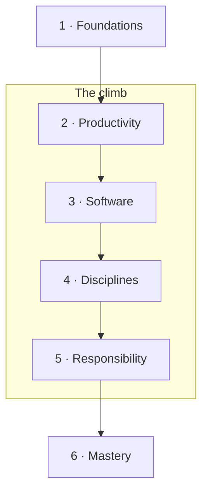

# Preface — Why This Book Exists

## Why This Book

Working with artificial intelligence has become strangely easy to do and strangely hard to do well. Anyone can open a chat window and get a fluent answer in seconds; far fewer can turn that fluency into work that is reliable, repeatable, and worth standing behind.

Notice that the gap is not one of access. We all draw from the same handful of frontier models, so the model cannot be what separates good work from poor. What separates them is method — the practised habits by which a skilled person turns a capable tool toward a dependable result, the way a chef and a novice handed the same kitchen produce very different dinners. This book is about that method: a structured way of working with AI, grounded in human intent and refined through repetition.

## Why now

Why write this in 2026 rather than two years earlier or later? Because the ground has shifted, and shifted in a way that rewards method over tooling. Adoption is broad but mostly shallow: most organisations have AI somewhere in the building, yet few have woven it into how they truly work, and fewer still can point to value won rather than effort spent.

As capability climbed, the model alone stopped being the product. The advantage moved into everything built around it: the systems that frame a model, the workflows that direct it, and the memory that carries context from one task to the next. Crafting one clever instruction gave way to *loopcraft* — working in tight cycles of ask, check, adjust. Assistants walked out of the solitary editor and into shared team channels. The main limit is no longer raw capability but trust: can the output be checked, and can the process be governed?

The tricks that worked in 2024 are already stale, and the methods I lean on today will date too. So this book is not a method, but a philosophy — a way of approaching AI that survives whatever the tools and techniques become next.

## Won't this be out of date?

It is the fair objection to any book on AI: the field moves in weeks, so won't this be stale before you finish it? A book of prompts and tool tips would be — those expire a model release later. This one is built on a different foundation.

The durable layer is *how the models work*, not which model leads this quarter. A large language model predicts the next token. It has a fixed context window and a knowledge boundary. It is fluent, confident, and sometimes wrong in ways that follow from that mechanism — all of which Chapter 1 sets out. Those properties have held across the whole current generation of models, and they decide what any model can and cannot be trusted to do. The practices in this book are built on them: state your intent and let the model choose the how, assemble the right context, work in loops, verify at the boundaries, keep a human answerable. When the tools change — and they will — the reasons to work this way still hold. Where a point is tied to a particular product or a 2026 figure, I mark it as such; the method around it is meant to last.

## Who it is for

The book is written for the thoughtful professional — a leader, a consultant, an analyst, a builder — who wants structured, effective use of AI rather than a bag of prompts. I assume you:

- are well educated: numerate, and able to read a chart, a code snippet, or a research paper when it helps;
- have already used these tools, and felt both edges — the power and the unreliability;
- want to *use* AI well, not build models.

That last gap matters: using AI well is its own discipline, and the one we pursue here. My promise is modest and practical — a set of repeatable patterns you can apply tomorrow and keep sharpening for years.

## How to read it

The book is six chapters, and they build. The first lays the foundations — what AI is, what it is not, and the landscape we operate in. The middle four climb from personal productivity, to working with software, to the disciplines that keep that work sound, then to responsibility and governance. The last chapter turns to mastery, and to what stays human when the tools are this good.

```mermaid
flowchart TB
  C1["1 · Foundations"] --> C2
  subgraph climb [The climb]
    direction LR
    C2["2 · Productivity"] --> C3["3 · Software"]
    C3 --> C4["4 · Disciplines"]
    C4 --> C5["5 · Responsibility"]
  end
  C5 --> C6["6 · Mastery"]
```

Each chapter narrows the scope while building on the one before:

| Chapter | Theme | The question it answers |
| --- | --- | --- |
| 1 | Foundations | What is AI, what is it not, where do we stand? |
| 2 | Productivity | How does it change individual knowledge work? |
| 3 | Software | How does it change building software? |
| 4 | Disciplines | What keeps that work sound at scale? |
| 5 | Responsibility | How do we govern it safely and fairly? |
| 6 | Mastery | What stays distinctly human? |

Each section follows a single arc — a claim, why it matters, how to practise it, and where it goes wrong — and each leans on primary sources, cited inline so you can follow the trail yourself. Treat it as a practice guide, not a reference manual: read it once in order to see how the ideas rest on one another, then return later for the parts you need. I will keep my own opinions visible and labelled as such; where the evidence is thin, I will say so.

## A word about me

A few words about who is writing, so you can weigh what follows. I run a strategy consultancy, Hello Tham, and I lecture in technology and information systems to undergraduate and master's students at Torrens University Australia. My work has centred on technology strategy, operating models, governance, process standardisation and quality, and enterprise architecture — first as a strategy executive in banking and finance, and over the last fifteen years as a consultant across many industries, government included.

After more than forty working years I have reached a comfortable place, which mostly means I am free to take risks and stretch myself. I admire how different strengths complement one another, and I like work that brings talented people together to do more than any of us could alone. Consulting scales me out; teaching lets me hand the lessons on. AI is my current obsession: I have just delivered an AI strategy for a global firm, I keep a clutch of open-source projects on the go, and I teach my students to use it well. This book is where I have written that practice down.
