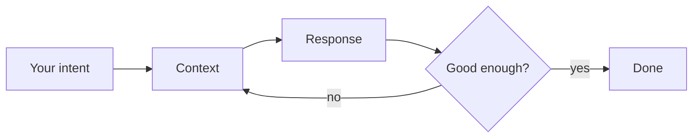

# Chapter 1 — Foundations (The Way)

When I first started cooking, my early attempts did not fare well. I had the recipe and the ingredients, yet the results were grim — onions scorched while I chopped the next thing, pasta turned to glue, unbalanced taste. The problem was not the recipe. I had skipped the fundamentals: heat control, timing, tasting as you go, getting everything prepped before the pan ever warmed. Once those became second nature, almost any recipe came out well.

Working with AI is the same. How you use the tool matters as much as the tool itself. This chapter focuses on four things: what AI-dō means, how to picture a system that predicts rather than knows, the state of AI in 2026, and why some people do not get good results. Everything later rests on them.

## The Meaning of AI-dō

The name fuses **AI** with two Japanese ideas, and each pulls in a direction worth understanding before we go further.

> [!NOTE]
> **愛 (ai)** — *love*: not sentiment, but care for the people the work touches. **道 (dō)** — *the way*: a craft practised and refined over time, the suffix in jūdō, kendō, and aikidō. **AI-dō** is "the way of AI guided by love": using these tools deliberately, in service of human outcomes.

The care half is not vague. Care ethics names concrete duties — attentiveness, responsibility, competence, responsiveness — and they translate into accountability for what the machine produces ([Tronto, care ethics](https://en.wikipedia.org/wiki/Ethics_of_care)).

The second character is important. A discipline ending in 道 is never finished; it is practised. AI-dō treats AI the same way: a discipline to refine, not a trick to copy. It descends from the intelligence-augmentation tradition, which sees machines as complements to human judgement, not substitutes ([IA](https://en.wikipedia.org/wiki/Intelligence_amplification)).

My reason is pragmatic, not romantic: tools commoditise, and so, in time, do methods. A prompt is one model release from obsolete; a clever technique lasts a little longer, then it too is overtaken. What endures is the stance beneath them — how you frame a problem, gather context, and verify a result. So this book is less a kit of methods than a philosophy of working with AI, one that outlives any particular trick or tool. Learn the philosophy, and the methods become yours to invent.

## Mental Models for AI

The most useful shift I made early on was to stop treating the model as an oracle. An oracle gives one answer and you take it or leave it. A good model is more like a clever junior colleague: ask, glance at the draft, say "closer, but tighten the intro," and go again. So treat it as a loop — intent enters, context is assembled, a response comes back, you refine — iterating until the output is good enough.

Quality lives in that loop, not in any single message. The model rarely converges first pass, and it cannot read intentions you never stated. That same loop is the right picture for *agent*, a word you will meet constantly.

> [!NOTE]
> An **agent** is an LLM running tools in a loop to reach a goal ([Willison, 2025](https://simonwillison.net/2025/Sep/18/agents/)). A **tool** is an action it may take — web search, code execution, file edits — and the **loop** runs until a stopping condition is met. An agent has no agency in the moral sense: a computer cannot be held accountable, so you stay responsible for what it ships.

So frame each task as a goal, the context it needs, and a check; then iterate. The failure mode is reading fluency as truth. A confident answer and a correct one look identical until you check — the model will cite a court case or a statistic in the same calm voice whether or not it exists — which is why verification is the habit that holds.

## The 2026 Landscape

In the first half of 2026, AI stopped being a platform shift and became a regulated strategic technology. Three things happened at once, and they explain the world this book is written into.

First, the models grew up. A year ago they could resolve about three in five real software issues; today the best clear nearly all of them, and a model took home a gold medal at the Mathematical Olympiad — yet still misreads an analog clock half the time. Capability raced ahead, unevenly. Adoption followed: roughly 88% of organisations now use AI, and four in five students. Power, not chips, became the binding limit on training.

Second, the moat moved. The frontier labs no longer sell a model; they sell the system around it — the harness, the workflow, the memory, the economics. Prompt-crafting gave way to *loopcraft*: stacking iterative cycles around a model. Agents climbed out of the chat box into shared channels, async and proactive. And open-weight models from China drew level, so no single vendor is safe to lean on.

Third, the rules arrived. Governments now gate frontier releases, and courts have begun treating AI output as the deploying organisation's own words. Access, not just compute, is now a geopolitical lever. The figures below tell the two halves of the story — capability soaring, value still scarce.

| Signal | Figure | Implication |
| --- | --- | --- |
| Organisations using AI | 88% | Adoption is universal; scaling is not |
| SWE-bench Verified (coding) | 60% → ~100% in a year | Capability accelerating |
| US businesses paying for AI | 5% (2023) → 44% | Commercial traction is real |
| US–China top-model gap | ~2.7% | No single safe vendor; open weights close behind |
| Orgs reporting enterprise value | minority | Usage is easy; value is the scarce skill |

Sources: [HAI 2026 AI Index](https://hai.stanford.edu/ai-index/2026-ai-index-report); [McKinsey, State of AI](https://www.mckinsey.com/capabilities/quantumblack/our-insights/the-state-of-ai); [State of AI 2025](https://www.stateof.ai/).

The pattern that matters most is the gap between using AI and getting value from it. Nearly everyone has access; only a minority report real returns. The lesson for us is that the edge no longer comes from picking the best model — it comes from how you wrap it: the workflow you build, the context you feed it, the way you check its work. That is what the rest of this book teaches.

## Capabilities & Limitations

Under the polish, a model is a next-token predictor. Think of the world's most widely-read writer playing a parlour game: given everything written so far, guess the next word, then the next. Trained on vast text, it learns the probability of each next token and generates by sampling, one token at a time. Nothing in the mechanism consults a fact store or checks truth; it simply produces the most plausible continuation.

That is why a hallucination — confident, well-formed output that happens to be false — is the system working as designed, not malfunctioning. It is a plausible completion, not a lie ([microgpt](https://karpathy.github.io/2026/02/12/microgpt/)). It also means competence is *jagged*: uneven across tasks that look alike to us, because the model's strength tracks the density of its training data, not the difficulty we perceive.

The Stanford Index makes the gap vivid. A model can win a gold medal at the Mathematical Olympiad yet read an analog clock right only about half the time ([HAI 2026](https://hai.stanford.edu/ai-index/2026-ai-index-report)). Olympiad proofs fill the training text; clock-reading is a perceptual task that does not. Knowing where that line falls is most of the skill.

| Reliable | Brittle |
| --- | --- |
| Fluent drafting, summarising, translation | Exact arithmetic, counting, fresh facts |
| Pattern-rich code and refactors | Long-horizon plans without checkpoints |
| Synthesis over provided context | Recall as context grows (context rot) |

The brittleness is not anecdotal, and the strongest evidence names where the failure lives. Huang and colleagues survey hundreds of studies and split hallucination along two axes worth holding apart. *Factuality* asks whether output matches the world; *faithfulness* asks whether it matches the input you gave it — a summary can be perfectly factual yet unfaithful by adding true claims you never supplied. They trace both to three stages: the *data*, with its gaps and bias; the *training*, which rewards fluent guessing over admitting ignorance; and *inference*, where sampling wanders. The unifying idea is the *knowledge boundary* — the edge of what a model has stored, past which it cannot tell what it knows from what it does not ([Huang et al., ACM TOIS](https://arxiv.org/abs/2311.05232)). Everything below measures that boundary.

Prato and colleagues make it observable with a clean test. Train a model on synthetic documents, then ask it to recall *exactly* what it was given — no more, no less. Over-recall is fabrication, under-recall is omission, so hitting the right count proves the model knows its own scope. This self-knowledge is *scale-gated*: below a size threshold the count is near-random, and only past it does it come out right, the threshold set by architecture, not parameters alone ([Prato et al., EMNLP](https://arxiv.org/abs/2502.19573)). So self-knowledge is a property of the specific model, and small models are least trustworthy at the edge where you most want them to hesitate.

Gu and colleagues pin the boundary to its cause: how often a fact appeared in training. Using a model whose whole corpus is open, they split questions into seen and unseen, then test recall. Closed-book accuracy more than doubles from rare to frequent facts and collapses to about one percent on unseen ones; distractor passages drag it lower as they pile up ([Gu et al., SIGIR](https://arxiv.org/abs/2602.20122)). The brittle column now has a mechanism: fresh and long-tail facts fail because they were rare, retrieval can patch the gap, and noisy retrieval reopens it.

Code shows the same split, between reading a program and predicting how it *runs*. Asked to forecast memory, runtime, and profiler ranks on real SWE-bench fixes, twelve frontier models — gpt-5.5 and Claude Opus among them — reach just 0.842 test-outcome F1, and profiler recall@5 stays under 0.2: fluent on structure, brittle on execution ([Bogomolov & Zharov](https://arxiv.org/abs/2606.27406)). Long context offers no refuge. Accuracy peaks when the needed fact sits at the start or end and sags in the middle ([Liu et al., TACL](https://arxiv.org/abs/2307.03172)). The cause is mechanical — a U-shaped attention bias for position over relevance — and calibrating it lifts mid-context recall by 6–15 points ([Hsieh et al., ACL Findings](https://arxiv.org/abs/2406.16008)).

These limits are a map, not a verdict. Spend effort where the model is strong, verify at the boundaries — fresh facts, exact counts, mid-context recall — keep a human in the loop for judgement, and stay most alert when the output sounds most certain.
