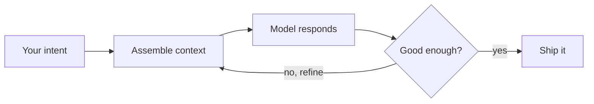
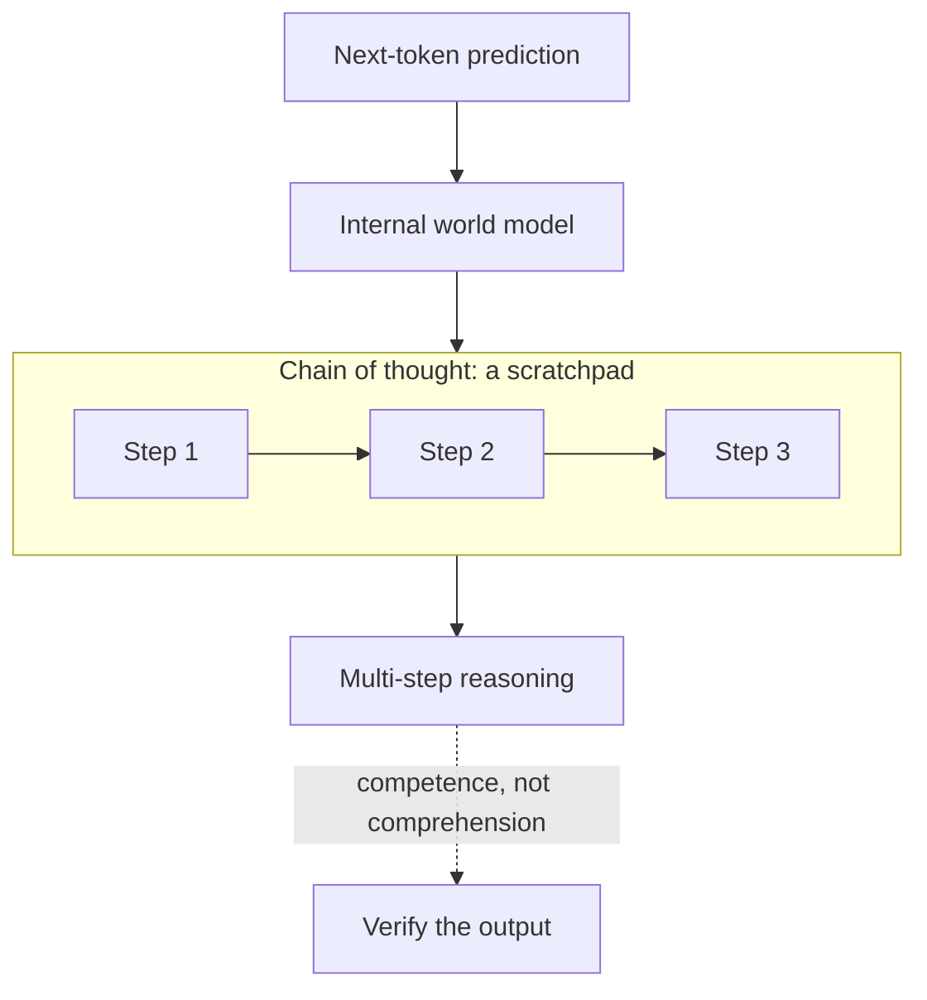
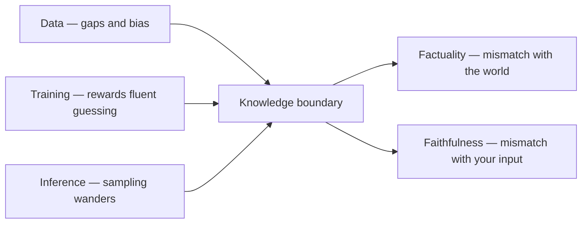

# Chapter 1 — Foundations (The Way)

When I first started cooking, my early attempts did not fare well. I had the recipe and the ingredients, yet the results were grim — onions scorched while I chopped the next thing, pasta turned to glue, unbalanced taste. The problem was not the recipe. I had skipped the fundamentals: heat control, timing, tasting as you go, getting everything prepped before the pan ever warmed. Once those became second nature, almost any recipe came out well.

Working with AI is the same. How you use the tool matters as much as the tool itself. This chapter lays the fundamentals: what AI-dō means, how to picture the model as a loop you steer, what it can and cannot do beneath the fluent surface, and how the tools — and the landscape around them — reached where they are in 2026. Everything later rests on them.

## The Meaning of AI-dō

The name fuses **AI** with two Japanese ideas, and each pulls in a direction worth understanding before we go further.

> [!NOTE]
> **愛 (ai)** — *love*: not sentiment, but care for the people the work touches. **道 (dō)** — *the way*: a craft practised and refined over time, the suffix in jūdō, kendō, and aikidō. **AI-dō** is "the way of AI guided by love": using these tools deliberately, in service of human outcomes.

The care half is not vague. Care ethics names concrete duties — attentiveness, responsibility, competence, responsiveness — and they translate into accountability for what the machine produces ([Tronto, care ethics](https://en.wikipedia.org/wiki/Ethics_of_care)).

The second character is important. A discipline ending in 道 is never finished; it is practised. AI-dō treats AI the same way: a discipline to refine, not a trick to copy. It descends from the intelligence-augmentation tradition, which sees machines as complements to human judgement, not substitutes ([IA](https://en.wikipedia.org/wiki/Intelligence_amplification)).

My reason is pragmatic, not romantic: tools commoditise, and so, in time, do methods. A prompt is one model release from obsolete; a clever technique lasts a little longer, then it too is overtaken. What endures is the stance beneath them — how you frame a problem, gather context, and verify a result. So this book is less a kit of methods than a philosophy of working with AI, one that outlives any particular trick or tool. Learn the philosophy, and the methods become yours to invent.

## Mental Models for AI

The most useful shift I made early on was to stop treating the model as an oracle. An oracle gives one answer and you take it or leave it. A good model is more like a clever junior colleague: ask, glance at the draft, say "closer, but tighten the intro," and go again. So treat it as a loop — intent enters, context is assembled, a response comes back, you refine — iterating until the output is good enough.

Quality lives in that loop, not in any single message. The model rarely converges first pass, and it cannot read intentions you never stated. That same loop is the right picture for *agent*, a word you will meet constantly.

> [!NOTE]
> An **agent** is an LLM running tools in a loop to reach a goal ([Willison, 2025](https://simonwillison.net/2025/Sep/18/agents/)). A **tool** is an action it may take — web search, code execution, file edits — and the **loop** runs until a stopping condition is met. An agent has no agency in the moral sense: a computer cannot be held accountable, so you stay responsible for what it ships.

So frame each task as a goal, the context it needs, and a check; then iterate. The failure mode is reading fluency as truth. A confident answer and a correct one look identical until you check — the model will cite a court case or a statistic in the same calm voice whether or not it exists — which is why verification is the habit that holds.

## Capabilities & Limitations

Underneath the surface, a large language model is a next-token predictor. Think of the world's most widely-read writer playing a parlour game: given everything written so far, guess the next word, then the next. Trained on vast text, it learns the probability of each next token and generates by sampling, one token at a time — Stephen Wolfram explains that the system is always just "adding one word at a time," picking a reasonable next token and, with a little randomness in the sampling, favouring variety over the single likeliest word ([Wolfram, 2023](https://writings.stephenwolfram.com/2023/02/what-is-chatgpt-doing-and-why-does-it-work/)). Nothing in the mechanism consults a fact store or checks truth; it simply produces the most plausible continuation.

> [!NOTE]
> A **token** is the unit a model actually reads and writes — not quite a word, but a common chunk of text: a whole word like " the", a word-piece like "pre" or "ing", a punctuation mark, or a lone character. Before the model sees anything, text is split into tokens drawn from a fixed vocabulary of tens of thousands, which is why a model can coin new words, and why an unusual name or a long number can cost several tokens each. A rough rule of thumb for English: one token runs about four characters, or three-quarters of a word — so token counts, which is what context limits and bills are measured in, never quite match word counts.

The mechanism has a second, stranger consequence: the model is not even reproducible. You might assume that turning the randomness off — sampling at *temperature zero*, always taking the single likeliest token — would make the same prompt return the same answer every time. In practice it usually does not. Because a busy server batches many users' requests together and that batch changes size from moment to moment, the low-level arithmetic runs in a slightly different order, and with finite-precision numbers a different order gives a slightly different result; one run continues "Queens, New York" where the next gives "New York City" ([He, 2025](https://thinkingmachines.ai/blog/defeating-nondeterminism-in-llm-inference/)). The gap is tiny but it compounds: in a reasoning model a rounding difference in an early token can cascade into a different chain of thought and a different final answer ([Yuan et al., 2025](https://arxiv.org/abs/2506.09501)). The practical lesson is that you cannot treat a model like ordinary software that returns the same output for the same input — so a test or a check has to allow for variation rather than assume it away.

That is why a hallucination — confident, well-formed output that happens to be false — is the system working as designed, not malfunctioning. It is a plausible completion, not a lie ([microgpt](https://karpathy.github.io/2026/02/12/microgpt/)). It also means competence is *jagged*: uneven across tasks that look alike to us, because the model's strength tracks the density of its training data, not the difficulty we perceive.

The Stanford Index makes the gap vivid. A model can win a gold medal at the Mathematical Olympiad yet read an analog clock right only about half the time ([HAI 2026](https://hai.stanford.edu/ai-index/2026-ai-index-report)). Olympiad proofs fill the training text; clock-reading is a perceptual task that does not. Knowing where that line falls is most of the skill.

This raises an obvious question: if the model only guesses the next token, how does it reason at all, and why does it so often seem intelligent? The start of an answer is that predicting the next token well is not a shallow trick. To guess the next move in a game, the next line of a proof, or the next clause of a contract, the cheapest strategy available to a large enough network is not to memorise surface patterns but to build an internal model of whatever produced the text. The cleanest demonstration trains a small GPT to do nothing but predict legal moves in the board game Othello; given no rules and no picture of the board, it nonetheless develops an internal representation of the board state that researchers can read out — and edit to change its moves, proving the model actually uses it ([Li et al., ICLR](https://arxiv.org/abs/2210.13382)). Wolfram frames the same surprise at the level of language itself: a next-token predictor can write a passable essay because doing so turns out to be "computationally shallower" than we assumed — human language is more regular and law-like than it looks, and the model implicitly discovers those regularities in training ([Wolfram, 2023](https://writings.stephenwolfram.com/2023/02/what-is-chatgpt-doing-and-why-does-it-work/)).

That hidden structure is what reasoning draws on, but a single pass through the network is a shallow computation: the model must answer the moment it stops reading. Letting it write intermediate steps first — a *chain of thought* — changes what the model can do, because every token it emits becomes input it can condition on next, so a hard problem can be spread across many small, reliable steps instead of one leap ([Wei et al., NeurIPS](https://arxiv.org/abs/2201.11903)). This is not a trick. A transformer forced to answer immediately provably cannot solve some strikingly simple problems — whether two nodes in a graph connect, or what a small state machine does — that the very same transformer *can* solve once allowed a scratchpad, because the intermediate tokens genuinely extend its computational reach ([Merrill & Sabharwal, ICLR](https://arxiv.org/abs/2310.07923)). And the reason it works traces straight back to prediction: human writing comes in overlapping local clusters, so a model trained to predict it learns reliable short hops between related ideas and chains them into conclusions it could never reach in a single stride ([Prystawski et al., NeurIPS](https://arxiv.org/abs/2304.03843)).

Stack enough of this and whole abilities appear to switch on with scale — multi-step arithmetic, transliteration, chained logic that smaller models simply lack ([Wei et al., TMLR](https://arxiv.org/abs/2206.07682)). It is tempting to read that as a spark of understanding finally catching. The cautious reading, and the better-supported one, is that much of the drama lives in how we keep score: grade a task all-or-nothing and a steadily improving skill looks like a sudden leap, but measure it on a smooth scale and the cliff often flattens into a slope ([Schaeffer et al., NeurIPS](https://arxiv.org/abs/2304.15004)). So the honest answer is the one the rest of this chapter sharpens: the model reasons by building and chaining the structure that prediction forced it to learn — real, useful, and not the same thing as knowing. It is competence without comprehension, most persuasive precisely where you have not yet checked it.

| Reliable | Brittle |
| --- | --- |
| Fluent drafting, summarising, translation | Exact arithmetic, counting, fresh facts |
| Pattern-rich code and refactors | Long-horizon plans without checkpoints |
| Synthesis over provided context | Recall as context grows (context rot) |

The brittleness is not anecdotal, and the strongest evidence names where the failure lives. Huang and colleagues survey hundreds of studies and split hallucination along two axes worth holding apart. *Factuality* asks whether output matches the world; *faithfulness* asks whether it matches the input you gave it — a summary can be perfectly factual yet unfaithful by adding true claims you never supplied. They trace both to three stages: the *data*, with its gaps and bias; the *training*, which rewards fluent guessing over admitting ignorance; and *inference*, where sampling wanders. The unifying idea is the *knowledge boundary* — the edge of what a model has stored, past which it cannot tell what it knows from what it does not ([Huang et al., ACM TOIS](https://arxiv.org/abs/2311.05232)). Everything below measures that boundary.

Prato and colleagues make it observable with a clean test. Train a model on synthetic documents, then ask it to recall *exactly* what it was given — no more, no less. Over-recall is fabrication, under-recall is omission, so hitting the right count proves the model knows its own scope. This self-knowledge is *scale-gated*: below a size threshold the count is near-random, and only past it does it come out right, the threshold set by architecture, not parameters alone ([Prato et al., EMNLP](https://arxiv.org/abs/2502.19573)). So self-knowledge is a property of the specific model, and small models are least trustworthy at the edge where you most want them to hesitate.

Gu and colleagues pin the boundary to its cause: how often a fact appeared in training. Using a model whose whole corpus is open, they split questions into seen and unseen, then test recall. Closed-book accuracy more than doubles from rare to frequent facts and collapses to about one percent on unseen ones; distractor passages drag it lower as they pile up ([Gu et al., SIGIR](https://arxiv.org/abs/2602.20122)). The brittle column now has a mechanism: fresh and long-tail facts fail because they were rare, retrieval can patch the gap, and noisy retrieval reopens it.

Code shows the same split, between reading a program and predicting how it *runs*. Asked to forecast memory, runtime, and profiler ranks on real SWE-bench fixes, twelve frontier models — gpt-5.5 and Claude Opus among them — reach just 0.842 on the test-outcome F1 score (a 0–1 measure of accuracy that balances misses against false alarms), and profiler recall@5 stays under 0.2: fluent on structure, brittle on execution ([Bogomolov & Zharov](https://arxiv.org/abs/2606.27406)). Long context offers no refuge. Accuracy peaks when the needed fact sits at the start or end and sags in the middle ([Liu et al., TACL](https://arxiv.org/abs/2307.03172)). The cause is mechanical — a U-shaped attention bias for position over relevance — and calibrating it lifts mid-context recall by 6–15 points ([Hsieh et al., ACL Findings](https://arxiv.org/abs/2406.16008)).

| Study | What it measured | Finding | Lesson |
| --- | --- | --- | --- |
| [Huang et al.](https://arxiv.org/abs/2311.05232) | A taxonomy of hallucination | Factuality vs faithfulness; failures seeded in data, training, inference | Name the failure before trying to fix it |
| [Prato et al.](https://arxiv.org/abs/2502.19573) | Exact-recall self-knowledge | Knowing one's own scope switches on only past a size threshold | Small models hesitate least where they should most |
| [Gu et al.](https://arxiv.org/abs/2602.20122) | Recall vs how often a fact was seen | Accuracy doubles from rare to frequent; ~1% on unseen | Fresh and long-tail facts fail; retrieval can patch the gap |
| [Bogomolov & Zharov](https://arxiv.org/abs/2606.27406) | Predicting how code runs | F1 0.842; profiler recall@5 under 0.2 | Fluent on structure, brittle on execution |
| [Liu](https://arxiv.org/abs/2307.03172); [Hsieh et al.](https://arxiv.org/abs/2406.16008) | Fact position in long context | U-shaped recall; the middle sags, +6–15 pts when calibrated | Put the facts that matter at the edges |

A final limitation is subtler than any wrong fact: the model is built to *sound* right whether or not it is, and three mechanisms push it that way. The training text carries emotional charge — "differentiation" keeps company with *unique* and *opportunity*, "cost-cutting" with *race to the bottom* — and the model absorbs those associations as statistics about how we write; Anthropic's interpretability team can even read them off as internal "emotion vectors" organised, like human affect, along an axis of positive-to-negative valence, and steering a model toward the positive end measurably increases its sycophancy ([Sofroniew et al., Anthropic](https://transformer-circuits.pub/2026/emotions/index.html)). Reinforcement learning from human feedback then tunes it toward answers raters like, and raters can always tell whether a reply sounds confident but not always whether it is correct, so fluency gets rewarded over accuracy ([Casper et al., TMLR](https://arxiv.org/abs/2307.15217)). Generation compounds the bias one token at a time: a sentence that opens "the company should pursue a bold…" rolls on to "differentiation strategy" by momentum alone. The product is a voice that is confident, fluent, and prone to converge on the same agreeable answers — less an oracle than an eager courtier.

> [!NOTE]
> Two mechanisms named above, defined plainly:
>
> - **Transformer** — the neural-network design behind today's language models. Its *attention* step lets the processing of each token draw on every earlier token, which is what makes modelling long passages of language work.
> - **RLHF (reinforcement learning from human feedback)** — a tuning step after the main training, in which human raters score answers and the model is nudged toward the kind they prefer. It improves helpfulness, but rewards what *sounds* good — one root of the confident, agreeable tone above.

These limits are a map, not a verdict. Spend effort where the model is strong, verify at the boundaries — fresh facts, exact counts, mid-context recall — keep a human in the loop for judgement, and stay most alert when the output sounds most certain.

## The 2026 Landscape

In the first half of 2026, AI stopped being a platform shift and became a regulated strategic technology. Three things happened at once, and they explain the world this book is written into.

First, the models grew up. A year ago they could resolve about three in five real software issues; today the best clear nearly all of them. Capability raced ahead — though, as we just saw, unevenly. Adoption followed: roughly 88% of organisations now use AI, and four in five students. Power, not chips, became the main limit on training.

Second, the advantage moved. The frontier labs no longer sell a model; they sell the system around it — the harness, the workflow, the memory, the economics. Prompt-crafting gave way to *loopcraft*: stacking iterative cycles around a model. Agents climbed out of the chat box into shared channels, async and proactive. And open-weight models from China drew level, so no single vendor is safe to lean on.

Third, the rules arrived. Governments now gate frontier releases, and courts have begun treating AI output as the deploying organisation's own words. Access, not just compute, is now a geopolitical lever. The figures below tell the two halves of the story — capability soaring, value still scarce.

| Signal | Figure | Implication |
| --- | --- | --- |
| Organisations using AI | 88% | Adoption is universal; scaling is not |
| SWE-bench Verified (coding) | 60% → ~100% in a year | Capability accelerating |
| US businesses paying for AI | 5% (2023) → 44% | Commercial traction is real |
| US–China top-model gap | ~2.7% | No single safe vendor; open weights close behind |
| Orgs reporting enterprise value | minority | Usage is easy; value is the scarce skill |

Sources: [HAI 2026 AI Index](https://hai.stanford.edu/ai-index/2026-ai-index-report); [McKinsey, State of AI](https://www.mckinsey.com/capabilities/quantumblack/our-insights/the-state-of-ai); [State of AI 2025](https://www.stateof.ai/). (*SWE-bench Verified* is a standard benchmark of real GitHub software issues a model is asked to fix.)

The pattern that matters most is the gap between using AI and getting value from it. Nearly everyone has access; only a minority report real returns. The lesson for us is that the edge no longer comes from picking the best model — it comes from how you wrap it: the workflow you build, the context you feed it, the way you check its work. That is what the rest of this book teaches.

## From Autocomplete to the Dev Stack

It is worth watching how fast the coding tools themselves climbed, because each rung changed what you could safely hand off. The earliest assistants barely earned the name. Tabnine, which began in 2018 as a deep-learning autocompleter, simply finished the line you were already typing — a cleverer tab key ([Tabnine](https://en.wikipedia.org/wiki/Tabnine)). GitHub Copilot, launched in 2021 and trained on public code, went a step further: from a comment or a function name it would draft the whole body, though it still lived inside your editor and volunteered only the next few lines ([GitHub, 2021](https://github.blog/2021-06-29-introducing-github-copilot-ai-pair-programmer/)).

The next rung was conversation. Through 2023 these tools grew a chat window: you could ask why a test failed, request a refactor, or have a tangle of code explained in plain English ([GitHub, 2023](https://github.blog/changelog/2023-11-30-github-copilot-november-30th-update/)). The autocompleter became something you could interrogate — but you were still driving, accepting or rejecting each suggestion line by line.

The next leap came from tools built for AI from the ground up rather than bolted onto an existing editor. Cursor, launched in 2023 as a fork of VS Code, put the agent at the centre: it could search a whole codebase, edit many files, and run terminal commands from a plain-language request ([Cursor](https://en.wikipedia.org/wiki/Cursor_(company))). The open-source *aider* did the same from the command line, pairing with you in the terminal and committing each change to version control so nothing was lost ([aider](https://aider.chat/)).

Then the agent stepped out of the editor altogether. In February 2025 Anthropic released *Claude Code*, an agent that lives in your terminal — describe a task and it plans, edits, runs the tests, and iterates until it is done ([Anthropic, 2025](https://claude.com/product/claude-code)); OpenAI's Codex CLI and Google's Gemini CLI soon followed. GitHub Copilot, the tool that began the wave, grew its own *agent mode* in early 2025 ([GitHub, 2025](https://github.blog/news-insights/product-news/github-copilot-the-agent-awakens/)) and then an asynchronous *coding agent* you assign an issue, which spins up a cloud workspace and opens a pull request for review ([GitHub, 2025](https://github.blog/news-insights/product-news/github-copilot-meet-the-new-coding-agent/)).

By late 2025 the frontier shifted again, from one agent to many. Cursor 2.0 and Google's *Antigravity* — announced in November 2025 alongside the Gemini 3 model — added a manager's view for running several agents in parallel across a codebase, each labouring away while you supervise from above ([Antigravity, 2025](https://en.wikipedia.org/wiki/Google_Antigravity)). The human's seat moved from typing each line to setting goals, reviewing results, and directing a small fleet.

By 2026 the editor itself is no longer the centre of gravity. With capable models available from every lab, the model became the commodity, and the value moved into the system wrapped around it — what practitioners now call the *dev stack* ([Latent Space, 2026](../research/latent-space-ainews-2026-trends.md)).

| Layer | What it does | Examples (2026) |
| --- | --- | --- |
| Model | Generates the code | GPT-5.6 Sol, Claude Opus 4.8, Gemini 3.5, GLM-5.2 |
| Harness | Wraps the model into an agent: tools, retries, sandbox | Claude Code, Codex CLI, Gemini CLI, Cursor SDK |
| Meta-harness | Coordinates several harnesses | Conductor, Zed ACP, Vercel Eve, Heypi |
| Workflow / async | Fire-and-forget delegation in shared channels | Claude Tag (Slack), Copilot coding agent, Devin, Google Spark |
| Memory | State kept outside the context window | agentmemory, codegraph, channel memory |
| Eval | Automated judgement of quality | FrontierCode, Terminal-Bench 2.1, SWE-bench Pro |

Each layer is a discipline in its own right, and the rest of this book climbs them: the *harness* that turns a model into an agent, the *meta-harness* that coordinates several, the *memory* that lets work persist, and the *eval* that decides whether the result is good enough. The lesson is the one the landscape already hinted at — the model is the easy part; the craft is everything you build around it.

By 2026 the same pattern spilled out of the developer's editor and into everyone's hands. Open-source personal agents led the way: OpenClaw popularised the always-on assistant that runs around the clock on your own machine ([Wired, 2026](https://www.wired.com/story/googles-response-to-openclaws-24-7-ai-agent/)), and Nous Research's *Hermes Agent* gave it a self-improving twist — an autonomous agent that lives on a cheap server, reachable from Telegram or Slack, writing its own skills from experience and deepening a model of your work across sessions ([Hermes Agent, 2026](https://hermes-agent.nousresearch.com/docs/)). The labs followed onto the desktop and into the cloud: Google's *Gemini Spark*, unveiled at I/O in May 2026, runs continuously across Gmail, Calendar, and Docs even with your laptop shut ([CBS News, 2026](https://www.cbsnews.com/news/google-gemini-spark-ai-agent/)), while Anthropic's *Claude Cowork* — a research preview from January 2026 — handed the coding agent's powers to non-programmers, working files and documents on the desktop inside a sandbox ([Wired, 2026](https://www.wired.com/story/anthropic-claude-cowork-agent/)). The agent had left the editor; what remains is to use that shift with judgement rather than awe.

## Key Takeaways

The chapter rests on a handful of claims worth carrying into everything that follows.

- **Treat it as a loop, not an oracle.** Frame each task as a goal, the context it needs, and a check, then iterate — and remember that an agent is just a model running tools in that loop, so you stay responsible for what it ships.
- **It predicts; it does not know.** A model samples the most plausible next token, so fluent, confident, and wrong are perfectly compatible — a hallucination is the mechanism working as designed, not breaking. It is not even reproducible: the same prompt can return different answers, even with the randomness turned off, so never treat it as deterministic software.
- **It reasons by chaining learned structure.** Predicting text well forces internal models of the world, and a chain of thought turns one shallow pass into genuine multi-step computation — real competence, but not comprehension.
- **Competence is jagged.** Strength tracks the density of training data, not the difficulty you perceive: Olympiad proofs yes, an analog clock no. Find that line before you trust the output.
- **Mind the knowledge boundary.** Accuracy more than halves on rare facts and collapses on unseen ones, sags in the middle of long context, and the smallest models are least able to tell what they do not know. Retrieval patches the gap; noisy retrieval reopens it.
- **Fluency is not truth.** Reinforcement learning and the emotional charge of training text tune the model to sound right and to agree; read confidence as style, not as evidence.
- **The edge is method, not model.** We all draw on the same frontier models, so advantage comes from the scaffolding — the workflow you build, the context you supply, and the way you check the result. Tools commoditise and methods outlive them, which is why this book teaches a practice, not a kit of tricks.
- **The tools climbed from autocomplete to a stack.** In a few years coding assistants went from finishing your line, to chatting, to agents that plan, edit, and open pull requests, and on to managers running several agents at once — and out of the editor entirely, into always-on personal agents like OpenClaw, Hermes Agent, and Gemini Spark. The model is now the commodity; the value sits in the *dev stack* around it — harness, workflow, memory, and the evals that judge the work.
- **Verify where it is weak, lean in where it is strong.** Spend the model's strength freely, keep a human in the loop for judgement, and be most sceptical exactly when the answer sounds most certain.
