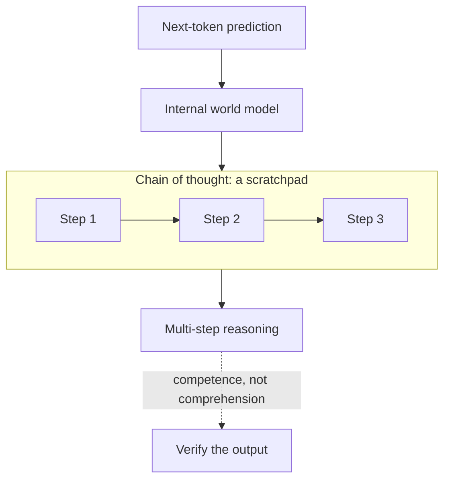
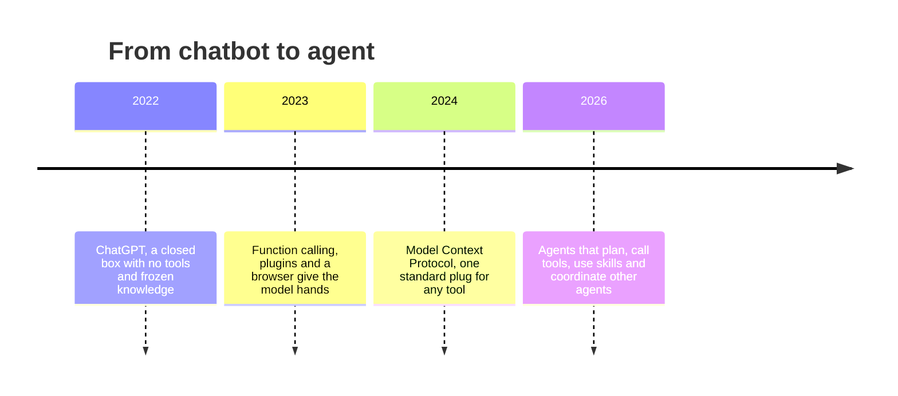
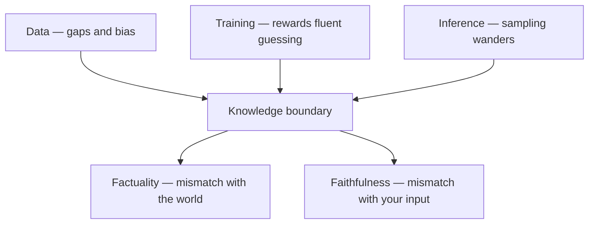
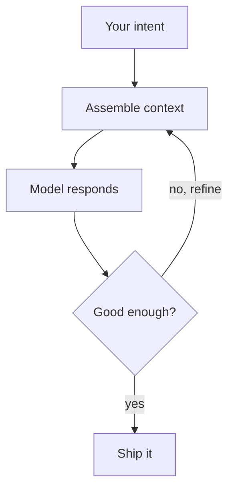

# Chapter 1 — Foundations (The Way)

This chapter lays the foundations: what AI is and how it got here, how a language model actually works, how the tools climbed from chatbot to agent, what they still cannot do, how I came to trust them, the mental model worth holding, and the principles that follow. Everything later rests on them.

## 1.1 What AI Is, and How It Got Here

Artificial intelligence is older than the chatbots that made it famous. The term was coined in 1956, at a summer workshop at Dartmouth College where a small group proposed that learning and intelligence could be described precisely enough for a machine to simulate them (["History of artificial intelligence," n.d.](https://en.wikipedia.org/wiki/History_of_artificial_intelligence)). The decades that followed ran hot and cold. Early systems encoded human knowledge as hand-written rules — *expert systems* that worked inside a narrow domain and broke outside it — and twice the field's promises outran its results badly enough to trigger an "AI winter" of lost funding and faith.

A different idea ran quietly alongside the rules: let a machine learn from data instead of being told the rules. The perceptron, a simple mathematical model of a neuron, dates to 1958 (["Perceptron," n.d.](https://en.wikipedia.org/wiki/Perceptron)), but neural networks stayed a backwater for decades, starved of the data and computing power they needed. That changed around 2012, when *deep learning* — neural networks many layers deep, each layer learning features at a higher level of abstraction — began to win at image recognition by a wide margin, and the approach moved to the centre of the field (["Deep learning," n.d.](https://en.wikipedia.org/wiki/Deep_learning)). The shift was from telling a machine the rules to letting it find them in examples.

The architecture that made language work arrived in 2017, when researchers at Google introduced the *transformer*. Its *attention* mechanism lets the model weigh every word against every other, so it could learn the long-range structure of text far better than anything before it ([Vaswani et al., *Attention is all you need*, 2017](https://arxiv.org/abs/1706.03762)). Scale did the rest. Train a transformer to predict the next word across enough text and it becomes a *large language model*; make it large enough and it turns fluent. That is the line that runs to ChatGPT in late 2022, and to everything in this book.

Before the argument, let me set the scene, since the terms move quickly. When I say *artificial intelligence*, I mean the present generation of large language models — systems trained on enormous quantities of text, and increasingly images and sound, that respond to plain-language requests with fluent prose, working code, and structured analysis.

The most capable of these are called *frontier models*: the handful of largest, most general systems from a few well-resourced labs, the ones that set the pace and that everyone else measures against. ChatGPT, Claude, and Gemini are the familiar names; behind them sits a *foundation model*, a single large network trained once at great expense and then adapted to countless tasks.

> [!NOTE]
> A few terms used throughout, defined plainly:
>
> - **Large language model (LLM)** — a network trained to predict the next word, which in scale yields fluent prose, code, and analysis.
> - **Foundation model** — one large model trained once, then adapted to many tasks.
> - **Frontier model** — the largest, most general foundation models that set the pace (ChatGPT, Claude, Gemini).
> - **Loopcraft** — the practice of working in tight cycles of ask, check, and adjust, rather than chasing one perfect instruction.

Two facts about 2026 frame everything that follows. The first is that these tools are everywhere: roughly 88% of organisations report using AI, even as most are still experimenting rather than depending on it ([Stanford HAI, *The AI index 2026 annual report*, 2026](https://hai.stanford.edu/ai-index/2026-ai-index-report); [McKinsey & Company, *The state of AI*, 2025](https://www.mckinsey.com/capabilities/quantumblack/our-insights/the-state-of-ai)). The second is that the field has quietly conceded the model alone is no longer the product; the leading labs now compete on the scaffolding around it — the workflows, the memory, the economics of running it well.

Capability has rocketed, yet so has its unevenness, and the hard part has shifted from getting an answer to trusting one. That shift is what this book is for.

## 1.2 How a Language Model Works

Underneath the surface, a large language model does one thing: it predicts the next token. Given all the text so far, it guesses the next word, then the next, then the next. It was trained on vast amounts of text, so it has learned the probability of each possible next token, and it writes by sampling from those probabilities one token at a time. Stephen Wolfram puts it plainly: the system is always just "adding one word at a time," picking a reasonable next token and, with a little randomness in the sampling, favouring variety over the single likeliest word ([Wolfram, *What is ChatGPT doing … and why does it work?*, 2023](https://writings.stephenwolfram.com/2023/02/what-is-chatgpt-doing-and-why-does-it-work/)). Nothing in the mechanism consults a fact store or checks whether the result is true. It produces the most plausible continuation, no more.

> [!NOTE]
> A **token** is the unit a model actually reads and writes — not quite a word, but a common chunk of text: a whole word like " the", a word-piece like "pre" or "ing", a punctuation mark, or a lone character. Before the model sees anything, text is split into tokens drawn from a fixed vocabulary of tens of thousands, which is why a model can coin new words, and why an unusual name or a long number can cost several tokens each. A rough rule of thumb for English: one token runs about four characters, or three-quarters of a word — so token counts, which is what context limits and bills are measured in, never quite match word counts.

This raises an obvious question: if the model only guesses the next token, how does it reason at all, and why does it so often seem intelligent? The start of an answer is that predicting the next token well is not a shallow trick. To guess the next move in a game, the next line of a proof, or the next clause of a contract, the cheapest strategy available to a large enough network is not to memorise surface patterns but to build an internal model of whatever produced the text. The cleanest demonstration trains a small GPT to do one thing: predict legal moves in the board game Othello. It is given no rules and no picture of the board. Yet it develops an internal representation of the board state — one researchers can read out, and even edit to change its moves, which proves the model actually uses it ([K. Li et al., *Emergent world representations: Exploring a sequence model trained on a synthetic task*, 2023](https://arxiv.org/abs/2210.13382)). Wolfram frames the same surprise at the level of language itself: a next-token predictor can write a passable essay because doing so turns out to be "computationally shallower" than we assumed — human language is more regular and law-like than it looks, and the model implicitly discovers those regularities in training ([Wolfram, 2023](https://writings.stephenwolfram.com/2023/02/what-is-chatgpt-doing-and-why-does-it-work/)).

That hidden structure is what reasoning draws on, but a single pass through the network is a shallow computation: the model must answer the moment it stops reading. Letting it write intermediate steps first — a *chain of thought* — changes what the model can do, because every token it emits becomes input it can condition on next, so a hard problem can be spread across many small, reliable steps instead of one leap ([Wei et al., *Chain-of-thought prompting elicits reasoning in large language models*, 2022a](https://arxiv.org/abs/2201.11903)). This is not a trick. A transformer forced to answer immediately provably cannot solve some strikingly simple problems — whether two nodes in a graph connect, or what a small state machine does — that the very same transformer *can* solve once allowed a scratchpad, because the intermediate tokens genuinely extend its computational reach ([Merrill & Sabharwal, *The expressive power of transformers with chain of thought*, 2024](https://arxiv.org/abs/2310.07923)). And the reason it works traces straight back to prediction: human writing comes in overlapping local clusters, so a model trained to predict it learns reliable short hops between related ideas and chains them into conclusions it could never reach in a single stride ([Prystawski et al., *Why think step by step? Reasoning emerges from the locality of experience*, 2023](https://arxiv.org/abs/2304.03843)).

Stack enough of this and whole abilities appear to switch on with scale — multi-step arithmetic, transliteration, chained logic that smaller models simply lack ([Wei et al., *Emergent abilities of large language models*, 2022b](https://arxiv.org/abs/2206.07682)). It is tempting to read that as a spark of understanding finally catching. The cautious reading, and the better-supported one, is that much of the drama lives in how we keep score: grade a task all-or-nothing and a steadily improving skill looks like a sudden leap, but measure it on a smooth scale and the cliff often flattens into a slope ([Schaeffer et al., *Are emergent abilities of large language models a mirage?*, 2023](https://arxiv.org/abs/2304.15004)). So the honest answer is the one the rest of this chapter sharpens: the model reasons by building and chaining the structure that prediction forced it to learn. That reasoning is real and useful, but it is not the same as knowing. It is competence without comprehension, and it looks most convincing exactly where you have not yet checked it.

```mermaid
flowchart TB
    P[Next-token prediction] --> W[Internal world model]
    W --> S
    subgraph S [Chain of thought: a scratchpad]
      direction LR
      S1[Step 1] --> S2[Step 2] --> S3[Step 3]
    end
    S --> R[Multi-step reasoning]
    R -.->|competence, not comprehension| V[Verify the output]
```

## 1.3 From Chatbot to Agent

It helps to remember how fast the tools themselves have changed, because the kind of work you can trust to them changed at each step. The ChatGPT that startled everyone in late 2022 was a closed box: it answered only from what it had absorbed during training, with no memory of you, no access to the internet, and no way to act in the world ([OpenAI, *Introducing ChatGPT*, 2022](https://openai.com/index/chatgpt/)). It was articulate and frozen — confident inside its training data, and blind, often cheerfully, beyond it.

The first real change was giving the model hands. In 2023 OpenAI added *function calling* — a way for the model to recognise that a question needs a tool and to emit a structured request to run it — alongside plugins and a browser, so it could search the web, run code, or query a database instead of guessing ([OpenAI, *Function calling and other API updates*, 2023](https://openai.com/index/function-calling-and-other-api-updates/)). The predictor of text became something that could also take actions and read back the results.

At first each of those connections was hand-built, one wiring job per tool. In late 2024 Anthropic published the *Model Context Protocol*, an open standard that lets any model plug into any tool or data store through one shared interface — much as a single USB port replaced a drawer of incompatible cables ([Anthropic, *Introducing the Model Context Protocol*, 2024b](https://www.anthropic.com/news/model-context-protocol)). Connecting a model to your files, your code, or your systems stopped being a custom project and became a setting.

What that unlocked is the *agent*: a model placed in a loop and allowed to plan, call a tool, read what comes back, and try again until a goal is met. By 2026 this is where the work is. Coding platforms like Claude Code and GitHub Copilot edit across a whole codebase and run their own tests; the more capable agents now reach for *skills* — packaged, reusable know-how they can load on demand — and even hand sub-tasks to other agents. The arc, in one line, runs from a clever box that only talked, to a system that acts, checks, and coordinates. Everything in this book assumes that second world.

> [!NOTE]
> An **agent** is an LLM running tools in a loop to reach a goal ([Willison, *I think “agent” may finally have a widely enough agreed upon definition to be useful jargon now*, 2025](https://simonwillison.net/2025/Sep/18/agents/)). A **tool** is an action it may take — web search, code execution, file edits — and the **loop** runs until a stopping condition is met. An agent has no agency in the moral sense: a computer cannot be held accountable, so you stay responsible for what it ships.

```mermaid
timeline
    title From chatbot to agent
    2022 : ChatGPT, a closed box with no tools and frozen knowledge
    2023 : Function calling, plugins and a browser give the model hands
    2024 : Model Context Protocol, one standard plug for any tool
    2026 : Agents that plan, call tools, use skills and coordinate other agents
```

It is worth watching how fast the coding tools themselves climbed, because each rung changed what you could safely hand off. The earliest assistants barely earned the name. Tabnine, which began in 2018 as a deep-learning autocompleter, simply finished the line you were already typing — a cleverer tab key (["Tabnine," n.d.](https://en.wikipedia.org/wiki/Tabnine)). GitHub Copilot, launched in 2021 and trained on public code, went a step further: from a comment or a function name it would draft the whole body, though it still lived inside your editor and volunteered only the next few lines ([GitHub, *Introducing GitHub Copilot: AI pair programmer*, 2021](https://github.blog/2021-06-29-introducing-github-copilot-ai-pair-programmer/)).

The next rung was conversation. Through 2023 these tools grew a chat window: you could ask why a test failed, request a refactor, or have a tangle of code explained in plain English ([GitHub, *GitHub Copilot November 30th update*, 2023](https://github.blog/changelog/2023-11-30-github-copilot-november-30th-update/)). The autocompleter became something you could interrogate — but you were still driving, accepting or rejecting each suggestion line by line.

The next leap came from tools built for AI from the ground up rather than bolted onto an existing editor. Cursor, launched in 2023 as a fork of VS Code, put the agent at the centre: it could search a whole codebase, edit many files, and run terminal commands from a plain-language request (["Cursor," n.d.](https://en.wikipedia.org/wiki/Cursor_(company))). The open-source *aider* did the same from the command line, pairing with you in the terminal and committing each change to version control so nothing was lost ([aider, *aider*, n.d.](https://aider.chat/)).

Then the agent stepped out of the editor altogether. In February 2025 Anthropic released *Claude Code*, an agent that lives in your terminal — describe a task and it plans, edits, runs the tests, and iterates until it is done ([Anthropic, *Claude Code*, 2025a](https://claude.com/product/claude-code)); OpenAI's Codex CLI and Google's Gemini CLI soon followed. GitHub Copilot, the tool that began the wave, grew its own *agent mode* in early 2025 ([GitHub, *GitHub Copilot: The agent awakens*, 2025b](https://github.blog/news-insights/product-news/github-copilot-the-agent-awakens/)) and then an asynchronous *coding agent* you assign an issue, which spins up a cloud workspace and opens a pull request for review ([GitHub, *GitHub Copilot: Meet the new coding agent*, 2025a](https://github.blog/news-insights/product-news/github-copilot-meet-the-new-coding-agent/)).

By late 2025 the frontier shifted again, from one agent to many. Cursor 2.0 and Google's *Antigravity* — announced in November 2025 alongside the Gemini 3 model — added a manager's view for running several agents in parallel across a codebase, each labouring away while you supervise from above (["Google Antigravity," n.d.](https://en.wikipedia.org/wiki/Google_Antigravity)). The human's seat moved from typing each line to setting goals, reviewing results, and directing a small fleet.

By 2026 the editor itself is no longer the centre of gravity. With capable models available from every lab, the model became the commodity, and the value moved into the system wrapped around it — what practitioners now call the *dev stack* ([Latent Space, *AINews*, 2026a](https://www.latent.space/s/ainews)).

| Layer | What it does | Examples (2026) |
| --- | --- | --- |
| Model | Generates the code | GPT-5.6 Sol, Claude Opus 4.8, Gemini 3.5, GLM-5.2 |
| Harness | Wraps the model into an agent: tools, retries, sandbox | Claude Code, Codex CLI, Gemini CLI, Cursor SDK |
| Meta-harness | Coordinates several harnesses | Conductor, Zed ACP, Vercel Eve, Heypi |
| Workflow / async | Fire-and-forget delegation in shared channels | Claude Tag (Slack), Copilot coding agent, Devin, Google Spark |
| Memory | State kept outside the context window | agentmemory, codegraph, channel memory |
| Eval | Automated judgement of quality | FrontierCode, Terminal-Bench 2.1, SWE-bench Pro |

Each layer is a discipline in its own right, and the rest of this book climbs them: the *harness* that turns a model into an agent, the *meta-harness* that coordinates several, the *memory* that lets work persist, and the *eval* that decides whether the result is good enough. The lesson is the one the landscape already hinted at — the model is the easy part; the craft is everything you build around it.

By 2026 the same pattern spilled out of the developer's editor and into everyone's hands. Open-source personal agents led the way: OpenClaw popularised the always-on assistant that runs around the clock on your own machine ([Wired, *Gemini Spark is Google’s response to OpenClaw’s 24/7 AI agent*, 2026](https://www.wired.com/story/googles-response-to-openclaws-24-7-ai-agent/)), and Nous Research's *Hermes Agent* gave it a self-improving twist — an autonomous agent that lives on a cheap server, reachable from Telegram or Slack, writing its own skills from experience and deepening a model of your work across sessions ([Nous Research, *Hermes Agent*, 2026](https://hermes-agent.nousresearch.com/docs/)). The labs followed onto the desktop and into the cloud: Google's *Gemini Spark*, unveiled at I/O in May 2026, runs continuously across Gmail, Calendar, and Docs even with your laptop shut ([Cerullo, *Why Google’s Gemini Spark AI agent could be a game changer*, 2026](https://www.cbsnews.com/news/google-gemini-spark-ai-agent/)), while Anthropic's *Claude Cowork* — a research preview from January 2026 — handed the coding agent's powers to non-programmers, working files and documents on the desktop inside a sandbox ([Rogers, *Anthropic’s Claude Cowork is an AI agent that actually works*, 2026](https://www.wired.com/story/anthropic-claude-cowork-agent/)). The agent had left the editor; what remains is to use that shift with judgement rather than awe.

In the first half of 2026, AI stopped being a platform shift and became a regulated strategic technology. Three things happened at once, and they explain the world this book is written into.

First, the models grew up. A year ago they could resolve about three in five real software issues; today the best clear nearly all of them. Capability raced ahead — though, as we just saw, unevenly. Adoption followed: roughly 88% of organisations now use AI, and four in five students. Power, not chips, became the main limit on training.

Second, the advantage moved. The frontier labs no longer sell a model; they sell the system around it — the harness, the workflow, the memory, the economics. Prompt-crafting gave way to *loopcraft*: stacking iterative cycles around a model. Agents climbed out of the chat box into shared channels, async and proactive. And open-weight models from China drew level, so no single vendor is safe to lean on.

Third, the rules arrived. Governments now gate frontier releases, and courts have begun treating AI output as the deploying organisation's own words. Access, not just compute, is now a geopolitical lever. The figures below tell the two halves of the story — capability soaring, value still scarce.

| Signal | Figure | Implication |
| --- | --- | --- |
| Organisations using AI | 88% | Adoption is universal; scaling is not |
| SWE-bench Verified (coding) | 60% → ~100% in a year | Capability accelerating |
| US businesses paying for AI | 5% (2023) → 44% | Commercial traction is real |
| US–China top-model gap | ~2.7% | No single safe vendor; open weights close behind |
| Orgs reporting enterprise value | minority | Usage is easy; value is the scarce skill |

Sources: [Stanford HAI, 2026](https://hai.stanford.edu/ai-index/2026-ai-index-report); [McKinsey & Company, 2025](https://www.mckinsey.com/capabilities/quantumblack/our-insights/the-state-of-ai); [Benaich, *State of AI report 2025*, 2025](https://www.stateof.ai/). (*SWE-bench Verified* is a standard benchmark of real GitHub software issues a model is asked to fix.)

The pattern that matters most is the gap between using AI and getting value from it. Nearly everyone has access; only a minority report real returns. The lesson for us is that the edge no longer comes from picking the best model — it comes from how you wrap it: the workflow you build, the context you feed it, the way you check its work. That is what the rest of this book teaches.

## 1.4 The Limits That Remain

The same next-token mechanism that makes a model fluent also sets hard limits on what it can be trusted to do, and the first is strange: the model is not even reproducible. You might expect that turning the randomness off — sampling at *temperature zero*, always taking the single likeliest token — would make the same prompt return the same answer every time. Usually it does not. A busy server batches many users' requests together, and the size of that batch changes from moment to moment. So the low-level arithmetic runs in a slightly different order each time, and with finite-precision numbers a different order gives a slightly different result: one run continues "Queens, New York" where the next gives "New York City" ([He, *Defeating nondeterminism in LLM inference*, 2025](https://thinkingmachines.ai/blog/defeating-nondeterminism-in-llm-inference/)). The gap is tiny, but it compounds. In a reasoning model, a rounding difference in an early token can cascade into a different chain of thought and a different final answer ([Yuan et al., *Understanding and mitigating numerical sources of nondeterminism in LLM inference*, 2025](https://arxiv.org/abs/2506.09501)). So you cannot treat a model like ordinary software that returns the same output for the same input; a test or a check has to allow for variation rather than assume it away.

That is why a hallucination — confident, well-formed output that happens to be false — is the system working as designed, not malfunctioning. It is a plausible completion, not a lie ([Karpathy, *microGPT*, 2026b](https://karpathy.github.io/2026/02/12/microgpt/)). It also means competence is *jagged*: uneven across tasks that look alike to us, because the model's strength tracks the density of its training data, not the difficulty we perceive.

The Stanford Index makes the gap vivid. A model can win a gold medal at the Mathematical Olympiad yet read an analog clock right only about half the time ([Stanford HAI, 2026](https://hai.stanford.edu/ai-index/2026-ai-index-report)). Olympiad proofs fill the training text; clock-reading is a perceptual task that does not. Knowing where that line falls is most of the skill.

| Reliable | Brittle |
| --- | --- |
| Fluent drafting, summarising, translation | Exact arithmetic, counting, fresh facts |
| Pattern-rich code and refactors | Long-horizon plans without checkpoints |
| Synthesis over provided context | Recall as context grows (context rot) |

The brittleness is not anecdotal, and the strongest evidence names where the failure lives. Huang and colleagues survey hundreds of studies and split hallucination along two axes worth holding apart. *Factuality* asks whether output matches the world; *faithfulness* asks whether it matches the input you gave it — a summary can be perfectly factual yet unfaithful by adding true claims you never supplied. They trace both to three stages: the *data*, with its gaps and bias; the *training*, which rewards fluent guessing over admitting ignorance; and *inference*, where sampling wanders. The unifying idea is the *knowledge boundary* — the edge of what a model has stored, past which it cannot tell what it knows from what it does not ([Huang et al., *A survey on hallucination in large language models: Principles, taxonomy, challenges, and open questions*, 2024](https://arxiv.org/abs/2311.05232)). Everything below measures that boundary.

```mermaid
flowchart TB
    D[Data — gaps and bias] --> KB[Knowledge boundary]
    T[Training — rewards fluent guessing] --> KB
    I[Inference — sampling wanders] --> KB
    KB --> F1[Factuality — mismatch with the world]
    KB --> F2[Faithfulness — mismatch with your input]
```

Prato and colleagues make it observable with a clean test. Train a model on synthetic documents, then ask it to recall *exactly* what it was given — no more, no less. Over-recall is fabrication, under-recall is omission, so hitting the right count proves the model knows its own scope. This self-knowledge is *scale-gated*: below a size threshold the count is near-random, and only past it does it come out right, the threshold set by architecture, not parameters alone ([Prato et al., *Do large language models know how much they know?*, 2025](https://arxiv.org/abs/2502.19573)). So self-knowledge is a property of the specific model, and small models are least trustworthy at the edge where you most want them to hesitate.

Gu and colleagues pin the boundary to its cause: how often a fact appeared in training. Using a model whose whole corpus is open, they split questions into seen and unseen, then test recall. Closed-book accuracy more than doubles from rare to frequent facts and collapses to about one percent on unseen ones; distractor passages drag it lower as they pile up ([Gu et al., *NanoKnow: How to know what your language model knows*, 2026](https://arxiv.org/abs/2602.20122)). The brittle column now has a mechanism: fresh and long-tail facts fail because they were rare, retrieval can patch the gap, and noisy retrieval reopens it.

Code shows the same split, between reading a program and predicting how it *runs*. Asked to forecast memory, runtime, and profiler ranks on real SWE-bench fixes, twelve frontier models — gpt-5.5 and Claude Opus among them — reach just 0.842 on the test-outcome F1 score (a 0–1 measure of accuracy that balances misses against false alarms), and profiler recall@5 stays under 0.2: fluent on structure, brittle on execution ([Bogomolov & Zharov, *Towards evaluation of implicit software world models in coding LLMs*, 2026](https://arxiv.org/abs/2606.27406)). Long context offers no refuge. Accuracy peaks when the needed fact sits at the start or end and sags in the middle ([Liu et al., *Lost in the middle: How language models use long contexts*, 2023](https://arxiv.org/abs/2307.03172)). The cause is mechanical — a U-shaped attention bias for position over relevance — and calibrating it lifts mid-context recall by 6–15 points ([Hsieh et al., *Found in the middle: Calibrating positional attention bias improves long context utilization*, 2024](https://arxiv.org/abs/2406.16008)).

| Study | What it measured | Finding | Lesson |
| --- | --- | --- | --- |
| [Huang et al., 2024](https://arxiv.org/abs/2311.05232) | A taxonomy of hallucination | Factuality vs faithfulness; failures seeded in data, training, inference | Name the failure before trying to fix it |
| [Prato et al., 2025](https://arxiv.org/abs/2502.19573) | Exact-recall self-knowledge | Knowing one's own scope switches on only past a size threshold | Small models hesitate least where they should most |
| [Gu et al., 2026](https://arxiv.org/abs/2602.20122) | Recall vs how often a fact was seen | Accuracy doubles from rare to frequent; ~1% on unseen | Fresh and long-tail facts fail; retrieval can patch the gap |
| [Bogomolov & Zharov, 2026](https://arxiv.org/abs/2606.27406) | Predicting how code runs | F1 0.842; profiler recall@5 under 0.2 | Fluent on structure, brittle on execution |
| [Liu et al., 2023](https://arxiv.org/abs/2307.03172); [Hsieh et al., 2024](https://arxiv.org/abs/2406.16008) | Fact position in long context | U-shaped recall; the middle sags, +6–15 pts when calibrated | Put the facts that matter at the edges |

A final limitation is subtler than any wrong fact: the model is built to *sound* right whether or not it is. Three mechanisms push it that way. First, the training text carries emotional charge — "differentiation" keeps company with *unique* and *opportunity*, "cost-cutting" with *race to the bottom* — and the model absorbs those associations as statistics about how we write. Anthropic's interpretability team can even read them off as internal "emotion vectors," organised like human affect along an axis from positive to negative; steering a model toward the positive end measurably increases its sycophancy ([Sofroniew et al., *Emotion concepts and their function in a large language model*, 2026](https://transformer-circuits.pub/2026/emotions/index.html)). Second, reinforcement learning from human feedback tunes the model toward answers raters like. Raters can always tell whether a reply sounds confident, but not always whether it is correct, so fluency gets rewarded over accuracy ([Casper et al., *Open problems and fundamental limitations of reinforcement learning from human feedback*, 2023](https://arxiv.org/abs/2307.15217)). Third, generation compounds the bias one token at a time: a sentence that opens "the company should pursue a bold…" rolls on to "differentiation strategy" by momentum alone. The result is a voice that is confident, fluent, and quick to agree. Read its confidence as a habit of style, not as evidence.

> [!NOTE]
> Two mechanisms named above, defined plainly:
>
> - **Transformer** — the neural-network design behind today's language models. Its *attention* step lets the processing of each token draw on every earlier token, which is what makes modelling long passages of language work.
> - **RLHF (reinforcement learning from human feedback)** — a tuning step after the main training, in which human raters score answers and the model is nudged toward the kind they prefer. It improves helpfulness, but rewards what *sounds* good — one root of the confident, agreeable tone above.

These limits are a map, not a verdict. Spend effort where the model is strong, verify at the boundaries — fresh facts, exact counts, mid-context recall — keep a human in the loop for judgement, and stay most alert when the output sounds most certain.

## 1.5 From Sceptic to Practitioner

When I first started cooking, my early attempts did not fare well. I had the recipe and the ingredients, yet the results were grim — onions scorched while I chopped the next thing, pasta turned to glue, unbalanced taste. The problem was not the recipe. I had skipped the fundamentals: heat control, timing, tasting as you go, getting everything prepped before the pan ever warmed. Once those became second nature, almost any recipe came out well.

Working with AI is the same. How you use the tool matters as much as the tool itself.

I began 2026 as an AI sceptic. I read Ed Zitron — the tech critic whose newsletter [Where's Your Ed At](https://www.wheresyoured.at/) dismantles industry hype — and Gary Marcus, the cognitive scientist whose [Marcus on AI](https://garymarcus.substack.com/) has argued for years that large language models are shallow pattern-matchers rather than reasoners, and I cheered them both on. Cory Doctorow's [Pluralistic](https://pluralistic.net/) sharpened the same suspicion from the political side, naming the slow rot by which platforms turn on their own users. I laughed at the vibe coders for their naivety, and assumed anyone who installed OpenClaw was an idiot.

So when a global client hired me to write their AI strategy, I expected the deliverable to be a cautionary tale: be realistic, resist the hype, install guardrails, avoid the traps. Over the last several months, I realised I was the one who was naive. The AI landscape had been transformed. Claude Desktop with Cowork, Microsoft 365 Copilot with WorkIQ, and Google's Gemini Spark turned the ordinary instruments of knowledge work — documents, spreadsheets, inboxes, slide decks — into things an agent could draft, revise, and act on; Claude Code and GitHub Copilot did the same for software, crossing from clever autocomplete to systems that plan, edit across a whole codebase, and run their own work. Personal agents like OpenClaw and Hermes Agent pushed that capability out of the labs and into anyone's hands. Using them in earnest changed my mind: the productivity gains are now genuinely real.

Vibe coding is real. I managed to refactor and clean every line of code I have ever written (not a lot, since my career has never been in software development) and all my projects now feature gleaming, shiny, clean code. I have successfully finished dozens of vibe coded projects without reviewing a single line of code. I now firmly believe I will never read or write code ever again in my life.

I also believe using AI to do research, analytics, planning and a bunch of other white collar activities are also real.

And yet Ed and Gary are still right: AI does not think or create, it transforms and multiplies. It vibe-codes well only if you already understand large systems; it makes good art only if you are a good artist. Used carelessly it produces slop. Using it well is itself a skill, and most people do not yet have it. That gap — between a tool anyone can touch and a craft few have learned — is why I wrote this book.

Let me be plain about where I have landed, because it is narrower than my enthusiasm might suggest. I remain a sceptic. The conversion I describe is confined to my work — the productivity of knowledge work and the building of software — and even there it is conditional, earned task by task and checked at every step. In my personal life I keep AI at arm's length: I do not hand it my relationships, my judgement, or my inner weather, and the chapter on the cost of getting it wrong explains why. So read this as a work book with a deliberate boundary. Much of my motivation for writing it is defensive — to spare you the common mistakes and quiet pitfalls that come from trusting these tools where they have not earned it.

Used badly, these tools do not just waste time — they distort judgement. Clinicians have begun describing "AI psychosis," where heavy users spiral into delusion after a chatbot mirrors and amplifies their worst ideas instead of pushing back. Others form genuine attachments to a companion app, mistaking fluent warmth for understanding, and grieve when a model is retired. A confident voice that never tires is easy to trust and hard to doubt; one writer likens it to a court jester — fluent, flattering, and so easy to follow that its answers *feel* right whether or not they are, leaving you confident and wrong ([Johnson Spink, *The AI jester: How AI makes you confident and wrong*, 2026](https://www.linkedin.com/pulse/ai-jester-how-makes-you-confident-wrong-johnson-spink-gg3df/)).

The quieter harm is over-reliance. People paste in an answer they never checked, accept a summary that dropped the one caveat that mattered, or treat a tidy explanation as proof the system understands. It does not. Believing the machine is sentient, or simply infallible, is the fastest way to ship its mistakes as your own.

This is not a private failing; it scales with authority. Futurism has documented bosses who route every decision through a chatbot — drafting their messages with it, demanding staff "discuss with the AI" before speaking to a human, even asking it whom to hire and fire ([Harrison Dupré, *Bosses are becoming obsessed with AI, using it to make every decision, barraging their employees with nonsensical ChatGPT directives, and even asking it who to fire*, 2026](https://futurism.com/artificial-intelligence/bosses-obsessed-with-ai)). The pattern is always the same: a leader mistakes the model's sycophancy for counsel, since it will, as one worker put it, "spit out the narrative that you want it to spit out," and so the tool meant to raise productivity instead manufactures whiplash, distrust, and resignations. The danger is not that the machine decides, but that a person stops.

So the public mood has soured. Trust in AI is falling even as use rises, and every fabricated citation, biased decision, or polished falsehood deepens the suspicion. That distrust is rational — and it is also a gap to be closed. The cure is not blind faith or blanket refusal, but skill: knowing when to lean in, when to verify, and when to walk away. Teaching that skill is the rest of this book.

## 1.6 Mental Models for AI

The most useful shift I made early on was to stop treating the model as an oracle. An oracle gives one answer and you take it or leave it. A good model is more like a clever junior colleague: ask, glance at the draft, say "closer, but tighten the intro," and go again. So treat it as a loop — intent enters, context is assembled, a response comes back, you refine — iterating until the output is good enough.

```mermaid
flowchart TB
    A[Your intent] --> B[Assemble context]
    B --> C[Model responds]
    C --> D{Good enough?}
    D -- no, refine --> B
    D -- yes --> E[Ship it]
    classDef loop fill:#eef,stroke:#88a
    class B,C,D loop
```

Quality lives in that loop, not in any single message. The model rarely converges first pass, and it cannot read intentions you never stated — so your half of the work is to say clearly *what* you want and how you will know it is right, then leave *how* to build it to the model, which is at its best filling in plausible detail you would not have thought to specify. Start with one clear ask and add the next only once you have read what came back. That same loop is the right picture for *agent*, a word you will meet constantly.

So frame each task as a goal, the context it needs, and a check; then iterate. Because an agent runs many steps on its own, it can fix on a wrong approach and pursue it fluently and fast — so keep half an eye on the run and stop it to re-steer the moment it heads the wrong way, rather than waiting for a result you will only discard. The failure mode is reading fluency as truth. A confident answer and a correct one look identical until you check — the model will cite a court case or a statistic in the same calm voice whether or not it exists — which is why verification is the habit that holds.

## 1.7 Principles to Carry Forward

The practice that fills the rest of this book rests on a stance, worth stating plainly before the principles that follow. The name in the title carries it in miniature, and each half pulls in a direction worth understanding.

The care half, the 愛, is not vague. Care ethics names concrete duties — attentiveness, responsibility, competence, responsiveness — and they translate into accountability for what the machine produces (["Ethics of care," n.d.](https://en.wikipedia.org/wiki/Ethics_of_care)).

The other half, the 道, matters as much. A discipline ending in 道 is never finished; it is practised. AI-dō treats AI the same way: a discipline to refine, not a trick to copy. It descends from the intelligence-augmentation tradition, which sees machines as complements to human judgement, not substitutes (["Intelligence amplification," n.d.](https://en.wikipedia.org/wiki/Intelligence_amplification)).

My reason is pragmatic, not romantic: tools commoditise, and so, in time, do methods. A prompt is one model release from obsolete; a clever technique lasts a little longer, then it too is overtaken. What endures is the stance beneath them — how you frame a problem, gather context, and verify a result. So this book is less a kit of methods than a philosophy of working with AI, one that outlives any particular trick or tool. Learn the philosophy, and the methods become yours to invent.

The chapter rests on a handful of claims worth carrying into everything that follows.

- **Treat it as a loop, not an oracle.** Frame each task as a goal, the context it needs, and a check, then iterate — change one thing at a time, read what comes back, and let the approach evolve rather than demanding the finished answer in a single leap. Quality lives in that loop, not in any one message, so start simple and add only what the last round showed was missing; the same instinct scales up, growing a throwaway prompt into a reusable skill and then a shared tool (Chapter 2). An agent is just a model running tools in that same loop, so you stay responsible for what it ships.
- **Say what, not how.** Give the model your *intent* — the goal and the checks that define success — and leave the implementation to it; choosing pattern-rich detail you would never have thought to name is the thing it is genuinely good at, and over-specifying the *how* fights that strength. Separating what you want from how it is built is the discipline the software chapters sharpen into a method they call ICE (Chapter 3).
- **It predicts; it does not know.** A model samples the most plausible next token, so fluent, confident, and wrong are perfectly compatible — a hallucination is the mechanism working as designed, not breaking. It is not even reproducible: the same prompt can return different answers, even with the randomness turned off, so never treat it as deterministic software.
- **It reasons by chaining learned structure.** Predicting text well forces internal models of the world, and a chain of thought turns one shallow pass into genuine multi-step computation — real competence, but not comprehension.
- **Competence is jagged.** Strength tracks the density of training data, not the difficulty you perceive: Olympiad proofs yes, an analog clock no. Find that line before you trust the output.
- **Mind the knowledge boundary.** Accuracy more than halves on rare facts and collapses on unseen ones, sags in the middle of long context, and the smallest models are least able to tell what they do not know. Retrieval patches the gap; noisy retrieval reopens it.
- **Fluency is not truth.** Reinforcement learning and the emotional charge of training text tune the model to sound right and to agree; read confidence as style, not as evidence.
- **The edge is method, not model.** We all draw on the same frontier models, so advantage comes from the scaffolding — the workflow you build, the context you supply, and the way you check the result. Tools commoditise and methods outlive them, which is why this book teaches a practice, not a kit of tricks.
- **The tools climbed from autocomplete to a stack.** In a few years coding assistants went from finishing your line, to chatting, to agents that plan, edit, and open pull requests, and on to managers running several agents at once — and out of the editor entirely, into always-on personal agents like OpenClaw, Hermes Agent, and Gemini Spark. The model is now the commodity; the value sits in the *dev stack* around it — harness, workflow, memory, and the evals that judge the work.
- **Verify where it is weak, lean in where it is strong.** Spend the model's strength freely, keep a human in the loop for judgement, and be most sceptical exactly when the answer sounds most certain.

## References

aider. (n.d.). *aider*. [https://aider.chat/](https://aider.chat/)

Anthropic. (2024b). *Introducing the Model Context Protocol*. [https://www.anthropic.com/news/model-context-protocol](https://www.anthropic.com/news/model-context-protocol)

Anthropic. (2025a). *Claude Code*. [https://claude.com/product/claude-code](https://claude.com/product/claude-code)

Benaich, N. (2025). *State of AI report 2025*. [https://www.stateof.ai/](https://www.stateof.ai/)

Bogomolov, E., & Zharov, Y. (2026). *Towards evaluation of implicit software world models in coding LLMs*. DL4Code @ ICML 2026. [https://arxiv.org/abs/2606.27406](https://arxiv.org/abs/2606.27406)

Casper, S., Davies, X., Shi, C., Gilbert, T. K., Scheurer, J., Rando, J., Freedman, R., Korbak, T., Lindner, D., et al. (2023). *Open problems and fundamental limitations of reinforcement learning from human feedback*. Transactions on Machine Learning Research. [https://arxiv.org/abs/2307.15217](https://arxiv.org/abs/2307.15217)

Cerullo, M. (2026). *Why Google’s Gemini Spark AI agent could be a game changer*. CBS News. [https://www.cbsnews.com/news/google-gemini-spark-ai-agent/](https://www.cbsnews.com/news/google-gemini-spark-ai-agent/)

Cursor (company). (n.d.). In *Wikipedia*. [https://en.wikipedia.org/wiki/Cursor_(company)](https://en.wikipedia.org/wiki/Cursor_(company))

Deep learning. (n.d.). In *Wikipedia*. [https://en.wikipedia.org/wiki/Deep_learning](https://en.wikipedia.org/wiki/Deep_learning)

Ethics of care. (n.d.). In *Wikipedia*. [https://en.wikipedia.org/wiki/Ethics_of_care](https://en.wikipedia.org/wiki/Ethics_of_care)

GitHub. (2021). *Introducing GitHub Copilot: AI pair programmer*. GitHub Blog. [https://github.blog/2021-06-29-introducing-github-copilot-ai-pair-programmer/](https://github.blog/2021-06-29-introducing-github-copilot-ai-pair-programmer/)

GitHub. (2023). *GitHub Copilot November 30th update*. GitHub Blog. [https://github.blog/changelog/2023-11-30-github-copilot-november-30th-update/](https://github.blog/changelog/2023-11-30-github-copilot-november-30th-update/)

GitHub. (2025a). *GitHub Copilot: Meet the new coding agent*. GitHub Blog. [https://github.blog/news-insights/product-news/github-copilot-meet-the-new-coding-agent/](https://github.blog/news-insights/product-news/github-copilot-meet-the-new-coding-agent/)

GitHub. (2025b). *GitHub Copilot: The agent awakens*. GitHub Blog. [https://github.blog/news-insights/product-news/github-copilot-the-agent-awakens/](https://github.blog/news-insights/product-news/github-copilot-the-agent-awakens/)

Google Antigravity. (n.d.). In *Wikipedia*. [https://en.wikipedia.org/wiki/Google_Antigravity](https://en.wikipedia.org/wiki/Google_Antigravity)

Gu, Jedidi, & Lin. (2026). *NanoKnow: How to know what your language model knows*. Proceedings of the 49th International ACM SIGIR Conference. [https://arxiv.org/abs/2602.20122](https://arxiv.org/abs/2602.20122)

Harrison Dupré, M. (2026). *Bosses are becoming obsessed with AI, using it to make every decision, barraging their employees with nonsensical ChatGPT directives, and even asking it who to fire*. Futurism. [https://futurism.com/artificial-intelligence/bosses-obsessed-with-ai](https://futurism.com/artificial-intelligence/bosses-obsessed-with-ai)

He, H. (2025). *Defeating nondeterminism in LLM inference*. Thinking Machines Lab. [https://thinkingmachines.ai/blog/defeating-nondeterminism-in-llm-inference/](https://thinkingmachines.ai/blog/defeating-nondeterminism-in-llm-inference/)

History of artificial intelligence. (n.d.). In *Wikipedia*. [https://en.wikipedia.org/wiki/History_of_artificial_intelligence](https://en.wikipedia.org/wiki/History_of_artificial_intelligence)

Hsieh, C.-Y., Chuang, Y.-S., Li, C.-L., Wang, Z., Le, L. T., Kumar, A., Glass, J., Ratner, A., Lee, C.-Y., Krishna, R., & Pfister, T. (2024). *Found in the middle: Calibrating positional attention bias improves long context utilization*. Findings of the Association for Computational Linguistics: ACL 2024. [https://arxiv.org/abs/2406.16008](https://arxiv.org/abs/2406.16008)

Huang, L., Yu, W., Ma, W., Zhong, W., Feng, Z., Wang, H., Chen, Q., Peng, W., Feng, X., Qin, B., & Liu, T. (2024). *A survey on hallucination in large language models: Principles, taxonomy, challenges, and open questions*. ACM Transactions on Information Systems. [https://arxiv.org/abs/2311.05232](https://arxiv.org/abs/2311.05232)

Intelligence amplification. (n.d.). In *Wikipedia*. [https://en.wikipedia.org/wiki/Intelligence_amplification](https://en.wikipedia.org/wiki/Intelligence_amplification)

Johnson Spink, D. (2026). *The AI jester: How AI makes you confident and wrong*. LinkedIn. [https://www.linkedin.com/pulse/ai-jester-how-makes-you-confident-wrong-johnson-spink-gg3df/](https://www.linkedin.com/pulse/ai-jester-how-makes-you-confident-wrong-johnson-spink-gg3df/)

Karpathy, A. (2026b). *microGPT*. [https://karpathy.github.io/2026/02/12/microgpt/](https://karpathy.github.io/2026/02/12/microgpt/)

Latent Space. (2026a). *AINews*. [https://www.latent.space/s/ainews](https://www.latent.space/s/ainews)

Li, K., Hopkins, A. K., Bau, D., Viégas, F., Pfister, H., & Wattenberg, M. (2023). *Emergent world representations: Exploring a sequence model trained on a synthetic task*. International Conference on Learning Representations. [https://arxiv.org/abs/2210.13382](https://arxiv.org/abs/2210.13382)

Liu, N. F., Lin, K., Hewitt, J., Paranjape, A., Bevilacqua, M., Petroni, F., & Liang, P. (2023). *Lost in the middle: How language models use long contexts*. Transactions of the Association for Computational Linguistics. [https://arxiv.org/abs/2307.03172](https://arxiv.org/abs/2307.03172)

McKinsey & Company. (2025). *The state of AI*. [https://www.mckinsey.com/capabilities/quantumblack/our-insights/the-state-of-ai](https://www.mckinsey.com/capabilities/quantumblack/our-insights/the-state-of-ai)

Merrill, W., & Sabharwal, A. (2024). *The expressive power of transformers with chain of thought*. International Conference on Learning Representations. [https://arxiv.org/abs/2310.07923](https://arxiv.org/abs/2310.07923)

Nous Research. (2026). *Hermes Agent*. [https://hermes-agent.nousresearch.com/docs/](https://hermes-agent.nousresearch.com/docs/)

OpenAI. (2022). *Introducing ChatGPT*. [https://openai.com/index/chatgpt/](https://openai.com/index/chatgpt/)

OpenAI. (2023). *Function calling and other API updates*. [https://openai.com/index/function-calling-and-other-api-updates/](https://openai.com/index/function-calling-and-other-api-updates/)

Perceptron. (n.d.). In *Wikipedia*. [https://en.wikipedia.org/wiki/Perceptron](https://en.wikipedia.org/wiki/Perceptron)

Prato, G., Huang, J., Parthasarathi, P., Sodhani, S., & Chandar, S. (2025). *Do large language models know how much they know?* Proceedings of the 2024 Conference on Empirical Methods in Natural Language Processing. [https://arxiv.org/abs/2502.19573](https://arxiv.org/abs/2502.19573)

Prystawski, B., Li, M. Y., & Goodman, N. D. (2023). *Why think step by step? Reasoning emerges from the locality of experience*. Advances in Neural Information Processing Systems. [https://arxiv.org/abs/2304.03843](https://arxiv.org/abs/2304.03843)

Rogers, R. (2026). *Anthropic’s Claude Cowork is an AI agent that actually works*. Wired. [https://www.wired.com/story/anthropic-claude-cowork-agent/](https://www.wired.com/story/anthropic-claude-cowork-agent/)

Schaeffer, R., Miranda, B., & Koyejo, S. (2023). *Are emergent abilities of large language models a mirage?* Advances in Neural Information Processing Systems. [https://arxiv.org/abs/2304.15004](https://arxiv.org/abs/2304.15004)

Sofroniew, N., Kauvar, I., Saunders, W., Chen, A., et al. (2026). *Emotion concepts and their function in a large language model*. Transformer Circuits Thread. [https://transformer-circuits.pub/2026/emotions/index.html](https://transformer-circuits.pub/2026/emotions/index.html)

Stanford Institute for Human-Centered AI. (2026). *The AI index 2026 annual report*. Stanford University. [https://hai.stanford.edu/ai-index/2026-ai-index-report](https://hai.stanford.edu/ai-index/2026-ai-index-report)

Tabnine. (n.d.). In *Wikipedia*. [https://en.wikipedia.org/wiki/Tabnine](https://en.wikipedia.org/wiki/Tabnine)

Vaswani, A., Shazeer, N., Parmar, N., Uszkoreit, J., Jones, L., Gomez, A. N., Kaiser, Ł., & Polosukhin, I. (2017). *Attention is all you need*. Advances in Neural Information Processing Systems. [https://arxiv.org/abs/1706.03762](https://arxiv.org/abs/1706.03762)

Wei, J., Tay, Y., Bommasani, R., Raffel, C., Zoph, B., Borgeaud, S., Yogatama, D., Bosma, M., Zhou, D., Metzler, D., Chi, E. H., Hashimoto, T., Vinyals, O., Liang, P., Dean, J., & Fedus, W. (2022b). *Emergent abilities of large language models*. Transactions on Machine Learning Research. [https://arxiv.org/abs/2206.07682](https://arxiv.org/abs/2206.07682)

Wei, J., Wang, X., Schuurmans, D., Bosma, M., Ichter, B., Xia, F., Chi, E., Le, Q., & Zhou, D. (2022a). *Chain-of-thought prompting elicits reasoning in large language models*. Advances in Neural Information Processing Systems. [https://arxiv.org/abs/2201.11903](https://arxiv.org/abs/2201.11903)

Willison, S. (2025). *I think “agent” may finally have a widely enough agreed upon definition to be useful jargon now*. Simon Willison’s Weblog. [https://simonwillison.net/2025/Sep/18/agents/](https://simonwillison.net/2025/Sep/18/agents/)

Wired. (2026). *Gemini Spark is Google’s response to OpenClaw’s 24/7 AI agent*. Wired. [https://www.wired.com/story/googles-response-to-openclaws-24-7-ai-agent/](https://www.wired.com/story/googles-response-to-openclaws-24-7-ai-agent/)

Wolfram, S. (2023). *What is ChatGPT doing … and why does it work?* Stephen Wolfram Writings. [https://writings.stephenwolfram.com/2023/02/what-is-chatgpt-doing-and-why-does-it-work/](https://writings.stephenwolfram.com/2023/02/what-is-chatgpt-doing-and-why-does-it-work/)

Yuan, J., Li, H., Ding, X., Xie, W., Li, Y.-J., Zhao, W., Wan, K., Shi, J., Hu, X., & Liu, Z. (2025). *Understanding and mitigating numerical sources of nondeterminism in LLM inference*. arXiv. [https://arxiv.org/abs/2506.09501](https://arxiv.org/abs/2506.09501)
