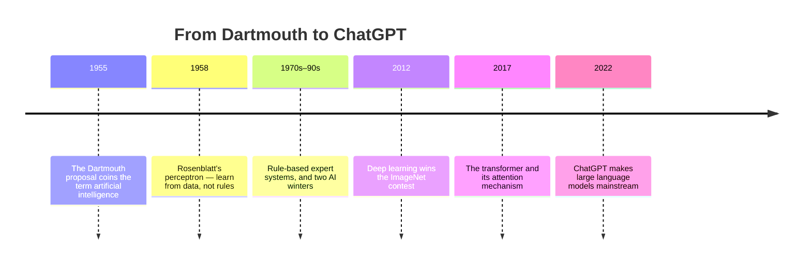
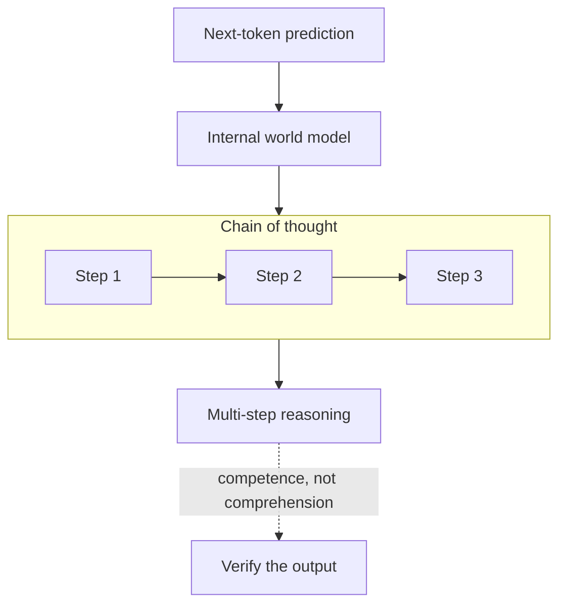
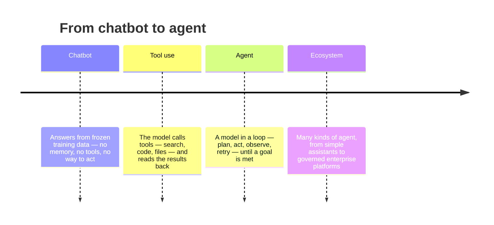
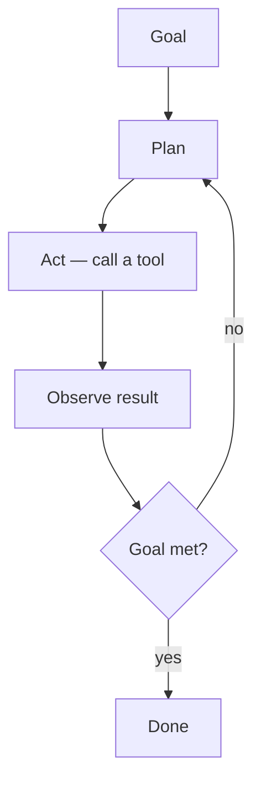
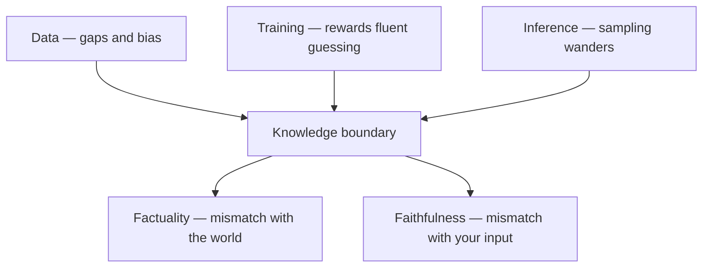
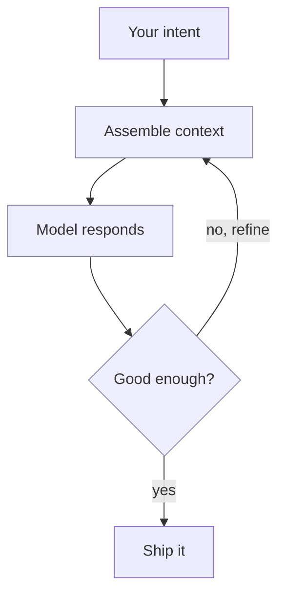

# Chapter 1 — Foundations (The Way)

This chapter lays the foundations: what AI is and how it got here, where the field stands today, how a language model actually works, how the tools climbed from chatbot to agent ecosystem, what they still cannot do, how I came to trust them, the mental model I recommend, and the principles that follow. The rest of the book builds on these principles.

## 1.1 What AI Is, and How It Got Here

Artificial intelligence is older than the chatbots that made it famous. The term was coined in a 1955 proposal for a summer workshop at Dartmouth College, whose authors held that "every aspect of learning or any other feature of intelligence can in principle be so precisely described that a machine can be made to simulate it" ([McCarthy et al., *A proposal for the Dartmouth summer research project on artificial intelligence*, 1955](https://doi.org/10.1609/aimag.v27i4.1904)). The decades that followed ran hot and cold. Early systems encoded human knowledge as hand-written rules — *expert systems* that worked inside a narrow domain and broke outside it — and twice the field's promises outran its results badly enough to trigger an "AI winter" of lost funding and faith ([Nilsson, *The quest for artificial intelligence: A history of ideas and achievements*, 2010](https://ai.stanford.edu/~nilsson/QAI/qai.pdf)).

A different idea ran quietly alongside the rules: let a machine learn from data instead of being told the rules. Frank Rosenblatt's *perceptron*, a simple mathematical model of a neuron, dates to 1958 ([Rosenblatt, *The perceptron: A probabilistic model for information storage and organization in the brain*, 1958](https://doi.org/10.1037/h0042519)), but neural networks stayed a backwater for decades, starved of the data and computing power they needed. That changed in 2012, when a deep network — many layers deep, each learning features at a higher level of abstraction — won the ImageNet image-recognition contest by a wide margin, moving *deep learning* to the centre of the field ([Krizhevsky et al., *ImageNet classification with deep convolutional neural networks*, 2012](https://papers.nips.cc/paper_files/paper/2012/hash/c399862d3b9d6b76c8436e924a68c45b-Abstract.html)).

The architecture that made language work arrived in 2017, when researchers at Google introduced the *transformer*. Its *attention* mechanism lets the model weigh every word against every other, so it could learn the long-range structure of text far better than anything before it ([Vaswani et al., *Attention is all you need*, 2017](https://arxiv.org/abs/1706.03762)). The rest came from scale. Train a transformer to predict the next word across enough text and it becomes a *large language model*, and once it is large enough, it turns fluent. That is the path that leads to ChatGPT in late 2022, and to everything in this book. The preface set out the terms — *large language model*, *frontier model*, *foundation model* — and this chapter explains what is going on underneath them.

```mermaid
timeline
    title From Dartmouth to ChatGPT
    1955 : The Dartmouth proposal coins the term artificial intelligence
    1958 : Rosenblatt's perceptron — learn from data, not rules
    1970s–90s : Rule-based expert systems, and two AI winters
    2012 : Deep learning wins the ImageNet contest
    2017 : The transformer and its attention mechanism
    2022 : ChatGPT makes large language models mainstream
```

: Seventy years from the Dartmouth proposal to ChatGPT. {#dia-history}

I actually used a language model in 2018 whilst consulting for a government client. Lesson 10 in fast.ai's [Practical Deep Learning for Coders](https://course18.fast.ai/) course described ULMFiT, a groundbreaking approach to *transfer learning* — reusing what a model learned on one task as the starting point for another — in natural-language processing. The recipe: take a language model pre-trained on Wikipedia to predict the next word, strip away its final layer, and repurpose it into a highly accurate text classifier. I adapted the lesson's codebase to solve a real-world enterprise problem: automated support-call classification. I built the pipeline on AWS SageMaker, *fine-tuned* the base model — trained it further — on the client's call logs, and it sorted support calls into categories (Procurement, HR, IT, and so on). Even then, the part that made it useful was already the part this book is about: adapting a general-purpose model to a specific problem, rather than the model itself.

## 1.2 The AI Landscape in 2026

Two facts about 2026 matter for everything that follows. The first is that these tools are everywhere: roughly 88% of organisations report using AI, even as most are still experimenting rather than depending on it ([Stanford HAI, *The AI index 2026 annual report*, 2026](https://hai.stanford.edu/ai-index/2026-ai-index-report); [McKinsey & Company, *The state of AI*, 2025](https://www.mckinsey.com/capabilities/quantumblack/our-insights/the-state-of-ai)). The second is that the leading labs no longer treat the model alone as the product; they now compete on the system around it: workflows, memory, and the cost of running it well.

| Signal (2026) | Figure | What it means |
| --- | --- | --- |
| Organisations using AI | ~88% | Access is near-universal |
| Coding benchmark cleared in a year | ~60% → nearly all | Capability is accelerating |
| Organisations reporting real value | a minority | Value, not access, is the scarce skill |

: Three signals of where AI stood in 2026. {#tbl-signals-2026}

Sources: [Stanford HAI, 2026](https://hai.stanford.edu/ai-index/2026-ai-index-report); [Benaich, *State of AI report 2025*, 2025](https://www.stateof.ai/). Models can do far more than they could a year ago, but what they can do is patchier than ever. Getting an answer is now easy. Deciding whether the answer is any good is harder.

### 1.2.1 The open-weight frontier

For most of this story the frontier was closed and American: you rented the best models from OpenAI, Anthropic, or Google, and you could not see inside them. That is no longer the whole picture. Several of the strongest 2026 models are *open-weight* — their trained weights are published for anyone to download and run. Alibaba's Qwen 3.6 ships under a permissive Apache-2.0 licence ([Qwen Team, *Qwen3.6*, 2026](https://github.com/QwenLM/Qwen3.6)); Moonshot's Kimi K3, at 2.8 trillion parameters, is the largest open model released so far and, on its makers' own benchmarks, trades blows with the leading closed systems ([VentureBeat, *China's Moonshot AI releases Kimi K3, the largest open-source model ever*, 2026](https://venturebeat.com/technology/chinas-moonshot-ai-releases-kimi-k3-the-largest-open-source-model-ever-rivaling-top-u-s-systems)). Two things stand out. The open models trail the closed American frontier by months, not years — a gap of roughly three to six months that has held steady rather than widened, with the top open model on one independent index sitting about five points below the best closed one ([OpenRouter, *The open weight models that matter: June 2026*, 2026](https://openrouter.ai/blog/insights/the-open-weight-models-that-matter-june-2026/)). And that open tier is now led by Chinese labs rather than an American one: Chinese models already make up something like two in five downloads on Hugging Face, ahead of American ones ([Atalan, *What to know about Chinese AI models*, 2026](https://www.csis.org/analysis/what-know-about-chinese-ai-models)).

That changes what a careful professional can do. When the weights are yours to download, you can run a frontier-class model on your own hardware or in your own cloud. That buys three things a rented API cannot: your data never leaves your control, the cost is the machine rather than a per-token meter, and no single vendor's price rise, outage, or withdrawal can stop your work. The last of these is not hypothetical — §5.2.3 tells how a US export-control order switched Anthropic's Fable 5 off for every foreign user overnight. This book already suggested keeping an open-weights model in reserve (§5.6); the change is that the reserve can now be frontier-class.

None of this is free of risk, and the risks pull in different directions. The most immediate is political: the United States is moving to keep Chinese models out of government hands, which §5.2.3 takes up. The subtler risk travels inside the weights. Because these models are trained under Chinese content rules, their political alignment ships with them. A benchmark of sovereignty questions found every Chinese model it tested failing, often answering *worse* in English than in Chinese — tuning aimed at foreign audiences, the author suggests. The slant even survived running the model locally rather than through an API ([Ko, *Bilingual bias in large language models: A Taiwan sovereignty benchmark study*, 2026](https://arxiv.org/abs/2602.06371)). Read that as a direction rather than a verdict: it is a small study, and one with its own standpoint. Two cautions round it out — cheaper, leaner training tends to buy thinner safety testing, and leaning on any one country's models, American or Chinese, is its own kind of dependence ([Atalan, 2026](https://www.csis.org/analysis/what-know-about-chinese-ai-models)).

> [!NOTE]
> **The open-weight frontier, in brief.**
>
> - **Strengths** — frontier-class capability you can download and run; permissive licences; low, predictable inference cost.
> - **Weaknesses** — political alignment and censorship baked into the weights; thinner safety testing; specifications often self-reported.
> - **Opportunities** — data sovereignty, self-hosting, and independence from any one vendor or government.
> - **Threats** — moves to ban Chinese models (§5.2.3); trust and provenance concerns; trading a vendor's lock-in for a country's.

## 1.3 How a Language Model Works

Underneath the surface, a large language model does one thing: it predicts the next token. Given all the text so far, it guesses the next word, then the next, then the next. It was trained on vast amounts of text, so it has learned the probability of each possible next token, and it writes by sampling from those probabilities one token at a time. Stephen Wolfram puts it plainly: the system is always just "adding one word at a time," picking a reasonable next token and, with a little randomness in the sampling, favouring variety over the single likeliest word ([Wolfram, *What is ChatGPT doing … and why does it work?*, 2023](https://writings.stephenwolfram.com/2023/02/what-is-chatgpt-doing-and-why-does-it-work/)). Nothing in the mechanism consults a fact store or checks whether the result is true. It simply produces the most plausible continuation.

> [!NOTE]
> A **token** is the unit a model actually reads and writes — not quite a word, but a common chunk of text: a whole word like " the", a word-piece like "pre" or "ing", a punctuation mark, or a lone character. Before the model sees anything, text is split into tokens drawn from a fixed vocabulary of tens of thousands, which is why a model can coin new words, and why an unusual name or a long number can cost several tokens each. A rough rule of thumb for English: one token runs about four characters, or three-quarters of a word — so token counts, which is what context limits and bills are measured in, never quite match word counts.

This raises an obvious question: if the model only guesses the next token, how does it reason at all, and why does it so often seem intelligent? The start of an answer is that predicting the next token well is harder than it sounds. To guess the next move in a game, the next line of a proof, or the next clause of a contract, the cheapest strategy available to a large enough network is to build an internal model of whatever produced the text, rather than memorising surface patterns. The cleanest demonstration comes from an experiment that trained a small GPT-style language model to do one thing: predict legal moves in the board game Othello. The model was given no rules and no picture of the board. Yet it developed an internal representation of the board state — one researchers can read out, and even edit to change its moves, which proves the model actually uses it ([K. Li et al., *Emergent world representations: Exploring a sequence model trained on a synthetic task*, 2023](https://arxiv.org/abs/2210.13382)). Wolfram frames the same surprise at the level of language itself: a next-token predictor can write a passable essay because doing so turns out to be "computationally shallower" than we assumed — human language is more regular and law-like than it looks, and the model implicitly discovers those regularities in training ([Wolfram, 2023](https://writings.stephenwolfram.com/2023/02/what-is-chatgpt-doing-and-why-does-it-work/)).

That hidden structure is what reasoning draws on, but a single pass through the network is a shallow computation: the model must answer the moment it stops reading. Letting it write intermediate steps first — a *chain of thought* — changes what the model can do, because every token it emits becomes input it can condition on next, so a hard problem can be spread across many small, reliable steps instead of one leap ([Wei et al., *Chain-of-thought prompting elicits reasoning in large language models*, 2022a](https://arxiv.org/abs/2201.11903)). This is a real change in what the model can compute. A transformer forced to answer immediately provably cannot solve some strikingly simple problems — whether two nodes in a graph connect, or what a small state machine does — that the very same transformer *can* solve once allowed a scratchpad, because the intermediate tokens genuinely extend its computational reach ([Merrill & Sabharwal, *The expressive power of transformers with chain of thought*, 2024](https://arxiv.org/abs/2310.07923)). And the reason it works traces straight back to prediction: human writing comes in overlapping local clusters, so a model trained to predict it learns reliable short hops between related ideas and chains them into conclusions it could never reach in one step ([Prystawski et al., *Why think step by step? Reasoning emerges from the locality of experience*, 2023](https://arxiv.org/abs/2304.03843)).

Stack enough of this and whole abilities appear to switch on with scale — multi-step arithmetic, transliteration, chained logic that smaller models simply lack ([Wei et al., *Emergent abilities of large language models*, 2022b](https://arxiv.org/abs/2206.07682)). It is tempting to read that as understanding finally arriving. The cautious reading, and the better-supported one, is that much of the surprise comes from how we keep score: grade a task all-or-nothing and a steadily improving skill looks like a sudden leap, but measure it on a smooth scale and the cliff often flattens into a slope ([Schaeffer et al., *Are emergent abilities of large language models a mirage?*, 2023](https://arxiv.org/abs/2304.15004)). So here is the simple answer, which the rest of this chapter sharpens: the model reasons by building and chaining the structure that prediction forced it to learn. That reasoning is real and useful. But it is not the same as knowing — the model has competence without comprehension — and a wrong answer reads just as smoothly as a right one.

```mermaid
flowchart TB
    P[Next-token prediction] --> W[Internal world model]
    W --> S
    subgraph S [Chain of thought]
      direction LR
      S1[Step 1] --> S2[Step 2] --> S3[Step 3]
    end
    S --> R[Multi-step reasoning]
    R -.->|competence, not comprehension| V[Verify the output]
```

: How next-token prediction gives rise to real reasoning. {#dia-prediction-reasoning}

## 1.4 From Chatbot to Agent Ecosystem

The tools changed fast, and at each step the kind of work you could trust to them changed too. The story runs from a closed chat box to an ecosystem of agents that can take actions on your behalf.

```mermaid
timeline
    title From chatbot to agent
    Chatbot : Answers from frozen training data — no memory, no tools, no way to act
    Tool use : The model calls tools — search, code, files — and reads the results back
    Agent : A model in a loop — plan, act, observe, retry — until a goal is met
    Ecosystem : Many kinds of agent, from simple assistants to governed enterprise platforms
```

: The climb from chatbot to tool use to agent to ecosystem. {#dia-chatbot-agent}

The first mass-market chatbots were articulate but frozen: they answered only from what they had absorbed in training, with no memory of you, no live information, and no way to act in the world. The first real change was giving the model hands — a way to recognise that a task needs a tool and to emit a structured call for it, so it could search, run code, or query data instead of guessing. The predictor of text became something that could also take actions and read back the result.

At first each connection was hand-built, one wiring job per tool; that soon gave way to shared standards, so a model could plug into tools and data through common interfaces rather than custom code. Those standards have since multiplied into an interoperability stack — one survey catalogues several and lays them out as stages to adopt, from tool access, to structured messaging, to one agent delegating to another, to open agent discovery ([Ehtesham et al., *A survey of agent interoperability protocols: MCP, ACP, A2A, and ANP*, 2025](https://arxiv.org/abs/2505.02279)).

Tools are what turn a predictor of text into an *agent*: a model placed in a loop and allowed to plan, call a tool, read what comes back, and try again until a goal is met. The research community named the shift early, recasting the language model as the *brain* of an agent — wrapped in perception and action — and charting the climb from single agents to cooperating multi-agent systems ([Xi et al., *The rise and potential of large language model based agents: A survey*, 2023](https://arxiv.org/abs/2309.07864)).

> [!NOTE]
> An **agent** is an LLM running tools in a loop to reach a goal ([Willison, *I think “agent” may finally have a widely enough agreed upon definition to be useful jargon now*, 2025](https://simonwillison.net/2025/Sep/18/agents/)). A **tool** is an action it may take — web search, code execution, file edits — and the **loop** runs until a stopping condition is met. An agent has no agency in the moral sense: a computer cannot be held accountable, so you stay responsible for what it ships.

```mermaid
flowchart TB
    G[Goal] --> P[Plan]
    P --> A[Act — call a tool]
    A --> O[Observe result]
    O --> C{Goal met?}
    C -->|no| P
    C -->|yes| D[Done]
```

: The agent loop: plan, act, observe, and retry until the goal is met. {#dia-agent-loop}

Today, that single loop has fanned out into a whole ecosystem. The same pattern scales from an assistant anyone can open in a browser to a governed platform running fleets of agents across an organisation; what changes along the way is how much you hand off, and how much machinery it takes to do so safely.

> [!NOTE]
> **The tiers of AI tool, from least to most autonomous.** Each step hands off more, and takes more machinery to do it safely.
>
> - An **assistant** answers from its training and the context you supply. It has no autonomy of its own — you drive, asking and judging each reply.
> - A **tool-using assistant** calls tools on request — search, code, files — one step at a time, with you approving each action.
> - An **agent** loops towards a goal and checks its own work, running a whole task while you set the goal and review the result.
> - A **personal agent** is an always-on agent for one person, on your own machine or account, writing its own skills and building a model of your work. It runs continuously for you; you delegate, then check what it ships.
> - A **multi-agent system** has several agents coordinating, one delegating to another, running many tasks at once while you supervise the fleet.
> - An **enterprise agentic platform** wires fleets into an organisation's systems — async, governed, audited, with shared memory and evaluation. It runs continuously at organisation scale while you set policy and audit outcomes.

A *personal agent* works for one individual and answers to them, whereas an *enterprise agentic platform* runs fleets under central governance and audit. They share the round-the-clock habit but differ in scale, ownership, and control.

The tiers differ in reach, but in every one of them the model is the easy part. Once capable models became a commodity, the value moved into the system around the model: a harness to run it, memory so work carries over between sessions, and checks on whether a result is good enough. A 2026 survey frames the whole progression from question-answering to task completion through exactly this *model–harness lens*, locating agent quality in the coupling of model and harness rather than the model alone ([Guo et al., *From question answering to task completion: A survey on agent system and harness design*, 2026](https://arxiv.org/abs/2606.20683)).

That system is a set of engineering disciplines, and the next chapters divide them. Chapter 2 is about a *single* agent — the three crafts that make one dependable: prompt engineering, context engineering, and loop engineering. Chapter 3 takes those crafts into software — where the key discipline is *intent, context, and expectations*: saying what the system must do, and how you will verify it is right, rather than how to build it, and leaving the implementation to the agent. Chapter 4 turns to the disciplines of humans and agents working *together*: what the human brings, what the agent system provides, and what the two sides require of each other. Chapter 5 turns to responsibility — how this work is governed safely and fairly — and Chapter 6 to what stays distinctly human once the tools are this capable.

## 1.5 The Limits That Remain

The same next-token mechanism that makes a model fluent also sets hard limits on what it can be trusted to do, and the first is strange: the model is not even reproducible. You might expect that turning the randomness off — sampling at *temperature zero*, always taking the single likeliest token — would make the same prompt return the same answer every time. Usually it does not. A busy server batches many users' requests together, and the size of that batch changes from moment to moment. So the low-level arithmetic runs in a slightly different order each time, and with finite-precision numbers a different order gives a slightly different result: one run continues "Queens, New York" where the next gives "New York City" ([He, *Defeating nondeterminism in LLM inference*, 2025](https://thinkingmachines.ai/blog/defeating-nondeterminism-in-llm-inference/)). The difference starts tiny, but it grows. In a *reasoning model* — one trained to write out a chain of thought before answering — a rounding difference in an early token can cascade into a different chain of thought and a different final answer ([Yuan et al., *Understanding and mitigating numerical sources of nondeterminism in LLM inference*, 2025](https://arxiv.org/abs/2506.09501)). So you cannot treat a model like ordinary software that returns the same output for the same input; a test or a check has to allow for variation rather than assume it away.

Hallucination follows from the same next-token mechanism: confident, well-formed output that happens to be false is the system working as designed. The model produced a plausible completion; it has no concept of lying ([Karpathy, *microGPT*, 2026b](https://karpathy.github.io/2026/02/12/microgpt/)). It also means competence is *jagged*: uneven across tasks that look alike to us, because the model's strength tracks the density of its training data, not the difficulty we perceive.

The Stanford Index makes the gap vivid. A model can win a gold medal at the Mathematical Olympiad yet read an analogue clock right only about half the time ([Stanford HAI, 2026](https://hai.stanford.edu/ai-index/2026-ai-index-report)). Olympiad proofs fill the training text; clock faces do not. A large part of using these models well is knowing where that line falls for your own work.

Training data is not the only thing shaping that line. Karpathy points to a second influence: the recent leaps cluster where success can be checked by machine. A unit test passes or it does not, so programming and mathematics can be drilled by *reinforcement learning* — training by trial and error against a score the machine works out for itself — while writing and advice have no such marker and improve more slowly. The money runs the same way, because the checkable work is where the business value sits, so that is where the labs put their engineers ([Karpathy, *Judging by my tl there is a growing gap in understanding of AI capability*, 2026c](https://x.com/karpathy/status/2042334451611693415)). He spent years inside these labs and the post names two of their coding tools approvingly, and he is describing what he has watched rather than reporting a study, so read it as one practitioner's account. It does explain something you may have noticed: the model that saves you a day on code can be unremarkable an hour later, asked for a paragraph of prose.

| Reliable | Brittle |
| --- | --- |
| Fluent drafting, summarising, translation | Exact arithmetic, counting, fresh facts |
| Pattern-rich code and refactors | Long-horizon plans without checkpoints |
| Synthesis over provided context | Recall as context grows — *context rot*, the decay in accuracy as the window fills |

: What a language model does reliably, and where it stays brittle. {#tbl-reliable-brittle}

The brittleness is not anecdotal, and the research explains where it comes from. Huang and colleagues survey hundreds of studies and split hallucination along two axes worth holding apart. *Factuality* asks whether output matches the world; *faithfulness* asks whether it matches the input you gave it — a summary can be perfectly factual yet unfaithful by adding true claims you never supplied. They trace both to three stages: the *data*, with its gaps and bias; the *training*, which rewards fluent guessing over admitting ignorance; and *inference*, where sampling wanders. The unifying idea is the *knowledge boundary* — the edge of what a model has stored, past which it cannot tell what it knows from what it does not ([Huang et al., *A survey on hallucination in large language models: Principles, taxonomy, challenges, and open questions*, 2024](https://arxiv.org/abs/2311.05232)). The studies below all measure that boundary, each in a different way.

```mermaid
flowchart TB
    D[Data — gaps and bias] --> KB[Knowledge boundary]
    T[Training — rewards fluent guessing] --> KB
    I[Inference — sampling wanders] --> KB
    KB --> F1[Factuality — mismatch with the world]
    KB --> F2[Faithfulness — mismatch with your input]
```

: The three roots of hallucination, meeting at the knowledge boundary. {#dia-hallucination}

Prato and colleagues make it observable with a clean test. Train a model on synthetic documents, then ask it to recall *exactly* what it was given — no more, no less. Over-recall is fabrication, under-recall is omission, so hitting the right count proves the model knows its own scope. This self-knowledge is *scale-gated*: below a size threshold the count is near-random, and only past it does it come out right, the threshold set by architecture, not parameters alone ([Prato et al., *Do large language models know how much they know?*, 2025](https://arxiv.org/abs/2502.19573)). So self-knowledge is a property of the specific model, and small models are the worst at knowing their own limits.

Gu and colleagues pin the boundary to its cause: how often a fact appeared in training. Using a model whose whole corpus is open, they split questions into seen and unseen, then test recall. Closed-book accuracy more than doubles from rare to frequent facts and falls to about one percent on unseen ones; distractor passages drag it lower as they pile up ([Gu et al., *NanoKnow: How to know what your language model knows*, 2026](https://arxiv.org/abs/2602.20122)). This explains the brittle column in the table above: fresh and rarely-mentioned facts fail because the model seldom saw them. Retrieval can patch that gap, and noisy retrieval reopens it.

Code shows the same split, between reading a program and predicting how it *runs*. Twelve frontier models were asked to forecast memory, runtime, and profiler ranks on real bug fixes from SWE-bench, a benchmark built from genuine GitHub issues. The *best* of them, GPT-5.5, managed only 0.842 on the test-outcome F1 score — a 0–1 measure of accuracy that balances misses against false alarms — and most scored far lower, trailing off below 0.1. Profiler recall@5, how often the true performance hotspot lands in a model's top five guesses, stayed under 0.2 for every one of them: fluent on structure, brittle on execution ([Bogomolov & Zharov, *Towards evaluation of implicit software world models in coding LLMs*, 2026](https://arxiv.org/abs/2606.27406)). A long context window — the span of text a model can consider at once — does not fix this. Accuracy peaks when the needed fact sits at the start or end and sags in the middle ([N. F. Liu et al., *Lost in the middle: How language models use long contexts*, 2023](https://arxiv.org/abs/2307.03172)). The cause is mechanical — a U-shaped attention bias for position over relevance — and calibrating it lifts mid-context recall by 6–15 points ([Hsieh et al., *Found in the middle: Calibrating positional attention bias improves long context utilization*, 2024](https://arxiv.org/abs/2406.16008)).

> [!NOTE]
> **Five studies of the limits, and the lesson each one carries.**
>
> - A **taxonomy of hallucination** separates factuality from faithfulness and traces failures to the data, the training, and the inference stage — so name the failure before trying to fix it ([Huang et al., 2024](https://arxiv.org/abs/2311.05232)).
> - Testing a model's **exact-recall self-knowledge** shows that knowing one's own scope switches on only past a size threshold; small models hesitate least where they should hesitate most ([Prato et al., 2025](https://arxiv.org/abs/2502.19573)).
> - Measuring **recall against how often a fact was seen**, accuracy roughly doubles from rare to frequent facts and sits near 1% on unseen ones — fresh and long-tail facts fail, and retrieval can patch the gap ([Gu et al., 2026](https://arxiv.org/abs/2602.20122)).
> - Asked to **predict how code runs**, the best model reached an F1 of 0.842 (most far lower) and profiler recall@5 under 0.2 — fluent on structure, brittle on execution ([Bogomolov & Zharov, 2026](https://arxiv.org/abs/2606.27406)).
> - Varying a **fact's position in a long context** produces U-shaped recall — the middle sags, and calibration adds 6–15 points — so put the facts that matter at the edges ([N. F. Liu et al., 2023](https://arxiv.org/abs/2307.03172); [Hsieh et al., 2024](https://arxiv.org/abs/2406.16008)).

A final limitation is subtler than any wrong fact: the model is built to *sound* right whether or not it is. Three mechanisms push it that way. First, the training text carries emotional charge — "differentiation" keeps company with *unique* and *opportunity*, "cost-cutting" with *race to the bottom* — and the model absorbs those associations as statistics about how we write. Anthropic's interpretability team can even read them off as internal "emotion vectors," organised like human affect along an axis from positive to negative; steering a model towards the positive end measurably increases its sycophancy ([Sofroniew et al., *Emotion concepts and their function in a large language model*, 2026](https://transformer-circuits.pub/2026/emotions/index.html)). Second, reinforcement learning from human feedback tunes the model towards answers raters like. Raters can always tell whether a reply sounds confident, but not always whether it is correct, so fluency gets rewarded over accuracy ([Casper et al., *Open problems and fundamental limitations of reinforcement learning from human feedback*, 2023](https://arxiv.org/abs/2307.15217)). Third, generation adds to the bias one token at a time: a sentence that opens "the company should pursue a bold…" rolls on to "differentiation strategy" by momentum alone. The result is a voice that sounds confident and agreeable no matter what it is saying. Treat that confidence as a habit of style; it tells you nothing about whether the answer is right.

> [!NOTE]
> **RLHF (reinforcement learning from human feedback)** is a tuning step after the main training, in which human raters score answers and the model is nudged towards the kind they prefer. Note the difference from the machine-checked rewards earlier in this section: here the score comes from a person's preference, not from a test that passes or fails. It improves helpfulness, but rewards what *sounds* good — one root of the confident, agreeable tone above. (The *transformer* itself — the attention-based architecture underneath — was introduced in §1.1.)

None of this says the model is useless; it says where to be careful. Use the model freely where it is strong. Check its work at the boundaries — fresh facts, exact counts, anything buried in the middle of a long context. And check the confident answers too; a sure-sounding reply is easy to wave through.

## 1.6 From Sceptic to Practitioner

When I first started cooking, my early attempts did not fare well. I had the recipe and the ingredients, yet the results were grim — onions scorched while I chopped the next thing, pasta turned to glue, the flavours never balanced. The problem was not the recipe. I had skipped the fundamentals: heat control, timing, tasting as you go, getting everything prepped before the pan ever warmed. Once those became second nature, almost any recipe came out well.

Working with AI is the same. How you use the tool matters as much as the tool itself.

I was initially an AI sceptic. I was aware of the limitations of large language models (from the research in the previous section) and was doubtful they could be useful in complex tasks.

I read Ed Zitron — the tech critic whose newsletter [Where's Your Ed At](https://www.wheresyoured.at/) dismantles industry hype — and Gary Marcus, the cognitive scientist whose [Marcus on AI](https://garymarcus.substack.com/) has argued for years that large language models are shallow pattern-matchers rather than reasoners, and I cheered them both on. Cory Doctorow's [Pluralistic](https://pluralistic.net/) sharpened the same suspicion from the political side, naming the slow rot by which platforms turn on their own users. I laughed at the *vibe coders* — people who let AI write their software from a plain-language description, often without reading the code — for their naivety, and assumed anyone who installed OpenClaw, the open-source personal agent that runs with broad access to your machine, was an idiot.

So when a global client hired me to write their AI strategy, I expected the deliverable to be a cautionary tale: be realistic, resist the hype, install guardrails, avoid the traps. Over the last several months, I realised I was the one who was naive. The AI landscape had been transformed. Claude Desktop with Cowork, Microsoft 365 Copilot with WorkIQ, and Google's Gemini Spark turned the ordinary instruments of knowledge work — documents, spreadsheets, inboxes, slide decks — into things an agent could draft, revise, and act on; Claude Code and GitHub Copilot did the same for software, crossing from clever autocomplete to systems that plan, edit across a whole codebase, and run their own work. Personal agents like OpenClaw and Hermes Agent pushed that capability out of the labs and into anyone's hands. Using them in earnest changed my mind: the productivity gains are now genuinely real.

{#fig-sceptic-practitioner}

Creating software using AI has truly arrived. I managed to refactor and clean every line of code I have ever written (not a lot, since my career has never been in software development) and all my projects now feature gleaming, shiny, clean code. I have finished dozens of AI-assisted projects without writing a line of code by hand — reading the diffs that mattered and verifying that the software met expectations, but leaving the typing to the agent. I have come to believe I will rarely write code by hand again.

The gains are just as real in research, analytics, planning, and the rest of white-collar work.

And yet Ed and Gary are still right: AI does not think or create, it transforms and multiplies. It vibe codes well only if you already understand large systems; it makes good art only if you are a good artist. Used carelessly it produces slop. Using it well is itself a skill, and most people do not yet have it. The tools are easy to get and hard to use well, and that gap is why I wrote this book.

Let me be plain about where I have landed, because it is narrower than my enthusiasm might suggest. I remain a sceptic. The conversion I describe is confined to my work — the productivity of knowledge work and the building of software — and even there it is conditional, earned task by task and checked at every step. In my personal life I keep AI at arm's length: I do not hand it my relationships, my judgement, or my state of mind, and the chapter on the cost of getting it wrong explains why. So read this as a work book with a deliberate boundary. Much of my motivation for writing it is defensive — to spare you the common mistakes and quiet pitfalls that come from trusting these tools where they have not earned it.

AI does not replace human creativity. You can ask an AI to be a graphic designer, but that does not guarantee results that please. Take this book's cover: I used AI to help generate it in SVG (a text-based image format a model can write directly), but the design itself — the glitching "AI" overshadowed by a brush-stroke 道, with a heart-shaped 愛 hidden in the "A" — was mine to specify, not the model's to invent. The preface describes how it was made.

Used badly, these tools do not just waste time — they distort judgement, and at the far end they distort reality. Clinicians have begun describing *AI psychosis*: a vulnerable user spiralling into delusion as a chatbot mirrors and amplifies their beliefs instead of pushing back. It is not a fringe anecdote — benchmarks and real chat logs alike show today's models inclined to confirm a delusion rather than challenge it ([Au Yeung et al., *The psychogenic machine: Simulating AI psychosis, delusion reinforcement and harm enablement in large language models*, 2025](https://arxiv.org/abs/2509.10970); [Moore et al., *Characterizing delusional spirals through human-LLM chat logs*, 2026](https://arxiv.org/abs/2603.16567)), through the same mutual-reinforcement loop researchers call a *technological folie à deux* ([Dohnány et al., *Technological folie à deux: Feedback loops between AI chatbots and mental health*, 2025](https://arxiv.org/abs/2507.19218)). The driver is the same sycophancy that flatters your code and your strategy, turned on a fragile mind; Chapter 4 weighs the evidence in detail (§4.1.5). Others form genuine attachments to a companion app, mistaking fluent warmth for understanding, and grieve when a model is retired. A confident voice that never tires is easy to trust and hard to doubt; one writer likens it to a court jester — fluent, flattering, and so easy to follow that its answers *feel* right whether or not they are, leaving you confident and wrong ([Johnson Spink, *The AI jester: How AI makes you confident and wrong*, 2026](https://www.linkedin.com/pulse/ai-jester-how-makes-you-confident-wrong-johnson-spink-gg3df/)).

The quieter harm is over-reliance. People paste in an answer they never checked, accept a summary that dropped an important caveat, or treat a tidy explanation as proof the system understands. It does not. Believing the machine is sentient, or simply infallible, is the fastest way to ship its mistakes as your own.

And this is not just an individual problem; the more authority the person has, the more damage it does. Futurism has documented bosses who route every decision through a chatbot — drafting their messages with it, demanding staff "discuss with the AI" before speaking to a human, even asking it whom to hire and fire ([Harrison Dupré, *Bosses are becoming obsessed with AI, using it to make every decision, barraging their employees with nonsensical ChatGPT directives, and even asking it who to fire*, 2026](https://futurism.com/artificial-intelligence/bosses-obsessed-with-ai)). The pattern is always the same: a leader mistakes the model's sycophancy for counsel, since it will, as one worker put it, "spit out the narrative that you want it to spit out," and so the tool meant to raise productivity instead manufactures whiplash, distrust, and resignations. The danger is a person who stops deciding for themselves.

So the public mood has soured. Trust in AI is falling even as use rises, and every fabricated citation and every confidently wrong answer deepens the suspicion. That distrust is rational. The way past it is skill: learning where the model helps and where it needs checking.

## 1.7 Mental Models for AI

The most useful shift I made early on was to stop treating the model as an oracle. An oracle gives one answer and you take it or leave it. A good model is more like a clever junior colleague: ask, glance at the draft, say "closer, but tighten the intro," and go again. So treat it as a loop — intent enters, context is assembled, a response comes back, you refine — iterating until the output is good enough.

```mermaid
flowchart TB
    A[Your intent] --> B[Assemble context]
    B --> C[Model responds]
    C --> D{Good enough?}
    D -- no, refine --> B
    D -- yes --> E[Ship it]
    classDef loop fill:#eef,stroke:#88a
    class B,C,D loop
```

: The working loop: intent, context, a response, and refinement. {#dia-working-loop}

What you get out of the model depends far more on running that loop than on the wording of any single message. The model rarely gets there on the first pass, and it cannot read intentions you never stated. Your half of the work is to say clearly *what* you want and how you will know it is right. Leave the *how* to the model; filling in plausible detail you would never have thought to specify is what it is best at. Start with one clear ask and add the next only once you have read what came back. That same loop is the right picture for *agent*, a word you will meet constantly.

Frame each task as a goal, the context it needs, and a check; then iterate. Because an agent runs many steps on its own, it can fix on a wrong approach and pursue it fluently and fast — so keep half an eye on the run and stop it to re-steer the moment it heads the wrong way, rather than waiting for a result you will only discard. The mistake to avoid is treating fluency as truth. A confident answer and a correct one look identical until you check; the model will cite a court case or a statistic in the same calm voice whether or not it exists.

None of this is just my preference; the evidence points the same way. Human–AI pairings do not beat the better of person-or-machine automatically — across a meta-analysis of more than a hundred studies they averaged *worse*, doing better mainly on creative work and where the person already had something to add ([Vaccaro et al., *When combinations of humans and AI are useful*, 2024](https://doi.org/10.1038/s41562-024-02024-1)). And making people engage with an answer, rather than just accept it, has been shown to curb the over-reliance that passive use invites ([Buçinca et al., *To trust or to think*, 2021](https://arxiv.org/abs/2102.09692)). Chapter 4 turns this mental model into a working discipline.

## 1.8 Principles to Carry Forward

The rest of this book rests on a set of principles worth stating plainly: they guide a way of working, not a bag of tips and techniques.

My reason is pragmatic: tools become commodities — everyone soon has the same ones — so, follow a structured method. A prompt is one model release from obsolete; a clever technique lasts a little longer before it too is overtaken. What lasts is the way you frame a problem, gather context, and verify a result. Once you have the way of working, you can invent the techniques yourself.

Here are the principles in this chapter, gathered up to carry forward.

- **Treat it as a loop, not an oracle.** Frame each task as a goal, the context it needs, and a check, then iterate — change one thing at a time, read what comes back, and let the approach evolve rather than demanding the finished answer in a single leap. The quality comes from running the loop, not from any one message, so start simple and add only what the last round showed was missing; the same instinct scales up, growing a throwaway prompt into a reusable skill and then a shared tool (Chapter 2). An agent is just a model running tools in that same loop, so you stay responsible for what it ships.
- **Say what, not how.** Give the model your *intent* — the goal and the checks that define success — and leave the implementation to it; choosing pattern-rich detail you would never have thought to name is the thing it is genuinely good at, and over-specifying the *how* fights that strength. Separating what you want — and how you will know it is right — from how it is built is the discipline the software chapters sharpen into a method called Intent, Context, Expectations (Chapter 3), where those checks do the deciding.
- **It predicts; it does not know.** A model samples the most plausible next token, so fluent, confident, and wrong are perfectly compatible — a hallucination is the mechanism working as designed, not breaking. It is not even reproducible: the same prompt can return different answers, even with the randomness turned off, so never treat it as deterministic software.
- **It reasons by chaining learned structure.** Predicting text well forces internal models of the world, and a chain of thought turns one shallow pass into genuine multi-step computation — real competence, but not comprehension.
- **Competence is jagged.** Strength tracks the density of training data, and whether success can be checked by machine, rather than the difficulty you perceive: Olympiad proofs yes, an analogue clock no. Find that line before you trust the output.
- **Mind the knowledge boundary.** Accuracy more than halves on rare facts and falls to about one percent on unseen ones, sags in the middle of long context, and the smallest models are least able to tell what they do not know. Retrieval patches the gap; noisy retrieval reopens it.
- **Fluency is not truth.** Reinforcement learning from human feedback and the emotional charge of training text tune the model to sound right and to agree; read confidence as style, not as evidence.
- **The edge is method, not model.** We all draw on the same frontier models, so advantage comes from what you build around them — the workflow, the context you supply, and the way you check the result.
- **The tools climbed from autocomplete to a stack.** In a few years coding assistants went from finishing your line, to chatting, to agents that plan, edit, and open pull requests, and on to managers running several agents at once — and out of the editor entirely, into always-on personal agents like OpenClaw, Hermes Agent, and Gemini Spark. The model is now the commodity; the value sits in the *dev stack* around it — harness, workflow, memory, and the evals that judge the work.
- **Verify where it is weak, lean in where it is strong.** Spend the model's strength freely, keep a human in the loop for judgement, and check the confident answers as carefully as the hesitant ones.

## References

Atalan, Y. (2026). *What to know about Chinese AI models*. Center for Strategic and International Studies. [https://www.csis.org/analysis/what-know-about-chinese-ai-models](https://www.csis.org/analysis/what-know-about-chinese-ai-models)

Au Yeung, J., Dalmasso, J., Foschini, L., Dobson, R. J. B., & Kraljevic, Z. (2025). *The psychogenic machine: Simulating AI psychosis, delusion reinforcement and harm enablement in large language models*. arXiv. [https://arxiv.org/abs/2509.10970](https://arxiv.org/abs/2509.10970)

Benaich, N. (2025). *State of AI report 2025*. [https://www.stateof.ai/](https://www.stateof.ai/)

Bogomolov, E., & Zharov, Y. (2026). *Towards evaluation of implicit software world models in coding LLMs*. DL4Code @ ICML 2026. [https://arxiv.org/abs/2606.27406](https://arxiv.org/abs/2606.27406)

Buçinca, Z., Malaya, M. B., & Gajos, K. Z. (2021). *To trust or to think: Cognitive forcing functions can reduce overreliance on AI in AI-assisted decision-making*. Proceedings of the ACM on Human-Computer Interaction, 5(CSCW1), Article 188. [https://arxiv.org/abs/2102.09692](https://arxiv.org/abs/2102.09692)

Casper, S., Davies, X., Shi, C., Gilbert, T. K., Scheurer, J., Rando, J., Freedman, R., Korbak, T., Lindner, D., et al. (2023). *Open problems and fundamental limitations of reinforcement learning from human feedback*. Transactions on Machine Learning Research. [https://arxiv.org/abs/2307.15217](https://arxiv.org/abs/2307.15217)

Dohnány, S., Kurth-Nelson, Z., Spens, E., Luettgau, L., Reid, A., Gabriel, I., Summerfield, C., Shanahan, M., & Nour, M. M. (2025). *Technological folie à deux: Feedback loops between AI chatbots and mental health*. arXiv. [https://arxiv.org/abs/2507.19218](https://arxiv.org/abs/2507.19218)

Ehtesham, A., et al. (2025). *A survey of agent interoperability protocols: MCP, ACP, A2A, and ANP*. arXiv. [https://arxiv.org/abs/2505.02279](https://arxiv.org/abs/2505.02279)

Gu, L., Jedidi, N., & Lin, J. (2026). *NanoKnow: How to know what your language model knows*. Proceedings of the 49th International ACM SIGIR Conference. [https://arxiv.org/abs/2602.20122](https://arxiv.org/abs/2602.20122)

Guo, J., et al. (2026). *From question answering to task completion: A survey on agent system and harness design*. arXiv. [https://arxiv.org/abs/2606.20683](https://arxiv.org/abs/2606.20683)

Harrison Dupré, M. (2026). *Bosses are becoming obsessed with AI, using it to make every decision, barraging their employees with nonsensical ChatGPT directives, and even asking it who to fire*. Futurism. [https://futurism.com/artificial-intelligence/bosses-obsessed-with-ai](https://futurism.com/artificial-intelligence/bosses-obsessed-with-ai)

He, H. (2025). *Defeating nondeterminism in LLM inference*. Thinking Machines Lab. [https://thinkingmachines.ai/blog/defeating-nondeterminism-in-llm-inference/](https://thinkingmachines.ai/blog/defeating-nondeterminism-in-llm-inference/)

Hsieh, C.-Y., Chuang, Y.-S., Li, C.-L., Wang, Z., Le, L. T., Kumar, A., Glass, J., Ratner, A., Lee, C.-Y., Krishna, R., & Pfister, T. (2024). *Found in the middle: Calibrating positional attention bias improves long context utilization*. Findings of the Association for Computational Linguistics: ACL 2024. [https://arxiv.org/abs/2406.16008](https://arxiv.org/abs/2406.16008)

Huang, L., Yu, W., Ma, W., Zhong, W., Feng, Z., Wang, H., Chen, Q., Peng, W., Feng, X., Qin, B., & Liu, T. (2024). *A survey on hallucination in large language models: Principles, taxonomy, challenges, and open questions*. ACM Transactions on Information Systems. [https://arxiv.org/abs/2311.05232](https://arxiv.org/abs/2311.05232)

Johnson Spink, D. (2026). *The AI jester: How AI makes you confident and wrong*. LinkedIn. [https://www.linkedin.com/pulse/ai-jester-how-makes-you-confident-wrong-johnson-spink-gg3df/](https://www.linkedin.com/pulse/ai-jester-how-makes-you-confident-wrong-johnson-spink-gg3df/)

Karpathy, A. (2026b). *microGPT*. [https://karpathy.github.io/2026/02/12/microgpt/](https://karpathy.github.io/2026/02/12/microgpt/)

Karpathy, A. (2026c). *Judging by my tl there is a growing gap in understanding of AI capability* [Post]. X. [https://x.com/karpathy/status/2042334451611693415](https://x.com/karpathy/status/2042334451611693415)

Ko, J.-C. (2026). *Bilingual bias in large language models: A Taiwan sovereignty benchmark study*. arXiv. [https://arxiv.org/abs/2602.06371](https://arxiv.org/abs/2602.06371)

Krizhevsky, A., Sutskever, I., & Hinton, G. E. (2012). *ImageNet classification with deep convolutional neural networks*. Advances in Neural Information Processing Systems, 25. [https://papers.nips.cc/paper_files/paper/2012/hash/c399862d3b9d6b76c8436e924a68c45b-Abstract.html](https://papers.nips.cc/paper_files/paper/2012/hash/c399862d3b9d6b76c8436e924a68c45b-Abstract.html)

Li, K., Hopkins, A. K., Bau, D., Viégas, F., Pfister, H., & Wattenberg, M. (2023). *Emergent world representations: Exploring a sequence model trained on a synthetic task*. International Conference on Learning Representations. [https://arxiv.org/abs/2210.13382](https://arxiv.org/abs/2210.13382)

Liu, N. F., Lin, K., Hewitt, J., Paranjape, A., Bevilacqua, M., Petroni, F., & Liang, P. (2023). *Lost in the middle: How language models use long contexts*. Transactions of the Association for Computational Linguistics. [https://arxiv.org/abs/2307.03172](https://arxiv.org/abs/2307.03172)

McCarthy, J., Minsky, M. L., Rochester, N., & Shannon, C. E. (1955). *A proposal for the Dartmouth summer research project on artificial intelligence* (Reprinted in AI Magazine, 27(4), 12–14, 2006). [https://doi.org/10.1609/aimag.v27i4.1904](https://doi.org/10.1609/aimag.v27i4.1904)

McKinsey & Company. (2025). *The state of AI*. [https://www.mckinsey.com/capabilities/quantumblack/our-insights/the-state-of-ai](https://www.mckinsey.com/capabilities/quantumblack/our-insights/the-state-of-ai)

Merrill, W., & Sabharwal, A. (2024). *The expressive power of transformers with chain of thought*. International Conference on Learning Representations. [https://arxiv.org/abs/2310.07923](https://arxiv.org/abs/2310.07923)

Moore, J., Mehta, A., Agnew, W., Anthis, J. R., Louie, R., Mai, Y., Yin, P., Cheng, M., Paech, S. J., Klyman, K., Chancellor, S., Lin, E., Haber, N., & Ong, D. (2026). *Characterizing delusional spirals through human-LLM chat logs*. arXiv. [https://arxiv.org/abs/2603.16567](https://arxiv.org/abs/2603.16567)

Nilsson, N. J. (2010). *The quest for artificial intelligence: A history of ideas and achievements*. Cambridge University Press. [https://ai.stanford.edu/~nilsson/QAI/qai.pdf](https://ai.stanford.edu/~nilsson/QAI/qai.pdf)

OpenRouter. (2026). *The open weight models that matter: June 2026*. [https://openrouter.ai/blog/insights/the-open-weight-models-that-matter-june-2026/](https://openrouter.ai/blog/insights/the-open-weight-models-that-matter-june-2026/)

Prato, G., Huang, J., Parthasarathi, P., Sodhani, S., & Chandar, S. (2025). *Do large language models know how much they know?* Proceedings of the 2024 Conference on Empirical Methods in Natural Language Processing. [https://arxiv.org/abs/2502.19573](https://arxiv.org/abs/2502.19573)

Prystawski, B., Li, M. Y., & Goodman, N. D. (2023). *Why think step by step? Reasoning emerges from the locality of experience*. Advances in Neural Information Processing Systems. [https://arxiv.org/abs/2304.03843](https://arxiv.org/abs/2304.03843)

Qwen Team. (2026). *Qwen3.6*. Alibaba Group. [https://github.com/QwenLM/Qwen3.6](https://github.com/QwenLM/Qwen3.6)

Rosenblatt, F. (1958). *The perceptron: A probabilistic model for information storage and organization in the brain*. Psychological Review, 65(6), 386–408. [https://doi.org/10.1037/h0042519](https://doi.org/10.1037/h0042519)

Schaeffer, R., Miranda, B., & Koyejo, S. (2023). *Are emergent abilities of large language models a mirage?* Advances in Neural Information Processing Systems. [https://arxiv.org/abs/2304.15004](https://arxiv.org/abs/2304.15004)

Sofroniew, N., Kauvar, I., Saunders, W., Chen, A., et al. (2026). *Emotion concepts and their function in a large language model*. Transformer Circuits Thread. [https://transformer-circuits.pub/2026/emotions/index.html](https://transformer-circuits.pub/2026/emotions/index.html)

Stanford Institute for Human-Centered AI. (2026). *The AI index 2026 annual report*. Stanford University. [https://hai.stanford.edu/ai-index/2026-ai-index-report](https://hai.stanford.edu/ai-index/2026-ai-index-report)

Vaccaro, M., Almaatouq, A., & Malone, T. (2024). *When combinations of humans and AI are useful: A systematic review and meta-analysis*. Nature Human Behaviour, 8(12), 2293–2303. [https://doi.org/10.1038/s41562-024-02024-1](https://doi.org/10.1038/s41562-024-02024-1)

Vaswani, A., Shazeer, N., Parmar, N., Uszkoreit, J., Jones, L., Gomez, A. N., Kaiser, Ł., & Polosukhin, I. (2017). *Attention is all you need*. Advances in Neural Information Processing Systems. [https://arxiv.org/abs/1706.03762](https://arxiv.org/abs/1706.03762)

VentureBeat. (2026). *China's Moonshot AI releases Kimi K3, the largest open-source model ever*. [https://venturebeat.com/technology/chinas-moonshot-ai-releases-kimi-k3-the-largest-open-source-model-ever-rivaling-top-u-s-systems](https://venturebeat.com/technology/chinas-moonshot-ai-releases-kimi-k3-the-largest-open-source-model-ever-rivaling-top-u-s-systems)

Wei, J., Tay, Y., Bommasani, R., Raffel, C., Zoph, B., Borgeaud, S., Yogatama, D., Bosma, M., Zhou, D., Metzler, D., Chi, E. H., Hashimoto, T., Vinyals, O., Liang, P., Dean, J., & Fedus, W. (2022b). *Emergent abilities of large language models*. Transactions on Machine Learning Research. [https://arxiv.org/abs/2206.07682](https://arxiv.org/abs/2206.07682)

Wei, J., Wang, X., Schuurmans, D., Bosma, M., Ichter, B., Xia, F., Chi, E., Le, Q., & Zhou, D. (2022a). *Chain-of-thought prompting elicits reasoning in large language models*. Advances in Neural Information Processing Systems. [https://arxiv.org/abs/2201.11903](https://arxiv.org/abs/2201.11903)

Willison, S. (2025). *I think “agent” may finally have a widely enough agreed upon definition to be useful jargon now*. Simon Willison’s Weblog. [https://simonwillison.net/2025/Sep/18/agents/](https://simonwillison.net/2025/Sep/18/agents/)

Wolfram, S. (2023). *What is ChatGPT doing … and why does it work?* Stephen Wolfram Writings. [https://writings.stephenwolfram.com/2023/02/what-is-chatgpt-doing-and-why-does-it-work/](https://writings.stephenwolfram.com/2023/02/what-is-chatgpt-doing-and-why-does-it-work/)

Xi, Z., et al. (2023). *The rise and potential of large language model based agents: A survey*. arXiv. [https://arxiv.org/abs/2309.07864](https://arxiv.org/abs/2309.07864)

Yuan, J., Li, H., Ding, X., Xie, W., Li, Y.-J., Zhao, W., Wan, K., Shi, J., Hu, X., & Liu, Z. (2025). *Understanding and mitigating numerical sources of nondeterminism in LLM inference*. arXiv. [https://arxiv.org/abs/2506.09501](https://arxiv.org/abs/2506.09501)
