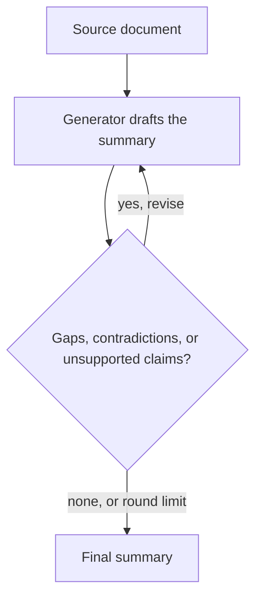
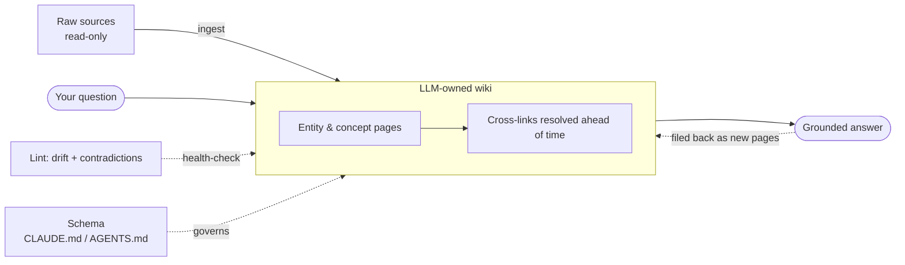
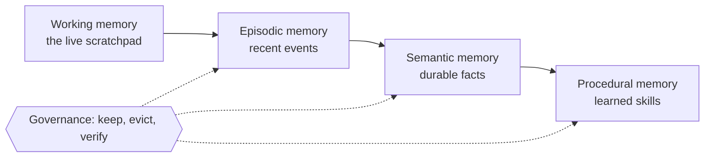

# Chapter 2 — Personal Productivity (愛 in practice)

My first prompt to ChatGPT, in early 2024, was a small disaster. I asked it to summarise an academic paper, and almost nothing went smoothly. The model could not read a PDF, so I had to convert the file to text and paste it in by hand. The paper then proved too long for the model to hold at once, so I chopped it into sections and fed them in one at a time. When I finally had a summary, it underwhelmed me: fluent enough, but it missed the paper's central argument and skipped several points that mattered.

Today that friction is mostly gone, and summarisation is the task everyone reaches for first — meeting transcripts, long email threads, YouTube videos. Yet my original complaint has not entirely aged away. On dense, tightly argued material like an academic paper, a one-shot summary still tends to flatten the argument and lose the very points that make it worth reading. Holding on to that doubt is useful, because closing it is a thread that runs through this whole chapter.

Chapter 1 set the stance; this is where it touches the desk. Productivity is the most personal use of AI, and the easiest to do superficially. The aim is to move from chatting to delegating, put the gains where they actually are, and build a system that compounds rather than resets every morning.

## Prompt Engineering

How will I use AI to summarise a document today? I would probably do something like this:

>Summarise this document for me. It should capture the original structure of the document, preserving chapters, headings and subheadings. The summary should be detailed, concise and covers all the major points and topics in the original document.
>
>The summary should be in the style of a Cliff Notes or study guide. It uses tables, bullet points and diagrams where possible, makes use of GFM alerts to call out asides, definitions, or notes.

That request works because it is engineered, and not vague. **Prompt engineering** is the craft of writing the input so the model returns what you actually want, and it rewards a little structure ([Prompt Engineering Guide](https://www.promptingguide.ai/)). The DAIR.ai guide breaks any prompt into four elements, and my summary request quietly uses three of them.

> [!NOTE]
> The four elements of a prompt ([Prompt Engineering Guide](https://www.promptingguide.ai/introduction/elements)):
>
> - **Instruction** — the task you want done ("summarise this document").
> - **Context** — background that steers the answer: the audience, the purpose, a style to imitate.
> - **Input data** — the material to work on (the document itself).
> - **Output indicator** — the shape of the result you expect: a table, bullet points, strict JSON, a word count.
>
> You rarely need all four; which ones matter depends on the task.

Lined up against my prompt, the parts come apart cleanly:

| Element | In the summary prompt above |
| --- | --- |
| Instruction | "Summarise this document for me" |
| Context | "in the style of a Cliff Notes or study guide" |
| Output indicator | "preserve chapters and headings… use tables, bullet points, GFM alerts" |
| Input data | the document I paste in |

Three habits do most of the work, and the guide keeps returning to them. The first is **specificity**: vague prompts get vague answers, so name the audience, the length, the tone, and the format rather than hoping the model guesses. "Explain this" invites a wall of text; "explain this in three sentences for a non-technical manager" gets you something usable. The second is **say what to do, not what to avoid** — "do not mention price" tends to summon the very thing you forbade, whereas describing the behaviour you want steers more reliably. The third is **show, don't just tell**: a single worked example of the output you want often does more than a paragraph describing it, because the model is, at heart, a pattern-matcher.

The format levers are worth naming, because they are where most of the quality comes from:

- **Tone and style** — "in plain English," "for a sceptical executive," "in the voice of a textbook." Style is a constraint the model honours well.
- **Output structure** — ask for the exact shape you will consume: a markdown table, a numbered list, headings that mirror the source, or strict JSON for a downstream tool.
- **Quality expectations** — state the bar: "cover every major point," "cite the section each claim comes from," "flag anything you are unsure about." Made explicit, these become checks; left implicit, they stay wishes.

Beyond wording, the guide arranges techniques on a ladder, named by how many worked examples you hand the model ([Prompt Engineering Guide](https://www.promptingguide.ai/techniques)). *Zero-shot* prompting gives none at all — you state the task and trust the model's training to carry it, which is enough for the many everyday jobs an instruction-tuned model already knows, like classifying a sentiment or summarising a page ([zero-shot](https://www.promptingguide.ai/techniques/zeroshot)). When the bare instruction wobbles, *few-shot* prompting adds a handful of input–output examples so the model can infer the pattern you want — a form of *in-context learning*, where even the format of the examples carries as much weight as their content ([few-shot](https://www.promptingguide.ai/techniques/fewshot); [Brown et al. 2020](https://arxiv.org/abs/2005.14165)).

Examples alone, though, stall on anything that needs several reasoning steps. The fix is *chain-of-thought* prompting: ask the model to show its working, and accuracy on arithmetic, logic, and multi-step problems climbs sharply ([Wei et al. 2022](https://arxiv.org/abs/2201.11903)). This is the very mechanism Chapter 1 described — the intermediate tokens give the model room to compute — now reached for on purpose. The cheapest version is almost embarrassingly simple: append "Let's think step by step," and a model that fumbled a problem in one leap will often solve it once made to lay out the steps ([Kojima et al. 2022](https://arxiv.org/abs/2205.11916)).

> [!NOTE]
> **Why "let's think step by step" works.** A model answers the instant it stops reading, so a terse question forces a single-leap guess. Asking for the steps first makes each step part of the input for the next — the model literally has more room to compute. Today's *reasoning models* often do this on their own, but the lever still helps when an answer comes back too fast and too sure.

| Technique | What you give the model | Best for |
| --- | --- | --- |
| Zero-shot | Just the instruction | Tasks the model already knows: classify, summarise, rewrite |
| Few-shot | The instruction plus a few examples | Enforcing a specific format or an unusual pattern |
| Chain-of-thought | A request to show its reasoning | Arithmetic, logic, planning — anything multi-step |

A workable rule of thumb: start zero-shot, add examples when the shape drifts, and ask for reasoning when the answer must be derived rather than recalled.

The guide goes well beyond these three. The rest are mostly refinements for harder problems, or scaffolding for builders wiring AI into systems, and several return in later chapters. At a glance ([Prompt Engineering Guide](https://www.promptingguide.ai/techniques)):

Getting steadier reasoning:

- **Self-consistency** — sample several chains of thought and keep the majority answer, trading compute for reliability.
- **Tree of thoughts** — let the model branch, look ahead, and backtrack through alternative paths, for problems that need search rather than a single line.
- **Generated knowledge** — have the model first write down the facts a question depends on, then answer using them.
- **Meta prompting** — point the model at the *structure* of a problem and its solution rather than the specific content.
- **Active-prompt** — choose which examples are worth hand-annotating by finding where the model is least certain.

Bringing in tools and knowledge:

- **Retrieval-augmented generation (RAG)** — fetch relevant documents and place them in the prompt so the answer is grounded in your data, not just training; later chapters return to it.
- **ReAct** — interleave reasoning with actions like web search or running code, so the model looks things up mid-thought instead of guessing.
- **Program-aided language models (PAL)** — offload exact calculation to code the model writes and runs, rather than doing arithmetic in prose.
- **Automatic reasoning and tool-use (ART)** — let the model pick reasoning steps and tools from a library on its own.
- **Reflexion** — have the model critique its own result and try again, learning from the feedback within a session.

Automating the prompt itself:

- **Automatic prompt engineer (APE)** — use a model to generate and score candidate prompts for you.
- **Directional stimulus** — add small tuned hints or keywords that nudge the model toward the answer you want.

And two for other modalities: **multimodal chain-of-thought**, which reasons over images as well as text, and **graph prompting**, for graph-structured data. You do not need most of these to get real value; they are a map of where the craft goes when a plain prompt is not enough.

None of this is a one-shot incantation. Prompting is iterative by nature: start simple, read what comes back, and add the one constraint that was missing ([Prompt Engineering Guide](https://www.promptingguide.ai/introduction/tips)). The loop from Chapter 1 applies unchanged — intent, context, response, refine — and the prompt worth keeping is the one you arrive at, not the one you began with. These techniques are the floor; the chapters ahead build on them toward context, harnesses, and agents that carry the structure for you.

## From Prompt Engineering to Agents

The summary prompt above is a single shot: you fire it, read the result, and judge it yourself. That is the right place to start, but it leaves three things on the table — the prompt is not reusable, it does not check its own work, and only you can run it. Closing those three gaps is the whole journey from prompting to agents, and our humble summary makes a good worked example.

### Step one: save the prompt as a skill

The first upgrade is to stop retyping. Package the prompt as a *skill* — at its simplest, a folder with a `SKILL.md` file: a short name and description so the agent knows when to reach for it, followed by the instructions themselves ([Anthropic, 2025](https://www.anthropic.com/engineering/equipping-agents-for-the-real-world-with-agent-skills)). Anthropic likens a skill to an onboarding guide for a new hire: written once, it turns a general agent into one that knows your house style for summaries.

> [!NOTE]
> A **skill** is a directory containing a `SKILL.md` file — YAML metadata (a `name` and a `description`) plus the instructions, and optionally bundled reference files and scripts the agent loads only when it needs them. Published as an open standard in late 2025, the same skill works across Claude, Claude Code, and other agents ([Agent Skills](https://agentskills.io/)).

```markdown
---
name: study-guide-summary
description: Summarise a document as a Cliff Notes study guide, preserving its structure.
---

Summarise the document the user provides. Preserve its chapters, headings, and
subheadings; cover every major point. Use tables, bullet lists, and GFM alerts
for asides and definitions. Flag anything the source leaves unclear.
```

Now the expertise lives in a file, not in your head, and anyone — or any agent — can apply it the same way every time.

### Step two: wrap it in a self-checking loop

A skill still runs once. The flaw you met at the start of this chapter — summaries that miss points or drift from the source — is exactly what a loop fixes. Split the work between two roles: a *generator* that drafts the summary, and an *evaluator* that reads the draft back against the original and lists what is missing, contradicted, or unsupported. The generator revises, the evaluator checks again, and the cycle repeats until the evaluator finds nothing left to fix — or you hit a sensible limit on rounds. Anthropic calls this the *evaluator–optimizer* workflow and notes it pays off precisely when there are clear criteria and iterative refinement measurably improves the result, "analogous to the iterative writing process a human writer might go through" ([Anthropic, 2024](https://www.anthropic.com/engineering/building-effective-agents)).



This is the loop you wanted — keep reviewing the summary against the document, find the gaps, and iterate until there are none. Whether it counts as a *workflow* or a true *agent* is a useful distinction: if the steps are fixed in code it is a workflow; if the model itself decides what to re-check, whether to re-read a section, and when it is done, it is an agent — an LLM using tools in a loop until a stopping condition is met ([Anthropic, 2024](https://www.anthropic.com/engineering/building-effective-agents)). Either way the stopping condition matters: without a cap on rounds, a perfectionist evaluator can loop forever and run up the bill.

### Step three: share it through MCP

The loop is still yours alone. To let other agents use it, wrap it as a *Model Context Protocol* (MCP) server. MCP is an open standard — "a USB-C port for AI" — that lets any compliant agent connect to outside tools, data, and workflows through one interface; you build the capability once and integrate it everywhere ([Model Context Protocol](https://modelcontextprotocol.io/introduction)). Expose your summarise-and-verify loop as an MCP server and a coding agent in your editor, a chat assistant, or a teammate's agent can all call it by name, with no idea how it works inside. Skills and MCP are complementary: a skill teaches one agent a workflow; an MCP server offers that workflow to every agent ([Anthropic, 2025](https://www.anthropic.com/engineering/equipping-agents-for-the-real-world-with-agent-skills)).

> [!NOTE]
> The **Model Context Protocol (MCP)** is an open standard for connecting AI applications to outside systems — data sources, tools, and workflows — through one common interface, so a capability built once works across many agents and clients ([Model Context Protocol](https://modelcontextprotocol.io/introduction)).

The arc is the whole book in miniature: a prompt becomes a skill, the skill becomes a self-correcting loop, and the loop becomes a shared capability other agents can stand on. Each step trades a little setup for leverage that compounds — and at every step the human still owns the one thing the loop cannot supply: the judgement of whether the summary was worth making. Do this often enough and it stops being a trick you pull for one document; it becomes the way you work.

## From Chat Assistant to Ambient Teammate

That self-running loop is a small taste of a larger shift in how you work. Most people still meet AI as a chat box, and that framing quietly caps what they get: a conversation is synchronous — you ask, you wait, you steer, you ask again — so your attention sets the pace. The loop you just built does not wait on you. You hand it a bounded task, it works while you are elsewhere, and you come back to a result rather than a transcript. Make that the default rather than the exception, and the chat assistant becomes an *ambient teammate*.

> [!NOTE]
> An **ambient teammate** is an agent that runs asynchronously in the background — given a scoped task and the tools to finish it — rather than waiting on each instruction. You delegate the task, not the keystrokes.

The shift sounds small and is not, because it changes who the bottleneck is. As Karpathy puts it, the goal is to remove yourself from the keystroke loop and maximise throughput rather than steer every step ([Loopcraft](https://www.latent.space/p/ainews-loopcraft-the-art-of-stacking)). OpenAI's internal figures make the leverage tangible: agent output grew many-fold across functions once people delegated whole tasks instead of supervising each one. The throughput is real — but it counts as work done only once someone has checked the result, a distinction the rest of this book keeps insisting on.

The practice is simple to state: scope work tightly, fire it off, review the outcome. The temptation worth resisting is hovering over each keystroke, which pins your leverage to your own typing speed.

## Knowledge Work, Not Just Code

The surprising lesson of 2026 is that the biggest agent gains are in knowledge work — research, writing, synthesis, decision support — not in code. These are bounded, high-feedback tasks where a model can draft, compare, and summarise faster than any human, and where production was never the slow part.

The effect is uneven. A study of 5,179 customer-support agents found AI raised resolved-issues-per-hour by 14% on average but 34% for novices, with little gain for experts — the tool spreads the best workers' know-how to everyone else ([Brynjolfsson, Li & Raymond 2023](https://www.nber.org/papers/w31161)). What stays expensive is judgement: deciding whether the work was worth doing at all.

So delegate the drafting and the bookkeeping freely; keep the "why" for yourself. McKinsey's high performers do exactly this, treating AI as a catalyst for redesigned work rather than faster typing ([McKinsey 2025](https://www.mckinsey.com/capabilities/quantumblack/our-insights/the-state-of-ai)). It reaches into elicitation too: an LLM reading stakeholder interviews extracted explicit needs at 84.4% F1 and inferred *latent* ones experts judged useful 75% of the time ([LENS](../research/papers/2606.25867-latent-requirements.md)). The failure that shadows the gain is producing more while validating less — confident output at volume that nobody has checked.

## The Confidence Trap

Delegation has a shadow the research is now measuring, and the surprise is that the harm is not the model being wrong — it is what leaning on it does to your own judgement.

Start with a clean experiment. Parra-Moyano and colleagues showed executives Nvidia's stock chart and asked them to forecast next month's price; half then consulted ChatGPT, half talked it over with peers. The AI group came away more optimistic, more confident, and measurably *less* accurate than the people who simply argued with each other ([HBR 2025](https://hbr.org/2025/07/research-executives-who-used-gen-ai-made-worse-predictions)). A colleague says "are you insane?"; the model says your framing is astute.

Part of the cause is that ease reads as truth. Psychologists call it *processing fluency*: the easier something is to take in, the truer it feels. People rate rhyming aphorisms as more accurate than identical non-rhyming ones, and judge repeated falsehoods as more credible than fresh ones ([McGlone & Tofighbakhsh 2000](https://doi.org/10.1111/1467-9280.00282); [Fazio et al. 2015](https://doi.org/10.1037/xge0000098)). AI is exceptionally good at making prose easy to read: when people compared AI- and human-written versions of the same material, they judged them equally credible but rated the AI version *clearer and more engaging* ([Huschens et al. 2023](https://arxiv.org/abs/2309.02524)). So its answers clear the "feels right" bar whether or not they are right.

The confidence is also contagious. When people made predictions alongside an AI, their own confidence drifted to match the model's — and stayed inflated even after the AI was removed, whether they had been told to treat it as an advisor or as a peer ([Li et al. 2025](https://arxiv.org/abs/2501.12868)). Even a quietly biased writing assistant shifted not just what 1,500 people wrote but the opinions they reported holding afterwards ([Jakesch et al. 2023](https://arxiv.org/abs/2302.00560)).

Worst of all, it dulls your sense of how you are doing. Giving people AI on reasoning tasks raised their scores but flattened their self-judgement: strong and weak performers ended up equally — and wrongly — sure of themselves, and the more someone knew about AI, the *less* accurate their self-assessment became. AI makes you smarter, the authors conclude, but none the wiser ([Fernandes et al. 2026](https://doi.org/10.1016/j.chb.2025.108779)).

The practical defence is to sort tasks by how much judgement they need. Where the answer is verifiable — pull these quotes, extract these figures, refactor this function — the model is mostly safe to trust. The danger climbs as the task slides from "find what's there" to "decide what matters," and the slide is easy to miss: "summarise these interviews" and "tell me which themes to act on" feel like one request. For the second kind, form your own view first and bring the AI in to test it, not to make it — otherwise you delegate the one thing that was yours to keep.

| Kind of task | Example | Verifiable? | How far to trust it |
| --- | --- | --- | --- |
| Find what's there | Pull these quotes; extract these figures; refactor a function | Yes — the answer is checkable | Lean in |
| Summarise or transform | Condense a report; translate a passage | Mostly | Trust, then spot-check |
| Decide what matters | Which themes to act on; which strategy to pick | No single right answer | Form your own view first |

## Personal Operating Models

Leverage compounds only if you stop re-deciding everything. A personal operating model is a small, reusable kit: plays you can rerun, preferences encoded once so you never re-explain them, and a daily workflow that feeds itself. The point is to turn scattered prompting into a system, the same instinct the book applies everywhere — repeatable patterns over one-off prompts. The waste it removes is re-solving the same problem from scratch each session, which feels productive and is not.

## Building an LLM Wiki

The clearest example of compounding is Karpathy's LLM Wiki, and it is worth a careful look because it inverts the usual pattern. Most document workflows are retrieval: you upload files, the model fetches chunks at query time, answers, and forgets. It rediscovers knowledge on every question, and nothing is built up.

A wiki accumulates instead. Add a source and the model reads it once, extracts what matters, and integrates it into interlinked markdown pages — updating entity pages, flagging where new data contradicts old, strengthening the synthesis. The cross-references are resolved ahead of the next question rather than reconstructed each time ([llm-wiki](https://gist.github.com/karpathy/442a6bf555914893e9891c11519de94f)).

Three layers make it work: read-only raw sources you never let the model edit, an LLM-owned wiki of summaries and concept pages, and a schema file — CLAUDE.md or AGENTS.md — that tells the agent how the wiki is structured and how to maintain it.



The loop is ingest, query, lint: drop in a source and it touches a dozen pages; ask a question and good answers get filed back as new pages; periodically health-check for contradictions and stale claims. The reason it holds where human wikis rot is that the tedious part is bookkeeping, and the model does not get bored. The pitfall, which practitioners running it for months confirm, is confident-but-stale pages hardening into truth — which is why the lint pass that hunts drift is not optional but central.

The wiki is one good answer to a problem every long-running agent faces, and it helps to see the whole family it belongs to.

## A Map of Memory Patterns

A model has no memory of its own: its knowledge is frozen in its weights, and each request starts from nothing but the text you place in front of it. The obvious fix — pour everything into an ever-larger context window — works less well than it looks. Context is a finite resource with diminishing returns; every extra token spends part of the model's "attention budget," and recall sags as the window fills, the *lost in the middle* effect from Chapter 1 ([Anthropic, 2025](https://www.anthropic.com/engineering/effective-context-engineering-for-ai-agents)). In practice the *effective* context — the span a model actually uses well — often falls to around half its advertised maximum ([An et al., 2024](https://arxiv.org/abs/2410.18745)). So memory must be engineered rather than merely supplied, and the gap between an agent with good memory and one without can exceed the gap between model versions ([Du et al., 2026](https://arxiv.org/abs/2603.07670)).

The patterns form a rough ladder, from "stuff it into the prompt" to "manage it outside the prompt":

- **Retrieval (RAG).** Fetch the relevant chunks from a store and paste them into the context. Simple and auditable — the answer quotes real text — but it re-discovers everything on every question and bloats the window as you add more.
- **Compaction.** When the conversation nears the window limit, summarise it and start fresh with the recap. This is how Claude Code keeps going on long tasks, preserving decisions and open threads while dropping spent tool output ([Anthropic, 2025](https://www.anthropic.com/engineering/effective-context-engineering-for-ai-agents)). It buys space at the cost of detail, and repeated summarising can quietly drift from the source.
- **Structured notes — the wiki.** The pattern we just built: durable pages the agent reads and rewrites, from a single `NOTES.md` to an interlinked wiki. Because the notes live outside the conversation and stay human-readable, they survive context resets and can be audited ([Anthropic, 2025](https://www.anthropic.com/engineering/effective-context-engineering-for-ai-agents)).
- **External store, fetched just in time.** Keep the memory out of the prompt entirely; the agent holds only lightweight pointers — file paths, saved queries, links — and pulls in what it needs at runtime through tools, the way we use folders and bookmarks instead of memorising everything ([Anthropic, 2025](https://www.anthropic.com/engineering/effective-context-engineering-for-ai-agents)).
- **Layered memory.** Separate memory by how long it should last: a *working* scratchpad for the task at hand, *episodic* memory of recent events, *semantic* memory of durable facts, and *procedural* memory of learned skills, each managed differently ([Du et al., 2026](https://arxiv.org/abs/2603.07670)). The idea is not new: the Generative Agents experiment stored each observation and retrieved it by a blend of relevance, recency, and importance ([Park et al., 2023](https://arxiv.org/abs/2304.03442)).
- **Governed memory.** Once memory is something the agent writes to and edits, it needs rules: what may be remembered, when stale or contradictory entries are evicted, what must be checked before it enters the long-term store. A governance layer guards against the failure modes of evolving memory — drift, corruption, and leaks of private data ([Lam, 2026](https://arxiv.org/abs/2603.11768)).



| Pattern | The idea | Strength | Main risk |
| --- | --- | --- | --- |
| Retrieval (RAG) | Fetch chunks, inject verbatim | Grounded, auditable | Context bloat; re-discovers each time |
| Compaction | Summarise history, restart | Keeps long tasks going | Lossy; summary drift |
| Structured notes / wiki | Durable pages the agent edits | Stable, human-auditable | Curation effort; stale pages |
| External store + just-in-time | Pointers now, fetch on demand | Huge capacity, tight context | Fails if the agent forgets to look |
| Layered memory | Split by time horizon | Right tool per layer | Orchestration complexity |
| Governed memory | Policies write, keep, forget | Safety and consistency | Hard to specify; still maturing |

No single pattern wins; real systems combine them — a wiki for stable knowledge, compaction for the live thread, an external store fetched just in time, all under a governance layer that decides what is allowed to last. The wiki you just built is one rung on that ladder. The deeper lesson is the chapter's: memory is something you engineer as a *write–manage–read* cycle, not something the model hands you — and the moment it persists and edits itself, it becomes a governance question, which is where Chapter 5 picks up.
