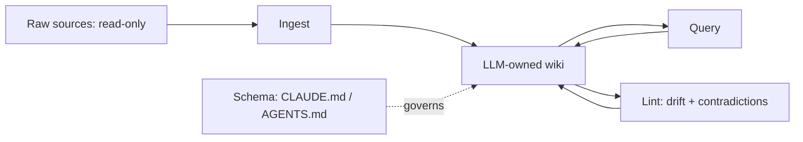

# Chapter 2 — Personal Productivity (愛 in practice)

My first month with an AI assistant, I treated it like a faster search box. I typed, it answered, I tweaked, it answered again — and by lunchtime I was exhausted from steering. The day I handed it a whole task and walked away, then came back to a finished draft, something clicked. I had been the bottleneck all along.

Chapter 1 set the stance; this is where it touches the desk. Productivity is the most personal use of AI and the easiest to do superficially. The aim is to move from chatting to delegating, put the gains where they actually are, and build a system that compounds rather than resets every morning.

## From Chat Assistant to Ambient Teammate

Most people meet AI as a chat box, and that framing quietly caps what they get from it. A conversation is synchronous: you ask, you wait, you steer, you ask again, and your attention is the rate limiter. An ambient teammate works differently. You hand it a bounded task, it works asynchronously, and you return to a result rather than a transcript.

> [!NOTE]
> An **ambient teammate** is an agent that runs asynchronously in the background — given a scoped task and the tools to finish it — rather than waiting on each instruction. You delegate the task, not the keystrokes.

The shift sounds small and is not, because it changes who the bottleneck is. As Karpathy puts it, the goal is to remove yourself from the loop and maximise throughput rather than supervise every step ([Loopcraft](https://www.latent.space/p/ainews-loopcraft-the-art-of-stacking)). OpenAI's internal figures make the leverage tangible: agent output grew many-fold across functions once people stopped babysitting.

The practice is simple to state: scope work tightly, fire it off, review the outcome. The temptation worth resisting is hovering over each keystroke, which pins your leverage to your own typing speed.

## Knowledge Work, Not Just Code

The surprising lesson of 2026 is that the biggest agent gains are in knowledge work — research, writing, synthesis, decision support — not in code. These are bounded, high-feedback tasks where a model can draft, compare, and summarise faster than any human, and where production was never the slow part.

The effect is uneven. A study of 5,179 customer-support agents found AI raised resolved-issues-per-hour by 14% on average but 34% for novices, with little gain for experts — the tool spreads the best workers' know-how to everyone else ([Brynjolfsson, Li & Raymond 2023](https://www.nber.org/papers/w31161)). What stays expensive is judgement: deciding whether the work was worth doing at all.

So delegate the drafting and the bookkeeping freely; keep the "why" for yourself. McKinsey's high performers do exactly this, treating AI as a catalyst for redesigned work rather than faster typing ([McKinsey 2025](https://www.mckinsey.com/capabilities/quantumblack/our-insights/the-state-of-ai)). It reaches into elicitation too: an LLM reading stakeholder interviews extracted explicit needs at 84.4% F1 and inferred *latent* ones experts judged useful 75% of the time ([LENS](../research/papers/2606.25867-latent-requirements.md)). The failure that shadows the gain is producing more while validating less — confident output at volume that nobody has checked.

## Personal Operating Models

Leverage compounds only if you stop re-deciding everything. A personal operating model is a small, reusable kit: plays you can rerun, preferences encoded once so you never re-explain them, and a daily workflow that feeds itself. The point is to turn scattered prompting into a system, the same instinct the book applies everywhere — repeatable patterns over one-off prompts. The waste it removes is re-solving the same problem from scratch each session, which feels productive and is not.

## Building an LLM Wiki

The clearest example of compounding is Karpathy's LLM Wiki, and it is worth a careful look because it inverts the usual pattern. Most document workflows are retrieval: you upload files, the model fetches chunks at query time, answers, and forgets. It rediscovers knowledge on every question, and nothing is built up.

A wiki accumulates instead. Add a source and the model reads it once, extracts what matters, and integrates it into interlinked markdown pages — updating entity pages, flagging where new data contradicts old, strengthening the synthesis. The cross-references are resolved ahead of the next question rather than reconstructed each time ([llm-wiki](https://gist.github.com/karpathy/442a6bf555914893e9891c11519de94f)).

Three layers make it work: read-only raw sources you never let the model edit, an LLM-owned wiki of summaries and concept pages, and a schema file — CLAUDE.md or AGENTS.md — that tells the agent how the wiki is structured and how to maintain it.

The loop is ingest, query, lint: drop in a source and it touches a dozen pages; ask a question and good answers get filed back as new pages; periodically health-check for contradictions and stale claims. The reason it holds where human wikis rot is that the tedious part is bookkeeping, and the model does not get bored. The pitfall, which practitioners running it for months confirm, is confident-but-stale pages hardening into truth — which is why the lint pass that hunts drift is not optional but central.
