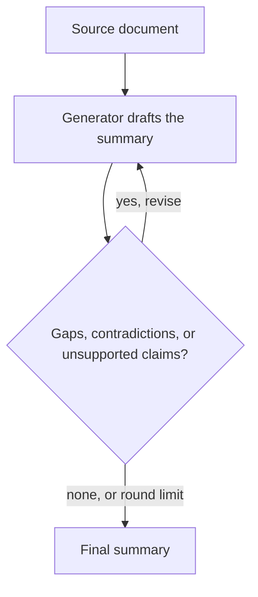
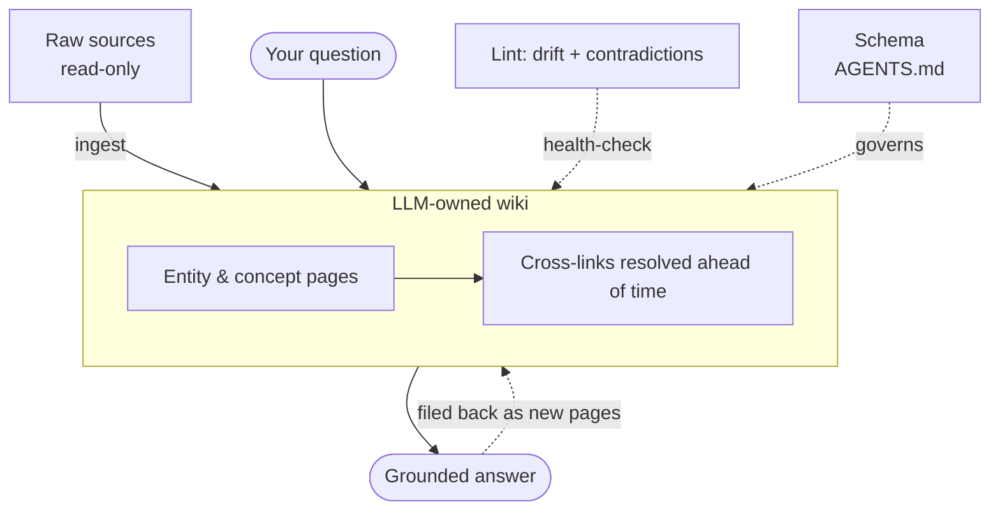
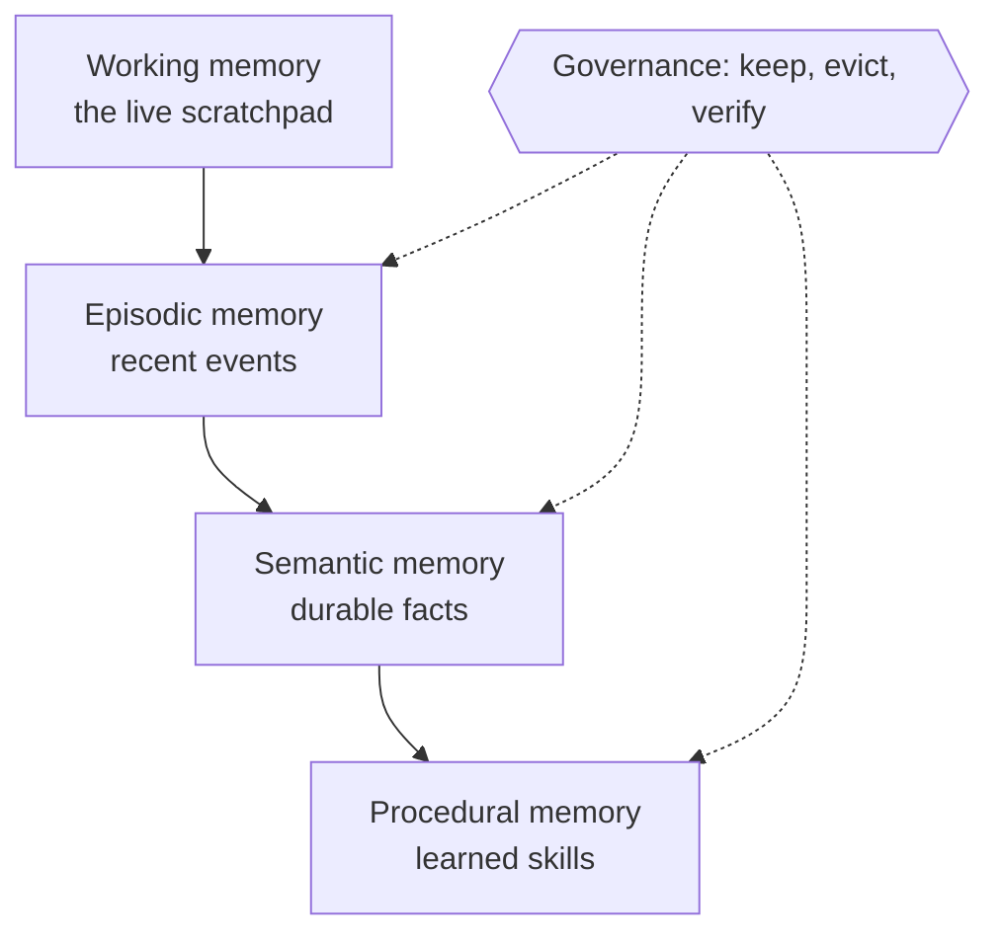
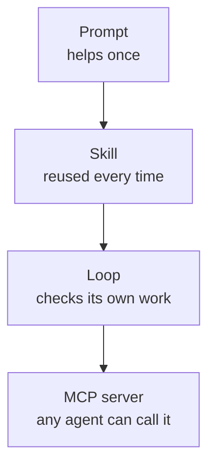

# Chapter 2 — Personal Productivity (愛 in practice)

My first prompt to ChatGPT did not turn out the way I expected. I asked it to summarise an academic paper, and almost nothing went smoothly. The model could not read a PDF, so I had to convert the file to text and paste it in by hand. The paper then proved too long for the model to hold at once, so I chopped it into sections and fed them in one at a time. When I finally had a summary, it underwhelmed me: the summary missed the paper's central argument and skipped several points that mattered.

Today, AI summarisation can be very good and is commonly used for meeting transcripts, long email threads, YouTube videos, etc. However, on dense, tightly argued material like an academic paper, an AI summary can still get it hilariously wrong. Holding on to that doubt is useful; learning to close that gap is a thread that runs through this whole chapter.

Chapter 1 sets the scene; this is where it touches the desk. Productivity is the most personal use of AI, and the easiest to do superficially. The aim is a system that produces work rather than just conversation, and that gets better over time instead of starting from scratch every morning.

This chapter is about a *single* agent working for you, and the three crafts that make it dependable: **prompt engineering** (§2.3) — asking well; **context engineering** (§2.5) — curating what the agent sees; and **loop engineering** (§2.6) — wrapping it in self-correcting cycles. Chapter 3 takes those same crafts into software development, where the discipline sharpens into **intent, context, and expectations (ICE)**: saying what the system must do, and how you will verify it is right, rather than how to build it. Chapter 4 takes the step beyond one agent, to the disciplines of humans and agents working together.

## 2.1 From a Prompt to a Reusable Tool

How will I use AI to summarise a document today? I would probably do something like this:

>Summarise this document for me. It should capture the original structure of the document, preserving chapters, headings and subheadings. The summary should be detailed and concise, and cover all the major points and topics in the original document.
>
>The summary should be in the style of a Cliff Notes or study guide. It uses tables, bullet points and diagrams where possible, makes use of GFM alerts to call out asides, definitions, or notes.

The above may seem complex, but it is a single prompt: you send it with the text to be summarised and read the result — and it may produce a better summary than a simple prompt would. (The *GFM alerts* it asks for are GitHub-Flavoured Markdown call-out boxes — the Note boxes used throughout this book.) This is a good start, but you have to type it in every time. And you have to check the results every time as the response can still be wrong. Finally, you are the only person who knows that prompt, others will use different variations. Addressing those issues is the whole journey from prompting to agents, so let's explore ways of improving our method.

### 2.1.1 Step one: save the prompt as a skill

The first improvement is to stop retyping. Package the prompt as a *skill* — at its simplest, a folder with a `SKILL.md` file: a short name and description so the agent knows when to reach for it, followed by the instructions themselves ([Anthropic, *Equipping agents for the real world with Agent Skills*, 2025c](https://www.anthropic.com/engineering/equipping-agents-for-the-real-world-with-agent-skills)). Anthropic likens a skill to an onboarding guide for a new hire: written once, it turns a general agent into one that knows your house style for summaries.

> [!NOTE]
> A **skill** is a directory containing a `SKILL.md` file — YAML metadata (a `name` and a `description`) plus the instructions, and optionally bundled reference files and scripts the agent loads only when it needs them. Published as an open standard in late 2025, the same skill works across Claude, Claude Code, and other agents ([Agent Skills, *Agent Skills*, n.d.](https://agentskills.io/)).

```markdown
---
name: study-guide-summary
description: Summarise a document as a Cliff Notes study guide, preserving its structure.
---

Summarise a document for the user. It should capture the original structure of the document, preserving chapters, headings and subheadings. The summary should be detailed and concise, and cover all the major points and topics in the original document.

The summary should be in the style of a Cliff Notes or study guide. It uses tables, bullet points and diagrams where possible, makes use of GFM alerts to call out asides, definitions, or notes.
```

Now the expertise lives in a file, not in your head, and anyone — or any agent — can apply it the same way every time.

### 2.1.2 Step two: wrap it in a self-checking loop

A skill still runs once. The flaw you met at the start of this chapter — summaries that miss points or drift from the source — is exactly what a loop fixes. Split the work between two roles: a *generator* that drafts the summary, and an *evaluator* that reads the draft back against the original and lists what is missing, contradicted, or unsupported. The generator revises, the evaluator checks again, and the cycle repeats until the evaluator finds nothing left to fix — or you hit a sensible limit on rounds. Anthropic calls this the *evaluator–optimizer* workflow and notes it pays off precisely when there are clear criteria and iterative refinement measurably improves the result, "analogous to the iterative writing process a human writer might go through" ([Anthropic, *Building effective agents*, 2024a](https://www.anthropic.com/research/building-effective-agents)).


```mermaid
flowchart TB
    D[Source document] --> G[Generator drafts the summary]
    G --> E{Gaps, contradictions, or unsupported claims?}
    E -- yes, revise --> G
    E -- none, or round limit --> Out[Final summary]
```

Depending on the agent platform you are using, the specific way you will construct a loop may be slightly different. Here is a naive approach that will actually work with some agent platforms — a *subagent* being simply a fresh agent spawned to handle one part of the job:

```markdown
---
name: loop-summary
description: Summarise a document and loop until the summary is correct.
---

Create a subagent that summarises a document for the user. It should capture the original structure of the document, preserving chapters, headings and subheadings. The summary should be detailed and concise, and cover all the major points and topics in the original document. The summary should be in the style of a Cliff Notes or study guide. It uses tables, bullet points and diagrams where possible, makes use of GFM alerts to call out asides, definitions, or notes.

When the subagent has finished create another subagent to compare the summary against the original document. Identify gaps, issues and inconsistencies. The subagent must fix all problems and return an updated summary.

Keep running the second subagent until there are no more problems. Output the final summary.
```

This is the loop you wanted — keep reviewing the summary against the document, find the gaps, and iterate until there are none. Whether it counts as a *workflow* or a true *agent* is a useful distinction: if the steps are fixed in code it is a workflow; if the model itself decides what to re-check, whether to re-read a section, and when it is done, it is an agent — an LLM using tools in a loop until a stopping condition is met ([Anthropic, 2024a](https://www.anthropic.com/research/building-effective-agents)). Either way the stopping condition matters: without a cap on rounds, a perfectionist evaluator can loop forever and run up the bill.

### 2.1.3 Step three: share it through MCP

The loop is still yours alone. To let other agents use it, wrap it as a *Model Context Protocol* (MCP) server. MCP is an open standard — "a USB-C port for AI" — that lets any compliant agent connect to outside tools, data, and workflows through one interface; you build the capability once and integrate it everywhere ([Model Context Protocol, *Introduction*, n.d.](https://modelcontextprotocol.io/introduction)). Expose your summarise-and-verify loop as an MCP server and a coding agent in your editor, a chat assistant, or a teammate's agent can all call it by name, with no idea how it works inside. Skills and MCP are complementary: a skill teaches one agent a workflow; an MCP server offers that workflow to every agent ([Anthropic, 2025c](https://www.anthropic.com/engineering/equipping-agents-for-the-real-world-with-agent-skills)).

> [!NOTE]
> The **Model Context Protocol (MCP)** is an open standard for connecting AI applications to outside systems — data sources, tools, and workflows — through one common interface, so a capability built once works across many agents and clients ([Model Context Protocol, n.d.](https://modelcontextprotocol.io/introduction)).

In some agent platforms, creating an MCP server can be as simple as a single prompt:

> Create an MCP server for the loop-summary skill.

These three steps are worth pausing on, because the rest of the book repeats them at larger scales. A prompt became a skill, the skill became a self-checking loop, and the loop became a shared tool that other agents can use. This is the Unix Rule of Composition — programs built to connect to other programs — applied to an agent ([Raymond, *The art of Unix programming*, 2003](http://www.catb.org/esr/writings/taoup/)). Each step costs a little setup and saves you work on every document after it. And at every step, one job still belongs to you: deciding whether the summary was worth making at all. Do this often enough and it becomes the normal way you work.

## 2.2 The Unix Philosophy, Reborn

It is worth naming where this approach comes from, because it is not new. In the early 1970s, Ken Thompson and Dennis Ritchie, the builders of Unix — the operating system whose descendants still run most of the internet and power most of our personal devices, phones included — settled on a philosophy of building software that is still relevant today. Doug McIlroy, who invented the Unix pipe, distilled the philosophy in the 1978 Bell Labs journal foreword: "Write programs that do one thing and do it well. Write programs to work together. Write programs to handle text streams, because that is a universal interface" ([McIlroy et al., *UNIX time-sharing system: Foreword*, 1978](https://doi.org/10.1002/j.1538-7305.1978.tb02135.x)). Eric Raymond later drew the philosophy out into a set of rules — among them the Rule of Composition, "design programs to be connected to other programs," and the Rule of Separation, "separate policy from mechanism" ([Raymond, 2003](http://www.catb.org/esr/writings/taoup/)).

Read those rules again with an agent in mind, and they describe working with AI surprisingly well. Instead of small programs piped together, you build up small, clear requests into larger pieces of work. And where Unix made plain text the universal interface between its tools, Markdown has become the format a model most naturally reads and writes. (Markdown is plain text with light punctuation to mark the structure: `#` for a heading, `-` for a bullet, `**bold**` for emphasis. Section 2.4 has more to say about it.) The parallels are close enough to lay out side by side, because each Unix rule has an AI-dō counterpart that the rest of this book develops.

| Unix philosophy | AI-dō, the philosophy reloaded |
| --- | --- |
| Do one thing well | Give one clear ask at a time; build up in steps |
| Programs work together (composition) | A prompt becomes a skill, a skill a loop, a loop a shared tool |
| Text is the universal interface | Markdown is the universal format — the model's native input and output |
| Separate policy from mechanism | Separate intent (the *what*) from implementation (the *how*) |
| Prototype before you polish | Run it, then refine; do not over-specify up front |
| Store data in flat text files | Keep memory in durable, human-readable documents |
| Fail noisily and early; be robust | Verify at the boundaries; stop a drifting run and re-steer |
| Value people's time over machine time | Spend judgement, not tokens; measure value, not output |

Two differences matter, though. First, a Unix program is deterministic: run it twice on the same input and it does the same thing. A model is not, as Chapter 1 showed. Unix programmers could trust a tool once it worked; we have to keep checking ours. That is why verification comes up in every chapter that follows. Second, the Unix philosophy was written by programmers to save programmers' time. AI-dō adds the 愛: care for the people the work touches, and a human who stays answerable for what the machine produces. The philosophy is fifty years old. The new part is the tool: it writes fluent prose at great speed, and it is sometimes wrong while sounding certain.

## 2.3 Prompt Engineering

Let's return to the summary prompt that opened this chapter. It works better than a one-line request because it spells out what I actually want. Writing prompts this way is called **prompt engineering**, and it rewards a little structure ([DAIR.ai, *Prompt engineering guide*, n.d.](https://www.promptingguide.ai/)). The DAIR.ai guide breaks any prompt into four elements, and my summary request quietly uses all four of them.

> [!NOTE]
> The four elements of a prompt ([DAIR.ai, *Prompt engineering guide*, n.d.](https://www.promptingguide.ai/introduction/elements)):
>
> - **Instruction** — the task you want done ("summarise this document").
> - **Context** — background that steers the answer: the audience, the purpose, a style to imitate.
> - **Input data** — the material to work on (the document itself).
> - **Output indicator** — the shape of the result you expect: a table, bullet points, strict JSON, a word count.
>
> You rarely need all four; which ones matter depends on the task.

Line these up against my prompt and you can see each element at work:

| Element | In the summary prompt above |
| --- | --- |
| Instruction | "Summarise this document for me" |
| Context | "in the style of a Cliff Notes or study guide" |
| Output indicator | "preserve chapters and headings… use tables, bullet points, GFM alerts" |
| Input data | the document I paste in |

Three habits make most of the difference, and the guide keeps returning to them. The first is **specificity**: vague prompts get vague answers, so name the audience, the length, the tone, and the format rather than hoping the model guesses. "Explain this" invites a wall of text; "explain this in three sentences for a non-technical manager" gets you something usable. The second is **say what to do, not what to avoid** — "do not mention price" often produces exactly what you told it to avoid, whereas describing the behaviour you want steers more reliably. The third is **show, don't just tell**: a single worked example of the output you want often does more than a paragraph describing it, because the model is, at heart, a pattern-matcher.

The formatting instructions deserve their own mention, because they are where much of the quality comes from:

- **Tone and style** — "in plain English," "for a sceptical executive," "in the voice of a textbook." Style is a constraint the model honours well.
- **Output structure** — ask for the exact shape you will consume: a markdown table, a numbered list, headings that mirror the source, or strict JSON for a downstream tool.
- **Quality expectations** — state the bar: "cover every major point," "cite the section each claim comes from," "flag anything you are unsure about." If you write them down, you can check the result against them later. If you leave them unsaid, you have no way to tell whether the output met the bar.

Beyond wording, the guide arranges techniques on a ladder, named by how many worked examples you hand the model ([DAIR.ai, *Prompt engineering guide*, n.d.](https://www.promptingguide.ai/techniques)). *Zero-shot* prompting gives none at all — you state the task and trust the model's training to carry it, which is enough for the many everyday jobs an instruction-tuned model — one trained to follow instructions rather than just continue text — already knows, like classifying a sentiment or summarising a page ([DAIR.ai, *Prompt engineering guide*, n.d.](https://www.promptingguide.ai/techniques/zeroshot)). When the bare instruction wobbles, *few-shot* prompting adds a handful of input–output examples so the model can infer the pattern you want — a form of *in-context learning*, where even the format of the examples carries as much weight as their content ([DAIR.ai, *Prompt engineering guide*, n.d.](https://www.promptingguide.ai/techniques/fewshot); [Brown et al., *Language models are few-shot learners*, 2020](https://arxiv.org/abs/2005.14165)).

Examples alone, though, stall on anything that needs several reasoning steps. The fix is *chain-of-thought* prompting: ask the model to show its working, and accuracy on arithmetic, logic, and multi-step problems climbs sharply ([Wei et al., *Chain-of-thought prompting elicits reasoning in large language models*, 2022a](https://arxiv.org/abs/2201.11903)). Chapter 1 described this mechanism: the intermediate tokens give the model room to compute. Here you ask for it on purpose. The cheapest version is almost embarrassingly simple: append "Let's think step by step," and a model that fumbled a problem in one leap will often solve it once made to lay out the steps ([Kojima et al., *Large language models are zero-shot reasoners*, 2022](https://arxiv.org/abs/2205.11916)).

> [!NOTE]
> **Why "let's think step by step" works.** A model answers the instant it stops reading, so a terse question forces a single-leap guess. Asking for the steps first makes each step part of the input for the next — the model literally has more room to compute. Today's *reasoning models* often do this on their own, but the lever still helps when an answer comes back too fast and too sure.

| Technique | What you give the model | Best for |
| --- | --- | --- |
| Zero-shot | Just the instruction | Tasks the model already knows: classify, summarise, rewrite |
| Few-shot | The instruction plus a few examples | Enforcing a specific format or an unusual pattern |
| Chain-of-thought | A request to show its reasoning | Arithmetic, logic, planning — anything multi-step |

A workable rule of thumb: start with zero-shot. If the output keeps coming back in the wrong shape, add examples. If the answer has to be worked out rather than remembered, ask for the reasoning.

The guide goes well beyond these three. You do not need most of what follows day to day — skim it, and come back when a plain prompt is not enough. The rest are mostly refinements for harder problems, or building blocks for people wiring AI into systems, and several return in later chapters. At a glance ([DAIR.ai, n.d.](https://www.promptingguide.ai/techniques)):

Getting steadier reasoning:

- **Self-consistency** — sample several chains of thought and keep the majority answer; the *diversity* of reasoning paths, not just more samples, is what lifts accuracy (about +18% on GSM8K), and the gain saturates after a dozen or two, so 5–10 captures most of it ([Wang et al., *Self-consistency improves chain-of-thought reasoning in language models*, 2022](https://arxiv.org/abs/2203.11171)).
- **Tree of thoughts** — let the model branch, look ahead, and backtrack through alternative paths, for problems that need search rather than a single line; on the Game of 24 this took GPT-4 from 4% with chain of thought to 74%, beating even a hundred-chain ensemble ([Yao et al., *Tree of Thoughts: Deliberate problem solving with large language models*, 2023](https://arxiv.org/abs/2305.10601)).
- **Generated knowledge** — have the model first write down the facts a question depends on, then answer using them ([J. Liu et al., *Generated knowledge prompting for commonsense reasoning*, 2022](https://arxiv.org/abs/2110.08387)).
- **Meta prompting** — point the model at the *structure* of a problem and its solution rather than the specific content ([Y. Zhang et al., *Meta prompting for AI systems*, 2023](https://arxiv.org/abs/2311.11482)).
- **Active-prompt** — choose which examples are worth hand-annotating by finding where the model is least certain ([Diao et al., *Active prompting with chain-of-thought for large language models*, 2023](https://arxiv.org/abs/2302.12246)).

Bringing in tools and knowledge:

- **Retrieval-augmented generation (RAG)** — fetch relevant documents and place them in the prompt so the answer is grounded in your data, not just training; conditioning on a retrieved, swappable knowledge store cuts fabrication ([Lewis et al., *Retrieval-augmented generation for knowledge-intensive NLP tasks*, 2020](https://arxiv.org/abs/2005.11401)). Later chapters return to it.
- **ReAct** — interleave reasoning with actions like web search or running code, so the model looks things up mid-thought instead of guessing; grounding each step in a real observation is what curbs hallucination, and it is the reason-and-act pattern the agent chapters build on ([Yao et al., *ReAct: Synergizing reasoning and acting in language models*, 2022](https://arxiv.org/abs/2210.03629)).
- **Program-aided language models (PAL)** — offload exact calculation to code the model writes and runs, rather than doing arithmetic in prose ([Gao et al., *PAL: Program-aided language models*, 2022](https://arxiv.org/abs/2211.10435)).
- **Automatic reasoning and tool-use (ART)** — let the model pick reasoning steps and tools from a library on its own ([Paranjape et al., *ART: Automatic multi-step reasoning and tool-use for large language models*, 2023](https://arxiv.org/abs/2303.09014)).
- **Reflexion** — have the model critique its own result and try again, learning from the feedback within a session ([Shinn et al., *Reflexion: Language agents with verbal reinforcement learning*, 2023](https://arxiv.org/abs/2303.11366)).

Automating the prompt itself:

- **Automatic prompt engineer (APE)** — use a model to generate and score candidate prompts for you; the results can match or beat hand-written prompts — APE even improved on the famous "let's think step by step" ([Zhou et al., *Large language models are human-level prompt engineers*, 2022](https://arxiv.org/abs/2211.01910)).
- **Directional stimulus** — add small tuned hints or keywords that nudge the model towards the answer you want ([Z. Li et al., *Guiding large language models via directional stimulus prompting*, 2023](https://arxiv.org/abs/2302.11520)).

And two for other modalities: **multimodal chain-of-thought**, which reasons over images as well as text ([Z. Zhang et al., *Multimodal chain-of-thought reasoning in language models*, 2024](https://arxiv.org/abs/2302.00923)), and **graph prompting**, for graph-structured data ([Z. Liu et al., *GraphPrompt: Unifying pre-training and downstream tasks for graph neural networks*, 2023](https://arxiv.org/abs/2302.08043)). The point is to know these exist, so that when a plain prompt is not enough you know where to look.

Do not expect a prompt to come out right the first time. Mine rarely do. The guide's own advice is to work in rounds: try something simple, look at what comes back, and fix whatever is missing ([DAIR.ai, *Prompt engineering guide*, n.d.](https://www.promptingguide.ai/introduction/tips)). This is the same loop as Chapter 1 — intent, context, response, refine. After a few rounds you usually end up with a much better prompt than you started with, and that is the one to save as a skill. The chapters ahead build on these techniques, towards context, harnesses, and agents that carry more of the structure for you.

One further development is worth flagging: the hand-crafting itself is being automated. If a model can write and score prompts (APE), it can also *optimise a whole pipeline*. DSPy treats prompts not as strings to hand-tune but as parameters a compiler adjusts against a metric, arguing that hard-coded templates are brittle trial-and-error — "akin to hand-tuning the weights of a classifier" — and reporting large gains over hand-written prompts once compiled ([Khattab et al., *DSPy: Compiling declarative language model calls into self-improving pipelines*, 2023](https://arxiv.org/abs/2310.03714)). The lesson I take from this is not to polish one prompt forever: understand the techniques, and then let the tooling carry them for you.

> [!NOTE]
> **The harness now carries much of this.** Recently, many of the techniques above have been absorbed into the *agent harness* — the runtime wrapped around the model — rather than typed into each prompt. Reasoning models run a chain of thought on their own; agents perform ReAct-style tool use, retrieval (RAG), and self-critique (reflexion) as steps in their loop; the harness supplies the structure a prompt once had to spell out. So the craft is shifting from wording a single prompt to designing the loop and context around the model — the *harness engineering* Chapter 4 takes up ([Guo et al., *From question answering to task completion: A survey on agent system and harness design*, 2026](https://arxiv.org/abs/2606.20683)).

## 2.4 Everything Becomes Markdown

Section 2.2 borrowed the Unix line that text is the universal interface. For language models that text has a format, and the format is Markdown. Models were trained on vast numbers of Markdown files — every README, forum post, and documentation page — so they read it fluently and, left to themselves, tend to *write* it: ask for structure, and the headings, lists, and tables come back in Markdown without your asking. It sits close to plain text, so it costs few tokens — a heading is `## Title`, not `<h2 class="mw-headline" id="title">Title</h2>` — yet still carries the structure a model needs ([Microsoft, *MarkItDown*, n.d.](https://github.com/microsoft/markitdown)).

This preference is not just cosmetic: the format you choose changes the results you get. One study held the content fixed and changed only how it was formatted — plain text, Markdown, JSON, YAML. The model's score moved by as much as 40% on some tasks, and while the effect shrinks as models grow more capable, it does not vanish ([He et al., *Does prompt formatting have any impact on LLM performance?*, 2024](https://arxiv.org/abs/2411.10541)). No single format always wins. The best choice depends on the model and the task, and for dense tables a verbose markup like HTML is sometimes understood *better* than Markdown, at the price of far more tokens, so less data fits in the window ([Sui et al., *Table meets LLM: Can large language models understand structured table data?*, 2024](https://arxiv.org/abs/2305.13062); [Wu et al., *Tabular data understanding with LLMs: A survey of recent advances and challenges*, 2025](https://arxiv.org/abs/2508.00217)). For the prose, notes, and everyday work this chapter is about, though, Markdown is the sensible default: capable models like GPT-4 tend to favour it, you can still read it yourself, and it carries structure at close to plain-text cost. Match the format to the job; most of the time, that means Markdown.

This leads to one simple strategy that pays off across everything in this chapter: convert whatever you work with into Markdown. A report, a slide deck, a PDF, a web page, a spreadsheet — convert it once and the model can read it cheaply, you can read it directly, and version control can track changes line by line. The wiki you are about to build, the notes an agent keeps, and the model's own output are all Markdown already, so nothing needs translating at any step.

The conversion is a solved problem, with a tool for every source. Pandoc converts between dozens of document formats ([MacFarlane, *Pandoc: A universal document converter*, n.d.](https://pandoc.org)); Microsoft's MarkItDown turns Office files, PDFs, images, and audio into LLM-ready Markdown ([Microsoft, n.d.](https://github.com/microsoft/markitdown)); IBM's Docling parses PDFs and Office documents into structured Markdown and JSON for generative-AI pipelines ([Livathinos et al., *Docling: An efficient open-source toolkit for AI-driven document conversion*, 2025](https://arxiv.org/abs/2501.17887)); and a web page becomes Markdown with a reader service or a few lines of script. To hold and edit the result, plain-text tools are all you need: Obsidian treats a folder of Markdown as a linked knowledge base ([Obsidian, *Obsidian*, n.d.](https://obsidian.md)), and an editor like VS Code previews, searches, and version-controls it without ceremony.

| Source | Tool | Produces |
| --- | --- | --- |
| Almost any format | Pandoc | Any other format |
| Office files, PDFs, images, audio | MarkItDown | LLM-ready Markdown |
| PDFs, Office documents | Docling | Structured Markdown + JSON |
| Web pages | A reader service or script | Markdown |

Markdown plays the role in AI work that plain text played in Unix: a common format that tools, models, and people can pass work through without a custom adapter at every join. Standardise on it, and everything else in this chapter becomes easier to connect.

## 2.5 Context and Memory

The skills and Markdown of the last few sections only pay off fully if the model can keep what it learns from one session to the next. By default it cannot. Everything a model knows about your task lives in the context you place in front of it, and that context is forgotten the moment the window closes. Managing it well is a craft of its own, called *context engineering*, and it is what this section is about. The clearest example I know is Karpathy's LLM Wiki, and it is worth a careful look because it turns the usual pattern around. Most document workflows are retrieval: you upload files, the model fetches chunks at query time, answers, and forgets. It rediscovers the same knowledge on every question, and nothing builds up.

Karpathy's wiki does the opposite: it accumulates. Add a source and the model reads it once, extracts what matters, and integrates it into interlinked markdown pages — updating entity pages, flagging where new data contradicts old, and tightening the summary pages that draw on both. The cross-references are resolved ahead of the next question rather than reconstructed each time ([Karpathy, *LLM wiki*, 2026a](https://gist.github.com/karpathy/442a6bf555914893e9891c11519de94f)).

Three layers make it work: read-only raw sources you never let the model edit, an LLM-owned wiki of summaries and concept pages, and a schema file — `AGENTS.md` — that tells the agent how the wiki is structured and how to maintain it.


```mermaid
flowchart TB
    R["Raw sources<br/>read-only"] -->|ingest| W
    subgraph W [LLM-owned wiki]
      direction LR
      Pg[Entity & concept pages] --> Xl[Cross-links resolved ahead of time]
    end
    Q([Your question]) --> W
    W --> Ans([Grounded answer])
    Ans -.->|filed back as new pages| W
    L[Lint: drift + contradictions] -.->|health-check| W
    Sc["Schema<br/>AGENTS.md"] -.->|governs| W
```

The working loop has three parts: ingest, query, lint. Drop in a source and it updates a dozen pages. Ask a question and the good answers get filed back as new pages. Every so often, a lint pass checks the whole wiki for contradictions and stale claims. The reason this holds up where human wikis rot is that the tedious part is bookkeeping, and the model does not get bored. The pitfall, which practitioners running it for months confirm, is old pages that read confidently but are out of date, and end up being treated as truth. That is why the lint pass matters so much.

The wiki is one good answer to a problem every long-running agent faces, and it helps to see the whole family it belongs to.

Since a model keeps nothing between requests, the obvious fix is to pour everything into an ever-larger *context window* — the span of text a model can consider at once. This works less well than it looks. Context is a finite resource: every extra token spends part of the model's "attention budget," and recall sags as the window fills — the *lost in the middle* effect from Chapter 1 ([Anthropic, *Effective context engineering for AI agents*, 2025b](https://www.anthropic.com/engineering/effective-context-engineering-for-ai-agents)). A study of 18 models found the same *context rot*: accuracy drops further as the window grows. The reassuring needle-in-a-haystack test flatters the model, because it measures only looking up exact words — not the harder case, where a fact has to be inferred ([Chroma, *Context rot: How increasing input tokens impacts LLM performance*, 2025](https://research.trychroma.com/context-rot)). In practice the *effective* context — the span a model actually uses well — is often only about half its advertised maximum ([An et al., *Why does the effective context length of LLMs fall short?*, 2024](https://arxiv.org/abs/2410.18745)).

So a bigger window does not solve the problem; you have to manage the memory yourself. It is worth the effort: the gap between an agent with good memory and one without can be larger than the gap between model versions ([Du et al., *Memory for autonomous LLM agents: Mechanisms, evaluation, and emerging frontiers*, 2026](https://arxiv.org/abs/2603.07670)).

The patterns form a rough ladder, from "stuff it into the prompt" to "manage it outside the prompt":

- **Retrieval (RAG).** Fetch the relevant chunks from a store and paste them into the context. Simple and auditable — the answer quotes real text — but it re-discovers everything on every question and bloats the window as you add more.
- **Compaction.** When the conversation nears the window limit, summarise it and start fresh with the recap. This is how Claude Code keeps going on long tasks, preserving decisions and open threads while dropping spent tool output ([Anthropic, 2025b](https://www.anthropic.com/engineering/effective-context-engineering-for-ai-agents)). It buys space at the cost of detail, and repeated summarising can drift away from the source without anyone noticing.
- **Structured notes — the wiki.** The pattern we just built: durable pages the agent reads and rewrites, from a single `NOTES.md` to an interlinked wiki. Because the notes live outside the conversation and stay human-readable, they survive context resets and can be audited ([Anthropic, 2025b](https://www.anthropic.com/engineering/effective-context-engineering-for-ai-agents)).
- **External store, fetched just in time.** Keep the memory out of the prompt entirely; the agent holds only lightweight pointers — file paths, saved queries, links — and pulls in what it needs at runtime through tools, the way we use folders and bookmarks instead of memorising everything ([Anthropic, 2025b](https://www.anthropic.com/engineering/effective-context-engineering-for-ai-agents)). Consistent naming, folders, and inline structure make the navigation dependable — inline call and inheritance tags alone improve a code agent's ability to locate the right file ([Lin et al., *How much static structure do code agents need? Deterministic anchoring*, 2026](https://arxiv.org/abs/2606.26979)).
- **Sub-agents.** Spin off a fresh agent on a clean context to explore or research, and return only a distilled summary to the main thread — so the primary window stays uncluttered while the digging happens elsewhere.
- **Layered memory.** Separate memory by how long it should last: a *working* scratchpad for the task at hand, *episodic* memory of recent events, *semantic* memory of durable facts, and *procedural* memory of learned skills, each managed differently ([Du et al., 2026](https://arxiv.org/abs/2603.07670)). The idea is not new: the Generative Agents experiment stored each observation and retrieved it by a blend of relevance, recency, and importance ([Park et al., *Generative agents: Interactive simulacra of human behavior*, 2023](https://arxiv.org/abs/2304.03442)).
- **Governed memory.** Once memory is something the agent writes to and edits, it needs rules: what may be remembered, when stale or contradictory entries are evicted, what must be checked before it enters the long-term store. A governance layer guards against the failure modes of evolving memory — drift, corruption, and leaks of private data ([Lam, *Governing evolving memory in LLM agents*, 2026](https://arxiv.org/abs/2603.11768)).


```mermaid
flowchart TB
    WM["Working memory<br/>the live scratchpad"] --> EM["Episodic memory<br/>recent events"]
    EM --> SM["Semantic memory<br/>durable facts"]
    SM --> PM["Procedural memory<br/>learned skills"]
    G{{"Governance: keep, evict, verify"}} -.-> EM
    G -.-> SM
    G -.-> PM
```

| Pattern | The idea | Strength | Main risk |
| --- | --- | --- | --- |
| Retrieval (RAG) | Fetch chunks, inject verbatim | Grounded, auditable | Context bloat; re-discovers each time |
| Compaction | Summarise history, restart | Keeps long tasks going | Lossy; summary drift |
| Structured notes / wiki | Durable pages the agent edits | Stable, human-auditable | Curation effort; stale pages |
| External store + just-in-time | Pointers now, fetch on demand | Huge capacity, tight context | Fails if the agent forgets to look |
| Layered memory | Split by time horizon | Right tool per layer | Orchestration complexity |
| Governed memory | Policies write, keep, forget | Safety and consistency | Hard to specify; still maturing |

No single pattern wins, and real systems combine them — a wiki for stable knowledge, compaction for the live thread, an external store fetched just in time, all under a governance layer that decides what gets kept and what gets thrown out. The wiki you just built is one rung on that ladder. This is the point the chapter keeps coming back to: good memory has to be engineered. You decide what gets written down, you manage it, and you make sure the agent reads it. And the moment memory persists and the agent edits it, it becomes a governance question, which is where Chapter 5 picks up.

## 2.6 Loops and Ambient Teammates

The self-checking loop you built in §2.1 points at a bigger change in how you can work. Most people still meet AI as a chat box, and that habit limits what they get: a conversation is synchronous — you ask, you wait, you steer, you ask again — so your attention sets the pace. The loop you just built does not wait on you. You hand it a bounded task and it works while you are elsewhere. When you come back, there is a result waiting to be checked. Make that the normal way of working, and the chat assistant becomes an *ambient teammate*.

> [!NOTE]
> An **ambient teammate** is an agent that runs asynchronously in the background — given a scoped task and the tools to finish it — rather than waiting on each instruction. You hand over the whole task, instead of feeding the agent instructions one at a time.

| | Chat assistant | Ambient teammate |
| --- | --- | --- |
| Pace | Synchronous — ask, wait, steer, repeat | Asynchronous — runs while you are elsewhere |
| You supply | Each instruction, one at a time | A scoped task, once |
| You get back | A transcript to continue | A result to review |
| Bottleneck | Your attention and typing speed | Your review of the outcome |

The change sounds small, but it moves the bottleneck. As Karpathy puts it, the goal is to remove yourself from the keystroke loop and maximise throughput rather than steer every step ([Latent Space, *Loopcraft: The art of stacking*, 2026b](https://www.latent.space/p/ainews-loopcraft-the-art-of-stacking)). Hand off whole tasks instead of supervising each step and you can get much more done in a day. But a task only counts as done once someone has checked the result, a point the rest of this book keeps insisting on.

Making that hand-off work well is a craft in itself — *loop engineering*, designing the loop around the agent rather than perfecting the prompt inside it. Practitioners describe making exactly this shift in their own work ([Latent Space, 2026b](https://www.latent.space/p/ainews-loopcraft-the-art-of-stacking)). The real skill is judging which tasks need a checking loop, and which can safely be handed more of the work.

This is more than practitioner lore; the research backs the loop. A model asked to critique and revise its own draft improves by around 20% on average across seven tasks, with no extra training ([Madaan et al., *Self-Refine: Iterative refinement with self-feedback*, 2023](https://arxiv.org/abs/2303.17651)). An agent that writes a short reflection after each failed attempt, and carries that note forward in memory, climbs from 80% to 91% on a coding benchmark over repeated tries ([Shinn et al., 2023](https://arxiv.org/abs/2303.11366)). But there is an important catch: a loop only pays off when it closes on something real. A model left to judge its own reasoning, with no outside signal, will often revise a right answer into a wrong one — this *intrinsic* self-correction leaves accuracy flat or worse, and the gains once claimed for it mostly leaned on a hidden answer key ([Huang et al., *Large language models cannot self-correct reasoning yet*, 2023](https://arxiv.org/abs/2310.01798)). Self-Refine shows the same limit: it barely moves maths scores, where the model cannot spot its own error, and recovers only when given an external check. So a working loop needs a check the model cannot fool: a test suite, a tool result, or a human reading the outcome.

In practice, you give the agent a tightly scoped task, let it run, and check what it produces. The temptation worth resisting is hovering over each keystroke, which ties your output back to your own typing speed. But delegating the keystrokes is not the same as looking away. A model can pick the wrong approach early and then pursue it quickly and confidently. So watch the *trajectory* rather than the typing: glance at where a run is heading, and if it has taken a wrong turn, stop it and re-steer instead of letting it finish. A wrong run caught in its first minute costs far less than one you discover at the end — less of your time, and fewer tokens. Interrupting a run that has gone off course is part of delegating well.

## 2.7 Composability

The tutorial that opened this chapter was one idea applied three times: at each step, make the piece something another piece can build on. That climb — sketched in §2.1 and drawn below — is the Unix Rule of Composition from §2.2, now running inside a single agent's work rather than across separate programs.


```mermaid
flowchart TB
    P[Prompt<br/>helps once] --> S[Skill<br/>reused every time]
    S --> L[Loop<br/>checks its own work]
    L --> M[MCP server<br/>any agent can call it]
```

Two habits make composition pay off. The first is to keep each piece small and single-purpose. A skill that does one thing well can be reused in situations you never foresaw, while a sprawling one fits only the case it was written for — the "do one thing well" rule, now applied to intents rather than programs. The second is to standardise the seams. Because skills are Markdown and MCP is one shared interface, a capability built once travels to your editor, a chat assistant, or a teammate's setup with no adapter at each joint. A recent survey lays out that interoperability layer as a progression from tool access, to structured messaging, to one agent delegating to another ([Ehtesham et al., *A survey of agent interoperability protocols: MCP, ACP, A2A, and ANP*, 2025](https://arxiv.org/abs/2505.02279)).

Why bother? Because the pieces add up. A one-off prompt helps you once. A saved skill helps every time it is used — by you, and by every agent you let build on it. Combine skills, and share them with other agents, and the gains start carrying over from one session to the next.

Joining pieces together also adds new ways to fail, so it is worth being clear about the risk. Pieces that work on their own can still fail once you chain them. Web agents that clear 94% of individual tasks manage only about 25% when the same tasks are strung together, because a piece solved in isolation never had to learn how to hand off to the next ([Furuta et al., *Exposing limitations of language model agents in sequential-task compositions on the web*, 2024](https://arxiv.org/abs/2311.18751)). Stitch whole agents together and the failures start to look like office politics: across seven multi-agent systems, failure rates ran from 41% to 87%, traced to misread roles, dropped hand-offs, and missing final checks — faults a stronger model does not repair ([Cemri et al., *Why do multi-agent LLM systems fail?*, 2025](https://arxiv.org/abs/2503.13657)). This is why the two habits matter, and why a check belongs at every join: they keep a chain of pieces from failing more often as it grows longer.

## 2.8 Knowledge Work

The biggest gains I have seen from agents recently — in my own work and in the research — are in knowledge work: research, writing, synthesis, decision support. These tasks suit a model well. They are bounded, the feedback is quick, and a model can draft, compare, and summarise faster than any human can.

The gains show up clearly in experiments, but they do not fall evenly. The cleanest evidence comes from a randomised experiment in which 453 professionals were given real writing tasks — memos, short reports, analysis plans — and half were allowed to use ChatGPT. Their time fell by about 40%, the graded quality of their work rose by around 18%, and the weakest writers gained the most, narrowing the gap between them and the best ([Noy & Zhang, *Experimental evidence on the productivity effects of generative AI*, 2023](https://doi.org/10.1126/science.adh2586)). The same levelling shows up in the field. A study of 5,179 customer-support agents found AI raised resolved-issues-per-hour by 14% on average but 34% for novices, with little gain for experts — the tool spreads the best workers' know-how to everyone else ([Brynjolfsson et al., *Generative AI at work*, 2023](https://www.nber.org/papers/w31161)). None of this makes judgement any cheaper: someone still has to decide whether the memo needed writing at all.

But the gains are jagged, and the boundary is easy to miss. In a field experiment with 758 management consultants, those given GPT-4 completed more tasks, 25% faster, at quality rated over 40% higher — again with the biggest lift for the weakest performers, 43% against 17%. Yet on a task chosen to sit just outside what the model does well, the same consultants were 19 percentage points *less* likely to reach the right answer, because they took plausible-but-wrong output at face value ([Dell'Acqua et al., *Navigating the jagged technological frontier*, 2023](https://www.hbs.edu/faculty/Pages/item.aspx?num=64700)). This is the jagged competence from Chapter 1 again: strength spread unevenly across tasks that look alike, this time showing up in the work itself.

The misjudgement runs surprisingly deep. When experienced developers were given early-2025 AI tools to use on codebases they knew well, they took 19% *longer* to finish — yet came away convinced they had been 20% faster ([METR, *Measuring the impact of early-2025 AI on experienced open-source developer productivity*, 2025](https://arxiv.org/abs/2507.09089)). The productivity is genuine, but it depends on the task, and it is easy to believe you are getting more of it than you are — which is the subject of §2.9.

So delegate the drafting and the bookkeeping freely, and keep the judgement about what is worth doing for yourself. McKinsey's high performers do exactly this, treating AI as a chance to redesign the work rather than just type faster ([McKinsey & Company, *The state of AI*, 2025](https://www.mckinsey.com/capabilities/quantumblack/our-insights/the-state-of-ai)). The delegation can reach further than you might expect: an LLM reading stakeholder interviews extracted the needs people stated, scoring 84.4% on the F1 measure of accuracy, and inferred needs they had *not* stated that experts judged useful 75% of the time ([Sivakumar et al., *LLM-based discovery of latent requirements from stakeholder conversations*, 2026](https://arxiv.org/abs/2606.25867)). The trap is producing more than you check: piles of confident output that nobody has read.

## 2.9 The Confidence Trap

Leaning on a model has a cost, and the research is now starting to measure it. The surprising finding is that the damage shows up in your own judgement rather than in the model's answers.

Start with a clean experiment. Parra-Moyano and colleagues showed executives Nvidia's stock chart and asked them to forecast next month's price; half then consulted ChatGPT, half talked it over with peers. The AI group came away more optimistic, more confident, and measurably *less* accurate than the people who simply argued with each other ([Parra-Moyano et al., *Research: Executives who used gen AI made worse predictions*, 2025](https://hbr.org/2025/07/research-executives-who-used-gen-ai-made-worse-predictions)). A colleague says "are you insane?"; the model says your framing is astute.

Part of the cause is that we mistake ease for truth. Psychologists call it *processing fluency*: the easier something is to take in, the truer it feels. People rate rhyming aphorisms as more accurate than identical non-rhyming ones, and judge repeated falsehoods as more credible than fresh ones ([McGlone & Tofighbakhsh, *Birds of a feather flock conjointly? Rhyme as reason in aphorisms*, 2000](https://doi.org/10.1111/1467-9280.00282); [Fazio et al., *Knowledge does not protect against illusory truth*, 2015](https://doi.org/10.1037/xge0000098)). AI is exceptionally good at making prose easy to read: when people compared AI- and human-written versions of the same material, they judged them equally credible but rated the AI version *clearer and more engaging* ([Huschens et al., *Do you trust ChatGPT? Perceived credibility of human and AI-generated content*, 2023](https://arxiv.org/abs/2309.02524)). So how easy an answer is to read tells you nothing about whether it is correct.

The confidence is also contagious. When people made predictions alongside an AI, their own confidence drifted to match the model's — and stayed inflated even after the AI was removed, whether they had been told to treat it as an advisor or as a peer ([J. Li et al., *As confidence aligns: Effect of AI confidence on human self-confidence in human–AI decision making*, 2025](https://arxiv.org/abs/2501.12868)). Even a quietly biased writing assistant shifted not just what 1,500 people wrote but the opinions they reported holding afterwards ([Jakesch et al., *Co-writing with opinionated language models affects users’ views*, 2023](https://arxiv.org/abs/2302.00560)).

Worst of all, it blurs your sense of how well you are doing. Giving people AI on reasoning tasks raised their scores but flattened their self-judgement: strong and weak performers ended up equally — and wrongly — sure of themselves, and the more someone knew about AI, the *less* accurate their self-assessment became. AI makes you smarter, the authors conclude, but none the wiser ([Fernandes et al., *AI makes you smarter but none the wiser: The disconnect between performance and metacognition*, 2026](https://doi.org/10.1016/j.chb.2025.108779)).

The practical defence is to sort tasks by how much judgement they need. Where the answer is verifiable — pull these quotes, extract these figures, refactor this function — the model is mostly safe to trust. The danger climbs as the task slides from "find what's there" to "decide what matters," and the slide is easy to miss: "summarise these interviews" and "tell me which themes to act on" feel like one request. For the second kind, form your own view first and bring the AI in to test it, not to write it for you.

| Kind of task | Example | Verifiable? | How far to trust it |
| --- | --- | --- | --- |
| Find what's there | Pull these quotes; extract these figures; refactor a function | Yes — the answer is checkable | Lean in |
| Summarise or transform | Condense a report; translate a passage | Mostly | Trust, then spot-check |
| Decide what matters | Which themes to act on; which strategy to pick | No single right answer | Form your own view first |

## 2.10 Personal Operating Models

Everything this chapter has built — the skills, the loops, the wiki, the Markdown — only pays off if you stop solving the same problems from scratch. Used casually, AI is a series of fresh starts: you write a clever prompt, get a good answer, and keep none of it, so the next session begins at zero. A *personal operating model* is my name for the opposite: a small, reusable kit that turns scattered prompting into a system, so that what you worked out last week is still there the next time you need it.

There is well-tested psychology behind why this helps. Psychologists call a plan of the form "when X happens, I do Y" an *implementation intention*. Decide the when and the how in advance, and you follow through far more reliably than if you hold the same goal in the abstract — in one study, 100% of the people who had made such a plan followed through, against 53% of those who had not ([Gollwitzer, *Implementation intentions: Strong effects of simple plans*, 1999](https://doi.org/10.1037/0003-066X.54.7.493)). Write the decision down once and the cue does the remembering for you. Otherwise you make the same decision again every session.

This book is my worked example: much of it was built with the method it describes. Its operating model has three parts, and I think any good one has the same three.

- **Plays** — the decisions you have already settled, saved somewhere an agent can rerun them. In this book's case they are skills: `research-topic` takes a subject from search to a cited paragraph, `summarise-source` turns a PDF into a study guide, `review-chapter` runs a chapter through seven checks. Each one began as something I did by hand until I tired of re-deciding it. A play is an implementation intention for knowledge work — the task is the cue, the skill is the response. It also settles how you divide the labour with the model: whether you hand a whole sub-task to the model and take back the result — the *Centaur* split — or interleave with it turn by turn — the *Cyborg* style — the two modes the consulting study in §2.8 named ([Dell'Acqua et al., 2023](https://www.hbs.edu/faculty/Pages/item.aspx?num=64700)).
- **Preferences** — your standing context, written down once and read on every task. For this book they live in `AGENTS.md`: the house voice, Australian spelling, cite the primary source rather than the download. This is the memory file of §2.5 in another guise. Say it once, and you stop re-explaining yourself at the top of every session.
- **A daily loop** — the standing routine the plays run inside. The chapter you are reading was researched by one: search, download, summarise, cite — each new source filed into `sources/` and digested into `summaries/`. Each pass through the loop adds to the memory, and a better memory makes the next pass easier.

Once the three parts are in place, something interesting happens: after a while you stop noticing the kit at all, and it starts to feel like part of how you think. Philosophers have argued this is more than a feeling. Clark and Chalmers held that when an external store of knowledge is reliable, always to hand, and trusted enough that you act on it without double-checking, it is doing the work of memory and can fairly be counted as part of your mind — their famous example is Otto, whose notebook holds the memories his own brain no longer keeps ([Clark & Chalmers, *The extended mind*, 1998](https://doi.org/10.1093/analys/58.1.7)). A well-made operating model earns that standing. Their tests also tell you when it fails: a kit you cannot reach when you need it, or do not quite trust, is just clutter.

One part of the operating model you must not delegate is writing it. When researchers had an LLM author people's personal goals, the goals came out better formed — and less owned. Two weeks later, fewer than half of the people with AI-written goals had acted on them, against nearly three-quarters of those who had written their own — 47% versus 73% ([Chi et al., *Optimized but unowned: How AI-authored goals undermine the motivation they are meant to drive*, 2026](https://arxiv.org/abs/2605.12344)). A plan the AI hands you is not really yours, and you will not run it. So write the plays and preferences yourself, and pick your own routine. Once they are yours, let the tools carry them out. This is the confidence trap of §2.9 in another form: the fluent, polished option feels right, but taking it costs you the sense of ownership that makes the system work.

What should you keep for yourself? The same thing as everywhere else in this book: the judgement. The kit can hold your methods and your preferences, and it can run your daily routine. What it cannot do is decide whether a task is worth doing, or whether the result is any good. That is where your time should go.

## References

Agent Skills. (n.d.). *Agent Skills*. [https://agentskills.io/](https://agentskills.io/)

An, C., et al. (2024). *Why does the effective context length of LLMs fall short?* arXiv. [https://arxiv.org/abs/2410.18745](https://arxiv.org/abs/2410.18745)

Anthropic. (2024a). *Building effective agents*. [https://www.anthropic.com/research/building-effective-agents](https://www.anthropic.com/research/building-effective-agents)

Anthropic. (2025b). *Effective context engineering for AI agents*. [https://www.anthropic.com/engineering/effective-context-engineering-for-ai-agents](https://www.anthropic.com/engineering/effective-context-engineering-for-ai-agents)

Anthropic. (2025c). *Equipping agents for the real world with Agent Skills*. [https://www.anthropic.com/engineering/equipping-agents-for-the-real-world-with-agent-skills](https://www.anthropic.com/engineering/equipping-agents-for-the-real-world-with-agent-skills)

Brown, T. B., et al. (2020). *Language models are few-shot learners*. Advances in Neural Information Processing Systems. [https://arxiv.org/abs/2005.14165](https://arxiv.org/abs/2005.14165)

Brynjolfsson, E., Li, D., & Raymond, L. R. (2023). *Generative AI at work* (NBER Working Paper No. 31161). National Bureau of Economic Research. [https://www.nber.org/papers/w31161](https://www.nber.org/papers/w31161)

Cemri, M., et al. (2025). *Why do multi-agent LLM systems fail?* arXiv. [https://arxiv.org/abs/2503.13657](https://arxiv.org/abs/2503.13657)

Chi, V. B., Rietsche, R., Göldi, A., Ungar, L., & Guntuku, S. C. (2026). *Optimized but unowned: How AI-authored goals undermine the motivation they are meant to drive*. arXiv. [https://arxiv.org/abs/2605.12344](https://arxiv.org/abs/2605.12344)

Chroma. (2025). *Context rot: How increasing input tokens impacts LLM performance*. [https://research.trychroma.com/context-rot](https://research.trychroma.com/context-rot)

Clark, A., & Chalmers, D. (1998). *The extended mind*. Analysis, 58(1), 7–19. [https://doi.org/10.1093/analys/58.1.7](https://doi.org/10.1093/analys/58.1.7)

DAIR.ai. (n.d.). *Prompt engineering guide*. [https://www.promptingguide.ai/](https://www.promptingguide.ai/)

Dell'Acqua, F., McFowland III, E., Mollick, E. R., Lifshitz-Assaf, H., Kellogg, K., Rajendran, S., Krayer, L., Candelon, F., & Lakhani, K. R. (2023). *Navigating the jagged technological frontier: Field experimental evidence of the effects of artificial intelligence on knowledge worker productivity and quality* (Harvard Business School Working Paper No. 24-013). Harvard Business School. [https://www.hbs.edu/faculty/Pages/item.aspx?num=64700](https://www.hbs.edu/faculty/Pages/item.aspx?num=64700)

Diao, S., Wang, P., Lin, Y., Pan, R., Liu, X., & Zhang, T. (2023). *Active prompting with chain-of-thought for large language models*. arXiv. [https://arxiv.org/abs/2302.12246](https://arxiv.org/abs/2302.12246)

Du, P., et al. (2026). *Memory for autonomous LLM agents: Mechanisms, evaluation, and emerging frontiers*. arXiv. [https://arxiv.org/abs/2603.07670](https://arxiv.org/abs/2603.07670)

Ehtesham, A., et al. (2025). *A survey of agent interoperability protocols: MCP, ACP, A2A, and ANP*. arXiv. [https://arxiv.org/abs/2505.02279](https://arxiv.org/abs/2505.02279)

Fazio, L. K., Brashier, N. M., Payne, B. K., & Marsh, E. J. (2015). *Knowledge does not protect against illusory truth*. Journal of Experimental Psychology: General, 144(5), 993–1002. [https://doi.org/10.1037/xge0000098](https://doi.org/10.1037/xge0000098)

Fernandes, D., et al. (2026). *AI makes you smarter but none the wiser: The disconnect between performance and metacognition*. Computers in Human Behavior, 168, 108779. [https://doi.org/10.1016/j.chb.2025.108779](https://doi.org/10.1016/j.chb.2025.108779)

Furuta, H., Matsuo, Y., Faust, A., & Gur, I. (2024). *Exposing limitations of language model agents in sequential-task compositions on the web*. Transactions on Machine Learning Research. [https://arxiv.org/abs/2311.18751](https://arxiv.org/abs/2311.18751)

Gao, L., Madaan, A., Zhou, S., Alon, U., Liu, P., Yang, Y., Callan, J., & Neubig, G. (2022). *PAL: Program-aided language models*. arXiv. [https://arxiv.org/abs/2211.10435](https://arxiv.org/abs/2211.10435)

Gollwitzer, P. M. (1999). *Implementation intentions: Strong effects of simple plans*. American Psychologist, 54(7), 493–503. [https://doi.org/10.1037/0003-066X.54.7.493](https://doi.org/10.1037/0003-066X.54.7.493)

Guo, J., et al. (2026). *From question answering to task completion: A survey on agent system and harness design*. arXiv. [https://arxiv.org/abs/2606.20683](https://arxiv.org/abs/2606.20683)

He, J., Rungta, M., Koleczek, D., Sekhon, A., Wang, F. X., & Hasan, S. (2024). *Does prompt formatting have any impact on LLM performance?* arXiv. [https://arxiv.org/abs/2411.10541](https://arxiv.org/abs/2411.10541)

Huang, J., Chen, X., Mishra, S., Zheng, H. S., Yu, A. W., Song, X., & Zhou, D. (2023). *Large language models cannot self-correct reasoning yet*. arXiv. [https://arxiv.org/abs/2310.01798](https://arxiv.org/abs/2310.01798)

Huschens, M., Briesch, M., Sobania, D., & Rothlauf, F. (2023). *Do you trust ChatGPT? Perceived credibility of human and AI-generated content*. arXiv. [https://arxiv.org/abs/2309.02524](https://arxiv.org/abs/2309.02524)

Jakesch, M., Bhat, A., Buschek, D., Zalmanson, L., & Naaman, M. (2023). *Co-writing with opinionated language models affects users’ views*. Proceedings of the 2023 CHI Conference on Human Factors in Computing Systems. [https://arxiv.org/abs/2302.00560](https://arxiv.org/abs/2302.00560)

Karpathy, A. (2026a). *LLM wiki*. GitHub. [https://gist.github.com/karpathy/442a6bf555914893e9891c11519de94f](https://gist.github.com/karpathy/442a6bf555914893e9891c11519de94f)

Khattab, O., et al. (2023). *DSPy: Compiling declarative language model calls into self-improving pipelines*. arXiv. [https://arxiv.org/abs/2310.03714](https://arxiv.org/abs/2310.03714)

Kojima, T., Gu, S. S., Reid, M., Matsuo, Y., & Iwasawa, Y. (2022). *Large language models are zero-shot reasoners*. Advances in Neural Information Processing Systems. [https://arxiv.org/abs/2205.11916](https://arxiv.org/abs/2205.11916)

Lam, C. (2026). *Governing evolving memory in LLM agents*. arXiv. [https://arxiv.org/abs/2603.11768](https://arxiv.org/abs/2603.11768)

Latent Space. (2026b). *Loopcraft: The art of stacking*. [https://www.latent.space/p/ainews-loopcraft-the-art-of-stacking](https://www.latent.space/p/ainews-loopcraft-the-art-of-stacking)

Lewis, P., et al. (2020). *Retrieval-augmented generation for knowledge-intensive NLP tasks*. Advances in Neural Information Processing Systems 33. [https://arxiv.org/abs/2005.11401](https://arxiv.org/abs/2005.11401)

Li, J., et al. (2025). *As confidence aligns: Effect of AI confidence on human self-confidence in human–AI decision making*. Proceedings of the 2025 CHI Conference on Human Factors in Computing Systems. [https://arxiv.org/abs/2501.12868](https://arxiv.org/abs/2501.12868)

Li, Z., Peng, B., He, P., Galley, M., Gao, J., & Yan, X. (2023). *Guiding large language models via directional stimulus prompting*. Advances in Neural Information Processing Systems 36. [https://arxiv.org/abs/2302.11520](https://arxiv.org/abs/2302.11520)

Lin, Z., Zhou, M., Yang, Y., & Li, L. (2026). *How much static structure do code agents need? Deterministic anchoring*. arXiv. [https://arxiv.org/abs/2606.26979](https://arxiv.org/abs/2606.26979)

Liu, J., Liu, A., Lu, X., Welleck, S., West, P., Le Bras, R., Choi, Y., & Hajishirzi, H. (2022). *Generated knowledge prompting for commonsense reasoning*. Proceedings of the 60th Annual Meeting of the Association for Computational Linguistics. [https://arxiv.org/abs/2110.08387](https://arxiv.org/abs/2110.08387)

Liu, Z., Yu, X., Fang, Y., & Zhang, X. (2023). *GraphPrompt: Unifying pre-training and downstream tasks for graph neural networks*. Proceedings of the ACM Web Conference 2023 (WWW '23). [https://arxiv.org/abs/2302.08043](https://arxiv.org/abs/2302.08043)

Livathinos, N., et al. (2025). *Docling: An efficient open-source toolkit for AI-driven document conversion*. arXiv. [https://arxiv.org/abs/2501.17887](https://arxiv.org/abs/2501.17887)

MacFarlane, J. (n.d.). *Pandoc: A universal document converter* [Computer software]. [https://pandoc.org](https://pandoc.org)

Madaan, A., et al. (2023). *Self-Refine: Iterative refinement with self-feedback*. Advances in Neural Information Processing Systems 36. [https://arxiv.org/abs/2303.17651](https://arxiv.org/abs/2303.17651)

McGlone, M. S., & Tofighbakhsh, J. (2000). *Birds of a feather flock conjointly? Rhyme as reason in aphorisms*. Psychological Science, 11(5), 424–428. [https://doi.org/10.1111/1467-9280.00282](https://doi.org/10.1111/1467-9280.00282)

McIlroy, M. D., Pinson, E. N., & Tague, B. A. (1978). *UNIX time-sharing system: Foreword*. The Bell System Technical Journal, 57(6), 1899–1904. [https://doi.org/10.1002/j.1538-7305.1978.tb02135.x](https://doi.org/10.1002/j.1538-7305.1978.tb02135.x)

McKinsey & Company. (2025). *The state of AI*. [https://www.mckinsey.com/capabilities/quantumblack/our-insights/the-state-of-ai](https://www.mckinsey.com/capabilities/quantumblack/our-insights/the-state-of-ai)

METR. (2025). *Measuring the impact of early-2025 AI on experienced open-source developer productivity*. arXiv. [https://arxiv.org/abs/2507.09089](https://arxiv.org/abs/2507.09089)

Microsoft. (n.d.). *MarkItDown* [Computer software]. GitHub. [https://github.com/microsoft/markitdown](https://github.com/microsoft/markitdown)

Model Context Protocol. (n.d.). *Introduction*. [https://modelcontextprotocol.io/introduction](https://modelcontextprotocol.io/introduction)

Noy, S., & Zhang, W. (2023). *Experimental evidence on the productivity effects of generative artificial intelligence*. Science, 381(6654), 187–192. [https://doi.org/10.1126/science.adh2586](https://doi.org/10.1126/science.adh2586)

Obsidian. (n.d.). *Obsidian* [Computer software]. [https://obsidian.md](https://obsidian.md)

Paranjape, B., Lundberg, S., Singh, S., Hajishirzi, H., Zettlemoyer, L., & Ribeiro, M. T. (2023). *ART: Automatic multi-step reasoning and tool-use for large language models*. arXiv. [https://arxiv.org/abs/2303.09014](https://arxiv.org/abs/2303.09014)

Park, J. S., O’Brien, J. C., Cai, C. J., Morris, M. R., Liang, P., & Bernstein, M. S. (2023). *Generative agents: Interactive simulacra of human behavior*. Proceedings of the 36th Annual ACM Symposium on User Interface Software and Technology. [https://arxiv.org/abs/2304.03442](https://arxiv.org/abs/2304.03442)

Parra-Moyano, J., Reinmoeller, P., & Schmedders, K. (2025). *Research: Executives who used gen AI made worse predictions*. Harvard Business Review. [https://hbr.org/2025/07/research-executives-who-used-gen-ai-made-worse-predictions](https://hbr.org/2025/07/research-executives-who-used-gen-ai-made-worse-predictions)

Raymond, E. S. (2003). *The art of Unix programming*. Addison-Wesley. [http://www.catb.org/esr/writings/taoup/](http://www.catb.org/esr/writings/taoup/)

Shinn, N., Cassano, F., Berman, E., Gopinath, A., Narasimhan, K., & Yao, S. (2023). *Reflexion: Language agents with verbal reinforcement learning*. Advances in Neural Information Processing Systems 36. [https://arxiv.org/abs/2303.11366](https://arxiv.org/abs/2303.11366)

Sivakumar, M., Lochner, M., Nejati, S., & Sabetzadeh, M. (2026). *LLM-based discovery of latent requirements from stakeholder conversations*. arXiv. [https://arxiv.org/abs/2606.25867](https://arxiv.org/abs/2606.25867)

Sui, Y., Zhou, M., Zhou, M., Han, S., & Zhang, D. (2024). *Table meets LLM: Can large language models understand structured table data? A benchmark and empirical study*. Proceedings of the 17th ACM International Conference on Web Search and Data Mining (WSDM '24). [https://arxiv.org/abs/2305.13062](https://arxiv.org/abs/2305.13062)

Wang, X., Wei, J., Schuurmans, D., Le, Q., Chi, E., Narang, S., Chowdhery, A., & Zhou, D. (2022). *Self-consistency improves chain-of-thought reasoning in language models*. arXiv. [https://arxiv.org/abs/2203.11171](https://arxiv.org/abs/2203.11171)

Wei, J., Wang, X., Schuurmans, D., Bosma, M., Ichter, B., Xia, F., Chi, E., Le, Q., & Zhou, D. (2022a). *Chain-of-thought prompting elicits reasoning in large language models*. Advances in Neural Information Processing Systems. [https://arxiv.org/abs/2201.11903](https://arxiv.org/abs/2201.11903)

Wu, X., Ritter, A., & Xu, W. (2025). *Tabular data understanding with LLMs: A survey of recent advances and challenges*. arXiv. [https://arxiv.org/abs/2508.00217](https://arxiv.org/abs/2508.00217)

Yao, S., Yu, D., Zhao, J., Shafran, I., Griffiths, T. L., Cao, Y., & Narasimhan, K. (2023). *Tree of Thoughts: Deliberate problem solving with large language models*. Advances in Neural Information Processing Systems 36. [https://arxiv.org/abs/2305.10601](https://arxiv.org/abs/2305.10601)

Yao, S., Zhao, J., Yu, D., Du, N., Shafran, I., Narasimhan, K., & Cao, Y. (2022). *ReAct: Synergizing reasoning and acting in language models*. arXiv. [https://arxiv.org/abs/2210.03629](https://arxiv.org/abs/2210.03629)

Zhang, Y., Yuan, Y., & Yao, A. C.-C. (2023). *Meta prompting for AI systems*. arXiv. [https://arxiv.org/abs/2311.11482](https://arxiv.org/abs/2311.11482)

Zhang, Z., Zhang, A., Li, M., Zhao, H., Karypis, G., & Smola, A. (2024). *Multimodal chain-of-thought reasoning in language models*. Transactions on Machine Learning Research. [https://arxiv.org/abs/2302.00923](https://arxiv.org/abs/2302.00923)

Zhou, Y., Muresanu, A. I., Han, Z., Paster, K., Pitis, S., Chan, H., & Ba, J. (2022). *Large language models are human-level prompt engineers*. arXiv. [https://arxiv.org/abs/2211.01910](https://arxiv.org/abs/2211.01910)
