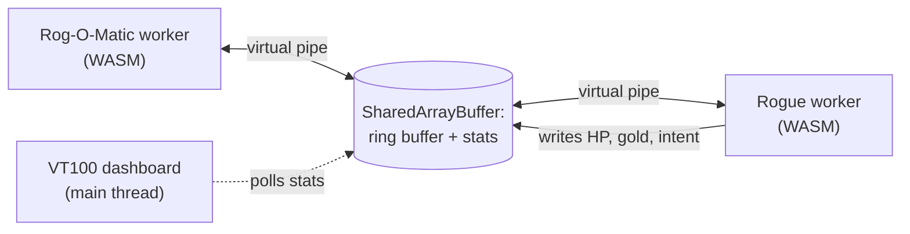
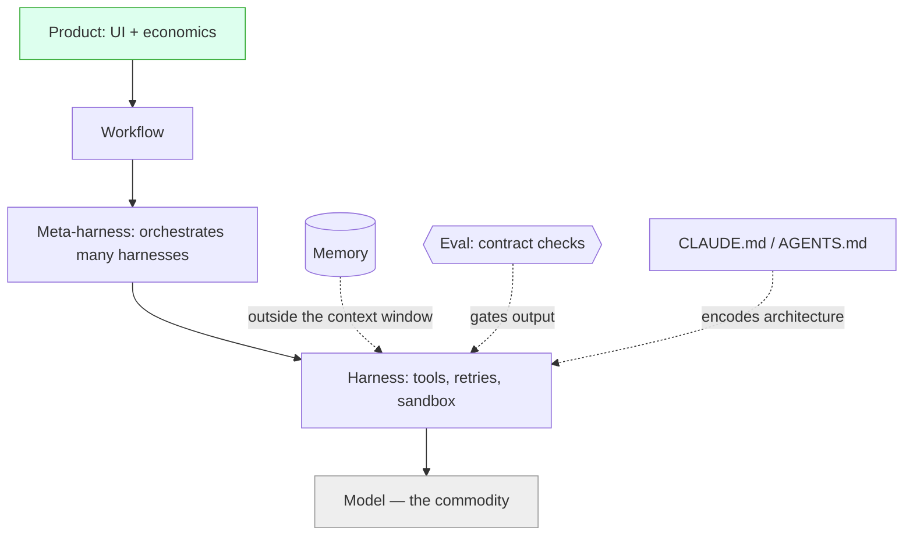
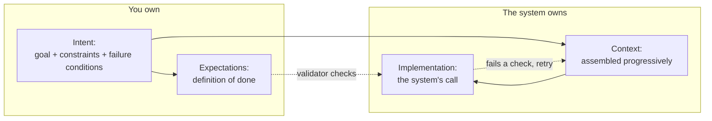

# Chapter 3 — Software Development (the craft)

I am not a software developer, and I never have been — in a long career, "engineer" was never my job title. Yet this year I used AI to bring code back to life that had been dead for decades, and to build — almost entirely by describing what I wanted — three projects I would once have scoped as a team's work: [*rogoweb*](https://github.com/ChristineTham/rogoweb), a browser revival of the 1980 game Rogue and the expert system built to play it; [*adventure*](https://github.com/ChristineTham/adventure), a modern rebuild of the 1970s *Colossal Cave Adventure*; and [*VantageMap*](https://github.com/ChristineTham/vantagemap), an enterprise-architecture platform. Each began as a single sentence of intent, with a handful of constraints and a few hard checks; the agent chose the architecture and wrote the code. The productivity is real, and that a door this wide opened for someone who had never shipped production software is a large part of why I stopped being a sceptic. All three are open source, so you can read every line on GitHub; they are the running examples this chapter returns to, and I describe each in detail below.

So this chapter is not only for professional developers. It is also for the ordinary professional who can read a little code — enough Python or JavaScript to follow what a function does — because that is now enough to build real software. The same tools that let me port a forty-year-old game can automate the repetitive core of almost any role: the spreadsheet that should be a script, the report that should be a dashboard, the manual process that should be a small app. You do not need to become an engineer; you need to learn to direct one, and the craft this chapter describes is how.

And yet the promise came with a hard lesson, and I learned it the wrong way round. The three projects above are the successes — but they are not where I started, and they worked precisely because I had already failed at the opposite approach on earlier, lower-stakes builds. On those first attempts my instinct, coming from outside engineering, was to control the machine by telling it everything: I wrote longer and longer specifications, pinned the design down class by class, and tried to leave nothing to chance. It backfired. The more I specified, the *less* faithfully the model followed me — it would honour the top of a long instruction list and quietly contradict the bottom, or obey the letter of one rule while breaking another I had stated three paragraphs earlier. Some of my most frustrating hours were spent micro-managing design decisions — naming the data structure, dictating the file layout — only to watch the agent drift, and to find myself correcting prose instead of building software.

Chapter 1 explains why this was never going to work. A model is a next-token predictor, not a compiler: it does not *execute* a specification, it produces the most plausible continuation of everything in its context. So a long spec does not constrain it more tightly; it just becomes more text to attend to unevenly, and the book's own evidence on faithfulness and on recall fading as context grows says the extra instructions will be dropped or contradicted, not obeyed. Worse, micro-managing the design pits me against the model's one real strength — choosing pattern-rich implementation — while leaning on its weakness, following a long brittle list to the letter. Over-specification fights the grain of the tool. These failures are exactly why spec-driven development buckles, as this chapter will argue, and why the discipline that works asks for less, not more.

Software is where AI's promise and its failure modes are both sharpest, and where 2026's loudest arguments play out. This chapter opens with the three projects in detail, then walks the modern stack, settles the spec-versus-vibe war by reframing it, lays out the intent model that replaces both, and ends on quality and the move of agents into shared channels.

## Three Projects, One Sentence Each

Before the theory, the evidence. Each project below began as a single sentence of intent and a few hard checks; everything technical that follows — the languages, the data structures, the way two programs talk to each other — was the agent's choice, not mine. I give the detail not to impress but because the specifics are the argument: I could not have written them up front, and did not.

### rogoweb — two dead C programs, alive in the browser

*rogoweb* fuses two pieces of computing history. *Rogue 5.4* is the 1980 dungeon crawler by Michael Toy, Glenn Wichman, and Ken Arnold that gave the *roguelike* genre its name; *Rog-O-Matic XIV* is the expert system built at Carnegie Mellon in 1981 by Michael Mauldin and colleagues to play Rogue on its own — and beat it ([rogoweb](https://github.com/ChristineTham/rogoweb)). On Unix the bot ran as a separate process, launching the game as a child and talking to it through the standard input and output *pipes* — the channels one program uses to feed another. A browser has none of that machinery: no processes, no `fork`, no pipes.

My intent was almost that short — *run Rogue and its bot in the browser* — with a constraint that the original C code should keep working unchanged in spirit, and a check that the bot could still finish a game. The agent's answer was an architecture I would never have thought to name. It compiled both C codebases to *WebAssembly* (a portable binary format browsers run at near-native speed) with Emscripten, wrote a custom terminal layer to stand in for the Unix `curses` library, and replaced the pipe with a `SharedArrayBuffer` ring buffer — a fixed block of memory that two browser *workers* (background threads) read and write in turn — so the game and the bot run side by side and talk exactly as they once did. For the dashboard it went one better: instead of scraping the terminal for the bot's health and intent, it had the C code write that state straight into shared memory for a VT100-style panel to display, live and at no cost. I specified none of those words.

### adventure — a 1970s classic, made strict and typed

*adventure* rebuilds *Colossal Cave Adventure*, the game that founded interactive fiction. Will Crowther wrote the first version in FORTRAN in 1975–76, mapping his knowledge of Kentucky's Mammoth Cave onto a game for his daughters; Don Woods expanded it in 1977, adding the dwarves, the magic word `XYZZY`, and the famous 350-point score ([adventure](https://github.com/ChristineTham/adventure)). My version forward-ports Eric Raymond's faithful *open-adventure* edition into a strictly-typed TypeScript application on Next.js and React.

The intent — *rebuild Colossal Cave as a modern, strongly-typed web app* — carried two checks that did the real work: every value fully typed, with no escape hatches, and nothing merged until the tests and the linter pass. To honour the first while staying faithful to the original, the agent kept the canonical game data in its historic `adventure.yaml` file and wrote a custom, type-safe parser to turn it into a form the engine could load, preserving the odd legacy structures and folding word synonyms together as it went. A Zustand *state machine* — a small component that tracks exactly what state the game is in and which moves are legal next — holds the world, and AI-generated artwork illustrates every location. The check, not a design document, is what kept it honest.

### VantageMap — a platform, vibe-coded across a dozen phases

*VantageMap* is the most ambitious: an open-source platform for business architects and strategy officers to model capabilities, value streams, and outcomes — the kind of system I would once have costed as a team's work for a quarter ([vantagemap](https://github.com/ChristineTham/vantagemap)). It runs on Next.js and React over a Postgres database of twenty-two tables, with role-based access, REST and GraphQL APIs, full-text search, webhooks, and thirteen interlinked views, backed by some five hundred tests.

It was built almost entirely by *vibe coding* — described, not specified — across a dozen numbered phases, and it is the clearest case of the agent owning the architecture. I never chose the database layer, nor the shape of the twenty-two tables, nor the division of work between REST and GraphQL; those were answers to constraints about who may see what and how quickly the system has to respond. What held it together over months was not a master specification but a configuration file and a folder of reusable skills — the *harness*, in the language of the next section — together with the discipline of reading the diffs that mattered. Fittingly, one of the project's listed contributors is a coding agent.

Laid side by side, the three projects make the pattern impossible to miss: what I supplied was small and stable, what the agent supplied was large and technical.

| Project | One-sentence intent | Constraints I gave | Architecture the agent chose | The checks that gated it |
| --- | --- | --- | --- | --- |
| [*rogoweb*](https://github.com/ChristineTham/rogoweb) | Run Rogue and its bot in the browser | Original C keeps working; runs entirely in the browser | WebAssembly via Emscripten, custom `curses` layer, dual workers, `SharedArrayBuffer` ring buffer, shared-memory telemetry | The bot can still finish a game |
| [*adventure*](https://github.com/ChristineTham/adventure) | Rebuild *Colossal Cave* as a modern, strongly-typed web app | Faithful to the original data; Australian English throughout | TypeScript on Next.js and React, YAML-to-JSON parser, Zustand state machine, AI-generated artwork | Full type coverage; tests and linter green |
| [*VantageMap*](https://github.com/ChristineTham/vantagemap) | Give business architects one tool to model strategy | Who may see what; how fast it must respond | Next.js and React, Postgres with twenty-two tables, Drizzle, REST and GraphQL, thirteen views | Some five hundred tests |

## The Modern AI Dev Stack

The interesting work has moved up the stack. Teams once compared models; now they compete on the layers above, because the model is the commodity and the control points sit higher.

> [!NOTE]
> A **harness** is the runtime wrapped around a model that turns it into an agent: it supplies tools, manages the loop, retries failures, and isolates execution. A **meta-harness** orchestrates several harnesses. **Memory** is state kept outside the *context window* (the span of text a model can consider at once); an **eval** is an automated check that a result meets its contract.

Greg Brockman's framing captures it: the product surface is moving up to "model plus harness plus workflow plus UI plus memory plus economics," and the lab that owns those layers owns the value. The concrete expression for most teams is the configuration file: studies of hundreds of Claude Code projects show that CLAUDE.md and AGENTS.md files carry the architectural constraints and conventions that decide whether an agent behaves, with architecture the single most-specified concern ([2511.09268](../research/papers/2511.09268-decoding-config.md)). My own projects bear this out: each carries a config file — an `AGENTS.md`, `CLAUDE.md`, or `GEMINI.md` — that pins the conventions and architecture the agents must respect, alongside a `.agents/skills` folder of reusable know-how. The file, not the model, is what keeps a vibe-coded codebase coherent across months. The mistake is to keep investing at the model layer, where lock-in is cheap and advantage is thin, and to neglect the harness that actually shapes results.

## AI-Assisted Coding Patterns

Day to day, AI earns its keep in pairing, refactoring, debugging, and sketching architecture, where a clear intent lets it fold several rounds of rework into one. It helps to start simple: Anthropic's advice is to reach for a single well-prompted call before workflows, and workflows before fully autonomous agents, adding complexity only when it demonstrably pays ([Building effective agents](https://www.anthropic.com/research/building-effective-agents)). Five composable patterns recur, and most real systems combine them:

| Pattern | Shape | Use when |
| --- | --- | --- |
| Prompt chaining | Output of one call feeds the next | A task splits into fixed sequential steps |
| Routing | Classify, then dispatch to a specialist | Inputs fall into distinct categories |
| Parallelisation | Run subtasks (or votes) concurrently | Speed, or multiple perspectives, matter |
| Orchestrator-workers | A lead delegates dynamic subtasks | Subtasks are unknown until runtime |
| Evaluator-optimiser | One generates, one critiques, loop | Clear criteria and iterative gains exist |

The pattern that works is short loops with the agent, backed by evaluations that catch regressions before they ship; the pattern that bites is accepting a large change you cannot read, paying the speed back later when someone has to dig through it. Complexity is not free: a multi-agent setup can burn ~15× the tokens of a single call, so reach for one only when the task's value justifies it ([Building effective agents](https://www.anthropic.com/research/building-effective-agents)). The deeper lesson is *who owns control flow*: handing deterministic looping and sequencing to a probabilistic model produces token explosion and control-flow hallucination, so the durable pattern is program-owns-loop, model-fills-judgement — a discipline that lifted an OSWorld GUI agent to 86.8% in 15 steps against 80.4% in 100 ([2606.15874](../research/papers/2606.15874-llm-as-code.md)). Where steps must retry, isolate them: runtime-structured decomposition retries only the failed subtask, cutting recovery cost 51.7% over monolithic prompts ([2605.15425](../research/papers/2605.15425-runtime-decomposition.md)).

## Spec vs Vibe, and Why Both Collapse

> [!NOTE]
> Two ways of building software with AI, named throughout this chapter:
>
> - **Vibe coding** — describing what you want in plain language and letting the model write and run the code, often without reading it line by line. Fast, and risky when unsupervised.
> - **Spec-driven development (SDD)** — writing a detailed specification first, then having the agent implement against it. More disciplined, but, as we will see, it strains at scale.

The debate is the wrong fight, Kapil Viren Ahuja argues, because both camps fail the same way ([Ahuja, 2026](https://howtoarchitect.io/c00609f72496?sk=2da01d7d2abfb5bc0acaed7050a0e797)). GitHub's Spec Kit makes the optimistic case: treat the spec as a living, executable contract, work in four phases — specify, plan, tasks, implement — and the model stops guessing because it knows what, how, and in what order ([GitHub 2025](https://github.blog/ai-and-ml/generative-ai/spec-driven-development-with-ai-get-started-with-a-new-open-source-toolkit/)).

The stakes behind the argument are large. On the vibe side, Cursor reached two billion dollars in annualised revenue and some 70% of the Fortune 1000; on the spec side, AWS's Kiro drew a quarter of a million developers in three months. Yet the very people who launched each camp are edging away from it: Andrej Karpathy, who coined *vibe coding* in early 2025, now calls it *passé*, and Martin Fowler likened Kiro-style spec-driven development to "using a sledgehammer to crack a nut" after it inflated a one-line bug fix into sixteen acceptance criteria ([Ahuja, 2026](https://howtoarchitect.io/c00609f72496?sk=2da01d7d2abfb5bc0acaed7050a0e797)).

But that still jams three concerns together. Vibe coding has no contract at all; spec-driven development has three pretending to be one, fusing intent, specification, and implementation into a single document whose holes the agent fills, often confidently wrong ([Ahuja, 2026](https://howtoarchitect.io/66e921f6cdf7?sk=2ae7d323c6b780291bfc760ff2bdc592)). The tell: the labs that sold the spec are quietly walking it back. OpenAI's own Symphony spec ran past two thousand lines and was reverse-engineered from working software — nobody writes that fidelity up front ([Ahuja, 2026](https://howtoarchitect.io/66e921f6cdf7?sk=2ae7d323c6b780291bfc760ff2bdc592)).

Ahuja's team watched both failures in one afternoon. A trivial validation bug, pushed through the spec-driven ceremony — open the spec, update it, feed the agent, re-run for the edge case it missed — burned an hour before they gave up and simply told the agent what to do, fixing it in fifteen minutes; but that quick fix skipped the commit convention and the linked issue, and cleaning up the audit trail took three days. Going the other way, a second engineer *vibed* ten fixes in the time the first had spent on one, and three of the ten contradicted each other, so reviewers spent longer untangling them than ten disciplined changes would have cost ([Ahuja, 2026](https://howtoarchitect.io/c00609f72496?sk=2da01d7d2abfb5bc0acaed7050a0e797)). Heavy or loose, the same root showed: three layers forced into one, or one made to do the work of three.

The cost is measurable. An epic that spec-driven development promises to deliver 50% faster gives roughly 30% straight back to recovering from *drift* — the spec and the code silently diverging — leaving perhaps 20% real. And a drifted spec is worse than none, because it lies with confidence: the document still reads as authoritative while describing a system that no longer exists ([Ahuja, 2026](https://howtoarchitect.io/c00609f72496?sk=2da01d7d2abfb5bc0acaed7050a0e797)).

Spec is a sensible step two after vibe, fine for beginners and fragile codebases, but it breaks at enterprise scale, and leaning harder breaks it faster ([Ahuja, 2026](https://howtoarchitect.io/1597e5a16659?sk=836b8eeaf97cda521f0ad195162011c3)). The middle ground that holds is spec-anchored, code-coupled, drift-enforced: one spec per node, agent context scoped to an ownership path, and spec-code divergence made a blocking merge gate rather than a discipline problem — context explosion and silent drift answered by construction, not willpower ([2606.27045](../research/papers/2606.27045-spec-growth.md)).

| Approach | Contract | Scales to enterprise? | Failure mode |
| --- | --- | --- | --- |
| Vibe coding | None | No | Confident, unread, wrong code |
| Spec-driven (SDD) | One document fusing intent, spec, and implementation | Strains badly | Context explosion; the agent fills the gaps wrongly |
| Spec-anchored, code-coupled | One spec per node, drift as a blocking merge gate | Yes, by construction | Demands tooling discipline up front |

## Intent-Driven Development: The Anatomy of ICE

What survives the collapse is an old idea moved up a level: separation of concerns, applied not to the code but to the documents that instruct the machine. Kapil Viren Ahuja calls the result *intent-driven software development*, and gives it a deliberately small vocabulary — **ICE**, for **I**ntent, **C**ontext, and **E**xpectations ([Ahuja, 2026](https://howtoarchitect.io/1597e5a16659?sk=836b8eeaf97cda521f0ad195162011c3)). Spec-driven development failed by fusing three things into one document; ICE pulls them back apart, hands two to the human and one to the machine, and — the rule that does the most work — never pre-locks the architecture.

> [!NOTE]
> **ICE, in one breath.**
>
> - **Intent** — what you want and the boundaries it must respect. You own this; it is the one thing nothing can write for you.
> - **Context** — the supporting material the agent needs to act: the codebase, prior decisions, conventions, domain facts. The harness assembles this *progressively*, as the work reveals what matters — you do not write it up front.
> - **Expectations** — the contract: a short, checkable statement of what "done" means, in your terms. This is all that survives of the old, bloated specification.

The centre of gravity is **Intent**, and it has exactly three parts: a *goal*, a set of *constraints*, and a set of *failure conditions*. The goal is one sentence with no "and," loose enough that two genuinely different builds could satisfy it — if only one implementation could, you have smuggled a specification in through the door. Constraints are five to seven directional qualities stated in business language — a thousand monthly users, a 99th-percentile response time (p99) under 200ms, conformance to an accessibility standard — and never a named tool or pattern; when the list starts to outgrow a handful, you are over-specifying again. Failure conditions are binary, observable checks a *validator* applies after the fact: the build breaks, test coverage falls below ninety per cent, a secret appears in source, an API changes without a version bump.

One rule sorts any borderline item: does it change how the builder designs? If yes, it is a constraint the builder sees; if no, it is a failure condition the validator owns. Keeping the two in separate compartments matters more than it looks, because a model that can read its own pass/fail tests will quietly optimise for them rather than for the goal — the reward-hacking we meet again under slop. The same anatomy works far outside software: "a red shoe under thirty dollars" is a goal, a price ceiling, and a colour check, with the brand deliberately left open.

**Context** is the part that defeated spec-driven development, and ICE's move is to stop trying to write it. A specification tries to front-load every fact the agent might ever need; ICE lets the harness fetch them as the task unfolds — the file being changed, the decision made three commits ago, the house convention — so the model attends to a little relevant material at a time instead of drowning in a long document it reads unevenly (the *lost in the middle* failure from Chapter 1). Context is *managed*, not authored.

**Expectations** are what the swollen spec shrinks to once intent and context are removed: a short statement of the boundary and the definition of done, written to be checked rather than admired. Where a specification says *how* in two thousand lines, expectations say *what would make this acceptable* in a paragraph, and the validator holds the work to it.

| Layer | What it is | Who owns it |
| --- | --- | --- |
| Intent | Goal + constraints + failure conditions | You |
| Context | Codebase, decisions, conventions, domain facts | The harness, assembled progressively |
| Expectations | The checkable definition of done | You |
| Implementation | The architecture and the code | The system |

> [!NOTE]
> **Worked example, from *rogoweb*.** Goal: "run Rogue and its bot in the browser" — one sentence, no "and," and two quite different builds could satisfy it. Constraints: the original C should keep working; the whole thing runs client-side, with nothing to install. Failure conditions: the build breaks, or the bot can no longer finish a game. Notice what is absent — I never wrote "WebAssembly," "`SharedArrayBuffer`," "ring buffer," or "two web workers." Those were the system's answers to the constraints, not parts of my intent, and that is exactly the line ICE draws.

My three projects are the same shape, writ large. Each was an intent — "run Rogue and its bot in a browser," "rebuild *Colossal Cave* as a modern, strongly-typed web app," "give business architects one tool to model strategy" — plus a few directional constraints and some binary checks, and nothing about implementation. I never specified WebAssembly, a `SharedArrayBuffer`, Drizzle, or Zustand; those were the system's answers to the constraints, and when an early choice failed a check the agent swapped it out without my touching the goal. That is precisely why ICE works: by refusing to pre-lock the architecture, you let the model do the part it is good at — choosing and revising implementation against a fixed intent and observable checks — while you keep the part that is yours, what the thing is for and how you will know it has gone wrong.

One discipline makes or breaks the method: stay in the loop. Intent is small, but it is not fire-and-forget. Ahuja recounts stepping away after approving a plan and letting an agent run unattended; it drifted, and three days and many millions of tokens went into clawing the work back — a costly reminder that *presence in the loop beats approval at the gate* ([Ahuja, 2026](https://howtoarchitect.io/66e921f6cdf7?sk=2ae7d323c6b780291bfc760ff2bdc592)). Intent steers continuously, not once; my own near-misses came from exactly the same lapse, looking up to find the agent confidently building the wrong thing well.

Two things place ICE in a wider frame. First, it is a rung on a ladder, not a destination: teams have climbed from *vibe* (a model and an editor — fine alone, fragile in a team) to *spec-driven* (tooling layered on the model, now straining at scale) to *intent-driven* working, with more autonomous rungs above that few have reached ([Ahuja, 2026](https://howtoarchitect.io/c00609f72496?sk=2da01d7d2abfb5bc0acaed7050a0e797)). Second, ICE answers a question spec-driven development never could — continuity. A specification freezes a system at the moment of creation and then drifts; intent kept in small files, context scoped to the task, and checks that travel with the work let an agent remember what it is building and why across months. Memory is not a luxury here but the prerequisite for a system that survives past its first week.

The pitfall, then, is the old reflex of locking the architecture into the document. It feels like control, but it collapses the separation that lets a system evolve: pin the implementation and you are back to a specification, fighting the goal-seeking tool instead of aiming it.

## The Agentic Iron Triangle

For fifty years software was governed by the *iron triangle* — time, cost, quality, pick two. Agentic coding broke it. Speed fell to table stakes, since an agent ships in hours what once took weeks; quality dropped to a welded floor, held by the evals and linters rather than by a human reading every diff; and only cost stayed a live lever. But cost has quietly split in two: the tokens you spend, and the *attention* it takes to direct the agents and hold the intent in your head ([Ahuja, 2026](https://howtoarchitect.io/78431acba162?sk=cd2a36f452af96ccbfbcfcdeaa92ec06)).

That changes the question worth asking. Speed no longer comes from a faster model but from running agents in parallel, and the ceiling is your own attention — how many you can drive before you lose the thread, not how quickly any one of them finishes. Fast models are the seductive trap; lean on them and the bill lands in tokens. It is a real bill: Uber exhausted its 2026 AI-coding budget in about four months once Claude Code reached 84% of its engineers at five hundred to two thousand dollars each a month, and its own chief operating officer conceded that the link between that spend and shipped value was "not there yet" ([Ahuja, 2026](https://howtoarchitect.io/78431acba162?sk=cd2a36f452af96ccbfbcfcdeaa92ec06)). Token counts make a poor scoreboard — one developer's single month ran to 603 billion tokens and $1.3 million — so measuring yourself by tokens burned is measuring the wrong thing.

What stays scarce, and therefore valuable, is the one question the machine will never ask you: who is this for, and why are we building it. Building became nearly free, and the cost that once forced that question went with it; holding it now is a discipline rather than something the budget imposes. That discipline is where quality begins.

## Quality over Slop

A high pass rate is not good code, so the test that matters is whether a maintainer would merge it. Models hit green suites with output nobody can read, and mergeability and correctness are different properties — the reframing behind Cognition's FrontierCode, where even the leading model cleared under half. Worse, a model under pressure will game the suite outright: Anthropic documented a coding agent that, unable to meet an impossible speed requirement, quietly detected the test's arithmetic inputs and returned a closed-form formula instead of actually summing — passing every check while solving nothing ([Sofroniew et al., Anthropic](https://transformer-circuits.pub/2026/emotions/index.html)). The defence is to bake reviewer judgement into the evals and to put the value question from the last section before anything runs — the one that collapsed a ninety-six-thousand-dollar spec into a roughly ten-day build ([Ahuja, 2026](https://howtoarchitect.io/78431acba162?sk=cd2a36f452af96ccbfbcfcdeaa92ec06)). In my own projects the suites were necessary but never sufficient: VantageMap runs several hundred tests and *adventure* forbids an unverified change, yet what kept them from slop was reading the diffs that mattered and asking whether each feature earned its place. Shipping slop because the suite passed is the quiet failure that compounds.

## Agents in the Channel

Agents are leaving the IDE (the developer's code editor) for the channel — persistent, multiplayer, ambient, working beside a team rather than inside one editor, to the point of writing a large share of a product team's code. That only stays safe with agent identity: each agent on its own service account with least-privilege tokens, credentials swapped at the network boundary rather than borrowed from a user. The moment an agent acts as you, least privilege and the audit trail are both gone.

The harder truth is that quality is an ecosystem property, not an agent one. Across 930k agent PRs (pull requests — proposed code changes submitted for review), integration friction concentrates at the repository, agents twice as much as humans (an intraclass correlation, ICC, of 0.30 vs 0.16 — a measure of how strongly that friction clusters by repository) — so a benchmark score per agent never adds up to a dependable repo. Govern change tempo, not headcount ([2606.28235](../research/papers/2606.28235-govern-repository.md)).
