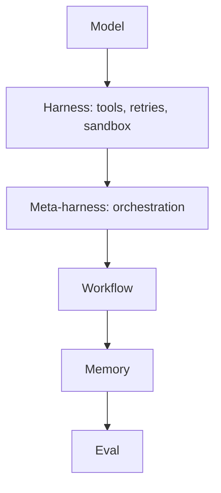

# Chapter 3 — Software Development (the craft)

Software is where AI's promise and its failure modes are sharpest, and where the loudest arguments of 2026 play out. This chapter walks the modern stack, then settles the spec-versus-vibe war by reframing it, lays out the intent model that replaces both, and ends on quality and the move of agents into shared channels.

## The Modern AI Dev Stack

The interesting work has moved up the stack. Teams once compared models; now they compete on the layers above, because the model is the commodity and the control points sit higher.

> [!NOTE]
> A **harness** is the runtime wrapped around a model that turns it into an agent: it supplies tools, manages the loop, retries failures, and isolates execution. A **meta-harness** orchestrates several harnesses. **Memory** is state persisted outside the context window; an **eval** is an automated check that a result meets its contract.

Greg Brockman's framing captures it: the product surface is moving up to "model plus harness plus workflow plus UI plus memory plus economics," and the lab that owns those layers owns the value. The concrete expression for most teams is the configuration file: studies of hundreds of Claude Code projects show that CLAUDE.md and AGENTS.md files carry the architectural constraints and conventions that decide whether an agent behaves, with architecture the single most-specified concern ([2511.09268](../research/papers/2511.09268-decoding-config.md)). The mistake is to keep investing at the model layer, where lock-in is cheap and advantage is thin, and to neglect the harness that actually shapes results.

## AI-Assisted Coding Patterns

Day to day, AI earns its keep in pairing, refactoring, debugging, and architecture ideation, where a clear intent lets it fold several rounds of rework into one. It helps to start simple: Anthropic's advice is to reach for a single well-prompted call before workflows, and workflows before fully autonomous agents, adding complexity only when it demonstrably pays ([Building effective agents](https://www.anthropic.com/research/building-effective-agents)). Five composable patterns recur, and most real systems combine them:

| Pattern | Shape | Use when |
| --- | --- | --- |
| Prompt chaining | Output of one call feeds the next | A task splits into fixed sequential steps |
| Routing | Classify, then dispatch to a specialist | Inputs fall into distinct categories |
| Parallelisation | Run subtasks (or votes) concurrently | Speed, or multiple perspectives, matter |
| Orchestrator-workers | A lead delegates dynamic subtasks | Subtasks are unknown until runtime |
| Evaluator-optimiser | One generates, one critiques, loop | Clear criteria and iterative gains exist |

The pattern that works is short loops with the agent, backed by evaluations that catch regressions before they ship; the pattern that bites is accepting a large diff you cannot read, paying the speed back later in archaeology. Complexity is not free: a multi-agent setup can burn ~15× the tokens of a single call, so reach for one only when the task's value justifies it ([Building effective agents](https://www.anthropic.com/research/building-effective-agents)). The deeper lesson is *who owns control flow*: handing deterministic looping and sequencing to a probabilistic model produces token explosion and control-flow hallucination, so the durable pattern is program-owns-loop, model-fills-judgement — a discipline that lifted an OSWorld GUI agent to 86.8% in 15 steps against 80.4% in 100 ([2606.15874](../research/papers/2606.15874-llm-as-code.md)). Where steps must retry, isolate them: runtime-structured decomposition retries only the failed subtask, cutting recovery cost 51.7% over monolithic prompts ([2605.15425](../research/papers/2605.15425-runtime-decomposition.md)).

## Spec vs Vibe, and Why Both Collapse

The dominant debate — write everything down in a spec, or write nothing and just talk to the model — is, Kapil Viren Ahuja argues, the wrong fight, because both camps fail the same way. GitHub's own Spec Kit makes the optimistic case: treat the spec as a living, executable contract, work in four phases (specify, plan, tasks, implement) and the model stops guessing because it knows what, how, and in what order ([GitHub 2025](https://github.blog/ai-and-ml/generative-ai/spec-driven-development-with-ai-get-started-with-a-new-open-source-toolkit/)). The reframing is that this still jams three concerns together. Vibe coding has no contract at all; spec-driven development has three pretending to be one, jamming intent, specification, and implementation into a single document whose holes the agent fills, often confidently wrong ([idd-vs-sdd summary](../research/idd-vs-sdd.md)). The tell is that the labs which sold the spec are quietly walking it back; OpenAI's own Symphony spec ran past two thousand lines and was reverse-engineered from working software, proof that nobody writes that fidelity up front. Spec is a sensible step two after vibe, fine for beginners and fragile codebases, but it breaks at enterprise scale and leaning harder only breaks it faster. The middle ground that holds is spec-anchored, code-coupled, drift-enforced: keep one spec per node, scope agent context to an ownership path, and make spec-code divergence a blocking merge gate rather than a discipline problem — context explosion and silent drift answered by construction, not willpower ([2606.27045](../research/papers/2606.27045-spec-growth.md)).

## The Three-Layer Schematic (ICE)

What survives the collapse is separation of concerns, applied one layer up to the documents that instruct the machine. Keep intent, expectations, and implementation distinct, and never pre-lock the architecture. Intent is a goal plus constraints plus failure conditions: the goal is one sentence with no "and," loose enough that two different builds could satisfy it; the constraints are five to seven directional qualities in business language — a thousand users, p99 under 200ms — never named tools; the failure conditions are binary, observable checks like coverage thresholds or a secret in source. A single rule sorts the rest: if it changes how the builder designs, it is a constraint, otherwise it is a failure condition the validator owns, and keeping them apart stops the model gaming its own tests. Expectations become the contract; context is assembled by the harness; implementation belongs to the system, not the spec ([idd-vs-sdd summary](../research/idd-vs-sdd.md)).

> [!NOTE]
> **Worked example.** Intent: "search products by colour and price." Constraints: 1,000 concurrent users; p99 < 200ms; no secrets in source. Failure conditions: build breaks; a $140 item shows under a $90 filter; coverage < 90%. The user never says "Postgres" or "microservice" — that is implementation, the system's call.

The pitfall is the old reflex of locking architecture into the document, which destroys the separability that lets a system evolve.

## Quality over Slop

A high pass rate is not good code, so the test that matters is whether a maintainer would merge it. Models hit green suites with output nobody can read, and mergeability and correctness are different properties — the reframing behind Cognition's FrontierCode, where even the leading model cleared under half. The defence is to bake reviewer judgement into the evals and to ask, before anything runs, who the work is for and why it exists, the question that collapsed a ninety-thousand-dollar spec into a ten-day build. Shipping slop because the suite passed is the quiet failure that compounds.

## Agents in the Channel

Agents are leaving the IDE for the channel — persistent, multiplayer, and ambient, working beside a team rather than inside one editor, to the point of writing a large share of a product team's code. That only stays safe with agent identity: each agent on its own service account with least-privilege tokens, credentials swapped at the network boundary rather than borrowed from a user. The moment an agent acts as you, least privilege and the audit trail are both gone, which is why identity, not capability, is the governing question. The harder truth is that quality is an ecosystem property, not an agent property: across 930k agent PRs, integration friction concentrates at the repository, agents twice as much as humans (ICC 0.30 vs 0.16), so a benchmark score per agent never adds up to a dependable repo — govern change tempo, not headcount ([2606.28235](../research/papers/2606.28235-govern-repository.md)).
