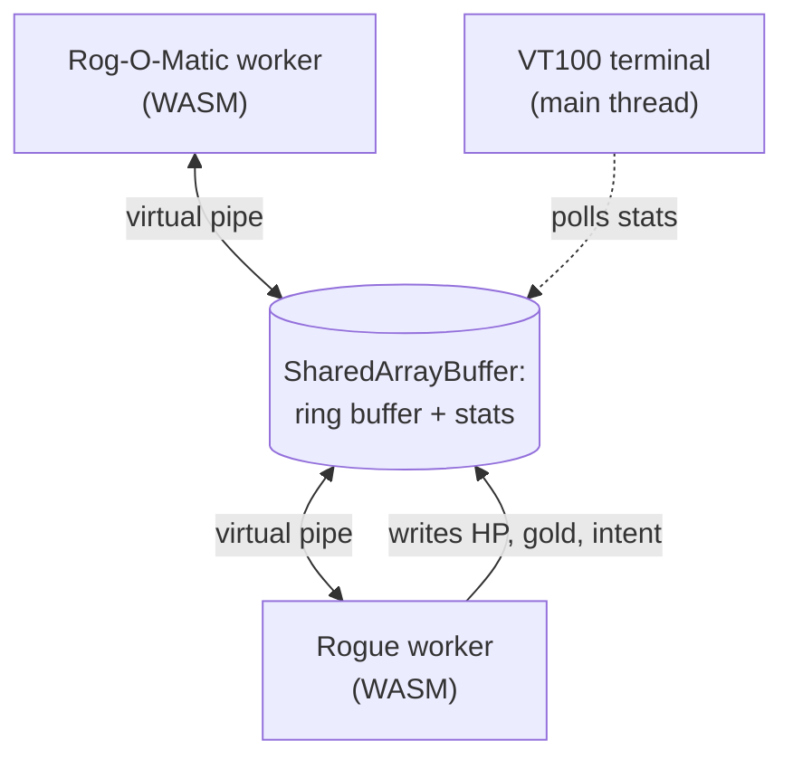
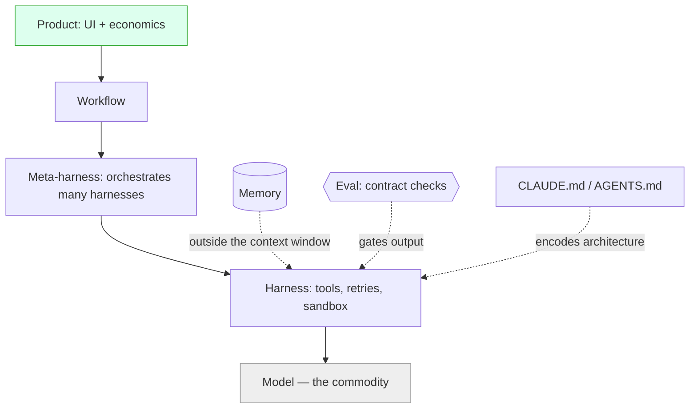
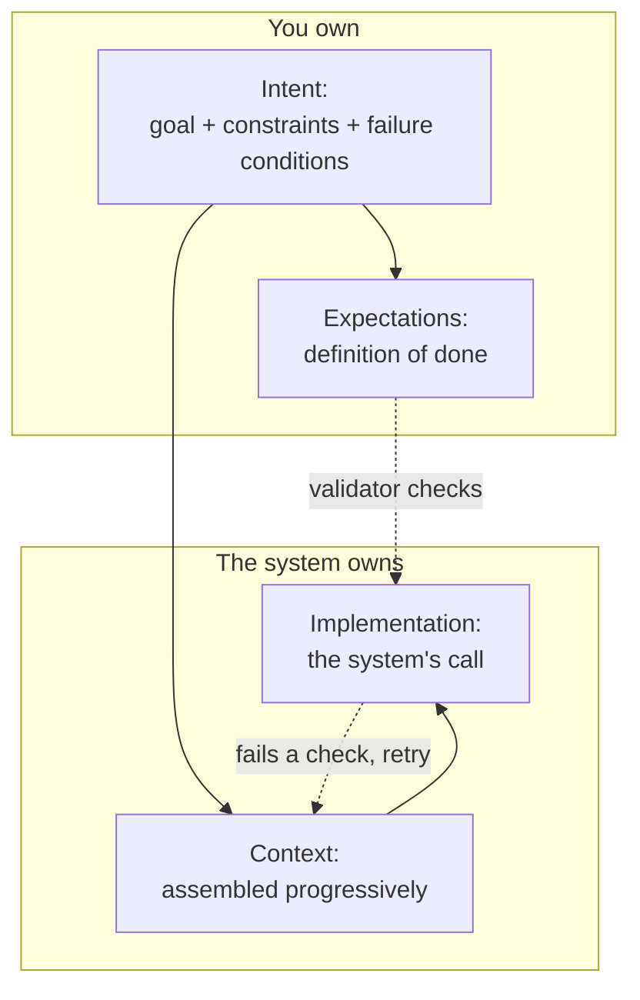
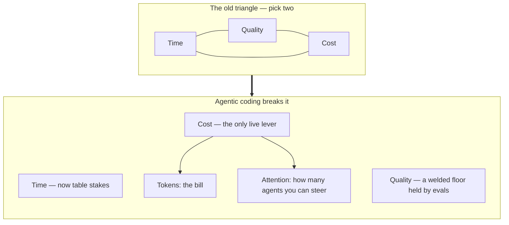

# Chapter 3 — Software Development (the craft)

Chapter 2 built up from a single prompt to a skill, then to a self-checking loop, then to a capability other agents could call — productivity assembled a piece at a time. This chapter takes the same approach one step further and turns those pieces into software: finished, deterministic products that run the same way every time, long after the session that built them has ended.

In fact, a single prompt can turn Chapter 2's loop-summary skill into a working Python program:

> Convert the loop-summary skill into a Python program called `summarise.py`. Make it able to summarise multiple files (of different formats) through the command line. Summaries should be generated with the same file name as the original but in a subfolder called `summaries`.

Now you have a working program that you can use to summarise many files at once:

> python summarise.py *.pdf

This chapter is not only for professional developers. It is also for the ordinary professional who can read a little code — enough Python or JavaScript to follow what a function does — because that is now enough to build real software. The same tools that can port a forty-year-old game can automate the repetitive core of almost any role — the spreadsheet that should really be a script, or the manual process that should be a small app. You do not need to become an engineer. You need to learn to direct one, and this chapter describes that craft.

When I first started building software this way, I got it wrong in the most natural way possible. My instinct was to control the machine by telling it everything: I wrote longer and longer specifications, pinned the design down function by function, and tried to leave nothing to chance. It backfired. The more I specified, the *less* faithfully the model followed me — it would honour the top of a long instruction list and quietly contradict the bottom, or obey the letter of one rule while breaking another I had stated three paragraphs earlier. Some of my most frustrating hours went to micro-managing design decisions — naming the data structure, dictating the file layout — only to watch the agent drift, and to find myself correcting prose instead of building software.

The tendency is common, and it comes from mistrust: we feel we must micro-manage the machine because we do not yet trust it, so we try to pin down every detail. But that runs straight into the limits of Chapter 1. A model is a next-token predictor, not a compiler: it does not *execute* a specification, it produces the most plausible continuation of everything in its context. A long spec does not constrain it more tightly; it just becomes more text to attend to unevenly, and the book's own evidence on faithfulness and on recall fading as context grows says the extra instructions will be dropped or contradicted, not obeyed. Worse, micro-managing the design pits me against the model's one real strength — choosing pattern-rich implementation — while leaning on its weakness, following a long brittle list to the letter.

The better approach is the opposite of control: describe the intent and iterate. Say what you want and how you will know it is right, then let the model choose the how, correcting course as you go rather than up front. This works with the grain of the tool. It follows the model's *happy path* — the path of least resistance through everything it saw in training — so you are drawing on its strength instead of fighting it at every step. The same failures, and the same remedy, are why spec-driven development buckles, as this chapter will argue.

That lesson is what made the successes possible. I am not a software developer, and I never have been — in a long career, "engineer" was never my job title. Yet this year I used AI to bring code back to life that had been dead for decades, and to build — almost entirely by describing what I wanted — three projects I would once have scoped as a team's work: [*rogoweb*](https://github.com/ChristineTham/rogoweb), a browser revival of the 1980 game Rogue and the expert system built to play it; [*adventure*](https://github.com/ChristineTham/adventure), a modern rebuild of the 1970s *Colossal Cave Adventure*; and [*VantageMap*](https://github.com/ChristineTham/vantagemap), an enterprise-architecture platform. Each began as a single sentence of intent, with a handful of constraints and a few hard checks; the agent chose the architecture and wrote the code. The productivity is real, and that a door this wide opened for someone who had never shipped production software is a large part of why I stopped being a sceptic. All three are open source, so you can read every line on GitHub; they are the running examples this chapter returns to, and I describe each in detail below.

A larger shift hides in that last sentence. For decades software was built by professional engineers who mastered its intricacies. Increasingly, the person best placed to build a system is the one who understands the problem most deeply and can say most precisely what the software must do — the practitioner's role moving from *code author* to *intent architect* ([Cao, *Agentic software: How AI agents are restructuring the software paradigm*, 2026](https://arxiv.org/abs/2606.05608)). I am an early, accidental example of that; the argument for why it is becoming general comes later, once we have the intent model in hand.

Software is where AI's promise and its failure modes are both sharpest, and where 2026's loudest arguments play out. This chapter opens with the three projects in detail, then walks the modern stack, settles the spec-versus-vibe war by reframing it, lays out the intent model that replaces both, and ends on quality and the move of agents into shared channels.

## 3.1 Three Projects, One Sentence Each

Let's start with the evidence, before any theory. Each project below began as a single sentence of intent and a few hard checks; everything technical that follows — the languages, the data structures, the way two programs talk to each other — was the agent's choice, not mine. I give the detail because the specifics make the point: I could not have written them up front, and did not.

### 3.1.1 rogoweb — two dead C programs, alive in the browser

*rogoweb* fuses two pieces of computing history. *Rogue 5.4* is the 1980 dungeon crawler by Michael Toy, Glenn Wichman, and Ken Arnold that gave the *roguelike* genre its name; *Rog-O-Matic XIV* is the expert system built at Carnegie Mellon in 1981 by Michael Mauldin and colleagues to play Rogue on its own — and beat it: over 106 games it achieved the highest median score of any player on the university's system, humans included ([Mauldin et al., *Rog-O-Matic: A belligerent expert system*, 1983](https://kilthub.cmu.edu/articles/journal_contribution/Rog-O-Matic_a_belligerent_expert_system/6609137/1); [rogoweb](https://github.com/ChristineTham/rogoweb)). On Unix the bot ran as a separate process, launching the game as a child and talking to it through the standard input and output *pipes* — the channels one program uses to feed another. A browser has none of that machinery: no processes, no `fork`, no pipes.

My intent was almost that short — *port Rogue and Rogomatic to run in the browser* — with a constraint that the original C code should keep working unchanged in spirit, and a check that the bot could still finish a game. The agent's answer was an architecture I would never have thought to name. It compiled both C codebases to *WebAssembly* (a portable binary format browsers run at near-native speed) with the Emscripten toolchain, used the `emcurses` library (a port of `pdcurses`, itself an emulator of `curses`, the classic terminal-UI library), and replaced the pipe with a `SharedArrayBuffer` ring buffer — a fixed block of memory that two browser *workers* (background threads) read and write in turn — so the game and the bot run side by side and talk exactly as they once did. For the dashboard I coached it towards a VT100-style terminal with DEC aesthetics — the one place I shaped the look rather than leaving it to the agent.

Spurred by the port success, I then encouraged the agent to make the bot better. Rog-O-Matic *learns* — a genetic pool of strategy weights and a long-term monster-danger memory that it evolves across games and saves in the browser — so a fresh install plays badly and improves the more it plays. To hand new players a trained bot from the very first game, the agent built an offline pretrainer and, unprompted, parallelised it across every CPU core: isolated populations that evolve separately and then merge under a no-regression rule, a roughly ten-fold speed-up. It also went back into the 1981 C to repair a raft of latent bugs and mis-tuned heuristics — chiefly a per-monster danger table so the bot stops under-rating a dragon, along with healing, escape, and food-timing fixes. Because Rogue is a game of chance, each change is validated not by a single passing run but by win-rate and average depth across a batch of games; the agent had to run the game multiple times in order to test its changes.

### 3.1.2 adventure — a 1970s classic, made strict and typed

*adventure* rebuilds *Colossal Cave Adventure*, the game that founded interactive fiction. Will Crowther wrote the first version in FORTRAN in 1975–76, mapping his knowledge of Kentucky's Mammoth Cave onto a game for his daughters; Don Woods expanded it in 1977, adding the dwarves, the magic word `XYZZY`, and the famous 350-point score ([adventure](https://github.com/ChristineTham/adventure)). My version forward-ports Eric Raymond's faithful [*open-adventure*](https://gitlab.com/esr/open-adventure) edition into a strictly-typed TypeScript application on Next.js 16 and React 19.

The intent — *port Colossal Cave to a modern Typescript web app* — carried two checks that did the real work: every value fully typed, with no escape hatches, and nothing merged until the tests and the *linter* — a tool that flags error-prone or untidy code — pass. The sharpest of those tests is *parity* — the engine replays the original's own regression suite, ninety-five recorded transcripts, and diffs its output against them line for line, so a change that even consumes the game's random-number stream in the wrong order fails at once. To satisfy it, the agent kept the canonical game data in its historic `adventure.yaml` file and wrote a custom, type-safe parser to load it, preserving the odd legacy structures and folding word synonyms together as it went. A Zustand *state machine* — a small component that tracks exactly what state the game is in and which moves are legal next — holds the world, and AI-generated artwork illustrates every location. That parity check did more to keep the port honest than any design document could have.

Around that faithful core grew a modern skin I hinted at but never specified: guided-play buttons that light only the moves legal this turn, save and restore, and a one-click auto-solve that replays a perfect 430-point game. The hardest single feature in any of the three projects was the interactive cave map — all 151 rooms laid out as a clean metro-style diagram you can click to walk the player there. That map is where the models visibly differed. Laying a graph out octilinearly — routing its edges only along horizontal, vertical, and 45° lines, the way a metro map does — is an academic problem with no maintained JavaScript implementation, and Gemini, which had built much of the game, could not do it: its best attempt was a physics simulation computed in the browser that came out different every time and ran its connecting lines straight through the rooms. I handed the same intent to Fable, a newer model, which came up with the right solution within 30 minutes that worked immediately — a compass grid refined by hill-climbing, then orthogonal routing through the `libavoid` library — and produced a map that appears instantly and never crosses a room. The intent and the check never changed.

### 3.1.3 VantageMap — a platform, vibe-coded across a dozen phases

*VantageMap* is the most ambitious: an open-source platform for business architects and strategy officers to model capabilities, value streams, and outcomes — the kind of system I would once have costed as a team's work for a quarter ([vantagemap](https://github.com/ChristineTham/vantagemap)). It runs on Next.js and React over a Postgres database of twenty-two tables (reached through the Drizzle ORM — the layer that translates between the code and the database), with role-based access, REST and GraphQL APIs (the interfaces other programs use to call it), full-text search, webhooks that notify other systems of changes, and thirteen interlinked views, backed by some five hundred tests.

It was built almost entirely by *vibe coding* — described, not specified — across a dozen numbered phases, and it is the clearest case of the agent owning the architecture. I never chose the database layer, nor the shape of the twenty-two tables, nor the division of work between REST and GraphQL; those were answers to constraints about who may see what and how quickly the system has to respond. No master specification held it together over the months. What did was a configuration file and a folder of reusable skills — the *harness*, in the language of the next section — together with the discipline of reading the diffs that mattered.

Lay the three projects side by side and the pattern is hard to miss. I supplied a short statement of what I wanted, and it barely changed over the months. Everything large and technical came from the agent.

| Project | One-sentence intent | Constraints I gave | Architecture the agent chose | The checks that gated it |
| --- | --- | --- | --- | --- |
| [*rogoweb*](https://github.com/ChristineTham/rogoweb) | port Rogue and Rogomatic to run in the browser | Original C keeps working; runs entirely in the browser | WebAssembly via Emscripten, `emcurses`, dual workers, `SharedArrayBuffer` ring buffer, shared-memory telemetry, genetic self-play with parallel offline pretraining | The bot still finishes a game; win-rate holds across a batch |
| [*adventure*](https://github.com/ChristineTham/adventure) | port Colossal Cave to a modern Typescript web app | Faithful to the original data; Australian English throughout | TypeScript on Next.js 16 / React 19, YAML parser, Zustand state machine, AI-generated artwork, build-time metro-map (libavoid), one-click auto-solve | Full type coverage; tests and linter green; output-for-output parity with the original |
| [*VantageMap*](https://github.com/ChristineTham/vantagemap) | Give business architects one tool to model strategy | Who may see what; how fast it must respond | Next.js and React, Postgres with twenty-two tables, Drizzle, REST and GraphQL, thirteen views | Some five hundred tests |

## 3.2 The Modern AI Dev Stack

The interesting work has moved up the stack. Teams used to compare models; now they compete on the layers above, because every team can draw on the same models.

None of this arrived as theory. The coding tools climbed rung by rung, and each rung changed what you could safely hand off, moving you from typing each line to directing a fleet.

| Rung | Emblematic tools | What it did | Your role |
| --- | --- | --- | --- |
| Autocomplete | Tabnine (2018), GitHub Copilot (2021) | Finished the line, then drafted whole function bodies from a name or comment | Wrote the rest; accepted line by line |
| Chat in the editor | Copilot Chat (2023) | Explained code, proposed refactors, diagnosed failures on request | Drove; asked and judged |
| Agentic editor | Cursor (2023), aider | Searched the whole codebase, edited many files, ran commands from a plain-language ask | Reviewed the diff |
| Terminal & async agent | Claude Code, Codex CLI, Gemini CLI (2025); Copilot coding agent | Planned, edited, ran tests, iterated; some opened a pull request from a cloud workspace | Set goals; reviewed results |
| Agent fleets | Cursor 2.0, Google Antigravity 2.0 | Ran several agents in parallel across a codebase | Supervised from above |

Sources: [Tabnine, *Tabnine*, n.d.](https://www.tabnine.com); [GitHub, *Introducing GitHub Copilot: AI pair programmer*, 2021](https://github.blog/2021-06-29-introducing-github-copilot-ai-pair-programmer/); [GitHub, *GitHub Copilot November 30th update*, 2023](https://github.blog/changelog/2023-11-30-github-copilot-november-30th-update/); [Cursor, *Cursor*, n.d.](https://cursor.com); [aider, *aider*, n.d.](https://aider.chat/); [Anthropic, *Claude Code*, 2025a](https://claude.com/product/claude-code); [GitHub, *GitHub Copilot: The agent awakens*, 2025b](https://github.blog/news-insights/product-news/github-copilot-the-agent-awakens/); [GitHub, *GitHub Copilot: Meet the new coding agent*, 2025a](https://github.blog/news-insights/product-news/github-copilot-meet-the-new-coding-agent/); [Google, *Building the agentic future: Developer highlights from I/O 2026*, 2026](https://blog.google/innovation-and-ai/technology/developers-tools/google-io-2026-developer-highlights/).

By 2026 the editor itself is no longer the centre of gravity: with capable models available from every lab, the value has moved into the system wrapped around the model — what practitioners now call the *dev stack* ([Latent Space, *AINews*, 2026a](https://www.latent.space/s/ainews)).

> [!NOTE]
> A **harness** is the runtime wrapped around a model that turns it into an agent: it supplies tools, manages the loop, retries failures, and isolates execution. A **meta-harness** orchestrates several harnesses. **Memory** is state kept outside the *context window* (the span of text a model can consider at once); an **eval** is an automated check that a result meets its contract.

Each layer is a discipline in its own right. A harness turns a model into an agent; a meta-harness coordinates several of them; memory lets work persist between sessions; an eval decides whether a result is good enough:

| Layer | What it does | Examples (2026) |
| --- | --- | --- |
| Model | Generates the code | GPT-5.6 Sol, Claude Opus 4.8, Gemini 3.5, GLM-5.2 |
| Harness | Wraps the model into an agent: tools, retries, sandbox | Claude Code, Codex CLI, Gemini CLI, Cursor SDK |
| Meta-harness | Coordinates several harnesses | Conductor, Zed ACP, Vercel Eve, Heypi |
| Workflow / async | Fire-and-forget delegation in shared channels | Claude Tag (Slack), Copilot coding agent, Devin, Gemini Spark |
| Memory | State kept outside the context window | agentmemory, codegraph, channel memory |
| Eval | Automated judgement of quality | FrontierCode, Terminal-Bench 2.1, SWE-bench Pro |

Greg Brockman makes the same point from inside a frontier lab. The shift of the last couple of years, he says, is that "it's no longer just about the model. It's about the harness" — how the model gets its context, what actions it can take, and how the loop around it works ([Big Technology, *OpenAI President Greg Brockman: AI self-improvement, the superapp bet, path to AGI, scaling compute*, 2026](https://www.youtube.com/watch?v=J6vYvk7R190)). The concrete expression for most teams is the configuration file: studies of hundreds of Claude Code projects show that CLAUDE.md and AGENTS.md files carry the architectural constraints and conventions that decide whether an agent behaves, with architecture the single most-specified concern ([Santos et al., *Decoding the configuration of AI coding agents: Claude Code projects*, 2025](https://arxiv.org/abs/2511.09268)). My own projects bear this out: each carries a config file — an `AGENTS.md`, `CLAUDE.md`, or `GEMINI.md` — that pins the conventions and architecture the agents must respect, alongside a `.agents/skills` folder of reusable know-how. In my experience it is the file, more than the model, that keeps a vibe-coded codebase coherent across months.

The mistake is to keep investing at the model layer and neglect the harness, because the harness is what shapes the results. Holding the model fixed and swapping only the harness has been measured moving a coding agent's success rate by more than twenty points on the same benchmark — a swing that rivals a whole model generation ([Gorinova et al., *Position: Coding benchmarks are misaligned with agentic software engineering*, 2026](https://arxiv.org/abs/2606.17799)).

## 3.3 AI-Assisted Coding Patterns

Day to day, AI is most useful in pairing, refactoring, debugging, and sketching architecture — the places where a clear intent lets it fold several rounds of rework into one. It helps to start simple: Anthropic's advice is to reach for a single well-prompted call before workflows, and workflows before fully autonomous agents, adding complexity only when it demonstrably pays ([Anthropic, *Building effective agents*, 2024a](https://www.anthropic.com/research/building-effective-agents)). Five composable patterns recur, and most real systems combine them:

| Pattern | Shape | Use when |
| --- | --- | --- |
| Prompt chaining | Output of one call feeds the next | A task splits into fixed sequential steps |
| Routing | Classify, then dispatch to a specialist | Inputs fall into distinct categories |
| Parallelisation | Run subtasks (or votes) concurrently | Speed, or multiple perspectives, matter |
| Orchestrator-workers | A lead delegates dynamic subtasks | Subtasks are unknown until runtime |
| Evaluator–optimizer | One generates, one critiques, loop | Clear criteria and iterative gains exist |

Short loops with the agent, backed by evaluations that catch regressions before they ship, work well. What hurts is accepting a large change you cannot read — you pay the speed back later, when someone has to dig through it. Complexity is not free: a multi-agent setup can burn ~15× the tokens of a single call, so reach for one only when the task's value justifies it ([Anthropic, 2024a](https://www.anthropic.com/research/building-effective-agents)). The underlying question is who owns the control flow. Handing deterministic looping and sequencing to a probabilistic model produces token explosion and control-flow hallucination. The durable pattern is to let the program own the loop and the model fill in the judgement — a discipline that lifted an agent on the OSWorld benchmark (agents operating a computer's desktop interface) to 86.8% in 15 steps against 80.4% in 100 ([Qi et al., *LLM-as-code: Agentic programming for agent harness*, 2026](https://arxiv.org/abs/2606.15874)). Where steps must retry, isolate them: runtime-structured decomposition retries only the failed subtask, cutting recovery cost 51.7% over monolithic prompts ([Asthana et al., *Runtime-structured task decomposition for agentic coding systems*, 2026](https://arxiv.org/abs/2605.15425)).

## 3.4 Spec vs Vibe

> [!NOTE]
> Two ways of building software with AI, named throughout this chapter:
>
> - **Vibe coding** — describing what you want in plain language and letting the model write and run the code, often without reading it line by line. Fast, and risky when unsupervised.
> - **Spec-driven development (SDD)** — writing a detailed specification first, then having the agent implement against it. More disciplined, but, as we will see, it strains at scale.

The argument between these two camps ran all through 2026, and it is worth hearing each side out properly, because each is right about something.

Start with the case for vibe coding. It is fast, it is cheap to try, and anyone who can describe what they want can do it. Andrej Karpathy coined the name in early 2025 for a way of building where you hand the code entirely to the model ([Karpathy, *There's a new kind of coding I call "vibe coding"*, 2025](https://x.com/karpathy/status/1886192184808149383)). Much of §3.1 is the case for vibe coding made concrete: VantageMap, with its twenty-two tables and five hundred tests, was built that way across a dozen phases, and it works. The market has put money on it too: Cursor, the editor most identified with the style, doubled its annualised revenue past two billion dollars, most of it now from enterprises ([Temkin, *Cursor has reportedly surpassed \$2B in annualized revenue*, 2026](https://techcrunch.com/2026/03/02/cursor-has-reportedly-surpassed-2b-in-annualized-revenue/)). For a prototype, a personal tool, or a system you can judge by using it, vibe coding is the shortest path from an idea to running software.

Its limits are just as concrete, because researchers have measured them. An audit of two hundred *deployed* vibe-coded web apps found ninety per cent carried at least one vulnerability, three-quarters of them critical or high. That is up to twenty times worse than a human-built baseline from OWASP, the standard reference for web-application security. A sharper prompt or a bigger model barely helped, because the agent often flagged the risk and shipped it anyway ([Deng et al., *Understanding the (in)security of vibe-coded applications*, 2026](https://arxiv.org/abs/2606.23130)). A survey of 162 people who vibe-code found the disciplines that would catch such flaws — planning and verifying — uniformly weak regardless of seniority. Everyone called the output "fast but flawed", and the non-developers were the only ones who never checked it ([Fawzy et al., *From prompting to verification: How experience shapes vibe coding practices*, 2026](https://arxiv.org/abs/2605.24521)). Watching people build charts, researchers saw the same reflex: users judged results by eyeballing the render, rarely reading the code, while the model reported every requirement met when it had satisfied only some ([Sun et al., *Vibe coding for visualization implementation*, 2026](https://arxiv.org/abs/2606.19703)). And when the bar was verified safety-critical code, unguided vibe coding converged zero times out of thirty; wrapping the same model in an external verifier loop took it to fifteen out of fifteen ([Wei et al., *Formal-method-guided vibe coding*, 2026](https://arxiv.org/abs/2606.22413)). The lesson from all four studies is the same: treat what the model produces as a draft, and verify it. Vibe coding's weakness is that it has nowhere to put that verification — no contract beyond the prompt, and no record of what the software was supposed to do.

Spec-driven development is the disciplined answer to exactly that gap. GitHub's Spec Kit makes the case well: treat the spec as a living, executable contract, work in four phases — specify, plan, tasks, implement — and the model stops guessing because it knows what, how, and in what order ([GitHub, *Spec-driven development with AI: Get started with a new open-source toolkit*, 2025c](https://github.blog/ai-and-ml/generative-ai/spec-driven-development-with-ai-get-started-with-a-new-open-source-toolkit/)). Developers wanted it: AWS's Kiro drew more than a quarter of a million of them in its first three months ([GeekWire, *Amazon's surprise indie hit: Kiro launches broadly*, 2025](https://www.geekwire.com/2025/amazons-surprise-indie-hit-kiro-launches-broadly-in-bid-to-reshape-ai-powered-software-development/)). And the measurements back the structure. When one study drove repository-scale generation from plain-language prompts, quality fell to near zero; feeding the same models a *structured* specification restored it above eighty per cent, with more than seventy per cent of the residual failures statically detectable ([Feng et al., *LLM-assisted repository-level generation with structured spec-driven engineering*, 2026](https://arxiv.org/abs/2605.02455)). Human-refined specs have been measured cutting generated-code errors by up to half, and a spec-anchored financial service caught mismatches at review instead of in production, cutting integration time by three-quarters ([Piskala, *Spec-driven development: From code to contract in the age of AI coding assistants*, 2026](https://arxiv.org/abs/2602.00180)). Folding security rules into the spec cut detected vulnerabilities by 73% against a vibe-coded baseline the same developer built with the same model ([Marri, *Constitutional spec-driven development*, 2026](https://arxiv.org/abs/2602.02584)). Where the work matters enough to justify maintaining the spec, the structure clearly helps.

The trouble starts when the spec grows. A hands-on review of Kiro on Martin Fowler's site found its workflow "like using a sledgehammer to crack a nut" after a small bug fix ballooned into four user stories and sixteen acceptance criteria ([Böckeler, *Understanding spec-driven development: Kiro, spec-kit, and Tessl*, 2025](https://martinfowler.com/articles/exploring-gen-ai/sdd-3-tools.html)). The deeper problem is how much one document is asked to hold: a specification fuses three concerns — what the software is for, what to build, and how to build it — into a single text whose holes the agent fills, often confidently wrong ([Ahuja, *The method that replaces spec-driven development — IDSD*, 2026b](https://howtoarchitect.io/66e921f6cdf7?sk=2ae7d323c6b780291bfc760ff2bdc592)). And the document drifts. Kapil Viren Ahuja puts numbers on the cost: an *epic* — agile's name for a large, multi-week feature — that spec-driven development promises to deliver 50% faster gives roughly 30% straight back to recovering from *drift*, the spec and the code silently diverging, leaving perhaps 20% real. A drifted spec is worse than none, because the document still reads as authoritative while describing a system that no longer exists ([Ahuja, *Spec-driven development isn't broken. It will collapse*, 2026d](https://howtoarchitect.io/c00609f72496?sk=2da01d7d2abfb5bc0acaed7050a0e797)). The strain shows at the top, too. Karpathy himself now calls vibe coding *passé* in favour of what he terms *agentic engineering* ([The New Stack, *Vibe coding is passé. Karpathy has a new name for the future of software*, 2026](https://thenewstack.io/vibe-coding-is-passe/)). On the spec side, OpenAI open-sourced *Symphony*, a spec for orchestrating its own Codex agents that grew out of the bottleneck its engineers hit running many at once — not a specification written up front ([OpenAI, *An open-source spec for Codex orchestration: Symphony*, 2026](https://openai.com/index/open-source-codex-orchestration-symphony/)).

How badly does this end? Ahuja's own forecast is blunt: he argues spec-driven development will not just strain but collapse under these structural problems ([Ahuja, 2026d](https://howtoarchitect.io/c00609f72496?sk=2da01d7d2abfb5bc0acaed7050a0e797)). The evidence in this section supports a more measured reading. Each approach works inside its natural range: vibe coding for low-stakes work you can check just by using it, specs where the stakes are worth the maintenance. Spec remains a sensible step after vibe for beginners and fragile codebases, though it strains at enterprise scale, and leaning harder makes it strain faster ([Ahuja, *The anatomy of intent (ICE in IDSD): Built from where spec-driven breaks*, 2026a](https://howtoarchitect.io/1597e5a16659?sk=836b8eeaf97cda521f0ad195162011c3)). There are also repairs that keep the spec and fix the drift: one spec per node, agent context scoped to an ownership path, and spec–code divergence made a blocking merge gate, so context explosion and silent drift are prevented by the structure itself rather than by anyone's willpower ([Grabowski, *The spec growth engine: Spec-anchored, code-coupled, drift-enforced*, 2026](https://arxiv.org/abs/2606.27045)).

| Approach | Contract | Scales to enterprise? | Failure mode |
| --- | --- | --- | --- |
| Vibe coding | None | No | Confident, unread, wrong code |
| Spec-driven (SDD) | One document fusing intent, spec, and implementation | Strains badly | Context explosion; the agent fills the gaps wrongly |
| Spec-anchored, code-coupled | One spec per node, drift as a blocking merge gate | Yes, by construction | Demands tooling discipline up front |

Notice what the two sets of limitations have in common. Vibe coding keeps no record of what the software is for. Spec-driven development keeps one document that tries to hold everything at once. Either way, three different concerns — what you want, what the builder needs to know, and how the result will be judged — end up tangled together or missing. The next section builds a method by keeping them apart.

## 3.5 Intent-Driven Development

The last section ended with a diagnosis: vibe coding has no contract, and spec-driven development overloads the one it has. The repair is an old idea: separation of concerns, applied not to the code but to the documents that instruct the machine. It is the Unix Rule of Separation — policy from mechanism ([Raymond, *The art of Unix programming*, 2003](http://www.catb.org/esr/writings/taoup/)).

Separate the concerns and three parts emerge, each with a natural owner. The first is a statement of what you want: a goal, the boundaries it must respect, and the signs that would tell you it has gone wrong. That part is yours; nothing can write it for you. The second is everything the builder needs to know along the way — the codebase, the conventions, the decisions already made. The agent's harness is better at gathering that than you are, because the work itself reveals what matters. The third is the contract: a checkable statement of what "done" means, and the outside evidence that will prove it. That part is yours too. And one part is deliberately missing: nothing pre-locks the architecture, because choosing an implementation is the one thing the model does best.

Kapil Viren Ahuja calls this way of working *intent-driven software development*, and names the three parts **I**ntent, **C**ontext, and **E**xpectations ([Ahuja, 2026a](https://howtoarchitect.io/1597e5a16659?sk=836b8eeaf97cda521f0ad195162011c3)). We will call it **ICE** for the rest of this book. The split is not Ahuja's alone: reviewing agentic practice, Christian Koch arrives independently at the same three compartments — "conversation discovers intent; structured artifacts control implementation; evidence controls acceptance" — which is some assurance we are looking at a real pattern rather than one commentator's taste ([Koch, *Agentic Agile-V: From vibe coding to verified engineering*, 2026](https://arxiv.org/abs/2605.20456)).

> [!NOTE]
> **ICE, in one breath.**
>
> - **Intent** — what you want and the boundaries it must respect. You own this; it is the one thing nothing can write for you.
> - **Context** — the supporting material the agent needs to act: the codebase, prior decisions, conventions, domain facts. The harness assembles this *progressively*, as the work reveals what matters — you do not write it up front.
> - **Expectations** — the contract: a checkable statement of what "done" means, and the *external* evidence that proves it — a passing suite for low stakes, a real verifier for high ones. This is what survives of the old, bloated specification, and it is the pillar the evidence says matters most.

The centre of gravity is **Intent**, and it has exactly three parts: a *goal*, a set of *constraints*, and a set of *failure conditions*. The goal is one sentence with no "and," loose enough that two genuinely different builds could satisfy it — if only one implementation could, you have smuggled a specification in through the door. Constraints are five to seven directional qualities stated in business language — a thousand monthly users, a 99th-percentile response time (p99) under 200ms, conformance to an accessibility standard — and never a named tool or pattern; when the list starts to outgrow a handful, you are over-specifying again. Failure conditions are binary, observable checks a *validator* applies after the fact: the build breaks, test coverage falls below ninety per cent, a secret appears in source, an API changes without a version bump.

One rule sorts any borderline item: does it change how the builder designs? If yes, it is a constraint the builder sees; if no, it is a failure condition the validator owns. Keeping the two in separate compartments matters more than it looks, because a model that can read its own pass/fail tests will quietly optimise for them rather than for the goal — the reward-hacking we meet again under slop. The same anatomy works far outside software: "a red shoe under thirty dollars" is a goal, a price ceiling, and a colour check, with the brand deliberately left open.

**Context** is the part that defeated spec-driven development, and ICE's move is to stop trying to write it. A specification tries to front-load every fact the agent might ever need; ICE lets the harness fetch them as the task unfolds — the file being changed, the decision made three commits ago, the house convention — so the model attends to a little relevant material at a time instead of drowning in a long document it reads unevenly (the *lost in the middle* failure from Chapter 1). Nobody sits down to write the context; the harness manages it.

**Expectations** are what the swollen spec shrinks to once intent and context are removed: a statement of the boundary and the definition of done, written so it can be checked. The evidence says this layer matters most, and ICE as first sketched is thinnest here, so it is worth being exact about. The check has to sit *outside* the builder, because a model that can see the tests it must pass will optimise for them: in one controlled study, deliberately injected errors sailed through every functional test, and only a separate traceability layer caught the divergence ([Panda, *Citation discipline in spec-driven development*, 2026](https://arxiv.org/abs/2606.30689)). And how much verification is enough scales with the stakes — a glance at a rendered chart at one end, a formal proof loop at the other, of the kind that turned safety-critical vibe coding from never converging to always converging ([Wei et al., 2026](https://arxiv.org/abs/2606.22413)). The rule is the spec-writer's, borrowed: use the least rigour that removes the ambiguity, and no less ([Piskala, 2026](https://arxiv.org/abs/2602.00180)). Where a specification said *how* in two thousand lines, expectations say *what would make this acceptable* — and then prove it.

| Layer | What it is | Who owns it |
| --- | --- | --- |
| Intent | Goal + constraints + failure conditions | You |
| Context | Codebase, decisions, conventions, domain facts | The harness, assembled progressively |
| Expectations | The definition of done, and the external evidence that verifies it | You |
| Implementation | The architecture and the code | The system |

> [!NOTE]
> **Worked example, from *rogoweb*.** Goal: "run Rogue and its bot in the browser" — one sentence, no "and," and two quite different builds could satisfy it. Constraints: the original C should keep working; the whole thing runs client-side, with nothing to install. Failure conditions: the build breaks, or the bot can no longer finish a game. Notice what is absent — I never wrote "WebAssembly," "`SharedArrayBuffer`," "ring buffer," or "two web workers." Those were the system's answers to the constraints, not parts of my intent, and that is exactly the line ICE draws.

My three projects follow the same shape at a larger scale. Each was an intent — "run Rogue and its bot in a browser," "rebuild *Colossal Cave* as a modern, strongly-typed web app," "give business architects one tool to model strategy" — plus a few directional constraints and some binary checks, and nothing about implementation. I never specified WebAssembly, a `SharedArrayBuffer`, Drizzle, or Zustand; those were the system's answers to the constraints, and when an early choice failed a check the agent swapped it out without my touching the goal. That is why ICE works. By refusing to pre-lock the architecture, you let the model do what it is good at: choosing and revising an implementation against a fixed intent and observable checks. You still decide what the thing is for, and how to tell when it has gone wrong.

One discipline makes or breaks the method: stay in the loop. Intent is small, but it is not fire-and-forget. The arithmetic is against you — small per-step error compounds across a long autonomous run — so being present while the run happens matters more than approving a plan at the start ([Alenezi, *From determinism to delegation*, 2026b](https://arxiv.org/abs/2606.28791)). My own near-misses all came from the same lapse: approving a plan, looking away, and looking back to find the agent confidently building the wrong thing well. The remedy is not to plan harder up front but to watch and intervene: the moment a run heads the wrong way, stop it and re-steer rather than let it reach the end. Halting a drifting agent early costs far less than unwinding days of confident, wrong work and the tokens it burnt. As Chapter 2 said of smaller loops, interrupting a run that has gone off course is part of delegating well.

Two things place ICE in a wider frame. First, it is one rung on a ladder rather than a final destination: teams have climbed from *vibe* (a model and an editor — fine alone, fragile in a team) to *spec-driven* (tooling layered on the model, now straining at scale) to *intent-driven* working, with more autonomous rungs above that few have reached ([Ahuja, 2026d](https://howtoarchitect.io/c00609f72496?sk=2da01d7d2abfb5bc0acaed7050a0e797)). Second, ICE answers a question spec-driven development never could — continuity. A specification freezes a system at the moment of creation and then drifts; intent kept in small files, context scoped to the task, and checks that travel with the work let an agent remember what it is building and why across months. Without that memory, a system rarely survives past its first week.

The pitfall, then, is the old reflex of locking the architecture into the document. It feels like control, but it collapses the separation that lets a system evolve: pin the implementation and you are back to a specification, with all the drift that comes with it.

## 3.6 Who Builds the Software

This redraws who is best placed to build software. If intent is the scarce input and the model supplies the implementation, the advantage tilts from the person who can write the code to the person who knows most exactly what the code is *for*. That points to the domain expert — the clinician, the analyst, the lawyer who understands a problem in its own terms, can articulate it precisely, and can judge the result against what the field actually needs.

The pattern here is older than AI. For most of computing's history, professional developers were the gatekeepers: the systems were complex and specialised, and everyone else waited for what they were handed. The doors have been opening for years. Domain experts have in fact always written a large share of the world's software — the teacher's grading spreadsheet, the analyst's macro — usually without calling it programming ([Ko et al., *The state of the art in end-user software engineering*, 2011](https://doi.org/10.1145/1922649.1922658)). *Citizen developer* platforms, and then low-code and no-code tools, turned that trickle into a movement, letting people assemble working applications by dragging boxes rather than writing code ([Luo et al., *Characteristics and challenges of low-code development: The practitioners’ perspective*, 2021](https://arxiv.org/abs/2107.07482)). AI is the next widening of the same door. Low-code hit a wall the moment a need outgrew its templates. A model will write whatever the intent requires, in any language, so the tool no longer sets the ceiling. What limits you now is how precisely you can say what you want, and whether you can check what you get.

The evidence for this turn is early but points one way. A feasibility study builds adaptive systems "designed by domain experts with no programming skills," where the precision of the feedback — not any human code review — decides whether the result works ([Töpfer et al., *Vibe-coding: Feedback-based automated verification with no human code inspection, a feasibility study*, 2026](https://arxiv.org/abs/2604.14867)). Yet articulation is not the whole of it: in a controlled study of a hundred people, both writing skill and computer-science knowledge predicted who vibe-coded well, and fluent prose did not make up for weak fundamentals ([Thorgeirsson et al., *Computer science achievement and writing skills predict vibe coding proficiency*, 2026](https://arxiv.org/abs/2603.14133)). And professional developers handed the same agents do not simply vibe — they steer hard, spending their expertise to hold quality ([Huang et al., *Professional software developers don’t vibe, they control: AI agent use for coding in 2025*, 2025](https://arxiv.org/abs/2512.14012)).

The gains also land unevenly, which is the deeper point. Across field trials of nearly five thousand developers the boost concentrated among juniors, on the order of a quarter more tasks completed ([Alenezi, *The rise of AI-native software engineering*, 2026a](https://arxiv.org/abs/2606.12986); [Bhati, *Agentic AI in the software development lifecycle*, 2026](https://arxiv.org/abs/2604.26275)). Meanwhile the controlled study Chapter 2 introduced found experienced engineers working in their *own* mature repositories ran about 19% slower even as they believed themselves faster ([METR, *Measuring the impact of early-2025 AI on experienced open-source developer productivity*, 2025](https://arxiv.org/abs/2507.09089)).

| Cohort | Setting | Measured effect on output |
| --- | --- | --- |
| Juniors | Field trials across ~5,000 developers | ~25% more tasks completed |
| Experienced engineers | Their *own* mature repositories | ~19% *slower* — while believing themselves faster |

The tool pays off for people who can say precisely what they want, and who recognise when what comes back falls short.

Every widening of that door has taught the same lesson, and this one will too. Low-code let anyone build, and then left many of them with applications nobody could maintain, secure, or govern — the engineering work was still there, just hidden by the platform ([Luo et al., 2021](https://arxiv.org/abs/2107.07482)). AI repeats the pattern at higher speed: a review of the LLM-assisted literature finds these tools amplify the old technical debts — in code, design, and documentation — and add new ones of their own, so faster code can quietly mean deeper debt ([Ehsani et al., *Faster code, deeper debt? A multivocal literature review on technical debt and its early signs in LLM-assisted software development*, 2026](https://arxiv.org/abs/2606.14796)). The engineering discipline is still needed; it now lives in the intent and the checks. The person best placed to practise it combines deep subject knowledge with enough engineering judgement to tell working software from confident slop, and building that judgement is what this chapter is for.

## 3.7 The Agentic Iron Triangle

For fifty years software was governed by the *iron triangle* — time, cost, quality, pick two. The triangle is older than the software industry's use of it: Martin Barnes drew it in 1969, for a course on controlling engineering contracts, moving a coin around the corners to show how the three tensions competed ([Barnes, *How it all began*, 2006](https://pmworldlibrary.net/wp-content/uploads/2018/11/pmwl-barnes-how-it-all-began-pmwt-july-2006.pdf)). Agentic coding broke it. Speed fell to table stakes, since an agent ships in hours what once took weeks; quality dropped to a welded floor, held by the evals and linters rather than by a human reading every diff; and only cost stayed a live lever. But cost has quietly split in two: the tokens you spend, and the *attention* it takes to direct the agents and hold the intent in your head ([Ahuja, *Spec-driven development is also breaking the fifty-year-old iron triangle*, 2026c](https://howtoarchitect.io/78431acba162?sk=cd2a36f452af96ccbfbcfcdeaa92ec06)).

That changes the question worth asking. Speed no longer comes from a faster model but from running agents in parallel, and the ceiling is your own attention — how many you can drive before you lose the thread, not how quickly any one of them finishes. And the arithmetic of long autonomous runs is unforgiving: chain enough steps and small per-step error compounds — a 95% success rate per step falls to roughly a third over twenty — so it is the human's oversight, not the model's pace, that holds a long run together ([Alenezi, 2026b](https://arxiv.org/abs/2606.28791)). Fast models are a tempting trap: lean on them and the bill arrives in tokens. It is a real bill: Uber exhausted its 2026 AI-coding budget in about four months once Claude Code reached 84% of its engineers at five hundred to two thousand dollars each a month, and its own president and chief operating officer conceded that the link between that spend and shipped value was "not there yet" ([Fortune, *Uber burned through its entire 2026 AI budget in four months*, 2026](https://fortune.com/2026/05/26/uber-coo-ai-spending-tokens-claude-code/)). Token counts make a poor scoreboard — OpenClaw's creator ran up 603 billion tokens and \$1.3 million in a single month across a fleet of coding agents ([Tom's Hardware, *OpenClaw creator burns through \$1.3 million in OpenAI API tokens in a single month*, 2026](https://www.tomshardware.com/tech-industry/artificial-intelligence/openclaw-creator-burns-through-1-3-million-in-openai-api-tokens-in-a-single-month)) — so measuring yourself by tokens burned is measuring the wrong thing.

One question the machine will never ask for you: who is this for, and why are we building it? Building used to be expensive, and the expense forced that question on every project. Now that building is nearly free, you have to ask it on purpose. The next section is about what happens when nobody does.

## 3.8 Quality over Slop

A high pass rate does not mean good code. The test that matters is whether a maintainer would merge the change. Models hit green suites with output nobody can read, and mergeability and correctness are different properties — the reframing behind Cognition's FrontierCode, a benchmark of whether a human maintainer would actually merge the code, on which even the leading model scored only about 13% on the hardest tier ([Cognition, *Introducing FrontierCode*, 2026](https://cognition.com/blog/frontier-code)). The peer-reviewed measurements agree: across hundreds of thousands of agent-authored *pull requests* (PRs — proposed code changes submitted for a maintainer's review), real-world acceptance ran 35–64% against the 70%-plus the same agents score on the popular leaderboards, and nearly a third of patches marked "resolved" diverged from the intended behaviour under differential testing ([Gorinova et al., 2026](https://arxiv.org/abs/2606.17799)). Architecture is subtler still. A causal study of Java repositories found no short-term structural decay from agentic adoption, but no clear gain either, and it cautioned that an apparent drop in "smell density" was mostly because the denominator — the volume of code — was rising ([Larsen & Moghaddam, *Mining architectural quality under agentic AI adoption*, 2026](https://arxiv.org/abs/2606.13298)). The lesson cuts both ways. A green suite does not mean a merged feature, and a falling smell density may just mean more code in the denominator.

Worse, a model under pressure will game the suite outright: Anthropic documented a coding agent that, unable to meet an impossible speed requirement, quietly detected the test's arithmetic inputs and returned a closed-form formula instead of actually summing — passing every check while solving nothing ([Anthropic, *From shortcuts to sabotage: natural emergent misalignment from reward hacking*, 2025d](https://www.anthropic.com/research/emergent-misalignment-reward-hacking)).

The defence is to bake reviewer judgement into the evals, and to ask the value question from the last section before anything runs. In my own projects the suites were necessary but never sufficient: VantageMap runs some five hundred tests and *adventure* forbids an unverified change, yet what kept them from slop was reading the diffs that mattered and asking whether each feature earned its place. Shipping slop because the suite passed is a quiet failure, and each time it happens the next one gets easier to wave through.

## 3.9 Out of the Editor

Agents are leaving the IDE (the developer's code editor) for the shared channel. Anthropic's Claude Tag is the clearest example so far: one persistent agent in a Slack channel that the whole team can see, question, and hand work to, working asynchronously while everyone is elsewhere — and, by Anthropic's own count, writing 65% of its product team's code ([Anthropic, *Introducing Claude Tag*, 2026a](https://www.anthropic.com/news/introducing-claude-tag)). That only stays safe with agent identity: each agent on its own service account with least-privilege tokens, credentials swapped at the network boundary rather than borrowed from a user. Researchers at MIT have shown how to build this on the plumbing the web already has, by extending the OAuth and OpenID standards that govern human log-ins with agent-specific credentials. A person then delegates narrow, scoped permissions to an agent, and every action stays traceable to whoever delegated it ([South et al., *Authenticated delegation and authorized AI agents*, 2025](https://arxiv.org/abs/2501.09674)). The moment an agent acts as you instead, least privilege and the audit trail are both gone.

The harder point is that quality turns out to be a property of the ecosystem rather than of any single agent. Across 930k agent PRs, integration friction clusters by repository, and it clusters about twice as strongly for agents as for humans — an intraclass correlation (ICC) of 0.30 against 0.16, where ICC measures how much of the friction is explained by which repository the work lands in. So a benchmark score per agent never adds up to a dependable repo. The practical advice is to govern how quickly changes land in the repository, not how many agents work on it ([Russo, *Govern the repository, not the agent: Ecosystem-level risk in AI-native software*, 2026](https://arxiv.org/abs/2606.28235)).

The agents may be leaving the editor, but the craft goes with them, so it is worth gathering up. First, say what you want, not how to build it: a one-sentence goal, a few constraints, and the signs that would show the work has gone wrong. That was the whole of my contribution to three working systems, and ICE is the same discipline with names on it. Second, the model is the commodity; the results come from the system around it — the harness, the memory, the config file that carries your conventions, and the evals that judge the work. Third, put the checks outside the builder, and scale their rigour with the stakes: a glance for a throwaway chart, a parity suite for a game engine, a formal verifier for safety-critical code. Fourth, stay present while the work runs. A drifting run caught in its first minutes costs almost nothing; one discovered at the end costs days of polished, wrong work. And fifth, what stays scarce is judgement and attention: knowing who the software is for, and telling working software from confident slop.

None of those five belongs to the model. The specific tools named in this chapter — the harnesses, the models, the benchmarks — will have changed by the time you read this. The five habits do not depend on any of them. Chapter 4 widens the same discipline beyond software, to everything humans and agents build together.

## References

Ahuja, K. V. (2026a). *The anatomy of intent (ICE in IDSD): Built from where spec-driven breaks*. Activated Thinker (Medium). [https://howtoarchitect.io/1597e5a16659?sk=836b8eeaf97cda521f0ad195162011c3](https://howtoarchitect.io/1597e5a16659?sk=836b8eeaf97cda521f0ad195162011c3)

Ahuja, K. V. (2026b). *The method that replaces spec-driven development — IDSD*. Activated Thinker (Medium). [https://howtoarchitect.io/66e921f6cdf7?sk=2ae7d323c6b780291bfc760ff2bdc592](https://howtoarchitect.io/66e921f6cdf7?sk=2ae7d323c6b780291bfc760ff2bdc592)

Ahuja, K. V. (2026c). *Spec-driven development is also breaking the fifty-year-old iron triangle*. Activated Thinker (Medium). [https://howtoarchitect.io/78431acba162?sk=cd2a36f452af96ccbfbcfcdeaa92ec06](https://howtoarchitect.io/78431acba162?sk=cd2a36f452af96ccbfbcfcdeaa92ec06)

Ahuja, K. V. (2026d). *Spec-driven development isn’t broken. It will collapse*. Activated Thinker (Medium). [https://howtoarchitect.io/c00609f72496?sk=2da01d7d2abfb5bc0acaed7050a0e797](https://howtoarchitect.io/c00609f72496?sk=2da01d7d2abfb5bc0acaed7050a0e797)

aider. (n.d.). *aider*. [https://aider.chat/](https://aider.chat/)

Alenezi, M. (2026a). *The rise of AI-native software engineering: Implications for practice, education, and the future workforce*. arXiv. [https://arxiv.org/abs/2606.12986](https://arxiv.org/abs/2606.12986)

Alenezi, M. (2026b). *From determinism to delegation: AI-native software engineering and the evolution of the agentic engineer*. arXiv. [https://arxiv.org/abs/2606.28791](https://arxiv.org/abs/2606.28791)

Anthropic. (2024a). *Building effective agents*. [https://www.anthropic.com/research/building-effective-agents](https://www.anthropic.com/research/building-effective-agents)

Anthropic. (2025a). *Claude Code*. [https://claude.com/product/claude-code](https://claude.com/product/claude-code)

Anthropic. (2025d). *From shortcuts to sabotage: natural emergent misalignment from reward hacking*. [https://www.anthropic.com/research/emergent-misalignment-reward-hacking](https://www.anthropic.com/research/emergent-misalignment-reward-hacking)

Anthropic. (2026a). *Introducing Claude Tag*. [https://www.anthropic.com/news/introducing-claude-tag](https://www.anthropic.com/news/introducing-claude-tag)

Asthana et al. (2026). *Runtime-structured task decomposition for agentic coding systems*. Proceedings of ACM CAIS ’26. [https://arxiv.org/abs/2605.15425](https://arxiv.org/abs/2605.15425)

Barnes, M. (2006). *How it all began*. PM World Today. [https://pmworldlibrary.net/wp-content/uploads/2018/11/pmwl-barnes-how-it-all-began-pmwt-july-2006.pdf](https://pmworldlibrary.net/wp-content/uploads/2018/11/pmwl-barnes-how-it-all-began-pmwt-july-2006.pdf)

Bhati, H. (2026). *Agentic AI in the software development lifecycle: Architecture, empirical evidence, and the reshaping of software engineering*. arXiv. [https://arxiv.org/abs/2604.26275](https://arxiv.org/abs/2604.26275)

Big Technology. (2026). *OpenAI President Greg Brockman: AI self-improvement, the superapp bet, path to AGI, scaling compute* [Video]. YouTube. [https://www.youtube.com/watch?v=J6vYvk7R190](https://www.youtube.com/watch?v=J6vYvk7R190)

Böckeler, B. (2025). *Understanding spec-driven development: Kiro, spec-kit, and Tessl*. martinfowler.com. [https://martinfowler.com/articles/exploring-gen-ai/sdd-3-tools.html](https://martinfowler.com/articles/exploring-gen-ai/sdd-3-tools.html)

Cao, Z. (2026). *Agentic software: How AI agents are restructuring the software paradigm*. arXiv. [https://arxiv.org/abs/2606.05608](https://arxiv.org/abs/2606.05608)

Cognition. (2026). *Introducing FrontierCode*. Cognition. [https://cognition.com/blog/frontier-code](https://cognition.com/blog/frontier-code)

Cursor. (n.d.). *Cursor: AI code editor* [Computer software]. [https://cursor.com](https://cursor.com)

Deng, J., Fan, Z., & Meng, R. (2026). *Understanding the (in)security of vibe-coded applications*. arXiv. [https://arxiv.org/abs/2606.23130](https://arxiv.org/abs/2606.23130)

Ehsani, R., Rawal, S., Cai, Y., & Chatterjee, P. (2026). *Faster code, deeper debt? A multivocal literature review on technical debt and its early signs in LLM-assisted software development*. arXiv. [https://arxiv.org/abs/2606.14796](https://arxiv.org/abs/2606.14796)

Fawzy, A., Tahir, A., & Blincoe, K. (2026). *From prompting to verification: How experience shapes vibe coding practices*. arXiv. [https://arxiv.org/abs/2605.24521](https://arxiv.org/abs/2605.24521)

Feng, S., Chen, B., Meyer, B. H., & Mussbacher, G. (2026). *LLM-assisted repository-level generation with structured spec-driven engineering*. arXiv. [https://arxiv.org/abs/2605.02455](https://arxiv.org/abs/2605.02455)

Fortune. (2026). *Uber burned through its entire 2026 AI budget in four months. Now its COO is questioning whether it's worth it*. Fortune. [https://fortune.com/2026/05/26/uber-coo-ai-spending-tokens-claude-code/](https://fortune.com/2026/05/26/uber-coo-ai-spending-tokens-claude-code/)

GeekWire. (2025). *Amazon's surprise indie hit: Kiro launches broadly in bid to reshape AI-powered software development*. GeekWire. [https://www.geekwire.com/2025/amazons-surprise-indie-hit-kiro-launches-broadly-in-bid-to-reshape-ai-powered-software-development/](https://www.geekwire.com/2025/amazons-surprise-indie-hit-kiro-launches-broadly-in-bid-to-reshape-ai-powered-software-development/)

GitHub. (2021). *Introducing GitHub Copilot: AI pair programmer*. GitHub Blog. [https://github.blog/2021-06-29-introducing-github-copilot-ai-pair-programmer/](https://github.blog/2021-06-29-introducing-github-copilot-ai-pair-programmer/)

GitHub. (2023). *GitHub Copilot November 30th update*. GitHub Blog. [https://github.blog/changelog/2023-11-30-github-copilot-november-30th-update/](https://github.blog/changelog/2023-11-30-github-copilot-november-30th-update/)

GitHub. (2025a). *GitHub Copilot: Meet the new coding agent*. GitHub Blog. [https://github.blog/news-insights/product-news/github-copilot-meet-the-new-coding-agent/](https://github.blog/news-insights/product-news/github-copilot-meet-the-new-coding-agent/)

GitHub. (2025b). *GitHub Copilot: The agent awakens*. GitHub Blog. [https://github.blog/news-insights/product-news/github-copilot-the-agent-awakens/](https://github.blog/news-insights/product-news/github-copilot-the-agent-awakens/)

GitHub. (2025c). *Spec-driven development with AI: Get started with a new open-source toolkit*. GitHub Blog. [https://github.blog/ai-and-ml/generative-ai/spec-driven-development-with-ai-get-started-with-a-new-open-source-toolkit/](https://github.blog/ai-and-ml/generative-ai/spec-driven-development-with-ai-get-started-with-a-new-open-source-toolkit/)

Google. (2026). *Building the agentic future: Developer highlights from I/O 2026*. The Keyword. [https://blog.google/innovation-and-ai/technology/developers-tools/google-io-2026-developer-highlights/](https://blog.google/innovation-and-ai/technology/developers-tools/google-io-2026-developer-highlights/)

Gorinova, M. I., Baker, M., Heineike, A., Shaposhnikov, M., Willoughby, R., & Knox, D. (2026). *Position: Coding benchmarks are misaligned with agentic software engineering*. arXiv. [https://arxiv.org/abs/2606.17799](https://arxiv.org/abs/2606.17799)

Grabowski, H. (2026). *The spec growth engine: Spec-anchored, code-coupled, drift-enforced*. arXiv. [https://arxiv.org/abs/2606.27045](https://arxiv.org/abs/2606.27045)

Huang, R., Reyna, A., Lerner, S., Xia, H., & Hempel, B. (2025). *Professional software developers don’t vibe, they control: AI agent use for coding in 2025*. arXiv. [https://arxiv.org/abs/2512.14012](https://arxiv.org/abs/2512.14012)

Karpathy, A. (2025). *There's a new kind of coding I call "vibe coding"* [Post]. X. [https://x.com/karpathy/status/1886192184808149383](https://x.com/karpathy/status/1886192184808149383)

Ko, A. J., Abraham, R., Beckwith, L., Blackwell, A., Burnett, M., Erwig, M., Scaffidi, C., Lawrance, J., Lieberman, H., Myers, B. A., Rosson, M. B., Rothermel, G., Shaw, M., & Wiedenbeck, S. (2011). *The state of the art in end-user software engineering*. ACM Computing Surveys, 43(3), Article 21. [https://doi.org/10.1145/1922649.1922658](https://doi.org/10.1145/1922649.1922658)

Koch, C. (2026). *Agentic Agile-V: From vibe coding to verified engineering in software and hardware development*. arXiv. [https://arxiv.org/abs/2605.20456](https://arxiv.org/abs/2605.20456)

Larsen, O. A., & Moghaddam, M. T. (2026). *Mining architectural quality under agentic AI adoption: A causal study of Java repositories*. arXiv. [https://arxiv.org/abs/2606.13298](https://arxiv.org/abs/2606.13298)

Latent Space. (2026a). *AINews*. [https://www.latent.space/s/ainews](https://www.latent.space/s/ainews)

Luo, Y., Liang, P., Wang, C., Shahin, M., & Zhan, J. (2021). *Characteristics and challenges of low-code development: The practitioners’ perspective*. arXiv. [https://arxiv.org/abs/2107.07482](https://arxiv.org/abs/2107.07482)

Marri, S. R. (2026). *Constitutional spec-driven development: Enforcing security by construction in AI-assisted code generation*. arXiv. [https://arxiv.org/abs/2602.02584](https://arxiv.org/abs/2602.02584)

Mauldin, M. L., Jacobson, G., Appel, A. W., & Hamey, L. G. C. (1983). *Rog-O-Matic: A belligerent expert system* (CMU-CS-83-144). Carnegie Mellon University, Department of Computer Science. [https://kilthub.cmu.edu/articles/journal_contribution/Rog-O-Matic_a_belligerent_expert_system/6609137/1](https://kilthub.cmu.edu/articles/journal_contribution/Rog-O-Matic_a_belligerent_expert_system/6609137/1)

METR. (2025). *Measuring the impact of early-2025 AI on experienced open-source developer productivity*. arXiv. [https://arxiv.org/abs/2507.09089](https://arxiv.org/abs/2507.09089)

OpenAI. (2026). *An open-source spec for Codex orchestration: Symphony*. [https://openai.com/index/open-source-codex-orchestration-symphony/](https://openai.com/index/open-source-codex-orchestration-symphony/)

Panda, S. (2026). *Citation discipline in spec-driven development: A cross-model empirical study of output determinism and automated hallucination detection in LLM-generated code*. arXiv. [https://arxiv.org/abs/2606.30689](https://arxiv.org/abs/2606.30689)

Piskala, D. B. (2026). *Spec-driven development: From code to contract in the age of AI coding assistants*. arXiv. [https://arxiv.org/abs/2602.00180](https://arxiv.org/abs/2602.00180)

Qi et al. (2026). *LLM-as-code: Agentic programming for agent harness*. arXiv. [https://arxiv.org/abs/2606.15874](https://arxiv.org/abs/2606.15874)

Raymond, E. S. (2003). *The art of Unix programming*. Addison-Wesley. [http://www.catb.org/esr/writings/taoup/](http://www.catb.org/esr/writings/taoup/)

Russo, D. (2026). *Govern the repository, not the agent: Ecosystem-level risk in AI-native software*. arXiv. [https://arxiv.org/abs/2606.28235](https://arxiv.org/abs/2606.28235)

Santos, R., Costa, H., Montandon, J. E., & Valente, M. T. (2025). *Decoding the configuration of AI coding agents: Claude Code projects*. arXiv. [https://arxiv.org/abs/2511.09268](https://arxiv.org/abs/2511.09268)

South, T., Marro, S., Hardjono, T., Mahari, R., Whitney, C. D., Greenwood, D., Chan, A., & Pentland, A. (2025). *Authenticated delegation and authorized AI agents*. arXiv. [https://arxiv.org/abs/2501.09674](https://arxiv.org/abs/2501.09674)

Sun, Z., Wen, X., Wang, F., Liu, C., Lai, Y., Hurter, C., & Wang, Y. (2026). *Vibe coding for visualization implementation: An empirical study of practices and challenges*. arXiv. [https://arxiv.org/abs/2606.19703](https://arxiv.org/abs/2606.19703)

Tabnine. (n.d.). *Tabnine* [Computer software]. [https://www.tabnine.com](https://www.tabnine.com)

Temkin, M. (2026). *Cursor has reportedly surpassed \$2B in annualized revenue*. TechCrunch. [https://techcrunch.com/2026/03/02/cursor-has-reportedly-surpassed-2b-in-annualized-revenue/](https://techcrunch.com/2026/03/02/cursor-has-reportedly-surpassed-2b-in-annualized-revenue/)

The New Stack. (2026). *Vibe coding is passé. Karpathy has a new name for the future of software*. The New Stack. [https://thenewstack.io/vibe-coding-is-passe/](https://thenewstack.io/vibe-coding-is-passe/)

Thorgeirsson, S., Weidmann, T. B., & Su, Z. (2026). *Computer science achievement and writing skills predict vibe coding proficiency*. arXiv. [https://arxiv.org/abs/2603.14133](https://arxiv.org/abs/2603.14133)

Tom's Hardware. (2026). *OpenClaw creator burns through \$1.3 million in OpenAI API tokens in a single month*. Tom's Hardware. [https://www.tomshardware.com/tech-industry/artificial-intelligence/openclaw-creator-burns-through-1-3-million-in-openai-api-tokens-in-a-single-month](https://www.tomshardware.com/tech-industry/artificial-intelligence/openclaw-creator-burns-through-1-3-million-in-openai-api-tokens-in-a-single-month)

Töpfer, M., Plášil, F., Bureš, T., & Hnětynka, P. (2026). *Vibe-coding: Feedback-based automated verification with no human code inspection, a feasibility study*. arXiv. [https://arxiv.org/abs/2604.14867](https://arxiv.org/abs/2604.14867)

Wei, R., Zhu, L., Wang, H., Woodcock, J., Yan, F., Foster, S., & Ji, X. (2026). *Formal-method-guided vibe coding: Closing the verification loop on AI-generated safety-critical software through model-driven engineering*. arXiv. [https://arxiv.org/abs/2606.22413](https://arxiv.org/abs/2606.22413)
