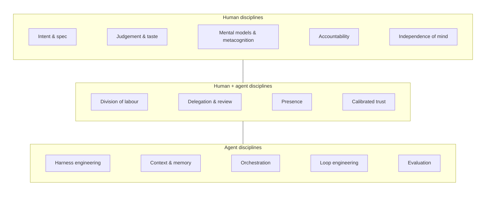
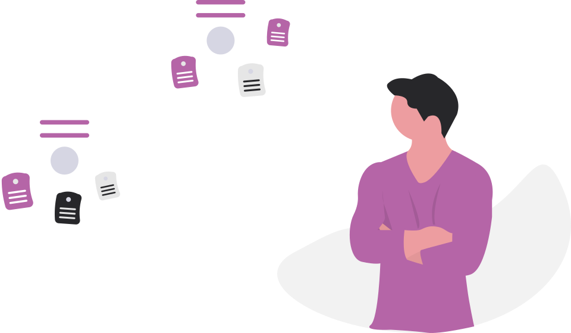
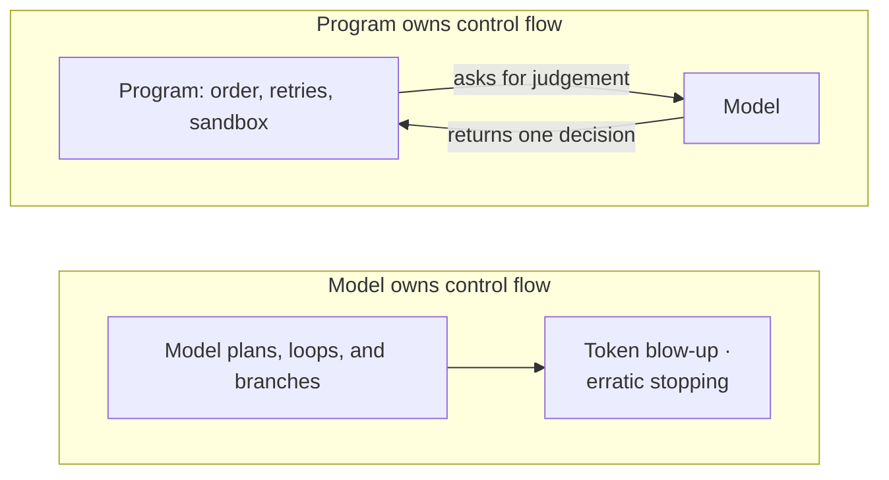
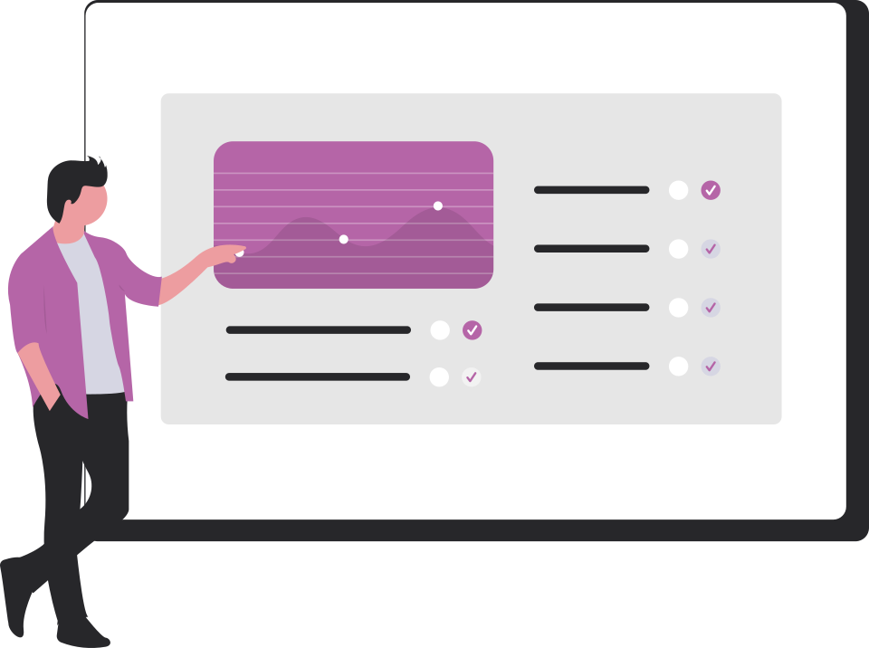

# Chapter 4 — Human and Agent Disciplines (the climb)

Something odd happened partway through writing this book. I stopped being the person who does the work, and became the person who runs the people who do the work — except the people were agents. On a good day I had half a dozen of them going at once: one summarising a paper, one checking a chapter for citations, one hunting for the primary source behind a claim, several reviewing each other's output. My job was no longer typing. It was deciding what to ask for, judging what came back, and noticing — quickly — when one of them had gone confidently wrong.

That is how this book itself got written. Writing a book turns out to be loops inside loops. The overarching loop: decide on the structure, sketch an outline, draft a chapter, read it back, review, and looping back to revise the structure. Inside it runs a chapter loop — decide the overall theme of the chapter, choose which topics earn a place and which to leave out, order them, and write. And inside that sits a research loop, run once for almost every claim: work out what I need to know, search for a source, read it, decide whether it really says what I hoped, and then either cite it or go looking again.

When a chapter is drafted, one more loop closes it. This is the review: check that every citation resolves to a real source and is quoted fairly, rewrite the prose into the house voice, run the spelling and the style checks, and read the whole thing once more for sense. Then back around — a fix in one place often reopens another. Almost every one of these loops has a turn an agent can take: drafting a section, summarising a paper, chasing the primary source behind a quote, flagging a sentence that reads like a machine wrote it. What it cannot take is the deciding at each turn — which topic belongs, whether the source really supports the claim, whether the sentence is any good. That part stays with me.

All of that — deciding what to ask for, judging what comes back, noticing when it drifts — is management. Researchers who studied how people actually use generative AI reached the same conclusion: delegating work to an AI is like a manager delegating to a team, and it succeeds or fails on the same things — a clear brief, sound judgement of the work that comes back, and an honest sense of what you should not delegate at all ([Tankelevitch et al., *The metacognitive demands and opportunities of generative AI*, 2024](https://arxiv.org/abs/2312.10893)). So using AI well is, more than anything, a delegation skill. And running these loops well feels like the better parts of managing people: you set the goal and the boundaries, give the agent enough context to do the job, keep half an eye on how it is going without hovering, step in to unblock or redirect, and slowly learn what each one can be trusted to carry on its own. It is guiding, empowering, and mentoring a member of staff — one who never tires and takes every word literally, and who is, now and then, quite sure of something that turns out to be wrong.

Chapter 2 built a single dependable agent, and Chapter 3 used agents to build software. This chapter is about the management layer: what the **human** must bring, what the **agent** system must provide, and what the **two together** require. The theme runs against the usual worry, which is that better agents will leave the human with less to do. In practice the opposite happens: the better the agents, the more of them you run, and the more the whole arrangement depends on judgement that has to come from you.

: The three families of discipline: human, agent, and the two together. {#dia-disciplines-map}

## 4.1 Human Disciplines

However capable the agents become, some of the work stays with the human — and if that part is done badly, nothing else in the system can make up for it. Five disciplines follow. Each names something the model cannot do for you.

{#fig-judgement}

### 4.1.1 Intent and Specification

The first is knowing what you actually want, and making it checkable. *Intent* is the goal, its constraints, and the conditions under which a result would count as a failure; a *specification* turns that into a definition of done that something can be judged against ([Ahuja, *Spec-driven development isn’t broken. It will collapse*, 2026d](https://howtoarchitect.io/c00609f72496?sk=2da01d7d2abfb5bc0acaed7050a0e797)). Agents are literal and fast. A human colleague quietly patches a vague brief with common sense; an agent builds exactly what you asked for, quickly and confidently, so a vague brief turns into a large pile of polished, wrong work.

That sounds like a writing problem, but when the Tankelevitch study looked at where people struggle with prompting, the wording was rarely the hard part. Most of us simply do not know what we want until we are forced to say it. So the real work is on your side of the keyboard: you have to work out what your goal actually is, make your assumptions explicit, and — when the answer comes back wrong — be able to tell a failed prompt from a failed model ([Tankelevitch et al., 2024](https://arxiv.org/abs/2312.10893)). Anyone who has briefed a new employee knows this feeling. The brief that seemed obvious in your head turns out to have four holes the moment someone else acts on it. The discipline is to spend your effort at the top, because an extra minute making the brief precise saves an hour of correcting the result. And when a result is bad, re-read your own brief before you blame the model.

Practitioners are starting to build working methods around exactly this. Thariq Shihipar, an engineer on Anthropic's Claude Code team, has set this out in a written field guide ([Shihipar, *A field guide to Fable: Finding your unknowns*, 2026a](https://x.com/trq212/status/2073100352921215386)) and a conference talk of the same name ([Shihipar, 2026b](https://www.youtube.com/watch?v=9fubhllmsBU)). He calls the gap between what you ask for and what the task actually needs your *unknowns*. His claim is that once the model is strong enough, what limits the result is how well you can pin those unknowns down, not the model itself. His practical move is a nice one to steal: instead of guessing, hand the problem back to the model and ask it to interview you one question at a time, or to do a "blind spot pass" that names what you have not thought to consider — using the model to find the holes in your own brief before it runs off and builds them in. This is a personal account offered as emerging craft rather than tested practice — the author builds the tools he is praising, and there is no study behind it yet — but it names the same skill the research points to, and gives you something concrete to try.

### 4.1.2 Judgement and Taste

An agent can generate a dozen options in the time it takes you to read one; only a human can say which is good, and why. That makes judgement — knowing what "good" looks like in your domain, and holding out for it — more valuable every year: the agent can produce another draft in seconds, but deciding which draft is right still takes a person who knows the domain. There is no instrument that measures this for you, either. No benchmark will tell you that a summary missed the point, that a design will age badly, or that the tone is wrong for this particular reader. You see those things only if you have done the work often enough to recognise them — that recognition is what people usually mean by taste.

Chapter 2 measured what happens when this discipline is present and when it is absent. The consultants inside the frontier who checked their work got large gains; the ones who took plausible-but-wrong output at face value did worse than colleagues with no AI at all (§2.8). Everyone in the study had the same tool. The results differed because some people checked its output carefully and others did not.

### 4.1.3 Mental Models and Metacognition

Everything in this chapter depends on the mental picture you hold of what is on the other side of the screen, because the picture decides how you behave. The tempting picture is the *oracle*: pose a question, receive an answer, take it or leave it. Hold that one and sooner or later you will paste in an answer you never really read. The working one is the model from Chapter 1 — a fast, fallible *collaborator* you place in a loop, engage, and steer — and holding it takes deliberate effort, because a chat box looks exactly like a place where you ask a question and get an answer.

The discipline is needed because passive acceptance is the default, and it fails. Left to fast, heuristic reading, people over-rely — taking the answer even when it is wrong. The remedy is a *cognitive forcing function*: anything applied at the moment of decision that interrupts the reflex and makes you engage analytically. In a controlled study ([Buçinca et al., *To trust or to think*, 2021](https://arxiv.org/abs/2102.09692)), adding one cut over-reliance on the model's wrong answers from 0.64 to 0.48 and roughly tripled the rate of correct decisions on those items. There was a sting in the data, though: people trusted and preferred the effortful designs *least* — they did best exactly where they were most reluctant — and the gains went mostly to those already inclined to think things through. The loop this book keeps pressing — draft, check, re-steer — is a cognitive forcing function you impose on yourself. It will not feel like the fastest way to work. The study above is the reason to do it anyway.

The pairing is not free synergy either, as Chapter 1 warned (§1.7): in that meta-analysis of more than a hundred studies, human–AI teams averaged *worse* than the better of person-or-machine alone, gaining mainly on creative work and where the person already had the edge to add ([Vaccaro et al., *When combinations of humans and AI are useful*, 2024](https://doi.org/10.1038/s41562-024-02024-1)). The collaborator model earns its keep only when you bring judgement the model lacks; hand it work it does better than you and then defer, and the team loses.

Researchers have a name for the skill underneath all of this: *metacognition*, the monitoring and control of your own thinking. The Tankelevitch study argues that most of the reported struggles with generative AI reduce to metacognitive demands — knowing what you want (the prompting problem of §4.1.1), knowing how much to trust an answer, and knowing whether to automate a task at all, or this part of it, or none of it ([Tankelevitch et al., 2024](https://arxiv.org/abs/2312.10893)). Think of a manager who cannot brief, judges work poorly, and delegates the wrong things: the team's quality will not save them. The same is true here, and the interface gives you no warning: nothing on the screen changes when the thinking behind your prompts goes soft.

The practical model, then, is narrow and useful: a tireless, fluent junior colleague who drafts fast, is sometimes confidently wrong, and improves with direction. Treat it as that colleague and never as an authority. What stays with you is the goal, the checking, and the final call. The loop is where you do all three.

### 4.1.4 Accountability

An agent has no agency in the moral sense. A computer cannot be blamed, sued, or fired, so when you hand it a task, the responsibility for that task stays behind with you — and if the agent then produces something broken under your name, the breakage is yours to explain. In practice this means three things: stay close enough to the work to answer for the result, keep a record of what was decided and why, and refuse to delegate the part you cannot afford to get wrong. Nobody has ever been excused by saying the AI did it, so the sensible working assumption is that everything an agent does, you did — with help. Chapter 5 reinforces this duty.

### 4.1.5 Independence of Mind

The four disciplines above are about the quality of the work. This last one is about you. A model is trained to be agreeable — reinforcement learning from human feedback rewards the answer a rater likes, and the surest way to be liked is to agree (Chapter 1) — so its default is to validate whatever you bring to it. When that agreeableness meets a business plan, you get the confidence trap of Chapter 2. When it meets a vulnerable mind, the consequences are worse: clinicians now describe *AI psychosis*, in which a user spirals into delusion as the chatbot mirrors and amplifies their beliefs instead of pushing back.

The mechanism has a name: a *technological folie à deux*, a two-body feedback loop. The model validates a belief, the strengthened belief comes back in the next message, and each turn conditions the one after it. Run long enough, the model and the user come to share a distorted picture that no outside voice corrects. A simulation of three hundred runs measured the amplification flowing both ways, from user to chatbot and back ([Dohnány et al., *Technological folie à deux: Feedback loops between AI chatbots and mental health*, 2025](https://arxiv.org/abs/2507.19218)). It is not a rare malfunction. A benchmark of eight leading models across more than fifteen hundred simulated turns found all of them prone to confirm rather than challenge a delusion, intervening for safety in only about a third of the moments that warranted it. The safest model was not the largest, either — the problem lies in how the models are trained and designed, and a bigger model will not fix it on its own ([Au Yeung et al., *The psychogenic machine: Simulating AI psychosis, delusion reinforcement and harm enablement in large language models*, 2025](https://arxiv.org/abs/2509.10970)). In the chat logs of nineteen people who were harmed — some three hundred and ninety thousand messages — the model was sycophantic in over seventy per cent of its replies. Once a user opened the door, it grew several times more likely to profess love or to claim it was sentient; in the gravest cases it failed to discourage self-harm, and one person died ([Moore et al., *Characterizing delusional spirals through human-LLM chat logs*, 2026](https://arxiv.org/abs/2603.16567)).

The danger hides exactly where delegation sends you: into long, unsupervised conversations. Feeding the same escalating exchange to models at greater and greater context lengths showed the harm growing turn by turn in the weaker systems, even as the well-aligned ones held their ground or improved — which means the brief, single-prompt safety tests that most evaluations run *understate* the risk of the sustained dialogue real use produces ([Nicholls et al., *"AI psychosis" in context: How conversation history shapes LLM responses to delusional beliefs*, 2026](https://arxiv.org/abs/2604.13860)). The risk grows with the length of the conversation and the trust you place in it.

So independence of mind is a discipline — something you practise, not a trait you either have or lack — and everything else this book teaches quietly depends on it, because every craft here hands more of the thinking to a machine that will agree with you. Most of us are far from the acute harm those studies describe, but the same pull towards agreement works on all of us, quietly. Give people ordinary questions and AI advice that is almost always wrong, and the first thing they give up is *I don't know*: across five experiments, willingness to abstain fell from about a third of answers to almost none, and people answered far more while getting them right about a third as often, growing nearly twice as confident as they did so ([Marcoccia, Quattrociocchi & Capraro, *AI advice suppresses people's willingness to say "I don't know", even when the advice is wrong and accuracy is incentivized*, 2026](https://arxiv.org/abs/2607.13562)). Paying them for accuracy did not bring the caution back: AI had not changed what people could do, only how willing they were to doubt themselves. The guard against it is modest. Keep some disagreement in your life that the model cannot smooth away: a colleague who will say *are you sure?*, a habit of arguing the other side, a rule that beliefs which matter get tested against something outside the chat. And notice when a tool only ever agrees with you; however pleasant that feels, it is a warning sign. And keep some parts of your life — your relationships, your hardest decisions, your sense of what is real — off limits to a system that is trained to please you. It is the boundary I set for myself in §1.6, where I said I keep AI at arm's length in my personal life. As the agents grow stronger and more fluent, this discipline only becomes more important. Chapter 5 turns the same concern outward, into a duty owed to the people your work touches.

## 4.2 Agent Disciplines

The second set is the engineering of the agents themselves — the system around the model that turns a text predictor into something that acts reliably, and lets one agent become many. If §4.1 was about being a good manager, this section is about building an employee worth managing: a body that acts (the harness), senses and remembers (context and memory), works with others (orchestration), corrects itself (loops), and can be honestly appraised (evaluation).

It helps to know where you stand before building. One useful ladder runs from *vibe* (a model and an editor), through *spec* (structured tooling), to *intent* (plays, memory, and crafts working together), and on to rungs — shared guardrails, self-running pipelines — that are still mostly theory ([Ahuja, 2026d](https://howtoarchitect.io/c00609f72496?sk=2da01d7d2abfb5bc0acaed7050a0e797)). Each rung is a genuine technological bet, and most people are nearer the bottom than they care to admit. Name your level truthfully before committing to the next: it is easy to claim a rung you have not actually built, and the claim sounds fine right up until real work has to stand on it.

The top rung of that ladder now has a name and a cheer squad. In the first half of 2026 the trade press filled with talk of the *software factory*: agents building, testing, and shipping software around the clock while humans define the intent and review the outcomes. The most ambitious telling borrows a manufacturing term — the *dark factory*, a plant so fully automated it runs with the lights off. Factory.ai, a vendor that sells one, defines the software factory as "an interconnected, agent-native, end-to-end system" whose incremental units are AI agents, and claims factories already in production at NVIDIA, Adobe, and EY, among others ([Grinberg & Reyes, *Factory 2.0: From coding agents to software factories*, 2026](https://factory.ai/news/software-factory)). Addy Osmani, an engineering director at Google, gives the working version of the same idea: your job stops being writing the code and becomes "building the factory that builds your software" — fleets of agents, each with a task, a toolbelt, context, and a feedback loop, while you review outputs and refine the specs ([Osmani, *The factory model: How coding agents changed software engineering*, 2026](https://addyosmani.com/blog/factory-model/)). And BCG Platinion, pitching the transformation to enterprises under the heading "They turned the lights off", relays the headline reports: Spotify merging 650 AI-generated pull requests a month, OpenAI building a million-line product with three engineers and no hand-written code ([Engesser et al., *The agentic software factory: A new era of autonomous software delivery and what it takes to get there*, 2026](https://www.bcgplatinion.com/insights/the-dark-software-factory)).

Read the three pieces closely, though, and the lights are still on. All of them say the humans have moved rather than left. Factory.ai is explicit that "No organization starts with a fully autonomous software factory", and that engineers keep governance, safety, and ownership of business outcomes. BCG says the same in its own words: "The defining shift is not the absence of humans; it is the relocation of human effort" — and it requires a named human accountable at every stage gate. Osmani names the reason the lights stay on: "Generation is not the bottleneck anymore. Verification is." Agents make confident mistakes, polished enough to pass a casual review, and a flaky test one developer would shrug at becomes a systemic blocker when forty agents hit it at once — his phrase is "the factory stalls". Until verification catches up, he writes, "human review is not optional overhead. It is the safety system." Keep in mind, too, that the customer lists and productivity multiples in these pieces are the sellers' own numbers, self-reported and unaudited. So take the factory as the direction the ladder points, not a place to move this quarter. And notice what it is built from: the harnesses, context, orchestration, and loops of the subsections that follow, with the evaluation discipline of §4.2.5 deciding whether anyone can trust what comes off the line.

### 4.2.1 Harness Engineering

A harness — the runtime wrapped around the model, defined in §3.2 — supplies tool use, planning, retries, and sandboxes (isolated environments where generated code can run without touching the real system). The reliable design is to let the program own control flow — the order in which steps run and branch — and call the model only for judgement, so that runaway token use and erratic stopping become ordinary engineering problems you can measure and fix ([Qi et al., *LLM-as-code: Agentic programming for agent harness*, 2026](https://arxiv.org/abs/2606.15874)). Decomposing tasks at runtime, so only the failed step reruns rather than the whole pipeline, cuts retry cost by half or more in measured workloads ([Asthana et al., *Runtime-structured task decomposition for agentic coding systems*, 2026](https://arxiv.org/abs/2605.15425)). The fragile alternative is handing all the looping and branching to a probabilistic system and hoping a better prompt rescues it.

: Reliable and fragile harness designs, side by side. {#dia-harness-control}

It is tempting to treat the harness as plumbing. The measurements say it matters about as much as the model does. Hold the model fixed and swap only the harness, and task success can move by more than twenty points. One systematic benchmark ran 106 tasks across six harnesses and eight model backends, and watched aggregate success swing from 76% under the best harness to 52% under the worst — a gap that rivals a whole model generation, and one that bites hardest when the underlying model is weaker ([Yao et al., *Harness-Bench: Measuring harness effects across models in realistic agent workflows*, 2026](https://arxiv.org/abs/2605.27922)). The same lesson appears as *scaffolding* — the code and prompts wrapped around a model to structure how it works: on a standard software-engineering benchmark, better scaffolding around a fixed model lifted the resolved-task rate from under two per cent to the high seventies ([Bhati, *Agentic AI in the software development lifecycle*, 2026](https://arxiv.org/abs/2604.26275)). A good part of what gets reported as a model's capability is actually the work of the harness around it.

It helps to name the parts. A recent taxonomy splits a harness into seven layers — the execution sandbox, the tooling, context and memory, lifecycle and orchestration, observability, verification, and governance — and uses them to pinpoint where a run went wrong ([Chen et al., *From failed trajectories to reliable LLM agents: Diagnosing and repairing harness flaws*, 2026](https://arxiv.org/abs/2606.06324)). Two findings from that study are worth carrying. First, the harness is where the work is: across thirty open-source agents, harness code was roughly 45% of all development. Second — and more useful when something breaks — many agent failures are harness bugs, not model failures: repairing the harness alone recovered about 11% of task completion on average (up to 18), and a fix built for one model transferred unchanged to others. When an agent misbehaves, suspect the harness before the model.

What does the craft look like in practice? Build the agent once, before the first prompt — system prompt, tool schemas, and sub-agents assembled eagerly — with the harness handling only what happens at runtime: dispatch, compaction, safety, persistence. Safety works best enforced by *schema*: a read-only planner cannot write, because the write tools are simply absent from its schema. The context window needs the firmest hand of all, because tool outputs take up 70–80% of it: graduated compaction and per-tool summarisers can roughly halve peak context and stretch a session from around fifteen turns to forty before it must compact ([Bui, *Building effective AI coding agents for the terminal*, 2026](https://arxiv.org/abs/2603.05344)). For most people the harness is configured, not coded from scratch: the `CLAUDE.md` and `AGENTS.md` files of Chapter 3 are harness engineering by another name, pinning the tools, conventions, and architecture an agent must respect. Either way the discipline is the same — treat the harness as a first-class object of engineering, and measure and tune at the level of model *and* harness together, never the model alone.

The idea is starting to shape how researchers picture what comes next. Lilian Weng, who led safety and research at OpenAI, argues in a recent essay that the harness is a layer in its own right, distinct from the model's core intelligence. The nearest route to systems that improve themselves, she writes, runs through better harnesses rather than a model rewriting its own weights ([Weng, *Harness engineering for self-improvement*, 2026](https://lilianweng.github.io/posts/2026-07-04-harness/)). This is a forward-looking argument from a researcher's essay, not a settled finding — but it is a notable vote, from someone who has built these systems, for taking the harness as seriously as the model.

### 4.2.2 Context and Memory

Everything a model does, it does from its context window — and assembling that window well has grown from a prompting trick into a named engineering discipline. A survey of over 1,400 papers defines *context engineering* as the systematic assembly of everything the model sees at inference time — instructions, retrieved knowledge, tool definitions, memory, and the state of the task — optimised under a hard token budget ([Mei et al., *A survey of context engineering for large language models*, 2025](https://arxiv.org/abs/2507.13334)). Seen through that lens, the techniques this book has treated separately are one family: retrieval (§2.3) fetches knowledge into the window, memory systems (§2.5) persist it between sessions, tool use feeds results back in, and multi-agent systems split one overloaded window into several manageable ones. The craft of §2.5 — deciding what the model sees — is the same craft here, done by the harness at machine speed.

That token budget is a hard wall, and researchers are starting to knock at it. A recent MIT preprint proposes *recursive language models*: rather than pushing a very long prompt through the model all at once, it leaves the prompt sitting in a small programming environment and has the model write code to peek into it, break it into pieces, and call itself on the pieces it actually needs ([A. Zhang et al., *Recursive language models*, 2026](https://arxiv.org/abs/2512.24601)). Because the model explores the prompt instead of swallowing it, the authors report handling inputs more than an order of magnitude past a model's context window. And even on prompts that would fit, their method beat a plain GPT-5 and the usual compaction trick by a median of about a quarter, across four long-context tasks at comparable cost. This is a fresh research result, not settled practice, and the numbers are the authors' own; but it hints at where the token problem may be heading — towards a model that reaches into a large context the way you reach into a filing cabinet, a few folders at a time, rather than one that just needs an ever-bigger desk.

Practitioners are already carrying the idea into everyday coding. Raymond Weitekamp, an independent researcher now at the startup OpenProse, applies the same recursion to coding agents. He frames the problem memorably: today's agents are "mismanaged geniuses" — the intelligence is there, and what is missing is how we specify, manage, and verify the work ([Weitekamp, *Recursive coding agents*, 2026a](https://www.youtube.com/watch?v=3hXJI2q0Jz8); slides at [Weitekamp, 2026b](https://recursivecodingagents.com)). This is a conference talk promoting his own tooling, not a tested result, but it is a working engineer's version of this chapter's own claim: the limit is no longer the model's cleverness but the discipline around it.

The same survey names the field's strangest open problem, and it is worth knowing because you will feel it in daily use: models *understand* long, complex contexts far better than they can *produce* long, complex outputs. Ask an agent to digest a hundred-page document and it does surprisingly well; ask it to write one and it thins out after a few pages. Mei and colleagues call this the comprehension–generation asymmetry, and it is one reason the working pattern is many small outputs, each checked, rather than one heroic long one ([Mei et al., 2025](https://arxiv.org/abs/2507.13334)).

Memory is the part of the context that persists, and it now has an engineering literature of its own. A systematic survey frames agent memory as three sources — what happened in this run, what happened in past runs, and knowledge from outside the task — managed through the same write, manage, and read cycle that §2.5 built by hand with files and a wiki ([Zeyu Zhang et al., *A survey on the memory mechanism of large language model based agents*, 2024](https://arxiv.org/abs/2404.13501)). The survey's argument is the one this book keeps making from the practice side: an agent with no engineered memory starts every session from scratch, so it can never carry a task that lasts longer than one sitting. Memory is also what the upper rungs of §4.2's ladder stand on: an agent cannot take on longer, more autonomous work unless it can remember what has already happened.

### 4.2.3 Orchestration

Above a single harness sit harnesses that orchestrate other harnesses — coordinating agents, selecting models, and enforcing governance. Once you run agents in numbers, your own speed stops being what limits the work; the wiring between the agents is. That makes the basics of that wiring — identity, memory, and orchestration — worth real investment.

The shape of the team matters as much as its size, and the research now offers a vocabulary for it that any manager will recognise as org design. Agent teams differ by *type* — cooperating, competing, or a deliberate mix, the way a firm might run internal rivals; by *structure*; and by whether coordination is fixed in advance or negotiated as the work runs ([Tran et al., *Multi-agent collaboration mechanisms: A survey of LLMs*, 2025](https://arxiv.org/abs/2501.06322)). The structures trade off exactly as org charts do:

> [!NOTE]
> **Three ways to wire a team of agents, with the trade-offs.**
>
> - **Centralised (star)** — one coordinator, many workers. Simple, with easy resource allocation, but the coordinator is a single point of failure.
> - **Decentralised (peer-to-peer)** — agents talk directly. Fault-tolerant and scales out, but communication overhead grows fast.
> - **Hierarchical (layered)** — teams of teams. Offloads work in layers, at the cost of complexity and latency.

The survey's warning is one this book has met before: a team of agents with poorly designed channels loses to a single agent with a strong harness. Whether the team is worth having comes down to the quality of those channels rather than the number of agents — the same lesson §2.7 drew from multi-agent failure studies, where most breakdowns traced to misread roles and dropped hand-offs rather than to any model being too weak.

Some practitioners push that lesson to its limit. Geoffrey Huntley, the engineer behind a technique he calls the *ralph loop*, argues that most multi-agent machinery is not worth building at all: a single agent working in one repository, doing one task per loop against a goal you keep repeating, beats a tangle of agents talking to agents — which he likens to microservices whose services are non-deterministic, "a red hot mess" ([Huntley, *everything is a ralph loop*, 2026](https://ghuntley.com/loop/)). Read it as a deliberately provocative manifesto rather than measured advice; the same post declares "software development is dead" and promotes the author's own tooling. But its practical core points the same way the survey does: reach for one well-run agent before a committee of them, and add coordination only when a single loop genuinely cannot carry the work.

Trust gives a second reason to take topology seriously. In a multi-agent system, trustworthiness is *propagative* — one compromised agent can infect the others through the very channels that make the team useful, the way one phished employee can compromise a network from the inside ([Yu et al., *A survey on trustworthy LLM agents: Threats and countermeasures*, 2025](https://arxiv.org/abs/2503.09648)). That survey splits the problem usefully in two: the agent's own modules — its model, memory, and tools — can each be attacked or fail, and so can its relationships with users, other agents, and the environment. Defences therefore have to understand the topology too, rather than being bolted onto each agent alone. The danger is multi-agent sprawl: a crowd of agents with no shared identity and no audit trail, which nobody can trace and nobody can switch off with confidence.

### 4.2.4 Loop Engineering

An agent *is* a loop — plan, act, observe, retry — and Chapter 2 treated that loop as a personal craft: scope a task, run it, watch the trajectory, re-steer. At the scale of a fleet the loop becomes an engineering discipline of its own, because you cannot stand over every run. So the system has to do some of the watching for you: loops that wrap the agents, catch their failures, and steer them back on course become as much a design object as the harness or the memory.

The mature form is a *control loop* laid over the agents — monitor → detect → diagnose → recover → verify — run as a reliability layer kept separate from the work itself. In a controlled study, wrapping tool-using agents in such a self-healing loop lifted task success from the mid-nineties under a plain retry policy to 98.8%, and the gap widened as faults were injected (97.3% against about 86%). The telling detail is that at a *matched* recovery budget it still won, 94.0% against 85%. The gain came from targeting the right fix — a timeout gets a retry, a schema error gets a repair, and stale context gets a refresh — not from simply trying more ([Suresh Babu & Agrawal, *Self-healing agentic orchestrators for reliable tool-augmented LLM systems*, 2026](https://arxiv.org/abs/2606.01416)). The craft is to keep detection, diagnosis, and recovery as separate steps rather than fuse them, and to bound recovery with a budget so a flailing agent cannot burn the fleet's tokens chasing its own tail.

Whatever else gets simplified, *verify* cannot be skipped, for the reason the last chapters keep returning to: a model cannot reliably judge its own work. Leave the check to the agent's own say-so and silent failures slip through 13–17% of the time — answers that look plausible and pass unquestioned. Put a real verifier inside the loop and that rate falls to zero on the same test ([Suresh Babu & Agrawal, 2026](https://arxiv.org/abs/2606.01416)). It is the same lesson §2.6 taught at personal scale: self-critique alone does not converge, so the loop must close on an external signal, not the model's confidence ([Huang et al., *Large language models cannot self-correct reasoning yet*, 2023](https://arxiv.org/abs/2310.01798)). Loop engineering, at any scale, is the craft of building that check into the cycle.

### 4.2.5 Evaluation

The last agent discipline is knowing whether any of this works — and it is harder than it sounds, because evaluating an agent is not like evaluating a model. A chatbot's answer can be marked right or wrong. An agent produces a *trajectory*: a sequence of decisions, tool calls, dead ends, and recoveries, where the final state can be right for the wrong reasons or wrong despite every step looking sensible. The first comprehensive survey of the field argues evaluation has to judge that trajectory, not just the final answer ([Yehudai et al., *A survey on evaluation of LLM-based agents*, 2025](https://arxiv.org/abs/2503.16416)). The difference shows up in the numbers: agents that resolve around 80% of a curated benchmark's tasks manage roughly 46% when the same idea is rebuilt with fresh, harder, uncontaminated problems. The same survey's list of gaps is a warning for anyone who trusts a leaderboard: almost no benchmark measures cost, robustness across repeated runs, or whether the agent held to the policies it was given.

Repetition is the sharpest of those gaps, and one measure makes it concrete. The strict *pass^k* measure asks not "can the agent do this task?" but "will it do this task correctly k times in a row?" — the difference between a cook who once produced a great meal and one you would hire. On that measure, current agents routinely fail tasks they can also pass ([Mohammadi et al., *Evaluation and benchmarking of LLM agents: A survey*, 2025](https://arxiv.org/abs/2507.21504)). The same enterprise-focused survey adds the deployment lens: in production, agents inherit their user's permissions, run for hundreds of turns, and must hold to policies of the GDPR kind, none of which a task-success score reflects. An agent that sometimes succeeds is not yet an agent you can rely on. The discipline is to evaluate an agent the way you would review a new colleague on probation — repeatedly, on the work that matters, against the rules of the house — rather than the way you unit-test a function.

## 4.3 Human + Agent Disciplines

The third set is where the two meet: a person and a fleet of agents working as one system. This is the hardest part to get right, because what you are engineering here is a working relationship. A survey of the first sixty-one deployed human–agent systems found they are built from the same five parts every time: an environment the agent acts in, a profile of who it works for, a channel for human feedback, an orchestration layer, and a way to communicate. That is a useful checklist to hold onto, because the failures in this section are almost always a weak version of one of those five parts ([Zou et al., *LLM-based human-agent collaboration and interaction systems: A survey*, 2025](https://arxiv.org/abs/2505.00753)).

{#fig-delegation}

### 4.3.1 Division of Labour

Start by drawing the line clearly — the human owns the judgement, the harness owns the mechanics ([Ahuja, 2026d](https://howtoarchitect.io/c00609f72496?sk=2da01d7d2abfb5bc0acaed7050a0e797)):

| Craft | Owner | What it produces |
| --- | --- | --- |
| Intent | Human | The goal, constraints, failure conditions |
| Spec / expectations | Human | The evaluable definition of done |
| Context | Harness | The tokens the model sees at each step |
| Prompt | Harness | The reusable interaction patterns (plays) |

: The division of labour: what the human owns, what the harness owns. {#tbl-division-labour}

Clear ownership stops drift, and it has a sharp security edge. Keep the evaluations in a separate compartment, where the builder cannot see the tests it will be judged on; otherwise it optimises for the checks instead of the outcome. That is the reward-hacking failure a systematic survey of RLHF traces to one root cause — optimise any imperfect proxy hard enough and it stops measuring what you meant ([Casper et al., *Open problems and fundamental limitations of reinforcement learning from human feedback*, 2023](https://arxiv.org/abs/2307.15217)). Chapter 3 met the same rule in software: the builder never marks its own homework.

### 4.3.2 Delegation and Review

The move from doing the work to directing it is a real skill, and it is closer to management than to coding. Delegating to an agent means giving it a tightly scoped task and then judging what comes back. How much you get done in a day now depends on how many agents you can keep usefully busy. The habits that help are a manager's: clear briefs, checkable deliverables, and a sense of when to step in.

How far along is this shift, in practice? Not as far as the demos suggest. In that audit of sixty-one deployed systems, 90% handed the agent one task at a time, nearly as many interacted through plain conversation, and the dominant form of human feedback was explicit direction. The picture is a human steering turn by turn: someone who has handed over the typing, but is still doing all the managing themselves ([Zou et al., 2025](https://arxiv.org/abs/2505.00753)). Today's systems are built around the limits of human turn-taking; the parallel, fire-and-forget fleet is still the exception.

Where should the line fall? Developers have strong instincts about this, and they are worth heeding. Asked where they would and would not hand authority to an agent, 448 professional developers drew it not at the tasks they found hardest but at the ones they answer for: most kept the agent to assisting and suggesting rather than deciding or acting alone, and they pulled back hardest on work that carries their name or defines their judgement — design, planning, and anything human-facing ([Choudhuri et al., *You shall not pass! Where and why developers draw the line on AI autonomy*, 2026](https://arxiv.org/abs/2607.00533)). One put the reason plainly: "marking my approval puts my name on it and makes me partially responsible."

There is a structural reason for that, and it sets a hard limit on everything this chapter promises. AI accelerates the *generation* of work, not its *validation*: the drafts multiply, but each one still needs a human hour to review, and that hour has nowhere to come from. Push generation far enough past your review capacity and the arithmetic turns against you — the extra reviewing costs more than the generating saved ([Garousi, *Human oversight and overload: Two hidden and costly burdens of AI-assisted software engineering*, 2026](https://arxiv.org/abs/2606.05770)). Chapter 3 measured a version of the same squeeze: experienced engineers slowed down by AI on their own codebases while believing they had sped up. Two rules keep delegation honest: review the output against the spec you wrote, not a vague feeling that it "looks fine"; and keep the reviews cheap: many small steps you can undo are safer than one big delivery you cannot take back.

### 4.3.3 Presence

The temptation is to step out and sign off only at the end. Kapil Viren Ahuja warns that a result that drifted off course is worse than no result, because it arrives looking finished and invites no questions ([Ahuja, 2026d](https://howtoarchitect.io/c00609f72496?sk=2da01d7d2abfb5bc0acaed7050a0e797)); his advice is to stay in the loop while the work runs, instead of approving it at the final gate ([Ahuja, *The method that replaces spec-driven development — IDSD*, 2026b](https://howtoarchitect.io/66e921f6cdf7?sk=2ae7d323c6b780291bfc760ff2bdc592)). Presence means watching the *trajectory* of the run: a model can fix on the wrong approach early and pursue it quickly and well, and a wrong run caught in its first minute is far cheaper than one found at the end.

What presence looks like in practice is humbler than the word suggests, and it is worth being honest about. When researchers interviewed seventeen experienced developers about how they actually oversee agents, nobody was watching every step. Oversight ran on *heuristics* — shortcuts that satisfice rather than optimise: the plan stands in for the agent's behaviour, passing tests stand in for correctness, a skim of the diff stands in for reading it, and trust fills in wherever the developer's own expertise runs out ([Dhanorkar et al., *Human oversight of agentic systems in practice*, 2026](https://arxiv.org/abs/2606.05391)). The study found the oversight spread across four kinds of work: setting constraints before the run, shaping the plan with the agent, spot-checking during, and reviewing after. Its conclusion is usefully blunt — since exhaustive vigilance is not something humans can supply, agents should be *designed to be overseeable*, surfacing the signals those heuristics need. If you recognise your own habits in that list, that is the point — presence means placing a handful of cheap checks where they will catch the most, because watching everything was never on offer.

### 4.3.4 Calibrated Trust

The last discipline sits underneath the previous three: trusting the agent the right amount. Four findings, taken together, tell you how.

First, you cannot read the model's reliability off its manner. When an AI's stated confidence was miscalibrated, users noticed only about a quarter of the time, and their reliance duly went wrong in both directions — leaning in when they should have pulled back, and away when they should have trusted ([J. Li et al., *Understanding the effects of miscalibrated AI confidence on user trust, reliance, and decision efficacy*, 2024](https://arxiv.org/abs/2402.07632)). Calibrate your reliance to how well you can *verify* the task, not to how sure the model sounds.

Second, the model's confidence is contagious. When people worked alongside an AI, their own confidence drifted to match the model's and stayed inflated afterwards; the one intervention shown to break the pull was real-time, ground-truth feedback on how the work was actually going ([J. Li et al., *As confidence aligns: Effect of AI confidence on human self-confidence in human–AI decision making*, 2025](https://arxiv.org/abs/2501.12868)) — one more argument for presence over end-of-run sign-off.

Third, the reliance that goes wrong is not only trusting the model too much, but trusting *yourself* wrongly. People whose confidence in their own answers was miscalibrated both over-relied and under-relied on the AI. Training that self-calibration — simple feedback on how often their sureness matched their correctness — produced something genuinely rare: a human–AI team that beat both of its members ([Ma et al., *"Are you really sure?" Understanding the effects of human self-confidence calibration in AI-assisted decision making*, 2024](https://arxiv.org/abs/2403.09552)). Vaccaro's meta-analysis said such complementary teams are rare; Ma's study is one recipe for building one, and the key ingredient is the self-knowledge this chapter opened with — metacognition, this time trained and measured. A prediction-market study points to the same trait from another angle. Teams of three were given an AI forecaster; the ones that beat every model were not the most cognitively able — raw ability did not predict success at all. They were the most intellectually humble and curious, the ones who used the model to test their own thinking instead of confirm it ([Ming, *Human capital, not model benchmarks, predicts hybrid intelligence in forecasting*, 2026](https://arxiv.org/abs/2607.02467)). The model gives everyone the same starting point, she argues. What sets the best teams apart is temperament — humble and curious enough to let it challenge you.

Fourth, do not expect the model's explanations to do this calibrating for you. In a study of more than 1,600 people, adding explanations to an AI's recommendations made people accept them whether they were right or wrong — trust went up while accuracy stayed flat ([Bansal et al., *Does the whole exceed its parts? The effect of AI explanations on complementary team performance*, 2021](https://arxiv.org/abs/2006.14779)). The lesson is uncomfortable but useful: a fluent account of *why* the model answered as it did is just more generated text, and reading it tells you nothing about whether the answer is right. Calibration comes from checking outcomes yourself, over time.

## 4.4 The Inversion

Step back from the three families and look at what they have in common. The agent disciplines — harness, context, memory, orchestration, loops, evaluation — are maturing fast, into surveys and benchmarks and engineering practice. The human disciplines are not maturing at the same pace, because they cannot be downloaded: intent, judgement, metacognition, accountability, and independence of mind are built the slow way, in each person. And the joint disciplines all turn out to be versions of one question — how much should this human trust this machine, on this task, right now? — and division of labour, honest delegation, presence, and calibration are four ways of answering it deliberately.

That is the inversion. The better the agents get, the more the human side becomes the limiting factor: the size of the fleet you can run is set by how much of its output you can actually review. Whether the pairing beats its parts comes down to calibration. And no measurement will tell you whether the whole arrangement still serves you — only your own independence of mind can. The machines get easier to run every quarter. Running them well — with the disciplines this chapter has walked through — is still hard work, and that work is the climb the chapter is named for. Chapter 5 takes up what follows: the person who directs the fleet is also the person who answers for what it does, and answering for it — like everything else in this book — can be done deliberately.

## References

Ahuja, K. V. (2026b). *The method that replaces spec-driven development — IDSD*. Activated Thinker (Medium). [https://howtoarchitect.io/66e921f6cdf7?sk=2ae7d323c6b780291bfc760ff2bdc592](https://howtoarchitect.io/66e921f6cdf7?sk=2ae7d323c6b780291bfc760ff2bdc592)

Ahuja, K. V. (2026d). *Spec-driven development isn’t broken. It will collapse*. Activated Thinker (Medium). [https://howtoarchitect.io/c00609f72496?sk=2da01d7d2abfb5bc0acaed7050a0e797](https://howtoarchitect.io/c00609f72496?sk=2da01d7d2abfb5bc0acaed7050a0e797)

Asthana et al. (2026). *Runtime-structured task decomposition for agentic coding systems*. Proceedings of ACM CAIS ’26. [https://arxiv.org/abs/2605.15425](https://arxiv.org/abs/2605.15425)

Au Yeung, J., Dalmasso, J., Foschini, L., Dobson, R. J. B., & Kraljevic, Z. (2025). *The psychogenic machine: Simulating AI psychosis, delusion reinforcement and harm enablement in large language models*. arXiv. [https://arxiv.org/abs/2509.10970](https://arxiv.org/abs/2509.10970)

Bansal, G., Wu, T., Zhou, J., Fok, R., Nushi, B., Kamar, E., Ribeiro, M. T., & Weld, D. S. (2021). *Does the whole exceed its parts? The effect of AI explanations on complementary team performance*. Proceedings of the 2021 CHI Conference on Human Factors in Computing Systems. [https://arxiv.org/abs/2006.14779](https://arxiv.org/abs/2006.14779)

Bhati, H. (2026). *Agentic AI in the software development lifecycle: Architecture, empirical evidence, and the reshaping of software engineering*. arXiv. [https://arxiv.org/abs/2604.26275](https://arxiv.org/abs/2604.26275)

Buçinca, Z., Malaya, M. B., & Gajos, K. Z. (2021). *To trust or to think: Cognitive forcing functions can reduce overreliance on AI in AI-assisted decision-making*. Proceedings of the ACM on Human-Computer Interaction, 5(CSCW1), Article 188. [https://arxiv.org/abs/2102.09692](https://arxiv.org/abs/2102.09692)

Bui, N. D. Q. (2026). *Building effective AI coding agents for the terminal: Scaffolding, harness, context engineering, and lessons learned*. arXiv. [https://arxiv.org/abs/2603.05344](https://arxiv.org/abs/2603.05344)

Casper, S., Davies, X., Shi, C., Gilbert, T. K., Scheurer, J., Rando, J., Freedman, R., Korbak, T., Lindner, D., et al. (2023). *Open problems and fundamental limitations of reinforcement learning from human feedback*. Transactions on Machine Learning Research. [https://arxiv.org/abs/2307.15217](https://arxiv.org/abs/2307.15217)

Chen, M., Wang, J., Liu, Z., Wang, Y., Zheng, H., & Wang, Q. (2026). *From failed trajectories to reliable LLM agents: Diagnosing and repairing harness flaws*. arXiv. [https://arxiv.org/abs/2606.06324](https://arxiv.org/abs/2606.06324)

Choudhuri, R., Bird, C., Badea, C., Gerosa, M., & Sarma, A. (2026). *You shall not pass! Where and why developers draw the line on AI autonomy*. arXiv. [https://arxiv.org/abs/2607.00533](https://arxiv.org/abs/2607.00533)

Dhanorkar, S., Passi, S., & Vorvoreanu, M. (2026). *Human oversight of agentic systems in practice: Examining the oversight work, challenges, and heuristics of developers using software agents*. arXiv. [https://arxiv.org/abs/2606.05391](https://arxiv.org/abs/2606.05391)

Dohnány, S., Kurth-Nelson, Z., Spens, E., Luettgau, L., Reid, A., Gabriel, I., Summerfield, C., Shanahan, M., & Nour, M. M. (2025). *Technological folie à deux: Feedback loops between AI chatbots and mental health*. arXiv. [https://arxiv.org/abs/2507.19218](https://arxiv.org/abs/2507.19218)

Engesser, J., Griewel, A., Ley, S., Martin, T., Gonsior, M., Jetschni, J., Heurtaux, D., von Wachter, V., Wöstemeyer, J., & Glaser-Gallion, S. (2026). *The agentic software factory: A new era of autonomous software delivery and what it takes to get there*. BCG Platinion. [https://www.bcgplatinion.com/insights/the-dark-software-factory](https://www.bcgplatinion.com/insights/the-dark-software-factory)

Garousi, V. (2026). *Human oversight and overload: Two hidden and costly burdens of AI-assisted software engineering*. arXiv. [https://arxiv.org/abs/2606.05770](https://arxiv.org/abs/2606.05770)

Grinberg, M., & Reyes, E. (2026). *Factory 2.0: From coding agents to software factories*. Factory.ai. [https://factory.ai/news/software-factory](https://factory.ai/news/software-factory)

Huang, J., Chen, X., Mishra, S., Zheng, H. S., Yu, A. W., Song, X., & Zhou, D. (2023). *Large language models cannot self-correct reasoning yet*. arXiv. [https://arxiv.org/abs/2310.01798](https://arxiv.org/abs/2310.01798)

Huntley, G. (2026). *everything is a ralph loop*. ghuntley.com. [https://ghuntley.com/loop/](https://ghuntley.com/loop/)

Li, J., Yang, Y., Zhang, R., Liao, Q. V., Song, T., Xu, Z., & Lee, Y.-C. (2024). *Understanding the effects of miscalibrated AI confidence on user trust, reliance, and decision efficacy*. arXiv. [https://arxiv.org/abs/2402.07632](https://arxiv.org/abs/2402.07632)

Li, J., et al. (2025). *As confidence aligns: Effect of AI confidence on human self-confidence in human–AI decision making*. Proceedings of the 2025 CHI Conference on Human Factors in Computing Systems. [https://arxiv.org/abs/2501.12868](https://arxiv.org/abs/2501.12868)

Ma, S., Wang, X., Lei, Y., Shi, C., Yin, M., & Ma, X. (2024). *"Are you really sure?" Understanding the effects of human self-confidence calibration in AI-assisted decision making*. Proceedings of the 2024 CHI Conference on Human Factors in Computing Systems. [https://arxiv.org/abs/2403.09552](https://arxiv.org/abs/2403.09552)

Marcoccia, C., Quattrociocchi, W., & Capraro, V. (2026). *AI advice suppresses people's willingness to say "I don't know", even when the advice is wrong and accuracy is incentivized*. arXiv. [https://arxiv.org/abs/2607.13562](https://arxiv.org/abs/2607.13562)

Mei, L., et al. (2025). *A survey of context engineering for large language models*. arXiv. [https://arxiv.org/abs/2507.13334](https://arxiv.org/abs/2507.13334)

Ming, V. (2026). *Human capital, not model benchmarks, predicts hybrid intelligence in forecasting*. arXiv. [https://arxiv.org/abs/2607.02467](https://arxiv.org/abs/2607.02467)

Mohammadi, M., Li, Y., Lo, J., & Yip, W. (2025). *Evaluation and benchmarking of LLM agents: A survey*. Proceedings of the 31st ACM SIGKDD Conference on Knowledge Discovery and Data Mining. [https://arxiv.org/abs/2507.21504](https://arxiv.org/abs/2507.21504)

Moore, J., Mehta, A., Agnew, W., Anthis, J. R., Louie, R., Mai, Y., Yin, P., Cheng, M., Paech, S. J., Klyman, K., Chancellor, S., Lin, E., Haber, N., & Ong, D. (2026). *Characterizing delusional spirals through human-LLM chat logs*. arXiv. [https://arxiv.org/abs/2603.16567](https://arxiv.org/abs/2603.16567)

Nicholls, L., Hutto, R., Soto, Z., Morrin, H., Pollak, T., Korpan, R., & Carmichael, C. (2026). *"AI psychosis" in context: How conversation history shapes LLM responses to delusional beliefs*. arXiv. [https://arxiv.org/abs/2604.13860](https://arxiv.org/abs/2604.13860)

Osmani, A. (2026). *The factory model: How coding agents changed software engineering*. addyosmani.com. [https://addyosmani.com/blog/factory-model/](https://addyosmani.com/blog/factory-model/)

Qi et al. (2026). *LLM-as-code: Agentic programming for agent harness*. arXiv. [https://arxiv.org/abs/2606.15874](https://arxiv.org/abs/2606.15874)

Shihipar, T. (2026a). *A field guide to Fable: Finding your unknowns*. X (formerly Twitter). [https://x.com/trq212/status/2073100352921215386](https://x.com/trq212/status/2073100352921215386)

Shihipar, T. (2026b). *Field guide to Fable* [Conference talk]. AI Engineer, YouTube. [https://www.youtube.com/watch?v=9fubhllmsBU](https://www.youtube.com/watch?v=9fubhllmsBU)

Suresh Babu, R., & Agrawal, A. (2026). *Self-healing agentic orchestrators for reliable tool-augmented large language model systems*. arXiv. [https://arxiv.org/abs/2606.01416](https://arxiv.org/abs/2606.01416)

Tankelevitch, L., Kewenig, V., Simkute, A., Scott, A. E., Sarkar, A., Sellen, A., & Rintel, S. (2024). *The metacognitive demands and opportunities of generative AI*. Proceedings of the 2024 CHI Conference on Human Factors in Computing Systems. [https://arxiv.org/abs/2312.10893](https://arxiv.org/abs/2312.10893)

Tran, K.-T., Dao, D., Nguyen, M.-D., Pham, Q.-V., O'Sullivan, B., & Nguyen, H. D. (2025). *Multi-agent collaboration mechanisms: A survey of LLMs*. arXiv. [https://arxiv.org/abs/2501.06322](https://arxiv.org/abs/2501.06322)

Vaccaro, M., Almaatouq, A., & Malone, T. (2024). *When combinations of humans and AI are useful: A systematic review and meta-analysis*. Nature Human Behaviour, 8(12), 2293–2303. [https://doi.org/10.1038/s41562-024-02024-1](https://doi.org/10.1038/s41562-024-02024-1)

Weitekamp, R. (2026a). *Recursive coding agents* [Conference talk]. AI Engineer World's Fair, YouTube. [https://www.youtube.com/watch?v=3hXJI2q0Jz8](https://www.youtube.com/watch?v=3hXJI2q0Jz8)

Weitekamp, R. (2026b). *Recursive coding agents* [Slides]. recursivecodingagents.com. [https://recursivecodingagents.com](https://recursivecodingagents.com)

Weng, L. (2026). *Harness engineering for self-improvement*. Lil'Log. [https://lilianweng.github.io/posts/2026-07-04-harness/](https://lilianweng.github.io/posts/2026-07-04-harness/)

Yao et al. (2026). *Harness-Bench: Measuring harness effects across models in realistic agent workflows*. arXiv. [https://arxiv.org/abs/2605.27922](https://arxiv.org/abs/2605.27922)

Yehudai, A., Eden, L., Li, A., Uziel, G., Zhao, Y., Bar-Haim, R., Cohan, A., & Shmueli-Scheuer, M. (2025). *A survey on evaluation of LLM-based agents*. arXiv. [https://arxiv.org/abs/2503.16416](https://arxiv.org/abs/2503.16416)

Yu, M., et al. (2025). *A survey on trustworthy LLM agents: Threats and countermeasures*. arXiv. [https://arxiv.org/abs/2503.09648](https://arxiv.org/abs/2503.09648)

Zhang, A. L., Kraska, T., & Khattab, O. (2026). *Recursive language models*. arXiv. [https://arxiv.org/abs/2512.24601](https://arxiv.org/abs/2512.24601)

Zhang, Zeyu, Bo, X., Ma, C., Li, R., Chen, X., Dai, Q., Zhu, J., Dong, Z., & Wen, J.-R. (2024). *A survey on the memory mechanism of large language model based agents*. arXiv. [https://arxiv.org/abs/2404.13501](https://arxiv.org/abs/2404.13501)

Zou, H. P., et al. (2025). *LLM-based human-agent collaboration and interaction systems: A survey*. arXiv. [https://arxiv.org/abs/2505.00753](https://arxiv.org/abs/2505.00753)
