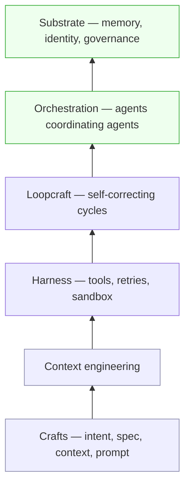
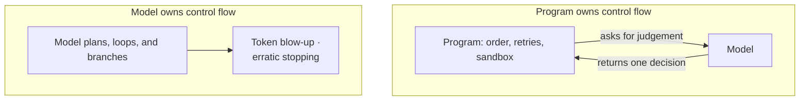

# Chapter 4 — Engineering Disciplines (the climb)

Every craft has a moment where you stop doing the work and start designing how the work gets done. A cook becomes a head chef; a coder becomes an architect. With AI, that moment arrives fast. The previous chapter described what good AI software looks like; this one is about the disciplines that produce it.

They form a ladder — crafts, context, harness, loops, orchestration, substrate — and the theme is constant: as models improve, your job climbs from writing prompts to designing the systems that run them.

## The Four Crafts

Prompting has not vanished; it has split into four skills — intent, spec, context, and prompt — and the useful question is who owns each ([Ahuja, 2026](https://howtoarchitect.io/c00609f72496?sk=2da01d7d2abfb5bc0acaed7050a0e797)).

| Craft | Owner | What it produces |
| --- | --- | --- |
| Intent | Human | The goal, constraints, failure conditions |
| Spec / expectations | Human | The evaluable definition of done |
| Context | Harness | The tokens the model sees at each step |
| Prompt | Harness | The reusable interaction patterns (plays) |

Clear ownership is what stops drift, and it has a sharp security edge: compartment the evaluations so the builder cannot see the tests it will be judged on, or it will optimise for the checks instead of the outcome — the reward-hacking failure that a systematic survey of RLHF traces to optimising any imperfect proxy hard enough ([Casper et al., TMLR](https://arxiv.org/abs/2307.15217)). The harder discipline is presence. It is tempting to step out and sign off only at the end, but a drifted result is worse than no result because it lies with confidence ([Ahuja, 2026](https://howtoarchitect.io/c00609f72496?sk=2da01d7d2abfb5bc0acaed7050a0e797)); staying in the loop while the work runs beats approving it at the final gate ([Ahuja, 2026](https://howtoarchitect.io/66e921f6cdf7?sk=2ae7d323c6b780291bfc760ff2bdc592)). Presence is also calibration, not just supervision: when people receive real-time, ground-truth feedback as an agent works, their own confidence stops drifting to match the model's — the one intervention shown to break that pull ([Li et al. 2025](https://arxiv.org/abs/2501.12868)).

## Context Engineering

Anthropic calls context engineering the successor to prompt engineering: less about finding the right words, more about curating the tokens an agent sees at each step ([Anthropic 2025](https://www.anthropic.com/engineering/effective-context-engineering-for-ai-agents)). It matters because attention is finite. Chroma's "context rot" study of 18 models shows recall decays as the window fills, and the reassuring needle-in-a-haystack test only measures lexical lookup; once a needle needs a semantic inference, accuracy falls further with length — every token spends an attention budget, a cost of the transformer's n² scaling ([Chroma 2025](https://research.trychroma.com/context-rot)). Context is a scarce resource, not a dumping ground; aim for the smallest set of high-signal tokens that does the job.

That yields concrete techniques. Compaction summarises a near-full conversation and reopens a fresh window with the essentials. Note-taking lets an agent keep a NOTES.md and read it back after a reset. Sub-agents explore on clean contexts and return distilled summaries. Just-in-time retrieval keeps lightweight references — file paths, queries — and loads detail only when needed, so naming and folders become signal. Structure can be injected too: inline call/inheritance tags give a grep-first agent +2.2pp localisation, shorter trajectories, and roughly half the variance — helping less by making agents smarter than by making navigation reproducible ([2606.26979](../research/papers/2606.26979-static-anchoring.md)). The recurring waste is re-reading the whole store every turn; the discipline is to feed context progressively.

## Harness Engineering

A harness is the runtime around the model: tool use, planning, retries, and sandboxes (isolated environments where generated code can run without touching the real system). The reliable design is to let the program own control flow — the order in which steps run and branch — and call the model only for judgement, so that runaway token use and erratic stopping stop being mysteries and become engineering ([2606.15874](../research/papers/2606.15874-llm-as-code.md)). Decomposing tasks at runtime, so only the failed step reruns rather than the whole pipeline, cuts retry cost by half or more in measured workloads ([2605.15425](../research/papers/2605.15425-runtime-decomposition.md)). The fragile alternative is handing all the looping and branching to a probabilistic system and hoping a better prompt rescues it.

## Loopcraft

The craft of the moment is stacking self-correcting cycles and watching their trajectories, since non-deterministic loops break ordinary unit tests and leverage comes from loops, not prompts. The practitioners are blunt about it — Steinberger says design the loops that prompt your agents; Cherny says he writes loops, not prompts; Karpathy says arrange things so they run autonomously and hit go ([Loopcraft](https://www.latent.space/p/ainews-loopcraft-the-art-of-stacking)). The skill is knowing when to drop a loop for reliability and when to climb one for leverage. The trap is fixing things by hand as you always have, instead of building systems that scale with more agents.

## Meta-Harnesses & Orchestration

Above the harness sit harnesses that orchestrate other harnesses — coordinating agents, selecting models, enforcing governance. Leverage now scales with agents rather than your own speed, which makes standard primitives for identity, memory, and orchestration worth real investment. The danger is multi-agent sprawl with no shared identity and no audit trail, where the leverage you bought turns into liability you did not.

## The Substrate Stack & Memory

It helps to locate yourself on a ladder of maturity, where each rung is a genuine technological bet rather than a slogan ([Ahuja, 2026](https://howtoarchitect.io/c00609f72496?sk=2da01d7d2abfb5bc0acaed7050a0e797)):

| Level | Substrate | Reality |
| --- | --- | --- |
| Vibe | Model + IDE | Fine solo; fragile at scale |
| Spec | Structured tooling | Step two; collapses on big systems |
| Intent | Plays + memory + crafts | Where serious tools head |
| Autonomous | Shared guardrails | Theory for most |
| Dark factory | Self-running pipeline | Aspirational |

Memory is the prerequisite for the upper rungs, because continuity needs an empirical record to reason over, and most teams are honestly nearer the middle than they admit. Name your level before committing to the next; claiming a rung whose substrate you have not built is how certainty gets sold that no one has earned.
