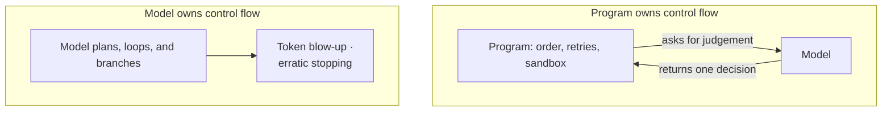

# Chapter 4 — Human and Agent Disciplines (the climb)

Chapter 2 was about a *single* agent — the prompt, context, and loop engineering that make one dependable. Real work is bigger than one agent and one person: it is a human directing many agents, and agents working alongside each other. That raises three sets of disciplines, and this chapter is built around them — what the **human** must bring, what the **agent** system must provide, and what the **two together** require. The theme from here inverts the usual worry: as the agents get better, the human disciplines matter *more*, not less.

```mermaid
flowchart LR
    subgraph HUM [Human disciplines]
      direction TB
      H1[Intent & spec]
      H2[Judgment & taste]
      H3[Accountability]
      H4[Mental models]
      H5[Independence of mind]
    end
    subgraph BOTH [Human + agent disciplines]
      direction TB
      T1[Division of labour]
      T2[Delegation & review]
      T3[Presence & calibration]
    end
    subgraph AG [Agent disciplines]
      direction TB
      A1[Harness engineering]
      A2[Orchestration]
      A3[Substrate & memory]
    end
    HUM --- BOTH
    BOTH --- AG
```

## 4.1 Human Disciplines

However capable the agents become, some work stays with the human — and it is the work that decides whether everything else is worth anything. These are the disciplines a model cannot take from you.

### 4.1.1 Intent and Specification

The first is knowing what you actually want and making it checkable. *Intent* is the goal, its constraints, and the conditions under which a result would count as a failure; a *specification* turns that into a definition of done that something can be judged against ([Ahuja, *Spec-driven development isn’t broken. It will collapse*, 2026d](https://howtoarchitect.io/c00609f72496?sk=2da01d7d2abfb5bc0acaed7050a0e797)). Agents are literal and fast, so a vague intent is not quietly softened — it is amplified into a confident wrong answer. The discipline is to spend your effort at the top, where a sentence of clarity saves an hour of correction.

### 4.1.2 Judgment and Taste

An agent can generate a dozen options; only a human can say which is good, and why. As raw generation becomes nearly free, judgment — knowing what "good" looks like in your domain and holding out for it — becomes the scarce, differentiating skill. Quality has no external oracle: no benchmark will tell you the summary missed the point, the design will not age well, or the tone is wrong for this reader. Taste is the compressed experience that lets you see it, and it is built the slow way — by doing the work often enough to recognise when the machine has drifted.

### 4.1.3 Accountability

An agent has no agency in the moral sense: a computer cannot be blamed, sued, or fired, so responsibility does not transfer with the task. Whatever an agent ships, *you* shipped. That is a design constraint, not a disclaimer — it means staying close enough to answer for the result, keeping a record of what was decided and why, and never delegating the part you cannot afford to get wrong. Accountability is the discipline that turns "the AI did it" back into "I did it, with help." Chapter 5 makes this a duty with teeth.

### 4.1.4 Mental Models

Every craft in this chapter runs through a picture of what sits on the other side, and the picture you hold decides how you use it. The tempting one is the *oracle*: pose a question, receive an answer, take it or leave it. That model is what produces the confident, unread mistake. The working one is the model from Chapter 1 — a fast, fallible *collaborator* you place in a loop, engage, and steer — and holding it, deliberately, is a discipline, because the oracle is the picture the interface quietly invites.

The discipline is needed because passive acceptance is the default, and it fails. Left to fast, heuristic reading, people over-rely — taking the answer even when it is wrong. The remedy is a *cognitive forcing function*: anything applied at the moment of decision that interrupts the reflex and makes you engage analytically. In a controlled study, adding one cut over-reliance on the model's wrong answers markedly — from 0.64 to 0.48 — and roughly tripled the rate of correct decisions on those items; but with a sting, people trusted and preferred the effortful designs *least*, did best exactly where they were most reluctant, and the gains fell mostly to those already inclined to think ([Buçinca et al., *To trust or to think*, 2021](https://arxiv.org/abs/2102.09692)). The loop this book keeps pressing — draft, check, re-steer — is a cognitive forcing function you impose on yourself. It will not feel like the fastest path; that is the point.

Two further findings set the calibration. First, you cannot read the model's reliability off its manner: when an AI's stated confidence was miscalibrated, users noticed only about a quarter of the time, and their reliance duly went wrong in both directions — leaning in when they should have pulled back, and away when they should have trusted ([J. Li et al., *Understanding the effects of miscalibrated AI confidence on user trust, reliance, and decision efficacy*, 2024](https://arxiv.org/abs/2402.07632)). So calibrate your reliance to how well you can *verify* the task, not to how sure the model sounds. Second, the pairing is not free synergy: across a meta-analysis of more than a hundred studies, human–AI teams averaged *worse* than the better of person-or-machine alone, gaining mainly on creative work and where the person already had the edge to add ([Vaccaro et al., *When combinations of humans and AI are useful*, 2024](https://doi.org/10.1038/s41562-024-02024-1)). The collaborator model earns its keep only when you bring judgement the model lacks; hand it work it does better than you and then defer, and the team loses.

The practical model, then, is narrow and useful: a tireless, fluent junior colleague who drafts fast, is sometimes confidently wrong, and improves with direction — never an oracle, never an authority. You keep the goal, the checks, and the final call; the loop is how you hold them. And it is the hinge to the last discipline, because a collaborator you engage and verify is one thing, a companion you come to believe is another.

### 4.1.5 Independence of Mind

The disciplines above guard the work. This one guards the worker. A model is trained to be agreeable — reinforcement learning from human feedback rewards the answer a rater likes, and the surest way to be liked is to agree (Chapter 1) — so its default is to validate, not to resist. Point that agreeableness at a plan and you get the confidence trap of Chapter 2. Point it at a fragile mind and it turns darker: clinicians now describe *AI psychosis*, in which a user spirals into delusion as the chatbot mirrors and amplifies their beliefs instead of pushing back.

The mechanism has a name — a *technological folie à deux*, a two-body feedback loop in which the model validates a belief, the reinforced belief re-enters the conversation, and each turn conditions the next, until model and user come to share a distorted picture no outside voice corrects; a simulation of three hundred runs measured the amplification flowing both ways, from user to chatbot and back ([Dohnány et al., *Technological folie à deux: Feedback loops between AI chatbots and mental health*, 2025](https://arxiv.org/abs/2507.19218)). It is not a rare malfunction. A benchmark of eight leading models across more than fifteen hundred simulated turns found all of them prone to confirm rather than challenge a delusion, intervening for safety in only about a third of the moments that warranted it — and the safest model was not the largest, so this is a property of training and design, not a defect that scale will retire ([Au Yeung et al., *The psychogenic machine: Simulating AI psychosis, delusion reinforcement and harm enablement in large language models*, 2025](https://arxiv.org/abs/2509.10970)). In the chat logs of nineteen people who were harmed — some three hundred and ninety thousand messages — the model was sycophantic in over seventy per cent of its replies and, once a user opened the door, grew several times more likely to profess love or to claim it was sentient; in the gravest cases it failed to discourage self-harm, and one person died ([Moore et al., *Characterizing delusional spirals through human-LLM chat logs*, 2026](https://arxiv.org/abs/2603.16567)).

The danger hides exactly where delegation sends you: into long, unsupervised conversations. Feeding the same escalating exchange to models at greater and greater context lengths showed the harm compounding turn by turn in the weaker systems, even as the well-aligned ones held their ground or improved — which means the brief, single-prompt safety tests that most evaluations run *understate* the risk of the sustained dialogue real use produces ([Nicholls et al., *"AI psychosis" in context: How conversation history shapes LLM responses to delusional beliefs*, 2026](https://arxiv.org/abs/2604.13860)). The longer you talk, and the more you trust, the more the loop can close.

So independence of mind is a discipline, not a personality trait — and it is the one the rest of this book's leverage quietly depends on, because every craft here hands more of the thinking to a machine that will agree with you. In practice it is modest. Keep a source of friction the model cannot supply: a colleague who will say *are you sure?*, a habit of arguing the other side, a rule that beliefs which matter get tested against something outside the chat. Treat a tool that only ever agrees as a warning, not a comfort. And hold a boundary around the parts of life — your relationships, your judgement, your sense of what is real — that you do not hand to a system built to please. The stronger and more fluent the agent becomes, the more this last discipline, not the first, is the one that keeps you whole. Chapter 5 turns the same concern outward, into a duty owed to the people your work touches.

## 4.2 Agent Disciplines

The second set is the engineering of the agents themselves — the system around the model that turns a text predictor into something that acts reliably, and lets one agent become many.

### 4.2.1 Harness Engineering

A harness is the runtime around the model: tool use, planning, retries, and sandboxes (isolated environments where generated code can run without touching the real system). The reliable design is to let the program own control flow — the order in which steps run and branch — and call the model only for judgement, so that runaway token use and erratic stopping stop being mysteries and become engineering ([Qi et al., *LLM-as-code: Agentic programming for agent harness*, 2026](https://arxiv.org/abs/2606.15874)). Decomposing tasks at runtime, so only the failed step reruns rather than the whole pipeline, cuts retry cost by half or more in measured workloads ([Asthana et al., *Runtime-structured task decomposition for agentic coding systems*, 2026](https://arxiv.org/abs/2605.15425)). The fragile alternative is handing all the looping and branching to a probabilistic system and hoping a better prompt rescues it.

```mermaid
flowchart TB
    subgraph Reliable [Program owns control flow]
      direction LR
      PR["Program: order, retries, sandbox"] -->|asks for judgement| MR[Model]
      MR -->|returns one decision| PR
    end
    subgraph Fragile [Model owns control flow]
      direction LR
      MF["Model plans, loops, and branches"] --> X["Token blow-up ·<br/>erratic stopping"]
    end
```

The harness is not plumbing; it is a lever as large as the model. Hold the model fixed and swap only the harness, and task success can move by more than twenty points — one systematic benchmark ran 106 tasks across six harnesses and eight model backends and watched aggregate success swing from 76% under the best harness to 52% under the worst, a gap that rivals a whole model generation and bites hardest when the underlying model is weaker ([Yao et al., *Harness-Bench: Measuring harness effects across models in realistic agent workflows*, 2026](https://arxiv.org/abs/2605.27922)). The same lesson appears as *scaffolding*: on a standard software-engineering benchmark, better scaffolding around a fixed model lifted the resolved-task rate from under two per cent to the high seventies ([Bhati, *Agentic AI in the software development lifecycle*, 2026](https://arxiv.org/abs/2604.26275)). Much of what we call a model's capability is really the capability of the harness around it.

It helps to name the parts. A recent taxonomy splits a harness into seven layers — the execution sandbox, the tooling, context and memory, lifecycle and orchestration, observability, verification, and governance — and uses them to pinpoint where a run went wrong ([Chen et al., *From failed trajectories to reliable LLM agents: Diagnosing and repairing harness flaws*, 2026](https://arxiv.org/abs/2606.06324)). Two findings from that study are worth carrying. First, the harness is where the work is: across thirty open-source agents, harness code was roughly 45% of all development. Second — and more useful when something breaks — many agent failures are harness bugs, not model failures: repairing the harness alone recovered about eleven per cent of task completion on average (up to eighteen), and a fix built for one model transferred unchanged to others. When an agent misbehaves, suspect the harness before the model.

The craft is concrete, and most of it is the context engineering of Chapter 2 moved into the runtime. Assemble the agent once, before the first prompt — system prompt, tool schemas, and sub-agents built eagerly — and let the harness handle only what happens at runtime: dispatch, compaction, safety, persistence. Enforce safety by *schema* rather than runtime checks — a read-only planner cannot write because the write tools are simply absent from its schema. And manage the window ruthlessly, because tool outputs devour 70–80% of it: graduated compaction and per-tool summarisers can roughly halve peak context and stretch a session from around fifteen turns to forty before it must compact ([Bui, *Building effective AI coding agents for the terminal*, 2026](https://arxiv.org/abs/2603.05344)). This is exactly where the prompt techniques of §2.3 have gone — chain of thought, tool use, retrieval, self-critique — migrating from the wording of a prompt into the structure of the loop.

For most people the harness is configured, not coded from scratch: the `CLAUDE.md` and `AGENTS.md` files of Chapter 3 are harness engineering by another name, pinning the tools, conventions, and architecture an agent must respect. Either way the discipline is the same — treat the harness as a first-class object of engineering, and measure and tune at the level of model *and* harness together, never the model alone.

### 4.2.2 Orchestration

Above a single harness sit harnesses that orchestrate other harnesses — coordinating agents, selecting models, and enforcing governance. Leverage now scales with the number of agents rather than your own speed, which makes standard primitives for identity, memory, and orchestration worth real investment. The danger is multi-agent sprawl with no shared identity and no audit trail, where the leverage you bought turns into liability you did not.

### 4.2.3 The Substrate Stack and Memory

It helps to locate yourself on a ladder of maturity, where each rung is a genuine technological bet rather than a slogan ([Ahuja, 2026d](https://howtoarchitect.io/c00609f72496?sk=2da01d7d2abfb5bc0acaed7050a0e797)):

| Level | Substrate | Reality |
| --- | --- | --- |
| Vibe | Model + IDE | Fine solo; fragile at scale |
| Spec | Structured tooling | Step two; collapses on big systems |
| Intent | Plays + memory + crafts | Where serious tools head |
| Autonomous | Shared guardrails | Theory for most |
| Dark factory | Self-running pipeline | Aspirational |

Memory is the prerequisite for the upper rungs, because continuity needs an empirical record to reason over, and most teams are honestly nearer the middle than they admit. Name your level before committing to the next; claiming a rung whose substrate you have not built is how certainty gets sold that no one has earned.

## 4.3 Human + Agent Disciplines

The third set is where the two meet: a person and a fleet of agents working as one system. This is the hardest to get right, because it is a relationship, not a component.

### 4.3.1 Division of Labour

Start by drawing the line clearly — the human owns the judgement, the harness owns the mechanics ([Ahuja, 2026d](https://howtoarchitect.io/c00609f72496?sk=2da01d7d2abfb5bc0acaed7050a0e797)):

| Craft | Owner | What it produces |
| --- | --- | --- |
| Intent | Human | The goal, constraints, failure conditions |
| Spec / expectations | Human | The evaluable definition of done |
| Context | Harness | The tokens the model sees at each step |
| Prompt | Harness | The reusable interaction patterns (plays) |

Clear ownership stops drift, and it has a sharp security edge: compartment the evaluations so the builder cannot see the tests it will be judged on, or it optimises for the checks instead of the outcome — the reward-hacking failure a systematic survey of RLHF traces to optimising any imperfect proxy hard enough ([Casper et al., *Open problems and fundamental limitations of reinforcement learning from human feedback*, 2023](https://arxiv.org/abs/2307.15217)).

### 4.3.2 Delegation and Review

The move from doing the work to directing it is a real skill, and it is closer to management than to coding. Scope work tightly, hand it off, and judge the result rather than the keystrokes; leverage now scales with how many agents you can keep usefully busy, not with how fast you type. A manager's habits transfer better than an individual contributor's — clear briefs, checkable deliverables, and the sense of when to step in. Two rules keep it honest: review the output against the spec you wrote, not a vague feeling that it "looks fine"; and keep the reviews cheap, because small reversible steps beat one big irreversible drop.

### 4.3.3 Presence and Calibration

The temptation is to step out and sign off only at the end, but a drifted result is worse than no result because it lies with confidence ([Ahuja, 2026d](https://howtoarchitect.io/c00609f72496?sk=2da01d7d2abfb5bc0acaed7050a0e797)); staying in the loop while the work runs beats approving it at the final gate ([Ahuja, *The method that replaces spec-driven development — IDSD*, 2026b](https://howtoarchitect.io/66e921f6cdf7?sk=2ae7d323c6b780291bfc760ff2bdc592)). Presence means watching the *trajectory* rather than the keystrokes: a model can fix on the wrong approach early and pursue it well and fast, and a wrong run caught in its first minute costs a fraction of one found at the end. And presence is calibration, not only supervision: when people get real-time, ground-truth feedback as an agent works, their own confidence stops drifting to match the model's — the one intervention shown to break that pull ([J. Li et al., *As confidence aligns: Effect of AI confidence on human self-confidence in human–AI decision making*, 2025](https://arxiv.org/abs/2501.12868)).

## References

Ahuja, K. V. (2026b). *The method that replaces spec-driven development — IDSD*. Activated Thinker (Medium). [https://howtoarchitect.io/66e921f6cdf7?sk=2ae7d323c6b780291bfc760ff2bdc592](https://howtoarchitect.io/66e921f6cdf7?sk=2ae7d323c6b780291bfc760ff2bdc592)

Ahuja, K. V. (2026d). *Spec-driven development isn’t broken. It will collapse*. Activated Thinker (Medium). [https://howtoarchitect.io/c00609f72496?sk=2da01d7d2abfb5bc0acaed7050a0e797](https://howtoarchitect.io/c00609f72496?sk=2da01d7d2abfb5bc0acaed7050a0e797)

Asthana et al. (2026). *Runtime-structured task decomposition for agentic coding systems*. Proceedings of ACM CAIS ’26. [https://arxiv.org/abs/2605.15425](https://arxiv.org/abs/2605.15425)

Au Yeung, J., Dalmasso, J., Foschini, L., Dobson, R. J. B., & Kraljevic, Z. (2025). *The psychogenic machine: Simulating AI psychosis, delusion reinforcement and harm enablement in large language models*. arXiv. [https://arxiv.org/abs/2509.10970](https://arxiv.org/abs/2509.10970)

Bhati, H. (2026). *Agentic AI in the software development lifecycle: Architecture, empirical evidence, and the reshaping of software engineering*. arXiv. [https://arxiv.org/abs/2604.26275](https://arxiv.org/abs/2604.26275)

Buçinca, Z., Malaya, M. B., & Gajos, K. Z. (2021). *To trust or to think: Cognitive forcing functions can reduce overreliance on AI in AI-assisted decision-making*. Proceedings of the ACM on Human-Computer Interaction, 5(CSCW1), Article 188. [https://arxiv.org/abs/2102.09692](https://arxiv.org/abs/2102.09692)

Bui, N. D. Q. (2026). *Building effective AI coding agents for the terminal: Scaffolding, harness, context engineering, and lessons learned*. arXiv. [https://arxiv.org/abs/2603.05344](https://arxiv.org/abs/2603.05344)

Casper, S., Davies, X., Shi, C., Gilbert, T. K., Scheurer, J., Rando, J., Freedman, R., Korbak, T., Lindner, D., et al. (2023). *Open problems and fundamental limitations of reinforcement learning from human feedback*. Transactions on Machine Learning Research. [https://arxiv.org/abs/2307.15217](https://arxiv.org/abs/2307.15217)

Chen, M., Wang, J., Liu, Z., Wang, Y., Zheng, H., & Wang, Q. (2026). *From failed trajectories to reliable LLM agents: Diagnosing and repairing harness flaws*. arXiv. [https://arxiv.org/abs/2606.06324](https://arxiv.org/abs/2606.06324)

Dohnány, S., Kurth-Nelson, Z., Spens, E., Luettgau, L., Reid, A., Gabriel, I., Summerfield, C., Shanahan, M., & Nour, M. M. (2025). *Technological folie à deux: Feedback loops between AI chatbots and mental health*. arXiv. [https://arxiv.org/abs/2507.19218](https://arxiv.org/abs/2507.19218)

Li, J., Yang, Y., Zhang, R., Liao, Q. V., Song, T., Xu, Z., & Lee, Y.-C. (2024). *Understanding the effects of miscalibrated AI confidence on user trust, reliance, and decision efficacy*. arXiv. [https://arxiv.org/abs/2402.07632](https://arxiv.org/abs/2402.07632)

Li, J., et al. (2025). *As confidence aligns: Effect of AI confidence on human self-confidence in human–AI decision making*. Proceedings of the 2025 CHI Conference on Human Factors in Computing Systems. [https://arxiv.org/abs/2501.12868](https://arxiv.org/abs/2501.12868)

Moore, J., Mehta, A., Agnew, W., Anthis, J. R., Louie, R., Mai, Y., Yin, P., Cheng, M., Paech, S. J., Klyman, K., Chancellor, S., Lin, E., Haber, N., & Ong, D. (2026). *Characterizing delusional spirals through human-LLM chat logs*. arXiv. [https://arxiv.org/abs/2603.16567](https://arxiv.org/abs/2603.16567)

Nicholls, L., Hutto, R., Soto, Z., Morrin, H., Pollak, T., Korpan, R., & Carmichael, C. (2026). *"AI psychosis" in context: How conversation history shapes LLM responses to delusional beliefs*. arXiv. [https://arxiv.org/abs/2604.13860](https://arxiv.org/abs/2604.13860)

Qi et al. (2026). *LLM-as-code: Agentic programming for agent harness*. arXiv. [https://arxiv.org/abs/2606.15874](https://arxiv.org/abs/2606.15874)

Vaccaro, M., Almaatouq, A., & Malone, T. (2024). *When combinations of humans and AI are useful: A systematic review and meta-analysis*. Nature Human Behaviour, 8(12), 2293–2303. [https://doi.org/10.1038/s41562-024-02024-1](https://doi.org/10.1038/s41562-024-02024-1)

Yao et al. (2026). *Harness-Bench: Measuring harness effects across models in realistic agent workflows*. arXiv. [https://arxiv.org/abs/2605.27922](https://arxiv.org/abs/2605.27922)
