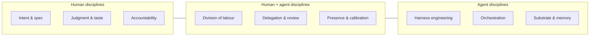
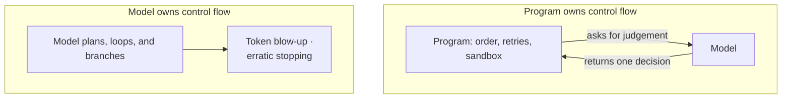

# Chapter 4 — Human and Agent Disciplines (the climb)

Chapter 2 was about a *single* agent — the prompt, context, and loop engineering that make one dependable. Real work is bigger than one agent and one person: it is a human directing many agents, and agents working alongside each other. That raises three sets of disciplines, and this chapter is built around them — what the **human** must bring, what the **agent** system must provide, and what the **two together** require. The theme from here inverts the usual worry: as the agents get better, the human disciplines matter *more*, not less.

```mermaid
flowchart LR
    subgraph HUM [Human disciplines]
      direction TB
      H1[Intent & spec]
      H2[Judgment & taste]
      H3[Accountability]
    end
    subgraph BOTH [Human + agent disciplines]
      direction TB
      T1[Division of labour]
      T2[Delegation & review]
      T3[Presence & calibration]
    end
    subgraph AG [Agent disciplines]
      direction TB
      A1[Harness engineering]
      A2[Orchestration]
      A3[Substrate & memory]
    end
    HUM --- BOTH
    BOTH --- AG
```

## 4.1 Human Disciplines

However capable the agents become, some work stays with the human — and it is the work that decides whether everything else is worth anything. These are the disciplines a model cannot take from you.

### 4.1.1 Intent and Specification

The first is knowing what you actually want and making it checkable. *Intent* is the goal, its constraints, and the conditions under which a result would count as a failure; a *specification* turns that into a definition of done that something can be judged against ([Ahuja, *Spec-driven development isn’t broken. It will collapse*, 2026d](https://howtoarchitect.io/c00609f72496?sk=2da01d7d2abfb5bc0acaed7050a0e797)). Agents are literal and fast, so a vague intent is not quietly softened — it is amplified into a confident wrong answer. The discipline is to spend your effort at the top, where a sentence of clarity saves an hour of correction.

### 4.1.2 Judgment and Taste

An agent can generate a dozen options; only a human can say which is good, and why. As raw generation becomes nearly free, judgment — knowing what "good" looks like in your domain and holding out for it — becomes the scarce, differentiating skill. Quality has no external oracle: no benchmark will tell you the summary missed the point, the design will not age well, or the tone is wrong for this reader. Taste is the compressed experience that lets you see it, and it is built the slow way — by doing the work often enough to recognise when the machine has drifted.

### 4.1.3 Accountability

An agent has no agency in the moral sense: a computer cannot be blamed, sued, or fired, so responsibility does not transfer with the task. Whatever an agent ships, *you* shipped. That is a design constraint, not a disclaimer — it means staying close enough to answer for the result, keeping a record of what was decided and why, and never delegating the part you cannot afford to get wrong. Accountability is the discipline that turns "the AI did it" back into "I did it, with help." Chapter 5 makes this a duty with teeth.

## 4.2 Agent Disciplines

The second set is the engineering of the agents themselves — the system around the model that turns a text predictor into something that acts reliably, and lets one agent become many.

### 4.2.1 Harness Engineering

A harness is the runtime around the model: tool use, planning, retries, and sandboxes (isolated environments where generated code can run without touching the real system). The reliable design is to let the program own control flow — the order in which steps run and branch — and call the model only for judgement, so that runaway token use and erratic stopping stop being mysteries and become engineering ([Qi et al., *LLM-as-code: Agentic programming for agent harness*, 2026](https://arxiv.org/abs/2606.15874)). Decomposing tasks at runtime, so only the failed step reruns rather than the whole pipeline, cuts retry cost by half or more in measured workloads ([Asthana et al., *Runtime-structured task decomposition for agentic coding systems*, 2026](https://arxiv.org/abs/2605.15425)). The fragile alternative is handing all the looping and branching to a probabilistic system and hoping a better prompt rescues it.

```mermaid
flowchart TB
    subgraph Reliable [Program owns control flow]
      direction LR
      PR["Program: order, retries, sandbox"] -->|asks for judgement| MR[Model]
      MR -->|returns one decision| PR
    end
    subgraph Fragile [Model owns control flow]
      direction LR
      MF["Model plans, loops, and branches"] --> X["Token blow-up ·<br/>erratic stopping"]
    end
```

### 4.2.2 Orchestration

Above a single harness sit harnesses that orchestrate other harnesses — coordinating agents, selecting models, and enforcing governance. Leverage now scales with the number of agents rather than your own speed, which makes standard primitives for identity, memory, and orchestration worth real investment. The danger is multi-agent sprawl with no shared identity and no audit trail, where the leverage you bought turns into liability you did not.

### 4.2.3 The Substrate Stack and Memory

It helps to locate yourself on a ladder of maturity, where each rung is a genuine technological bet rather than a slogan ([Ahuja, 2026d](https://howtoarchitect.io/c00609f72496?sk=2da01d7d2abfb5bc0acaed7050a0e797)):

| Level | Substrate | Reality |
| --- | --- | --- |
| Vibe | Model + IDE | Fine solo; fragile at scale |
| Spec | Structured tooling | Step two; collapses on big systems |
| Intent | Plays + memory + crafts | Where serious tools head |
| Autonomous | Shared guardrails | Theory for most |
| Dark factory | Self-running pipeline | Aspirational |

Memory is the prerequisite for the upper rungs, because continuity needs an empirical record to reason over, and most teams are honestly nearer the middle than they admit. Name your level before committing to the next; claiming a rung whose substrate you have not built is how certainty gets sold that no one has earned.

## 4.3 Human + Agent Disciplines

The third set is where the two meet: a person and a fleet of agents working as one system. This is the hardest to get right, because it is a relationship, not a component.

### 4.3.1 Division of Labour

Start by drawing the line clearly — the human owns the judgement, the harness owns the mechanics ([Ahuja, 2026d](https://howtoarchitect.io/c00609f72496?sk=2da01d7d2abfb5bc0acaed7050a0e797)):

| Craft | Owner | What it produces |
| --- | --- | --- |
| Intent | Human | The goal, constraints, failure conditions |
| Spec / expectations | Human | The evaluable definition of done |
| Context | Harness | The tokens the model sees at each step |
| Prompt | Harness | The reusable interaction patterns (plays) |

Clear ownership stops drift, and it has a sharp security edge: compartment the evaluations so the builder cannot see the tests it will be judged on, or it optimises for the checks instead of the outcome — the reward-hacking failure a systematic survey of RLHF traces to optimising any imperfect proxy hard enough ([Casper et al., *Open problems and fundamental limitations of reinforcement learning from human feedback*, 2023](https://arxiv.org/abs/2307.15217)).

### 4.3.2 Delegation and Review

The move from doing the work to directing it is a real skill, and it is closer to management than to coding. Scope work tightly, hand it off, and judge the result rather than the keystrokes; leverage now scales with how many agents you can keep usefully busy, not with how fast you type. A manager's habits transfer better than an individual contributor's — clear briefs, checkable deliverables, and the sense of when to step in. Two rules keep it honest: review the output against the spec you wrote, not a vague feeling that it "looks fine"; and keep the reviews cheap, because small reversible steps beat one big irreversible drop.

### 4.3.3 Presence and Calibration

The temptation is to step out and sign off only at the end, but a drifted result is worse than no result because it lies with confidence ([Ahuja, 2026d](https://howtoarchitect.io/c00609f72496?sk=2da01d7d2abfb5bc0acaed7050a0e797)); staying in the loop while the work runs beats approving it at the final gate ([Ahuja, *The method that replaces spec-driven development — IDSD*, 2026b](https://howtoarchitect.io/66e921f6cdf7?sk=2ae7d323c6b780291bfc760ff2bdc592)). Presence means watching the *trajectory* rather than the keystrokes: a model can fix on the wrong approach early and pursue it well and fast, and a wrong run caught in its first minute costs a fraction of one found at the end. And presence is calibration, not only supervision: when people get real-time, ground-truth feedback as an agent works, their own confidence stops drifting to match the model's — the one intervention shown to break that pull ([J. Li et al., *As confidence aligns: Effect of AI confidence on human self-confidence in human–AI decision making*, 2025](https://arxiv.org/abs/2501.12868)).

## References

Ahuja, K. V. (2026b). *The method that replaces spec-driven development — IDSD*. Activated Thinker (Medium). [https://howtoarchitect.io/66e921f6cdf7?sk=2ae7d323c6b780291bfc760ff2bdc592](https://howtoarchitect.io/66e921f6cdf7?sk=2ae7d323c6b780291bfc760ff2bdc592)

Ahuja, K. V. (2026d). *Spec-driven development isn’t broken. It will collapse*. Activated Thinker (Medium). [https://howtoarchitect.io/c00609f72496?sk=2da01d7d2abfb5bc0acaed7050a0e797](https://howtoarchitect.io/c00609f72496?sk=2da01d7d2abfb5bc0acaed7050a0e797)

Asthana et al. (2026). *Runtime-structured task decomposition for agentic coding systems*. Proceedings of ACM CAIS ’26. [https://arxiv.org/abs/2605.15425](https://arxiv.org/abs/2605.15425)

Casper, S., Davies, X., Shi, C., Gilbert, T. K., Scheurer, J., Rando, J., Freedman, R., Korbak, T., Lindner, D., et al. (2023). *Open problems and fundamental limitations of reinforcement learning from human feedback*. Transactions on Machine Learning Research. [https://arxiv.org/abs/2307.15217](https://arxiv.org/abs/2307.15217)

Li, J., et al. (2025). *As confidence aligns: Effect of AI confidence on human self-confidence in human–AI decision making*. Proceedings of the 2025 CHI Conference on Human Factors in Computing Systems. [https://arxiv.org/abs/2501.12868](https://arxiv.org/abs/2501.12868)

Qi et al. (2026). *LLM-as-code: Agentic programming for agent harness*. arXiv. [https://arxiv.org/abs/2606.15874](https://arxiv.org/abs/2606.15874)
