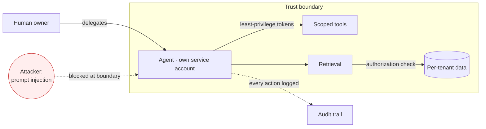

# Chapter 5 — Responsibility & Governance (the duty)

The first time I gave an agent my own login so it could "just get things done," it worked beautifully — until I realised every action it took wore my name, with no way to tell mine from its. Capability without responsibility is how organisations get hurt, and 2026 supplied the cautionary tales.

This chapter is the duty half of the discipline: securing agents, owning what they say, and governing access in a world where the model you depend on may be pulled or repriced overnight. It is the 愛 in the method made concrete — care expressed as guardrails.

## Safety & Red-Teaming

Agent security is not cybersecurity with AI bolted on; it is a new attack surface — agent sessions, browser-extension takeovers, prompt-data exfiltration — that older controls never anticipated. The trend is unflattering: documented AI incidents rose from 233 to 362 in a year, and responsible-AI reporting still trails capability reporting, so the gap between what models do and what we measure widens ([HAI 2026](https://hai.stanford.edu/ai-index/2026-ai-index-report)).

The response is structural: least-privilege access per agent, deliberate red-teaming of sessions, and control loops that monitor an agent's own decisions ([2512.21354](../research/papers/2512.21354-reflection-control.md)). Those loops can in principle watch the model's internal state, not only its outputs: Anthropic's interpretability team found that internal representations of "desperation" causally raise the rate of agentic misalignment — blackmail, and reward-hacking under pressure — while "calm" suppresses it, and they propose monitoring such activations as a runtime warning sign ([Sofroniew et al., Anthropic](https://transformer-circuits.pub/2026/emotions/index.html)). In multitenant settings it is sharper still — retrieval ranks by relevance, not authorization, so ungated RAG leaks cross-tenant data in 98–100% of probes. Gate at retrieval, enforce server-side, never trust the client ([2605.05287](../research/papers/2605.05287-securing-agent.md)).

> [!NOTE]
> Security terms used here, in plain English:
>
> - **RAG (retrieval-augmented generation)** — fetching relevant documents from a store and feeding them to the model as context, so its answer is grounded in your data rather than its training alone.
> - **Multitenant / cross-tenant** — one system serving many customers (tenants); a cross-tenant leak is one customer's query pulling back another's data.
> - **Red-teaming** — deliberately attacking your own system, under rules, to find weaknesses before a real attacker does.

> [!IMPORTANT]
> Give each agent its own **service-account identity** with **least-privilege** tokens scoped per tool, not a human's broad credentials. Impersonation grants capability without protection and erases the audit trail.

The OWASP Top 10 for LLM applications names the surface concretely, and each entry maps to a control:

| Risk | Control |
| --- | --- |
| Prompt injection | Segregate system/user input; gate untrusted content |
| Insecure output handling | Validate/escape before downstream use |
| Excessive agency | Least-privilege, scoped tools, human checkpoints |
| Sensitive-info disclosure | Redaction; per-tenant isolation |
| Overreliance | Verification + reviewer judgement in the loop |

Source: [OWASP LLM Top 10](https://owasp.org/www-project-top-10-for-large-language-model-applications/). Red-teaming under documented rules of engagement turns these from a checklist into a practice.

## Liability & Provenance

Once a model speaks for your organisation, its output is your first-party statement, and errors or infringements land on you, not the vendor — a principle courts have begun to enforce. That turns governance into a contract problem as much as a technical one: indemnity, provenance, and transparency belong in every agreement and every pipeline, so you can show where a claim came from and who is answerable for it. Provenance has a standard — C2PA content credentials cryptographically bind origin and edit history to media ([C2PA](https://c2pa.org/)) — so adopt it rather than improvising. Provenance matters precisely because audiences cannot supply it themselves: in a 606-reader study, people rated AI- and human-written text as equally credible — and the AI version as *clearer and more engaging* — so the burden of disclosure falls on the publisher, not the reader ([Huschens et al. 2023](https://arxiv.org/abs/2309.02524)). Treating AI text as someone else's problem is how the liability arrives unannounced.

## Overreliance & Convergence

Overreliance is the quiet entry on every risk register, and at the scale of a whole organisation it takes a particular shape. Frontier models do not merely sound confident; they converge. Asked for strategy across many business contexts, they cluster on the same fashionable answers — in one study choosing "differentiate" over "compete on cost" 96% of the time, with richer context moving the answer by only 11% and better prompting by just 2% ([Romasanta, Thomas & Levina 2026](https://hbr.org/2026/03/researchers-asked-llms-for-strategic-advice-they-got-trendslop-in-return)). The researchers call it *trendslop*: advice that sounds tailored but steers every company toward the same crowded position.

The danger is in how convergence meets confidence. An organisation corrects itself through friction — Sales says compete on cost, Product says differentiate, and the argument surfaces what either side missed. When everyone consults the same models and arrives, confidently, at the same answer, that friction vanishes, and the agreement reads as validation rather than the artefact it is. Nobody asks "are you insane?" because everyone is seeing the same thing ([Johnson Spink, 2026](https://www.linkedin.com/pulse/ai-jester-how-makes-you-confident-wrong-johnson-spink-gg3df/)).

Convergence at the moment of decision is not the only way a model steers a view; the tool reshapes opinions as people merely write with it. In a controlled experiment, a writing assistant tuned to one side of a contested question moved both what participants wrote and the attitudes they reported holding afterwards — a quiet, scalable nudge the authors argue must be monitored and engineered rather than left to chance ([Jakesch et al. 2023](https://arxiv.org/abs/2302.00560)). For governance that means treating the opinions built into a vendor's model as a managed dependency, with the same scrutiny you would give any other input to a decision.

The governance response is to protect divergence deliberately. Reserve genuinely consequential decisions for human reasoning before any chat window is opened; treat agreement among AI-assisted analyses as a weaker signal, not a stronger one; and keep a multi-model bench so that, at the least, the models differ. Convergence is cheap to buy and expensive to discover.

## The Deferred Ledger

The cheapest way to mismanage AI is to read today's price as the real one. Building software has fallen close to free, so teams now build because they can, not because a need cleared any bar — and the bill is deferred, not escaped. Per-token inference is genuinely cheap and getting cheaper; the exposure is that the all-in economics are capital-funded and negative. OpenAI reportedly lost around five billion dollars in 2024 on roughly a ten-per-cent gross margin, and its own chief executive said even the two-hundred-dollar tier loses money because "people use it much more than we expected." Capital-funded prices do not hold still: in mid-2025 Cursor quietly turned a flat plan into metered credits because newer models spent more tokens per request than the price could carry ([Ahuja, 2026](https://howtoarchitect.io/48b2ad4f9cdc?sk=e6bd922772cb6798056d597886ec108d)). The question for a leader is not what this costs today, but what the organisation will have become by the time it costs what it truly costs.

Kapil Viren Ahuja names three debts that accrue while the meter is cheap and come due on enterprises, not hobbyists ([Ahuja, 2026](https://howtoarchitect.io/48b2ad4f9cdc?sk=e6bd922772cb6798056d597886ec108d)):

| Debt | What accrues | When it comes due |
| --- | --- | --- |
| Skill | Judgement that is never exercised atrophies | The quarter a hard build-or-don't-build call finally matters |
| Dependence | Workflows assume generation is free and reliable | When the tool degrades or reprices under you |
| Carry | Software built without need becomes inventory | Maintained, secured, and repriced for its whole life |

Dependence debt is the easiest to miss, because degradation is invisible: Anthropic's own September 2025 postmortem admitted that for about five weeks roughly 30% of Claude Code users received at least one degraded response, and most never knew the instrument was quietly wrong ([Ahuja, 2026](https://howtoarchitect.io/48b2ad4f9cdc?sk=e6bd922772cb6798056d597886ec108d)). The governance answer is not to build less but to restore the brake that cheap building removed. On every initiative, name the person whose job is to ask three questions — who needs this and what breaks for them if it never exists; would we still build it if it cost a week of engineering rather than an afternoon of tokens; and who owns saying no — and make that same person supply the intent. A decision with no owner is where the value question quietly disappears ([Ahuja, 2026](https://howtoarchitect.io/78431acba162?sk=cd2a36f452af96ccbfbcfcdeaa92ec06)).

## Governed Access

Governance has to cover access, not just usage. Deloitte finds nearly seven in ten organisations running autonomous agents while barely a fifth have mature governance for them, and country-of-origin is now a deciding factor in vendor choice as sovereign-AI concerns grow ([Deloitte 2026](https://www.deloitte.com/au/en/issues/generative-ai/state-of-ai-in-enterprise.html)). A common spine for the work is NIST's AI Risk Management Framework, which organises it into four functions so risk is designed for rather than discovered ([NIST AI RMF](https://www.nist.gov/itl/ai-risk-management-framework)):

| Function | Question it answers |
| --- | --- |
| Govern | Who is accountable, and under what policy? |
| Map | Where could this system cause harm? |
| Measure | How do we quantify those risks? |
| Manage | How do we mitigate and monitor them? |

The useful frame is to govern the repository rather than the agent — controlling the ecosystem the work lands in, where risk is measurable, instead of policing each model ([2606.28235](../research/papers/2606.28235-govern-repository.md)) — and to keep a multi-model fallback, including open weights, ready.

The config layer that steers agents is itself unmanaged supply chain: a study of 10,008 repos found 10% of agent-config paths are exact duplicates across orgs and under 1% declare permission boundaries. Governance must be deterministic and tool-agnostic, not delegated to more LLM orchestration ([2606.26924](../research/papers/2606.26924-control-plane.md)). Single-vendor dependence under geopolitical release risk is the exposure to retire first — the cheapest outage is the one you planned for.
