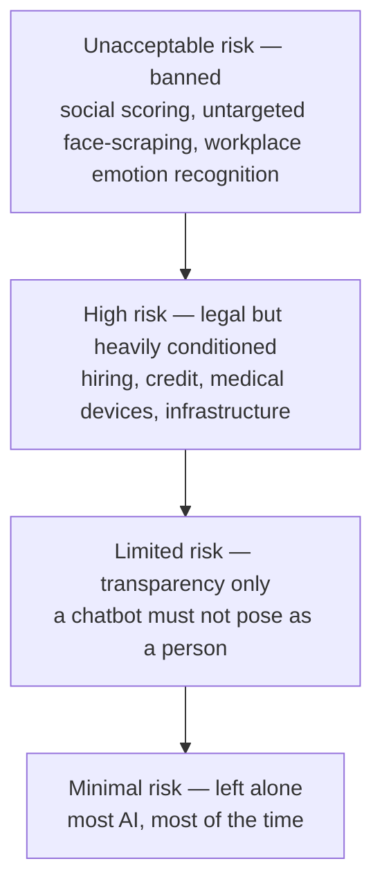
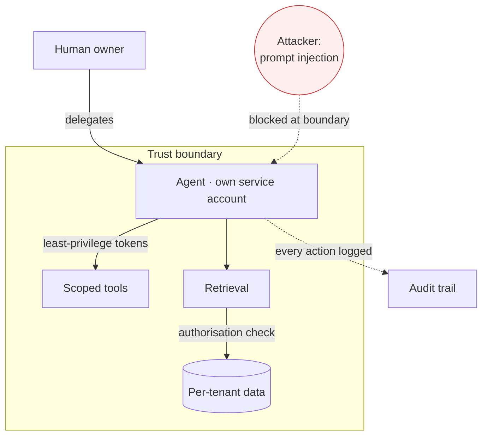

# Chapter 5 — Responsibility & Governance (the duty)

The citations in this chapter were gathered by agents, and it is worth telling you how. When a section needed evidence — what the EU AI Act actually requires, what a court actually ruled — I sent an agent to search and bring back candidates, and I chose which were worth having. Another agent fetched each approved source into the book's repository: the regulation's official page, the standard's catalogue entry, the court's sanctions order as filed. Another read each document and wrote a summary recording what it says and, just as important, what it *is* — a lab's announcement of its own safety policy flagged as self-reported, a consultancy's white paper flagged as marketing, a Chinese regulation flagged as an unofficial translation. Only after that did a claim enter the chapter, cited to the primary source. And at the end, a script checked that every citation in the text resolves to a real entry in the reference list, while any number the agents could not confirm on the source's own page was cut, however useful it would have been.

I describe the pipeline because it is this chapter in miniature. Every step of it is a governance mechanism wearing work clothes: provenance for each source, an audit trail from claim back to document, declared conflicts of interest, verification before use — and one person who stays answerable for what the book says, because the agents did the fetching and the reading, but the judgement about what to trust and the name on the cover stayed with me. Capability can be delegated; responsibility cannot. This chapter follows that principle through the whole chain, from the outside in: the labs that govern the models they build, the governments now writing AI into law around the world, the standards bodies turning those laws into things an auditor can check, the enterprise where agents actually run, and finally you — because every link in the chain ends at a person. It is the 愛 in the method made concrete: care expressed as guardrails.

## 5.1 Model Governance

Long before a model reaches your chat window, decisions were made about it that you never see. What is it allowed to become, and who checks? Whose writing did it learn from, and whose voice does it therefore treat as normal? And what can it be made to repeat back out of its training data? These are questions about the artefact itself, and they come before any question of who uses it or for what.

### 5.1.1 Safety Frameworks and Evaluations

Every frontier lab now publishes a safety framework: a document that says, in advance, what its models must not be capable of without new protections, and what the lab will do if a model starts getting there. The shape is an if-then promise. Anthropic's *Responsible Scaling Policy* — the oldest of the three, first written in 2023 and now in its third version — defines a ladder of AI Safety Levels and commits the company to specific safeguards the moment a model crosses a threshold ([Anthropic, *Responsible scaling policy, version 3.0*, 2026b](https://www.anthropic.com/news/responsible-scaling-policy-v3)). Writing the thresholds down early works the way a fire drill does: the decisions are made before the alarm, so nobody negotiates with themselves in the smoke. And the alarm has rung once already. In May 2025 Anthropic activated its ASL-3 safeguards for real, judging that its models were close enough to being useful for chemical- and biological-weapons work that the stricter protections had to switch on. The current policy also commits the company to publishing Risk Reports every three to six months, with external experts reviewing them in some circumstances.

OpenAI's *Preparedness Framework* makes the same promise with different furniture. It tracks the three capabilities the company judges most dangerous — biological and chemical, cybersecurity, and AI self-improvement — and defines the harm it is guarding against precisely: "severe harm" means the death or grave injury of thousands of people, or hundreds of billions of dollars of damage ([OpenAI, *Preparedness framework, version 2*, 2025](https://cdn.openai.com/pdf/18a02b5d-6b67-4cec-ab64-68cdfbddebcd/preparedness-framework-v2.pdf)). Two thresholds carry different obligations: a model that reaches *High* capability cannot be deployed until the risk is brought down, and one that reaches *Critical* must have safeguards in place during development itself, whether or not it ever ships. It is worth knowing who decides. An internal Safety Advisory Group weighs the evidence and recommends; company leadership — the chief executive or a designate — makes the call; and the framework says outright that the safety group "does not have the ability to 'filibuster'". In other words, the safety group advises, and the chief executive decides.

Google DeepMind's *Frontier Safety Framework* is built on the same pattern: "critical capability levels" at which a model could cause severe harm without mitigations, spanning misuse (weapons, cyber-offence, harmful manipulation), the automation of AI research itself, and the still-exploratory territory of misalignment ([Google DeepMind, *Frontier safety framework, version 3.0*, 2025](https://storage.googleapis.com/deepmind-media/DeepMind.com/Blog/strengthening-our-frontier-safety-framework/frontier-safety-framework_3.pdf)). Its distinctive contribution is *early-warning evaluations* with defined alert thresholds — tests tuned to fire before a model reaches a critical level rather than after it has passed one. External deployment is gated: no release until an internal governance body accepts a written safety case for each threshold the model has reached.

The three share a shape; laid side by side:

| Lab | Framework | Threshold concept | What it gates |
| --- | --- | --- | --- |
| Anthropic | Responsible Scaling Policy (2023–, v3) | AI Safety Levels (ASL) | Safeguards switch on at each level — ASL-3 activated for real in May 2025 |
| OpenAI | Preparedness Framework (v2) | *High* and *Critical* capability | *High* gates deployment; *Critical* gates development itself |
| Google DeepMind | Frontier Safety Framework (v3) | Critical capability levels, with early-warning alerts | Release gated on an accepted written safety case |

What do these evaluations actually test? DeepMind published its suite, and the categories are worth reading slowly: persuasion and deception (can the model talk a person into something against their interest); cyber-offence (can it find and exploit vulnerabilities); self-proliferation (could it acquire resources and copies of itself); and self-reasoning (does it understand its own situation well enough to work around its constraints) ([Phuong et al., *Evaluating frontier models for dangerous capabilities*, 2024](https://arxiv.org/abs/2403.13793)). Run against an early Gemini, the verdict was "no evidence of strong dangerous capabilities" — but "early warning signs". That is exactly the report you want from an early-warning system: nothing burning, alarms wired, and a stated goal of building a rigorous science of these tests before the models that need them arrive.

Now the caution, and it matters. All of this is homework the labs grade themselves. The frameworks are voluntary; the lab writes the thresholds, runs the evaluations, and decides what the results mean. OpenAI's framework contains a clause that shows exactly where the pressure sits: if a rival ships a High- or Critical-capability system without comparable safeguards, OpenAI may lower its own required safeguards in that area — publicly acknowledged, and staying more protective than the rival, but lowered all the same. The document names the danger it is flirting with: "a race to the bottom on safety." Anthropic's third revision, for its part, converted parts of its safety roadmap from binding commitments into "nonbinding but publicly-declared" goals. So the promises come with escape hatches built in. That is the case for bringing in an outsider: independent audit. We do not let companies audit their own accounts, and a coalition of some fifty researchers argues frontier AI should be treated the same way. They define *frontier AI auditing* as rigorous third-party verification of a developer's safety and security claims "based on deep, secure access to non-public information" — a very different thing from the black-box poking that passes for outside scrutiny today. They also sketch four assurance levels for regulators and labs to climb ([Brundage et al., *Frontier AI auditing: Toward rigorous third-party assessment of safety and security practices at leading AI companies*, 2026](https://arxiv.org/abs/2601.11699)). The difference matters, because a safety framework only tells you what the maker chose to promise. An audit would tell you what an outsider was able to confirm.

### 5.1.2 Fairness and Bias

A model can be safe by every test above and still be unfair, because bias arrives with the training data itself, and making the model bigger strengthens the pattern instead of diluting it. Emily Bender and colleagues made the argument early and bluntly: a large language model is a "stochastic parrot," stitching together linguistic form it has seen without any grasp of meaning, and the form it has seen is skewed ([Bender et al., *On the dangers of stochastic parrots: Can language models be too big?*, 2021](https://doi.org/10.1145/3442188.3445922)). The evidence is in the provenance of the text. GPT-2's training data came from pages linked on Reddit, whose US users in 2016 were 67% men and 64% aged 18 to 29; surveys of Wikipedia editors find only 8.8 to 15% are women. A model trained on that corpus learns whose voice counts as normal, and it is not everyone's.

The mechanism tells you where to intervene. You cannot audit bias out by reading a single accuracy number, because a system can be accurate on average and wrong for a particular group. The fix is to report performance broken apart. Margaret Mitchell and colleagues proposed *model cards*: short documents that state a model's intended use, its training data, and — the part that matters — its measured performance disaggregated by demographic group rather than pooled into one figure ([Mitchell et al., *Model cards for model reporting*, 2019](https://arxiv.org/abs/1810.03993)). Their worked example is a smile detector whose error rates sit in a tidy 0.04–0.14 band overall and still fail badly for one age or gender subgroup; the card is what makes that visible before release rather than after. Model cards are now routine — the labs and Hugging Face ship them — which is itself the lesson: disclosure became a norm once someone wrote the form down.

Documentation is only useful if something checks it. Inioluwa Deborah Raji and colleagues built that step into a process they call SMACTR — scoping, mapping, artifact collection, testing, reflection — an internal audit run *before* deployment, each stage producing evidence weighed against the organisation's stated principles ([Raji et al., *Closing the AI accountability gap: Defining an end-to-end framework for internal algorithmic auditing*, 2020](https://arxiv.org/abs/2001.00973)). They describe the work, approvingly, as boring, slow, and methodical: the opposite of the pace AI is usually built at — and that slowness is exactly why it catches what a rushed release misses. The honest tension, which Bender's group presses, is whether cards and audits can ever fully answer a problem that grows with scale. Treat cards and audits as the minimum the duty requires, not as proof that the problem is solved.

### 5.1.3 Privacy and Data Protection

The third question about the artefact is what it can leak, and the answer surprises most people: a model can recite its training data. Nicholas Carlini and colleagues showed that black-box query access — no peek inside the weights — is enough to pull verbatim text back out of GPT-2. From 1,800 generated candidates they confirmed over 600 as exact training examples, including real names, phone numbers, email addresses, and code, some of it present in only a single source document ([Carlini et al., *Extracting training data from large language models*, 2021](https://arxiv.org/abs/2012.07805)). Memorisation is not an edge case, and larger models memorise more.

Alignment does not close the hole. In 2023 Milad Nasr and colleagues extended the attack to production systems, extracting gigabytes from open models and, with a "divergence attack" — asking the model to repeat a word forever — making a live, aligned ChatGPT emit training data 150 times more often than usual ([Nasr et al., *Scalable extraction of training data from (production) language models*, 2023](https://arxiv.org/abs/2311.17035)). They recovered over 10,000 unique memorised examples for about two hundred dollars in queries, and estimated far more was reachable with a bigger budget. The lesson for anyone fine-tuning on their own documents is stark: a model trained on sensitive data is a channel through which that data can leak, and the alignment layer hides the leak without sealing it.

There is a real defence available, too. Xuechen Li and colleagues showed that differential privacy — training with carefully bounded, noised gradients so no single record leaves a fingerprint — need not wreck accuracy, provided you start from a large pretrained model and tune it well; their private models beat the prior state of the art at the same privacy budget ([X. Li et al., *Large language models can be strong differentially private learners*, 2022](https://arxiv.org/abs/2110.05679)). The cost is worth naming plainly: differential privacy protects rare, long-tailed records least, so the very examples that most identify a person are the ones it guards worst. The governance rules follow from the mechanism. Know what a model was trained on, keep genuinely sensitive data out of training or behind differential privacy, and treat any model exposed to private data as something to be tested for leakage rather than trusted by default.

## 5.2 The Emerging Case for AI Regulation

Everything in §5.1 is done — when it is done at all — voluntarily. The question governments have been answering, at different speeds and in different styles, is what should stop being voluntary. This section looks at why the pressure is building, what the first comprehensive law actually says, how the rest of the world is answering, and what the honest counter-argument costs.

### 5.2.1 The Pressures

The case for regulating AI is being assembled in public, incident by incident. Documented AI incidents rose from 233 to 362 in a year, and responsible-AI reporting still trails capability reporting, so the gap between what models do and what we measure widens ([Stanford HAI, *The AI index 2026 annual report*, 2026](https://hai.stanford.edu/ai-index/2026-ai-index-report)).

Liability is one pressure. Once a model speaks for your organisation, its output is your first-party statement, and errors or infringements land on you, not the vendor — a principle courts have begun to enforce. That turns governance into a contract problem as much as a technical one: indemnity, provenance, and transparency belong in every agreement and every pipeline, so you can show where a claim came from and who is answerable for it. Provenance has a standard — C2PA content credentials cryptographically bind origin and edit history to media ([C2PA, *Overview*, n.d.](https://c2pa.org/)) — so adopt it rather than improvising. And provenance matters precisely because readers cannot supply it for themselves: in a 606-reader study, people rated AI- and human-written text as equally credible, and found the AI version *clearer and more engaging* ([Huschens et al., *Do you trust ChatGPT? Perceived credibility of human and AI-generated content*, 2023](https://arxiv.org/abs/2309.02524)). If the reader cannot tell, the burden of disclosure has to sit with the publisher. If you publish AI text without checking it, you are carrying liability you have not noticed yet.

Forgery is another pressure, and it gets cheaper every year. A survey of deepfake generation and detection by Florinel-Alin Croitoru and colleagues reaches an uncomfortable conclusion: detectors trained on one generator's fakes fail to recognise another's, and diffusion-era media is both more realistic and more resistant to detection than what came before ([Croitoru et al., *Deepfake media generation and detection in the generative AI era: A survey and outlook*, 2024](https://arxiv.org/abs/2411.19537)). Detection is structurally one step behind generation, because every new generator is unfamiliar to the detectors built on the last one. That is the case for provenance over policing: you cannot reliably spot a fake after the fact, so bind authenticity at the source instead — sign what is genuine and carry the credential forward, which is what C2PA does.

### 5.2.2 Europe Writes the Template

The European Union wrote the first comprehensive answer. Its AI Act — Regulation (EU) 2024/1689, "the first-ever comprehensive legal framework on AI worldwide" in the Commission's own words — is easiest to picture as a pyramid of risk ([European Commission, *AI Act: Regulatory framework for AI*, 2024](https://digital-strategy.ec.europa.eu/en/policies/regulatory-framework-ai)). At the top, eight *unacceptable-risk* practices are simply banned: social scoring, untargeted scraping of faces to build recognition databases, emotion recognition in workplaces and schools, real-time remote biometric identification in public by police, and a few more. Below them, *high-risk* systems — AI that screens job applicants, scores credit, runs medical devices, controls infrastructure — are legal but heavily conditioned: risk management, data quality, logging, human oversight, conformity assessment. Below that, *limited-risk* systems owe only honesty (a chatbot must not pretend to be a person), and the *minimal-risk* base of the pyramid — most AI, most of the time — is left alone. General-purpose models like the ones this book is about carry their own duties: transparency about training, respect for copyright, and, above a compute threshold, assessment of systemic risk.

```mermaid
flowchart TB
    U["Unacceptable risk — banned<br/>social scoring, untargeted face-scraping, workplace emotion recognition"]
    H["High risk — legal but heavily conditioned<br/>hiring, credit, medical devices, infrastructure"]
    L["Limited risk — transparency only<br/>a chatbot must not pose as a person"]
    M["Minimal risk — left alone<br/>most AI, most of the time"]
    U --> H --> L --> M
```

None of it arrived overnight. The Act entered into force in August 2024, the bans and an AI-literacy duty bit in February 2025, the general-purpose-model rules in August 2025, and the bulk of the high-risk regime lands in August 2026.

Threaded through the high-risk tier is the article this book has been arguing for all along. Article 14 requires high-risk systems to be built so that a named person can effectively oversee them — understand the system's limits, monitor its operation, resist the pull to over-rely on plausible output, which the Act names *automation bias*, and decide, in any given case, to override the system or not use it at all ([European Union, *Article 14: Human oversight*, 2024a](https://artificialintelligenceact.eu/article/14/)). Article 14 turns that argument into law: oversight is compulsory however confident you feel, and "the model did it" will not work as a defence.

### 5.2.3 Around the World

The EU is not alone, and the differences in approach are as instructive as the similarities. China moved first in one sense: its *Interim Measures for the Management of Generative AI Services*, in force from August 2023, were the first binding national rules aimed squarely at public-facing generative AI — requiring security assessments and algorithm filing for services that can shape public opinion, labelling of AI-generated content, lawful training data, and, distinctively, that outputs "uphold the Core Socialist Values" ([Cyberspace Administration of China, *Interim measures for the management of generative artificial intelligence services*, 2023](https://www.chinalawtranslate.com/en/generative-ai-interim/)). Where Europe regulates risk, China also regulates content — the same machinery, pointed at a different worry.

The Council of Europe went a third way: not a domestic statute but the first legally binding *international* treaty on AI. Its Framework Convention, adopted in May 2024 and signed by the United States and the United Kingdom as well as EU members, binds signatories to keep AI consistent with human rights, democracy, and the rule of law ([Council of Europe, *Framework Convention on Artificial Intelligence and Human Rights, Democracy and the Rule of Law*, 2024](https://www.coe.int/en/web/artificial-intelligence/the-framework-convention-on-artificial-intelligence)). The United States itself has no federal AI statute; what it has is a patchwork of state laws, and two are worth knowing. Colorado's *Consumer Protections for Artificial Intelligence* imposes a duty of reasonable care on developers and deployers of high-risk AI to protect consumers from algorithmic discrimination ([Colorado General Assembly, *SB24-205: Consumer protections for artificial intelligence*, 2024](https://leg.colorado.gov/bills/sb24-205)). California's *Transparency in Frontier Artificial Intelligence Act* takes aim at the top of the stack instead, requiring large frontier developers to publish their safety frameworks — the very documents of §5.1.1 — and to report critical incidents, with whistleblower protections behind it ([Office of the Governor of California, *Governor Newsom signs SB 53*, 2025](https://www.gov.ca.gov/2025/09/29/governor-newsom-signs-sb-53-advancing-californias-world-leading-artificial-intelligence-industry/)). Voluntary promises, in other words, are starting to be nailed down as legal obligations.

Closer to home for me, Australia has not legislated yet, and its proposal shows a different style of thinking. Rather than the EU's list of high-risk uses, the government's proposals paper defines high-risk in principle — by the severity and breadth of potential harm to people, rights, and society — and proposes ten *mandatory guardrails* for whatever falls inside: accountability processes, risk management, data governance, testing and monitoring, human oversight, telling end users, letting them contest outcomes, supply-chain transparency, record-keeping, and conformity assessment ([Department of Industry, Science and Resources, *Safe and responsible AI in Australia: Proposals paper for introducing mandatory guardrails for AI in high-risk settings*, 2024](https://consult.industry.gov.au/)). Notably, it proposes the guardrails apply to *every* general-purpose model, on the argument that a system that can do anything cannot be pre-cleared for the low-risk shelf. Three options are on the table for making them law — adapt existing sectoral rules, pass framework legislation, or write a full Australian AI Act — and while the consultation runs, a voluntary AI Safety Standard stands in. If you work in Australia, the guardrails read as a preview of your next compliance decade; they are also, not coincidentally, a decent checklist for governing AI well whether or not anyone makes you.

| Jurisdiction | Instrument (year) | Approach |
| --- | --- | --- |
| European Union | AI Act, Regulation (EU) 2024/1689 (2024) | Comprehensive, risk-tiered, binding |
| China | Interim Measures for Generative AI Services (2023) | Sector-specific, content-focused, binding |
| Council of Europe | Framework Convention on AI, CETS 225 (2024) | First binding international treaty |
| United States | No federal law; state acts (Colorado SB24-205; California SB 53) | Patchwork, state-led |
| Australia | Proposed mandatory guardrails; voluntary AI Safety Standard (2024) | Principles-based, still in consultation |

### 5.2.4 Counting the Cost

None of this is free, and the honest case for regulation has to admit what it costs. A peer-reviewed analysis of the EU Act — written from health care, the most regulated corner of the field — put the compliance burden at roughly €29,000 per AI system per year, with certification adding €16,000 to €23,000 more per unit: pocket change for a tech giant, a real wall for a startup or a hospital lab ([Bignami et al., *Balancing innovation and control: The European Union AI Act in an era of global uncertainty*, 2025](https://ai.jmir.org/2025/1/e75527)). The worry follows directly: rules priced for the biggest players can push small innovators out or away, and a region that regulates hardest may watch the work move elsewhere. What is useful about this particular critique is that it does not conclude "therefore, no rules." It argues for calibration: *regulatory sandboxes*, supervised spaces where a new system can be trialled under a regulator's eye before full compliance falls due; investment in AI literacy so the duties can actually be met rather than merely imposed; and international coordination so a company is not audited five different ways for the same model.

That is roughly where this book lands too. This section is not arguing that more regulation is always better. The point is that the era of treating AI as unregulated is over — the question has moved from *whether* to *how* — and the sensible response for a professional is straightforward: know which rules bind you, and build so you can show you meet them. The next section is about the machinery for showing it.

## 5.3 ISO Standards for AI

A law says what must be true, but it is usually much quieter about how you prove it. That gap is what standards are for. A standard is a written-down, agreed way of doing something that lets strangers trust each other's work — the reason a certificate on a restaurant wall means something to a diner who has never seen the kitchen. AI now has a family of them, and knowing how the family fits together is genuinely useful, because these documents are where the abstractions of §5.2 become checklists someone can audit.

The most widely used starting point is not ISO at all but NIST, the US standards institute, whose *AI Risk Management Framework* organises the work into four functions so that risk is designed for rather than discovered ([NIST, *AI risk management framework (AI RMF 1.0)*, 2023](https://www.nist.gov/itl/ai-risk-management-framework)):

| Function | Question it answers |
| --- | --- |
| Govern | Who is accountable, and under what policy? |
| Map | Where could this system cause harm? |
| Measure | How do we quantify those risks? |
| Manage | How do we mitigate and monitor them? |

For generative AI specifically, NIST added a companion *Generative AI Profile*, written under the 2023 US executive order on AI. It names twelve risks that are distinctive to generative systems — confabulation (the framework's word for hallucination), eased access to dangerous information, data privacy, harmful bias, information-integrity attacks, the human-AI configuration problems of Chapter 4 — and lays out more than two hundred concrete actions against them, each mapped to one of the four functions ([NIST, *Artificial intelligence risk management framework: Generative artificial intelligence profile*, 2024](https://doi.org/10.6028/NIST.AI.600-1)). If you need to turn "we should be careful with generative AI" into an actual work plan, this is the document that does it.

A framework like NIST's is voluntary guidance. Alongside it sits the ISO/IEC family — international standards an organisation can be formally audited against — and they stack in a deliberate order. At the base is vocabulary: ISO/IEC 22989 defines the terms — AI system, model, dataset, the human-oversight roles — so that legal, engineering, and a vendor mean the same thing by them ([ISO/IEC, *Artificial intelligence — Concepts and terminology*, 2022](https://www.iso.org/standard/74296.html)). When they do not, governance fails quietly: two teams can both follow "the policy" while meaning different things by every word in it. On the vocabulary sits ISO/IEC 23894, guidance on AI risk management built directly on the established ISO 31000 risk discipline, so AI risk is handled with the same machinery as any other enterprise risk rather than a bespoke one ([ISO/IEC, *Artificial intelligence — Guidance on risk management*, 2023a](https://www.iso.org/standard/77304.html)). And the capstone is ISO/IEC 42001, the first standard an organisation can be *certified* against for an AI management system — the "how do we run this responsibly," in the same Plan-Do-Check-Act shape as the information-security standard ISO 27001 that many firms already hold ([ISO/IEC, *Artificial intelligence — Management system*, 2023b](https://www.iso.org/standard/81230.html)).

The family has kept growing, and the two newest members close real gaps. ISO/IEC 42005 gives a method for an *AI system impact assessment* — how and when to assess an AI system's effects on individuals and society, and how to document it ([ISO/IEC, *Artificial intelligence — AI system impact assessment*, 2025a](https://www.iso.org/standard/42005.html)) — which is exactly the shape of assessment the EU Act demands for some high-risk systems. And ISO/IEC 42006 answers the question a sceptic should ask about any certificate: who checks the checkers? It sets the requirements a certification body must meet before it may audit and certify others against 42001 ([ISO/IEC, *Artificial intelligence — Requirements for bodies providing audit and certification of AI management systems*, 2025b](https://www.iso.org/standard/42006.html)). It is what makes "certified to 42001" mean the same thing wherever you see it.

| Standard | What it gives you |
| --- | --- |
| ISO/IEC 22989 (2022) | The vocabulary — everyone means the same thing |
| ISO/IEC 23894 (2023) | AI risk management, on the ISO 31000 discipline |
| ISO/IEC 42001 (2023) | The certifiable AI management system |
| ISO/IEC 42005 (2025) | A method for AI impact assessment |
| ISO/IEC 42006 (2025) | The rules for the certifiers themselves |

Why does any of this matter to someone who is not a compliance officer? Because of a specific legal hinge. Under the European system, complying with a *harmonised standard* — one formally listed in the EU's Official Journal — earns a provider a *presumption of conformity* with the law: the burden of proof flips, and it is the regulator who must show you are out of line ([European Commission, *Understanding the standardisation of the AI Act*, 2026](https://digital-strategy.ec.europa.eu/en/faqs/understanding-standardisation-ai-act)). That hinge is why the real regulatory detail is being written not in parliaments but in technical committees: the Commission has tasked the European standards bodies CEN and CENELEC, through their joint committee JTC 21, with producing the AI standards that will carry the presumption ([CEN-CENELEC, *Artificial intelligence (JTC 21)*, n.d.](https://www.cencenelec.eu/areas-of-work/cen-cenelec-topics/artificial-intelligence/)). It is also why the fit is imperfect: the Commission has noted that ISO/IEC 42001, for one, is not aligned with the quality-management system the Act requires, so Europe is writing bespoke standards where the international ones fall short. Holding a certificate and satisfying a law are related, but they are not the same thing, and the gap between them is being closed standard by standard.

## 5.4 AI Governance in Enterprises

Now come inside the building, because this is where the chapter stops being about other people. Most of what an enterprise has to govern is not exotic. It is the ordinary use of AI by ordinary teams, and its hazards are quieter than any breach: nobody files an incident report when a leadership team stops arguing, when a workflow comes to assume the tools will stay cheap, or when nobody asks whether a thing was worth building at all. This section takes those hazards in turn — the organisation's own judgement, the bills that arrive later, and the footprint the whole operation leaves behind. The louder problem, agents that act on their own, gets the next section to itself.

### 5.4.1 Overreliance and Convergence

Overreliance sits on every risk register, and at the scale of a whole organisation it takes a particular shape. Frontier models converge: asked for strategy across many business contexts, they cluster on the same fashionable answers — in one study choosing "differentiate" over "compete on cost" 96% of the time, with richer context moving the answer by only 11% and better prompting by just 2% ([Romasanta et al., *Researchers asked LLMs for strategic advice. They got “trendslop” in return*, 2026](https://hbr.org/2026/03/researchers-asked-llms-for-strategic-advice-they-got-trendslop-in-return)). The researchers call it *trendslop*: advice that sounds tailored but steers every company towards the same crowded position.

The danger is in how convergence meets confidence. An organisation corrects itself through friction — Sales says compete on cost, Product says differentiate, and the argument surfaces what either side missed. When everyone consults the same models and arrives, confidently, at the same answer, that friction vanishes, and the agreement reads as validation when it is really an artefact of everyone asking the same model. It is the court-jester effect from §1.6 scaled to a whole organisation — the flattering answer that feels right because nothing in the room contradicts it ([Johnson Spink, *The AI jester: How AI makes you confident and wrong*, 2026](https://www.linkedin.com/pulse/ai-jester-how-makes-you-confident-wrong-johnson-spink-gg3df/)).

A model can also steer a view long before any decision is made, while people are simply writing with it. In a controlled experiment, a writing assistant tuned to one side of a contested question moved both what participants wrote and the attitudes they reported holding afterwards — a quiet, scalable nudge the authors argue must be monitored and engineered rather than left to chance ([Jakesch et al., *Co-writing with opinionated language models affects users’ views*, 2023](https://arxiv.org/abs/2302.00560)). For governance that means treating the opinions built into a vendor's model as a managed dependency, with the same scrutiny you would give any other input to a decision.

The governance response is to protect disagreement deliberately. Reserve genuinely consequential decisions for human reasoning before any chat window is opened. When several AI-assisted analyses agree, remember where that agreement may have come from before counting it as evidence. And keep a second model on the bench, so that at the least the models differ. By the time an organisation discovers its agreement was manufactured, the decision has usually shipped.

### 5.4.2 The Deferred Ledger

The easiest way to mismanage AI is to assume that today's prices are the real ones. Producing things — a report, a financial model, an analysis, a working application — has fallen close to free, so we now make them simply because we can. When creation costs almost nothing, it is tempting to treat the result as disposable: software you can regenerate or refactor at will, a deck you can rebuild from a prompt, an analysis you can re-run tomorrow. But the artefact is only the cheap part, and the bill is deferred, not escaped. Per-token inference is genuinely cheap and getting cheaper; the exposure is that the all-in economics are capital-funded and negative. OpenAI reportedly lost around five billion dollars in 2024 on roughly a ten-per-cent gross margin, and its own chief executive said even the two-hundred-dollar tier loses money because "people use it much more than we expected." Capital-funded prices do not hold still: in mid-2025 Cursor turned a flat plan into metered credits because newer models spent more tokens per request than the price could carry ([Ahuja, *The trap spec-driven development is setting*, 2026e](https://howtoarchitect.io/48b2ad4f9cdc?sk=e6bd922772cb6798056d597886ec108d)). The question for a leader is what the organisation will have become by the time these tools cost what they truly cost to provide.

Kapil Viren Ahuja names three debts that accrue while the meter is cheap and come due on enterprises, not hobbyists ([Ahuja, 2026e](https://howtoarchitect.io/48b2ad4f9cdc?sk=e6bd922772cb6798056d597886ec108d)):

| Debt | What accrues | When it comes due |
| --- | --- | --- |
| Skill | Judgement that is never exercised atrophies | The quarter a hard build-or-don't-build call finally matters |
| Dependence | Workflows assume generation is free and reliable | When the tool degrades or reprices under you |
| Carry | Anything built without need becomes inventory — code, models, decks, analyses | Maintained, secured, and repriced for its whole life |

Carry is the debt people most want to wave away. If a system can be regenerated from a prompt, the reasoning goes, it is disposable — recreate it, refactor it, throw it away and build again. But disposability is mostly an illusion. Whatever ships still has to be understood, secured, kept correct, and trusted by the people who depend on it, and none of that is regenerated along with the code. The same holds for knowledge work. An analysis nobody validated is really just unfinished work: before anyone can rely on it, somebody still has to check it, maintain it, and answer for it — and none of that got cheaper.

Dependence debt is the easiest to miss, because degradation is invisible: Anthropic's own September 2025 postmortem admitted that roughly 30% of Claude Code users who made requests during the affected window received at least one degraded response, and most never knew the instrument was quietly wrong ([Anthropic, *A postmortem of three recent issues*, 2025e](https://www.anthropic.com/engineering/a-postmortem-of-three-recent-issues)). The governance answer is to restore the brake that cheap building removed. On every initiative, name the person whose job is to ask three questions — who needs this and what breaks for them if it never exists; would we still build it if it cost a week of skilled work rather than an afternoon of tokens; and who owns saying no — and make that same person supply the intent. When a decision has no owner, nobody ever asks whether it should have been made ([Ahuja, *Spec-driven development is also breaking the fifty-year-old iron triangle*, 2026c](https://howtoarchitect.io/78431acba162?sk=cd2a36f452af96ccbfbcfcdeaa92ec06)).

### 5.4.3 The Environmental Bill

There is one more deferred cost, and it is paid in electricity and water. The macro figures come from the International Energy Agency, which estimates data centres used about 415 terawatt-hours in 2024 — roughly 1.5% of global electricity — and projects that to nearly double, to around 945 TWh by 2030, as AI-tuned servers growing about 30% a year drive close to half the increase ([IEA, *Energy and AI*, 2025](https://www.iea.org/reports/energy-and-ai)). The load is concentrated: the United States and China account for most of the growth. This is not yet a dominant share of world demand, and saying so plainly matters — but it is the fastest-rising slice, and it lands on particular grids in particular places.

The per-query figure looks reassuringly small. Google measured a median text prompt to its Gemini apps at 0.24 watt-hours, 0.03 grams of CO2, and about five drops of water, and reported that number falling 33-fold in energy and 44-fold in carbon over a single year through better software and cleaner power ([Elsworth et al., *Measuring the environmental impact of delivering AI at Google scale*, 2025](https://arxiv.org/abs/2508.15734)). Two cautions apply. The figure is self-reported and depends heavily on where you draw the system boundary, so read it against the independent IEA totals rather than on its own. And cheaper per query does not mean less in total: when a thing gets cheaper we use far more of it, and usage has been outrunning efficiency. The training bill is real too — Bender's group cited an estimate of 284 tonnes of CO2 to train one large model ([Bender et al., 2021](https://doi.org/10.1145/3442188.3445922)). The governance point is modest and specific: efficiency is not a licence to generate without need, and the environmental cost is one more reason to ask, before generating, who actually needs the result.

## 5.5 Agent Governance

The sharpest governance problem an enterprise faces is the one that acts on its own. Everything in §5.4 concerned people using a tool; an agent is a tool that uses other tools, around the clock, on your systems, in your name — and the gap between what enterprises run and what they govern is widest exactly here. Deloitte finds nearly seven in ten organisations running autonomous agents while barely a fifth have mature governance for them, and country-of-origin is now a deciding factor in vendor choice as sovereign-AI concerns grow ([Deloitte, *State of AI in the enterprise*, 2026](https://www.deloitte.com/au/en/issues/generative-ai/state-of-ai-in-enterprise.html)). The security data is starker. IBM's breach study found that 97% of organisations reporting an AI-related security incident lacked proper AI access controls ([IBM Security, *Cost of a data breach report 2025*, 2025](https://www.ibm.com/reports/data-breach)). And shadow IT has had children: in a 2026 survey of 418 security professionals, 82% had discovered *unknown* AI agents already running in their own environments — agents someone plugged in without telling anyone — and two in five had made that discovery more than once ([Cloud Security Alliance, *82% of enterprises have unknown AI agents in their environments*, 2026a](https://cloudsecurityalliance.org/press-releases/2026/04/21/new-cloud-security-alliance-survey-reveals-82-of-enterprises-have-unknown-ai-agents-in-their-environments)). You cannot govern what you cannot see, and on their own evidence most organisations are running partly blind.

The most useful organising idea I have found treats an agent's autonomy as something *earned* rather than granted — the way we license drivers by degrees, not all at once. Cheng and colleagues call it a three-pillar model: *transparency* is the record of what the agent did; *accountability* is the record of why, and who is answerable — they propose agents keep a decision journal, noting the reasoning and sources behind each significant choice; and *trustworthiness* is the calibrated confidence that lets you reserve human review for the actions that warrant it ([Cheng et al., *Toward safe and responsible AI agents: A three-pillar model for transparency, accountability, and trustworthiness*, 2026](https://arxiv.org/abs/2601.06223)). An agent climbs from assisted, to collaborative, to supervised autonomy, to full autonomy under human governance — and each step up must be earned by measured evidence and approved by a named human, exactly the way a learner driver graduates to a full licence. The rest of this section walks the working parts of that regime in order: secure the agent against a new class of attack, give it an identity you can trace, keep a record you can audit and a person who answers for it, hold on to the power to stop it, and govern the ecosystem it runs in.

### 5.5.1 Securing Agents

Agent security is a new attack surface — agent sessions, browser-extension takeovers, prompt-data exfiltration — that older security controls never anticipated. And it is not only a developer's concern: the moment you let an agent read your inbox, browse on your behalf, or open a client's files, you have exposed the same surface.

The response is structural: least-privilege access per agent, deliberate red-teaming of sessions, and control loops that monitor an agent's own decisions ([Wang et al., *Reflection-driven control for trustworthy code agents*, 2025](https://arxiv.org/abs/2512.21354)). Those loops can in principle watch the model's internal state, not only its outputs — the way a hospital monitors vital signs rather than waiting for symptoms. Anthropic's interpretability team found that internal representations of "desperation" causally raise the rate of agentic misalignment — blackmail, and reward-hacking under pressure — while "calm" suppresses it, and they propose monitoring such activations as a runtime warning sign ([Sofroniew et al., *Emotion concepts and their function in a large language model*, 2026](https://transformer-circuits.pub/2026/emotions/index.html)). In multitenant settings the surface is sharper still. A retrieval system ranks documents by relevance, and unless someone adds an authorisation check it will happily fetch another customer's documents: in testing, ungated RAG leaked cross-tenant data in 98–100% of probes. The fix belongs at the retrieval step, enforced on the server — and, as any security engineer will tell you, never trust the client ([Arceo & Narsing, *Securing the agent: Vendor-neutral, multitenant enterprise retrieval and tool use*, 2026](https://arxiv.org/abs/2605.05287)).

> [!NOTE]
> Security terms used here, in plain English:
>
> - **RAG (retrieval-augmented generation)** — fetching relevant documents from a store and feeding them to the model as context, so its answer is grounded in your data rather than its training alone.
> - **Multitenant / cross-tenant** — one system serving many customers (tenants); a cross-tenant leak is one customer's query pulling back another's data.
> - **Red-teaming** — deliberately attacking your own system, under rules, to find weaknesses before a real attacker does.

> [!IMPORTANT]
> Give each agent its own **service-account identity** with **least-privilege** tokens scoped per tool, not a human's broad credentials. Impersonation grants capability without protection and erases the audit trail.

```mermaid
flowchart TB
    U[Human owner] -->|delegates| A
    subgraph TB [Trust boundary]
      A["Agent · own service account"] -->|least-privilege tokens| T[Scoped tools]
      A --> R[Retrieval]
      R -->|authorisation check| D[(Per-tenant data)]
    end
    A -.->|every action logged| L[Audit trail]
    X(("Attacker:<br/>prompt injection")) -.->|blocked at boundary| A
    classDef danger fill:#fee,stroke:#c33
    class X danger
```

The OWASP Top 10 for LLM applications names the attack surface concretely, and each entry maps to a control:

| Risk | Control |
| --- | --- |
| Prompt injection | Segregate system/user input; gate untrusted content |
| Insecure output handling | Validate/escape before downstream use |
| Excessive agency | Least-privilege, scoped tools, human checkpoints |
| Sensitive-info disclosure | Redaction; per-tenant isolation |
| Overreliance | Verification + reviewer judgement in the loop |

Source: [OWASP, *OWASP top 10 for large language model applications*, n.d.](https://owasp.org/www-project-top-10-for-large-language-model-applications/). Red-teaming under documented rules of engagement turns these from a checklist into a practice.

That top ten was written for LLM applications in general. Agents raise a class of threats of their own, and OWASP's agentic-security group has catalogued those too — seventeen in the latest revision, running from *memory poisoning* (planting a false belief in what the agent remembers, so it acts on it later) and *tool misuse*, through *privilege compromise* and *cascading hallucination*, to the ones that only exist once agents talk to each other: *rogue agents* inside a multi-agent system, *agent communication poisoning*, abuse of the protocols they coordinate over ([OWASP, *Agentic AI: Threats and mitigations*, 2025](https://genai.owasp.org/resource/agentic-ai-threats-and-mitigations/)). Do not bother memorising the list; notice instead where the danger has moved. It has moved into the *connections* — between an agent and its memory, an agent and its tools, an agent and other agents.

One of those connections now carries most of the traffic. The Model Context Protocol — the emerging standard by which an agent reaches tools and data — is itself an attack surface. A security analysis of the MCP ecosystem showed that a poisoned tool can hide instructions inside its own description, which the model reads as authoritative and obeys while still returning a correct-looking answer, and it noted that the protocol "does not include mechanisms for runtime isolation or privilege control" ([Hou et al., *Model Context Protocol (MCP): Landscape, security threats, and future research directions*, 2025](https://arxiv.org/abs/2503.23278)). The lesson is blunt: vet and govern the tools an agent may reach with the same care as the agent itself, because to the model, a tool's description is just more instructions.

### 5.5.2 Agent Identity

If an agent is going to act, the first governance question is who, exactly, is acting — and at most organisations the honest answer is that nobody is sure. Machine identities — service accounts, tokens, and now agents — already outnumber human ones by around 80 to 1, and the security firm that counted expects AI to be the single biggest source of new privileged identities ([CyberArk, *2025 identity security landscape*, 2025](https://www.cyberark.com/threat-landscape/)). A year later, a successor survey put the ratio at 109 to 1 ([Palo Alto Networks, *2026 identity security landscape*, 2026](https://www.paloaltonetworks.com/idira/identity-security-landscape-report)). Both are vendors selling identity products, so hold the exact figures loosely; the direction is not in doubt. The population an enterprise has to govern is overwhelmingly non-human, and it grows fastest wherever agents are put to work.

The temptation the service-account rule guards against is real, because handing an agent an existing human login is always the fastest way to get it working. But every action it takes then wears that person's name: nothing distinguishes the agent's clicks from theirs, and if something goes wrong, the audit trail points, plainly and falsely, at the human. The Cloud Security Alliance argues the fix has to go deeper than a borrowed best practice: identity and access management as we know it was built for human users and static applications, and cannot govern autonomous agents at all — each agent needs its own verifiable identity, credentials granted just in time and scoped to the task at hand, and an audit trail that still holds up when the agents number in the thousands ([Cloud Security Alliance, *Agentic AI identity and access management: A new approach*, 2025](https://cloudsecurityalliance.org/artifacts/agentic-ai-identity-and-access-management-a-new-approach)). An agent with your login is you, as far as every downstream system is concerned; an agent with its own identity is something you can watch, limit, and switch off.

Done properly, this is a small, solvable piece of engineering, and researchers at MIT have shown one way that runs on the login machinery the web already uses. Extend OAuth and OpenID Connect — the protocols behind every "sign in with..." button — with three tokens: the human's ordinary ID token; an *agent-ID token*, registering the agent as a client in its own right; and a *delegation token*, signed by the human, that names both and spells out exactly what the agent may do, until when, and where the grant can be revoked ([South et al., *Authenticated delegation and authorized AI agents*, 2025](https://arxiv.org/abs/2501.09674)). Any service the agent approaches can then verify three things before opening the door: the agent is what it claims, a specific human stands behind it, and the request falls inside the authority that human actually delegated. The anti-pattern the authors warn against is the one every rushed pilot reaches for — paste a credential into the prompt and trust the model not to overstep. The principle is to rely on scope rather than trust. Even a jailbroken model can only act within the permissions its agent was actually given, because the access control sits underneath the model and holds when its judgement fails.

### 5.5.3 Visibility and Accountability

An identity records who acted. Governance also needs to know what they did — and for agents, that is a harder question than ordinary logging answers, because what matters is rarely the final answer. It is the route: which tool the agent called, which document it trusted, which step went wrong. A recent survey argues for treating an agent's *execution provenance* as a first-class record — not a flat log but a typed graph of the evidence the agent used and the operations it ran, something like a flight recorder for agents, so that a session can be audited, debugged, and, when it fails, traced back to the exact step that broke ([Wang et al., *From agent traces to trust: A survey of evidence tracing and execution provenance in LLM agents*, 2026](https://arxiv.org/abs/2606.04990)). Final-answer accuracy, the authors point out, tells you nothing about how the answer was produced.

At the level of policy rather than engineering, the same idea has a name: *visibility*. A group of governance researchers argue that any oversight of agents rests on three basic measures — agent identifiers, so an action can be traced to an agent; real-time monitoring, to catch trouble while it is happening; and activity logs, to reconstruct it afterwards — spread across everyone in the chain, from the developer to the deployer to the providers of the tools the agent uses ([Chan et al., *Visibility into AI agents*, 2024](https://doi.org/10.1145/3630106.3658948)). They are candid about the limits. Visibility can slide into surveillance if the logging is careless with privacy, and seeing a harm is not the same as having the power to stop it. Both cautions point the same way: visibility gives you the raw material for accountability, and the rest of this subsection is about what has to be added to it.

The hardest case is the one arriving fastest: a chain of agents, one calling the next, where the harm emerges from the whole and no single party built the whole. Whose fault is it? Ethics has an old name for this — the problem of many hands — and it does not resolve itself. One line of work argues that responsibility across a delegation chain becomes "computable and actionable" only if each agent's contribution is captured as explicit provenance — so that afterwards you can trace who contributed what, and during the run you can step in before the damage compounds ([Hu et al., *Responsible agentic AI requires explicit provenance*, 2026](https://arxiv.org/abs/2605.17169)). It is Cheng's accountability pillar pushed a level deeper, into what the record must contain to survive agents delegating to agents.

The legal scholarship converges on the same shape from the other side. Noam Kolt reads AI agents through the centuries-old law of principal and agent — the doctrine governing what happens when you authorise someone to act for you — and finds the classic problems already present: information asymmetry, discretion, divided loyalty. His warning about liability is the one to carry out of this section. If the law ties an operator's responsibility to how much control they exercised, it rewards exercising less — looking away on purpose. Better, he argues, to assign responsibility by who could have prevented the harm and who can remedy it, and to build agent governance on three principles: inclusivity, visibility, and liability ([Kolt, *Governing AI agents*, 2025](https://arxiv.org/abs/2501.07913)). It is the same conclusion the law keeps arriving at: handing over the work does not hand over the blame.

### 5.5.4 Oversight and Control

All of this — identity, visibility, accountability — serves one final capability: being able to stop an agent that has gone wrong, quickly and reliably. Oversight is usually pictured as a big red button, but a single on/off switch is the wrong shape for a system that may be halfway through a hundred parallel actions. A more workable design treats intervention as a *graduated containment ladder* — throttle the agent, then pause it, then cut it off from sensitive resources, and only at the top an unrecoverable kill switch — governed by explicit *interruptibility service levels* that say how fast a halt must take effect and how reliably, so that "we can stop it" becomes a measurable promise instead of a hope ([Khan et al., *AGENTSAFE: A unified framework for ethical assurance and governance in agentic AI*, 2025](https://arxiv.org/abs/2512.03180)). The watching is done by independent *guardian* processes, so oversight never rests on the agent's own honest report about itself — for the same reason you do not let a student mark their own exam.

How much of this machinery an agent warrants depends on how much autonomy it was granted, and here the standards world of §5.3 is being stretched to fit. A draft profile from the Cloud Security Alliance maps the NIST risk framework onto autonomous agents, sorting them into its own four tiers — from fully supervised up to full autonomy, the kind of agent that can spawn its own sub-agents and pursue long-horizon plans — with the oversight duties, registries, and pre-authorised kill switches escalating tier by tier ([Cloud Security Alliance, *NIST AI risk management framework: Agentic profile*, 2026b](https://labs.cloudsecurityalliance.org/agentic/agentic-nist-ai-rmf-profile-v1/)). Its four tiers are a different scheme from Cheng's, though they share the same shape. It is an industry body's proposal rather than a settled standard — NIST's own agent work is still under way — but the shape is exactly the one this whole section has argued for: more autonomy earns more scrutiny, Cheng's learner-driver ladder written out as a control framework.

### 5.5.5 Governed Access

Governance has to cover access, not just usage, and the most practical framing I have seen inverts the obvious approach. Policing each agent is a losing game — there are too many, they change too fast, and the shadow-agent survey above says you do not even know how many you have. Govern instead the place the work lands. A code repository is the studied case, but the same logic covers a shared drive or a system of record: control the ecosystem the work enters, where risk is measurable, instead of chasing each model ([Russo, *Govern the repository, not the agent: Ecosystem-level risk in AI-native software*, 2026](https://arxiv.org/abs/2606.28235)). It also pays to keep a fallback model ready — ideally including an open-weights one you can run yourself — so that no single vendor's outage, price rise, or withdrawal can stop your work.

The configuration layer that steers agents is itself an unmanaged supply chain — the config files that tell an agent how to behave get copied from team to team and trusted like vetted parts, yet reviewed like nothing at all. A study of 10,008 repositories found that 10% of agent-config paths are exact duplicates across organisations, and that fewer than 1% declare permission boundaries — thousands of teams running agents on copy-pasted rules nobody reviewed ([Madatha, *A deterministic control plane for LLM coding agents*, 2026](https://arxiv.org/abs/2606.26924)). The control layer, in other words, needs to be ordinary, deterministic software — rules that mean the same thing every time — rather than yet another model supervising the models. And if your whole operation depends on a single vendor whose releases can be delayed or withdrawn for political reasons, that is the risk to deal with first: rehearse the fallback before you need it.

## 5.6 Implications for the Individual

Pull the threads together and they are one duty. Securing an agent, keeping it fair, protecting the data it touches, owning what it says, guarding against convergence, pricing the deferred and environmental bills, governing access — each is a way of keeping a human answerable for what the machine does. The failure mode is the same throughout: capability arrives faster than responsibility for it, and the gap between the two is where organisations get hurt.

And every piece of that machinery, however organisational it sounds, lands finally on a person. The oversight the EU Act requires (§5.2.2) is assigned to someone with a name. The service account that replaced a borrowed login (§5.5.1) exists so that what the agent did and what you did can be told apart. The judgement that atrophies when it is never exercised (§5.4.2) is yours, and so is the view a co-writing tool can move without your noticing (§5.4.1). Whatever your organisation's frameworks say, the working question each day is personal: do I understand this system well enough to answer for what it just did in my name?

That question is starting to carry legal and professional weight of its own. The EU AI Act does not stop at organisations. Article 4 obliges providers and deployers alike to ensure a sufficient level of *AI literacy* among the staff and others who operate AI on their behalf ([European Union, *Article 4: AI literacy*, 2024b](https://artificialintelligenceact.eu/article/4/)). The duty has been in force since February 2025, and it reaches the individual at the keyboard, not just the company that bought the licence. Professional bodies are moving the same way. The American Bar Association's first formal opinion on generative AI tells lawyers plainly that using it suspends none of the duties they already owe: competence, confidentiality, candour, reasonable fees. Competence now includes "a reasonable and current understanding" of a tool's capabilities and limits before relying on it ([American Bar Association, *Formal opinion 512: Generative artificial intelligence tools*, 2024](https://www.americanbar.org/news/abanews/aba-news-archives/2024/07/aba-issues-first-ethics-guidance-ai-tools/)). Whatever your profession's version of that opinion says — and by now there probably is one — it will say the same two things: you may use the tool, and you remain responsible.

What it looks like when that duty is skipped is now a matter of public record. In 2023 two New York lawyers filed a brief citing half a dozen court decisions that did not exist — ChatGPT had invented them, quotes and all — and then stood by the fake cases after the judge asked after them. The court fined the lawyers and their firm, and its reasoning is this whole chapter in two sentences: "there is nothing inherently improper about using a reliable artificial intelligence tool for assistance. But existing rules impose a gatekeeping role on attorneys to ensure the accuracy of their filings" ([*Mata v. Avianca, Inc.*, 2023](https://www.law.berkeley.edu/wp-content/uploads/archive/2025/12/Mata-v-Avianca-Inc.pdf)). It was not a strange one-off. A legal scholar's running database had logged more than 1,700 court decisions worldwide involving AI-hallucinated citations by the middle of 2026, and it grows every week ([Charlotin, *AI hallucination cases*, 2026](https://www.damiencharlotin.com/hallucinations/)). The tool wrote the citations; the people signed the brief. The pipeline that opened this chapter — fetch the source, record what it is, verify before use — exists precisely so that this book does not repeat their mistake. And that is what all the machinery of this chapter comes down to: oversight, audit trails, and a literacy duty, arranged so that responsibility lands on the person who took it on.

None of this is a brake on building. It is the 愛 made concrete: care expressed as guardrails, and a person who stays answerable at every boundary the work crosses. You can buy capability, but responsibility only works if you keep hold of it yourself — and if you do, you are ready for the question the next chapter asks: what, in all this, stays distinctly yours?

## References

Ahuja, K. V. (2026c). *Spec-driven development is also breaking the fifty-year-old iron triangle*. Activated Thinker (Medium). [https://howtoarchitect.io/78431acba162?sk=cd2a36f452af96ccbfbcfcdeaa92ec06](https://howtoarchitect.io/78431acba162?sk=cd2a36f452af96ccbfbcfcdeaa92ec06)

Ahuja, K. V. (2026e). *The trap spec-driven development is setting*. Activated Thinker (Medium). [https://howtoarchitect.io/48b2ad4f9cdc?sk=e6bd922772cb6798056d597886ec108d](https://howtoarchitect.io/48b2ad4f9cdc?sk=e6bd922772cb6798056d597886ec108d)

American Bar Association. (2024). *Formal opinion 512: Generative artificial intelligence tools*. Standing Committee on Ethics and Professional Responsibility. [https://www.americanbar.org/news/abanews/aba-news-archives/2024/07/aba-issues-first-ethics-guidance-ai-tools/](https://www.americanbar.org/news/abanews/aba-news-archives/2024/07/aba-issues-first-ethics-guidance-ai-tools/)

Anthropic. (2025e). *A postmortem of three recent issues*. [https://www.anthropic.com/engineering/a-postmortem-of-three-recent-issues](https://www.anthropic.com/engineering/a-postmortem-of-three-recent-issues)

Anthropic. (2026b). *Responsible scaling policy, version 3.0*. [https://www.anthropic.com/news/responsible-scaling-policy-v3](https://www.anthropic.com/news/responsible-scaling-policy-v3)

Arceo & Narsing. (2026). *Securing the agent: Vendor-neutral, multitenant enterprise retrieval and tool use*. Proceedings of ACM CAIS ’26. [https://arxiv.org/abs/2605.05287](https://arxiv.org/abs/2605.05287)

Bender, E. M., Gebru, T., McMillan-Major, A., & Shmitchell, S. (2021). *On the dangers of stochastic parrots: Can language models be too big?* Proceedings of the 2021 ACM Conference on Fairness, Accountability, and Transparency, 610–623. [https://doi.org/10.1145/3442188.3445922](https://doi.org/10.1145/3442188.3445922)

Bignami, E. G., Russo, M., Semeraro, F., & Bellini, V. (2025). *Balancing innovation and control: The European Union AI Act in an era of global uncertainty*. JMIR AI, 4, e75527. [https://ai.jmir.org/2025/1/e75527](https://ai.jmir.org/2025/1/e75527)

Brundage, M., Dreksler, N., Homewood, A., McGregor, S., Paskov, P., Stosz, C., Sastry, G., Cooper, A. F., Bengio, Y., Bommasani, R., Anderljung, M., & Casper, S., et al. (2026). *Frontier AI auditing: Toward rigorous third-party assessment of safety and security practices at leading AI companies*. arXiv. [https://arxiv.org/abs/2601.11699](https://arxiv.org/abs/2601.11699)

Carlini, N., Tramèr, F., Wallace, E., Jagielski, M., Herbert-Voss, A., Lee, K., Roberts, A., Brown, T., Song, D., Erlingsson, Ú., Oprea, A., & Raffel, C. (2021). *Extracting training data from large language models*. 30th USENIX Security Symposium (USENIX Security 21). [https://arxiv.org/abs/2012.07805](https://arxiv.org/abs/2012.07805)

CEN-CENELEC. (n.d.). *Artificial intelligence* (Joint Technical Committee 21). [https://www.cencenelec.eu/areas-of-work/cen-cenelec-topics/artificial-intelligence/](https://www.cencenelec.eu/areas-of-work/cen-cenelec-topics/artificial-intelligence/)

Chan, A., Ezell, C., Kaufmann, M., Wei, K., Hammond, L., Bradley, H., Bluemke, E., Rajkumar, N., Krueger, D., Kolt, N., Heim, L., & Anderljung, M. (2024). *Visibility into AI agents*. Proceedings of the 2024 ACM Conference on Fairness, Accountability, and Transparency (FAccT '24), 958–973. [https://doi.org/10.1145/3630106.3658948](https://doi.org/10.1145/3630106.3658948)

Charlotin, D. (2026). *AI hallucination cases* [Database]. [https://www.damiencharlotin.com/hallucinations/](https://www.damiencharlotin.com/hallucinations/)

Cheng, E. C., Cheng, J., & Siu, A. (2026). *Toward safe and responsible AI agents: A three-pillar model for transparency, accountability, and trustworthiness*. arXiv. [https://arxiv.org/abs/2601.06223](https://arxiv.org/abs/2601.06223)

Cloud Security Alliance. (2025). *Agentic AI identity and access management: A new approach*. [https://cloudsecurityalliance.org/artifacts/agentic-ai-identity-and-access-management-a-new-approach](https://cloudsecurityalliance.org/artifacts/agentic-ai-identity-and-access-management-a-new-approach)

Cloud Security Alliance. (2026a). *New Cloud Security Alliance survey reveals 82% of enterprises have unknown AI agents in their environments*. [https://cloudsecurityalliance.org/press-releases/2026/04/21/new-cloud-security-alliance-survey-reveals-82-of-enterprises-have-unknown-ai-agents-in-their-environments](https://cloudsecurityalliance.org/press-releases/2026/04/21/new-cloud-security-alliance-survey-reveals-82-of-enterprises-have-unknown-ai-agents-in-their-environments)

Cloud Security Alliance. (2026b). *NIST AI risk management framework: Agentic profile* (Draft). [https://labs.cloudsecurityalliance.org/agentic/agentic-nist-ai-rmf-profile-v1/](https://labs.cloudsecurityalliance.org/agentic/agentic-nist-ai-rmf-profile-v1/)

Coalition for Content Provenance and Authenticity. (n.d.). *Overview*. [https://c2pa.org/](https://c2pa.org/)

Colorado General Assembly. (2024). *SB24-205: Consumer protections for artificial intelligence*. [https://leg.colorado.gov/bills/sb24-205](https://leg.colorado.gov/bills/sb24-205)

Council of Europe. (2024). *Framework Convention on Artificial Intelligence and Human Rights, Democracy and the Rule of Law* (CETS No. 225). [https://www.coe.int/en/web/artificial-intelligence/the-framework-convention-on-artificial-intelligence](https://www.coe.int/en/web/artificial-intelligence/the-framework-convention-on-artificial-intelligence)

Croitoru, F.-A., Hîji, A.-I., Hondru, V., Ristea, N. C., Irofti, P., Popescu, M., Rusu, C., Ionescu, R. T., Khan, F. S., & Shah, M. (2024). *Deepfake media generation and detection in the generative AI era: A survey and outlook*. arXiv. [https://arxiv.org/abs/2411.19537](https://arxiv.org/abs/2411.19537)

CyberArk. (2025). *2025 identity security landscape*. [https://www.cyberark.com/threat-landscape/](https://www.cyberark.com/threat-landscape/)

Cyberspace Administration of China. (2023). *Interim measures for the management of generative artificial intelligence services* (China Law Translate, Trans.). [https://www.chinalawtranslate.com/en/generative-ai-interim/](https://www.chinalawtranslate.com/en/generative-ai-interim/)

Deloitte. (2026). *State of AI in the enterprise*. [https://www.deloitte.com/au/en/issues/generative-ai/state-of-ai-in-enterprise.html](https://www.deloitte.com/au/en/issues/generative-ai/state-of-ai-in-enterprise.html)

Department of Industry, Science and Resources. (2024). *Safe and responsible AI in Australia: Proposals paper for introducing mandatory guardrails for AI in high-risk settings*. Australian Government. [https://consult.industry.gov.au/](https://consult.industry.gov.au/)

Elsworth, C., Huang, K., Patterson, D., Schneider, I., Sedivy, R., Goodman, S., Townsend, B., Ranganathan, P., Dean, J., Vahdat, A., Gomes, B., & Manyika, J. (2025). *Measuring the environmental impact of delivering AI at Google scale*. arXiv. [https://arxiv.org/abs/2508.15734](https://arxiv.org/abs/2508.15734)

European Commission. (2024). *AI Act: Regulatory framework for AI*. [https://digital-strategy.ec.europa.eu/en/policies/regulatory-framework-ai](https://digital-strategy.ec.europa.eu/en/policies/regulatory-framework-ai)

European Commission. (2026). *Understanding the standardisation of the AI Act*. [https://digital-strategy.ec.europa.eu/en/faqs/understanding-standardisation-ai-act](https://digital-strategy.ec.europa.eu/en/faqs/understanding-standardisation-ai-act)

European Union. (2024a). *Article 14: Human oversight*. In EU Artificial Intelligence Act (Regulation (EU) 2024/1689). [https://artificialintelligenceact.eu/article/14/](https://artificialintelligenceact.eu/article/14/)

European Union. (2024b). *Article 4: AI literacy*. In EU Artificial Intelligence Act (Regulation (EU) 2024/1689). [https://artificialintelligenceact.eu/article/4/](https://artificialintelligenceact.eu/article/4/)

Google DeepMind. (2025). *Frontier safety framework, version 3.0*. [https://storage.googleapis.com/deepmind-media/DeepMind.com/Blog/strengthening-our-frontier-safety-framework/frontier-safety-framework_3.pdf](https://storage.googleapis.com/deepmind-media/DeepMind.com/Blog/strengthening-our-frontier-safety-framework/frontier-safety-framework_3.pdf)

Hou, X., Zhao, Y., Wang, S., & Wang, H. (2025). *Model Context Protocol (MCP): Landscape, security threats, and future research directions*. ACM Transactions on Software Engineering and Methodology. [https://arxiv.org/abs/2503.23278](https://arxiv.org/abs/2503.23278)

Hu, J., Huang, X., He, Q., Sun, Y., Dong, Y., & Huang, X. (2026). *Responsible agentic AI requires explicit provenance*. arXiv. [https://arxiv.org/abs/2605.17169](https://arxiv.org/abs/2605.17169)

Huschens, M., Briesch, M., Sobania, D., & Rothlauf, F. (2023). *Do you trust ChatGPT? Perceived credibility of human and AI-generated content*. arXiv. [https://arxiv.org/abs/2309.02524](https://arxiv.org/abs/2309.02524)

IBM Security. (2025). *Cost of a data breach report 2025*. IBM. [https://www.ibm.com/reports/data-breach](https://www.ibm.com/reports/data-breach)

International Energy Agency. (2025). *Energy and AI* (World Energy Outlook special report). [https://www.iea.org/reports/energy-and-ai](https://www.iea.org/reports/energy-and-ai)

ISO/IEC. (2022). *Artificial intelligence — Concepts and terminology* (ISO/IEC 22989:2022). International Organization for Standardization. [https://www.iso.org/standard/74296.html](https://www.iso.org/standard/74296.html)

ISO/IEC. (2023a). *Artificial intelligence — Guidance on risk management* (ISO/IEC 23894:2023). International Organization for Standardization. [https://www.iso.org/standard/77304.html](https://www.iso.org/standard/77304.html)

ISO/IEC. (2023b). *Artificial intelligence — Management system* (ISO/IEC 42001:2023). International Organization for Standardization. [https://www.iso.org/standard/81230.html](https://www.iso.org/standard/81230.html)

ISO/IEC. (2025a). *Artificial intelligence — AI system impact assessment* (ISO/IEC 42005:2025). International Organization for Standardization. [https://www.iso.org/standard/42005.html](https://www.iso.org/standard/42005.html)

ISO/IEC. (2025b). *Artificial intelligence — Requirements for bodies providing audit and certification of artificial intelligence management systems* (ISO/IEC 42006:2025). International Organization for Standardization. [https://www.iso.org/standard/42006.html](https://www.iso.org/standard/42006.html)

Jakesch, M., Bhat, A., Buschek, D., Zalmanson, L., & Naaman, M. (2023). *Co-writing with opinionated language models affects users’ views*. Proceedings of the 2023 CHI Conference on Human Factors in Computing Systems. [https://arxiv.org/abs/2302.00560](https://arxiv.org/abs/2302.00560)

Johnson Spink, D. (2026). *The AI jester: How AI makes you confident and wrong*. LinkedIn. [https://www.linkedin.com/pulse/ai-jester-how-makes-you-confident-wrong-johnson-spink-gg3df/](https://www.linkedin.com/pulse/ai-jester-how-makes-you-confident-wrong-johnson-spink-gg3df/)

Khan, R., Joyce, D., & Habiba, M. (2025). *AGENTSAFE: A unified framework for ethical assurance and governance in agentic AI*. arXiv. [https://arxiv.org/abs/2512.03180](https://arxiv.org/abs/2512.03180)

Kolt, N. (2025). *Governing AI agents*. Notre Dame Law Review, 101 (forthcoming). [https://arxiv.org/abs/2501.07913](https://arxiv.org/abs/2501.07913)

Li, X., Tramèr, F., Liang, P., & Hashimoto, T. (2022). *Large language models can be strong differentially private learners*. International Conference on Learning Representations (ICLR 2022). [https://arxiv.org/abs/2110.05679](https://arxiv.org/abs/2110.05679)

Madatha, P. (2026). *A deterministic control plane for LLM coding agents*. arXiv. [https://arxiv.org/abs/2606.26924](https://arxiv.org/abs/2606.26924)

Mata v. Avianca, Inc., 678 F. Supp. 3d 443 (S.D.N.Y. 2023). [https://www.law.berkeley.edu/wp-content/uploads/archive/2025/12/Mata-v-Avianca-Inc.pdf](https://www.law.berkeley.edu/wp-content/uploads/archive/2025/12/Mata-v-Avianca-Inc.pdf)

Mitchell, M., Wu, S., Zaldivar, A., Barnes, P., Vasserman, L., Hutchinson, B., Spitzer, E., Raji, I. D., & Gebru, T. (2019). *Model cards for model reporting*. Proceedings of the Conference on Fairness, Accountability, and Transparency (FAT* '19), 220–229. [https://arxiv.org/abs/1810.03993](https://arxiv.org/abs/1810.03993)

Nasr, M., Carlini, N., Hayase, J., Jagielski, M., Cooper, A. F., Ippolito, D., Choquette-Choo, C. A., Wallace, E., Tramèr, F., & Lee, K. (2023). *Scalable extraction of training data from (production) language models*. arXiv. [https://arxiv.org/abs/2311.17035](https://arxiv.org/abs/2311.17035)

National Institute of Standards and Technology. (2023). *AI risk management framework (AI RMF 1.0)*. [https://www.nist.gov/itl/ai-risk-management-framework](https://www.nist.gov/itl/ai-risk-management-framework)

National Institute of Standards and Technology. (2024). *Artificial intelligence risk management framework: Generative artificial intelligence profile* (NIST AI 600-1). [https://doi.org/10.6028/NIST.AI.600-1](https://doi.org/10.6028/NIST.AI.600-1)

Office of the Governor of California. (2025). *Governor Newsom signs SB 53, advancing California's world-leading artificial intelligence industry*. [https://www.gov.ca.gov/2025/09/29/governor-newsom-signs-sb-53-advancing-californias-world-leading-artificial-intelligence-industry/](https://www.gov.ca.gov/2025/09/29/governor-newsom-signs-sb-53-advancing-californias-world-leading-artificial-intelligence-industry/)

OpenAI. (2025). *Preparedness framework* (Version 2). [https://cdn.openai.com/pdf/18a02b5d-6b67-4cec-ab64-68cdfbddebcd/preparedness-framework-v2.pdf](https://cdn.openai.com/pdf/18a02b5d-6b67-4cec-ab64-68cdfbddebcd/preparedness-framework-v2.pdf)

OWASP. (n.d.). *OWASP top 10 for large language model applications*. [https://owasp.org/www-project-top-10-for-large-language-model-applications/](https://owasp.org/www-project-top-10-for-large-language-model-applications/)

OWASP. (2025). *Agentic AI: Threats and mitigations* (Version 1.1). OWASP Gen AI Security Project, Agentic Security Initiative. [https://genai.owasp.org/resource/agentic-ai-threats-and-mitigations/](https://genai.owasp.org/resource/agentic-ai-threats-and-mitigations/)

Palo Alto Networks. (2026). *2026 identity security landscape*. [https://www.paloaltonetworks.com/idira/identity-security-landscape-report](https://www.paloaltonetworks.com/idira/identity-security-landscape-report)

Phuong, M., Aitchison, M., Catt, E., Cogan, S., Kaskasoli, A., Krakovna, V., Lindner, D., & Rahtz, M., et al. (2024). *Evaluating frontier models for dangerous capabilities*. arXiv. [https://arxiv.org/abs/2403.13793](https://arxiv.org/abs/2403.13793)

Raji, I. D., Smart, A., White, R. N., Mitchell, M., Gebru, T., Hutchinson, B., Smith-Loud, J., Theron, D., & Barnes, P. (2020). *Closing the AI accountability gap: Defining an end-to-end framework for internal algorithmic auditing*. Proceedings of the 2020 Conference on Fairness, Accountability, and Transparency, 33–44. [https://arxiv.org/abs/2001.00973](https://arxiv.org/abs/2001.00973)

Romasanta, A., Thomas, L. D. W., & Levina, N. (2026). *Researchers asked LLMs for strategic advice. They got “trendslop” in return*. Harvard Business Review. [https://hbr.org/2026/03/researchers-asked-llms-for-strategic-advice-they-got-trendslop-in-return](https://hbr.org/2026/03/researchers-asked-llms-for-strategic-advice-they-got-trendslop-in-return)

Russo, D. (2026). *Govern the repository, not the agent: Ecosystem-level risk in AI-native software*. arXiv. [https://arxiv.org/abs/2606.28235](https://arxiv.org/abs/2606.28235)

Sofroniew, N., Kauvar, I., Saunders, W., Chen, A., et al. (2026). *Emotion concepts and their function in a large language model*. Transformer Circuits Thread. [https://transformer-circuits.pub/2026/emotions/index.html](https://transformer-circuits.pub/2026/emotions/index.html)

South, T., Marro, S., Hardjono, T., Mahari, R., Whitney, C. D., Greenwood, D., Chan, A., & Pentland, A. (2025). *Authenticated delegation and authorized AI agents*. arXiv. [https://arxiv.org/abs/2501.09674](https://arxiv.org/abs/2501.09674)

Stanford Institute for Human-Centered AI. (2026). *The AI index 2026 annual report*. Stanford University. [https://hai.stanford.edu/ai-index/2026-ai-index-report](https://hai.stanford.edu/ai-index/2026-ai-index-report)

Wang, Quan, Yu, Hu, & Tsang. (2025). *Reflection-driven control for trustworthy code agents*. arXiv. [https://arxiv.org/abs/2512.21354](https://arxiv.org/abs/2512.21354)

Wang, Y., Zhang, J., Cai, T., et al. (2026). *From agent traces to trust: A survey of evidence tracing and execution provenance in LLM agents*. arXiv. [https://arxiv.org/abs/2606.04990](https://arxiv.org/abs/2606.04990)
