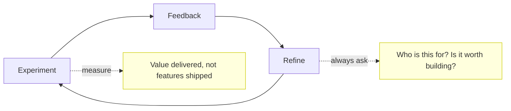

# Chapter 6 — Mastery & Forward Practice

My skills are more in demand now than ever, and I am turning work away — not despite AI, but because of it. A book ends where a 道 should: not at a destination but at a practice you keep. With models converging and tools commoditising, the lasting questions are what stays human and how to keep improving. This chapter answers both — the edge you protect, and the loop you never stop running.

## The Human Edge

As model quality converges, advantage moves to what cannot be trained: tacit expertise and hands-on practice — the engineer or analyst who sits with the real problem and knows why it matters. The pattern in the data is augmentation, not replacement; firms that over-automated and then rehired seasoned staff make the point in reverse ([HAI 2026](https://hai.stanford.edu/ai-index/2026-ai-index-report)). Tellingly, measured gains skew to novices: AI lifts beginners most by encoding what experts already know, which says the durable value is the expertise itself ([Brynjolfsson et al. 2023](https://www.nber.org/papers/w31161)).

You keep the edge by staying close to real problems and owning intent and judgement. You lose it by hollowing out the junior pipeline that makes tomorrow's seniors — optimising a year that costs a decade. The risk has a measured shape: across 11,097 repositories, agent adoption left human contributor counts flat but cut newcomer share 3.7pp and deepened review effort 5.3% — augmentation with dilution, the entry rungs thinning while maintainer burden climbs ([2606.26289](../research/papers/2606.26289-augmentation-dilution.md)).

There is an inner edge as well as an organisational one: your sense of your own judgement. AI erodes it twice over. It lifts task scores while flattening metacognition, so strong and weak performers end up equally — and wrongly — sure of themselves, and the more someone knows about AI the *worse* their self-assessment tends to become ([Fernandes et al. 2026](https://doi.org/10.1016/j.chb.2025.108779)). And a person's confidence drifts to match whatever confidence the model projects, a pull that lingers even after the model is gone ([Li et al. 2025](https://arxiv.org/abs/2501.12868)). Protecting the human edge therefore means protecting calibration: forming a view of your own before you ask, knowing what you actually know, and treating the machine's certainty as one more input to weigh, never a verdict to accept.

## Continuous Refinement

The book closes on the idea it opened with: a path. Treat your practice as a loop — experiment, get feedback, refine, repeat — and keep AI human-centred at each turn. The evidence is consistent that the gain comes not from the tool but from redesigning work around it, which is why the high performers move pilots into production while others count demos ([McKinsey 2025](https://www.mckinsey.com/capabilities/quantumblack/our-insights/the-state-of-ai)).

No method will be the last word, and that is the point of treating practice as a path rather than a destination. Vibe coding was the style of one year and looked spent within six months; spec-driven development began to buckle inside a year; Agile long ago decayed into a spec process with shorter cycles, and test-first development faded before it. What survives every relabelling is the discipline underneath — staying close to the work, holding the intent, asking what is worth building. So invest in that rather than the framework of the season: build the skills that direct the machine instead of racing to out-type it, and refuse to keep score by tokens burned, a number that flatters motion over value — one developer's single month ran to 603 billion tokens ([Ahuja, 2026](https://howtoarchitect.io/78431acba162?sk=cd2a36f452af96ccbfbcfcdeaa92ec06); [Ahuja, 2026](https://howtoarchitect.io/c00609f72496?sk=2da01d7d2abfb5bc0acaed7050a0e797)).

Measure value, not output. Features shipped is a flattering number while whether anyone needed them goes quietly unasked. The way of AI turns out to be that one question, asked again and again — who is this for, and is it worth building — until it hardens into habit. That habit, more than any model, is what AI-dō is for.
