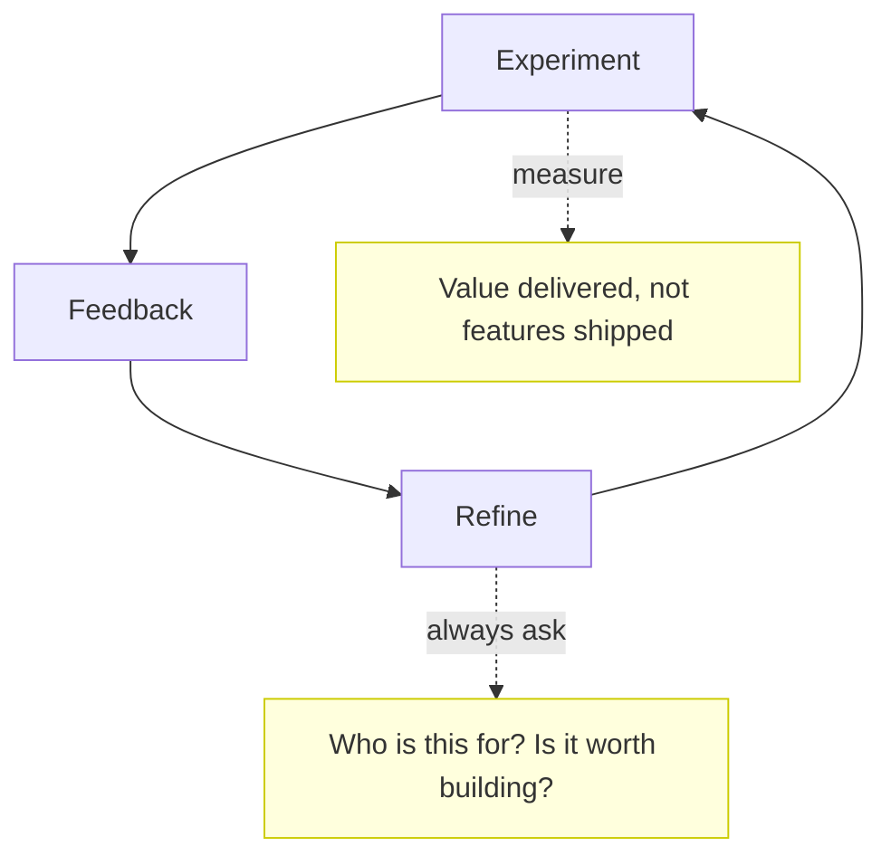

# Chapter 6 — Mastery & Forward Practice

My skills are more in demand now than ever, and I am turning work away — not despite AI, but because of it. A book ends where a 道 should: not at a destination but at a practice you keep. With models converging and tools commoditising, the lasting questions are what stays human and how to keep improving. This chapter answers both — the edge you protect, and the loop you never stop running.

## 6.1 The Human Edge

As model quality converges, advantage moves to what cannot be trained: tacit expertise and hands-on practice — the engineer or analyst who sits with the real problem and knows why it matters. The pattern in the data is augmentation, not replacement; firms that over-automated and then rehired seasoned staff make the point in reverse ([Stanford HAI, *The AI index 2026 annual report*, 2026](https://hai.stanford.edu/ai-index/2026-ai-index-report)). Tellingly, measured gains skew to novices: AI lifts beginners most by encoding what experts already know, which says the durable value is the expertise itself ([Brynjolfsson et al., *Generative AI at work*, 2023](https://www.nber.org/papers/w31161)). It is also, increasingly, what decides who can build software at all: the subject-matter expert who can say precisely what a system is for now has, for the first time, a way to build it — provided they keep enough engineering judgement to steer (Chapter 3).

The split between augmentation and automation is visible in wages, not just anecdotes. Studying US occupations from 2015 to 2022, Damien Marguerit separated AI that augments a job from AI that automates it, and found they pull in opposite directions ([Marguerit, *Augmenting or automating labor? The effect of AI development on new work, employment, and wages*, 2025](https://arxiv.org/abs/2503.19159)). A one-standard-deviation rise in exposure to augmenting AI came with about 3.1% higher employment and higher wages for higher-skilled workers. The same rise in automating AI came with roughly 7.7% lower hourly wages for lower-skilled ones. The same technology, aimed differently, widens the gap between whom it lifts and whom it displaces. Which side you land on depends on whether the tool is set up to extend your judgement or to replace your task — and that is partly a choice, not a fate.

You keep the edge by staying close to real problems and owning intent and judgement. You lose it by hollowing out the junior pipeline that makes tomorrow's seniors — optimising a year that costs a decade. The risk has a measured shape: across 11,097 repositories, agent adoption left human contributor counts flat but cut newcomer share 3.7pp and deepened review effort 5.3% — augmentation with dilution, the entry rungs thinning while maintainer burden climbs ([Zhang et al., *Augmentation with dilution: Human contributor ecosystems after AI coding agent adoption*, 2026](https://arxiv.org/abs/2606.26289)). The measurement is in software because commits are easy to count, but the mechanism is general: every field that grows its seniors by handing juniors the work AI now absorbs faces the same thinning — junior analysts, associates, researchers alike.

There is an inner edge as well as an organisational one: your sense of your own judgement. AI erodes it twice over. It lifts task scores while flattening metacognition, so strong and weak performers end up equally — and wrongly — sure of themselves, and the more someone knows about AI the *worse* their self-assessment tends to become ([Fernandes et al., *AI makes you smarter but none the wiser: The disconnect between performance and metacognition*, 2026](https://doi.org/10.1016/j.chb.2025.108779)). And a person's confidence drifts to match whatever confidence the model projects, a pull that lingers even after the model is gone ([J. Li et al., *As confidence aligns: Effect of AI confidence on human self-confidence in human–AI decision making*, 2025](https://arxiv.org/abs/2501.12868)). Protecting the human edge therefore means protecting calibration: forming a view of your own before you ask, knowing what you actually know, and treating the machine's certainty as one more input to weigh, never a verdict to accept.

## 6.2 When the Pair Works

It is tempting to assume that a person and an AI together must beat either alone. The evidence says otherwise, and the correction matters. Michelle Vaccaro, Abdullah Almaatouq, and Thomas Malone pooled 106 experiments — 370 effect sizes — and found that, on average, human–AI teams performed *worse* than the better of the human alone or the AI alone, a small but real negative effect (a Hedges' *g* of −0.23) ([Vaccaro et al., *When combinations of humans and AI are useful: A systematic review and meta-analysis*, 2024](https://doi.org/10.1038/s41562-024-02024-1)). The losses clustered in decision-making tasks; the gains, where they appeared, were in content creation. Synergy is not automatic. It has to be engineered.

The pattern underneath tells you when to expect it. Combinations helped when the human alone was the stronger of the two, and hurt when the AI alone was stronger — because in that second case the human's job is to know when to defer, and people are bad at it. Jingshu Li and colleagues showed why: when an AI reports how confident it is, users mostly cannot tell whether that confidence is earned. Only about a quarter noticed when the model was miscalibrated, against three-quarters who could read a well-calibrated one ([J. Li et al., *Understanding the effects of miscalibrated AI confidence on user trust, reliance, and decision efficacy*, 2024](https://arxiv.org/abs/2402.07632)). An overconfident model pushed people into over-reliance; an underconfident one into ignoring good advice. And simply disclosing the miscalibration did not repair the decisions.

So the edge is calibration on both sides. The pairing works when the human can judge whether to trust a given answer, which means keeping enough independent expertise to check the machine rather than defer to it. This is the earlier warning about your own judgement, now at the level of the team: a model's confidence is data about the model, not a verdict about the world. Build the pairing so the person contributes where they are stronger, verifies where the model is, and treats a confident answer and a correct one as two different things.

## 6.3 Keeping Your Own Mind

There is a cost to offloading thinking that never shows up on the finished page. Nataliya Kosmyna and colleagues at MIT had people write essays in three conditions — using an LLM, using a search engine, and unaided — while recording their brain activity. The unaided writers showed the strongest, most distributed neural connectivity; the search users less; the LLM users least ([Kosmyna et al., *Your brain on ChatGPT: Accumulation of cognitive debt when using an AI assistant for essay writing task*, 2025](https://arxiv.org/abs/2506.08872)). More telling was memory and ownership: over 83% of the LLM writers could not quote a single sentence from the essay they had just produced, and asked later to write unaided, they stayed disengaged. The authors call the effect cognitive debt — fluency now, borrowed against understanding later. It is a small, preliminary study and has drawn methodological criticism, so hold the exact numbers loosely; the direction is the point.

The pattern shows up at population scale too. Michael Gerlich surveyed 666 people and found frequent AI-tool use correlated with lower critical-thinking scores, an effect statistically carried by cognitive offloading — handing the mental work to the tool ([Gerlich, *AI tools in society: Impacts on cognitive offloading and the future of critical thinking*, 2025](https://doi.org/10.3390/soc15010006)). It was strongest in the youngest users and softened by more education. Both studies are correlational, and neither proves the tool makes you worse. But the mechanism is plausible and worth guarding against: a muscle you stop using weakens.

The antidote is not to refuse the tool but to keep practising the thing it can do for you. Decades earlier, Anders Ericsson and colleagues showed that expert performance is built by deliberate practice — effortful, feedback-driven repetition of exactly the hard part — not by talent or time served; their violinists reached the top on the order of ten thousand hours of it ([Ericsson et al., *The role of deliberate practice in the acquisition of expert performance*, 1993](https://doi.org/10.1037/0033-295X.100.3.363)). AI removes the friction that deliberate practice depends on. Let it take every hard step and you stop building the judgement that let you supervise it in the first place. So keep some of the hard part for yourself: write the first draft, work the problem before you ask, and reserve the reps that grow the skill you most want to keep.

## 6.4 Continuous Refinement

The book closes on the idea it opened with: a path. Treat your practice as a loop — experiment, get feedback, refine, repeat — and keep AI human-centred at each turn. The evidence is consistent that the gain comes not from the tool but from redesigning work around it, which is why the high performers move pilots into production while others count demos ([McKinsey & Company, *The state of AI*, 2025](https://www.mckinsey.com/capabilities/quantumblack/our-insights/the-state-of-ai)).

```mermaid
flowchart TB
    E[Experiment] --> F[Feedback]
    F --> R[Refine]
    R --> E
    R -.->|always ask| Q["Who is this for? Is it worth building?"]
    E -.->|measure| V[Value delivered, not features shipped]
    classDef ask fill:#ffd,stroke:#cc0
    class Q,V ask
```

No method will be the last word, and that is the point of treating practice as a path rather than a destination. Vibe coding was the style of one year and looked spent within six months; spec-driven development began to buckle inside a year. The pattern is older and wider than software: business process re-engineering, Six Sigma, and a long line of agile relabellings were each sold as the last word, and each was quietly folded into whatever came next. What survives every relabelling is the discipline underneath — staying close to the work, holding the intent, asking what is worth building. That discipline is older than any of these frameworks: it is the Unix philosophy — do one thing well, compose small pieces, separate the *what* from the *how* — re-run on a tool that can now write the implementation itself, and given a human centre (Chapter 1). So invest in that rather than the framework of the season: build the skills that direct the machine instead of racing to out-produce it, and refuse to keep score by tokens burned, a number that flatters motion over value — one developer's single month ran to 603 billion tokens ([Ahuja, *Spec-driven development is also breaking the fifty-year-old iron triangle*, 2026c](https://howtoarchitect.io/78431acba162?sk=cd2a36f452af96ccbfbcfcdeaa92ec06); [Ahuja, *Spec-driven development isn’t broken. It will collapse*, 2026d](https://howtoarchitect.io/c00609f72496?sk=2da01d7d2abfb5bc0acaed7050a0e797)).

Refinement has a collective hazard worth naming, because it echoes the convergence problem of the last chapter. Anil Doshi and Oliver Hauser had writers work with and without AI story ideas, and found a two-sided result ([Doshi & Hauser, *Generative AI enhances individual creativity but reduces the collective diversity of novel content*, 2024](https://doi.org/10.1126/sciadv.adn5290)). AI raised the novelty of an individual writer's story by 5 to 8%, and helped the least creative writers most. But the AI-assisted stories were measurably more like one another, drifting toward the same suggestions. Each writer was better off; the pool of stories was narrower. It is the same trade the organisation faces when everyone consults the same models. The defence is the same too: keep your own voice in the loop, use the machine to sharpen a view you brought rather than to supply one, and treat the fact that it makes everyone sound alike as a cost to manage, not a convenience to enjoy.

Measure value, not output. Features shipped is a flattering number while whether anyone needed them goes quietly unasked. The way of AI turns out to be that one question, asked again and again — who is this for, and is it worth building — until it hardens into habit. That habit, more than any model, is what AI-dō is for.

## 6.5 Shuhari — The Way From Here

A 道 has a shape to its learning, and the arts that end in 道 named it long before software did: *shuhari* — 守 *shu*, keep to the form; 破 *ha*, break from it; 離 *ri*, leave it behind and move freely (["Shuhari," n.d.](https://en.wikipedia.org/wiki/Shuhari)). Read this book as its *shu*. Follow the forms closely at first — one clear ask at a time, intent kept apart from implementation, Markdown as the medium, verification at the boundaries, a human answerable for what ships. As your judgement grows and the tools shift beneath you, enter *ha*: bend the forms, drop the ones that stop fitting, keep what holds. In time comes *ri*, where the forms are instinct and you invent your own — which is only the promise of Chapter 1 come round again: learn the philosophy, and the methods become yours to invent.

The argument has run in six moves. AI-dō is the Unix philosophy re-run on a model and given a human centre (Chapter 1). In daily work that means turning what you know into Markdown, keeping it where a model can read it, and building up one clear ask at a time (Chapter 2). In software it means separating the *what* from the *how*, and refusing both the over-specified spec and the unowned vibe (Chapter 3). What keeps any of it sound is ordinary engineering discipline — tests, review, version control, small reversible steps — now more necessary, not less (Chapter 4). What keeps it safe is the duty: security, fairness, privacy, provenance, protected divergence, honest ledgers, and someone who stays answerable (Chapter 5). And what keeps it improving is the human edge you protect and the loop you never stop running (this one).

The rest is yours to begin, and the first steps are small and specific. First, take one real task you already do and run it as a loop — draft, check, refine — instead of waiting on a perfect prompt. Second, start an LLM wiki: put the context you keep re-explaining into a few Markdown notes the model can draw on. Third, add one verification step at the boundary that matters most, and name the person answerable for what leaves it. Fourth, before you open a chat window on anything that counts, write your own view down first, so you can tell the model's confidence from your own. Fifth, keep a second model on the bench, and ask of everything you make: who is this for, and is it worth building?

Method over model; the question over the answer; care over cleverness. The tools will keep changing — that is the one safe prediction — and the way does not. Begin.

## References

Ahuja, K. V. (2026c). *Spec-driven development is also breaking the fifty-year-old iron triangle*. Activated Thinker (Medium). [https://howtoarchitect.io/78431acba162?sk=cd2a36f452af96ccbfbcfcdeaa92ec06](https://howtoarchitect.io/78431acba162?sk=cd2a36f452af96ccbfbcfcdeaa92ec06)

Ahuja, K. V. (2026d). *Spec-driven development isn’t broken. It will collapse*. Activated Thinker (Medium). [https://howtoarchitect.io/c00609f72496?sk=2da01d7d2abfb5bc0acaed7050a0e797](https://howtoarchitect.io/c00609f72496?sk=2da01d7d2abfb5bc0acaed7050a0e797)

Brynjolfsson, E., Li, D., & Raymond, L. R. (2023). *Generative AI at work* (NBER Working Paper No. 31161). National Bureau of Economic Research. [https://www.nber.org/papers/w31161](https://www.nber.org/papers/w31161)

Doshi, A. R., & Hauser, O. P. (2024). *Generative AI enhances individual creativity but reduces the collective diversity of novel content*. Science Advances, 10(28), eadn5290. [https://doi.org/10.1126/sciadv.adn5290](https://doi.org/10.1126/sciadv.adn5290)

Ericsson, K. A., Krampe, R. T., & Tesch-Römer, C. (1993). *The role of deliberate practice in the acquisition of expert performance*. Psychological Review, 100(3), 363–406. [https://doi.org/10.1037/0033-295X.100.3.363](https://doi.org/10.1037/0033-295X.100.3.363)

Fernandes, D., et al. (2026). *AI makes you smarter but none the wiser: The disconnect between performance and metacognition*. Computers in Human Behavior, 168, 108779. [https://doi.org/10.1016/j.chb.2025.108779](https://doi.org/10.1016/j.chb.2025.108779)

Gerlich, M. (2025). *AI tools in society: Impacts on cognitive offloading and the future of critical thinking*. Societies, 15(1), 6. [https://doi.org/10.3390/soc15010006](https://doi.org/10.3390/soc15010006)

Kosmyna, N., Hauptmann, E., Yuan, Y. T., Situ, J., Liao, X.-H., Beresnitzky, A. V., Braunstein, I., & Maes, P. (2025). *Your brain on ChatGPT: Accumulation of cognitive debt when using an AI assistant for essay writing task*. arXiv. [https://arxiv.org/abs/2506.08872](https://arxiv.org/abs/2506.08872)

Li, J., et al. (2025). *As confidence aligns: Effect of AI confidence on human self-confidence in human–AI decision making*. Proceedings of the 2025 CHI Conference on Human Factors in Computing Systems. [https://arxiv.org/abs/2501.12868](https://arxiv.org/abs/2501.12868)

Li, J., Yang, Y., Zhang, R., Liao, Q. V., Song, T., Xu, Z., & Lee, Y.-C. (2024). *Understanding the effects of miscalibrated AI confidence on user trust, reliance, and decision efficacy*. arXiv. [https://arxiv.org/abs/2402.07632](https://arxiv.org/abs/2402.07632)

Marguerit, D. (2025). *Augmenting or automating labor? The effect of AI development on new work, employment, and wages*. arXiv. [https://arxiv.org/abs/2503.19159](https://arxiv.org/abs/2503.19159)

McKinsey & Company. (2025). *The state of AI*. [https://www.mckinsey.com/capabilities/quantumblack/our-insights/the-state-of-ai](https://www.mckinsey.com/capabilities/quantumblack/our-insights/the-state-of-ai)

Shuhari. (n.d.). In *Wikipedia*. [https://en.wikipedia.org/wiki/Shuhari](https://en.wikipedia.org/wiki/Shuhari)

Stanford Institute for Human-Centered AI. (2026). *The AI index 2026 annual report*. Stanford University. [https://hai.stanford.edu/ai-index/2026-ai-index-report](https://hai.stanford.edu/ai-index/2026-ai-index-report)

Vaccaro, M., Almaatouq, A., & Malone, T. (2024). *When combinations of humans and AI are useful: A systematic review and meta-analysis*. Nature Human Behaviour, 8(12), 2293–2303. [https://doi.org/10.1038/s41562-024-02024-1](https://doi.org/10.1038/s41562-024-02024-1)

Zhang, Jiang, & Koziolek. (2026). *Augmentation with dilution: Human contributor ecosystems after AI coding agent adoption*. arXiv. [https://arxiv.org/abs/2606.26289](https://arxiv.org/abs/2606.26289)
