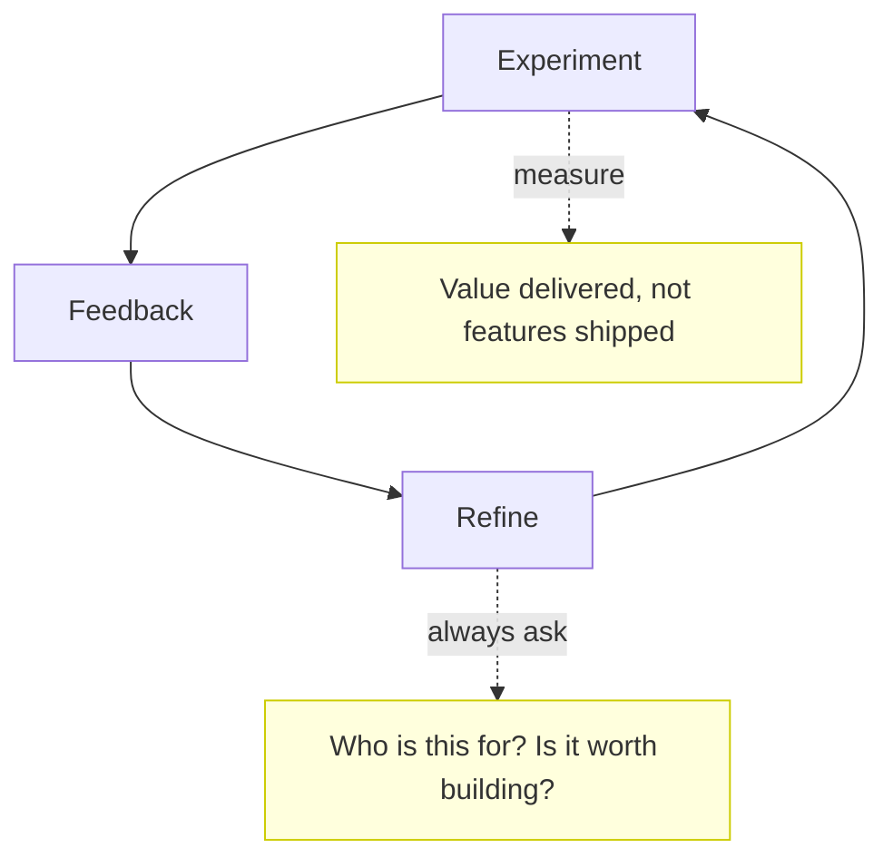

# Chapter 6 — Mastery & Forward Practice

Surprisingly, my consulting skills are more in demand now than ever, and AI is the reason rather than the obstacle. AI has democratised the production and dissemination of knowledge. What clients now pay for is knowing what work to do: framing the ask, judging the result, verifying the final outputs. That is exactly what the last five chapters have been teaching.

A 道 does not end at a destination. It ends at a practice you keep, so that is where this chapter goes. First a look back along the way travelled, then the question of what stays human as the models keep improving. After that, the trend lines: where AI is heading for the technology, for the work, and for the societies both of those sit inside. It closes on the loop you never stop running, with the first steps to take when you put the book down.

## 6.1 The Way Travelled

Here is the whole argument once more, chapter by chapter, as one walk.

Chapter 1 laid a deliberately unglamorous foundation: a large language model predicts the next token. Everything else follows from that one mechanism. Predicting text well forces the model to learn the structure of the world the text describes, which is why it can genuinely reason. Nothing in the mechanism checks truth, so it hallucinates with perfect confidence. And because its strength tracks the density of its training data, competence comes out jagged: an Olympiad gold one minute, a misread clock face the next.

Two habits followed from that, and the rest of the book rests on them. Treat the model as a loop rather than an oracle, and stay responsible for what is produced.

Chapter 2 took that loop to the desk. A prompt you would use again became a skill. Wrapping a skill in a self-check made it dependable, and the best of those skills became tools that other agents could call. Everything worth telling a model became Markdown, and context and memory turned single sessions into work that builds on itself. The confidence trap, fluent and agreeable and wrong, set the habit of checking before trusting. The chapter ended with a personal operating model: plays, preferences, and a daily loop, assembled one working part at a time.

Chapter 3 turned those parts into software. Three real projects, each begun from a sentence, showed a non-programmer deploying working systems. They also showed why the craft is *intent, context, expectations*: say what the system is for and how you will know it is right, then leave the how to the agent. Over-specify the how and you fight the tool's strength; refuse to own the result and you end up with slop that nobody vouched for. Verification settled at the boundary, and the work itself left the editor.

Chapter 4 scaled one agent to many and found the human at the centre of the fleet. The disciplines split three ways: what the human must bring (intent, judgement, accountability, independence of mind), what the agent system must provide (harness, context and memory, orchestration, loops, evaluation), and what the two together require (division of labour, delegation and review, presence, calibrated trust). And it turned the obvious expectation upside down. The better the agents get, the more the human disciplines matter, because your judgement becomes the limiting factor.

Chapter 5 was the duty that follows. Responsibility runs in a chain from the labs that govern their models, through the laws now arriving around the world and the standards that make compliance checkable, into the enterprise, and finally to a person with a name. Capability can be delegated; responsibility cannot.

| Chapter | The discipline | The sentence to keep |
| --- | --- | --- |
| 1 · Foundations | A loop, not an oracle | It predicts; it does not know |
| 2 · Productivity | Build the system around the model | Turn what you know into Markdown, one clear ask at a time |
| 3 · Software | Intent, context, expectations | Say what and how you'll check it; leave the how to the agent |
| 4 · Disciplines | Manage the fleet; keep the judgement | The better the agents, the more the human matters |
| 5 · Responsibility | The duty behind the capability | Capability can be delegated; responsibility cannot |

: The book in one line per chapter: each discipline and the sentence to carry from it. {#tbl-recap}

That is the recap, and it is the easy part of a retrospective. The harder part is deciding which of these disciplines will still matter in a few years. That depends on what the models can and cannot take over.

## 6.2 What Stays Human

Chapter 1 observed that we all draw on the same handful of frontier models, and every release narrows the gaps between them. When everyone holds the same tool, the difference between professionals has to live somewhere the tool is not. Three bodies of evidence, gathered over the course of writing this book, say where: in your expertise, in your judgement about when to trust the machine, and in the thinking you keep doing for yourself.

{#fig-human-edge}

### 6.2.1 The Human Edge

As model quality converges, the advantage moves to what nobody can download: tacit expertise. That means the engineer or analyst who has sat with the real problem long enough to know why it matters and what "right" looks like there. The pattern in the data is augmentation, not replacement, and the firms that over-automated and then quietly rehired their seasoned staff make the point in reverse ([Stanford HAI, *The AI index 2026 annual report*, 2026](https://hai.stanford.edu/ai-index/2026-ai-index-report)).

Be careful with the question of who gains most, though, because at first the answer looks backwards. Measured productivity gains skew to novices. In one of the best-known field studies, an AI assistant lifted new customer-support agents far more than veterans, because the model had been trained on what the veterans already did. It packaged their expertise and handed it to beginners ([Brynjolfsson et al., *Generative AI at work*, 2023](https://www.nber.org/papers/w31161)). The expertise came first, and the tool only passed it along.

Expertise now buys something it never could. A subject-matter expert who can say precisely what a system is for finally has a way to build it, as Chapter 3 showed, provided they keep enough judgement to steer.

The split between augmentation and automation is visible in wages, not just anecdotes. Studying US occupations from 2015 to 2022, Damien Marguerit separated AI that augments a job from AI that automates it, and found the two pull in opposite directions ([Marguerit, *Augmenting or automating labor? The effect of AI development on new work, employment, and wages*, 2025](https://arxiv.org/abs/2503.19159)). A one-standard-deviation rise in exposure to augmenting AI came with about 3.1% higher employment and higher wages for higher-skilled workers. The same rise in automating AI came with roughly 7.7% lower hourly wages for lower-skilled ones. Which side you land on is partly a choice about how the tool gets set up.

You keep the edge by staying close to real problems and owning the intent and the judgement. You lose it collectively by hollowing out the junior pipeline that produces tomorrow's seniors, the jobs people used to start on. You save on this year's salaries, and then a decade on you find there is nobody ready to promote.

That risk now has a measured shape. Across 11,097 open-source repositories, adopting coding agents left the number of human contributors flat, but cut the share of newcomers by 3.7 percentage points and increased the review burden on maintainers by 5.3%. The authors call it *augmentation with dilution*: fewer people get in at the bottom while the load on those already there climbs ([Zhang et al., *Augmentation with dilution: Human contributor ecosystems after AI coding agent adoption*, 2026](https://arxiv.org/abs/2606.26289)). The measurement is in software because commits are easy to count, but the mechanism is general. Junior analysts, associates and research assistants all learn their trade on work AI now absorbs first.

There is an inner edge as well as an organisational one, and that is your sense of your own judgement. AI wears it away twice over. First, it lifts task scores while flattening metacognition, so strong and weak performers end up equally sure of themselves and equally wrong about it. Oddly, the more someone knows about AI, the *worse* their self-assessment tends to become ([Fernandes et al., *AI makes you smarter but none the wiser: The disconnect between performance and metacognition*, 2026](https://doi.org/10.1016/j.chb.2025.108779)). Second, your confidence drifts to match whatever confidence the model projects, and the pull lingers even after the model is gone ([J. Li et al., *As confidence aligns: Effect of AI confidence on human self-confidence in human–AI decision making*, 2025](https://arxiv.org/abs/2501.12868)).

Form a view of your own before you ask the model, then treat its certainty as one more thing to weigh and not a verdict.

The hand drawn illustrations in this book are one small instance of that choice. They are the work of a human illustrator, Katerina Limpitsouni. I picked them from her open-source set and recoloured them to fit these pages, rather than asking a model to generate one for each section. Deciding which picture belongs beside which argument, and whether a picture belongs there at all, is a matter of taste. Taste is the human part this chapter keeps coming back to, so I chose them by hand, on purpose.

### 6.2.2 When the Pair Works

It is tempting to assume that a person and an AI together must beat either alone. The evidence says otherwise. Michelle Vaccaro, Abdullah Almaatouq, and Thomas Malone pooled 106 experiments, 370 effect sizes in all, and found that on average human–AI teams performed *worse* than the better of the human alone or the AI alone. The effect was small but real, a Hedges' *g* of −0.23 ([Vaccaro et al., *When combinations of humans and AI are useful: A systematic review and meta-analysis*, 2024](https://doi.org/10.1038/s41562-024-02024-1)). The losses clustered in decision-making tasks. The gains, where they appeared, were in content creation. So synergy does not happen by itself. Somebody has to design the pairing for it.

The pattern underneath tells you when to expect it. Combinations helped when the human alone was the stronger of the two, and hurt when the AI alone was stronger. In that second case the human's remaining job is to know when to defer, and people are bad at it.

Jingshu Li and colleagues showed why. When an AI reports how confident it is, users mostly cannot tell whether that confidence is earned. Only about a quarter noticed when a model was miscalibrated, against three-quarters who could read a well-calibrated one ([J. Li et al., *Understanding the effects of miscalibrated AI confidence on user trust, reliance, and decision efficacy*, 2024](https://arxiv.org/abs/2402.07632)). An overconfident model pushed people into over-reliance, an underconfident one made them ignore good advice, and simply disclosing the miscalibration did not repair the decisions.

So the pairing turns on calibration, on both sides of it. It works when the person can judge whether to trust a given answer, which means keeping enough independent expertise to check the machine instead of deferring to it. §6.2.1 warned about your own calibration. The same warning applies to a team: how confident the model sounds tells you something about the model and nothing about the world.

Build the pairing so the person works on the parts they are better at, and checks the parts the model is better at.

### 6.2.3 Keeping Your Own Mind

There is a cost to offloading your thinking that never shows up on the finished page. Nataliya Kosmyna and colleagues at MIT had people write essays in three conditions, with an LLM, with a search engine, and unaided, while recording their brain activity. The unaided writers showed the strongest, most distributed neural connectivity, the search users less, the LLM users least ([Kosmyna et al., *Your brain on ChatGPT: Accumulation of cognitive debt when using an AI assistant for essay writing task*, 2025](https://arxiv.org/abs/2506.08872)). Memory and ownership told the sharper story. Over 83% of the LLM writers could not quote a single sentence from the essay they had just produced, and asked later to write unaided, they stayed disengaged. The authors call the effect *cognitive debt*: fluency now, borrowed against understanding later.

It is a small, preliminary study. A formal commentary argues it is underpowered and that its brain-connectivity measure cannot carry the causal story ([Stanković et al., *Commentary on Kosmyna et al. (2025), "Your brain on ChatGPT"*, 2026](https://arxiv.org/abs/2601.00856)). Treat the exact numbers as provisional. The direction is what matters.

The pattern shows up at population scale too. Michael Gerlich surveyed 666 people and found frequent AI-tool use correlated with lower critical-thinking scores, an effect statistically carried by cognitive offloading, which is just handing the mental work to the tool ([Gerlich, *AI tools in society: Impacts on cognitive offloading and the future of critical thinking*, 2025](https://doi.org/10.3390/soc15010006)). It was strongest in the youngest users and softened by more education. Both studies are correlational, and neither proves the tool makes you worse. Still, a muscle you stop using weakens, and that is reason enough to guard against it.

The answer is not to refuse the tool. Keep practising the very thing it can do for you.

Decades before any of this, Anders Ericsson and colleagues showed that expert performance is built by *deliberate practice*, meaning effortful, feedback-driven repetition of exactly the hard part, rather than by talent or time served. Their top violinists had accumulated on the order of ten thousand hours of it ([Ericsson et al., *The role of deliberate practice in the acquisition of expert performance*, 1993](https://doi.org/10.1037/0033-295X.100.3.363)). AI removes precisely the effortful struggle that deliberate practice depends on. Let it take every hard step and you stop building the judgement that lets you supervise it. Keep some of the hard part for yourself. Write the first draft. Work the problem before you ask. Whatever skill you most want to keep, do enough of it by hand to keep it.

## 6.3 Where AI Is Heading

Every chapter so far has described the tools as they are. Now for the trend lines. The measurements are good enough these days to repay a careful look, and where the experts disagree tells you as much as where they agree.

Start with the clearest line we have. Researchers at METR asked a simple question. How long a task, measured by how long a skilled human takes over it, can a model finish reliably? They call the answer the *time horizon*: the task length a model completes about half the time. Plotted against the calendar, it makes a straight line on a log scale.

The horizon has been doubling roughly every seven months since 2019, from tasks that took a human seconds, to minutes, to the better part of an afternoon. Their strongest model managed tasks around the two-hour mark ([Kwa et al., *Measuring AI ability to complete long software tasks*, 2025](https://arxiv.org/abs/2503.14499)). If the line holds, and that is a real if which the authors are careful about, the horizon reaches a full working day within a few years. It is the most concrete way anyone has found to say what "the models are getting better" actually means.

There is fuel for a few more doublings. Epoch AI, an institute that tracks the inputs to AI rather than selling its outputs, examined whether training can keep scaling and concluded that runs about ten thousand times larger than GPT-4 are probably feasible by 2030. That is the same size of leap again as GPT-2 to GPT-4 ([Epoch AI, *Can AI scaling continue through 2030?*, 2024](https://epoch.ai/blog/can-ai-scaling-continue-through-2030)).

What would stop it, if anything does, is physics and supply chains: electrical power first, then chip manufacturing, then training data, then hardware speed, in that order. There is fuel left, then, but for the first time you can see the gauge.

Whether more scale delivers *general* intelligence is exactly where the people who build these systems stop agreeing. A survey of 2,778 published AI researchers asked when "high-level machine intelligence", meaning machines outperforming humans at every task, becomes more likely than not. Their answer was around 2047, thirteen years sooner than the same community had guessed only a year earlier. Between a third and half of respondents gave at least a one-in-ten chance to an outcome as bad as human extinction ([Grace et al., *Thousands of AI authors on the future of AI*, 2024](https://arxiv.org/abs/2401.02843)).

Yet when the field's main professional society convened its own panel in 2025, 76% of the researchers it surveyed said that simply scaling up today's methods was "unlikely" or "very unlikely" to get there at all ([AAAI, *Presidential panel on the future of AI research*, 2025](https://aaai.org/wp-content/uploads/2025/03/AAAI-2025-PresPanel-Report-FINAL.pdf)). Hold those two results side by side and you have no consensus timeline at all. Anyone quoting a single confident date is selling something.

It also helps to stop treating "AGI" as a line the field crosses on some particular Tuesday. A team at Google DeepMind proposed a more useful frame, grading AGI on two axes: how *general* the ability is, and how *deep*. Today's best models sit on the bottom rung, "emerging AGI", as good as or somewhat better than an unskilled human across many tasks, and short of the next level up, which is matching a *skilled* adult on most work ([Morris et al., *Levels of AGI for operationalizing progress on the path to AGI*, 2023](https://arxiv.org/abs/2311.02462)).

On that map the interesting question stops being "is it AGI yet" and becomes "which cell is it in, and which tasks just moved?"

The argument runs between two bookends. At one end is Dario Amodei, who, as chief executive of Anthropic, has every reason to paint the ceiling high. He sketches a "country of geniuses in a datacenter" compressing fifty to a hundred years of scientific progress into five or ten: most cancers cured, the human lifespan doubled ([Amodei, *Machines of loving grace*, 2024](https://www.darioamodei.com/essay/machines-of-loving-grace)).

Against him, the Princeton computer scientists Arvind Narayanan and Sayash Kapoor argue for treating AI as *normal technology*, as transformative as electricity or the internet and just as slow to land ([Narayanan & Kapoor, *AI as normal technology*, 2025](https://knightcolumbia.org/content/ai-as-normal-technology)). What gates the impact, on their account, is not raw capability at all. It is the plodding pace at which organisations and institutions adopt anything. Their historical example is worth keeping: the electric motor was available for some forty years before it showed up in productivity statistics, because factories had to be rebuilt around it first. Capability and impact are two different things, and on the dynamo's precedent the gap between them runs to decades.

Nobody knows which bookend this ends nearer to. The way of working this book teaches survives either way, because it invests in judgement rather than in a bet on the timeline.

## 6.4 The Future of Work

The human edge of §6.2 was one person's answer. Ask the same question of the labour market as a whole and four different measurements come back, which is why the headlines contradict each other so cheerfully. The widest of them asks which jobs this touches at all.

{#fig-future-work}

The most-cited attempt to answer that put human raters and GPT-4 side by side, scoring, for each occupation, what share of its tasks an LLM could do at least twice as fast without losing quality. Around 80% of US workers have at least 10% of their tasks exposed, and about 19% have more than half exposed ([Eloundou et al., *GPTs are GPTs: An early look at the labor market impact potential of large language models*, 2024](https://arxiv.org/abs/2303.10130)).

What makes this wave different from the last is *who* is exposed. Past automation came for routine manual and clerical work. This time exposure rises with wage and education, so the knowledge workers who felt safest turn out to be the most exposed. They are precisely who this is written for.

That map of exposure is drawn for the United States, and it looks different elsewhere. Charting AI exposure across 141 economies, researchers found richer countries far more exposed than poorer ones, because the white-collar jobs AI touches make up more of a wealthy economy. Women came out more exposed than men in nine countries out of ten.

Even a country with little direct exposure is not insulated: some lean heavily on remittances from workers abroad whose jobs are exposed, so the shock arrives second-hand ([Murugan et al., *The jagged global economy: Frontier AI unevenly exposes national economies*, 2026](https://arxiv.org/abs/2607.05404)). Policy built for the US or European labour market, the authors warn, will not fit the rest of the world.

Exposure is potential, not fate, so it matters what people actually do with these tools. Anthropic, mining millions of conversations with its own Claude models, reported that real usage tilts towards *augmentation* over *automation*. Roughly 57% of activity was a person working with the model instead of handing a task off wholesale, and it clustered heavily in software and writing ([Anthropic, *The Anthropic economic index*, 2025f](https://www.anthropic.com/news/the-anthropic-economic-index)). Anthropic is measuring its own product, and coders are over-represented among its early adopters, so hold the exact figure loosely. The direction matches everything else in this book: most useful AI work today has a human staying in the loop.

The first real employment data has arrived, and it lands on the young. Studying payroll records for millions of US workers, Erik Brynjolfsson and colleagues found that since generative AI spread in late 2022, employment for early-career workers aged 22 to 25 in the most AI-exposed occupations fell about 16% relative to everyone else. Older workers in the same jobs, and workers in less-exposed jobs, held steady or grew ([Brynjolfsson, Chandar & Chen, *Canaries in the coal mine? Six facts about the recent employment effects of artificial intelligence*, 2025](https://digitaleconomy.stanford.edu/publications/canaries-in-the-coal-mine/)).

§6.2.1 warned that the entry rungs were thinning. Here it is in national payroll data. The tasks a junior once cut their teeth on are the tasks AI absorbs first, and the young in exposed fields are the canaries of the title.

A set of interviews with software engineers puts a mechanism under that number. AI takes over the code generation, debugging and documentation that juniors used to learn on, and that work quietly moves into senior-plus-AI workflows and stops reaching the junior at all. The researchers call it *absorption*.

What a junior loses is not only the tasks but the *productive struggle* they carried, the difficulty that turns a beginner into an expert over years. One senior, asked where this leads, put the worry in a single question: "Who is going to become the next senior?" ([Yu & Moon, *Who will become the next senior? How generative AI erodes the development pathway in software engineering*, 2026](https://arxiv.org/abs/2607.17067)). A handful of engineers at a handful of firms cannot prove a trend. But engineers describing their own teams show you what the payroll numbers cannot.

So is this a catastrophe or a rounding error? The sober end of the range belongs to the economist Daron Acemoglu, who ran the same task-exposure logic through a macroeconomic model and estimates AI will lift total factor productivity, the extra output squeezed from the same labour and capital, by *at most* about 0.66% over ten years. That is a fraction of the 7% GDP boom some banks forecast ([Acemoglu, *The simple macroeconomics of AI*, 2024](https://www.nber.org/papers/w32487)). His reason is simple once said: being *exposed* to AI and being *cheaply automatable* by it are different things, and only a modest slice of tasks clears both bars any time soon.

The World Economic Forum, surveying more than a thousand employers about what they *expect*, tells a busier story: a churn of 22% of jobs by 2030, 170 million roles created and 92 million displaced, a net gain of 78 million ([World Economic Forum, *Future of jobs report 2025*, 2025](https://www.weforum.org/publications/the-future-of-jobs-report-2025/)). That is what bosses predict, though, not what has happened, and predictions of this kind have a patchy record.

The forecasts disagree so wildly because they measure different things. Task exposure, real usage, actual employment and dollar output are four separate questions that keep getting reported under one headline:

| The question | Source | What it found |
| --- | --- | --- |
| Task exposure | Eloundou et al., 2024 | ~80% of workers have at least 10% of tasks exposed; ~19% over half |
| Real usage | Anthropic, 2025f | ~57% of activity is augmentation, not wholesale automation |
| Actual employment | Brynjolfsson, Chandar & Chen, 2025 | early-career workers in exposed jobs down ~16% since 2022 |
| Dollar output | Acemoglu, 2024 | total factor productivity up *at most* ~0.66% over a decade |

: The four questions the "future of work" forecasts each answer, and what each found. {#tbl-futures}

The most optimistic reading is also the most careful, because its author refuses to call it a forecast. David Autor argues that AI could, if steered well, help *rebuild* the middle class that earlier automation hollowed out, by extending expert judgement to workers without elite credentials. His example is the nurse practitioner safely doing more of what once required a doctor ([Autor, *Applying AI to rebuild middle class jobs*, 2024](https://www.nber.org/papers/w32140)). He is explicit that this is a possibility contingent on choices, not a property of the technology.

Which returns the question to where §6.2 left it. Whether AI augments you or replaces you depends partly on how the tool is set up, and partly on whether you keep the judgement this chapter has been describing. If the labour market keeps shifting, the augmented side of that line is the safer place to stand.

## 6.5 AI and Society

Work is where AI touches most professionals first, though it is not where its evolution matters most. What do fluent machines do to a society's information, to its trust, to how its children learn, and to who ends up with the gains? Those are bigger questions than anything in the last section, and the evidence on them is patchier.

A gap in perception colours everything else here, so begin there. When Pew surveyed both the US public and AI experts, 56% of the experts expected AI to have a positive effect on the country over the next twenty years, against just 17% of the public ([Pew Research Center, *How the US public and AI experts view artificial intelligence*, 2025](https://www.pewresearch.org/internet/2025/04/03/how-the-us-public-and-ai-experts-view-artificial-intelligence/)). The public is more worried than excited and expects job losses. The experts are the reverse. The two groups do agree on the governance, though: both want more control over how AI is used in their lives, and both doubt the government will regulate it well. A technology arriving this fast and trusted this unevenly is a governance problem before it is a technical one. Chapter 5 argued the same thing from the other end.

Part of the public's unease is well-founded, because these systems are quietly good at changing minds. In a controlled debate experiment, GPT-4 was given a few facts about its opponent: age, politics, education. Against a human debater working without those facts, it raised the odds of shifting someone's view by about 82%. Hand the same facts to a human and they gained nothing measurable from them ([Salvi et al., *On the conversational persuasiveness of large language models*, 2025](https://arxiv.org/abs/2403.14380)). The unsettling detail is that it worked even when people correctly guessed they were arguing with a machine. A tool that out-persuades humans at no cost and infinite scale, personalised to each target, is a new thing in the information environment.

The subtlest cost lands on learning, where the struggle a tool removes is the very thing that was doing the teaching. In a trial with about a thousand high-school maths students, those given unrestricted GPT-4 to practise with did far better *during* practice. Then they scored 17% *worse* than the no-AI group on an exam where the AI was taken away ([Bastani et al., *Generative AI without guardrails can harm learning*, 2025](https://doi.org/10.1073/pnas.2422633122)). The tool had become a crutch.

The interesting half of the study is the fix. A second version, rebuilt as a tutor that gave hints instead of answers, erased the harm entirely. What decided whether the tool taught or harmed was the guardrails around it, not whether the students had access. It is the lesson §6.2.3 drew from brain activity, repeated with exam scores, and this time with a remedy attached.

A 2026 experiment puts its finger on *how* the tool gets used. Undergraduates given AI for a study task scored higher on a test straight afterwards, and unlike the maths students, most of that gain was still there a week later when they worked without it. But the outcome split by habit. Students who used AI to *explain* concepts kept their gains. Those who used it to *generate* the work outright saw the advantage disappear once the tool was taken away ([Contractor & Reyes, *Experimental evidence on the learning impact of generative AI*, 2026](https://arxiv.org/abs/2607.08849)).

The thread running through all of it is that AI is a lever, and a lever multiplies whatever force you already bring. Which way it tips is contested, and the disagreement is worth sitting with.

When a task is well-defined and the tool can bottle an expert's know-how, AI lifts the least-skilled the most. That is the packaging effect from §6.2.1, and it is large. In the study of more than five thousand customer-support agents, an AI assistant raised resolved cases by about 14% on average, but the gain was lopsided: roughly 34% for the newest, lowest-skilled staff, and barely any for the veterans ([Brynjolfsson et al., 2023](https://www.nber.org/papers/w31161)). The writing experiment from §2.8 found the same levelling, the weakest writers gaining most ([Noy & Zhang, 2023](https://doi.org/10.1126/science.adh2586)).

Move to open-ended work that turns on judgement, though, and it tips the other way. A field experiment with Kenyan entrepreneurs made this stark: an AI business mentor helped the already-strong performers by around 15% while leaving the weakest about 8% *worse* off ([Otis et al., *The uneven impact of generative AI on entrepreneurial performance*, 2023](https://www.hbs.edu/faculty/Pages/item.aspx?num=65159)). Both groups received good counsel, so the gap did not come from the advice. It came from what each group took to the model. The weakest performers brought their hardest problems, the ones neither an AI nor a human mentor could readily fix.

A study of tens of thousands of chess players is just as sobering. Once you account for who chooses to use the AI in the first place, its apparent teaching effect disappears, and access to it pushes the strong and the weak further apart ([Riedl & Bogert, *Who benefits from AI? Self-selection, skill gap, and the hidden costs of AI feedback*, 2024](https://arxiv.org/abs/2409.18660)).

What decides which way it tips? The evidence keeps pointing at whether the person can direct and judge the tool. When researchers looked for what predicted who gained from AI on knowledge work, it was not their grades and not how long they had studied. It was how well someone could prompt the model, filter its answers, and check its work. A structured workflow, which supplies that discipline from the outside, sharply narrowed the spread of results ([Idan & Anand, *Generative AI and the productivity divide*, 2026](https://arxiv.org/abs/2605.18143)). Scale that up and you have the jagged frontier of §2.8 spread across a whole society ([Dell'Acqua et al., 2023](https://www.hbs.edu/faculty/Pages/item.aspx?num=64700)). AI closes the gap when the task itself supplies the skill a person lacks. When the skill has to come from the worker, it widens.

The trouble is that this skill is unevenly held, and hardest to get for the people who most need it. Training in how to work with AI turns out to demand more prior schooling than ordinary training does, so it flows to those already well-equipped and passes over the workers most exposed to displacement ([OECD, *Bridging the AI skills gap: Is training keeping up?*, 2025](https://www.oecd.org/en/publications/bridging-the-ai-skills-gap_66d0702e-en.html)). The workers' side of it says the same. Among those most exposed to AI, the lower-paid meet it as a threat, without the digital access, the training or the slack to turn it to their advantage ([Federal Reserve Bank of San Francisco, *On-the-job exposure to AI among lower-income workers*, 2025](https://www.frbsf.org/research-and-insights/publications/community-development-research-briefs/2025/11/job-exposure-to-ai-among-lmi-workers/)).

Set that beside §6.4's finding that this wave of exposure climbs the ladder of wage and education, and the picture is uncomfortable. The people who gain from AI and the people it hurts may not be the same people at all.

For those on the wrong side of that divide, AI is not a tool they pick up and use. It is a tool that puts them to work. The writer and activist Cory Doctorow has a sharp name for the reversal, the *reverse-centaur*. A centaur, in the older usage, is a person helped by a machine, with the person in charge. A reverse-centaur flips that: it is "a machine that uses a human being as its assistant" ([Doctorow, *Reverse centaurs are the answer to the AI paradox*, 2025](https://pluralistic.net/2025/09/11/vulgar-thatcherism/)), with the worker kept to the machine's pace and left to take the blame when it errs.

Whether AI lifts you or grinds you down, he argues, comes down to whether you chose it or it was imposed on you ([Doctorow, *The Reverse Centaur's guide to life after AI*, 2026](https://www.versobooks.com/products/3584-the-reverse-centaur-s-guide-to-life-after-ai)). That is the same line the evidence keeps drawing, put now as a question of power rather than skill. He is an activist with a case to make and a book to sell, and he measures nothing. I would borrow the name and leave the confidence behind.

This is where a real social risk sits. A group that meets AI mostly as a threat, pushed out of a specialised job and handed the tool without the standing or skill to profit from it, may come to resent the technology itself and not only the outcome. The split in how people already feel is plain: in a 2025 US poll, 60% of the highest earners said AI does more good than harm, while a majority of the lowest earners said the reverse ([Quinnipiac University Poll, 2025](https://poll.qu.edu/poll-release?releaseid=3923)).

How far that hardens into lasting hostility no one yet knows, and the evidence is thin. But there is a precedent. Across thirteen European countries, people individually more exposed to an earlier wave of automation, the spread of industrial robots, became measurably more likely to vote for the radical right and less satisfied with democracy itself ([Anelli, Colantone & Stanig, 2021](https://doi.org/10.1073/pnas.2111611118)). Different technology, different decade, and voting is not the same as feeling, so it is a warning and not a forecast. The Quinnipiac poll offers a small comfort against it: people tend to fear for other people's jobs more than for their own.

Being able to judge what AI hands back is worth having for its own sake. It is worth a good deal more if the training, the safeguards and the institutions bring other people to that point as well, and building those is the work of Chapter 5.

## 6.6 A Snapshot of the Field

Another way to see where things are going is to watch where the people building these systems put their attention. In the middle of 2026 the largest gathering of the practitioner community, the AI Engineer World's Fair, built its keynote programme around a single idea: the *software factory*, the autonomous, agent-run software pipeline Chapter 4 examined in §4.2. Sessions came from Microsoft, OpenAI, Hugging Face, and the open-weight labs behind models like GLM and MiniMax ([AI Engineer, *Software factories and keynotes*, 2026](https://www.youtube.com/watch?v=htM02KMNZnk)). A conference bill tells you what an enthusiastic, self-selected crowd is excited about. Whether any of it works is a separate question. Even so, it tells you what these engineers now spend their days on. Fewer of them are perfecting a single prompt, and more are trying to keep a fleet of agents running.

One idea from the opening names something this book keeps circling. Swix (Shawn Wang), who runs the conference, called the craft *loop-stacking*. The core skill, he argued, is knowing which loop you are working in, whether a single prompt, a self-checking task, an agent, or a fleet, and choosing when to step up to the next one. He told it as a climb: in the beginning there was the token, then the chat, then tools, then goals, and now the automations and factories that stack loops on top of loops.

Chapter 1 drew that same ladder, from chatbot to agent ecosystem. Swix was describing it from the floor of a very loud room, and it is the loop the next section closes on.

## 6.7 Continuous Refinement

So we come back to the idea the book opened with, which is a path. Treat your practice as a loop. Experiment, get feedback, refine, repeat, and keep AI human-centred at each turn. The evidence is consistent that the gain comes from redesigning the work around the tool rather than from the tool itself, which is why the high performers move pilots into production while others count demos ([McKinsey & Company, *The state of AI*, 2025](https://www.mckinsey.com/capabilities/quantumblack/our-insights/the-state-of-ai)). It is the same finding Narayanan and Kapoor scaled up to history in §6.3: the factory had to be rebuilt around the electric motor before the motor paid.

The same loop scales up from a person to a whole company. Microsoft's chief executive, Satya Nadella, argues that a firm's real asset in this era is the *learning loop* it builds on top of the model it rents: the workflows, evaluations, and accumulated judgement that improve with each use. His line for it is that "you can offload a task, or even a job, but you can never offload your learning" ([Nadella, *A frontier without an ecosystem is not stable*, 2026](https://x.com/satyanadella/status/2066182223213293753)). As a company's AI capability grows, he claims, its people become *more* valuable, not less, since it takes human judgement to point the machine at the goals that matter, and "without human direction, you have compute running in circles."

Nadella sells the tools he is describing, so take the claim as an industry view. It happens to be this book's argument drawn one level larger. Any company can rent the model. What a rival cannot copy is the way its people and its systems get better with each project.

```mermaid
flowchart TB
    E[Experiment] --> F[Feedback]
    F --> R[Refine]
    R --> E
    R -.->|always ask| Q["Who is this for? Is it worth building?"]
    E -.->|measure| V[Value delivered, not features shipped]
    classDef ask fill:#ffd,stroke:#cc0
    class Q,V ask
```

: The refinement loop of experiment, feedback and refine, with the two questions that keep it honest. {#dia-refine}

No method will be the last word, and that is the point of treating practice as a path and not a destination. Vibe coding was the style of one year and looked spent within six months. Spec-driven development began to buckle inside a year. The pattern is older and wider than software: business process re-engineering, Six Sigma, and a long line of agile relabellings were each sold as the last word, and each was quietly folded into whatever came next.

What survives every relabelling is the discipline underneath, which is staying close to the work and holding on to the intent. That discipline is older than any of the frameworks. It is the Unix philosophy of doing one thing well, composing small pieces, and separating the *what* from the *how*, re-run on a tool that can now write the implementation itself, with a human kept at the centre (Chapter 1).

Your effort is better spent on the discipline than on whichever framework is current this year. Learn to direct the machine well, and resist the temptation to race it for volume. Tokens burned is the worst score to keep: it tells you how busy the machines were and nothing about whether anything useful got made. One developer's single month ran to 603 billion tokens ([Ahuja, *Spec-driven development is also breaking the fifty-year-old iron triangle*, 2026c](https://howtoarchitect.io/78431acba162?sk=cd2a36f452af96ccbfbcfcdeaa92ec06); [Ahuja, *Spec-driven development isn’t broken. It will collapse*, 2026d](https://howtoarchitect.io/c00609f72496?sk=2da01d7d2abfb5bc0acaed7050a0e797)).

Refinement has a collective hazard that echoes Chapter 5's convergence problem and §6.5's lever. Anil Doshi and Oliver Hauser had writers work with and without AI story ideas, and found a two-sided result ([Doshi & Hauser, *Generative AI enhances individual creativity but reduces the collective diversity of novel content*, 2024](https://doi.org/10.1126/sciadv.adn5290)). AI raised the novelty of an individual writer's story by 5 to 8%, and helped the least creative writers most. But the AI-assisted stories were measurably more like one another, drifting towards the same suggestions. Each writer was better off; the pool of stories was narrower.

The defence is to keep your own voice in the loop. Bring a view of your own and let the machine sharpen it, instead of asking it for the view.

Count the value rather than the output. Counting features shipped feels good, and it quietly skips the question of whether anyone needed them. Ask that question often enough and you stop having to remember to.

## 6.8 Shuhari: The Way From Here

A 道 has a shape to its learning, and the arts that end in 道 named it long before software did. *Shuhari*: 守 *shu*, keep to the form; 破 *ha*, break from it; 離 *ri*, leave it behind and move freely ([Endō, *Shu-ha-ri*, 1998](https://da2el.wordpress.com/2018/06/20/shu-ha-ri-endo-seishiro-aikido-saku-dojocho/)).

Read this book as its *shu*. Follow the forms closely at first: one clear ask at a time, intent kept apart from implementation, Markdown as the medium, verification at the boundaries, a human answerable for what is produced. As your judgement grows and the tools shift beneath you, enter *ha*. Bend the forms. Some of them will stop fitting and you should drop those. In time comes *ri*, where the forms have become instinct and you make your own, which is what Chapter 1 promised at the outset: learn the philosophy and the methods follow.

{#fig-shuhari}

The rest is yours to begin, and the first steps are small and specific. First, take one real task you already do and run it as a loop, draft then check then refine, instead of waiting on a perfect prompt. Second, start an LLM wiki: put the context you keep re-explaining into a few Markdown notes the model can draw on. Third, add one verification step at the boundary that matters most, and name the person answerable for what leaves it. Fourth, before you open a chat window on anything that counts, write your own view down first, so you can tell the model's confidence from your own. Fifth, keep a second model on the bench, and ask of everything you make: who is this for, and is it worth building?

None of that rests on the tools. It rests on the method you build around them, and on your own judgement about which question is worth asking.

I wrote this book to work out what had actually changed about my own consulting and teaching, so the forms in it are my *shu* as much as yours. I expect to have broken half of them by the time you read this, and that is how it should go. What does not change is the 道 underneath. Somebody has to decide a piece of work is worth doing, and then put their name to it.

That somebody is you. Begin.

## References

AAAI. (2025). *AAAI 2025 presidential panel on the future of AI research*. Association for the Advancement of Artificial Intelligence. [https://aaai.org/wp-content/uploads/2025/03/AAAI-2025-PresPanel-Report-FINAL.pdf](https://aaai.org/wp-content/uploads/2025/03/AAAI-2025-PresPanel-Report-FINAL.pdf)

Acemoglu, D. (2024). *The simple macroeconomics of AI* (NBER Working Paper No. 32487). National Bureau of Economic Research. [https://www.nber.org/papers/w32487](https://www.nber.org/papers/w32487)

Ahuja, K. V. (2026c). *Spec-driven development is also breaking the fifty-year-old iron triangle*. Activated Thinker (Medium). [https://howtoarchitect.io/78431acba162?sk=cd2a36f452af96ccbfbcfcdeaa92ec06](https://howtoarchitect.io/78431acba162?sk=cd2a36f452af96ccbfbcfcdeaa92ec06)

Ahuja, K. V. (2026d). *Spec-driven development isn’t broken. It will collapse*. Activated Thinker (Medium). [https://howtoarchitect.io/c00609f72496?sk=2da01d7d2abfb5bc0acaed7050a0e797](https://howtoarchitect.io/c00609f72496?sk=2da01d7d2abfb5bc0acaed7050a0e797)

AI Engineer. (2026). *WF2026: Software factories & keynotes ft. Microsoft, OpenAI, OpenClaw, Z.ai (GLM), MiniMax, HF* [Conference livestream]. YouTube. [https://www.youtube.com/watch?v=htM02KMNZnk](https://www.youtube.com/watch?v=htM02KMNZnk)

Amodei, D. (2024). *Machines of loving grace: How AI could transform the world for the better*. [https://www.darioamodei.com/essay/machines-of-loving-grace](https://www.darioamodei.com/essay/machines-of-loving-grace)

Anelli, M., Colantone, I., & Stanig, P. (2021). *Individual vulnerability to industrial robot adoption increases support for the radical right*. Proceedings of the National Academy of Sciences, 118(47), e2111611118. [https://doi.org/10.1073/pnas.2111611118](https://doi.org/10.1073/pnas.2111611118)

Anthropic. (2025f). *The Anthropic economic index*. [https://www.anthropic.com/news/the-anthropic-economic-index](https://www.anthropic.com/news/the-anthropic-economic-index)

Autor, D. (2024). *Applying AI to rebuild middle class jobs* (NBER Working Paper No. 32140). National Bureau of Economic Research. [https://www.nber.org/papers/w32140](https://www.nber.org/papers/w32140)

Bastani, H., Bastani, O., Sungu, A., Ge, H., Kabakcı, Ö., & Mariman, R. (2025). *Generative AI without guardrails can harm learning: Evidence from high school mathematics*. Proceedings of the National Academy of Sciences, 122(26). [https://doi.org/10.1073/pnas.2422633122](https://doi.org/10.1073/pnas.2422633122)

Brynjolfsson, E., Chandar, B., & Chen, R. (2025). *Canaries in the coal mine? Six facts about the recent employment effects of artificial intelligence*. Stanford Digital Economy Lab. [https://digitaleconomy.stanford.edu/publications/canaries-in-the-coal-mine/](https://digitaleconomy.stanford.edu/publications/canaries-in-the-coal-mine/)

Brynjolfsson, E., Li, D., & Raymond, L. R. (2023). *Generative AI at work* (NBER Working Paper No. 31161). National Bureau of Economic Research. [https://www.nber.org/papers/w31161](https://www.nber.org/papers/w31161)

Contractor, Z., & Reyes, G. (2026). *Experimental evidence on the learning impact of generative AI*. arXiv. [https://arxiv.org/abs/2607.08849](https://arxiv.org/abs/2607.08849)

Dell'Acqua, F., McFowland III, E., Mollick, E. R., Lifshitz-Assaf, H., Kellogg, K., Rajendran, S., Krayer, L., Candelon, F., & Lakhani, K. R. (2023). *Navigating the jagged technological frontier: Field experimental evidence of the effects of artificial intelligence on knowledge worker productivity and quality* (Harvard Business School Working Paper No. 24-013). Harvard Business School. [https://www.hbs.edu/faculty/Pages/item.aspx?num=64700](https://www.hbs.edu/faculty/Pages/item.aspx?num=64700)

Doctorow, C. (2025). *Reverse centaurs are the answer to the AI paradox*. Pluralistic. [https://pluralistic.net/2025/09/11/vulgar-thatcherism/](https://pluralistic.net/2025/09/11/vulgar-thatcherism/)

Doctorow, C. (2026). *The Reverse Centaur's guide to life after AI: How to think about artificial intelligence before it's too late*. Verso Books. [https://www.versobooks.com/products/3584-the-reverse-centaur-s-guide-to-life-after-ai](https://www.versobooks.com/products/3584-the-reverse-centaur-s-guide-to-life-after-ai)

Doshi, A. R., & Hauser, O. P. (2024). *Generative AI enhances individual creativity but reduces the collective diversity of novel content*. Science Advances, 10(28), eadn5290. [https://doi.org/10.1126/sciadv.adn5290](https://doi.org/10.1126/sciadv.adn5290)

Eloundou, T., Manning, S., Mishkin, P., & Rock, D. (2024). *GPTs are GPTs: An early look at the labor market impact potential of large language models*. Science, 384(6702), 1306–1308. [https://arxiv.org/abs/2303.10130](https://arxiv.org/abs/2303.10130)

Endō, S. (1998). *Shu-ha-ri* [Essay]. Aikidō Saku Dōjō. [https://da2el.wordpress.com/2018/06/20/shu-ha-ri-endo-seishiro-aikido-saku-dojocho/](https://da2el.wordpress.com/2018/06/20/shu-ha-ri-endo-seishiro-aikido-saku-dojocho/)

Epoch AI. (2024). *Can AI scaling continue through 2030?* [https://epoch.ai/blog/can-ai-scaling-continue-through-2030](https://epoch.ai/blog/can-ai-scaling-continue-through-2030)

Ericsson, K. A., Krampe, R. T., & Tesch-Römer, C. (1993). *The role of deliberate practice in the acquisition of expert performance*. Psychological Review, 100(3), 363–406. [https://doi.org/10.1037/0033-295X.100.3.363](https://doi.org/10.1037/0033-295X.100.3.363)

Federal Reserve Bank of San Francisco. (2025). *On-the-job exposure to AI among lower-income workers* (Community Development Research Brief No. 2025-03). [https://www.frbsf.org/research-and-insights/publications/community-development-research-briefs/2025/11/job-exposure-to-ai-among-lmi-workers/](https://www.frbsf.org/research-and-insights/publications/community-development-research-briefs/2025/11/job-exposure-to-ai-among-lmi-workers/)

Fernandes, D., et al. (2026). *AI makes you smarter but none the wiser: The disconnect between performance and metacognition*. Computers in Human Behavior, 168, 108779. [https://doi.org/10.1016/j.chb.2025.108779](https://doi.org/10.1016/j.chb.2025.108779)

Gerlich, M. (2025). *AI tools in society: Impacts on cognitive offloading and the future of critical thinking*. Societies, 15(1), 6. [https://doi.org/10.3390/soc15010006](https://doi.org/10.3390/soc15010006)

Grace, K., Stewart, H., Sandkühler, J. F., Thomas, S., Weinstein-Raun, B., & Brauner, J. (2024). *Thousands of AI authors on the future of AI*. AI Impacts. [https://arxiv.org/abs/2401.02843](https://arxiv.org/abs/2401.02843)

Idan, L., & Anand, B. (2026). *Generative AI and the productivity divide: Human–AI complementarities in education and knowledge work*. arXiv. [https://arxiv.org/abs/2605.18143](https://arxiv.org/abs/2605.18143)

Kosmyna, N., Hauptmann, E., Yuan, Y. T., Situ, J., Liao, X.-H., Beresnitzky, A. V., Braunstein, I., & Maes, P. (2025). *Your brain on ChatGPT: Accumulation of cognitive debt when using an AI assistant for essay writing task*. arXiv. [https://arxiv.org/abs/2506.08872](https://arxiv.org/abs/2506.08872)

Kwa, T., West, B., Becker, J., Deng, A., Kinniment, M., Rush, N., et al. (2025). *Measuring AI ability to complete long software tasks*. METR. [https://arxiv.org/abs/2503.14499](https://arxiv.org/abs/2503.14499)

Li, J., et al. (2025). *As confidence aligns: Effect of AI confidence on human self-confidence in human–AI decision making*. Proceedings of the 2025 CHI Conference on Human Factors in Computing Systems. [https://arxiv.org/abs/2501.12868](https://arxiv.org/abs/2501.12868)

Li, J., Yang, Y., Zhang, R., Liao, Q. V., Song, T., Xu, Z., & Lee, Y.-C. (2024). *Understanding the effects of miscalibrated AI confidence on user trust, reliance, and decision efficacy*. arXiv. [https://arxiv.org/abs/2402.07632](https://arxiv.org/abs/2402.07632)

Marguerit, D. (2025). *Augmenting or automating labor? The effect of AI development on new work, employment, and wages*. arXiv. [https://arxiv.org/abs/2503.19159](https://arxiv.org/abs/2503.19159)

McKinsey & Company. (2025). *The state of AI*. [https://www.mckinsey.com/capabilities/quantumblack/our-insights/the-state-of-ai](https://www.mckinsey.com/capabilities/quantumblack/our-insights/the-state-of-ai)

Morris, M. R., Sohl-Dickstein, J., Fiedel, N., Warkentin, T., Dafoe, A., Faust, A., Farabet, C., & Legg, S. (2023). *Levels of AGI for operationalizing progress on the path to AGI*. [https://arxiv.org/abs/2311.02462](https://arxiv.org/abs/2311.02462)

Murugan, A., Aguirre, T., Nagaraj, A., & Bommasani, R. (2026). *The jagged global economy: Frontier AI unevenly exposes national economies*. arXiv. [https://arxiv.org/abs/2607.05404](https://arxiv.org/abs/2607.05404)

Nadella, S. (2026). *A frontier without an ecosystem is not stable*. X (formerly Twitter). [https://x.com/satyanadella/status/2066182223213293753](https://x.com/satyanadella/status/2066182223213293753)

Narayanan, A., & Kapoor, S. (2025). *AI as normal technology*. Knight First Amendment Institute, Columbia University. [https://knightcolumbia.org/content/ai-as-normal-technology](https://knightcolumbia.org/content/ai-as-normal-technology)

Noy, S., & Zhang, W. (2023). *Experimental evidence on the productivity effects of generative artificial intelligence*. Science, 381(6654), 187–192. [https://doi.org/10.1126/science.adh2586](https://doi.org/10.1126/science.adh2586)

OECD. (2025). *Bridging the AI skills gap: Is training keeping up?* OECD Publishing. [https://www.oecd.org/en/publications/bridging-the-ai-skills-gap_66d0702e-en.html](https://www.oecd.org/en/publications/bridging-the-ai-skills-gap_66d0702e-en.html)

Otis, N. G., Clarke, R., Delecourt, S., Holtz, D., & Koning, R. (2023). *The uneven impact of generative AI on entrepreneurial performance* (Working Paper No. 24-042). Harvard Business School. [https://www.hbs.edu/faculty/Pages/item.aspx?num=65159](https://www.hbs.edu/faculty/Pages/item.aspx?num=65159)

Pew Research Center. (2025). *How the U.S. public and AI experts view artificial intelligence*. [https://www.pewresearch.org/internet/2025/04/03/how-the-us-public-and-ai-experts-view-artificial-intelligence/](https://www.pewresearch.org/internet/2025/04/03/how-the-us-public-and-ai-experts-view-artificial-intelligence/)

Quinnipiac University Poll. (2025). *The age of artificial intelligence: Americans wary of impact on daily life, see harm to education, benefits to medical advances* (Release No. 3923). [https://poll.qu.edu/poll-release?releaseid=3923](https://poll.qu.edu/poll-release?releaseid=3923)

Riedl, C., & Bogert, E. (2024). *Who benefits from AI? Self-selection, skill gap, and the hidden costs of AI feedback*. arXiv. [https://arxiv.org/abs/2409.18660](https://arxiv.org/abs/2409.18660)

Salvi, F., Horta Ribeiro, M., Gallotti, R., & West, R. (2025). *On the conversational persuasiveness of large language models: A randomized controlled trial*. Nature Human Behaviour. [https://arxiv.org/abs/2403.14380](https://arxiv.org/abs/2403.14380)

Stanford Institute for Human-Centered AI. (2026). *The AI index 2026 annual report*. Stanford University. [https://hai.stanford.edu/ai-index/2026-ai-index-report](https://hai.stanford.edu/ai-index/2026-ai-index-report)

Stanković, M., Hirche, E., Kollatzsch, S., & Doetsch, J. N. (2026). *Commentary on Kosmyna et al. (2025), "Your brain on ChatGPT"*. arXiv. [https://arxiv.org/abs/2601.00856](https://arxiv.org/abs/2601.00856)

Vaccaro, M., Almaatouq, A., & Malone, T. (2024). *When combinations of humans and AI are useful: A systematic review and meta-analysis*. Nature Human Behaviour, 8(12), 2293–2303. [https://doi.org/10.1038/s41562-024-02024-1](https://doi.org/10.1038/s41562-024-02024-1)

World Economic Forum. (2025). *Future of jobs report 2025*. [https://www.weforum.org/publications/the-future-of-jobs-report-2025/](https://www.weforum.org/publications/the-future-of-jobs-report-2025/)

Yu, S., & Moon, T. (2026). *Who will become the next senior? How generative AI erodes the development pathway in software engineering*. arXiv. [https://arxiv.org/abs/2607.17067](https://arxiv.org/abs/2607.17067)

Zhang, Jiang, & Koziolek. (2026). *Augmentation with dilution: Human contributor ecosystems after AI coding agent adoption*. arXiv. [https://arxiv.org/abs/2606.26289](https://arxiv.org/abs/2606.26289)
