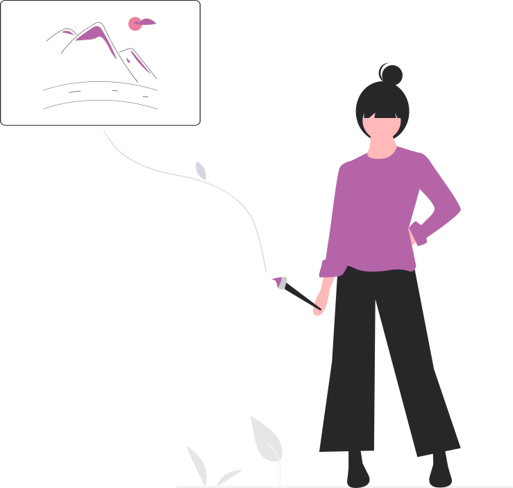
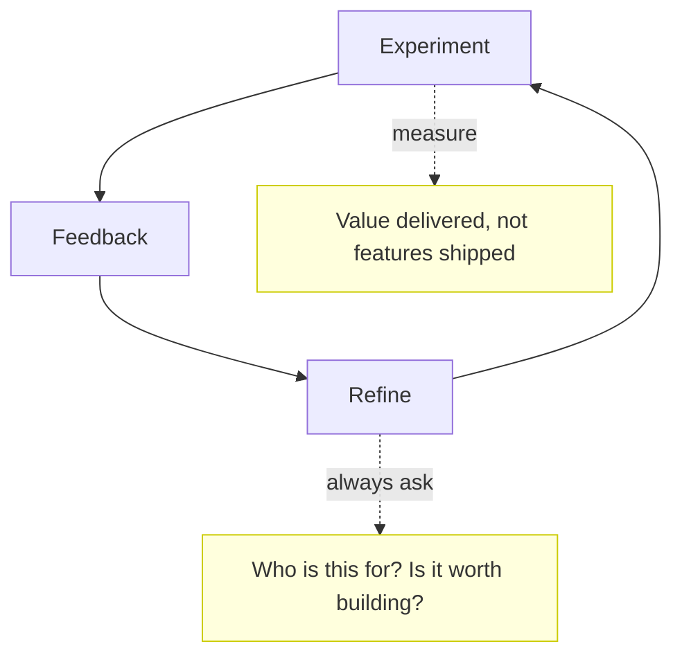
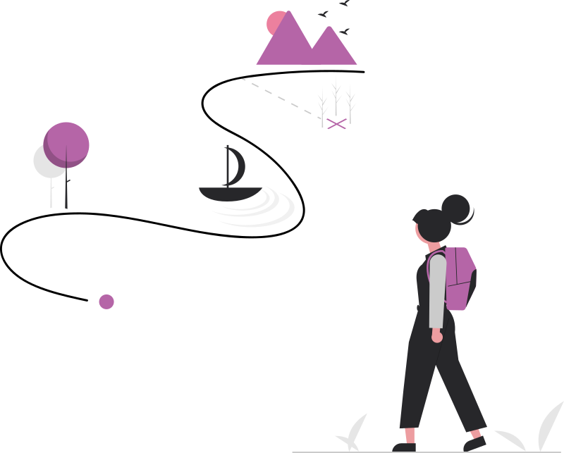

# Chapter 6 — Mastery & Forward Practice

Surprisingly, my consulting skills are more in demand now than ever — not despite AI, but because of it. AI has democratised the production and dissemination of knowledge.. What clients now pay for is knowing what work to do — framing the ask, judging the result, verifying final outputs — which is exactly what the last five chapters have been teaching.

A book ends where a 道 should: not at a destination but at a practice you keep. So this closing chapter does four things. It looks back along the way travelled, chapter by chapter. It asks what stays human as the models keep improving. It reads the trend lines on where AI is heading — for the technology, for work, and for the societies both sit inside. And it ends with the loop you never stop running, and the first steps to take when you put the book down.

## 6.1 The Way Travelled

A 道 ends by looking back along the path, so here is the whole argument once more, chapter by chapter, as one walk.

Chapter 1 laid a deliberately unglamorous foundation: a large language model predicts the next token. Everything else follows from that one mechanism. Predicting text well forces the model to learn the structure of the world the text describes, which is why it can genuinely reason. Nothing in the mechanism checks truth, so it hallucinates with perfect confidence. And because its strength tracks the density of its training data, competence is jagged — an Olympiad gold one minute, a misread clock face the next. The working stance followed directly: treat the model as a loop, not an oracle, and stay responsible for what ships.

Chapter 2 took that loop to the desk. A prompt you would use again became a skill. Wrapping a skill in a self-check made it dependable, and the best of them became tools that other agents could call. Everything worth telling a model became Markdown, context and memory turned single sessions into work that compounds, and the confidence trap — fluent, agreeable, wrong — set the habit of checking before trusting. The chapter ended with a personal operating model: plays, preferences, and a daily loop, assembled one working part at a time.

Chapter 3 turned those parts into software. Three real projects, each begun from a sentence, showed a non-programmer shipping working systems. They also showed why the craft is *intent, context, expectations*: say what the system is for and how you will know it is right, then leave the how to the agent. Over-specify the how and you fight the tool's strength; refuse to own the result and you ship slop that nobody vouched for. Verification settled at the boundary, and the work itself left the editor.

Chapter 4 scaled one agent to many and found the human at the centre of the fleet. The disciplines split three ways: what the human must bring (intent, judgement, accountability, independence of mind), what the agent system must provide (harness, context and memory, orchestration, loops, evaluation), and what the two together require (division of labour, delegation and review, presence, calibrated trust). Its inversion is the hinge of the whole book: the better the agents get, the more the human disciplines matter, because your judgement becomes the limiting factor.

Chapter 5 was the duty that follows. Responsibility runs in a chain from the labs that govern their models, through the laws now arriving around the world and the standards that make compliance checkable, into the enterprise, and finally to a person with a name. Capability can be delegated; responsibility cannot.

| Chapter | The discipline | The sentence to keep |
| --- | --- | --- |
| 1 · Foundations | A loop, not an oracle | It predicts; it does not know |
| 2 · Productivity | Build the system around the model | Turn what you know into Markdown, one clear ask at a time |
| 3 · Software | Intent, context, expectations | Say what and how you'll check it; leave the how to the agent |
| 4 · Disciplines | Manage the fleet; keep the judgement | The better the agents, the more the human matters |
| 5 · Responsibility | The duty behind the capability | Capability can be delegated; responsibility cannot |

: The book in one line per chapter — each discipline and the sentence to carry from it. {#tbl-recap}

That is the recap, and it is the easy part of a retrospective. The harder part is deciding which of these disciplines will still matter in a few years — and that depends on what the models can and cannot take over.

## 6.2 What Stays Human

Chapter 1 observed that we all draw on the same handful of frontier models, and every release narrows the gaps between them. When everyone holds the same tool, the difference between professionals has to live somewhere the tool is not. Three bodies of evidence, gathered over the course of writing this book, say where: in your expertise, in your judgement about when to trust the machine, and in the thinking you keep doing for yourself.

{#fig-human-edge}

### 6.2.1 The Human Edge

As model quality converges, advantage moves to what cannot be downloaded: tacit expertise — the engineer or analyst who has sat with the real problem long enough to know why it matters and what "right" looks like there. The pattern in the data is augmentation, not replacement, and the firms that over-automated and then quietly rehired their seasoned staff make the point in reverse ([Stanford HAI, *The AI index 2026 annual report*, 2026](https://hai.stanford.edu/ai-index/2026-ai-index-report)). There is a subtlety in who gains most, and it repays a careful reading. Measured productivity gains skew to novices: in one of the best-known field studies, an AI assistant lifted new customer-support agents far more than veterans, because the model had been trained on what the veterans already did — it packaged their expertise and handed it to beginners ([Brynjolfsson et al., *Generative AI at work*, 2023](https://www.nber.org/papers/w31161)). The expertise came first, and the tool only passed it along; the expertise is the thing worth having. And expertise now buys something it never could: the subject-matter expert who can say precisely what a system is for finally has a way to build it, as Chapter 3 showed — provided they keep enough judgement to steer.

The split between augmentation and automation is visible in wages, not just anecdotes. Studying US occupations from 2015 to 2022, Damien Marguerit separated AI that augments a job from AI that automates it, and found the two pull in opposite directions ([Marguerit, *Augmenting or automating labor? The effect of AI development on new work, employment, and wages*, 2025](https://arxiv.org/abs/2503.19159)). A one-standard-deviation rise in exposure to augmenting AI came with about 3.1% higher employment and higher wages for higher-skilled workers. The same rise in automating AI came with roughly 7.7% lower hourly wages for lower-skilled ones. The same technology, aimed differently, lifts one group and displaces another. Which side you land on is partly a choice: it depends on whether the tool is set up to extend your judgement or to replace your task.

You keep the edge by staying close to real problems and owning intent and judgement. You lose it — collectively — by hollowing out the junior pipeline that produces tomorrow's seniors. You save on this year's salaries, and then a decade on you find there is nobody ready to promote into the senior roles. That risk now has a measured shape. Across 11,097 open-source repositories, adopting coding agents left the number of human contributors flat, but cut the share of newcomers by 3.7 percentage points and deepened the review burden on maintainers by 5.3% — the authors call it *augmentation with dilution*: the entry rungs thinning while the load on seniors climbs ([Zhang et al., *Augmentation with dilution: Human contributor ecosystems after AI coding agent adoption*, 2026](https://arxiv.org/abs/2606.26289)). The measurement is in software because commits are easy to count, but the mechanism is general. Every field that grows its seniors by handing juniors the work AI now absorbs faces the same thinning — junior analysts, associates, and research assistants alike.

There is an inner edge as well as an organisational one: your sense of your own judgement, and AI erodes it twice over. First, it lifts task scores while flattening metacognition, so strong and weak performers end up equally — and wrongly — sure of themselves; unsettlingly, the more someone knows about AI, the *worse* their self-assessment tends to become ([Fernandes et al., *AI makes you smarter but none the wiser: The disconnect between performance and metacognition*, 2026](https://doi.org/10.1016/j.chb.2025.108779)). Second, your confidence drifts to match whatever confidence the model projects, and the pull lingers even after the model is gone ([J. Li et al., *As confidence aligns: Effect of AI confidence on human self-confidence in human–AI decision making*, 2025](https://arxiv.org/abs/2501.12868)). Protecting the human edge therefore means protecting your calibration. Form a view of your own before you ask the model, and treat its certainty as one more input to weigh rather than a verdict to accept.

You can see the same choice in this book's own pictures. The illustrations are the work of a human illustrator, Katerina Limpitsouni. I picked them from her open-source set and recoloured them to fit these pages, rather than asking a model to generate one for each section. A model could have done that in seconds, and for free. But deciding which picture belongs beside which argument — and whether it earns a place at all — is a matter of taste, and taste is the human part this chapter keeps coming back to. So I chose them by hand, on purpose.

### 6.2.2 When the Pair Works

It is tempting to assume that a person and an AI together must beat either alone. The evidence says otherwise, and the correction matters. Michelle Vaccaro, Abdullah Almaatouq, and Thomas Malone pooled 106 experiments — 370 effect sizes — and found that, on average, human–AI teams performed *worse* than the better of the human alone or the AI alone: a small but real negative effect, a Hedges' *g* of −0.23 ([Vaccaro et al., *When combinations of humans and AI are useful: A systematic review and meta-analysis*, 2024](https://doi.org/10.1038/s41562-024-02024-1)). The losses clustered in decision-making tasks; the gains, where they appeared, were in content creation. Synergy, in other words, does not happen by itself; somebody has to design the pairing for it.

The pattern underneath tells you when to expect it. Combinations helped when the human alone was the stronger of the two, and hurt when the AI alone was stronger — because in that second case the human's remaining job is to know when to defer, and people are bad at it. Jingshu Li and colleagues showed why. When an AI reports how confident it is, users mostly cannot tell whether that confidence is earned: only about a quarter noticed when a model was miscalibrated, against three-quarters who could read a well-calibrated one ([J. Li et al., *Understanding the effects of miscalibrated AI confidence on user trust, reliance, and decision efficacy*, 2024](https://arxiv.org/abs/2402.07632)). An overconfident model pushed people into over-reliance; an underconfident one made them ignore good advice; and simply disclosing the miscalibration did not repair the decisions.

So the edge is calibration on both sides of the pairing. It works when the human can judge whether to trust a given answer, which means keeping enough independent expertise to check the machine rather than defer to it. This is the §6.2.1 warning about your own judgement, raised to the level of the team: how confident the model sounds tells you something about the model, and nothing about the world. Build the pairing so the person works on the parts they are better at and checks the parts the model is better at, always remembering that a confident answer and a correct one are two different things.

### 6.2.3 Keeping Your Own Mind

There is a cost to offloading thinking that never shows up on the finished page. Nataliya Kosmyna and colleagues at MIT had people write essays in three conditions — with an LLM, with a search engine, and unaided — while recording their brain activity. The unaided writers showed the strongest, most distributed neural connectivity; the search users less; the LLM users least ([Kosmyna et al., *Your brain on ChatGPT: Accumulation of cognitive debt when using an AI assistant for essay writing task*, 2025](https://arxiv.org/abs/2506.08872)). More telling was memory and ownership: over 83% of the LLM writers could not quote a single sentence from the essay they had just produced, and asked later to write unaided, they stayed disengaged. The authors call the effect *cognitive debt* — fluency now, borrowed against understanding later. It is a small, preliminary study, and a formal commentary argues it is underpowered and that its brain-connectivity measure cannot carry the causal story ([Stanković et al., *Commentary on Kosmyna et al. (2025), "Your brain on ChatGPT"*, 2026](https://arxiv.org/abs/2601.00856)) — so treat the exact numbers as provisional; the direction is what matters.

The pattern shows up at population scale too. Michael Gerlich surveyed 666 people and found frequent AI-tool use correlated with lower critical-thinking scores, an effect statistically carried by cognitive offloading — handing the mental work to the tool ([Gerlich, *AI tools in society: Impacts on cognitive offloading and the future of critical thinking*, 2025](https://doi.org/10.3390/soc15010006)). It was strongest in the youngest users and softened by more education. Both studies are correlational, and neither proves the tool makes you worse. But the mechanism is plausible and worth guarding against: a muscle you stop using weakens.

The antidote is not to refuse the tool but to keep practising the very thing it can do for you. Decades before any of this, Anders Ericsson and colleagues showed that expert performance is built by *deliberate practice* — effortful, feedback-driven repetition of exactly the hard part — not by talent or time served; their top violinists had accumulated on the order of ten thousand hours of it ([Ericsson et al., *The role of deliberate practice in the acquisition of expert performance*, 1993](https://doi.org/10.1037/0033-295X.100.3.363)). AI removes exactly the effortful struggle that deliberate practice depends on. Let it take every hard step and you stop building the judgement that lets you supervise it. So keep some of the hard part for yourself: write the first draft, work the problem before you ask, and reserve the reps that grow the skill you most want to keep.

## 6.3 Where AI Is Heading

Every chapter so far has described the tools as they are. This section reads the trend lines, because the measurements are now good enough to be worth reading, and the disagreements among the experts are themselves worth understanding.

Start with the clearest line we have. Researchers at METR asked a simple question: how long a task — measured by how long it takes a skilled human — can a model finish reliably? They call it the *time horizon*: the task length a model completes about half the time. Plotted against the calendar, it makes a straight line on a log scale. The horizon has been doubling roughly every seven months since 2019, from tasks that took a human seconds, to minutes, to the better part of an afternoon — their strongest model managed tasks around the two-hour mark ([Kwa et al., *Measuring AI ability to complete long software tasks*, 2025](https://arxiv.org/abs/2503.14499)). If the line holds — a real if, and the authors are careful about it — the horizon reaches a full working day within a few years. It is the most concrete way anyone has found to say what "the models are getting better" actually means.

There is fuel for a few more doublings. Epoch AI, an institute that tracks the inputs to AI rather than selling its outputs, examined whether training can keep scaling and concluded that runs about ten thousand times larger than GPT-4 are probably feasible by 2030 — the same size of leap again as GPT-2 to GPT-4 ([Epoch AI, *Can AI scaling continue through 2030?*, 2024](https://epoch.ai/blog/can-ai-scaling-continue-through-2030)). What would stop it, if anything does, is physics and supply chains: electrical power first, then chip manufacturing, then training data, then hardware speed, in that order. There is fuel left, in other words — but for the first time you can see the gauge.

Whether more scale delivers *general* intelligence is exactly where the people who build these systems stop agreeing. A survey of 2,778 published AI researchers put the year they judged "high-level machine intelligence" — machines outperforming humans at every task — more likely than not at around 2047, thirteen years sooner than the same community had guessed only a year earlier; and between a third and half of respondents gave at least a one-in-ten chance to an outcome as bad as human extinction ([Grace et al., *Thousands of AI authors on the future of AI*, 2024](https://arxiv.org/abs/2401.02843)). Yet when the field's main professional society convened its own panel in 2025, 76% of the researchers it surveyed said that simply scaling up today's methods was "unlikely" or "very unlikely" to get there at all ([AAAI, *Presidential panel on the future of AI research*, 2025](https://aaai.org/wp-content/uploads/2025/03/AAAI-2025-PresPanel-Report-FINAL.pdf)). Hold those two results side by side and the message is that there is no consensus timeline: the experts are all over the map, and anyone quoting a single confident date is selling something.

It also helps to stop treating "AGI" as a line the field crosses on some particular Tuesday. A team at Google DeepMind proposed a more useful frame: levels of AGI, graded on two axes — how *general* the ability and how *deep* — with today's best models placed on the bottom rung, "emerging AGI": as good as or somewhat better than an unskilled human across many tasks, but short of the next level, matching a *skilled* adult on most work ([Morris et al., *Levels of AGI for operationalizing progress on the path to AGI*, 2023](https://arxiv.org/abs/2311.02462)). On that map the interesting question stops being "is it AGI yet" and becomes "which cell is it in, and which tasks just moved."

The honest bookends are worth seeing side by side, because they are the two futures the argument runs between. Dario Amodei — who, as chief executive of Anthropic, has every reason to paint the ceiling high — sketches a "country of geniuses in a datacenter" compressing fifty to a hundred years of scientific progress into five or ten: most cancers cured, the human lifespan doubled ([Amodei, *Machines of loving grace*, 2024](https://www.darioamodei.com/essay/machines-of-loving-grace)). Against him, the Princeton computer scientists Arvind Narayanan and Sayash Kapoor argue for treating AI as *normal technology* — as transformative as electricity or the internet, and just as slow to land, because what gates impact is not raw capability but the plodding pace at which organisations and institutions adopt anything ([Narayanan & Kapoor, *AI as normal technology*, 2025](https://knightcolumbia.org/content/ai-as-normal-technology)). Their historical anchor is worth keeping: the electric motor was available for some forty years before it showed up in productivity statistics, because factories had to be rebuilt around it first. Capability is not the same thing as impact, and the gap between the two is measured in how long institutions take to catch up — decades, on the dynamo's precedent. Nobody knows which bookend this ends nearer to — and the way of working this book teaches survives either way, because it invests in judgement rather than in a bet on the timeline.

## 6.4 The Future of Work

The human edge of §6.2 was one person's answer. This section asks the same question for the labour market as a whole — which jobs are touched, what people actually do with the tools, what the early employment data shows, and how big the whole thing really is.

{#fig-future-work}

Which jobs does this touch? The most-cited attempt to answer put human raters and GPT-4 side by side, scoring, for each occupation, what share of its tasks an LLM could do at least twice as fast without losing quality. The headline: around 80% of US workers have at least 10% of their tasks exposed, and about 19% have more than half exposed ([Eloundou et al., *GPTs are GPTs: An early look at the labor market impact potential of large language models*, 2024](https://arxiv.org/abs/2303.10130)). The twist that makes this wave different from the last is *who* is exposed. Past automation came for routine manual and clerical work; this time exposure rises with wage and education. The knowledge workers who felt safest are the most exposed — which is precisely why this book is aimed at them.

Exposure is potential, not fate, so it matters what people actually do with these tools. Anthropic, mining millions of conversations with its own Claude models, reported that real usage tilts towards *augmentation* over *automation* — roughly 57% of activity was a person working with the model rather than handing a task off wholesale — and clusters heavily in software and writing ([Anthropic, *The Anthropic economic index*, 2025f](https://www.anthropic.com/news/the-anthropic-economic-index)). Treat the exact split gently: it is one vendor measuring its own product, and coders are over-represented among early adopters. But the direction matches everything else in this book — most useful AI work today involves a human staying in the loop rather than handing the task off entirely.

The first real employment data has arrived, and it lands on the young. Studying payroll records for millions of US workers, Erik Brynjolfsson and colleagues found that since generative AI spread in late 2022, employment for early-career workers aged 22 to 25 in the most AI-exposed occupations fell about 16% relative to everyone else — while older workers in the same jobs, and workers in less-exposed jobs, held steady or grew ([Brynjolfsson, Chandar & Chen, *Canaries in the coal mine? Six facts about the recent employment effects of artificial intelligence*, 2025](https://digitaleconomy.stanford.edu/publications/canaries-in-the-coal-mine/)). It is the thinning of the entry rungs that §6.2.1 warned about, now visible in national data: the tasks a junior once cut their teeth on are the tasks AI absorbs first. The title's metaphor is apt and uneasy — the young in exposed fields are the canaries.

So is this a catastrophe or a rounding error? Start at the sober end of the range. The economist Daron Acemoglu, running the same task-exposure logic through a macroeconomic model, estimates AI will lift total factor productivity — the extra output squeezed from the same labour and capital — by *at most* about 0.66% over ten years, a fraction of the 7% GDP boom some banks forecast ([Acemoglu, *The simple macroeconomics of AI*, 2024](https://www.nber.org/papers/w32487)). His reason is simple once said: being *exposed* to AI and being *cheaply automatable* by it are different things, and only a modest slice of tasks clears both bars any time soon. The World Economic Forum, surveying more than a thousand employers about what they *expect*, tells a busier story — a churn of 22% of jobs by 2030, 170 million roles created and 92 million displaced, a net gain of 78 million ([World Economic Forum, *Future of jobs report 2025*, 2025](https://www.weforum.org/publications/the-future-of-jobs-report-2025/)) — though that is what bosses predict, not what has happened, and predictions of this kind have a patchy record. The forecasts disagree so wildly because they measure different things. Task exposure, real usage, actual employment, and dollar output are four separate questions that keep getting reported under one headline:

| The question | Source | What it found |
| --- | --- | --- |
| Task exposure | Eloundou et al., 2024 | ~80% of workers have at least 10% of tasks exposed; ~19% over half |
| Real usage | Anthropic, 2025f | ~57% of activity is augmentation, not wholesale automation |
| Actual employment | Brynjolfsson, Chandar & Chen, 2025 | early-career workers in exposed jobs down ~16% since 2022 |
| Dollar output | Acemoglu, 2024 | total factor productivity up *at most* ~0.66% over a decade |

: The four questions the "future of work" forecasts each answer, and what each found. {#tbl-futures}

There is an optimistic reading worth taking seriously, precisely because its author refuses to call it a forecast. David Autor argues that AI could — if steered well — help *rebuild* the middle class that earlier automation hollowed out, by extending expert judgement to workers without elite credentials: the nurse practitioner safely doing more of what once required a doctor is his anchor example ([Autor, *Applying AI to rebuild middle class jobs*, 2024](https://www.nber.org/papers/w32140)). He is explicit that this is a possibility contingent on choices, not a property of the technology. Which returns the question to where §6.2 left it: whether AI augments you or replaces you depends partly on how the tool is set up, and partly on whether you keep the judgement this chapter has been describing. If the labour market keeps shifting, the augmented side of that line is the safer place to stand.

## 6.5 AI and Society

Work is where AI touches most professionals first, but not where its evolution matters most. Step back far enough and the questions change: what fluent machines do to a society's information and trust, what they do to learning, and who captures the gains.

Begin with a gap in perception, because it colours everything else. When Pew surveyed both the US public and AI experts, 56% of the experts expected AI to have a positive effect on the country over the next twenty years — against just 17% of the public ([Pew Research Center, *How the US public and AI experts view artificial intelligence*, 2025](https://www.pewresearch.org/internet/2025/04/03/how-the-us-public-and-ai-experts-view-artificial-intelligence/)). The public is more worried than excited and expects job losses; the experts are the reverse. Strikingly, the two groups agree on the governance: both want more control over how AI is used in their lives, and both doubt the government will regulate it well. A technology arriving this fast and trusted this unevenly is a governance problem before it is a technical one — which is Chapter 5's argument, seen from the street.

Part of the public's unease is well-founded, because these systems are quietly good at changing minds. In a controlled debate experiment, GPT-4 given a few facts about its opponent — age, politics, education — was markedly better at shifting views than a human opponent with the same information, raising the odds of moving someone by more than 80% ([Salvi et al., *On the conversational persuasiveness of large language models*, 2025](https://arxiv.org/abs/2403.14380)). The unsettling detail is that it worked even when people correctly guessed they were arguing with a machine. A tool that out-persuades humans at no cost and infinite scale, personalised to each target, is a genuinely new thing in the information environment — the same fluency that flatters your draft can be pointed at an electorate.

The subtlest cost lands on learning, where the struggle a tool removes is the very thing that was doing the teaching. In a trial with about a thousand high-school maths students, those given unrestricted GPT-4 to practise with did far better *during* practice — and then scored 17% *worse* than the no-AI group on an exam where the AI was taken away ([Bastani et al., *Generative AI without guardrails can harm learning*, 2025](https://doi.org/10.1073/pnas.2422633122)). The tool had become a crutch that walked for them. The crucial finding is what fixed it: a version rebuilt as a tutor — hints, not answers — erased the harm entirely. Whether the tool taught or harmed came down to the guardrails, not the access. It is the lesson §6.2.3 drew from brain activity, repeated with exam scores and, this time, a remedy attached.

The thread running through all of it is that AI is a lever, and a lever multiplies whatever force you already bring. A field experiment with Kenyan entrepreneurs made this stark: an AI business mentor helped the already-strong performers by around 15% while leaving the weakest about 8% *worse* off ([Otis et al., *The uneven impact of generative AI on entrepreneurial performance*, 2023](https://www.hbs.edu/faculty/Pages/item.aspx?num=65159)). The gap did not come from the advice — both groups received good advice — but from which advice each chose to act on: the strong performers could tell the useful counsel from the rest. That is the society-level echo of this whole book. AI rewards the person who can already judge its output and quietly penalises the one who cannot, so the same tool can widen the gap between them even as it lifts the average. The task is to be among the discerning — and to build the guardrails, teaching, and institutions that help more people join them.

## 6.6 A Snapshot of the Field

The last sections read the evidence; this one reads the room. Another way to see where things are going is to watch where the people building these systems put their attention. In the middle of 2026 the largest gathering of the practitioner community, the AI Engineer World's Fair, built its keynote programme around a single idea — the *software factory*, the autonomous, agent-run software pipeline Chapter 4 examined in §4.2 — with sessions from Microsoft, OpenAI, Hugging Face, and the open-weight labs behind models like GLM and MiniMax ([AI Engineer, *Software factories and keynotes*, 2026](https://www.youtube.com/watch?v=htM02KMNZnk)). A conference bill is a snapshot of what an enthusiastic, self-selected crowd is excited about, not a measure of what works. Even so, it tells you what these engineers now spend their days on: fewer of them are perfecting a single prompt, and more are trying to keep a fleet of agents running.

One idea from the opening is worth carrying, because it names something this book keeps circling. Swix, who runs the conference, called the craft *loop-stacking*: the core skill, he argued, is knowing which loop you are working in — a single prompt, a self-checking task, an agent, a fleet — and choosing when to step up to the next one. He told it as a climb: in the beginning there was the token, then the chat, then tools, then goals, and now the automations and factories that stack loops on top of loops. That is the same ladder Chapter 1 drew from chatbot to agent ecosystem, seen from the floor of a very loud room, and it is the loop this chapter closes on. Like the rest of this snapshot, it is a practitioner's enthusiasm rather than a tested claim — worth hearing for the vantage point it gives, not for any proof it offers.

## 6.7 Continuous Refinement

The book closes on the idea it opened with: a path. Treat your practice as a loop — experiment, get feedback, refine, repeat — and keep AI human-centred at each turn. The evidence is consistent that the gain comes not from the tool but from redesigning work around it, which is why the high performers move pilots into production while others count demos ([McKinsey & Company, *The state of AI*, 2025](https://www.mckinsey.com/capabilities/quantumblack/our-insights/the-state-of-ai)). It is the same finding Narayanan and Kapoor scaled up to history in §6.3: the factory had to be rebuilt around the electric motor before the motor paid.

The same loop scales up from a person to a whole company. Microsoft's chief executive, Satya Nadella, argues that a firm's real asset in this era is not the model it rents but the *learning loop* it builds on top — the workflows, evaluations, and accumulated judgement that improve with each use — because "you can offload a task, or even a job, but you can never offload your learning" ([Nadella, *A frontier without an ecosystem is not stable*, 2026](https://x.com/satyanadella/status/2066182223213293753)). His striking claim is that as a company's AI capability grows, its people become *more* valuable rather than less, since it takes human judgement to point the machine at the goals that matter — "without human direction, you have compute running in circles." Read it as an emerging industry view rather than a settled one — Nadella runs a company that sells the tools he is describing — but the shape of his argument is the book's own, drawn one level larger. The model is the part a company can buy from anyone. What it builds around the model — the way its people and its systems get better together with each project — is the part a rival cannot copy.

```mermaid
flowchart TB
    E[Experiment] --> F[Feedback]
    F --> R[Refine]
    R --> E
    R -.->|always ask| Q["Who is this for? Is it worth building?"]
    E -.->|measure| V[Value delivered, not features shipped]
    classDef ask fill:#ffd,stroke:#cc0
    class Q,V ask
```

: The refinement loop — experiment, feedback, refine — with the two questions that keep it honest. {#dia-refine}

No method will be the last word, and that is the point of treating practice as a path rather than a destination. Vibe coding was the style of one year and looked spent within six months; spec-driven development began to buckle inside a year. The pattern is older and wider than software: business process re-engineering, Six Sigma, and a long line of agile relabellings were each sold as the last word, and each was quietly folded into whatever came next. What survives every relabelling is the discipline underneath — staying close to the work, holding the intent, asking what is worth building. That discipline is older than any of the frameworks. It is the Unix philosophy — do one thing well, compose small pieces, separate the *what* from the *how* — re-run on a tool that can now write the implementation itself, with a human kept at the centre (Chapter 1). So put your effort into the discipline underneath rather than into whichever framework is current this year. Build the skills that let you direct the machine, instead of racing it to produce more, and refuse to keep score by tokens burned — a number that says how busy the machines were, not whether anything useful got made. One developer's single month ran to 603 billion tokens ([Ahuja, *Spec-driven development is also breaking the fifty-year-old iron triangle*, 2026c](https://howtoarchitect.io/78431acba162?sk=cd2a36f452af96ccbfbcfcdeaa92ec06); [Ahuja, *Spec-driven development isn’t broken. It will collapse*, 2026d](https://howtoarchitect.io/c00609f72496?sk=2da01d7d2abfb5bc0acaed7050a0e797)).

Refinement has a collective hazard worth naming, because it echoes Chapter 5's convergence problem and §6.5's lever. Anil Doshi and Oliver Hauser had writers work with and without AI story ideas, and found a two-sided result ([Doshi & Hauser, *Generative AI enhances individual creativity but reduces the collective diversity of novel content*, 2024](https://doi.org/10.1126/sciadv.adn5290)). AI raised the novelty of an individual writer's story by 5 to 8%, and helped the least creative writers most. But the AI-assisted stories were measurably more like one another, drifting towards the same suggestions. Each writer was better off; the pool of stories was narrower. The defence is the one this book keeps returning to. Keep your own voice in the loop, and use the machine to sharpen a view you brought rather than to supply one. A tool that makes everyone sound alike carries a cost, however convenient it feels.

Measure value, not output. Counting features shipped feels good, and it quietly skips the question of whether anyone needed them. The way of AI turns out to be one question, asked again and again — who is this for, and is it worth building — until it hardens into habit. That habit, more than any model, is what AI-dō is for.

## 6.8 Shuhari — The Way From Here

A 道 has a shape to its learning, and the arts that end in 道 named it long before software did: *shuhari* — 守 *shu*, keep to the form; 破 *ha*, break from it; 離 *ri*, leave it behind and move freely ([Endō, *Shu-ha-ri*, 1998](https://da2el.wordpress.com/2018/06/20/shu-ha-ri-endo-seishiro-aikido-saku-dojocho/)). Read this book as its *shu*. Follow the forms closely at first — one clear ask at a time, intent kept apart from implementation, Markdown as the medium, verification at the boundaries, a human answerable for what ships. As your judgement grows and the tools shift beneath you, enter *ha*: bend the forms, drop the ones that stop fitting, keep what holds. In time comes *ri*, where the forms are instinct and you invent your own — which is only the promise of Chapter 1 come round again: learn the philosophy, and the methods become yours to invent.

{#fig-shuhari}

The rest is yours to begin, and the first steps are small and specific. First, take one real task you already do and run it as a loop — draft, check, refine — instead of waiting on a perfect prompt. Second, start an LLM wiki: put the context you keep re-explaining into a few Markdown notes the model can draw on. Third, add one verification step at the boundary that matters most, and name the person answerable for what leaves it. Fourth, before you open a chat window on anything that counts, write your own view down first, so you can tell the model's confidence from your own. Fifth, keep a second model on the bench, and ask of everything you make: who is this for, and is it worth building?

None of that rests on the tools. It rests on the method you build around them, on your judgement about which question is worth asking, and on the care you bring to the people your work touches. The tools will keep changing — that is the one safe prediction — and the way does not. Begin.

## References

AAAI. (2025). *AAAI 2025 presidential panel on the future of AI research*. Association for the Advancement of Artificial Intelligence. [https://aaai.org/wp-content/uploads/2025/03/AAAI-2025-PresPanel-Report-FINAL.pdf](https://aaai.org/wp-content/uploads/2025/03/AAAI-2025-PresPanel-Report-FINAL.pdf)

Acemoglu, D. (2024). *The simple macroeconomics of AI* (NBER Working Paper No. 32487). National Bureau of Economic Research. [https://www.nber.org/papers/w32487](https://www.nber.org/papers/w32487)

Ahuja, K. V. (2026c). *Spec-driven development is also breaking the fifty-year-old iron triangle*. Activated Thinker (Medium). [https://howtoarchitect.io/78431acba162?sk=cd2a36f452af96ccbfbcfcdeaa92ec06](https://howtoarchitect.io/78431acba162?sk=cd2a36f452af96ccbfbcfcdeaa92ec06)

Ahuja, K. V. (2026d). *Spec-driven development isn’t broken. It will collapse*. Activated Thinker (Medium). [https://howtoarchitect.io/c00609f72496?sk=2da01d7d2abfb5bc0acaed7050a0e797](https://howtoarchitect.io/c00609f72496?sk=2da01d7d2abfb5bc0acaed7050a0e797)

AI Engineer. (2026). *WF2026: Software factories & keynotes ft. Microsoft, OpenAI, OpenClaw, Z.ai (GLM), MiniMax, HF* [Conference livestream]. YouTube. [https://www.youtube.com/watch?v=htM02KMNZnk](https://www.youtube.com/watch?v=htM02KMNZnk)

Amodei, D. (2024). *Machines of loving grace: How AI could transform the world for the better*. [https://www.darioamodei.com/essay/machines-of-loving-grace](https://www.darioamodei.com/essay/machines-of-loving-grace)

Anthropic. (2025f). *The Anthropic economic index*. [https://www.anthropic.com/news/the-anthropic-economic-index](https://www.anthropic.com/news/the-anthropic-economic-index)

Autor, D. (2024). *Applying AI to rebuild middle class jobs* (NBER Working Paper No. 32140). National Bureau of Economic Research. [https://www.nber.org/papers/w32140](https://www.nber.org/papers/w32140)

Bastani, H., Bastani, O., Sungu, A., Ge, H., Kabakcı, Ö., & Mariman, R. (2025). *Generative AI without guardrails can harm learning: Evidence from high school mathematics*. Proceedings of the National Academy of Sciences, 122(26). [https://doi.org/10.1073/pnas.2422633122](https://doi.org/10.1073/pnas.2422633122)

Brynjolfsson, E., Chandar, B., & Chen, R. (2025). *Canaries in the coal mine? Six facts about the recent employment effects of artificial intelligence*. Stanford Digital Economy Lab. [https://digitaleconomy.stanford.edu/publications/canaries-in-the-coal-mine/](https://digitaleconomy.stanford.edu/publications/canaries-in-the-coal-mine/)

Brynjolfsson, E., Li, D., & Raymond, L. R. (2023). *Generative AI at work* (NBER Working Paper No. 31161). National Bureau of Economic Research. [https://www.nber.org/papers/w31161](https://www.nber.org/papers/w31161)

Doshi, A. R., & Hauser, O. P. (2024). *Generative AI enhances individual creativity but reduces the collective diversity of novel content*. Science Advances, 10(28), eadn5290. [https://doi.org/10.1126/sciadv.adn5290](https://doi.org/10.1126/sciadv.adn5290)

Eloundou, T., Manning, S., Mishkin, P., & Rock, D. (2024). *GPTs are GPTs: An early look at the labor market impact potential of large language models*. Science, 384(6702), 1306–1308. [https://arxiv.org/abs/2303.10130](https://arxiv.org/abs/2303.10130)

Endō, S. (1998). *Shu-ha-ri* [Essay]. Aikidō Saku Dōjō. [https://da2el.wordpress.com/2018/06/20/shu-ha-ri-endo-seishiro-aikido-saku-dojocho/](https://da2el.wordpress.com/2018/06/20/shu-ha-ri-endo-seishiro-aikido-saku-dojocho/)

Epoch AI. (2024). *Can AI scaling continue through 2030?* [https://epoch.ai/blog/can-ai-scaling-continue-through-2030](https://epoch.ai/blog/can-ai-scaling-continue-through-2030)

Ericsson, K. A., Krampe, R. T., & Tesch-Römer, C. (1993). *The role of deliberate practice in the acquisition of expert performance*. Psychological Review, 100(3), 363–406. [https://doi.org/10.1037/0033-295X.100.3.363](https://doi.org/10.1037/0033-295X.100.3.363)

Fernandes, D., et al. (2026). *AI makes you smarter but none the wiser: The disconnect between performance and metacognition*. Computers in Human Behavior, 168, 108779. [https://doi.org/10.1016/j.chb.2025.108779](https://doi.org/10.1016/j.chb.2025.108779)

Gerlich, M. (2025). *AI tools in society: Impacts on cognitive offloading and the future of critical thinking*. Societies, 15(1), 6. [https://doi.org/10.3390/soc15010006](https://doi.org/10.3390/soc15010006)

Grace, K., Stewart, H., Sandkühler, J. F., Thomas, S., Weinstein-Raun, B., & Brauner, J. (2024). *Thousands of AI authors on the future of AI*. AI Impacts. [https://arxiv.org/abs/2401.02843](https://arxiv.org/abs/2401.02843)

Kosmyna, N., Hauptmann, E., Yuan, Y. T., Situ, J., Liao, X.-H., Beresnitzky, A. V., Braunstein, I., & Maes, P. (2025). *Your brain on ChatGPT: Accumulation of cognitive debt when using an AI assistant for essay writing task*. arXiv. [https://arxiv.org/abs/2506.08872](https://arxiv.org/abs/2506.08872)

Kwa, T., West, B., Becker, J., Deng, A., Kinniment, M., Rush, N., et al. (2025). *Measuring AI ability to complete long software tasks*. METR. [https://arxiv.org/abs/2503.14499](https://arxiv.org/abs/2503.14499)

Li, J., et al. (2025). *As confidence aligns: Effect of AI confidence on human self-confidence in human–AI decision making*. Proceedings of the 2025 CHI Conference on Human Factors in Computing Systems. [https://arxiv.org/abs/2501.12868](https://arxiv.org/abs/2501.12868)

Li, J., Yang, Y., Zhang, R., Liao, Q. V., Song, T., Xu, Z., & Lee, Y.-C. (2024). *Understanding the effects of miscalibrated AI confidence on user trust, reliance, and decision efficacy*. arXiv. [https://arxiv.org/abs/2402.07632](https://arxiv.org/abs/2402.07632)

Marguerit, D. (2025). *Augmenting or automating labor? The effect of AI development on new work, employment, and wages*. arXiv. [https://arxiv.org/abs/2503.19159](https://arxiv.org/abs/2503.19159)

McKinsey & Company. (2025). *The state of AI*. [https://www.mckinsey.com/capabilities/quantumblack/our-insights/the-state-of-ai](https://www.mckinsey.com/capabilities/quantumblack/our-insights/the-state-of-ai)

Morris, M. R., Sohl-Dickstein, J., Fiedel, N., Warkentin, T., Dafoe, A., Faust, A., Farabet, C., & Legg, S. (2023). *Levels of AGI for operationalizing progress on the path to AGI*. [https://arxiv.org/abs/2311.02462](https://arxiv.org/abs/2311.02462)

Nadella, S. (2026). *A frontier without an ecosystem is not stable*. X (formerly Twitter). [https://x.com/satyanadella/status/2066182223213293753](https://x.com/satyanadella/status/2066182223213293753)

Narayanan, A., & Kapoor, S. (2025). *AI as normal technology*. Knight First Amendment Institute, Columbia University. [https://knightcolumbia.org/content/ai-as-normal-technology](https://knightcolumbia.org/content/ai-as-normal-technology)

Otis, N. G., Clarke, R., Delecourt, S., Holtz, D., & Koning, R. (2023). *The uneven impact of generative AI on entrepreneurial performance* (Working Paper No. 24-042). Harvard Business School. [https://www.hbs.edu/faculty/Pages/item.aspx?num=65159](https://www.hbs.edu/faculty/Pages/item.aspx?num=65159)

Pew Research Center. (2025). *How the U.S. public and AI experts view artificial intelligence*. [https://www.pewresearch.org/internet/2025/04/03/how-the-us-public-and-ai-experts-view-artificial-intelligence/](https://www.pewresearch.org/internet/2025/04/03/how-the-us-public-and-ai-experts-view-artificial-intelligence/)

Salvi, F., Horta Ribeiro, M., Gallotti, R., & West, R. (2025). *On the conversational persuasiveness of large language models: A randomized controlled trial*. Nature Human Behaviour. [https://arxiv.org/abs/2403.14380](https://arxiv.org/abs/2403.14380)

Stanford Institute for Human-Centered AI. (2026). *The AI index 2026 annual report*. Stanford University. [https://hai.stanford.edu/ai-index/2026-ai-index-report](https://hai.stanford.edu/ai-index/2026-ai-index-report)

Stanković, M., Hirche, E., Kollatzsch, S., & Doetsch, J. N. (2026). *Commentary on Kosmyna et al. (2025), "Your brain on ChatGPT"*. arXiv. [https://arxiv.org/abs/2601.00856](https://arxiv.org/abs/2601.00856)

Vaccaro, M., Almaatouq, A., & Malone, T. (2024). *When combinations of humans and AI are useful: A systematic review and meta-analysis*. Nature Human Behaviour, 8(12), 2293–2303. [https://doi.org/10.1038/s41562-024-02024-1](https://doi.org/10.1038/s41562-024-02024-1)

World Economic Forum. (2025). *Future of jobs report 2025*. [https://www.weforum.org/publications/the-future-of-jobs-report-2025/](https://www.weforum.org/publications/the-future-of-jobs-report-2025/)

Zhang, Jiang, & Koziolek. (2026). *Augmentation with dilution: Human contributor ecosystems after AI coding agent adoption*. arXiv. [https://arxiv.org/abs/2606.26289](https://arxiv.org/abs/2606.26289)
