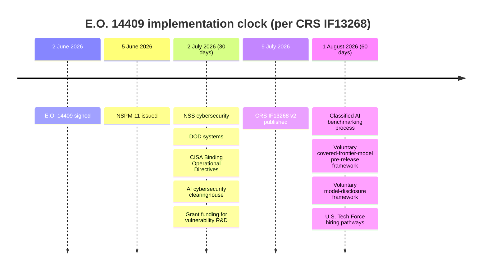

# Controlling Advanced Artificial Intelligence: Executive Order 14409 Explained — Summary

> [!NOTE]
> **Source status:** **Non-partisan legislative-branch analysis**, and that is the point of citing it. The Congressional Research Service is the Library of Congress's in-house research arm; it "serves as nonpartisan shared staff to congressional committees and Members of Congress" and writes for Members, not for the public and not for the Administration. So it sits *between* the White House's own framing of Executive Order 14409 and the advocacy criticism of it: CRS neither defends nor attacks the order, it explains what the order does, lists the deadlines, and names what Congress should worry about. Treat its "Considerations for Congress" as the closest thing available to a neutral gap analysis. Two limits to remember: (1) it is an **In Focus** brief — two pages, deliberately compressed, not a full report; and (2) it is a **snapshot**, VERSION 2 dated 9 July 2026 — a week after the order's 30-day deadlines fell due and three weeks before its 60-day deadlines — so several of the open questions it raises, including the missing definition of "covered frontier model", may since have been answered.
>
> **Source:** [crs-if13268-eo-14409-explained.md](../../sources/ai-governance/crs-if13268-eo-14409-explained.md) · local PDF: [crs-if13268-eo-14409-explained.pdf](../../sources/ai-governance/crs-if13268-eo-14409-explained.pdf) · Congressional Research Service (Chris Jaikaran, Laurie Harris, Kelley M. Sayler), *Controlling Advanced Artificial Intelligence: Executive Order 14409 Explained*, CRS In Focus IF13268, **VERSION 2 · NEW**, **9 July 2026**. Landing page: https://www.congress.gov/crs-product/IF13268 · PDF: https://www.congress.gov/crs_external_products/IF/PDF/IF13268/IF13268.2.pdf · Mirror: https://www.everycrsreport.com/reports/IF13268.html
>
> **Verified at source (1 August 2026):** title, product number IF13268, **version 2** (printed in the PDF footer as "IF13268 · VERSION 2 · NEW", matching the `IF13268.2.pdf` filename), date **9 July 2026** (PDF creation timestamp `D:20260709`, corroborated by the everycrsreport.com mirror), and the three named authors. The congress.gov HTML landing page returned **HTTP 403** to automated fetch; the PDF itself downloaded cleanly and is the copy summarised here.

## Abstract

A two-page CRS In Focus brief explaining **Executive Order 14409, *Promoting Advanced Artificial Intelligence Innovation and Security***, signed by President Trump on **2 June 2026**. CRS reads the order as pursuing two goals at once — accelerating AI innovation and hardening federal and private systems against AI-enabled attack — and as doing so **without creating any binding obligation on AI developers**. Its central mechanism is a new category, the **covered frontier model**, identified by a *classified* benchmarking process keyed to a model's cyber capabilities, coupled with a **voluntary** 30-day pre-release review window during which the government may examine a new model before it reaches "other trusted partners." The order sets nine agency tasks on 30- and 60-day clocks, creates an AI cybersecurity clearinghouse, and directs DOJ to prioritise AI-facilitated cybercrime prosecutions. CRS then names the holes: the order **does not define "covered frontier model"**, relies on existing appropriations with no new money identified, and leaves the voluntary structure open to failure if major developers simply decline. The brief also documents **NSPM-11** (5 June 2026) as the national-security companion instrument.

**Key points**

- **E.O. 14409, signed 2 June 2026**, "frames AI as both a strategic asset and an emerging attack vector."
- The order **stops short of licensing or preclearance**: it aims "to expand voluntary national security oversight of advanced AI models while stopping short of formal licensing or requiring preclearance."
- **Nine tasks** with deadlines: five due **2 July 2026** (30 days), three due **1 August 2026** (60 days), one ongoing (DOJ prosecutions under 18 U.S.C. §§1028, 1030, 1343).
- The **definition** of *covered frontier model* was itself deferred to the 60-day (1 August 2026) deliverable — the order does not supply one.
- CRS's analogy for the new category is **dual-use export control**: advanced AI treated like "sensors, lasers, avionics" under the **Wassenaar Arrangement**.
- **Named risk of voluntariness:** coverage gaps "if major developers decline to participate, criteria for covered models are narrowly tailored, or the length of review is insufficient."
- **Named risk of centralisation:** concentrating model details and cyber-threat data in federal systems creates "a potential risk for targeting by malicious actors."
- **Policy shift identified:** from AI *safety* (alignment with human values) under the rescinded E.O. 14110 to AI *security* (protecting AI from external threats).
- **Funding gap:** the order "relies on existing appropriations"; Treasury "did not specifically request FY2027 funding" for the AI cybersecurity clearinghouse.
- **Congressional choice framed:** keep voluntary industry engagement, or legislate mandatory pre-release testing and evaluation.
- CRS points to the **Anthropic model suspension** as the Administration's contrasting hard-power approach.

**Takeaways**

- The United States in mid-2026 still has **no federal AI statute**; what it has is executive action, and E.O. 14409 continues the pattern of voluntary frameworks resting on existing agency authorities.
- The order's real innovation is **categorical, not regulatory**: it invents "covered frontier model" as a class of dual-use technology, then leaves the definition, the benchmark, and the participation all to be filled in later.
- The gap between what an executive order *announces* and what it can *compel* is the theme CRS keeps returning to — no definition, no money, no obligation, and an explicit invitation to Congress to legislate if it wants more.
- Read alongside **NSPM-11**, the pair shows the same Administration using AI both as a thing to secure (E.O. 14409) and as a capability to push into the national security enterprise as fast as possible (NSPM-11).

## E.O. Summary

E.O. 14409 has **dual goals**: accelerating AI innovation and improving security. Its mechanisms:

- Agencies coordinate on assessing how advanced AI models might be used for **both defensive and offensive cyber operations**.
- A **classified benchmarking process** determines whether an AI system qualifies as a **covered frontier model**, based on its cyber capabilities. That definition is itself due within 60 days (1 August 2026).
- Companies developing advanced AI models are **asked** to join a **voluntary review process** giving the government a **30-day window** to examine new systems before release to "other trusted partners" (e.g. critical infrastructure companies).
- An **AI cybersecurity clearinghouse** centralises information on AI-related vulnerabilities and threats.
- Government networks are to be **modernised using advanced AI tools**.
- The security posture is linked to economic and strategic goals: protecting US intellectual property, maintaining American leadership in AI.

> [!IMPORTANT]
> The order "directs the federal government to work with the private sector to modernize federal and private information systems, protect American intellectual property from adversary exploitation, and accelerate AI-enabled defensive capabilities." Note what is absent: any duty imposed on a model developer.

## Tasks — the implementation timeline

CRS reproduces the order's task list with lead agency and due date. Consolidated:

| Task | Lead agency (+ others) | Due |
| --- | --- | --- |
| Prioritise cybersecurity of **National Security Systems** | Committee on National Security Systems | 30 days — **2 July 2026** |
| Prioritise cybersecurity of **DOD information systems** | DOD (using "Department of War" as a secondary designation under E.O. 14347, 5 Sep 2025) | 30 days — **2 July 2026** |
| Issue **Binding Operational Directives** for civilian federal systems; expand AI-enabled defensive tools; extend cyber tools/services to states, local authorities and critical infrastructure | CISA, OMB, NSC, APNSA, NCD | 30 days — **2 July 2026** |
| Form the **AI cybersecurity clearinghouse** | Treasury, NCD, NSA, CISA | 30 days — **2 July 2026** |
| Identify **federal grant funding** for AI vulnerability-detection R&D | OMB, CISA, NCD | 30 days — **2 July 2026** |
| Develop the **classified AI benchmarking process** and a **voluntary framework for covered frontier model pre-release access** | NSA, NCD, APST, CISA, DOD | 60 days — **1 August 2026** |
| Develop a **voluntary framework for AI companies to disclose their models** | Treasury, NSA, CISA, NIST, APST, DOD | 60 days — **1 August 2026** |
| Expand **U.S. Tech Force** cybersecurity specialist hiring pathways | OPM | 60 days — **1 August 2026** |
| Prioritise **AI-facilitated cybercrime prosecutions** under 18 U.S.C. §§1028, 1030, 1343 | DOJ | **Ongoing**, no stated due date |

> [!NOTE]
> **Lineage.** CRS notes that certain tasks resemble those in **E.O. 14110**, *Safe, Secure, and Trustworthy Development and Use of Artificial Intelligence* (30 October 2023), which was **rescinded by E.O. 14148**, *Initial Rescissions of Harmful Executive Orders and Actions* (20 January 2025). Some of the machinery torn down in January 2025 is being rebuilt in June 2026, under a security rather than a safety banner.

## Cybersecurity Implications

CRS's assessment is balanced by design, listing what might work and what might not.

**What the order does structurally.** It expands voluntary national security oversight "while stopping short of formal licensing or requiring preclearance." By creating the *covered frontier model* category, it treats advanced AI as a **dual-use technology** deserving early government visibility — CRS's comparison is to "sensors, lasers, avionics" as covered by the **Wassenaar Arrangement**.

**Potential upside**

- The voluntary notification and review window gives agencies time to probe models for offensive and defensive cyber applications **before public release**, which "may increase the potential for earlier detection of vulnerabilities or potential abuse pathways."
- The clearinghouse and expanded information sharing "could strengthen defenses for critical infrastructure operators **if implemented with timely, actionable threat intelligence**."
- Participating companies may gain closer security collaboration with defence and civilian agencies.

> [!WARNING]
> **Potential downside — three failure modes CRS names for the voluntary structure.** It "potentially creates coverage gaps if **major developers decline to participate**, **criteria for covered models are narrowly tailored**, or **the length of review is insufficient** to identify potential risks." Separately, concentrating sensitive model details and cyber-threat data in federal systems "creates a potential risk for targeting by malicious actors" — the clearinghouse is itself a target. And participating firms face "potential exposure to more probing questions about model architecture, training data, and red-teaming results."

## Implications for Broader AI Policy

- **The standing tension.** US AI policy debate has centred on balancing innovation and competitiveness against safety and security risk. E.O. 14409 "broadly appears to continue the federal government's approach": voluntary benchmarks and evaluations, public-private partnerships, and leveraging agencies' **existing authorities** rather than seeking new ones.
- **Safety → security.** CRS identifies "an apparent shift in focus from AI safety (e.g., encoding alignment with human values) under the rescinded E.O. 14110 to AI security concerns (e.g., protecting AI from external threats such as cyberattacks)." This is the single most quotable analytical judgement in the brief.
- **Institutional oddity.** The order directs **Treasury**, with DOD and DHS, to secure frontier model deployment, in consultation with NIST — placing a finance department at the centre of frontier-model security.
- **Precedent for pre-release access.** Prior NIST agreements with **Anthropic and OpenAI** let NIST "receive access to major new models from each company prior to and following their public release." CRS's criticism: those agreements "neither provided for public transparency on AI testing and evaluation nor included all frontier AI companies." The same two weaknesses are inherited by the E.O.'s voluntary framework.
- **Legislation in the wings.** Proposed bills would *mandate* what the order merely invites: the **Artificial Intelligence Civil Rights Act of 2025 (H.R. 6356)** would require pre-deployment evaluation of certain models; the **discussion draft of the Great American Artificial Intelligence Act of 2026** would set out transparency, assessment and security-testing frameworks for frontier models.

## National Security Presidential Memorandum-11

CRS devotes a section to the companion instrument (see the separate summary of NSPM-11 itself for full detail).

- Issued **5 June 2026**, three days after the E.O.
- Purpose: guidance for "[accelerating] the development and use of AI for national security applications."
- Directs the national security enterprise to work with industry to "make the most advanced frontier models broadly available to national security professionals...."
- Requires that adopted AI systems "are designed to be **reliable, robust, steerable, and controllable**, and that they operate, in accordance with applicable laws, government policies, and guidance."
- **In support of E.O. 14409's objectives**, directs the Secretary of Defense, Secretary of Energy, DNI and NSA Director, **through the AI Security Center**, in consultation with the APST, to work with industry to secure data centres and advanced AI technologies — via information sharing; joint testing, research and development; and technical support.
- **Congressional hook:** Congress "may conduct oversight of these activities and, if necessary, 'establish plans to mitigate potential concerns' in consultation with industry, as recommended by the **March 2026 National Policy Framework for AI**."

> [!NOTE]
> **Naming discrepancy worth knowing before quoting.** CRS writes "the Secretary of Defense"; NSPM-11 itself says "the Secretary of War" throughout, and defines the national security enterprise as including "the Department of War". CRS explains the reason earlier in the same brief — DOD is "currently using 'Department of War' as a secondary designation under E.O. 14347 dated September 5, 2025" — but the two documents do not use the same word. Quote each as it stands.

## Considerations for Congress

This is the brief's gap analysis, and its most useful part.

> [!CAUTION]
> **The four gaps CRS puts to Congress.**
> 1. **No definition.** "The order does not define *covered frontier model*." The entire scope of the scheme rests on a term the order leaves blank.
> 2. **No money.** "The order relies on existing appropriations," leaving it unclear how the AI cybersecurity clearinghouse — "for which Treasury did not specifically request FY2027 funding" — and expanded cyber tools for states and localities will be paid for.
> 3. **No settled roles.** "Left unclear are the scope of resources and the appropriate roles for organizations to carry out certain technical activities, such as developing an AI benchmarking process."
> 4. **No obligation.** Whether to keep "the overarching approach of voluntary industry engagement," or whether safety and security concerns "warrant the establishment of federal requirements for testing and evaluation of certain AI models prior to release," is left as an open legislative choice.

CRS also invites Congress to weigh the E.O.'s voluntary assessment against **stronger government direction or regulation**, and to consider it alongside "the Administration's other approaches, such as **requiring Anthropic to suspend access to a frontier AI model showing advanced cyber capabilities**, in the context of the E.O.'s broader policy and its effects on industry compliance and future policymaking."

> [!NOTE]
> That last clause is the brief's quiet edge. Having spent two pages describing a voluntary framework, CRS points out that the same Administration had already shown it could simply order a frontier model switched off — and asks Congress to read the voluntary scheme in that light.

## Congressional and legal issues flagged

Gathered in one place, since the brief scatters them:

| Issue | What CRS says |
| --- | --- |
| **Undefined key term** | "The order does not define *covered frontier model*" |
| **Appropriations** | Relies on existing appropriations; Treasury made no specific FY2027 request for the clearinghouse |
| **Federalism / state support** | Funding for expanded cyber tools and services to states and local authorities is unclear |
| **Agency roles** | Scope of resources and appropriate roles for technical work (e.g. benchmarking) unresolved |
| **Voluntary vs mandatory** | Framed as an explicit legislative choice for Congress |
| **Transparency** | Prior NIST–Anthropic/OpenAI agreements gave no public transparency and did not cover all frontier firms |
| **Classification** | The benchmarking process is *classified*, limiting public and possibly congressional visibility into how models are categorised |
| **Executive action vs legislation** | Pending bills (H.R. 6356; Great American AI Act of 2026 draft) would mandate what the E.O. leaves voluntary |
| **Oversight of the security partnership** | Congress may oversee NSPM-11's industry engagements and "establish plans to mitigate potential concerns" |
| **Hard power in reserve** | The Anthropic model-suspension order is offered as the contrasting coercive instrument |

## Relation to the book

§5.2.3 currently ends the United States story in December 2025, with Executive Order 14365 and the federal pre-emption push, and then covers the Anthropic Fable 5 / Mythos 5 export order as the blunt instrument that needed no legislation. This CRS brief carries that story forward six months and supplies a neutral, citable account of what came next — which matters, because everything the book says about the United States in that section rests on either White House self-description or the author's own reading. CRS is neither. It lets the book write "Executive Order 14409, signed 2 June 2026" with a source that has no stake in how the order is received, and it supplies the two judgements the section most needs: that federal AI policy has shifted "from AI safety ... to AI security", and that the new *covered frontier model* category is dual-use export-control thinking applied to software, Wassenaar-style. It also hands the book its own critique pre-made and pre-attributed: an order whose central term is undefined, whose central mechanism is voluntary, and whose central institution has no money requested for it. That is a sharper and fairer line than the book could safely draw on its own authority. The brief additionally closes a loop already open in the chapter — CRS itself cites the Anthropic suspension as the Administration's alternative to voluntarism, which confirms the book's instinct in placing the Fable 5 episode immediately after the executive-order material rather than treating it as a separate curiosity. Finally, @tbl-jurisdictions lists the United States row as "Executive Order 14365 (2025)"; that row is now out of date and this source is the authority for updating it.
