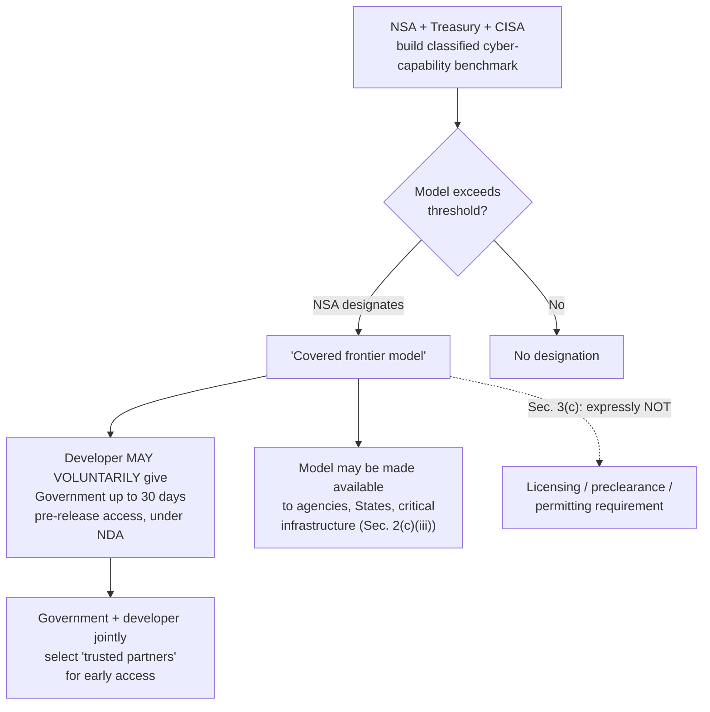

# Executive Order 14409 — Promoting Advanced Artificial Intelligence Innovation and Security — Summary

> [!NOTE]
> **Source:** [eo-14409-ai-innovation-security.md](../../sources/ai-governance/eo-14409-ai-innovation-security.md) · President Donald J. Trump, 2 June 2026 · Compilation of Presidential Documents, DCPD-202600376, published 5 June 2026 · [https://www.govinfo.gov/content/pkg/DCPD-202600376/pdf/DCPD-202600376.pdf](https://www.govinfo.gov/content/pkg/DCPD-202600376/pdf/DCPD-202600376.pdf)
> Study-guide summary of a **primary legal instrument**. The source file holds the complete operative text; the order runs to three printed pages and five sections. See the original for exact wording.

## Abstract

Executive Order 14409, signed 2 June 2026, treats advanced AI almost entirely as a **cybersecurity** matter. It declares a policy of working "collaboratively with the private sector" to harden government and private information systems, protect American intellectual property from adversaries, and "cultivate America's advanced AI-enabled capabilities." It does this through three mechanisms: a set of 30- and 60-day cyber-hardening deadlines on named agencies (Sec. 2); a **voluntary** framework for AI developers to have frontier models classified and pre-release-tested by government (Sec. 3); and a direction to the Attorney General to prioritise existing federal criminal statutes against people who use AI to break into computers (Sec. 4). It is short, deadline-heavy, and deliberately non-regulatory: Sec. 3(c) forecloses any mandatory licensing or preclearance regime for AI models.

**Key points**

- **Three objectives, all security-shaped.** (1) Harden federal and critical-infrastructure systems against cyber threats and equip them with AI-enabled defensive tools; (2) create a voluntary channel through which AI developers work with the federal government on securing frontier models; (3) direct law enforcement at criminal misuse of AI.
- **Named agencies with hard deadlines.** Committee on National Security Systems, Secretary of War, DHS/CISA, and OMB all have **30 days**; the Office of Personnel Management and the Sec. 3 frontier-model workstream have **60 days**. Treasury leads the clearinghouse (30 days) and co-leads Sec. 3 (60 days).
- **An "AI cybersecurity clearinghouse"** is ordered into existence within 30 days, led by Treasury with NSA and CISA, "in voluntary collaboration with the AI industry and operators of critical infrastructure," to deconflict vulnerability scanning, validate vulnerabilities, and prioritise patch distribution.
- **"Covered frontier model" is defined by a classified benchmark**, not a compute threshold in the text. NSA sets the designation. Developers may voluntarily give the government up to 30 days' pre-release access to such models.
- **No mandatory licensing.** Sec. 3(c) expressly disclaims authority to create licensing, preclearance, or permitting requirements for developing, publishing, releasing, or distributing AI models.
- **Silent on privacy, civil liberties and public safety.** Verified by full-text search of the operative text: *privacy*, *civil liberties*, *civil rights*, *public safety*, *safety*, *harm*, *discrimination*, *bias*, *transparency*, *oversight*, *audit*, *redress* and *consumer* appear **zero** times. *Security* appears 22 times. The single occurrence of *right* is Sec. 5(c) disclaiming that any are created.
- **No relationship to EO 14365 whatsoever.** The order cites no other executive order, and contains no revocation, amendment, or supersession clause.

**Takeaways**

- 14409 is the *security* limb of US federal AI policy, sitting alongside — not replacing — the *pre-emption* limb of EO 14365. Anyone describing the US federal posture needs both.
- The instrument of choice is the **voluntary framework plus deadline**, not the rule. Government gets early access to frontier models by invitation and confidentiality agreement, not by licence.
- Where the EU AI Act reaches for fundamental rights and California SB 53 for safety incidents and whistleblowers, 14409 reaches for national-security capability. The omission of rights language is total, not partial, and is the sharpest available illustration of how differently the US federal executive frames the same technology.

## Sec. 1 — Purpose

The order opens with a claim of continuity and a rebuke of the previous administration: the US leads in AI "because we refuse to stifle this innovation with overly burdensome regulation," and the Administration has "unleashed tremendous technological growth" by "slashing the bureaucratic constraints that the prior administration placed on America's AI developers and researchers."

It then concedes the security downside — advanced AI capabilities "make our Nation stronger, but also introduce new national security considerations that require coordinated action across executive departments and agencies" — and commits to working "closely with industry to ensure that the best and most secure technology is deployed rapidly." The framing is explicitly geopolitical: an "America First cybersecurity effort that enhances both our national security and our global AI dominance."

The stated **policy of the United States** has three prongs, in the order's own words:

| Prong | Text |
|---|---|
| Harden systems | "working collaboratively with the private sector to modernize government and private sector information systems and harden them against external threats" |
| Protect IP | "to protect American ingenuity and intellectual property from exploitation and theft by adversaries" |
| Build capability | "to cultivate America's advanced AI-enabled capabilities" |

> [!IMPORTANT]
> Note what the purpose clause does *not* say. There is no protective purpose directed at the public — no consumers, no citizens, no rights, no safety. The beneficiaries named are the Nation, the industry, and American intellectual property.

## Sec. 2 — Upgrading American Systems for Advanced AI

Six lettered directives, each with a deadline measured from 2 June 2026.

| § | Actor(s) | Deadline | Direction |
|---|---|---|---|
| 2(a) | Committee on National Security Systems | 30 days | Prioritise cyber defence of National Security Systems (as defined in 44 U.S.C. 3552(b)(6)(A)) |
| 2(b) | **Secretary of War** | 30 days | Prioritise cyber defence of Department of War information systems |
| 2(c) | **Secretary of Homeland Security**, through the Director of **CISA**; in consultation with **OMB**, the APNSA, and the National Cyber Director | 30 days | Release **Binding Operational Directives** and other guidance (three purposes, below) |
| 2(d) | **Secretary of the Treasury**; in consultation with the National Cyber Director, Secretary of War through **NSA**, and DHS through **CISA** | 30 days | Form an **AI cybersecurity clearinghouse** |
| 2(e) | Director of **OMB**; with the National Cyber Director and Director of CISA | 30 days | Determine whether any federal grant programs have funding directable toward "applicants developing advanced AI vulnerability detection" |
| 2(f) | Director of the **Office of Personnel Management** | 60 days | Expand the "United States Tech Force Information Cybersecurity Specialist hiring and placement pathways" |

**The three purposes of the CISA Binding Operational Directives (2(c)):**

- (i) expedite and prioritise cyber defence of civilian federal government information systems "in order to protect our Nation's vital functions";
- (ii) "establish or expand Federal programs and cybersecurity services that enhance AI-enabled defensive tools"; and
- (iii) facilitate access to cybersecurity tools and services — "including, where appropriate, covered frontier models" — for agencies, State and local authorities, and critical-infrastructure operators, with the order naming **"rural hospitals, community banks, and local utilities"** as examples.

> [!NOTE]
> **The clearinghouse (Sec. 2(d))** is the order's most concrete new institution. Treasury-led, standing up within 30 days, "in voluntary collaboration with the AI industry and operators of critical infrastructure," it has four functions: it (1) **coordinates and deconflicts** scanning for software vulnerabilities, (2) **discovers and validates** such vulnerabilities, (3) **coordinates and prioritises remediation**, and (4) handles **distribution of vulnerability patches**. The order gives it no name, no budget, no reporting line to Congress, and no publication duty.

Two details worth noting. First, 2(c)(iii) is the only place the order reaches beyond the federal government to states and localities — and it does so as a *provider* of tools, not as a regulator of them. Second, 2(c)(iii) quietly makes the government a distribution channel for frontier models themselves, so the Sec. 3 designation machinery has an operational consequence, not just an evaluative one.

## Sec. 3 — Secure Frontier Model Deployment

A single 60-day directive with an unusually long list of actors: the **Secretary of the Treasury**, the **Secretary of War** through the Director of **NSA**, and the **Secretary of Homeland Security** through the Director of **CISA**, in consultation with the White House Chief of Staff (through the National Cyber Director), the Assistant to the President for Science and Technology (APST), and the Secretary of Commerce (through the Director of **NIST**).

**(a) The classified benchmark.** They must "develop and maintain a classified benchmarking process to assess the advanced cyber capabilities of AI models and determine the threshold at which an AI model should be designated a 'covered frontier model'", sharing assessments "with AI developers and researchers as appropriate." The designation decision itself rests with the **Director of NSA**, in consultation with the National Cyber Director, the APST, the Director of CISA, and other Department of War representatives.

**(b) The voluntary framework.** They must "design a voluntary framework with AI developers" under which a developer can:

1. engage the federal government to determine whether models under development meet the "covered frontier model" designation;
2. give the government **access to covered frontier models** — "subject to appropriate confidentiality, cybersecurity, insider-risk, and intellectual-property protection, use, and nondisclosure requirements" — for **up to 30 days before** planned release "to other trusted partners"; and
3. collaborate with the government on **selecting the trusted partners** that get early access, "to promote secure innovation and strengthen the cybersecurity of critical infrastructure."

**(c) The anti-licensing clause.** "Nothing in this section shall be construed to authorize the creation of a mandatory governmental licensing, preclearance, or permitting requirement for the development, publication, release, or distribution of new AI models, including frontier models."

> [!CAUTION]
> The threshold that defines a "covered frontier model" is **classified**. Unlike the EU AI Act's systemic-risk FLOP threshold or California SB 53's developer-size test, no one outside government can read the criterion, and the order provides no mechanism for publishing it. Assessments are shared with developers and researchers only "as appropriate."

> [!TIP]
> Read Sec. 3 as a trade. Developers get advance intelligence on how the government rates their models' offensive cyber capability, and a say in who else gets early access. The government gets a 30-day look at frontier models before third parties do. Neither side is compelled; the whole structure runs on voluntary participation and nondisclosure agreements.

## Sec. 4 — Protection Against Criminal Actors

One sentence of direction, and it is the whole of the enforcement limb. The **Attorney General** "shall prioritize the enforcement of" three existing statutes plus "all other applicable Federal criminal laws":

| Statute | Subject matter |
|---|---|
| 18 U.S.C. 1028 | Fraud and related activity in connection with identification documents and information |
| 18 U.S.C. 1030 | Computer Fraud and Abuse Act — unauthorised access to computers |
| 18 U.S.C. 1343 | Wire fraud |

The targets are anyone "who utilizes AI to illegally access or damage a computer without authorization, or who utilizes AI while engaged in such illegal access to further any other crime." The order says this "includes breaching any public or private information technology system, or **employing AI agents to unlawfully access data or information** that is subsequently used for a criminal or unlawful purpose."

> [!NOTE]
> **No new offence is created.** An executive order cannot create one. Sec. 4 is a prosecutorial-priority instruction applying pre-existing 1980s and 1990s computer-crime law to AI-enabled conduct. Its one substantive novelty is doctrinal: naming **AI agents** as an instrumentality of unauthorised access, which puts agentic systems squarely inside the CFAA's frame without amending the CFAA.

## Sec. 5 — General Provisions

Standard boilerplate, but two clauses matter for how much weight the order can bear.

- **5(a)** — nothing impairs existing statutory authority of agency heads, or OMB's budgetary/administrative/legislative functions.
- **5(b)** — implementation is "consistent with applicable law and subject to the availability of appropriations." No money is appropriated; Sec. 2(e) only asks OMB to *look* for existing grant funding.
- **5(c)** — the order "is not intended to, and does not, create any right or benefit, substantive or procedural, enforceable at law or in equity by any party." **Nobody can sue to enforce it.**
- **5(d)** — publication costs are borne by the Department of War.

Signed DONALD J. TRUMP, The White House, June 2, 2026. Filed with the Office of the Federal Register 11:15 a.m., 4 June 2026; published in the Federal Register 5 June 2026.

## What the order does *not* say

This section records the result of a full-text search of the operative text, because the omissions are the most-cited feature of the order and the book should not take a critic's word for them.

| Term searched | Occurrences in the full text |
|---|---|
| privacy | **0** |
| civil liberties / civil rights | **0** |
| public safety | **0** |
| safety (any use) | **0** |
| harm | **0** |
| discrimination / bias | **0** |
| transparency | **0** |
| oversight / audit / redress | **0** |
| consumer | **0** |
| right(s) | **1** — and it is the *disclaimer* in Sec. 5(c): the order does not "create any right or benefit… enforceable at law or in equity" |
| protect / protection | 4 — all of systems, the Nation, American ingenuity and intellectual property |
| security | 22 |

> [!WARNING]
> The critics' claim checks out, and it is stronger than usually stated. It is not that 14409 gives privacy and civil liberties thin treatment; the concepts are **entirely absent**, along with public safety, harm, discrimination, transparency, oversight, redress and consumers. The order's only protective vocabulary is protection of *systems*, *intellectual property*, and *the Nation*. The word "right" appears exactly once, in the clause saying none are created. Combined with the classified benchmark of Sec. 3(a), an individual affected by anything done under this order has no named interest, no disclosure entitlement, and no cause of action.

Read charitably, this is a scope decision rather than a repudiation: 14409 is a cybersecurity instrument and cybersecurity instruments do not usually legislate rights. Read less charitably, it is the whole of the federal executive's operative AI-security policy, and it contains no counterweight at all.

## Relationship to Executive Order 14365

**14409 does not mention EO 14365, and does not mention any other executive order.** The phrase "Executive Order" appears three times in the source document: once in the order's own title, and twice in the publication apparatus (the Federal Register note and the "Categories" line). There is no revocation clause, no amendment clause, no supersession clause, and no "sections of prior orders are hereby modified" paragraph of the kind such orders often carry. The only backward reference of any kind is the rhetorical swipe at "the bureaucratic constraints that the prior administration placed on America's AI developers" in Sec. 1 — which points at the Biden-era posture, not at 14365, an order of the same administration.

The two orders are therefore **parallel and independent**:

| | EO 14365 (Dec 2025) | EO 14409 (Jun 2026) |
|---|---|---|
| Subject | *Ensuring a national policy framework for artificial intelligence* — federal pre-emption of state AI law | *Promoting Advanced Artificial Intelligence Innovation and Security* — cybersecurity of AI and of federal systems |
| Mechanism | DOJ litigation against state laws; Commerce naming onerous statutes; broadband funding conditions; a draft federal standard for Congress | Agency cyber-hardening deadlines; a Treasury-led vulnerability clearinghouse; a voluntary frontier-model access framework; DOJ enforcement priorities |
| Posture toward the states | Adversarial — override the patchwork | Supportive — supply State and local authorities with cybersecurity tools (Sec. 2(c)(iii)) |
| Legal effect on the other | — | **None.** No amendment, revocation, or reference |

> [!IMPORTANT]
> For the book: 14409 **adds to** rather than **replaces** 14365. Both stand. Writing that 14409 "supersedes" or "updates" the pre-emption order would be wrong. The accurate framing is that the federal executive is running two separate AI tracks — a pre-emption track aimed at state legislatures, and a security track aimed at agencies and frontier developers — and neither one contains the rights-and-safety content that the state statutes and the EU AI Act do.

## Quotable passages

Four short verbatim passages a chapter could cite (each under 25 words):

1. On the regulatory philosophy: *"we refuse to stifle this innovation with overly burdensome regulation"* (Sec. 1).
2. On the policy's beneficiaries: *"to protect American ingenuity and intellectual property from exploitation and theft by adversaries"* (Sec. 1).
3. On the anti-licensing carve-out: *"Nothing in this section shall be construed to authorize the creation of a mandatory governmental licensing, preclearance, or permitting requirement"* (Sec. 3(c)).
4. On agentic AI as a criminal instrumentality: *"employing AI agents to unlawfully access data or information that is subsequently used for a criminal or unlawful purpose"* (Sec. 4).

## Relation to the book

Chapter 5 currently presents the United States as a state-led patchwork with a federal pre-emption push, citing EO 14365 in the prose at §5 and in the comparative jurisdictions table. EO 14409 is the second half of that picture and sharpens the chapter's argument rather than complicating it. It shows the US federal executive doing something substantive about AI — deadlines, an interagency clearinghouse, prosecutorial priorities, a classified capability benchmark — while doing nothing at all about the interests that every other instrument in the chapter is built around. The EU AI Act organises itself around fundamental rights; Colorado SB 24-205 around algorithmic discrimination and consumer disclosure; California SB 53 around safety incidents and whistleblowers; the Council of Europe framework convention around human rights and the rule of law. 14409 mentions none of those words once. That contrast is a cleaner and better-evidenced version of the point the chapter already makes about regulatory divergence, and it is verifiable from the primary text rather than from commentary.

It also gives the chapter a concrete governance mechanism to examine: a voluntary pre-release access arrangement between frontier developers and NSA, gated by a classified threshold and covered by nondisclosure, with no publication duty and no enforceable rights attached. That is a genuinely novel form of AI oversight, and it is neither regulation nor self-regulation. Where the chapter discusses agentic systems, Sec. 4's naming of "AI agents" as an instrumentality of unauthorised computer access is a useful primary-source anchor for the claim that agent liability is arriving through existing criminal law rather than new statute.
