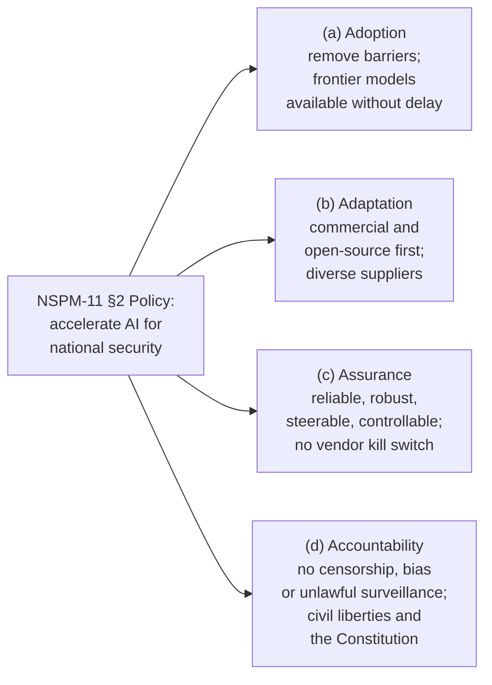
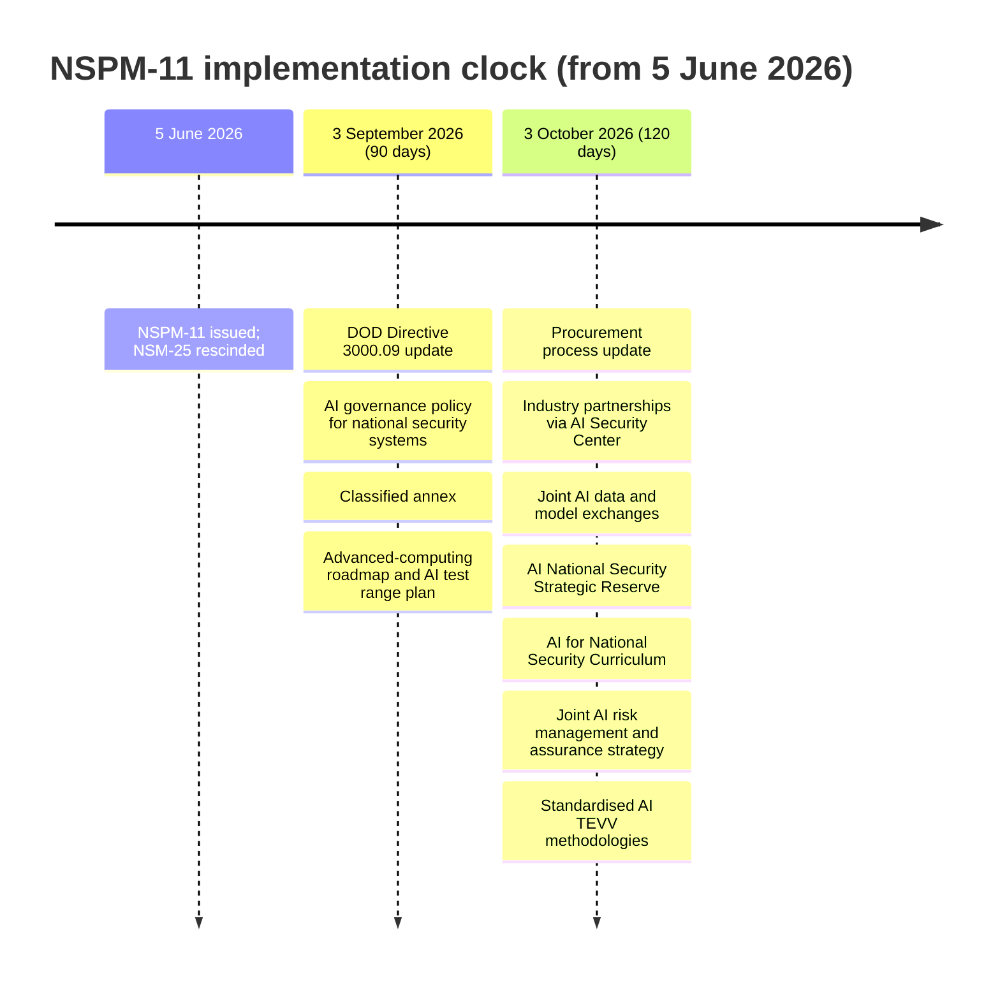

# National Security Presidential Memorandum/NSPM-11 — Summary

> [!NOTE]
> **Source status:** **Primary source, retrieved in full.** whitehouse.gov did *not* block the fetch — a direct HTTP request on 1 August 2026 returned HTTP 200 and the complete verbatim text of the memorandum, which is saved in `sources/`. Every quotation below is taken from that text, not reconstructed. What this document *is*, though, matters for how it is cited: it is the executive branch describing and directing itself. It is a **presidential directive**, not legislation and not analysis — binding on agencies, subject to the availability of appropriations, and it states expressly that it "is not intended to, and does not, create any right or benefit, substantive or procedural, enforceable at law or in equity by any party." Its framing of previous administrations ("undue bureaucracy") and of the US military ("the most effective and moral military in the history of world" — the typo is in the original) is political self-presentation and should be quoted as such, not adopted. For a non-partisan reading of the same instrument, see the CRS brief summarised alongside this one.
>
> **Verified at source (1 August 2026):** exact title **"National Security Presidential Memorandum/NSPM-11"** (`og:title`); subject line **"Artificial Intelligence in the National Security Enterprise"**; date **5 June 2026** (`article:published_time` = `2026-06-05T18:22:57+00:00`, and "June 5, 2026" printed on the page); issuing authority **President Donald J. Trump**, signed "DONALD J. TRUMP", under "the authority vested in me as President by the Constitution and the laws of the United States of America"; category **Presidential Actions › Presidential Memoranda**. All confirmed. **Nothing here is inferred or reconstructed.**
>
> **Source:** [nspm-11-ai-national-security-enterprise.md](../../sources/ai-governance/nspm-11-ai-national-security-enterprise.md) · The White House, *National Security Presidential Memorandum/NSPM-11*, 5 June 2026. https://www.whitehouse.gov/presidential-actions/2026/06/national-security-presidential-memorandum-nspm-11/

## Abstract

A presidential memorandum, signed 5 June 2026 and addressed to fifteen cabinet secretaries, agency heads and White House advisers, directing the US **national security enterprise** — defined as "the Department of War, the Intelligence Community, and other agencies that develop, deploy, or use national security systems or otherwise serve a national security role" — to accelerate its adoption of AI. Its stated purpose is that the Administration "will accelerate the development and use of AI for national security applications," organised under **four pillars: Adoption, Adaptation, Assurance and Accountability**. Adoption means removing barriers and making "the most advanced frontier models broadly available to national security professionals without delay." Assurance requires that all adopted AI be "designed to be reliable, robust, steerable, and controllable" — and, unusually, the memorandum **defines each of those four words** in Section 6. Accountability forbids using AI "to censor free speech, embed ideological bias, or conduct unauthorized or unlawful surveillance activities," and states that AI use "must always be consistent with United States civil liberties and protections afforded by the Constitution and laws and regulations safeguarding the privacy of American citizens." It sets a run of **90- and 120-day deadlines** (including an update to DOD Directive 3000.09 on autonomous weapons and a classified annex), directs termination of contracts with companies showing "a pattern of conduct" inconsistent with its policy, and **rescinds and replaces National Security Memorandum-25**.

**Key points**

- **Issued 5 June 2026** by President Donald J. Trump; subject: *Artificial Intelligence in the National Security Enterprise*. Three days after E.O. 14409.
- **Stated purpose:** "My Administration will accelerate the development and use of AI for national security applications, guided by the following four pillars."
- **Four pillars:** Adoption, Adaptation, Assurance, Accountability.
- **The "reliable, robust, steerable, and controllable" clause is the Assurance pillar**, §2(c) — and each term is given a formal definition in §6.
- **Vendor kill-switch prohibition:** no commercial entity or adversary may be able "to prevent use of, disable or degrade, or materially modify without Federal Government knowledge and approval, an AI system that our men and women depend on."
- **Civil liberties clause**, §2(d): AI use "must always be consistent with United States civil liberties and protections afforded by the Constitution and laws and regulations safeguarding the privacy of American citizens," with commanders and agency heads "responsible and accountable ... at every level of command."
- **Constitutional protections recur** in §5(d), which directs R&D on reliability, robustness, steerability and controllability "in fulfillment of mission requirements, **including constitutional protections**."
- **Contract termination power**, §3(b): agencies shall terminate contracts — including subcontracts — with companies showing "a pattern of conduct that is inconsistent with policies laid out in section 2," with waivers capped at one year and reported to the APST and APNSA within 30 days.
- **DOD Directive 3000.09** on Autonomy in Weapon Systems to be updated within 90 days, then reviewed annually.
- **Rescinds and replaces NSM-25.**
- **General provisions:** implementation is "subject to the availability of appropriations," and the memorandum creates no judicially enforceable rights.

**Takeaways**

- The memorandum is an **acceleration instrument first and a safeguards instrument second**: the safeguards are real and specific, but they are framed as conditions on going fast, not as brakes.
- Its most durable contribution to the vocabulary of AI governance may be the **four definitions in §6** — reliability, robustness, steerability, controllability — because a US presidential directive defining "controllability" as "the ability to monitor the operation and outcomes of a system and take corrective action as needed" is a rare instance of a government pinning down a term the AI safety literature has argued over for years.
- The **civil liberties language is genuine but self-policed**: the accountability runs up the chain of command to agency heads, and the memorandum expressly creates no cause of action for anyone outside government.
- Read with E.O. 14409, the pair is coherent: the E.O. secures AI *from* adversaries; NSPM-11 puts AI *into* the hands of the national security enterprise. The same Administration doing both explains why "AI security" has displaced "AI safety" as the organising federal frame.

## Section 1 — Purpose

AI "will be among the most transformative technologies to national security in the history of the United States." Adopted appropriately, it "can help protect our warfighters during peacetime and on the battlefield, enable precise operations that minimize harm to civilians, and ensure the United States continues to maintain technical overmatch."

The section is explicitly a break with what came before:

- "Previous administrations imposed undue bureaucracy that hampered the pace of AI adoption, fostered dangerous dependencies on single vendors, and made it challenging for our warfighters to adopt the most advanced technologies."
- Meanwhile competitors deployed their own AI and autonomous technologies "with little regard for appropriate human oversight or civil liberties."
- The Administration will "responsibly accelerate the use of AI across intelligence and warfighting domains in line with American values."
- Trust in the military "is rooted in an unbroken chain of command and accountability, from our democratic process through civilian and military leadership, to the men and women who carry out the mission."
- The stated end state: "a decisive and enduring AI advantage against any and all adversaries while safeguarding the constitutional chain of command."

> [!NOTE]
> **Two motifs introduced here run through the whole document:** the *chain of command* (later formally defined) and *vendor independence* (the "dangerous dependencies on single vendors" complaint, which becomes the binding kill-switch prohibition in §2(c)).

## Section 2 — Policy: the four pillars

> [!IMPORTANT]
> The operative sentence: "**My Administration will accelerate the development and use of AI for national security applications, guided by the following four pillars.**"

### 2(a) Adoption

Identify mission areas where AI can enhance operational effectiveness and eliminate "unnecessary barriers to rapid deployment." Maintain "deep, proactive partnerships with industry, to **make the most advanced frontier models broadly available to national security professionals without delay**, ensuring technological overmatch while driving rapid experimentation and validation across potential applications."

### 2(b) Adaptation

Adapt **commercial or open-source** AI technologies from "diverse suppliers across the private sector, large and small," optimised for intended use. Where a commercial solution is inappropriate "due to security or mission limitations," agencies may customise commercially or internally, or build internally — and such technologies "shall be made available across the national security enterprise to support multiple missions where possible."

### 2(c) Assurance — the reliability clause

> [!IMPORTANT]
> Verbatim: "The national security enterprise shall assure that all AI technologies adopted **are designed to be reliable, robust, steerable, and controllable, and that they operate, in accordance with applicable laws, government policies, and guidance**."

Two further assurance requirements:

- **Vendor kill-switch prohibition.** "To protect American warfighters, the national security enterprise shall ensure, through contractual clauses or other means, that **no commercial entity or adversary possesses the capability to prevent use of, disable or degrade, or materially modify without Federal Government knowledge and approval, an AI system that our men and women depend on for their missions**."
- **Rigorous security and functionality measures**, "including testing, evaluation, validation, and verification," to assure "the appropriate confidentiality, integrity, reliability, availability, and interoperability of AI systems."

### 2(d) Accountability — civil liberties and the Constitution

> [!IMPORTANT]
> Verbatim, in three parts:
> - "American AI technologies shall neither be developed nor used by the national security enterprise **to censor free speech, embed ideological bias, or conduct unauthorized or unlawful surveillance activities**."
> - "The use of AI by the national security enterprise **must always be consistent with United States civil liberties and protections afforded by the Constitution and laws and regulations safeguarding the privacy of American citizens**."
> - "**Commanders, directors, and heads of agencies shall remain responsible and accountable for ensuring that these obligations are met at every level of command**, and that such accountability keeps pace with the evolution of AI capabilities and regulations governing the privacy and civil liberties of American citizens."

## Section 3 — Updated Policies and Guidance

| § | Requirement | Actor(s) | Deadline |
| --- | --- | --- | --- |
| 3(a) | Update **DOD Directive 3000.09, *Autonomy in Weapon Systems*** — reviewed annually, to ensure adoption "respects the chain of command and operational authorities" | Secretary of War | **90 days** |
| 3(b) | Terminate (for default or convenience) contracts with companies showing "a pattern of conduct that is inconsistent with policies laid out in section 2," including where they act as **subcontractors** | Secretary of War (FISMA §3553(e)(2) systems), DNI (§3553(e)(3)), agency heads (§3557) | Ongoing |
| 3(b) | Optional **waiver process**: limited exceptions of defined duration, **max 1 year** (operational imperatives, test and evaluation, threat intelligence sharing, mission-critical applications), reported in writing to APST and APNSA "by heads of agencies, without designee" | Agency heads | **30 days** after each waiver |
| 3(c) | Issue policy for **governance of AI use in national security systems**, including implementation and reporting requirements; "maximize consistency" with **OMB memorandum M-25-21** where appropriate | Committee on National Security Systems + OMB Director, with APST, consulting IC elements | **90 days** |
| 3(d) | Issue a **classified annex** | (unstated) | **90 days** |
| 3(e) | Update all relevant agency policies and guidance to match; review annually | Secretary of War, IC agency heads, other national-security agency heads | After 3(a)–(d) guidance issues |
| 3(f) | **Rescinds and replaces National Security Memorandum-25** and associated guidance | — | Immediate |

> [!CAUTION]
> §3(b) is the memorandum's sharpest edge. It directs agencies "to the maximum extent permissible by law" to cut off companies whose *conduct* is inconsistent with §2 — a section that includes the prohibition on embedding ideological bias. The trigger is a "pattern of conduct," not a finding, a hearing, or a defined standard; the remedy reaches subcontractors; and the only stated check is a one-year waiver reported up to two White House advisers.

## Section 4 — Advancing National Security Capabilities

| § | Requirement | Actor(s) | Deadline |
| --- | --- | --- | --- |
| 4(a) | Review and update **procurement processes** for "rapid onboarding of the most advanced AI models from multiple vendors, closing the capability gap between what is available to the public and to our national security workforce" | Secretary of War, DNI, IC agency heads | **120 days** |
| 4(b) | Jointly develop a **roadmap for adequate access to advanced computing**, including commissioning high-security AI computing facilities and establishing an **AI test range** for national security use cases ("subject to the availability of appropriations") | APST + OMB Director, with Secretary of War, Secretary of Energy, DNI, NSA Director | **90 days** |
| 4(c) | Develop **partnerships with willing private-sector companies** to secure cutting-edge AI, "including from malicious **distillation attacks**" — threat-intelligence sharing, joint AI red-team exercises, personnel vetting, joint security R&D, physical and cyber security of data centres, technical support "similar to that given to Defense Industrial Base partners" | Secretary of War, Secretary of Energy, DNI, NSA Director **through the AI Security Center**, consulting APST | **120 days** |
| 4(d) | Apply AI to national security missions **through the Genesis Mission**, including private-sector partnerships | Secretary of Energy | No deadline |
| 4(e) | Prioritise **collection and analysis of foreign AI technologies** across the AI technology stack, applications, and governance/policies posing a threat; State to develop an **allied engagement strategy** to share findings | DNI with IC elements; Secretary of State | No deadline |
| 4(f) | Initiate **joint AI data and model exchanges**, accessible across multiple enclaves, for common mission applications | DNI, Secretary of War, Secretary of Energy, NSA Director (National Manager authorities) | **120 days** |

> [!NOTE]
> **§4(c) is the provision CRS singles out** as being "in support of the objectives of E.O. 14409" — the government-industry partnership to secure data centres and frontier AI technologies, run through the NSA's **AI Security Center**. Note the specific named threat: **malicious distillation attacks**, i.e. extracting a model's capabilities by training a student model on its outputs.

## Section 5 — Building Capacity for AI Adoption

| § | Requirement | Actor(s) | Deadline |
| --- | --- | --- | --- |
| 5(a) | Use **special hiring and pay authorities** and OPM novel talent programs to accelerate hiring technical AI talent | Agencies | Ongoing |
| 5(b) | Establish an **AI National Security Strategic Reserve** of non-governmental AI talent | OPM Director, with DHS; consulting DNI, War, Energy, OMB, APST, APNSA, Homeland Security Advisor, IC elements | **120 days** |
| 5(c) | Develop and implement an **AI for National Security Curriculum**, coordinated with existing federal AI and cyber training; personnel to "maintain literacy on the current AI frontier, including its capabilities, limitations, and implications" | DNI + Secretary of War, with OMB Director and IC elements | **120 days** |
| 5(d) | Prioritise **R&D of technologies that enable AI reliability, robustness, steerability, and controllability** in fulfilment of mission requirements, "**including constitutional protections**" | Agencies | Ongoing, subject to appropriations |
| 5(e) | Develop a **joint strategy for AI risk management and assurance** plus implementation guidance establishing **baseline AI security practices**, submitted to APST, OMB Director, NCD and APNSA before publication | DNI, Secretary of War, NSA Director (National Manager), with DHS, Energy, Treasury | **120 days** |
| 5(f) | Submit standardised **AI national security Test, Evaluation, Verification and Validation (TEVV) methodologies**, including conformity verification and sustainment of high-security AI systems, at appropriate classification levels | Secretary of War through NSA Director; DNI | **120 days** |

> [!TIP]
> **Summariser's note, not the memorandum's claim:** §5(c)'s framing of AI literacy — capabilities, limitations, *and* implications — has the same three-part shape as the EU AI Act's Article 4 literacy duty. The memorandum draws no such comparison; the observation is mine, flagged here because it is useful to the book.

## Section 6 — Definitions

This is the most quotable section for anyone writing about AI governance vocabulary, because it commits a US presidential directive to definitions of the four assurance terms.

| Term | Definition (verbatim) |
| --- | --- |
| **Artificial intelligence / AI** | "has the meaning set forth in 15 U.S.C. 9401(3)" |
| **AI incident response** | "the preparation, detection, analysis, remediation, and recovery from intentional or unintentional performance degradation or data loss or spillage of AI systems, including technical malfunctions and adversarial attacks" |
| **AI security** | "the application of appropriate protection mechanisms across the AI technology stack to ensure the confidentiality, integrity, and availability of AI systems, from design through deployment" |
| **AI technology stack** | "the layers that enable the development and deployment of AI technologies, including AI-optimized hardware and related infrastructure, including chips, servers, accelerators, data center storage, cloud services, networking, etc.; data pipelines and labeling systems; AI models and systems; security and cybersecurity measures for AI models and systems; and AI applications for sector-specific or functional use cases" |
| **Chain of command** | "the properly designated succession of individuals through which authority, direction, and control is exercised to accomplish a lawful objective" |
| **Controllability** | "the ability to monitor the operation and outcomes of a system and take corrective action as needed" |
| **Intelligence Community** | "has the meaning given the term in section 3003 of title 50, United States Code" |
| **National security enterprise** | "the Department of War, the Intelligence Community, and other agencies that develop, deploy, or use national security systems or otherwise serve a national security role" |
| **Reliability** | "the ability of a system to perform as required, without failure, under given conditions" |
| **Robustness** | "the ability of a system to maintain a level of performance under a variety of circumstances, including outside intended operating conditions" |
| **Steerability** | "the ability to shape the internal behavior of a system to pursue a given set of objectives" |

> [!NOTE]
> The four assurance terms map cleanly onto distinct engineering properties: **reliability** = works as specified in expected conditions; **robustness** = degrades gracefully outside them; **steerability** = can be aimed; **controllability** = can be watched and corrected. Only controllability is defined in terms of a *human* activity (monitor, take corrective action) — the others are properties of the system itself.

## Section 7 — General Provisions

- Nothing impairs "the authority granted by law to an executive department or agency, or the head thereof," or OMB's budgetary, administrative and legislative functions.
- "This order shall be implemented consistent with applicable law and **subject to the availability of appropriations**."
- **No enforceable rights:** it "is not intended to, and does not, create any right or benefit, substantive or procedural, enforceable at law or in equity by any party against the United States, its departments, agencies, or entities, its officers, employees, or agents, or any other person."

Signed: **DONALD J. TRUMP**.

> [!WARNING]
> These two clauses qualify everything above them. The civil liberties guarantee in §2(d) is a policy commitment enforced *within* the executive branch by the chain of command; §7(c) forecloses anyone outside it from suing to enforce it. And the AI test range, the computing roadmap and the R&D priorities are all conditional on money Congress has not necessarily appropriated — the same funding gap CRS flags for E.O. 14409.

## Deadline map

*(Calendar dates are computed from the 5 June 2026 issue date; the memorandum itself states only "within 90 days" / "within 120 days".)*

## Relation to the book

§5.2.3 stops at Executive Order 14365 in December 2025, and the whole American thread of the chapter is about a government that governs AI by executive instrument because it has no statute. NSPM-11 is the sharpest available illustration of what that means in practice. It is a directive, signed by one person, that reorganises how the entire US defence and intelligence apparatus buys, builds, tests and trains on AI — and it does so with no bill, no vote, and an explicit clause saying nobody can sue over it. Cited beside E.O. 14365 and E.O. 14409, it lets the section make a point it cannot make from any one of them alone: the instrument is doing the work, not the content. The other reason to cite it is that its language is unusually good for the book's purposes. Chapter 5 spends its length arguing that governance means concrete, checkable properties rather than pledges, and here is a US presidential memorandum requiring that AI systems be "reliable, robust, steerable, and controllable" and then, unlike almost every corporate safety framework the chapter examines, actually defining all four. Controllability as "the ability to monitor the operation and outcomes of a system and take corrective action as needed" is a definition the book can use directly. The civil liberties clause is worth quoting for the same reason it is worth qualifying: "must always be consistent with United States civil liberties and protections afforded by the Constitution" is a strong sentence, and §7(c) makes it unenforceable by anyone it protects. That gap between a commitment written down and a commitment anyone can hold you to is precisely the argument §5.1 makes about voluntary frontier-safety frameworks, and it turns out to apply to the government's own promises too. There is also a smaller, useful detail: §4(c) names malicious distillation attacks as a threat the state will help industry defend against, which connects the governance chapter to the model-theft and open-weights material earlier in the book.
