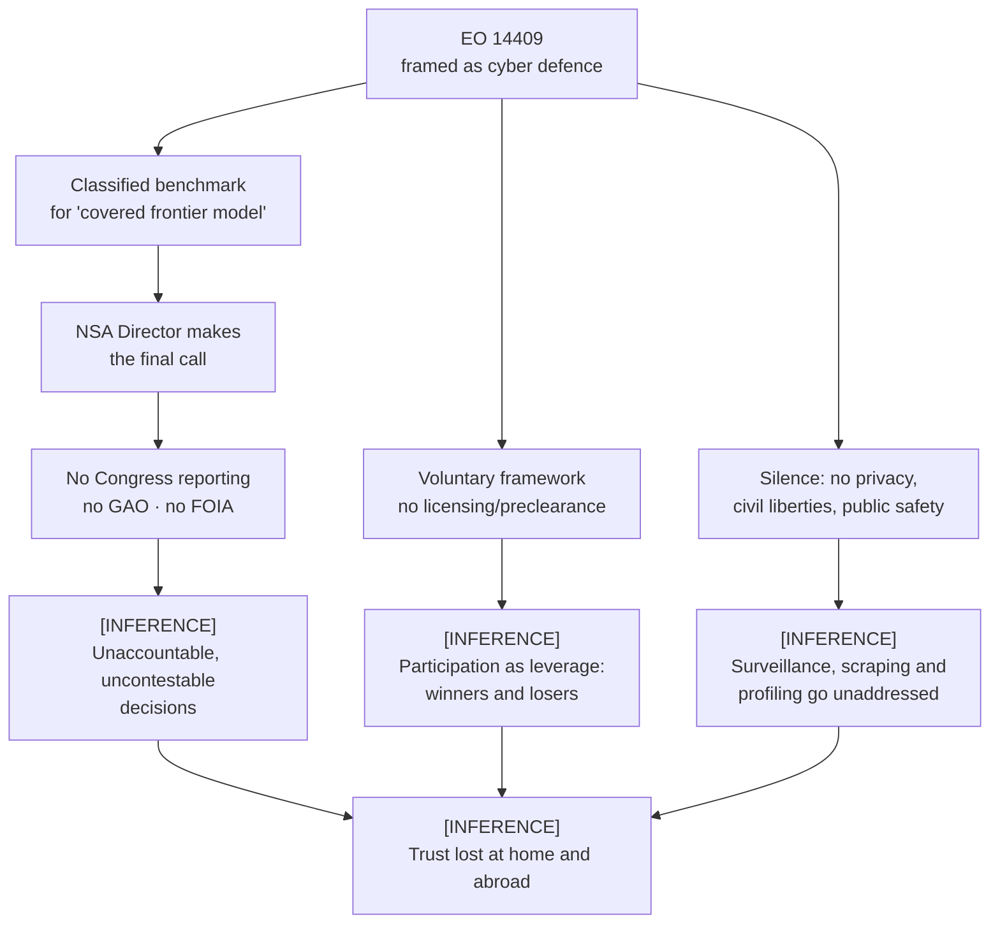

# Transparency and Accountability Gaps in Trump's New AI Executive Order — Summary

> [!NOTE]
> **Source:** [techpolicy-eo-14409-gaps.md](../../sources/ai-governance/techpolicy-eo-14409-gaps.md) · Merve Hickok, *Transparency and accountability gaps in Trump's new AI executive order*, Tech Policy Press, 17 June 2026. https://www.techpolicy.press/transparency-and-accountability-gaps-in-trumps-new-ai-executive-order/
>
> **STATUS: CRITICAL COMMENTARY / ADVOCACY OPINION — NOT RESEARCH, NOT NEUTRAL ANALYSIS.** Tech Policy Press publishes this under its **"Perspective"** banner and is itself a digital-rights-oriented non-profit outlet. The author, **Merve Hickok**, is **President and Research Director of the Center for AI and Digital Policy (CAIDP)** — an advocacy organisation whose stated purpose is to press for binding AI regulation grounded in fundamental rights and democratic values, and which the piece itself links to as a campaigner on this order. She also advises the OECD, UNESCO and the UN. She is therefore arguing a position her organisation already holds, against an administration whose approach it opposes. Cite this as *an attributed civil-society critique*, never as a finding.
>
> **Reading rule for this summary:** every claim below is tagged **[TEXT]** (demonstrated by pointing at what EO 14409 does or does not say — usable as fact, with attribution for the framing) or **[INFERENCE]** (the author's prediction, fear, or reading of motive — citable only as a stated concern, attributed to her).

## Abstract

A civil-society critique of **Executive Order 14409, "Promoting Advanced Artificial Intelligence Innovation and Security"** (White House, 2 June 2026). Hickok concedes the order's cyber-defence content is unobjectionable, then argues that it does the most consequential thing in US frontier-AI policy — deciding which models count as dangerous — inside a **classified process run by an intelligence agency**, with no reporting to Congress, no GAO role, no FOIA, and no mention at all of privacy, civil liberties, or public safety.

**Key points**

- **[TEXT]** EO 14409 tasks Treasury, the NSA (through the Defense Secretary) and CISA with building a benchmarking process to decide the threshold for **"covered frontier model"** designation; the **benchmarking process is classified** and the **NSA Director makes the final call** on whether a given model crosses it.
- **[TEXT]** The framework is **voluntary** and the order **explicitly disclaims** creating any "mandatory licensing, preclearance, or permitting requirement for the development, publication, release, or distribution of new AI models."
- **[TEXT]** The order contains **no requirement for unclassified summary reporting to Congress, no role for the GAO, and no FOIA route** to either the benchmarking criteria or the results.
- **[TEXT]** Its data content is confined to prosecuting AI-enabled hacking under existing law; it is **silent on mass scraping of personal data for training, on profiling and inference, and on the privacy implications of government (e.g. NSA) access**. The words privacy, civil liberties, and public safety **do not appear**.
- **[TEXT, corroborating event]** Days after the order, the administration reportedly asked the **Center for AI Standards and Innovation (CAISI)** to stop issuing public reports of its model assessments (Hickok cites *WSJ* reporting).
- **[INFERENCE]** Because the benchmark is secret and access privileged, an intelligence agency ends up **choosing commercial winners and losers**, and the secrecy will **alienate allies** and push other countries to diversify away from US models.

**Takeaways**

- The gap the piece pins down is real and checkable in the order's own text: **EO 14409 is a cyber-risk instrument that says nothing about privacy, civil liberties, or public safety, and builds no external oversight channel.** That much a book can state as fact.
- The rest — regulatory capture, coercion of companies, loss of foreign trust — is **argument, not evidence**, and must be attributed to Hickok/CAIDP.
- The piece is the natural counterweight to the White House's own framing of EO 14409 and to neutral analyses of it; its value is that it is *specific about absences*, not merely disapproving.

---

## The (a)/(b) split at a glance

This is the table the book should work from.

### (a) Demonstrated by pointing at the order's text

| Claim | What the piece points at |
|---|---|
| The order is, on its face, a cybersecurity measure | It directs agencies to harden systems against AI-enabled threats, evaluate advanced cyber capabilities, create a vulnerability-sharing clearinghouse, and asks DOJ to prosecute AI-enabled cybercrime |
| A new designation category exists | The order sets a threshold for **"covered frontier model"** based on advanced cyber capabilities, e.g. discovering or exploiting software vulnerabilities at scale, assessed **before a model's release** |
| The evaluators are Treasury, NSA (via the Defense Secretary), and CISA | Named delegations in the order |
| **The benchmarking process is classified** | The order provides for a classified benchmarking process |
| **The NSA Director makes the final designation call** | The order vests the decision there |
| **The framework is voluntary** | The order's own disclaimer of "mandatory licensing, preclearance, or permitting" |
| **No unclassified reporting to Congress, no GAO role, no FOIA** | Absence of any such provision in the order |
| **No mention of privacy, civil liberties, or public safety** | Absence — the order's data content is confined to "unlawful access"/AI-enabled hacking |
| Nothing on training-data scraping, profiling, or inference | Absence |
| CAISI already runs voluntary pre-deployment evaluations with AI labs and works with US allies | Factual background, external to the order |
| The administration asked CAISI to stop publishing model-assessment reports | *WSJ* reporting, dated days after the EO |
| Defense Secretary Pete Hegseth posted that his department "kicked @AnthropicAI out of our building—forever" | A cited public post |

> [!NOTE]
> **Independently checkable.** The order's text confirms the classified benchmarking process, the NSA Director's final authority, the voluntariness disclaimer, the absence of Congress/GAO/FOIA provisions, and the absence of the words *privacy*, *civil liberties*, and *public safety*. One small wording caveat: the piece says "Secretary of Defense", while the order uses **"Secretary of War"** (and "Department of War") for the same office — quote the piece, but do not treat its department name as the order's.

### (b) Predicted, feared, or inferred by the author

| The concern | Its status |
|---|---|
| Participating companies will learn their own scores while the public is kept in the dark | Prediction ("presumably") about how the process will operate |
| Uncleared developers, and cybersecurity staff at critical-infrastructure firms, will not know the threshold either | Prediction, softened by "possibly" |
| An intelligence agency is being positioned to **decide which outside organisations get privileged early access** to the most capable models | Inference from the structure, not a stated provision |
| The opacity "opens the door" for the administration to take **interventionist steps toward companies** | Inference of risk |
| The administration "can make winners and losers" through the EO's powers | Inference; the Hegseth post is offered as mood evidence, not as an EO mechanism |
| Black-box decisions will make agency decisions **hard to contest** | Predicted practical effect |
| Foreign businesses will not depend on models that "can be unplugged overnight"; foreign governments will not trust the NSA to certify AI for their use | Explicit forecast |
| The order is "more likely to alienate US allies and encourage countries to diversify their AI model options" | Explicit forecast |
| What is at stake is "replacing the public interest with the interests of the few" | Normative judgement |
| "Substantive misdirection and immaturity of approach" | Normative judgement |

---

## Section-by-section

### Opening: the order at face value

Hickok grants the premise. EO 14409, issued 2 June 2026, directs federal agencies to harden systems against AI-enabled threats, evaluate advanced cyber capabilities, and stand up a clearinghouse for sharing vulnerability information; it also asks DOJ to pursue AI-enabled cybercrime. **[TEXT]** Her words: cyber defence for national security systems, federal civilian systems and critical infrastructure "is important", and "[f]ew people would object to any of that in isolation."

Her objection is to *what the order builds around that*, and above all to **the primary agency it authorises — the NSA, an intelligence agency**. She frames the piece around four questions: who evaluates the most powerful AI systems, on what terms, who learns the conclusions, and how the opacity affects trust at home and abroad.

### 1. A classified yardstick for "covered frontier models"

**[TEXT]** The order creates a pre-release assessment framework for models with advanced cyber capabilities — "such as the ability to discover or exploit software vulnerabilities at scale". Treasury, the NSA (acting through the Defense Secretary) and CISA are delegated to build the benchmarking process that fixes the **"covered frontier model"** threshold. The process will be **classified**; the **NSA Director** makes the final determination. Industry helps design the voluntary framework.

**[TEXT]** She concedes the security rationale: classifying the benchmark "prevents adversaries from reverse-engineering which exploits the government can and can't detect."

**[INFERENCE]** The predicted consequence is an information asymmetry in three tiers: participating companies presumably learn their own scores; the public does not; and possibly not even uncleared developers, nor cybersecurity professionals at major critical-infrastructure providers. From this she draws the sharpest structural inference in the piece — that an intelligence agency is positioned "not just to assess frontier AI systems for cyber risk, but to help decide which outside organizations get privileged early access to the most capable models in the world."

### 2. Secrecy creates oversight problems

This is the accountability core.

> [!IMPORTANT]
> **[TEXT] Verbatim (17 words):** "There is no requirement for unclassified summary reporting to Congress, no role for the Government Accountability Office"
>
> …and, in the same sentence, no FOIA route to either the benchmarking criteria or the results.

**[INFERENCE]** Who is shut out: smaller AI companies, academic researchers, journalists, and civil-society organisations studying AI risk — none can know the threshold, how it was set, or how consistently it is applied.

She borrows a line from Vilas Dhar (*Time*, 10 June 2026) that the gravest questions about AI's military, cyber and social power "will be answered through a classified review and private collaboration" — **an outside opinion quoted inside an opinion piece**, so doubly attributed if the book ever uses it.

**The comparison that does the argumentative work.** **[TEXT/analogy]** Other domains where government evaluates products for public safety — drug approvals, vehicle safety, environmental permitting — combine published criteria, notice-and-comment, and records eventually reviewable by courts, journalists or independent experts.

> [!IMPORTANT]
> **Verbatim (21 words):** "The EO places the most consequential judgments about powerful AI systems almost entirely inside the classified world of an intelligence agency"
>
> …"whose core mission and culture are built around secrecy." The first clause is a structural reading of the text; the characterisation of the agency's culture is **[INFERENCE]**.

She separates two harms: a **democratic accountability** problem and a **practical oversight** problem — black-box decisions are hard to contest.

**[TEXT, corroborating]** The CAISI episode is offered as evidence the pattern is already repeating: days after the EO, the administration reportedly asked CAISI to "stop issuing public reports" of its model assessments (*WSJ*). She notes NIST and CAISI are **civilian** bodies with public-facing missions — to advance "measurement science, standards, and technology" and "foster technological advancements that benefit society" — and calls the change censorship **[INFERENCE — her characterisation]**.

### 3. "Unlawful access" versus the broader data problem

The section that answers the book's specific question about silence.

**[TEXT]** The order asks prosecutors to prioritise AI-enabled hacking under existing laws. It does address data — but says **nothing** about:

- mass scraping of personal information used to train frontier models;
- the profiling and inference capabilities those models enable;
- the privacy implications of **government** access, the NSA specifically included.

**[INFERENCE]** Her surveillance point: the government gains early, privileged access to systems trained on enormous quantities of data about ordinary citizens.

> [!IMPORTANT]
> **[TEXT] Verbatim (19 words) — the claim the book asked to pin down:** "the EO focuses only on cyber risks, while leaving out any mention of privacy, civil liberties, or public safety"

**[INFERENCE]** By framing "AI and data" almost entirely as a cybercrime issue, the order "sidesteps the implications for surveillance, data brokerage, and behavioral profiling by both government and corporations." She closes with a prescription: policy must align with civil liberties and democratic values.

### 4. Why this matters for trust at home and abroad

**[TEXT]** The pre-release review framework is voluntary, and the order explicitly disclaims any "mandatory licensing, preclearance, or permitting requirement for the development, publication, release, or distribution of new AI models" — **a verbatim quotation from EO 14409 itself, not from Hickok** (17 words).

**[INFERENCE]** Voluntariness is politically attractive but makes the system depend on companies choosing to participate "or move in tandem with administration's goals"; through the EO's powers "the administration can make winners and losers." The Hegseth post about kicking Anthropic out of the building is placed immediately after, as illustration of the climate rather than as a mechanism of the order.

**[TEXT]** The counterfactual she prefers already partly exists: CAISI has voluntary agreements with AI labs, runs pre-deployment evaluations, and collaborates with US allies. **[INFERENCE]** The right order would have established "a robust and public evaluation standard" to strengthen trust, enhance legal certainty and make the American AI stack trustworthy; instead the approach strengthens intelligence agencies and a handful of powerful companies "while leaving everyone else in the dark", replacing the public interest with the interests of the few and dismantling existing public reporting infrastructures.

**[INFERENCE — forecast]** The international argument: secret, ad-hoc decisions create ambiguity and legal uncertainty; few foreign businesses will depend on models that "can be unplugged overnight"; few foreign governments will trust the NSA to certify AI for their use; the likely result is alienated allies and diversification away from US models.

---

## The shape of the argument

## Quotable passages (all under 25 words)

| # | Quote | Words | Status |
|---|---|---|---|
| 1 | "the EO focuses only on cyber risks, while leaving out any mention of privacy, civil liberties, or public safety" | 19 | [TEXT] — checkable against the order |
| 2 | "There is no requirement for unclassified summary reporting to Congress, no role for the Government Accountability Office" | 17 | [TEXT] — checkable against the order |
| 3 | "The EO places the most consequential judgments about powerful AI systems almost entirely inside the classified world of an intelligence agency" | 21 | [TEXT] structure + [INFERENCE] framing |
| 4 | "mandatory licensing, preclearance, or permitting requirement for the development, publication, release, or distribution of new AI models" | 17 | Quoting **EO 14409 itself**, via Hickok |

## Cautions for citing this source

> [!CAUTION]
> - **Advocacy, and say so.** Hickok leads CAIDP, which campaigns for exactly the binding, public evaluation standard she says the order should have created. The citing sentence must name the piece as opinion and name her role — the book's house rule.
> - **The absences are the fact; the motives are not.** "The order says nothing about privacy, civil liberties, or public safety" is verifiable. "The administration can make winners and losers" is her reading.
> - **Second-hand reporting inside an opinion piece.** The CAISI reporting-freeze is *WSJ*'s; the Dhar line is *Time*'s. Do not cite either through Hickok if the book wants them as fact.
> - **"Secretary of Defense" vs "Secretary of War."** The order uses the latter; the piece uses the former. Quote the piece accurately, but do not repeat the department name as the order's own.
> - **No data, no method.** This is a 1,200-word essay. It contains no original research, no interviews, and no numbers.

## Relation to the book

This belongs in **§5.2.3 "Around the World"**, which currently ends the US story at Executive Order 14365 (December 2025, state pre-emption) and, alongside it, the Fable 5 export-control episode. EO 14409 is the next beat in that same argument: the section already shows Washington governing frontier AI by executive instrument rather than statute, and this order extends the pattern from *pre-empting the states* and *switching off a model* to *classifying the yardstick by which models are judged dangerous at all*. Hickok supplies the counterweight to the White House's own framing and to neutral analysis of the order — a short, specific account of what the order leaves out. The usable fact is the silence: a cyber-risk instrument with no mention of privacy, civil liberties, or public safety, and no reporting channel to Congress, the GAO, or FOIA. Her wider case — capture, coercion, lost allied trust — is a stated concern, and the citing sentence must say whose. A secondary, weaker home is **§5.2.4 "Counting the Cost"**, where the argument that opacity itself imposes a cost (legal uncertainty for foreign buyers) would sit alongside the compliance-cost figures, but that is a runner-up, not a second citation.

**Reference (APA, house style):**

Hickok, M. (2026). *Transparency and accountability gaps in Trump's new AI executive order*. Tech Policy Press. [https://www.techpolicy.press/transparency-and-accountability-gaps-in-trumps-new-ai-executive-order/](https://www.techpolicy.press/transparency-and-accountability-gaps-in-trumps-new-ai-executive-order/)

**In-text:** `Hickok, 2026` (first mention with title: *Transparency and accountability gaps in Trump's new AI executive order*)
