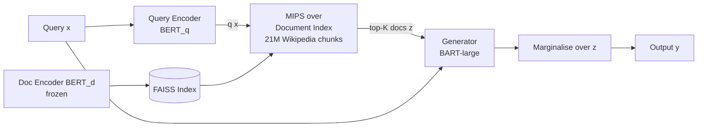

# Retrieval-Augmented Generation for Knowledge-Intensive NLP Tasks — Summary

> [!NOTE]
> **Source:** [2005.11401-retrieval-augmented-generation.pdf](../../sources/arXiv/2005.11401-retrieval-augmented-generation.pdf) · Patrick Lewis, Ethan Perez, Aleksandra Piktus, Fabio Petroni, Vladimir Karpukhin, Naman Goyal, Heinrich Küttler, Mike Lewis, Wen-tau Yih, Tim Rocktäschel, Sebastian Riedel, Douwe Kiela (Facebook AI Research / UCL / NYU), 2020 · NeurIPS 2020, arXiv:2005.11401v4 (Apr 2021).
> Study-guide summary of the full document. See the original for exact wording and figures.

## Abstract

This is the paper that introduced **Retrieval-Augmented Generation (RAG)**: a general-purpose fine-tuning recipe that pairs a pre-trained seq2seq generator (BART) with a non-parametric memory — a dense vector index of 21M Wikipedia passages accessed by a neural retriever (DPR) — so that generation is conditioned on retrieved documents rather than only on the model's own parameters. The core idea is to treat the retrieved document as a latent variable and marginalise over it, letting the retriever and generator be trained end-to-end and letting answers be *grounded* in an inspectable, swappable knowledge source.

**Key points**

- **Two memories, combined.** Parametric memory = BART-large (400M params, the generator). Non-parametric memory = a FAISS MIPS index of 21M 100-word Wikipedia chunks (Dec 2018 dump), retrieved by DPR's BERT-based bi-encoder. Only the query encoder and BART are fine-tuned; the document encoder and index are frozen.
- **Two formulations.** *RAG-Sequence* uses one retrieved document for the whole output; *RAG-Token* can draw a different document per generated token, so it can blend content from several documents. Both marginalise over the top-K retrieved documents (top-K approximation).
- **Sets state of the art on open-domain QA.** New SOTA Exact Match on Natural Questions (44.5), WebQuestions (45.5) and CuratedTrec (52.2), plus strong TriviaQA results — beating both "closed-book" parametric-only models (T5-11B) and task-specific "retrieve-and-extract" pipelines (REALM, DPR), despite RAG generating rather than extracting answers.
- **Generation is more factual, specific, and diverse.** On MS-MARCO abstractive QA, RAG-Sequence beats BART by +2.6 BLEU and +2.6 Rouge-L. On Jeopardy question generation, human evaluators judged RAG more factual than BART 42.7% of the time vs 7.1% the other way, and more specific 37.4% vs 16.8%.
- **Knowledge is editable and grounded.** Swapping the 2016 Wikipedia index for the 2018 one updates the model's world knowledge with no retraining (70% correct on 2016 leaders with the 2016 index; 68% on 2018 leaders with the 2018 index). Because the memory is raw text, it is human-readable (interpretable) and human-writable (updatable).

**Takeaways**

- Conditioning a generator on retrieved text is a general, task-agnostic way to ground language models in an external knowledge source — reducing hallucination, providing provenance, and letting knowledge be revised without retraining.
- A hybrid parametric/non-parametric model is far more parameter-efficient for knowledge tasks: RAG-Sequence (626M trainable params) scores 44.5 EM on NQ vs 28.9 for the comparably-sized T5-large (770M) and beats the 11-billion-parameter T5-11B.
- RAG works across a wide task span (open/abstractive QA, question generation, fact verification) with one architecture, and *learned* dense retrieval matters — it beats fixed BM25 on every task except entity-heavy FEVER.

## Introduction

Pre-trained language models store substantial factual knowledge in their parameters and act as an implicit, parameterised knowledge base — but this has downsides: they **cannot easily expand or revise their memory**, **cannot give insight into predictions (no provenance)**, and **hallucinate**. Hybrid models that add non-parametric (retrieval-based) memory address these because knowledge can be revised, expanded, inspected, and interpreted.

Prior hybrid work (REALM, ORQA) combined masked language models with a differentiable retriever but only explored **extractive open-domain QA**. This paper's contribution is to bring hybrid parametric + non-parametric memory to the "workhorse of NLP," the **seq2seq model**, via a general-purpose fine-tuning recipe called **RAG**.

- **Retriever:** Dense Passage Retriever (DPR) — provides latent documents conditioned on the input.
- **Generator:** BART — conditions on the retrieved documents plus the input to generate output.
- Combined in a probabilistic model trained end-to-end; latent documents marginalised with a top-K approximation, either **per-output** (same doc for all tokens) or **per-token** (different docs per token).

> [!IMPORTANT]
> Unlike memory networks and other from-scratch approaches, **both** the parametric and non-parametric components are **pre-trained and pre-loaded with knowledge**, so the ability to access knowledge exists without additional training.

Results are strongest on **knowledge-intensive tasks** — tasks humans could not do without an external knowledge source. RAG sets SOTA on open Natural Questions, WebQuestions and CuratedTrec, strongly outperforms specialised pre-training on TriviaQA, and — despite these being extractive tasks — **unconstrained generation beats previous extractive approaches**. On FEVER fact verification it lands within 4.3% of SOTA pipelines that use strong retrieval supervision. Finally, the non-parametric memory can be replaced to update knowledge as the world changes.

## Methods

RAG uses input `x` to retrieve documents `z`, then uses them as extra context to generate target `y`. Two components:

| Component | Symbol | What it is |
|---|---|---|
| Retriever | pη(z\|x) | Returns a top-K distribution over passages given query x (DPR). |
| Generator | pθ(yᵢ\|x, z, y₁:ᵢ₋₁) | Generates each token from prior tokens, input x, and a retrieved passage z (BART). |

The retrieved document is treated as a **latent variable**, marginalised in two ways.

### RAG-Sequence vs RAG-Token

- **RAG-Sequence** — uses the *same* retrieved document to generate the whole sequence. Marginalises a single latent document over the top-K docs: `p(y|x) ≈ Σ_z pη(z|x) · Πᵢ pθ(yᵢ|x, z, y₁:ᵢ₋₁)`.
- **RAG-Token** — draws a *different* latent document per target token, marginalising per token: `p(y|x) ≈ Πᵢ Σ_z pη(z|x) · pθ(yᵢ|x, z, y₁:ᵢ₋₁)`. Lets the generator pull content from several documents in one answer.
- For **classification**, the target class is a length-one sequence, and RAG-Sequence and RAG-Token become equivalent.

### Retriever: DPR

- Bi-encoder: `pη(z|x) ∝ exp(d(z)ᵀ q(x))`, where `d(z) = BERT_d(z)` (document encoder) and `q(x) = BERT_q(x)` (query encoder), both BERT-BASE.
- Finding the top-k is a **Maximum Inner Product Search (MIPS)** problem, solved approximately in sub-linear time.
- Initialised from a pre-trained DPR bi-encoder trained to retrieve answer-containing passages for TriviaQA and Natural Questions. The document index **is** the non-parametric memory.

### Generator: BART

- **BART-large**, a pre-trained seq2seq transformer with **400M parameters**, pre-trained with a denoising objective; outperforms comparably-sized T5.
- Input `x` and retrieved content `z` are simply **concatenated** before feeding BART. BART's parameters θ = the parametric memory.

### Training

- Retriever and generator trained **jointly, end-to-end, with no direct supervision on which document to retrieve**.
- Objective: minimise the negative marginal log-likelihood `Σⱼ −log p(yⱼ|xⱼ)` via Adam / SGD.
- The **document encoder and index are kept fixed** — periodic re-indexing (as REALM does) was found unnecessary for strong performance; only BERT_q and BART are fine-tuned.

### Decoding

- **RAG-Token** — behaves like a standard autoregressive decoder with a per-token transition probability, so a **standard beam search** works.
- **RAG-Sequence** — likelihood doesn't factor per-token, so beam search is run per document, then hypotheses are scored across documents.
  - **Thorough Decoding** — extra forward passes for hypotheses missing from a document's beam (accurate; costly for long outputs).
  - **Fast Decoding** — approximates missing-hypothesis probabilities as ~0 to skip those passes.

## Experiments

- All experiments use a **single December 2018 Wikipedia dump** as the knowledge source, split into disjoint **100-word chunks → ~21M documents**.
- Index built with **FAISS** using a Hierarchical Navigable Small World (HNSW) approximation for fast retrieval.
- Trained retrieving top **k ∈ {5, 10}** documents; test-time k tuned on dev data.

| Task | Dataset(s) | Setup |
|---|---|---|
| **Open-domain QA** | NQ, TriviaQA, WebQuestions, CuratedTrec | Q/A as (x, y) text pairs; minimise NLL of the answer. Compared vs extractive QA and "closed-book" (parametric-only) generation. Report Exact Match. |
| **Abstractive QA** | MS-MARCO NLG v2.1 | Free-form full-sentence answers. Gold passages *deliberately not used* — treated as open-domain, so RAG must retrieve/rely on parametric knowledge. |
| **Jeopardy question generation** | SearchQA splits (100K/14K/27K) | Generate a precise factual "Jeopardy" clue from an answer entity. Q-BLEU-1 metric + human factuality/specificity eval (pairwise vs BART). |
| **Fact verification** | FEVER (3-way & 2-way) | Classify a claim as supported/refuted/not-enough-info against Wikipedia. Class labels mapped to single tokens. **No supervision on retrieved evidence** (unlike most FEVER systems). |

## Results

### Open-domain QA (Table 1)

RAG sets a new SOTA on all four open-domain QA tasks (SOTA on TQA only on the T5-comparable split). It combines the flexibility of closed-book generation with the performance of open-book retrieval — and needs **no expensive "salient span masking" pre-training** (unlike REALM / T5+SSM) and **no re-ranker or extractive reader** (unlike DPR).

Exact Match test scores (higher = better):

| | Model | NQ | TQA (open / Wiki) | WQ | CT |
|---|---|---|---|---|---|
| Closed book | T5-11B | 34.5 | – / 50.1 | 37.4 | – |
| Closed book | T5-11B+SSM | 36.6 | – / 60.5 | 44.7 | – |
| Open book | REALM | 40.4 | – | 40.7 | 46.8 |
| Open book | DPR | 41.5 | 57.9 / – | 41.1 | 50.6 |
| Open book | **RAG-Token** | 44.1 | 55.2 / 66.1 | **45.5** | 50.0 |
| Open book | **RAG-Sequence** | **44.5** | 56.8 / 68.0 | 45.2 | **52.2** |

> [!TIP]
> **Generating beats extracting even when the answer is extractable.** Documents that only hint at the answer (without containing it verbatim) can still contribute, giving more effective marginalisation. RAG generates the correct answer even when it appears in *no* retrieved document — **11.8% accuracy on such NQ cases, where an extractive model scores 0%**.

### Abstractive QA (MS-MARCO, Table 2)

- **RAG-Sequence beats BART by +2.6 BLEU and +2.6 Rouge-L** and approaches SOTA — impressive because the SOTA models get gold passages, many questions are unanswerable without them, and not all are answerable from Wikipedia alone.
- Qualitatively, RAG **hallucinates less** and is more often factually correct than BART.

### Jeopardy Question Generation (Tables 2 & 4)

- **RAG-Token > RAG-Sequence** here; both beat BART on Q-BLEU-1. RAG-Token likely wins because it combines content from several documents (Jeopardy clues pack two facts).
- Human evaluation over 452 pairs:

| Judgement | Factuality | Specificity |
|---|---|---|
| BART better | 7.1% | 16.8% |
| **RAG better** | **42.7%** | **37.4%** |
| Both good | 11.7% | 11.8% |
| Both poor | 17.7% | 6.9% |
| No majority | 20.8% | 20.1% |

- **Parametric + non-parametric memories work together** (Fig. 2): generating "Hemingway"'s books, the RAG-Token posterior spikes on Document 2 ("The Sun Also Rises") and Document 1 ("A Farewell to Arms") for the first token of each title, then *flattens* — the parametric memory completes the titles. Feeding BART the partial "The Sun" confirms the title is stored in BART's parameters. The non-parametric memory guides generation and draws out knowledge stored parametrically.

### Fact Verification (FEVER, Table 2)

- 3-way classification: within **4.3%** of SOTA pipelines that use domain-specific architectures and intermediate retrieval supervision (which RAG does not use).
- 2-way classification: within **2.7%** of a RoBERTa model given the gold evidence sentence — while RAG retrieves its own evidence from only the claim.
- **Retrieval quality:** the top retrieved document is from a gold-annotated article in **71%** of cases; a gold article appears in the top 10 in **90%** of cases.

### Additional Results

- **Generation diversity (Table 5):** ratio of distinct-to-total tri-grams — RAG-Sequence (83.5% MS-MARCO / 53.8% Jeopardy) > RAG-Token (77.8% / 46.8%) > BART (70.7% / 32.4%), all without diversity-promoting decoding. Gold reference is 89.6% / 90.0%.
- **Retrieval ablations (Table 6):** *learned* retrieval improves results on all tasks vs a frozen retriever. Replacing DPR with a fixed **BM25** retriever: differentiable retrieval wins on every task **except FEVER** (BM25 wins there — FEVER claims are entity-centric, suiting word-overlap). Gains from learned retrieval are largest on open-domain QA, where it is crucial.
- **Index hot-swapping:** build a 2016 index (DrQA dump) and query about 82 world leaders who changed between 2016 and 2018. RAG answers **70%** correctly with the 2016 index for 2016 leaders and **68%** with the 2018 index for 2018 leaders; mismatched indices score low (**12%** with 2018 index + 2016 leaders, **4%** with 2016 index + 2018 leaders). Knowledge updates by simply replacing the memory — no retraining.
- **Effect of retrieving more documents (Fig. 3):** trained with 5 or 10 docs (no significant difference). At test time, more docs monotonically improve NQ EM for RAG-Sequence; RAG-Token peaks at ~10. For MS-MARCO, more docs raise Rouge-L but cost Bleu-1 for RAG-Token.

## Related Work

- **Single-task retrieval** — retrieval has improved open-domain QA, fact checking, fact completion, long-form QA, Wikipedia generation, dialogue, translation, and language modeling *in isolation*. RAG unifies these into one retrieval-based architecture that works across tasks.
- **General-purpose NLP architectures** — GPT-2, BART, T5 achieve broad performance without retrieval; RAG expands the space of tasks a single unified architecture handles by *adding a learned retrieval module* to a generative LM.
- **Learned retrieval** — prior work optimises retrieval for a specific task via search, RL, or latent variables; RAG shows one retrieval architecture fine-tunes for many tasks.
- **Memory-based architectures** — the document index is a large external memory (cf. memory networks). Key difference: RAG's memory is **raw text**, making it human-readable (interpretable) and human-writable (updatable), vs distributed embeddings.
- **Retrieve-and-edit** — RAG resembles retrieve-and-edit (machine translation, semantic parsing) but emphasises *aggregating content from several retrieved passages* and *learning latent retrieval*, retrieving evidence documents rather than similar training pairs.

## Discussion

The paper presents hybrid generation models with both parametric and non-parametric memory that: obtain SOTA on open-domain QA; produce generations humans prefer over parametric-only BART (more factual and specific); have an effective, validated learned retrieval component; and allow the retrieval index to be hot-swapped to update the model without retraining. Future work: jointly pre-training both components from scratch, and better understanding how parametric and non-parametric memories interact.

## Broader Impact

- **Benefits:** grounding in real factual knowledge (Wikipedia) means less hallucination, more factual generations, and more control/interpretability. Useful applications include domain-specific indices (e.g. a medical index for open-domain medical QA).
- **Risks:** external knowledge sources (Wikipedia) are never fully factual or bias-free. As a language model, RAG carries GPT-2-style misuse risks (abuse, fake/misleading news, impersonation, spam/phishing) — though arguably to a lesser extent — plus potential job automation. Mitigation: AI systems could be used to fight misleading content and automated spam.

## Appendices (selected details)

- **A — Implementation:** Open-domain QA reports test numbers with **15 retrieved docs (RAG-Token)** and **50 docs (RAG-Sequence, Thorough Decoding, greedy)**; generation tasks use **10 docs**, beam size 4, Fast Decoding for RAG-Sequence.
- **B — Human evaluation:** A/B position randomised to avoid bias; annotators could research online; gold sentences used to screen annotators (two removed for poor accuracy).
- **C — Training setup:** Fairseq, mixed precision, 8× 32GB NVIDIA V100 GPUs (runnable on one). FAISS MIPS on CPU; the full-Wikipedia index needs **~100GB CPU memory**, compressible to **36GB**. Later ported to HuggingFace Transformers with equivalent performance.
- **F — Null document:** Tried a REALM-style "null document" mechanism for uninformative inputs; it did not help, so it was omitted for simplicity.
- **G — Parameters:** RAG has **626M total trainable parameters** (2× 110M DPR BERT-base encoders + 406M BART-large; the document encoder is not trained). The index is 21M × 728-dim vectors (15.3B values), storable at 8-bit precision. **T5-large (770M) scores only 28.9 EM on NQ vs RAG-Sequence's 44.5**, showing hybrid models need far fewer trainable params for strong QA.
- **H — Retrieval collapse:** On some tasks (e.g. story generation) the retriever "collapses" — retrieves the same docs regardless of input, the generator learns to ignore them, and RAG degrades to BART. Likely from weaker factual-knowledge demand or longer target sequences giving less informative retriever gradients.
- **I — Dataset sizes (Table 7):** e.g. Natural Questions 79,169 train / 8,758 dev / 3,611 test; TriviaQA 78,786 / 8,838 / 11,314; MS-MARCO 153,726 / 12,468 / 101,093; FEVER-3-way 145,450 / 10,000 / 10,000.
