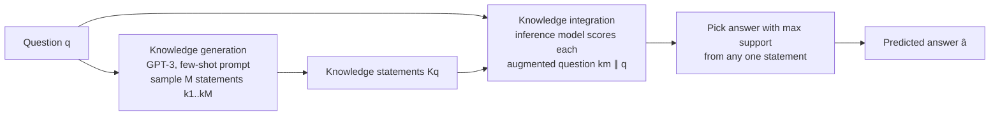

# Generated Knowledge Prompting for Commonsense Reasoning — Summary

> [!NOTE]
> **Source:** [2110.08387-generated-knowledge-prompting.pdf](../../sources/arXiv/2110.08387-generated-knowledge-prompting.pdf) · Liu, J., Liu, A., Lu, X., Welleck, S., West, P., Le Bras, R., Choi, Y., & Hajishirzi, H. (2022) · ACL 2022 · https://arxiv.org/abs/2110.08387
> Study-guide summary of the full document. See the original for exact wording and figures.

## Abstract

This ACL 2022 paper from the University of Washington and the Allen Institute for AI introduces **generated knowledge prompting (GKP)**: instead of retrieving facts from a structured knowledge base, a language model (GPT-3) is prompted few-shot to *generate* question-related knowledge statements, which are then prepended to the question when a second "inference" model answers it. No task-specific finetuning for knowledge integration is needed, yet the method sets new state of the art on three commonsense benchmarks.

**Key points**

- **Two-step mechanism:** (1) *knowledge generation* — prompt GPT-3 with an instruction, five human-written question→knowledge demonstrations, and the new question; sample M = 20 statements per question; (2) *knowledge integration* — concatenate each statement with the question, score every answer choice under the inference model for each augmented question, and pick the answer with the highest support from any single statement (a max over statements, which beats mixture- and product-of-experts aggregation).
- **New state of the art on three benchmarks:** NumerSense 66.18 → 72.47 (+6% over prior best, zero-shot T5-11b), CommonsenseQA 2.0 70.2 → 73.03 (+2%, finetuned Unicorn), QASC 76.74 → 80.33 (+3%, finetuned UnifiedQA). Zero-shot inference models gain 7–10 points across NumerSense, CSQA, and QASC.
- **Knowledge quality matters:** generated knowledge beats random sentences, question continuations, template-based self-talk (+1.89% over it on CSQA dev), and is roughly comparable to retrieval — better than retrieval when no in-domain knowledge base exists (NumerSense), worse when gold facts are retrievable (QASC).
- **Amplification:** gains grow as the inference model shrinks (T5-small + knowledge ≈ T5-3b baseline), yet GPT-3 still gains 9.0% from knowledge elicited from *itself*. The knowledge generator must be large: 175B GPT-3 gives +10.5% on NumerSense, 6.7B gives +5.0%, and 1.3B/0.4B give no significant gain.
- **Human evaluation** (NumerSense and QASC, two NLP experts, Fleiss κ = 0.57): 83% of selected knowledge statements are factual and 72% helpful; 93% of statements that rectify a prediction are judged helpful, and 86% of those that mislead the model are non-factual.

**Takeaways**

- Large LMs are usable as flexible, on-demand external knowledge sources — knowledge stated explicitly in the prompt improves answers even when the same model already "knows" it implicitly.
- The method needs only a handful of human-written demonstrations per task, making it far easier to transfer than template-based elicitation or knowledge-base retrieval.
- Generated knowledge turns implicit commonsense QA into explicit reasoning procedures (deduction, induction, analogy, negation), which is where the accuracy gain comes from — and factuality of the generated knowledge is the main lever for further improvement.

## 1 Introduction

- **Open question:** does external knowledge still help commonsense reasoning now that leaderboards are dominated by large pretrained models finetuned on the target benchmark? Prior work says high-quality external knowledge helps, but gains may wash out as models grow.
- **Flexibility hurdle:** many benchmarks lack knowledge bases with sufficient coverage, and prior integration methods require task-specific custom supervision.
- **Proposal:** *generated knowledge prompting* — generate knowledge from a language model, then provide it as an input prompt concatenated with the question. Requires no structured knowledge base and no joint finetuning, so it works with any zero-shot or finetuned inference model (tested on top of T5-11b-scale models).
- Improves both zero-shot and finetuned models on four benchmarks — NumerSense, CommonsenseQA (CSQA), CommonsenseQA 2.0 (CSQA2), and QASC — with new state of the art on three. Outperforms template-based self-talk; comparable to retrieval-based systems.
- **Three factors drive performance:** (i) knowledge quality, (ii) knowledge quantity (more statements → better, up to a point), (iii) the integration strategy at inference.
- Worked examples (Table 1 of the paper): a vanilla model answers *"the word children means [M] or more kids"* with "one" (0.37); adding the generated statement *"The word child means one kid."* flips it to "two" (0.91). Similar rectifications shown for CSQA, CSQA2 ("The player with the lowest score wins." flips a golf-scoring question from yes to no), and QASC.

## 2 Generated Knowledge Prompting

Task framing: multiple-choice commonsense reasoning — predict answer a ∈ A_q for question q, where the choice set varies by question. The method answers in two steps:

1. **Knowledge generation:** sample knowledge statements from a generator LM conditioned on the question, K_q = {k_m ~ p_G(k|q)}.
2. **Knowledge integration:** the inference model predicts â = argmax_a p_I(a|q, K_q); the vanilla baseline is argmax_a p_I(a|q).

### 2.1 Knowledge Generation

- The prompt = an **instruction** + **five fixed, human-written demonstrations** (task-style question paired with a helpful knowledge statement) + a **new-question placeholder** (example prompts for NumerSense and QASC in Table 2; full prompts in Appendix A.2).
- **Demonstration design rule:** the knowledge statement should turn the commonsense problem into an *explicit reasoning procedure* without directly answering. E.g. for *"Penguins have <mask> wings"*, the good demonstration is *"Birds have two wings. Penguin is a kind of bird."* (sets up deduction); *"Penguins have two wings."* would be a poor demonstration because it just answers.
- At test time, plug the question in and repeatedly sample continuations to obtain K_q = {k_1, …, k_M}.

### 2.2 Knowledge Integration via Prompting

- Form M knowledge-augmented questions by text concatenation: q_0 = q, q_m = [k_m ‖ q].
- Score each answer choice by the augmented question that *best supports it*: p_I(a|q, K_q) ∝ max_{0≤m≤M} p_I(a|q_m) — this favours knowledge statements that strongly support one choice.
- The predicted answer uses a single statement, the **selected knowledge** k̂.
- The inference model can be any off-the-shelf (zero-shot) or task-finetuned LM; **no further finetuning** is done for knowledge prompting.

## 3 Experimental Setup

- **Knowledge generator:** GPT-3 (175B), M = 20 statements per question, nucleus sampling p = 0.5, up to 64 tokens (exception: CSQA2 uses M = 5 and up to 128 tokens), discarding repetitions and empty strings.
- **Inference models:** zero-shot T5-11b and GPT-3, plus finetuned per-dataset SOTA models — UnifiedQA (UQA) and Unicorn.

### 3.1 Datasets and Task Setup

| Dataset | Task | Inference setup |
|---|---|---|
| **NumerSense** (Lin et al., 2020) | Recover a masked number word (zero–ten, plus *no*) in numerical commonsense statements | Zero-shot only (current SOTA): T5 text-infilling; zero-shot GPT-3 by normalised sentence probability |
| **CommonsenseQA (CSQA)** (Talmor et al., 2019) | 5-way multiple choice on common world scenarios | Zero-shot T5 (text-infilling) and finetuned T5 / UnifiedQA (SOTA) |
| **CommonsenseQA 2.0 (CSQA2)** (Talmor et al., 2021) | Binary true/false judgement of commonsense statements | Finetuned Unicorn only (zero-shot models poorly calibrated here) |
| **QASC** (Khot et al., 2020) | 8-way multiple choice, grade-school science; each question has two gold background facts | Zero-shot T5 and finetuned T5 / UnifiedQA (SOTA) |

### 3.2 Inference Model Setup

All inference models are generative LMs; a choice's support is its length-summed token log-probability, softmax-normalised over the choice set.

### 3.3 Knowledge Generation Baselines

| Baseline | Description |
|---|---|
| **∅ Vanilla** | Inference with no knowledge |
| **R Random sentences** | GPT-3 samples unconditioned on the question (same hyperparameters) |
| **C Context sentences** | GPT-3 samples text continuations of the question |
| **T Template-based** | Self-talk (Shwartz et al., 2020) with GPT-3 as generator, M = 20 |
| **IR Retrieval-based** | NumerSense: Wikipedia + GenericsKB sentences; CSQA2: Google snippets; QASC: the gold fact sentences used to build the dataset |
| **A Answers** | GPT-3 prompted to generate direct answers instead of knowledge (1 or 20 per question) |

## 4 Experimental Results

### 4.1 Overall Performance

Key rows of Table 3 (accuracy; K = generated knowledge prompting; bold marks the paper's best-in-column among non-retrieval methods):

| Setting | Vanilla | + GKP (K) |
|---|---|---|
| NumerSense, zero-shot T5-11b (test-all) | 64.05 | **72.47** |
| NumerSense, zero-shot T5-11b (dev) | 67.5 | **78.0** |
| CSQA, zero-shot T5-11b (dev) | 39.89 | **47.26** |
| CSQA, finetuned UQA-11b (dev) | 85.18 | 85.34 |
| CSQA2, finetuned Unicorn (test) | 70.2 | **73.03** |
| QASC, zero-shot T5-11b (test) | 44.89 | **55.00** |
| QASC, finetuned UQA-11b (test) | 76.74 | **80.33** |

- **New state of the art:** NumerSense +6% over the previous best (66.18 → 72.47), CSQA2 +2% over finetuned Unicorn (70.2 → 73.03), QASC +3% over finetuned UnifiedQA (76.74 → 80.33).
- **Zero-shot settings:** improvements of 7–10 points across NumerSense (64.05 → 72.47), CSQA (39.89 → 47.26), and QASC (44.89 → 55.00).
- **Finetuned settings:** consistent but smaller gains over finetuned baselines.

### 4.2 Knowledge Generation Methods

- Random sentences barely help and can hurt (CSQA zero-shot drops 39.89 → 21.79); context sentences give some gain; generated knowledge consistently gives substantial gains — evidence the knowledge itself is high quality.
- **Knowledge is the essential medium:** few-shot GPT-3 answering directly underperforms the best GKP models by 14–20% across all tasks; even feeding GPT-3-generated *answers* (baseline A) to SOTA inference models falls behind GKP on almost every task (one exception: CSQA with zero-shot T5, where A scores 51.84 vs K's 47.26).
- **Beats template-based generation:** on CSQA dev (the only task with self-talk templates), GKP's improvement over the T5-11b baseline exceeds self-talk's by 1.89%.
- **Comparable to retrieval:** on NumerSense, retrieval helps only +0.18/+1.02 (test-core/test-all) while GKP beats retrieval by 8.83/7.37; on CSQA2, GKP narrows but does not close the gap to Google-snippet retrieval; on QASC the "retrieved" knowledge is gold dataset-construction facts, so GKP falls significantly short. Generated knowledge is most valuable **when no appropriate in-domain knowledge base exists**.

### 4.3 Analysis

- **Quantity:** performance rises with the number of statements M, saturates at M = 20, and declines beyond — likely from added noise (Figure 2, QASC dev).
- **Integration method:** the max-over-statements rule (58.32 on QASC dev) beats Mixture-of-Experts (56.26, sum over statements) and Product-of-Experts (55.94, product over statements) — adaptively choosing the best single statement wins.
- **Lightweight inference and amplification** (Figure 3, NumerSense dev): gains grow sharply as the inference model shrinks — with GKP, the smallest T5 matches the T5-3b baseline and T5-large beats the GPT-3 baseline. The gain does not vanish when inference model = generator: GPT-3 gains 9.0% from knowledge elicited from itself, i.e. the method *amplifies* knowledge the model already holds.
- **Generator size** (Figure 4): on T5-11b inference, 175B GPT-3 knowledge gives +10.5%, 6.7B gives +5.0%, and 1.3B/0.4B give no significant improvement — the generator must be relatively large to produce useful, reliable knowledge.

### 4.4 Human Evaluation

- Setup: up to 50 *selected* knowledge statements per dataset (NumerSense, QASC) that flipped T5-11b's prediction (either rectified or misled), labelled by two NLP experts blind to the flip direction, on four axes adapted from Shwartz et al. (2020): grammaticality, relevance, factuality, helpfulness (helpful / neutral / harmful). Moderate agreement, Fleiss κ = 0.57.
- Results (Figure 5): the vast majority are grammatical and relevant; **83% factual**; **72% helpful**, 13% harmful.
- Human–machine agreement: of statements that *rectify* the model, 93% are human-judged helpful; of statements that *mislead* it, only 21% are helpful and 39% harmful. Of helpful-and-rectifying knowledge, 95% is factual; of harmful-and-misleading knowledge, 86% is **non-factual** — so improving factuality is a promising path to more helpful knowledge. Non-selected statements have slightly lower factuality and helpfulness than selected ones.

### 4.5 Qualitative Examples

Prompting with generated knowledge transforms implicit commonsense QA into **explicit reasoning procedures** (Table 5). Each example flips an initially wrong high-confidence answer:

| Question (abridged) | Generated knowledge | Flip | Reasoning type |
|---|---|---|---|
| clams have evolved to have [M] shells | "Clams have a bivalve shell." | no → two | Paraphrasing |
| an easel can have [M] or four legs | "A tripod is a kind of easel." | two → three | Induction |
| Where does a heifer's master live? | "The master of a heifer is a farmer." | slaughter house → farm house | Deduction |
| Aside from water and nourishment what does your dog need? | "Dogs need attention and affection." | walked → lots of attention | Elimination |
| I did not need a servant. I was not a what? | "People who have servants are rich." | in charge → rich person | Abduction |
| Part of golf is trying to get a higher point total than others | "The player with the lowest score wins." | yes → no | Negation |
| Eighth plus eight is smaller than fifteen | "Eighth plus eight is sixteen, which is larger than fifteen." | yes → no | Numerical |
| [M] is used for transportation | "Bicycles are used for transportation." | plastic → boats | Analogy |

## 5 Related Work

- **Eliciting knowledge from pretrained LMs:** LMs implicitly contain queryable knowledge (Davison et al., 2019; Petroni et al., 2019; Jiang et al., 2020) and can directly perform commonsense inference, text classification, and NLI; GKP makes that knowledge explicit and uses it to guide inference.
- **External knowledge bases for commonsense:** injecting KB knowledge via pretraining or finetuning, or grounding questions in knowledge graphs (KagNet, QA-GNN). These require a high-quality, high-coverage, **in-domain** KB; gains diminish under domain mismatch, and some datasets (NumerSense, CSQA2) have no suitable KB at all — the bottleneck GKP sidesteps by using the LM itself as the knowledge source.
- **Adding generated text at inference:** self-talk (template-elicited clarifications), contrastive explanations, CAGE and Latcinnik & Berant (finetuned explanation generators), DynaGen (COMeT-based, confined to social commonsense). Unlike template- or finetuning-based elicitation, GKP needs only a few human-written demonstrations, making it more flexible, transferable, and engineering-efficient.

## 6 Conclusion

Generated knowledge prompting is a simple method: elicit knowledge statements via task-specific, human-written, few-shot demonstrations, then plug them in at inference time with no finetuning for integration. It is effective across multiple datasets, sets new state of the art on three commonsense reasoning tasks, and works in both zero-shot and finetuned settings — highlighting language models as sources of flexible, high-quality knowledge for commonsense reasoning. Code: github.com/liujch1998/GKP.

## Appendix

- **A.1 Comparison with prior methods** (Table 6): GKP is unique in combining a *demonstrations-prompted* off-the-shelf generator with inference models that are zero-shot **or** task-finetuned without joint finetuning. Contrast: CAGE, Latcinnik & Berant, and DynaGen use task-finetuned generators with joint-finetuned inference; self-talk and contrastive explanations use template-prompted generators.
- **A.2 Full knowledge-generation prompts** for NumerSense, CSQA, CSQA2, and QASC (Tables 7–10). Demonstration knowledge sources differ by task: manually written (NumerSense, CSQA), annotated Google featured snippets (CSQA2), gold facts (QASC).
- **A.3 Human evaluation guidelines** (Tables 11–12): detailed definitions with examples for grammaticality, relevance, factuality, and helpfulness (including indirect support via reasoning chains).

> [!WARNING]
> **Limitations and risks (Appendix B):** applying the method to new tasks requires moderate expertise to craft a task-specific prompt, and badly designed prompts can *lower* performance — mitigated by following the paper's demonstration-design guideline (§2.1). No new models were trained; inference cost ~200 GPU hours (Quadro RTX 8000) and knowledge generation ~$500 in OpenAI GPT-3 API usage.
