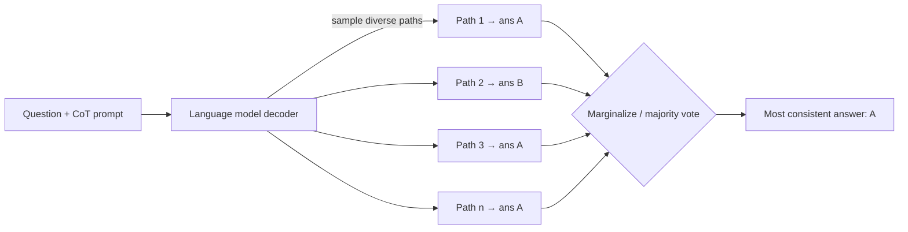

# Self-Consistency Improves Chain of Thought Reasoning in Language Models — Summary

> [!NOTE]
> **Source:** [2203.11171-self-consistency.pdf](../../sources/arXiv/2203.11171-self-consistency.pdf) · Xuezhi Wang, Jason Wei, Dale Schuurmans, Quoc Le, Ed H. Chi, Sharan Narang, Aakanksha Chowdhery, Denny Zhou (Google Research, Brain Team), 2022 · Published as a conference paper at ICLR 2023 · arXiv:2203.11171v4.
> Study-guide summary of the full document. See the original for exact wording and figures.

## Abstract

The paper proposes **self-consistency**, a decoding strategy that replaces the greedy decoding used in chain-of-thought (CoT) prompting: sample *many* diverse reasoning paths, then take the **majority-vote** final answer instead of trusting one greedy chain. It rests on the intuition that a complex problem admits many correct reasoning paths that tend to converge on the same answer, whereas wrong paths disagree.

**Key points**

- **Method = "sample-and-marginalize."** Keep CoT prompting unchanged, but (1) sample a diverse set of reasoning paths from the decoder rather than greedily decoding one, and (2) marginalize out the paths by choosing the most consistent (most frequent) final answer. It is unsupervised, needs no extra training, fine-tuning, verifier, or human annotation — a "self-ensemble" on one model.
- **Large, consistent accuracy gains over greedy CoT** on PaLM-540B / GPT-3: **GSM8K +17.9%**, **SVAMP +11.0%**, **AQuA +12.2%**, **StrategyQA +6.4%**, **ARC-challenge +3.9%** (absolute). Gains hold across four models (UL2-20B, LaMDA-137B, GPT-3-175B, PaLM-540B) and grow with model scale (+3–6% on UL2-20B vs +9–23% on LaMDA-137B/GPT-3).
- **Plain majority vote is as good as probability-weighted aggregation.** On PaLM-540B, unweighted majority vote scores 74.4 on GSM8K vs 74.1 for normalized-weighted-sum; unnormalized weighting is much worse (59.9).
- **Beats alternatives** — sample-and-rank, beam search, and prompt/model ensembles — because diversity of reasoning paths (not just more samples) is the driver. **More sampled paths → better accuracy**, saturating around 20–40 paths.
- **Robust** to sampling parameters (temperature, top-k, nucleus), imperfect prompts, equation-based and zero-shot CoT; it even helps on NLP tasks where adding CoT *hurts* vs standard prompting.

**Takeaways**

- If you already use CoT and can afford several samples, self-consistency is a near-free, model-agnostic accuracy boost — a decoding change, not a training change.
- Start with ~5–10 paths to capture most of the gain cheaply (performance saturates fast); its only real cost is extra inference compute.
- The consistency rate (share of paths agreeing with the chosen answer) correlates with accuracy, so it doubles as an **uncertainty / "know when it doesn't know"** signal. Caveat: models are poorly calibrated per-path, and can still produce nonsensical rationales.

## 1. Introduction

- Language models struggle at reasoning, and scale alone does not fix it (Rae et al., 2021; BIG-bench, 2021). **Chain-of-thought prompting** (Wei et al., 2022) helps by prompting the model to emit intermediate reasoning steps (e.g., "3 + 2 = 5. The answer is 5.") before the answer.
- This paper introduces **self-consistency** to replace the **greedy decoding** used in CoT. Motivating intuition (Stanovich & West, 2000; Evans, 2010): a complex problem admits **multiple reasoning paths to one correct answer**, and the more deliberate the thinking required, the greater the diversity of paths that recover it.
- **"Sample-and-marginalize" decoding:** prompt with CoT, sample a diverse set of reasoning paths (each may reach a different final answer), then marginalize over paths to pick the **most consistent** answer. Analogy: if several different lines of thinking reach the same answer, you have more confidence it is correct.
- Vs greedy decoding, this avoids repetitiveness and local-optimality while mitigating the stochasticity of any single sample.
- **Simpler than prior work:** no trained verifier (Cobbe et al., 2021), no re-ranker built from human annotations (Thoppilan et al., 2022). Self-consistency is entirely **unsupervised**, works off-the-shelf, adds no training/fine-tuning/auxiliary models. It is a **"self-ensemble"** over one model, not a multi-model ensemble.
- Evaluated on four models of varying scale: **UL2-20B** (open, encoder-decoder), **GPT-3-175B**, **LaMDA-137B**, **PaLM-540B**. Improves CoT on all four, with new SoTA on arithmetic tasks when paired with PaLM-540B/GPT-3.
- Headline absolute gains: **GSM8K +17.9%, SVAMP +11.0%, AQuA +12.2%, StrategyQA +6.4%, ARC-challenge +3.9%.**

> [!IMPORTANT]
> The core thesis: correct reasoning processes, even when diverse, tend to **agree** on the final answer more than incorrect ones. Aggregating over many sampled paths therefore recovers the right answer far more reliably than trusting a single greedy chain.

## 2. Self-Consistency Over Diverse Reasoning Paths

- **Setup.** People think differently; deliberate-thinking tasks admit several attack routes. This is simulated by sampling from the decoder. As in Figure 1, a model can produce several valid paths to the same correct answer (Outputs 1, 3) while an erroneous path (Output 2) lands on a different, less-agreed answer.
- **Formalism.** For candidate outputs $i = 1..m$, each output couples a reasoning path $r_i$ (latent) with an answer $a_i \in A$ (fixed answer set), where $r_i \to a_i$. Self-consistency marginalizes over $r_i$ by **majority vote**: $\arg\max_a \sum_{i=1}^{m} \mathbb{1}(a_i = a)$.
- **Compatible with standard sampling:** temperature sampling, top-k sampling, and nucleus sampling.
- **Answer parsing is task-dependent:** arithmetic parses the first number after "The answer is"; commonsense parses the full string. Outputs follow "{reasoning}. The answer is X."

### Aggregation strategies (Table 1, PaLM-540B)

Majority vote (unweighted sum) is essentially tied with the best weighted scheme, and both beat greedy decode. Weighted **average** performs much worse.

| Aggregation | GSM8K | MultiArith | AQuA | SVAMP | CSQA | ARC-c |
|---|---|---|---|---|---|---|
| Greedy decode | 56.5 | 94.7 | 35.8 | 79.0 | 79.0 | 85.2 |
| Weighted avg (unnormalized) | 56.3 | 90.5 | 35.8 | 73.0 | 74.8 | 82.3 |
| Weighted avg (normalized) | 22.1 | 59.7 | 15.7 | 40.5 | 52.1 | 51.7 |
| Weighted sum (unnormalized) | 59.9 | 92.2 | 38.2 | 76.2 | 76.2 | 83.5 |
| Weighted sum (normalized) | 74.1 | 99.3 | 48.0 | 86.8 | 80.7 | 88.7 |
| **Unweighted sum (majority vote)** | **74.4** | **99.3** | **48.3** | **86.6** | **80.7** | **88.7** |

- Weighting each $(r_i, a_i)$ by $P(r_i, a_i \mid \text{prompt, question})$, **normalized by output length** (Eq. 1), roughly matches plain majority vote — because the model treats generated paths as "similarly likely," i.e. its per-path probabilities cluster together.
- That clustering means the model is **not well calibrated** and cannot distinguish good from bad solutions on its own — which is exactly why earlier work trained separate re-rankers/verifiers.

> [!TIP]
> Practical upshot of Table 1: just take the **majority vote**. It needs no probabilities, no length normalization, and matches the best weighted scheme. This is the simplest thing that works.

- **Scope.** Self-consistency applies where the final answer comes from a **fixed answer set** (so votes can be counted). It could extend to open-ended generation if a good consistency metric (agree/contradict) were defined between generations.

## 3. Experiments

Self-consistency robustly improves reasoning accuracy for **every** model tested, across scales.

### 3.1 Experiment setup

- **Arithmetic reasoning:** AddSub, MultiArith, ASDiv, AQUA-RAT, GSM8K (grade-school math), SVAMP.
- **Commonsense reasoning:** CommonsenseQA (CSQA), StrategyQA, AI2 Reasoning Challenge (ARC easy/challenge).
- **Symbolic reasoning:** last-letter concatenation and Coinflip, tested in the harder **out-of-distribution** setting (prompt shows 2-letter/2-flip examples; test on 4-letter/4-flip).
- **Models:** UL2-20B (open, encoder-decoder), GPT-3-175B (public engines code-davinci-001 and code-davinci-002), LaMDA-137B, PaLM-540B.
- **Setting:** few-shot, **no training or fine-tuning**. Same prompts as Wei et al. (2022): 8 exemplars for arithmetic; 4–7 for each commonsense task.
- **Sampling scheme:** UL2-20B & LaMDA-137B use $T=0.5$, top-$k=40$; PaLM-540B uses $T=0.7$, $k=40$; GPT-3 uses $T=0.7$, no top-k truncation.

### 3.2 Main results

- Results averaged over **10 runs, 40 sampled outputs per run**. Baseline = CoT prompting with greedy decoding ("CoT-prompting"). Standard deviation of self-consistency is ≤0.5 on all tasks.
- **Gains grow with scale:** ~+3–6% absolute on UL2-20B, but **+9–23%** on LaMDA-137B and GPT-3. Even for high-accuracy large models (GPT-3, PaLM-540B) it adds **+12–18%** on AQuA/GSM8K and **+7–11%** on SVAMP/ASDiv.
- **New SoTA on almost all arithmetic tasks**, despite being unsupervised and task-agnostic — competitive with methods that require task-specific training/fine-tuning on thousands of examples.

**Arithmetic reasoning (Table 2)** — CoT → self-consistency (absolute gain). Bold = the standout large-model gains.

| Model | AddSub | MultiArith | ASDiv | AQuA | SVAMP | GSM8K |
|---|---|---|---|---|---|---|
| UL2-20B | 18.2 → 24.8 (+6.6) | 10.7 → 15.0 (+4.3) | 16.9 → 21.5 (+4.6) | 23.6 → 26.9 (+3.3) | 12.6 → 19.4 (+6.8) | 4.1 → 7.3 (+3.2) |
| LaMDA-137B | 52.9 → 63.5 (+10.6) | 51.8 → 75.7 (+23.9) | 49.0 → 58.2 (+9.2) | 17.7 → 26.8 (+9.1) | 38.9 → 53.3 (+14.4) | 17.1 → 27.7 (+10.6) |
| PaLM-540B | 91.9 → 93.7 (+1.8) | 94.7 → 99.3 (+4.6) | 74.0 → 81.9 (+7.9) | 35.8 → **48.3 (+12.5)** | 79.0 → 86.6 (+7.6) | 56.5 → **74.4 (+17.9)** |
| GPT-3 code-davinci-001 | 57.2 → 67.8 (+10.6) | 59.5 → 82.7 (+23.2) | 52.7 → 61.9 (+9.2) | 18.9 → 25.6 (+6.7) | 39.8 → 54.5 (+14.7) | 14.6 → 23.4 (+8.8) |
| GPT-3 code-davinci-002 | 89.4 → 91.6 (+2.2) | 96.2 → 100.0 (+3.8) | 80.1 → 87.8 (+7.6) | 39.8 → **52.0 (+12.2)** | 75.8 → **86.8 (+11.0)** | 60.1 → **78.0 (+17.9)** |

**Commonsense & symbolic reasoning (Table 3)** — CoT → self-consistency (gain). SoTA on 5 of 6 tasks.

| Model | CSQA | StrategyQA | ARC-e | ARC-c | Letter (4) | Coinflip (4) |
|---|---|---|---|---|---|---|
| UL2-20B | 51.4 → 55.7 (+4.3) | 53.3 → 54.9 (+1.6) | 61.6 → 69.8 (+8.2) | 42.9 → 49.5 (+6.8) | 0.0 → 0.0 | 50.4 → 50.5 (+0.1) |
| LaMDA-137B | 57.9 → 63.1 (+5.2) | 65.4 → 67.8 (+2.4) | 75.3 → 79.3 (+4.0) | 55.1 → 59.8 (+4.7) | 8.2 → 8.2 | 72.4 → 73.5 (+1.1) |
| PaLM-540B | 79.0 → 80.7 (+1.7) | 75.3 → **81.6 (+6.3)** | 95.3 → 96.4 (+1.1) | 85.2 → 88.7 (+3.5) | 65.8 → 70.8 (+5.0) | 88.2 → 91.2 (+3.0) |
| GPT-3 code-davinci-001 | 46.6 → 54.9 (+8.3) | 56.7 → 61.7 (+5.0) | 63.1 → 72.1 (+9.0) | 43.1 → 53.7 (+10.6) | 7.8 → 10.0 (+2.2) | 71.4 → 75.9 (+4.5) |
| GPT-3 code-davinci-002 | 79.0 → 81.5 (+2.5) | 73.4 → **79.8 (+6.4)** | 94.0 → 96.0 (+2.0) | 83.6 → **87.5 (+3.9)** | 70.4 → 73.4 (+3.0) | 99.0 → 99.5 (+0.5) |

- **Symbolic OOD:** gains remain significant at sufficient model size even in the harder 4-letter/4-flip out-of-distribution setting (large models already hit near-perfect in-distribution accuracy).
- **More paths help (Figure 2, LaMDA-137B):** accuracy rises with the number of sampled paths (1, 5, 10, 20, 40) and consistently exceeds the flat greedy baseline; gains are largest going from 1→~10–20 paths, then saturate near 40. Confirmed for PaLM-540B and LaMDA-137B across many tasks in Figures 7–8.
- **Error repair (Table 4):** worked examples on PaLM-540B (a GSM8K bike-trip problem; a StrategyQA "most populous Albany" question) show greedy decode giving a wrong answer while multiple sampled paths reach the correct one, which then wins the vote.

### 3.3 Self-consistency helps when chain-of-thought hurts performance

Ye & Durrett (2022) showed CoT can *hurt* vs standard prompting on some few-shot NLP tasks. Self-consistency closes and reverses that gap on PaLM-540B (Table 5). On ANLI-R1, e-SNLI and RTE, CoT underperforms standard prompting, but self-consistency beats both.

| Task | Standard (no-rationale) | CoT-prompting | Self-consistency |
|---|---|---|---|
| ANLI R1 / R2 / R3 | 69.1 / 55.8 / 55.8 | 68.8 / 58.9 / 60.6 | **78.5 / 64.5 / 63.4** |
| e-SNLI | 85.8 | 81.0 | **88.4** |
| RTE | 84.8 | 79.1 | **86.3** |
| BoolQ | 71.3 | 74.2 | **78.4** |
| HotpotQA (EM / F1) | 27.1 / 36.8 | 28.9 / 39.8 | **33.8 / 44.6** |

> [!TIP]
> Self-consistency makes adding rationales a **reliable** default for few-shot NLP: even where CoT alone regresses vs plain prompting, self-consistency recovers and surpasses standard prompting.

### 3.4 Comparison to other existing approaches

- **vs Sample-and-rank (GPT-3 code-davinci-001, Figure 3):** ranking the same number of samples by log-probability and taking the top does improve accuracy, but by **much less** than self-consistency across GSM8K, MultiArith, ARC-challenge.
- **vs Beam search (UL2-20B, Table 6):** at matched budget, self-consistency with **sampling** beats beam search. Beam-search decoding of the top beam actually *degrades* as beams grow (AQuA: 23.6 at 1 → 10.2 at 40). Self-consistency *using beam search* to decode paths also underperforms self-consistency using sampling, because **beam search yields lower diversity** — and diversity is the key.

  | AQuA — beams / paths | 1 | 5 | 10 | 20 | 40 |
  |---|---|---|---|---|---|
  | Beam search (top beam) | 23.6 | 19.3 | 16.1 | 15.0 | 10.2 |
  | Self-consistency using beam search | 23.6 | 19.8 | 21.2 | 24.6 | 24.2 |
  | Self-consistency using sampling | 19.7 | 24.9 | 25.3 | 26.7 | **26.9** |

- **vs Ensemble methods (LaMDA-137B, Table 7):** ensembling greedy answers via 3 prompt sets or 40 prompt-order permutations gives only small gains; self-consistency (40 sampled paths) is far larger. E.g. GSM8K: CoT 17.1 → prompt-perm ensemble 19.2 → **self-consistency 27.7**; MultiArith 51.8 → 60.9 → **75.7**.
- **vs Model ensembles (Appendix Table 10):** averaging greedy outputs across models is *worse* than single-model self-consistency, because weaker models drag down stronger ones — e.g. GSM8K self-consistency on PaLM-540B = 74.4, while PaLM-540B+GPT-3 ensemble = 36.6 and LaMDA+GPT-3 = 16.0. Self-consistency is a **"self-ensemble"** needing only one model.

### 3.5 Additional studies

- **Robust to sampling strategy/scale (Figure 4).** On PaLM-540B (GSM8K), self-consistency improves over greedy across all tested $T$ (0.3–0.7), top-$k$, and nucleus $p$ (0.9, 0.95). Across the LaMDA-137B model-size series it improves at every scale; smaller models gain less because some abilities (e.g. arithmetic) only emerge with enough scale.
- **Robust to imperfect prompts (Table 8).** Swapping the intermediate numbers in the prompt for random ones (keeping only the final answer correct) drops greedy accuracy 17.1 → 14.9 on LaMDA-137B GSM8K; **+ self-consistency recovers to 23.4**.

  | Prompt condition (GSM8K) | Accuracy |
  |---|---|
  | LaMDA-137B, correct CoT prompt | 17.1 |
  | LaMDA-137B, imperfect CoT prompt | 14.9 |
  | &nbsp;&nbsp;+ self-consistency (40 paths) | 23.4 |
  | LaMDA-137B, equation prompt | 5.0 |
  | &nbsp;&nbsp;+ self-consistency (40 paths) | 6.5 |
  | PaLM-540B, zero-shot CoT (Kojima et al., 2022) | 43.0 |
  | &nbsp;&nbsp;+ self-consistency (40 paths) | 69.2 (**+26.2**) |

- **Consistency ≈ uncertainty signal (Figure 5).** The consistency rate (% of decodes agreeing with the aggregated answer) is highly correlated with accuracy on GSM8K. Low consistency signals low confidence — a way for a model to "know when it doesn't know."
- **Works for non-NL reasoning and zero-shot CoT (Table 8).** Self-consistency still helps with **equation-only** intermediate steps, though gains are smaller (short equations leave little room for diversity). With **zero-shot CoT** it gives a large **+26.2%** on PaLM-540B GSM8K (43.0 → 69.2).

## 4. Related Work

- **Reasoning in LMs.** LMs struggle at "Type 2" tasks (arithmetic, logical, commonsense; Evans, 2010). Prior fixes were mostly task-specialized. Self-consistency needs no extra supervision or fine-tuning yet substantially improves CoT (Wei et al., 2022).
- **Sampling & re-ranking.** Many decoding strategies exist (temperature, top-k, nucleus, minimum Bayes risk, typical decoding) and diversity-promoting decoding. Re-ranking (Adiwardana et al., 2020; Shen et al., 2021) and verifiers (Cobbe et al., 2021) improve quality but require extra training/annotation; self-consistency does not.
- **Extracting reasoning paths.** Prior task-specific methods (semantic graphs, RNN path retrieval, fine-tuning on annotated paths, latent variables in knowledge graphs). Self-consistency simply couples path + answer generation via sampling and aggregates — no extra modules.
- **Consistency in LMs.** Earlier "consistency" work targeted dialog, explanations, factual extraction, or infinite-length decoding, or added a System-2 logical module (Nye et al., 2021). This paper's notion: **use answer agreement across diverse paths to raise accuracy.**

## 5. Conclusion and Discussion

- **Self-consistency is simple and effective**, significantly improving accuracy across arithmetic and commonsense reasoning over four LLMs of varying scale. It also yields rationales, uncertainty estimates, and improved calibration.
- **Limitation — compute cost.** It runs multiple inferences. Mitigation: try a **small number of paths (5 or 10)** to capture most of the gain, since performance saturates quickly (Figure 2).
- **Future work:** use self-consistency to generate better supervised data for fine-tuning (so a single-run inference becomes more accurate); better grounding of rationale generation, since models can produce incorrect/nonsensical paths (e.g. the imprecise population numbers in the StrategyQA example of Table 4).

> [!CAUTION]
> Ethics/limitation: models can generate nonsensical or non-factual reasoning paths, so outputs need caution. Rationales are useful for inspecting how a model reached an answer and for probing mistakes or biases, but further work is needed on factuality and safety.

## Appendix (selected results)

- **A.1.1 Robust to sampling (Figs 6–8).** LaMDA-137B GSM8K is robust across $T$ and top-$k$; Figures 7–8 confirm self-consistency beats greedy across many tasks on LaMDA-137B and PaLM-540B, with accuracy rising as sampled paths increase.
- **A.1.2 Robust to prompt sets (Table 9).** On PaLM-540B GSM8K, three hand-written prompt sets give greedy CoT of 56.5 / 54.6 / 54.0 and self-consistency of 74.4 / 72.1 / 70.4 — gains of +17.9 / +17.5 / +16.4.
- **A.1.3 Model ensembles (Table 10).** Multi-model greedy ensembles underperform single-model self-consistency (see §3.4).
- **A.1.4 Combining with ensembles (Table 11, PaLM-540B GSM8K).** Self-consistency (74.4) dominates prompt-set (58.9) and prompt-permutation (59.6) ensembles; combining self-consistency with different prompt sets nudges to 75.4.
- **A.2 Resources.** Prompting-only inference. Hardware: UL2 on TPU v3 (4 chips); LaMDA-137B on TPU v3 (64 chips); PaLM-540B on TPU v4 (192 chips); GPT-3 via public API. Jobs ~1–4 h (UL2/LaMDA) to 2–12 h (PaLM) per ~1,000 examples.
- **A.1 / A.3 examples & prompts.** Tables 12–13 give worked greedy-vs-sampled examples on LaMDA-137B and PaLM-540B; Tables 14–21 list the exact few-shot exemplars for AQUA-RAT, ARC, HotpotQA, arithmetic tasks, ANLI, e-SNLI, RTE, BoolQ.
