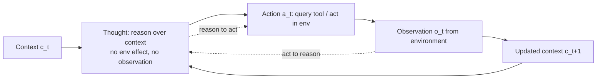

# ReAct: Synergizing Reasoning and Acting in Language Models — Summary

> [!NOTE]
> **Source:** [2210.03629-react-reasoning-acting.pdf](../../sources/arXiv/2210.03629-react-reasoning-acting.pdf) · Yao, Zhao, Yu, Du, Shafran, Narasimhan, Cao (Princeton + Google Research, Brain team), 2022/2023 · ICLR 2023 · arXiv:2210.03629v3 · [react-lm.github.io](https://react-lm.github.io/).
> Study-guide summary of the full document. See the original for exact wording and figures.

## Abstract

ReAct is a prompting paradigm that makes a frozen LLM generate **verbal reasoning traces ("thoughts") and task-specific actions in an interleaved manner**, so reasoning guides which actions/tool calls to take (*reason to act*) and the observations returned by those actions feed back into reasoning (*act to reason*). The central claim: grounding a reasoning chain in an external source (a Wikipedia API, a game/shopping environment) sharply cuts the hallucination and error-propagation that plague reasoning-only chain-of-thought, and adding sparse reasoning to an action-only agent sharply improves task success.

**Key points**

- **Hallucination is the dominant failure of reasoning-only CoT and ReAct largely removes it.** In a human study of 200 HotpotQA trajectories (100 per method), hallucination is **0% of ReAct failures vs. 56% of CoT failures**; false-positive rate among *successful* answers is **6% (ReAct) vs. 14% (CoT)**. True-positive (correct trace + facts) is **94% (ReAct) vs. 86% (CoT)**.
- **Interleaving reasoning with actions beats acting alone on every task.** On **ALFWorld**, best-of-6 ReAct hits **71% success vs. 45% for Act (best-of-6) and 37% for the BUTLER imitation-learning baseline** — a **+34% absolute** gain over BUTLER; even ReAct's *worst* trial (48%) beats the best Act and BUTLER trials. On **WebShop**, ReAct scores **40.0% success / 66.6 score vs. Act 30.1% / 62.3 and IL+RL 28.7% / 62.4** — a **+10% absolute** success-rate gain over prior best, learned from **1–2 in-context examples** vs. baselines trained on 10³–10⁵ instances.
- **On knowledge QA, ReAct beats action-only and trades off with CoT; the combination is best.** HotpotQA EM: Standard 28.7, CoT 29.4, CoT-SC 33.4, **Act 25.7, ReAct 27.4**, and combined **ReAct→CoT-SC 35.1 / CoT-SC→ReAct 34.2**. Fever accuracy: **ReAct 60.9 > CoT 56.3**; combined CoT-SC→ReAct reaches 64.6.
- **The gains generalize across LLMs.** With GPT-3 (text-davinci-002) instead of PaLM-540B, ReAct reaches **HotpotQA EM 30.8 (vs. 29.4)** and **ALFWorld 78.4% (vs. 70.9%)**.
- ReAct trajectories are **human-interpretable and controllable**: because thoughts are explicit, a person can inspect the reasoning and even edit a single thought mid-run to correct the agent.

**Takeaways**

- The reason–act loop (thought → action/tool call → observation → thought …) is the template for grounded LLM agents: it is what turns a "static black box" reasoning chain into one that can check itself against the world.
- Reasoning without grounding hallucinates; acting without reasoning loses the plan. Their synergy — not either alone — is what delivers robustness, and it does so with a handful of exemplars rather than large training sets.
- Prompting alone hits limits (context length, decoding loops); the paper shows **fine-tuning on 3,000 ReAct trajectories** makes a small model beat much larger prompted ones, pointing to how the paradigm scales.

## 1. Introduction

- Human intelligence tightly couples **task-oriented actions with verbal reasoning / "inner speech"** (Alderson-Day & Fernyhough 2015; Vygotsky). Between actions we reason to track progress, handle exceptions, and decide when external info is needed — and act to support reasoning. This synergy enables fast learning and robust decision-making under uncertainty.
- Two research lines had been studied **separately**:
  - **Reasoning** — chain-of-thought (CoT) prompting (Wei et al. 2022) elicits multi-step reasoning, but it is a **static black box**: the model uses only its internal representations, is **not grounded in the external world**, and so cannot reason reactively or update its knowledge. This causes **fact hallucination and error propagation**.
  - **Acting** — LLMs used for planning/acting in interactive environments (SayCan/Ahn 2022; WebGPT/Nakano 2021) predict actions via language priors but **do not reason abstractly about high-level goals** or maintain a working memory to support acting.
- **ReAct** unifies them: prompt the LLM to generate **both reasoning traces and actions, interleaved**, so it can create/maintain/adjust plans (reason to act) and pull in external information (act to reason).
- Evaluated on **four benchmarks**: HotpotQA (multi-hop QA), FEVER (fact verification), ALFWorld (text game), WebShop (web navigation).
- **Four contributions:** (1) introduce ReAct, a prompt-based paradigm synergizing reasoning + acting; (2) few-shot experiments across diverse benchmarks vs. reasoning-only or acting-only priors; (3) ablations isolating the role of acting in reasoning tasks and reasoning in interactive tasks; (4) analysis of prompting limits plus initial fine-tuning results.

## 2. ReAct: Synergizing Reasoning + Acting

**Setup.** An agent at step *t* receives observation *oₜ* and takes action *aₜ* under a policy π(aₜ|cₜ), where context *cₜ* = (o₁,a₁,…,oₜ). When the mapping *cₜ → aₜ* requires heavy implicit reasoning, plain action policies fail (e.g. the act-only agent can't synthesize the final QA answer, or keeps hallucinating actions after failing to notice an item isn't where it looked).

> [!IMPORTANT]
> **The core idea (simple).** Augment the action space to **Â = A ∪ L**, where **L is the space of language**. An action **âₜ ∈ L is a "thought" / reasoning trace** — it does **not** change the environment and returns **no observation**; instead it composes useful information by reasoning over the current context and updates the context (cₜ₊₁ = (cₜ, âₜ)) to support future reasoning or acting.

**Types of useful thought** the model learns to emit: decompose goals and build action plans; inject relevant commonsense; extract key facts from observations; track progress and transition plans; handle exceptions and adjust plans.

**How thoughts and actions are scheduled:**

| Task family | Thought density | Scheduling |
|---|---|---|
| Reasoning-primary (HotpotQA, Fever) | **Dense** — every step is thought→action→observation | Fixed alternation |
| Decision-making with many actions (ALFWorld, WebShop) | **Sparse** — thoughts only at the most relevant positions | Model decides asynchronously when to think |

**Implementation.** Mainly a **frozen PaLM-540B** prompted with few-shot in-context examples (each example a human-written trajectory of thoughts, actions, observations). GPT-3 tried in Appendix A.1 (and does better).

**Four properties of ReAct:**

- **A) Intuitive & easy to design** — annotators just type their thoughts on top of their actions; no ad-hoc format engineering or example selection.
- **B) General & flexible** — the flexible thought space and free thought/action ordering fit QA, fact verification, text games, web navigation.
- **C) Performant & robust** — strong generalization from 1–6 in-context examples; consistently beats reasoning-only or acting-only baselines; further gains with fine-tuning; robust to prompt selection.
- **D) Human-aligned & controllable** — interpretable trace humans can inspect; humans can correct behavior **on the go by thought editing** (Figure 5).

## 3. Knowledge-Intensive Reasoning Tasks (HotpotQA, FEVER)

### 3.1 Setup

- **HotpotQA** — multi-hop QA requiring reasoning over ≥2 Wikipedia passages. **FEVER** — fact verification, each claim labeled SUPPORTS / REFUTES / NOT ENOUGH INFO.
- **Question-only setup:** models get only the question/claim (no support paragraphs); they must rely on internal knowledge or retrieve via the environment.
- **Action space — a deliberately weak Wikipedia API** (to force retrieval via explicit reasoning, simulating a human):
  - `search[entity]` → first 5 sentences of the entity's wiki page, or top-5 similar entities if none.
  - `lookup[string]` → next sentence in the page containing *string* (like browser Ctrl+F).
  - `finish[answer]` → ends the task with the answer.

### 3.2 Methods

- **ReAct prompting** — 6 HotpotQA / 3 FEVER hand-written **dense** thought-action-observation exemplars (more examples don't help). Thoughts decompose questions, extract facts, do commonsense/arithmetic reasoning, guide search reformulation, and synthesize the final answer.
- **Baselines** (ablations of ReAct trajectories): **Standard** (remove all thoughts/actions/obs); **CoT** (remove actions/obs — reasoning-only); **CoT-SC** (self-consistency: 21 CoT samples at temp 0.7, majority vote); **Act** (remove thoughts — acting-only, loosely like WebGPT).
- **Combining internal + external knowledge** (ReAct is grounded but rigid; CoT structures reasoning well but hallucinates), via heuristics:
  - **ReAct → CoT-SC:** if ReAct returns no answer within N steps (7 HotpotQA / 5 FEVER), back off to CoT-SC.
  - **CoT-SC → ReAct:** if the majority CoT-SC answer occurs < n/2 times (low internal confidence), back off to ReAct.
- **Fine-tuning** — bootstrap (STaR-style): use **3,000 ReAct-generated correct trajectories** to fine-tune smaller PaLM-8B/62B to decode full trajectories.

### 3.3 Results and observations

**Table 1 — PaLM-540B prompting on HotpotQA (EM) and Fever (Acc):**

| Method | HotpotQA (EM) | Fever (Acc) |
|---|---|---|
| Standard | 28.7 | 57.1 |
| CoT | 29.4 | 56.3 |
| CoT-SC (21 samples) | 33.4 | 60.4 |
| Act | 25.7 | 58.9 |
| ReAct | 27.4 | **60.9** |
| CoT-SC → ReAct | 34.2 | **64.6** |
| ReAct → CoT-SC | **35.1** | 62.0 |
| Supervised SoTA | 67.5 | 89.5 |

- **ReAct > Act on both tasks** — reasoning helps guide acting, especially synthesizing the final answer.
- **ReAct vs. CoT:** ReAct beats CoT on Fever (60.9 vs. 56.3) but slightly lags on HotpotQA (27.4 vs. 29.4). Fever SUPPORTS/REFUTES claims can differ subtly, so retrieving accurate, up-to-date knowledge is decisive.
- **ReAct + CoT-SC is best**, and the two combined methods **beat CoT-SC across all sample counts**, reaching 21-sample CoT-SC performance with just **3–5 samples** — showing the value of combining internal and external knowledge.

**Table 2 — Human-labeled success/failure modes (50 correct + 50 incorrect trajectories each for ReAct and CoT on HotpotQA):**

| | Type | ReAct | CoT |
|---|---|---|---|
| **Success — True positive** | correct reasoning trace & facts | **94%** | 86% |
| **Success — False positive** | hallucinated trace/facts | **6%** | 14% |
| **Failure — Reasoning error** | wrong trace (incl. repetitive loops) | 47% | 16% |
| **Failure — Search result error** | search empty / unhelpful | 23% | – |
| **Failure — Hallucination** | hallucinated trace/facts | **0%** | 56% |
| **Failure — Label ambiguity** | right but didn't match label | 29% | 28% |

- **A) Hallucination is CoT's #1 problem** (56% of its failures, 14% false-positive success) and is essentially eliminated by ReAct (0% / 6%) because it is grounded in the external knowledge base.
- **B) The structural thought-action-observation constraint reduces flexibility**, giving ReAct a *higher reasoning-error rate* (47% vs 16%). A ReAct-specific failure: the model **repeats its previous thoughts/actions and can't break the loop** (suspected to stem from greedy decoding; beam search might help).
- **C) Informative retrieval is critical for ReAct** — non-informative search (23% of errors) derails reasoning. This factuality-vs-flexibility trade-off is exactly what the ReAct+CoT combination is designed to bridge.
- Some HotpotQA gold labels are **outdated**, penalizing correct ReAct answers.

**Fine-tuning (Figure 3, HotpotQA):** with **prompting**, ReAct is the *worst* of the four at PaLM-8B/62B (hard to learn reasoning+acting from few examples). But **fine-tuned on 3,000 examples ReAct becomes the best**: fine-tuned **PaLM-8B ReAct beats all PaLM-62B prompting**, and **fine-tuned PaLM-62B ReAct beats all 540B prompting**. Fine-tuning Standard/CoT just teaches memorization of (possibly hallucinated) facts, whereas Act/ReAct teach the generalizable skill of retrieving from Wikipedia.

## 4. Decision-Making Tasks (ALFWorld, WebShop)

Both are long-horizon, sparse-reward interactive environments — a good test for reasoning to plan and explore.

**ALFWorld** — synthetic text game aligned with embodied ALFRED; **6 task types** (e.g. "examine paper under desklamp") via text actions (go to, take, use). Instances can have **>50 locations and take an expert >50 steps**. A built-in challenge: infer **likely locations** of household items (a fit for LLM commonsense). ReAct uses **3 annotated trajectories per task type** with *sparse* thoughts that (1) decompose the goal, (2) track subgoal completion, (3) pick the next subgoal, (4) reason via commonsense where to find an object. Evaluated on **134 unseen games**; 6 prompts per task type via permutations. Baseline: **BUTLER**, an imitation-learning agent trained on **10⁵ trajectories per task type**.

**Table 3 — ALFWorld task-specific success rate (%):**

| Method | Pick | Clean | Heat | Cool | Look | Pick2 | **All** |
|---|---|---|---|---|---|---|---|
| Act (best of 6) | 88 | 42 | 74 | 67 | 72 | 41 | 45 |
| ReAct (avg) | 65 | 39 | 83 | 76 | 55 | 24 | 57 |
| **ReAct (best of 6)** | 92 | 58 | 96 | 86 | 78 | 41 | **71** |
| ReAct-IM (avg) | 55 | 59 | 60 | 55 | 23 | 24 | 48 |
| ReAct-IM (best of 6) | 62 | 68 | 87 | 57 | 39 | 33 | 53 |
| BUTLER (best of 8) | 46 | 39 | 74 | 100 | 22 | 24 | 37 |

- **Best ReAct = 71% vs. Act 45% vs. BUTLER 37% → +34% absolute over BUTLER.** Even the *worst* ReAct trial (48%) beats the best of both.
- ReAct's advantage over Act is consistent across all 6 controlled trials: **relative gain 33%–90%, averaging 62%.** Without thoughts, Act fails to decompose goals into subgoals or loses track of state.

**WebShop** — real-world online-shopping environment: **1.18M products, 12k human instructions**, mixed structured/unstructured Amazon text. Agent must buy a product matching an instruction (attributes, price) via search/choose-option/buy. Evaluated on **500 test instructions** by average **score** (% desired attributes covered) and **success rate** (% episodes fully satisfying requirements). Baselines: **IL** (1,012 human trajectories) and **IL+RL** (+10,587 instructions).

**Table 4 — WebShop:**

| Method | Score | Success rate |
|---|---|---|
| Act | 62.3 | 30.1 |
| **ReAct** | **66.6** | **40.0** |
| IL | 59.9 | 29.1 |
| IL+RL | 62.4 | 28.7 |
| Human expert | 82.1 | 59.6 |

- One-shot **Act already matches IL/IL+RL**; adding sparse reasoning (**ReAct**) gives **+10% absolute success** over prior best. ReAct better identifies instruction-relevant products/options by bridging noisy observations and actions. All methods remain **far below human experts**, who explore and reformulate queries more.

**Internal reasoning vs. external feedback (ReAct-IM ablation).** ReAct is claimed as the **first demonstration of combined reasoning + action by an LLM in a closed-loop interactive environment**. Closest prior work is **Inner Monologue (IM)** (Huang et al. 2022b), whose "inner monologue" is limited to environment-state observations and what remains to be done. ReAct's reasoning is flexible and sparse, admitting diverse thought types. An IM-style dense-external-feedback prompt (**ReAct-IM**) scores only **53% vs. ReAct's 71%** on ALFWorld (Table 3), winning on 5/6 tasks; ReAct-IM often misjudges when subgoals finish or where items are, due to a lack of goal decomposition and commonsense reasoning.

## 5. Related Work

- **LLMs for reasoning:** CoT (Wei 2022) and follow-ups — least-to-most, zero-shot-CoT, self-consistency, Selection-Inference, **STaR** (bootstrap fine-tuning on self-generated rationales), Faithful Reasoning, Scratchpad. Unlike these *isolated, fixed* reasoning methods, **ReAct integrates actions and their observations into a coherent input stream**, so it reasons more accurately and can tackle tasks beyond reasoning (interactive decision-making).
- **LLMs for decision-making:** WebGPT (LM + browser, but no explicit reasoning; expensive RL from human feedback); dialogue systems (BlenderBot, Sparrow, SimpleTOD) that learn API-call decisions without explicit reasoning and need costly human data. **ReAct learns a policy cheaply** — the decision process only needs a language description of the reasoning. Most relevant embodied work: **SayCan** (LLM proposes actions, reranked by an affordance model) and **Inner Monologue** (injected environment feedback; ReAct builds on its closed-loop idea but argues it lacks true inner thoughts).

## 6. Conclusion

- **ReAct is a simple, effective method to synergize reasoning and acting in LLMs**, giving superior performance with interpretable decision traces across multi-hop QA, fact checking, and interactive decision-making.
- **Limitations:** complex, large-action-space tasks need more demonstrations, which can exceed the in-context length limit; greedy decoding can cause repetitive loops.
- **Directions:** fine-tuning with more high-quality human annotations; scaling ReAct with multi-task training and combining it with RL for stronger agents.

## Appendix highlights

- **A.1 — GPT-3 generality (Table 5):** ReAct with GPT-3 (text-davinci-002, greedy) beats PaLM-540B — **HotpotQA EM 30.8 vs. 29.4; ALFWorld 78.4% vs. 70.9%** — likely because GPT-3 is instruction-tuned. Confirms ReAct is effective across different LLMs.
- **A.2 — Up-to-date knowledge:** examples where ReAct retrieves current facts (via the Wikipedia API) that reasoning-only CoT gets wrong from stale internal knowledge.
- **Human-in-the-loop thought editing (Figure 5 / Appendix D):** editing a *single* ReAct thought (e.g. correcting where the agent should look next) redirects the whole downstream trajectory to success — evidence of ReAct's controllability that black-box baselines lack.
- **C — Prompts:** full HotpotQA / FEVER / ALFWorld / WebShop prompts, showing the Standard / Act / CoT / ReAct format differences (e.g. HotpotQA `Search[…] / Lookup[…] / Finish[…]` actions interleaved with `Thought` steps).

> [!TIP]
> **The reusable pattern for tool-using agents:** interleave a free-form *Thought* (plan / extract / handle exception) with a *tool call*, feed the returned *Observation* back as context, and repeat. Reasoning decides which tool to call and how to interpret results; the tool's grounded output keeps the reasoning honest. That loop is what cuts hallucination (0% vs 56% of failures) and lifts interactive success (+34% ALFWorld, +10% WebShop) over reason-only or act-only agents.
