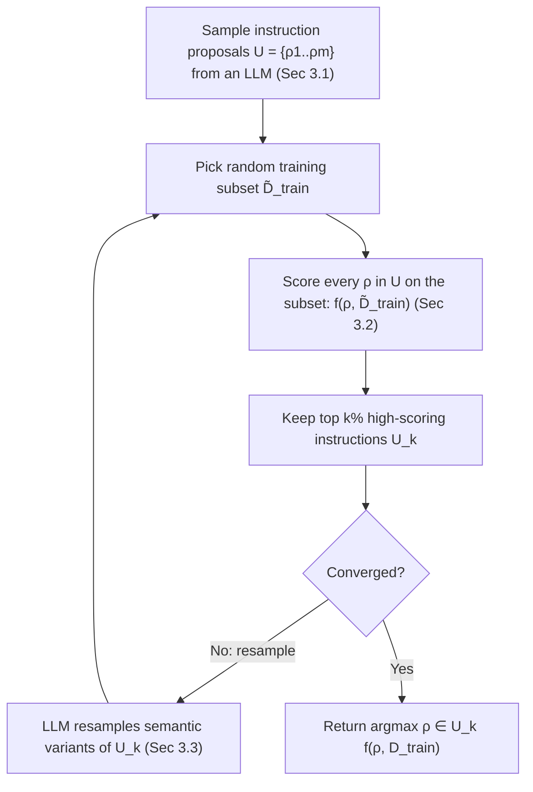

# Large Language Models Are Human-Level Prompt Engineers — Summary

> [!NOTE]
> **Source:** [2211.01910-automatic-prompt-engineer.pdf](../../sources/arXiv/2211.01910-automatic-prompt-engineer.pdf) · Yongchao Zhou, Andrei Ioan Muresanu, Ziwen Han, Keiran Paster, Silviu Pitis, Harris Chan, Jimmy Ba (University of Toronto, Vector Institute, University of Waterloo), 2023 · ICLR 2023 · arXiv:2211.01910v2 · code: github.com/keirp/automatic_prompt_engineer.
> Study-guide summary of the full document. See the original for exact wording and figures.

## Abstract

The paper proposes **Automatic Prompt Engineer (APE)**, an algorithm that uses an LLM to automatically *generate* and *select* natural-language instruction prompts, framing prompt engineering as black-box **natural-language program synthesis** — the instruction is the "program" to optimise. Automatically discovered instructions match or beat human-authored prompts on **24/24 Instruction Induction tasks** and **17/21 curated BIG-Bench tasks**, and APE even improves on the famous zero-shot chain-of-thought prompt.

**Key points**

- **The method:** an LLM proposes candidate instructions from a handful of input–output demonstrations (forward or reverse/infilling generation), each candidate is scored on how well the target LLM executes it (execution accuracy or log-probability), the top candidates are kept, and optionally an LLM resamples semantic variants (iterative Monte Carlo search). Return the highest-scoring instruction (Algorithm 1).
- **Zero-shot, Instruction Induction:** APE with InstructGPT (text-davinci-002) reaches an interquartile mean (IQM) of **0.810** across 24 tasks vs **0.749** for human prompt engineers, and beats the "Greedy" baseline (Honovich et al. 2022 — APE without search/selection) on **every** task; it equals or beats humans on **24 of 24** tasks.
- **BIG-Bench (BBII, 21 curated tasks):** APE-generated prompts match or improve normalized zero-shot performance on **17 of 21** tasks.
- **Better zero-shot chain-of-thought:** starting from Kojima et al.'s "Let's think step by step.", APE discovered **"Let's work this out in a step by step way to be sure we have the right answer."**, lifting InstructGPT MultiArith accuracy from **78.7 → 82.0** and GSM8K from **40.7 → 43.0** (raw zero-shot MultiArith was only 17.7).
- **Few-shot:** simply prepending an APE instruction to standard in-context prompts improves few-shot performance on **21 of 24** tasks.
- **TruthfulQA:** with only 200 candidate instructions, APE beats the human "help" prompt and reaches **>40%** answers that are both true and informative vs **~30%** for the human prompt, tracing the truthfulness–informativeness Pareto frontier.

**Takeaways**

- Prompt engineering — the hand-crafting of instructions that steer black-box LLMs — can be **automated by LLMs themselves**, with human-level or better results and minimal human input.
- The winning recipe is simple: **propose many candidates, score them by execution, keep the best.** Sampling ~50 candidates suffices; iterative refinement adds only marginal gains. Execution accuracy is a better selection metric than log-probability.
- **Larger, instruction-tuned models are more cost-efficient** for the job despite higher per-token cost, because they produce shorter, higher-quality instructions that reduce scoring cost.
- Instructions are **model-specific**: an instruction optimised for InstructGPT transfers poorly to GPT-3 (and vice versa) — the scoring model and the execution model should be aligned.

## Introduction

- LLMs' scale plus attention give them unprecedented **generality** (Kaplan et al. 2020; Vaswani et al. 2017) — often superhuman across zero- and few-shot tasks. This raises a **control** problem: how do we make an LLM do what we want?
- Prior control approaches: fine-tuning, in-context learning, soft-prompt tuning (differentiable), and **natural-language prompt engineering**. The last is the natural human–machine interface and also matters for prompted image synthesizers (DALL·E, Stable Diffusion).
- Plain prompts often fail even when a different phrasing would work, so humans must **experiment** blindly — they have little insight into how compatible a given instruction is with a given model.

> [!NOTE]
> **Framing.** The paper views LLMs as **black-box computers that execute programs specified by natural-language instructions**. Instruction quality can only be measured by running the instruction on a downstream task.

> [!IMPORTANT]
> Central thesis: reframe instruction generation as **natural-language program synthesis** and solve it as a **black-box optimisation** problem guided by LLMs. APE uses LLMs in three roles: (1) an **inference model** proposing candidate instructions from demonstrations, (2) a **scorer** grading each candidate under the target model, and (3) an **iterative resampler** producing semantically similar variants of the best candidates.

**Stated contributions**

- Frame instruction generation as natural-language program synthesis; formulate as LLM-guided black-box optimisation with naive and iterative Monte Carlo search.
- APE achieves human-level zero-shot performance on **24/24** Instruction Induction and **17/21** BIG-Bench tasks.
- Extensive analyses plus applications: improving few-shot learning, finding better zero-shot CoT prompts, and steering toward truthfulness/informativeness.

> [!NOTE]
> The authors define "prompt engineering" narrowly as **optimising the language of a single prompt** to elicit best performance — explicitly *not* prompt chaining or tool use.

## Related Work

| Area | What prior work does | What APE does differently |
|------|----------------------|---------------------------|
| **Large language models** | Scaling model/data/compute predictably improves NLP performance; emergent abilities include in-context learning, zero-shot solving, CoT, instruction following/induction | Treats the LLM as a black-box computer and controls it with **model-generated** instructions |
| **Prompt engineering** | Manual (Reynolds & McDonell) or automatic (AutoPrompt, Gao et al.); most tuning is gradient-based over continuous soft prompts | Gradient-free discrete search in **natural-language** space; the *entire* search (proposal + scoring + paraphrasing) is done by a **single LLM**, not specialized per-component models or human templates |
| **Program synthesis** | Search a program space for a program meeting a spec (input–output examples or NL); needs structured hypothesis spaces + component libraries | Uses the LLM's own structure to search **natural-language programs**; inference models require **no training** and generalize across tasks |

## Natural Language Program Synthesis Using LLMs

Given a dataset `D_train = {(Q, A)}` of input/output demonstrations and a prompted model `M`, the goal is a single instruction `ρ` such that `M([ρ; Q])` produces `A`. Formally, find the instruction maximising the expected per-sample score:

`ρ* = argmax_ρ f(ρ) = argmax_ρ E_(Q,A)[f(ρ, Q, A)]`   (Eq. 1)

`Q` may be the empty string (optimising a prompt that directly emits `{A}`). Because we cannot know a priori how compatible an instruction is with `M`, treat this as **black-box optimisation guided by LLMs**, with two key components: **proposal** and **scoring**.

**Algorithm 1 (APE) at a glance:**

### 3.1 Initial proposal distributions

The natural-language search space is infinite, which historically made this intractable. But LLMs generate good, diverse text, so ask an LLM to approximately sample from `P(ρ | D_train, f(ρ) is high)` given the demonstrations.

| Mode | How it works | When to use |
|------|--------------|-------------|
| **Forward generation** | Put demonstrations first and have the LLM complete the instruction at the end (e.g. "*The instruction was ___*"). Works out-of-the-box for most pretrained LLMs. | Default; Instruction Induction experiments (follows Honovich et al. 2022) |
| **Reverse generation** | Use an **infilling** model (T5, GLM, InsertGPT) to fill an `<INSERT>` blank so the instruction can appear anywhere, not just at the end | When the instruction belongs at the start of the passage; needed for many tasks |
| **Customized prompts** | Seed the reverse model with the dataset's human-designed instructions to propose fitting variants | TruthfulQA (starts from original dataset instructions) |

### 3.2 Score functions

- **Execution accuracy (`f_exec`)** — usually the 0-1 loss `1[M([ρ; Q]) = A]` (Honovich et al. 2022); some tasks use order-invariant set matching. **Chosen as the default** — it aligns better with test performance.
- **Log probability** — a softer score, `log P(A | [ρ; Q])` under the target model, giving finer-grained signal when ranking low-quality candidates.
- **Efficient score estimation** — a **multi-stage adaptive filtering** scheme: score all candidates on a small subset first; promising ones (above a threshold) get evaluated on new non-overlapping subsets to refine a moving-average score; repeat until few remain, which are scored on the full training set. This spends compute on good candidates and starves bad ones (cf. Li et al. 2022; Maclaurin & Adams 2015).

### 3.3 Iterative proposal distributions (iterative APE)

If the initial set `U` lacks diversity or a high-scorer, run **iterative Monte Carlo search**: evaluate candidates, drop the low scorers, and ask an LLM to "*Generate a variation of the following instruction while keeping the semantic meaning*" to explore locally around the best.

> [!TIP]
> Iterative search *does* raise the overall quality of the proposal set, but the **top-scoring instruction usually stays the same**, with diminishing returns after ~3 rounds. So APE runs **without** iterative search by default; iterative helps most on hard tasks where a good initial `U` is difficult to generate.

## Large Language Models Are Human-Level Prompt Engineers (Results)

Examined from four angles: zero-shot, few-shot in-context, zero-shot CoT, and truthfulness. Experiments use **InstructGPT (text-davinci-002)** via the OpenAI API; each is repeated over 5 random seeds.

### 4.1 Instruction Induction (24 tasks)

- 24 tasks from Honovich et al. (2022) spanning spelling, morphosyntax, syntax, lexical semantics, phonetics, knowledge, style, numerical, multilingual translation, and GLUE (sentiment, sentence similarity, word-in-context). For each, sample **5** input–output pairs and select the best instruction via Algorithm 1.
- Baselines: **Human** (gold, manually-verified annotations from Honovich et al. 2022) and **Greedy** (Honovich's model-generated instruction — effectively APE with no search/selection).

> [!IMPORTANT]
> **Zero-shot:** APE beats Greedy on *every* task and equals or beats humans on **24 of 24** tasks. Interquartile mean across the 24 tasks: **APE = 0.810 vs Human = 0.749** (Figure 1b). In the IQM chart, APE + InstructGPT-175B tops out at **0.81** while Greedy-175B sits at 0.40 and 0.03.
- **Few-shot in-context:** prepend the (zero-shot-selected) instruction before the in-context demonstrations — improves or matches standard in-context learning on **21 of 24** tasks. Counter-intuitively, adding in-context examples *hurts* on Rhymes, Large Animal, and Second Letter (the selected instructions overfit the zero-shot case); switching to a **few-shot selection metric** fixes this for most.

> [!NOTE]
> **Rhymes "hack":** 4 of 5 filtered instructions told the model to *echo the input word* (every word rhymes with itself → near-perfect test accuracy), but adding non-trivial in-context rhyme examples then clashes with the instruction and collapses performance — a cautionary example of reward-hacking the metric.

### 4.2 BIG-Bench (BBII)

- The authors curate **BIG-Bench Instruction Induction (BBII)**: a clean, tractable subset of **21 tasks** with a clear human-written instruction applicable to all examples, distilled from 212 BIG-Bench tasks via successive filters (JSON → single sub-task → ≥150 examples → has human baseline → classification/exact-match). Includes all nine BigBench-Hard tasks and covers emotional understanding, QA, reading comprehension, summarization, algorithms, and arithmetic/commonsense/symbolic/logical reasoning.
- Using **reverse-mode** generation and ranking by execution accuracy, APE matches or improves zero-shot performance (normalized metric: 100 = human expert, 0 = random) on **17 of 21** tasks. Big wins include object counting (2.0 → 44.0), navigate (−8.0 → 12.0), winowhy (−12.0 → 12.0), and word sorting (11.0 → 30.0); notable losses on ruin names (1.3 → −14.7) and logical fallacy detection (24.0 → 12.0).

### 4.3 Zero-shot Chain of Thought

- **Zero-Shot-CoT** (Kojima et al. 2022): prepending "**Let's think step by step.**" lifts InstructGPT MultiArith from **17.7 → 78.7** and GSM8K from **10.4 → 40.7**; it was the best of at least nine human-designed prompts.
- **APE's approach** (inspired by STaR, Zelikman et al. 2022): generate a dataset of questions + reasoning steps using "Let's think step by step.", discard incorrect answers, then use APE to find a prompt starting with "Let's" that maximises the likelihood of the correct reasoning traces.

> [!IMPORTANT]
> APE discovered **"Let's work this out in a step by step way to be sure we have the right answer."**, which improved MultiArith **78.7 → 82.0** and GSM8K **40.7 → 43.0** over the human prompt. Table 7 ranks trigger prompts on MultiArith: APE (82.0) > "Let's think step by step." (78.7) > "First," (77.3) > "Let's think about this logically." (74.5) > … vs plain zero-shot at 17.7.

This is presented as the canonical APE use-case: **prompt engineers use APE to optimise part of an existing template.** Across the 12 CoT tasks, APE's prompt improves 6/12 and nearly matches human performance on 4/12 (Shuffled Objects and Last Letter are hard to optimise with a single general prompt).

### 4.4 TruthfulQA

- Applied to **TruthfulQA** (Lin et al. 2022) to study steering an LLM toward different answer styles and the **truthfulness vs informativeness** trade-off, using metrics **% True**, **% Info**, and **%True + %Info**, scored by the paper's fine-tuned GPT-judge/GPT-info (which agree with human raters >90% of the time).
- Setup: sampled **100 of 817** questions as training demonstrations; a reverse model proposed instructions from 6 demo pairs; sought a **single** generic instruction working across all 38 categories (health, law, politics, fiction). Example discovered instruction: *"You will be asked a series of questions. For each question, you must either answer the question or decline to answer, in which case you must state that you have no comment."*

> [!IMPORTANT]
> With only **200 candidates** from InstructGPT (175B), APE beats the human "help" prompt. Choosing the top 10 of 200 on training generalizes to test. APE reaches **>40%** answers that are both true and informative vs **~30%** for the human prompt.

> [!CAUTION]
> The authors stress these TruthfulQA results are **not comparable to the original benchmark** and **not "true few-shot learning"** (Perez et al. 2021), since instructions were optimised on part of the QA data. Instructions discovered tend to sit at the *ends* of the %true–%info Pareto frontier — e.g. very high truthfulness via "No comment" answers that convey little information.

## Quantitative Analysis

Analyses of the three components — proposal distribution, score functions, iterative search — plus a cost analysis (Appendix D).

### 5.1 LLMs for the proposal distribution

- Across **8** OpenAI models, generating 250 instructions each and measuring execution accuracy on 50 test points: **larger models and instruction-tuned models produce better proposal distributions.** On a simple task (Pluralization) all InstructGPT-175B instructions are reasonable; on a hard task (Starting With) about half are off-topic.

### 5.2 LLMs for selection

- **Does sampling more help?** Yes, monotonically with diminishing returns: increasing candidates from 4 → 128, human-level performance is reached at **64** samples; the paper uses **50** as default (Figure 7 Left).
- **Do small models work?** Even weak models generate *some* good instructions if you sample enough, which is why APE's selection beats the Greedy baseline across all 8 models.
- **Which scoring metric?** On 24 tasks (250 instructions each, forward mode), **execution accuracy** correlates better with held-out test accuracy than log-probability, so it is the default (Figure 7 Middle, Spearman correlation).

### 5.3 Iterative Monte Carlo search

- Iterative rounds raise the proposal set's quality (survival curves rise), but **quality stabilizes after ~3 rounds**. Iterative APE marginally helps on tasks where plain APE underperforms humans and is roughly tied elsewhere — consistent with it mattering only when the initial `U` is poor.

## Conclusion

LLMs are general-purpose computers executing natural-language programs. APE **automates prompt engineering** as an LLM-guided black-box optimisation, achieving human-level performance with minimal human input. As LLMs increasingly follow instructions, the authors expect future models (including for formal program synthesis) to expose a natural-language interface; this work is a foundation for controlling and steering generative AI.

## Appendix highlights

- **Appendix A — Prompt engineering in the wild:** notes the public boom in prompt guides/tools for text and image models; the Algorithm 1 framework generalizes to any model with a natural-language interface given a suitable proposal method and score function.
- **Appendix B — Task tables:** Table 1 lists all 24 Instruction Induction tasks with example instructions and demonstrations (e.g. Antonyms: "won → lost"; Passivization; Translation en-de/es/fr). Table 2 describes the 21 BBII tasks; Tables 3–4 document the 212 → 57 BIG-Bench filtering funnel and the split into 21 BBII / 21 Invalid-format / 13 Out-of-scope tasks.
- **Appendix B/Table 5 — Templates:** the exact meta-prompts, including forward ("*I gave a friend an instruction and five inputs… The instruction was ___*"), the two reverse templates (friend and "Professor Smith"), the resample template, and the Zero-shot-CoT template ("*A: Let's ___.*").
- **Appendix C.4 — Other proposal LLMs:** OPT-175B, OpenAI Codex (forward) and INT4 GLM-130B (reverse) tested on 6 tasks. Codex and OPT nearly match InstructGPT despite differing from the scoring model, though OPT sometimes smuggles in-context examples into its "instructions"; GLM does worst (its infilling is trained for very short text). The **meta prompt matters** and can help or hurt per task (meta-prompt engineering left to future work).
- **Transferability:** instructions transfer poorly between InstructGPT and GPT-3 in either direction; a human-written instruction mitigates the drop. **Alignment between scoring model and execution model is crucial.**
- **Appendix D — Cost analysis:** larger, human-aligned models dominate the **accuracy–cost frontier** of APE. Although smaller models are cheaper per token, they are *more expensive overall* for APE because most cost is in scoring, and larger instruction-tuned models emit **shorter** instructions that cut scoring cost. Recommendation: use the larger, human-aligned model; view APE's cost as a **one-time overhead to distill a better prompt**, which then amortizes across many inferences. Optimising prompt length is a future direction.
