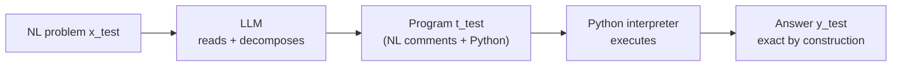

# PAL: Program-aided Language Models — Summary

> [!NOTE]
> **Source:** [2211.10435-pal-program-aided.pdf](../../sources/arXiv/2211.10435-pal-program-aided.pdf) · Gao, Madaan, Zhou, Alon, Liu, Yang, Callan & Neubig (Carnegie Mellon University / Inspired Cognition), 2022 · arXiv:2211.10435 (v2, 27 Jan 2023); published at ICML 2023 · <https://arxiv.org/abs/2211.10435> · code/data at reasonwithpal.com.
> Study-guide summary of the full document. See the original for exact wording and figures.

## Abstract

PAL (Program-Aided Language models) is a few-shot prompting method in which the LLM reads a natural-language problem and generates a **program** (Python) as its chain of thought, then **offloads the actual computation to an interpreter** rather than producing the answer in prose. Decomposition stays with the LLM; solving is delegated to a runtime that is "correct by construction" given the right program, which fixes chain-of-thought's characteristic failure — a correct reasoning chain that still yields a wrong number.

**Key points**

- **Mechanism:** each in-context example is a pair `⟨x, t⟩` where `t` interleaves natural-language steps (as `#` comments the interpreter ignores) and Python statements — and, unlike COT, **no final answer is given in the prompt**. The generated program is run once, post-hoc, and its output is the answer.
- **GSM8K:** PAL with Codex (`code-davinci-002`) hits **72.0%** greedy top-1, beating COT PaLM-540B (56.9%) by an **absolute 15%**, and reaches **80.4%** with majority@40 (1.9% over Minerva-540B).
- **Robustness on large numbers (GSM-HARD):** when GSM8K numbers are swapped for up-to-7-digit integers, COT collapses from 65.6% to ~20% and DIRECT from 19.7% to 5.0%, while PAL stays at **61.2%** — an absolute **~40%** gain over COT. Analysis shows the failure is arithmetic, not reasoning: in 16/25 cases COT's natural-language "thoughts" were near-identical across the easy and hard versions.
- **Breadth:** PAL beats COT on all **13** math, symbolic and algorithmic tasks from GSM8K, SVAMP, ASDIV, MAWPS and BIG-Bench Hard — e.g. Object Counting **96.7%** (+23.7 over COT), Penguins **93.3%** (+14.1), Colored Objects **95.1%** (+8.8).
- **It's the interpreter, not just the prompt:** forcing the LLM to "execute" the same Python itself (no interpreter) scores only 23.2 on GSM8K vs PAL's 72.0. Meaningful variable names matter; PAL works with weaker code models and with strong text models (`text-davinci-002/003`), not only code models.

**Takeaways**

- For any prompt that ends in a calculation or exact symbolic manipulation, having the model *write code and run it* is more accurate and far more robust than having it reason in prose — a small, cheap prompt change that beats a model 10x+ larger.
- The gain comes from the **neural–symbolic split**: the LLM plans, the interpreter computes. This is a general recipe (any solver/interpreter, not just Python) and composes with other prompting strategies (it also improves Least-to-Most).

## 1. Introduction

Reasoning was until recently seen as a key unsolved LLM challenge (Marcus; Garcez & Lamb). Few-shot prompting (Brown et al., 2020) plus reasoning-eliciting methods — **chain-of-thought** (Wei et al., 2022), **scratchpads** (Nye et al., 2021), **least-to-most** (Zhou et al., 2022) — unlocked strong performance. COT shows the model explicit intermediate steps so it decomposes and then solves the problem itself.

The problem: LLMs decompose well but **compute badly**. Performance falls sharply on complex arithmetic or large numbers. Even a PaLM model fine-tuned on 164B tokens of maths (Minerva/Lewkowycz et al., 2022) reports its two commonest failures as "incorrect reasoning" and "incorrect calculation".

> [!IMPORTANT]
> **PAL's thesis:** use the LLM to read the problem and generate a program as the reasoning steps, but **offload the solution step to a Python interpreter**. Decomposition into runnable steps is then the *only* learning task for the LLM; solving is delegated. This bridges the gap in COT-style methods where a reasoning chain can be correct yet the answer wrong.

Across 13 arithmetic/symbolic tasks, PAL with Codex beats much larger models (e.g. PaLM-540B with COT): +15% absolute on GSM8K, +40% absolute on the authors' GSM-HARD. The authors frame the LLM–interpreter synergy as a step toward robust neuro-symbolic reasoners.

## 2. Background: Few-shot Prompting

**Few-shot prompting** concatenates `k` (usually low single digits) input–output examples `{(xᵢ, yᵢ)}` into a prompt `p`; a test input `x_test` is appended and the model completes `p ∥ x_test` to produce `y_test`. It does not modify the underlying LLM.

**Chain-of-thought (COT)** augments each example into a triplet `⟨xᵢ, tᵢ, yᵢ⟩`, where `tᵢ` is a natural-language description of the steps from `xᵢ` to `yᵢ`. At inference the model must generate both the thought `t_test` and the answer `y_test`; generating the reasoning first improves accuracy across many tasks.

## 3. Program-aided Language Models

PAL generates the thought `t` for a problem `x` as **interleaved natural-language (NL) and programming-language (PL) statements**: `t = [s₁, …, s_N]` with each `sᵢ ∈ NL ∪ PL`.

> [!IMPORTANT]
> Because the interpreter produces the answer, PAL **does not put the final answer in the prompt** — every in-context example is a pair `⟨xᵢ, tᵢ⟩`, not a triplet. This is the structural difference from COT.

Mechanically:

- NL steps are written as **comments** (`# ...`) so the interpreter ignores them; the PL statements do the work. Where COT writes "2 cans of 3 tennis balls each is 6", PAL writes `bought_balls = 2 * 3`.
- The generated program `t_test` is passed to a solver — a standard **Python interpreter** here, but it could be any interpreter/compiler — run, and its output is `y_test`.

**Crafting PAL prompts:**

- Reuse existing COT example sets where available; otherwise randomly pick the same number (3–6) of examples, and use the *same* set for PAL and COT (so gains aren't from better examples).
- Augment free-form text prompts into PAL style, using programming constructs (`for` loops, dictionaries) as needed. Writing PAL prompts is "easy and quick".
- **Use meaningful variable names** (e.g. `num_apples_in_basket`) so generated code stays grounded to the question's entities — Section 6 shows this is critical.
- The experiments use a single **post-hoc** execution; incrementally running PL segments and feeding results back is possible but not used here.
- Focus is COT-style chains, but Appendix I shows PAL also improves **Least-to-Most** prompting.

## 4. Experimental Setup

Three classes of task:

| Class | Datasets |
|---|---|
| Mathematical (§4.1) | GSM8K, SVAMP, ASDIV, MAWPS (SingleEq, SingleOp, AddSub, MultiArith) |
| Symbolic (§4.2) | Colored Objects, Penguins, Date — from BIG-Bench Hard |
| Algorithmic (§4.3) | Object Counting, Repeat Copy — from BIG-Bench Hard |

**Baselines:** DIRECT (question→immediate answer), COT, and PAL. Decoding is greedy (temperature 0). Backend LLM is **Codex (`code-davinci-002`)** for PAL, DIRECT and COT unless stated; results for PaLM-540B, LaMDA-137B, UL2-20B, Minerva-540B are quoted from prior work.

- **§4.1 Mathematical** — grade-school algebra word problems. Explicit NL comments gave no further benefit here, so only meaningful variable names were kept.
- **GSM-HARD** — because ~50% of GSM8K numbers are integers 0–8 (Madaan & Yazdanbakhsh, 2022), the authors built a harder set by replacing one number per question with a random integer of up to 7 digits.
- **§4.2 Symbolic** — Colored Objects (track relative/absolute position and colour), Penguins (a table plus NL updates — penguins added/removed, so it tests state dynamics), Date (infer/add/subtract dates, with world knowledge like days in February).
- **§4.3 Algorithmic** — Object Counting (count objects of a type, e.g. vegetables via a dict of quantities), Repeat Copy (generate a word sequence per instructions).

## 5. Results

### 5.1 Math results — Table 1 (solve rate %, greedy top-1)

Highest per column in **bold**; PAL is the average of 3 runs.

| Method | GSM8K | GSM-HARD | SVAMP | ASDIV | SingleEq | SingleOp | AddSub | MultiArith |
|---|---|---|---|---|---|---|---|---|
| DIRECT Codex | 19.7 | 5.0 | 69.9 | 74.0 | 86.8 | 93.1 | 90.9 | 44.0 |
| COT UL2-20B | 4.1 | – | 12.6 | 16.9 | – | – | 18.2 | 10.7 |
| COT LaMDA-137B | 17.1 | – | 39.9 | 49.0 | – | – | 52.9 | 51.8 |
| COT Codex | 65.6 | 23.1 | 74.8 | 76.9 | 89.1 | 91.9 | 86.0 | 95.9 |
| COT PaLM-540B | 56.9 | – | 79.0 | 73.9 | 92.3 | 94.1 | 91.9 | 94.7 |
| COT Minerva-540B | 58.8 | – | – | – | – | – | – | – |
| **PAL** | **72.0** | **61.2** | **79.4** | **79.6** | **96.1** | **94.6** | **92.5** | **99.2** |

PAL sets a new few-shot SOTA top-1 on **every** dataset, beating COT with Codex, PaLM-540B and the maths-tuned Minerva-540B.

**GSM-HARD robustness.** Under large numbers DIRECT falls 19.7→5.0 (~74% relative drop) and COT 65.6→~20.1 (~70% relative drop), while **PAL stays at 61.5%** (drops only 14.3%). Feeding COT prompts that themselves contain large numbers did not help. Because PAL offloads computation, any computation is exact given a correct program.

> [!NOTE]
> **Large numbers or bad reasoning?** For 16 of 25 analysed cases, COT produced nearly identical NL "thoughts" for the easy and hard versions of the same question — so the dominant failure mode is **inability to do the arithmetic**, not confused reasoning.

**Multi-sample (majority@40)** — Table 3. Sampling `k=40` (nucleus p=0.95, temp 0.7) and majority-voting lifts PAL on GSM8K from **72.0 → 80.4%**, 1.9% above Minerva-540B at the same sample count (COT PaLM-540B 74.4, COT Minerva 78.5, COT Codex 78.0).

### 5.2 Symbolic & algorithmic results — Table 2 (solve rate %)

| Method | Colored Objects | Penguins | Date | Repeat Copy | Object Counting |
|---|---|---|---|---|---|
| DIRECT Codex | 75.7 | 71.1 | 49.9 | 81.3 | 37.6 |
| COT LaMDA-137B | – | – | 26.8 | – | – |
| COT PaLM-540B | – | 65.1 | 65.3 | – | – |
| COT Codex | 86.3 | 79.2 | 64.8 | 68.8 | 73.0 |
| **PAL Codex** | **95.1** | **93.3** | **76.2** | **90.6** | **96.7** |

PAL wins everywhere: +8.8 (Colored Objects), +14.1 (Penguins), +11.4 (Date) over COT; +23.7 on Object Counting and +21.8 on Repeat Copy. Note DIRECT beats COT on Repeat Copy (81.3 vs 68.8), yet PAL still tops both.

**Sensitivity to complexity** (Figure 6): as the number of objects in a Colored Objects question grows, COT's accuracy is unstable and drops, while **PAL stays near 100%** across all input lengths.

## 6. Analysis

- **Weaker code models (Figure 7).** With `code-cushman-001` and `code-davinci-001` the absolute accuracy is lower, but PAL's **relative improvement over COT stays consistent** (GSM8K: 21.7/31.8/72.0 for cushman/davinci-001/davinci-002). PAL works with weaker models and scales up gracefully.
- **Text (NL) models (Figure 8).** With `text-davinci-001` COT beats PAL (26.5 vs 8.6), but once coding ability is high enough PAL wins: `text-davinci-002` 46.9→65.8, `text-davinci-003` 65.3→69.8 — and PAL `text-davinci-003` ≈ PAL `code-davinci-002`. **PAL is not limited to code models.**
- **Prompt or interpreter? (key ablation).** Making the LLM "execute" the same Python itself (no interpreter, final answer included, à la scratchpads) scores only **23.2** on GSM8K — vs PAL **72.0**, and just 4.5 above DIRECT. So the benefit is the **synergy with the interpreter**, not merely a nicer prompt.
- **Do variable names matter? (Figure 9).** Removing NL comments but keeping meaningful names (`PAL−comment`) slightly hurts but still beats COT; removing meaningful names too (`PAL−var−comment`, random characters) drops **below COT**. Meaningful names help Codex, which was trained on mostly meaningful identifiers.

## 7. Related Work

- **Prompting / COT.** Few-shot prompting and COT unlock many tasks but all suffer from arithmetic and reasoning errors; PAL sidesteps these by offloading to an interpreter that is "correct by construction", and also improves Least-to-Most.
- **LMs with external tools.** Prior work bolts on specialised modules — calculators (Cobbe et al.; Chowdhery et al.; Wei et al.), city/date generators (Demeter & Downey). But a calculator improved Codex by only 2.3% and PaLM-540B by 1.7% on GSM8K, whereas PAL improves Codex by 6.4%. A **general Python interpreter** handles arithmetic *and* dates without ad-hoc modules. Pi et al. (2022) pretrain on execution results but don't use a solver at test time (SVAMP 57.4% T5-11B vs PAL 79.4%).
- **Program of Thoughts (PoT, Chen et al., 2022)** — a concurrent, conceptually similar arXiv submission; PAL differs by also showing gains on symbolic/algorithmic tasks and by reusing prior work's prompt examples (disentangling method from example choice).
- **Semantic parsing.** PAL is a very general form: it generates free-form Python rather than a constrained domain-specific language / CFG-constrained meaning representation (Shin & Van Durme; Shin et al.). Python-pretrained LMs are abundant, making Python a preferable target. Closest technical work is Binder (Cheng et al., 2022), mostly SQL/SQL-like Python over tables.

## 8. Conclusion

PAL uses **programs as intermediate reasoning steps** and offloads solving/calculating to an external Python interpreter, so the final answer is guaranteed accurate given correct programmatic steps. Across 13 BIG-Bench-Hard and other tasks it beats larger COT models (e.g. PaLM-540B) and sets new SOTA on all, pointing to neuro-symbolic AI reasoners.

## Appendix highlights

### A / Table 4 — role of text on math prompts

Text matters, and text + structure together is best. On math (subset), COT 63.1; `PAL−var` (single-letter names) 59.0; `PAL−var + comms` (single letters + comments) 69.0; full **PAL 71.8**. Uninformative names alone drop performance below COT — pure structure is insufficient.

### B / Table 5 & Table 6 — arithmetic-reasoning ablations

- **Larger-number COT prompts** barely help GSM-HARD (COT 23.3 → 23.8), so gains from code chains aren't reproducible via better COT examples.
- **Table 6 solve rates:** DIRECT 19.7, COT 65.6, **PAL 72.0**, Succinct Code (single-line expression, e.g. `return 5+2+2`) 47.8, LLM Simulating Runtime 23.2. Multi-step breakdown *and* real execution both matter — LLMs can plan but "are still incapable of executing" the plans.

### C — code vs text models

PAL applies to NL models if strong enough: `text-davinci-001` CoT 26.5 / PAL 8.6; `-002` 46.9 / 65.8; `-003` 65.3 / 69.8.

### D — number of samples (Figure 12)

PAL stays competitive/ahead across 1–40 samples vs COT, Minerva and PaLM baselines.

### E / Table 7 — variance

Across three prompt orderings, standard deviations are small (e.g. GSM8K: COT 1.10 vs PAL 0.16; GSM-HARD PAL 0.91).

### F — PAL beyond benchmarks (with ChatGPT)

Instructing ChatGPT to reason program-aided fixes cases where COT's chain is right but the answer wrong, and even counts letters correctly (e.g. letters in "intriguing" = 10) where step-by-step prose insists on the wrong count. PAL helps even a strong chat model.

### G — token-level behaviour

On 20 Colored-Objects questions, COT shows low confidence on number/quantity tokens, spatial adjectives (e.g. "right-most"), colours and object nouns. PAL uses list ops (`len(objects)`, `object[3][0]`) the LLM is confident about, and reuses the *same* expression across contexts (`objects[-1]` for "right-most") rather than COT's shifting phrasings — more robust because programming languages are explicit.

### H — datasets

Dataset sizes: Colored Objects 2000, Penguins 149, Date 369, Object Counting 1000, Repeat Copy 32, GSM8K 1319, SVAMP 1000, ASDIV 2096, SingleOp 562, SingleEq 508, AddSub 395, MultiArith 600. GSM-HARD is built by replacing an initial value in a GSM8K program with a larger value.

### I / Table 12 — generalisation to Least-to-Most

PAL composes with Least-to-Most (which keeps separate "reducing" and "solving" prompts): patching the solving stage with PAL adds gains on 500-example subsets — GSM8K **67.2 → 72.8**, SVAMP **75.2 → 78.2**.

### K — success/failure modes

Illustrative failure: Penguins with a deletion ("delete Bernard… how many are under 8?"). COT identifies the relevant facts but fails to aggregate them into the right final count; PAL filters the list (`penguins = [p for p in penguins if p[0] != 'Bernard']`) and offloads exact counting, tracking state reliably where COT loses it.
