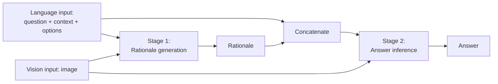

# Multimodal Chain-of-Thought Reasoning in Language Models — Summary

> [!NOTE]
> **Source:** [2302.00923-multimodal-cot.pdf](../../sources/arXiv/2302.00923-multimodal-cot.pdf) · Zhang, Z., Zhang, A., Li, M., Zhao, H., Karypis, G., & Smola, A., 2024 · Transactions on Machine Learning Research (published 05/2024) · https://arxiv.org/abs/2302.00923
> Study-guide summary of the full document. See the original for exact wording and figures.

## Abstract

Proposes **Multimodal-CoT**: a two-stage fine-tuning framework that fuses vision (image) and language (text) inputs, first generating an intermediate reasoning rationale and then inferring the answer conditioned on that rationale — the first peer-reviewed study of chain-of-thought reasoning across modalities.

**Key points**

- **The problem:** models under ~100B parameters tend to generate *hallucinated rationales* that mislead answer inference. On ScienceQA, making a text-only 1B-class model reason before answering (QCM→RA) *drops* accuracy 12.31% (81.63% → 69.32%); 56% of sampled errors trace to hallucinated rationales.
- **The mechanism:** two stages sharing one architecture — (i) *rationale generation*: language + vision inputs → rationale; (ii) *answer inference*: original language input + generated rationale + vision input → answer. Vision features (frozen ViT patch embeddings) are fused with T5 encoder text representations via single-head cross-attention plus gated fusion, then decoded.
- **Why vision features beat captions:** appending image captions gains only +0.80% answer accuracy, but fusing ViT features lifts rationale quality (RougeL 90.73 → 93.46) and answer accuracy (78.57% → 85.31%), correcting 60.7% of the hallucination errors.
- **Headline results (ScienceQA):** Multimodal-CoT_Large (738M) scores **90.45%** average — above the prior published best (86.54%, Chameleon GPT-4), GPT-3.5 (75.17%), GPT-4 few-shot (83.99%), and human performance (88.40%) — with a model under 1B parameters. The Base model (223M) reaches 85.31%. Also tops all reported baselines on A-OKVQA (50.57% vs 47.86% language-only, 49.1% ViLBERT) and generalises to MMMU without training (28.7%, matching or beating several ~8–13B models).
- **Ablations:** removing the two-stage design costs 2.7–5.9 points; removing vision features costs 6.5–6.7 points. The approach works across backbones (UnifiedQA, FLAN-T5, FLAN-Alpaca) and vision encoders (ViT best, then CLIP, DETR, ResNet).
- Training on **LLM-generated pseudo-rationales** (InstructBLIP + ChatGPT) instead of human annotations still yields 87.76% — the method does not depend on human-annotated reasoning chains.

**Takeaways**

- Chain-of-thought is not free: for small models, generating rationales *hurts* unless the rationales are grounded — here, in vision features. Separating rationale generation from answer inference, and grounding the rationale in the right modality, converts CoT from a liability into a large gain.
- Multimodal grounding mitigates hallucination and speeds convergence; a well-designed <1B model can beat 100B+ LLMs and humans on a multimodal reasoning benchmark, at consumer-GPU cost.
- Remaining errors are mostly commonsense (80%: maps, counting, alphabet), suggesting better visual features, injected commonsense knowledge, and CoT filtering as future work.

## 1 Introduction

- LLMs show impressive complex reasoning via **chain-of-thought (CoT)** — generating intermediate reasoning steps before the answer — but existing CoT work is almost entirely language-only.
- The paper advocates a **Multimodal-CoT paradigm**: given inputs in different modalities (here vision + language), decompose multi-step problems into intermediate reasoning steps (rationale), then infer the answer.
- Two routes to multimodal CoT:
  1. **Prompting LLMs** — convert the image to a caption and prompt an LLM. Even with strong captioners (GPT-4V, Gemini), captioning loses significant visual information and forfeits cross-modal synergy in representation space; LLMs also sit behind paywalls or heavy deployment costs.
  2. **Fine-tuning smaller models** (<1B parameters, "1B-models") with fused multimodal features — the route taken here, because architectures can be adapted to fuse modalities. The key obstacle: models under 100B parameters tend to produce hallucinated rationales that mislead answer inference.
- **Contributions:** (i) first study of CoT reasoning in different modalities in peer-reviewed literature; (ii) a two-stage fine-tuned framework fusing vision and language to generate informative rationales; (iii) analysis of why naive CoT fails at this scale and how vision features fix it, shown to generalise across tasks and backbones.

## 2 Background

### 2.1 CoT Reasoning with LLMs

- Two prompting paradigms: **Zero-Shot-CoT** (append "Let's think step by step"; Kojima et al., 2022) and **Few-Shot-CoT** (step-by-step demonstrations; Wei et al., 2022b), with demonstrations hand-crafted (Manual-CoT) or auto-generated (Auto-CoT).
- Few-Shot-CoT research splits into two lines:
  - **Optimising demonstrations** — retrieval of similar demonstrations (Rubin et al., 2022; degrades when chains contain mistakes), diversity-based clustering (Auto-CoT), complexity-based selection (Fu et al., 2022), and RL-selected examples (Lu et al., 2022b).
  - **Optimising reasoning chains** — problem decomposition (least-to-most prompting, decomposed prompting), program-of-thoughts (PoT: reasoning as executable programs), and voting over multiple sampled paths (self-consistency).
- Table 1 of the paper contrasts representative CoT techniques: all prior entries are text-only and mostly run on 175B–540B engines via in-context learning; Multimodal-CoT is the only multimodal entry, fine-tunes a 770M T5, and uses crawled (dataset-annotated) rationales rather than LLM outputs.

### 2.2 Eliciting CoT Reasoning by Fine-Tuning Models

- Lu et al. (2022a) fine-tuned T5 on CoT annotations but saw a dramatic performance decline when using CoT to *infer* answers, so used it only as post-hoc explanation. Others distil CoT from large teachers into students (Magister et al., 2022; Ho et al., 2022).
- Core challenge: per Wei et al. (2022b), models under 100B parameters tend to produce illogical CoT leading to wrong answers — generating effective CoT may be harder than answering directly, and harder still when the question requires understanding multimodal inputs.

## 3 Challenge of Multimodal-CoT

Focus on 1B-models because they can be fine-tuned and deployed on consumer-grade GPUs (e.g. 32G memory).

### 3.1 Towards the Role of CoT

Fine-tuning a text-only FLAN-Alpaca_Base baseline on ScienceQA (input = question Q + context C + options M), one-stage:

| Method | Format | Accuracy |
|---|---|---|
| No-CoT | QCM→A | **81.63** |
| Reasoning (rationale before answer) | QCM→RA | 69.32 |
| Explanation (rationale after answer) | QCM→AR | 69.68 |

> [!WARNING]
> Making the model reason first *costs* 12.31 points. The drop is not a token-limit artefact — generated outputs stay under 400 tokens, below T5's 512 limit — so the rationales themselves must be harming answer inference.

### 3.2 Misleading by Hallucinated Rationales

- Separating CoT into two stages (rationale generation, then answer inference) gives RougeL 90.73 on rationales but only 78.57% answer accuracy — still below the 81.63% no-CoT baseline.
- Manual inspection of 50 error cases: **56% involve hallucinated rationales** — e.g. the model asserts "the south pole of one magnet is closest to the south pole of the other" because it cannot see the image.

### 3.3 Multimodality Contributes to Effective Rationales

Two-stage results on ScienceQA (rationale RougeL / answer accuracy):

| Method | (i) QCM→R (RougeL) | (ii) QCMR→A (Accuracy) |
|---|---|---|
| Two-stage framework (text only) | 90.73 | 78.57 |
| w/ image captions | 90.88 | 79.37 |
| w/ vision features | **93.46** | **85.31** |

- Captions add only +0.80%; fusing ViT vision features boosts both rationale quality and answers, and **corrects 60.7% of the hallucination mistakes** (remaining errors mostly need map understanding / extra commonsense). This motivates the two-stage multimodal design.

## 4 Multimodal-CoT

### 4.1 Framework Overview

Two stages with the **same model architecture but different inputs/outputs**, trained independently under supervision:

- Stage 1 learns R = F(X_language, X_vision); Stage 2 appends R to the language input and learns A = F(X_language∘R, X_vision).
- At inference, test-set rationales come from the stage-1 model and feed stage 2.

### 4.2 Model Architecture

Transformer encoder–decoder (T5) with three procedures:

- **Encoding:** language text → Transformer encoder → H_language (n×d); image → frozen vision extractor (e.g. ViT) → patch-level features, projected by a learnable matrix W_h to H_vision (m×d). Questions without images use all-zero "blank features".
- **Interaction:** single-head attention with Q = H_language, K = V = H_vision, giving attention output H^attn_vision; then **gated fusion** — λ = Sigmoid(W_l·H_language + W_v·H^attn_vision), H_fuse = (1−λ)·H_language + λ·H^attn_vision.
- **Decoding:** H_fuse feeds the Transformer decoder to generate the target (rationale or answer) autoregressively.

## 5 Experiments

### 5.1 Dataset

- **ScienceQA** (Lu et al., 2022a): 21k multimodal multiple-choice science questions with annotated lectures/explanations, spanning 3 subjects, 26 topics, 127 categories, 379 skills; splits 12k/4k/4k (train/val/test). Evaluated on test.
- **A-OKVQA** (Schwenk et al., 2022): 25k knowledge-based VQA questions requiring commonsense/world knowledge; 17k/1k/6k splits; multiple-choice setting; evaluated on validation (test hidden).

### 5.2 Implementation

- Backbone: T5 encoder–decoder at **Base (200M)** and **Large (700M)**, weights initialised from FLAN-Alpaca; vision features from a frozen **ViT-large** encoder; captions (from InstructBLIP) appended to context. Up to 20 epochs, LR 5e-5 (selected in {5e-5, 8e-5}), max input length 512 (rationale) / 64 (answer), batch size 8, on 8× NVIDIA Tesla V100 32G.
- Baselines: (i) VQA models (MCAN, Top-Down, BAN, DFAF, ViLT, Patch-TRM, VisualBERT); (ii) LMs — fine-tuned UnifiedQA and few-shot GPT-3.5 (text-davinci-002/003), ChatGPT, GPT-4, Chameleon; (iii) fine-tuned large vision-language models — LLaMA-Adapter, LLaVA, InstructBLIP (concurrent works released months after this one).

### 5.3 Main Results

Selected rows from the ScienceQA main table (average accuracy, %):

| Model | Size | Avg |
|---|---|---|
| Human | – | 88.40 |
| UnifiedQA | 223M | 74.11 |
| GPT-3.5 (text-davinci-002) | 173B | 75.17 |
| GPT-3.5 (text-davinci-003) | 173B | 76.47 |
| ChatGPT | – | 78.31 |
| GPT-4 | – | 83.99 |
| Chameleon (GPT-4)† | – | 86.54 (prior published best) |
| LLaMA-Adapter† | 6B | 85.19 |
| LLaVA† | 13B | 90.92 |
| **Multimodal-CoT_Base** | 223M | 85.31 |
| **Multimodal-CoT_Large** | 738M | **90.45** |

(† = concurrent studies.) Multimodal-CoT_Large beats the prior published best by 3.91 points (86.54 → 90.45), exceeds human performance (88.40), and was state of the art on the ScienceQA leaderboard on release — with under 1B parameters.

- **A-OKVQA:** Multimodal-CoT_Base 50.57% vs language-only baseline 47.86%, ViLBERT 49.1, IPVR (OPT-66B) 48.6, GPT-3 (Curie) 35.07, BERT 32.93.
- **Ablation (Table 6):** removing the two-stage framework drops accuracy to 82.62 (Base) / 84.56 (Large); removing vision features to 78.57 / 83.97 — both components matter.

## 6 Analysis

### 6.1 Multimodality Boosts Convergence

Validation-accuracy curves across epochs: two-stage methods start higher than one-stage (direct-answer) baselines, but the text-only two-stage variant plateaus on low-quality rationales; only the multimodal two-stage variant keeps improving, converging faster and higher.

### 6.2 When Multimodal-CoT Meets Large Models

Replacing human-annotated training rationales with **pseudo-rationales generated by InstructBLIP** (image questions) **and ChatGPT** (text-only questions):

| Model | IMG | TXT | AVG |
|---|---|---|---|
| InstructBLIP (QCM→A baseline) | 60.50 | – | – |
| ChatGPT (QCM→A baseline) | 56.52 | 67.16 | 65.95 |
| Multimodal-CoT w/ Annotation | 88.25 | 90.13 | 90.45 |
| Multimodal-CoT w/ Generation | 83.54 | 85.73 | **87.76** |

Generated rationales achieve performance comparable to human annotation and far above prompting the large models directly — the approach scales to settings without human-annotated reasoning chains.

### 6.3 Effectiveness Across Backbones

MM-CoT lifts every tested backbone well above the prior best (75.17): UnifiedQA 82.55, FLAN-T5 83.19, FLAN-Alpaca 85.31.

### 6.4 Using Different Vision Features

ViT (feature shape 145×1024) performs best at 85.31, ahead of CLIP (49×2048) 84.27, DETR (100×256) 83.16, ResNet-50 pooled features (512×2048) 82.86. ViT is the default.

### 6.5 Alignment Strategies for Multimodal Interaction

Both tested alignment strategies beat direct answering (82.62): the paper's unimodal-encoder-style gated fusion (85.31) and BLIP's image-grounded text encoder with inserted cross-attention layers (84.60).

### 6.6 Generalization to Other Multimodal Reasoning Benchmarks

Zero-shot transfer to **MMMU** (no further training): Multimodal-CoT (738M) scores 28.7 — above Kosmos-2 (1.6B, 24.4), Fuyu (8B, 27.9), MiniGPT4-Vicuna (13B, 26.8) and equal to OpenFlamingo-2 (9B, 28.7), though far below GPT-4V (56.8) and Gemini Ultra (59.4).

### 6.7 Error Analysis

Of 50 manually examined wrong answers:

| Error type | Share | Nature |
|---|---|---|
| Commonsense | 80% | Questions needing commonsense knowledge — interpreting maps, counting objects in images, using the alphabet |
| Logical | 14% | Comparison mistakes and contradictions within the reasoning chain |
| Others | 6% | Answer wrong despite an empty or correct CoT — the CoT does not always drive the answer |

Future directions: (i) more informative visual features and stronger vision–language interaction (maps, counting); (ii) injecting commonsense knowledge; (iii) filtering mechanisms that use only relevant CoTs for answer inference.

## 7 Conclusion

Multimodal-CoT separates rationale generation from answer inference in a two-stage vision–language framework so answers can lean on better, multimodally grounded rationales. A <1B-parameter model achieves state-of-the-art ScienceQA performance; the analysis shows the method mitigates hallucination and speeds convergence, with commonsense knowledge, better vision features, and CoT filtering as open improvements.

## Appendices (A–D)

- **A.1** More examples of hallucinated rationales (solution-concentration and magnet-force problems) that vision features correct.
- **A.2 LM size vs vision features:** scaling the LM from Base to Large lifts the no-vision baseline substantially (78.57 → 83.97) but still trails the vision-fused variants (85.31 Base, 90.45 Large) — scale alone does not close the gap.
- **A.3 Paradigm discussion:** contrasts **Caption-based Reasoning** (<image → caption; question + caption → answer>, quality-limited by the caption) with **CoT-based Reasoning** (<question + image → rationale → answer>), whose feature-level vision–language interaction and lightweight cost motivate this work.
- **B** Exact vision-feature checkpoints (ViT vit_large_patch32_384, CLIP RN101, DETR detr_resnet101_dc5, ResNet-50 pooled), dataset details, and full hyperparameters.
- **C.1** Example pseudo-rationales generated by InstructBLIP (image questions) and ChatGPT (text questions) used for annotation-free training.
- **C.2** Per-category backbone results (mirrors §6.3).
- **D** Worked examples of each error category from §6.7.
