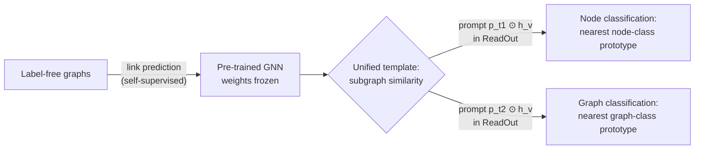

# GraphPrompt: Unifying Pre-Training and Downstream Tasks for Graph Neural Networks — Summary

> [!NOTE]
> **Source:** [2302.08043-graphprompt.pdf](../../sources/arXiv/2302.08043-graphprompt.pdf) · Liu, Z., Yu, X., Fang, Y., & Zhang, X. (2023). *GraphPrompt: Unifying pre-training and downstream tasks for graph neural networks*. Proceedings of the ACM Web Conference 2023 (WWW '23). https://arxiv.org/abs/2302.08043 · DOI 10.1145/3543507.3583386.
> Study-guide summary of the full document. See the original for exact wording and figures.

## Abstract

GraphPrompt is a pre-training and prompting framework for graph neural networks (GNNs) that transplants the NLP "pre-train, prompt" paradigm to graphs: it recasts the self-supervised pre-training task and diverse downstream tasks into one shared template — subgraph similarity — and bridges any residual gap with a small learnable prompt vector per task, leaving the pre-trained GNN frozen.

**Key points**

- **The problem:** "pre-train, fine-tune" suffers from inconsistent objectives — pre-training preserves intrinsic graph properties (e.g. links) while fine-tuning fits task labels (e.g. node or graph classes) — and the earlier graph-prompting work GPPT handles only node classification.
- **Unified template:** every task is subgraph similarity. Link prediction (pre-training) = a node's contextual subgraph (nodes within δ hops) is more similar to a linked node's subgraph than an unlinked one's; node/graph classification (downstream) = assign the instance to the class whose *prototypical subgraph* (mean embedding of the k labelled examples) is most similar.
- **Learnable prompt:** a single task-specific vector **p**ₜ element-wise reweights node embeddings inside the ReadOut aggregation (s_{t,x} = ReadOut({pₜ ⊙ h_v})). Only pₜ is tuned downstream — 96 parameters vs 22,183 for end-to-end GIN and 4,096 for GPPT on Flickr — so it suits few-shot supervision.
- **Headline results (accuracy, few-shot):** GraphPrompt beats all baselines on all five datasets. Node classification: Flickr 50-shot 20.21% (vs GPPT 18.95%), PROTEINS 1-shot 63.03%, ENZYMES 1-shot 67.04% (vs best baseline 63.81%). Graph classification (5-shot): PROTEINS 64.42% (vs GraphCL 56.38%), COX2 59.21%, ENZYMES 31.45%, BZR 61.63%.
- **Ablation:** removing the prompt, or replacing the vector with a linear-transformation matrix, both hurt — fewer prompt parameters mitigate few-shot overfitting.

**Takeaways**

- Prompting is not an NLP-only trick: the recipe — one task template shared by pre-training and downstream, plus a small learnable prompt to specialise a frozen pre-trained model — transfers to graph learning, where the template is subgraph similarity rather than masked language modelling.
- Keeping the pre-trained model frozen and tuning only a tiny prompt cuts parameters and FLOPs by orders of magnitude and is what makes low-shot (even 1-shot) adaptation work; one pre-trained model then serves multiple task types (node *and* graph classification on the same graph).

## 1 Introduction

- The Web produces gigantic graphs; downstream tasks range from page/article classification to friend recommendation. GNNs are state of the art via **message passing** — each node aggregates messages from neighbours recursively.
- **Graph pre-training** addresses two problems of end-to-end supervised GNNs: task-specific labels are costly, and each new task retrains weights from scratch. Self-supervised pre-training on label-free graphs extracts a task-agnostic prior, then a lightweight fine-tuning step adapts it.
- **But "pre-train, fine-tune" has inconsistent objectives:** pre-training preserves intrinsic properties (node/edge features, connectivity, local/global patterns); fine-tuning minimises task loss. E.g. pre-training on link prediction vs downstream node or graph classification.
- **Prompting** (from NLP, per Brown et al., 2020) narrows this gap: a task-specific prompt "pulls" the task toward the frozen pre-trained model — more parameter-efficient than fine-tuning. On graphs, the pioneering **GPPT** supports only node classification.
- **Two challenges:** (1) how to unify pre-training and *various* downstream tasks under one template (the analogy: NLP unifies everything as masked language modelling); (2) what form graph prompts should take, since language-style handcrafted instructions don't apply to topology.
- **Solution sketch:** (1) the **subgraph** is universal — a node is represented by its contextual subgraph, a graph by its maximum subgraph (itself) — so all tasks become subgraph-similarity computation; (2) a **task-specific learnable prompt** parameterises the ReadOut aggregation, letting each task aggregate node features its own way.
- **Contributions:** the unification framework based on subgraph similarity; the learnable ReadOut prompt; experiments on five public datasets showing superiority over state of the art.

## 2 Related Work

- **Graph representation learning:** earlier graph embedding (DeepWalk, node2vec, LINE) and recent GNNs (GCN, GraphSAGE, GAT, GIN); graph-level representations need a ReadOut with flat or hierarchical pooling.
- **Graph pre-training:** self-supervised tasks based on node features, links, local/global patterns, local–global consistency, and combinations — but these ignore the pre-train/downstream gap. L2P-GNN simulates fine-tuning during pre-training via meta-learning, but downstream tasks can still differ from the simulation. **GPPT** uses learnable graph prompts but only for node classification. A different model also named "GraphPrompt" (Zhang et al., 2021) does biomedical entity normalisation on text — an NLP task where the graph is auxiliary — and is distinct.
- **Vs other label-scarce settings:** semi-supervised learning can't handle novel classes unseen in training; meta-learning needs large labelled base classes for meta-training. GraphPrompt pre-trains on label-free graphs only.

## 3 Preliminaries

- **Graph:** G = (V, E) with node feature matrix X ∈ R^{|V|×d}; a set of graphs is 𝒢 = {G₁, …, G_N}.
- **Problem:** downstream node classification (classes C over nodes) and graph classification (classes 𝒞 over graphs) in a **k-shot setting** — only k labelled samples per class.
- **GNNs:** layer-wise neighbourhood aggregation h^l_v = Aggr(h^{l−1}_v, {h^{l−1}_u : u ∈ N_v}; θ^l); aggregation ranges from mean pooling to attention or MLPs; h⁰_v initialised from X; final-layer output h_v.

## 4 Proposed Approach

### 4.1 Unification Framework

- **Instances as subgraphs:** for node v, the contextual subgraph S_v contains all nodes within δ hops and the edges among them — carrying self-information plus context. For graph G, the maximum subgraph S_G = G itself. So any instance x (node or graph) maps to a subgraph S_x.
- **Unified task template — subgraph similarity** with subgraph vector s_x and cosine similarity sim(·,·):
  - **Link prediction** (pre-training): for triplet (v, a, b) with (v,a) ∈ E and (v,b) ∉ E, require sim(s_v, s_a) > sim(s_v, s_b).
  - **Node classification:** per class c, a **node class prototypical subgraph** ŝ_c = mean of the contextual-subgraph embeddings of the k labelled nodes in c; predict ℓ_j = argmax_c sim(s_{v_j}, ŝ_c). The prototype is a "virtual" subgraph living in the same embedding space.
  - **Graph classification:** identically, ŝ_c = mean embedding of the k labelled graphs in class c; predict L_j = argmax_c sim(s_{G_j}, ŝ_c).
  - Both classification tasks condense to y = argmax_{c∈Y} sim(s_x, ŝ_c).
- **Materialising s_x:** s_x = ReadOut({h_v : v ∈ V(S_x)}); the implementation uses sum pooling.

### 4.2 Pre-Training Phase

- **Link prediction** is chosen because links are freely available in any graph — no annotation cost. The learned subgraph-similarity prior transfers to node classification (same-class nodes have similar subgraphs) and to graph classification — a graph is technically a subgraph of itself, and "in spirit" graphs sharing similar subgraphs are likely to be similar, so graph similarity translates into similarity of the containing subgraphs.
- For node v, sample positive neighbour a and non-linked negative b, forming triplet (v, a, b); over training set 𝒯_pre, minimise a contrastive loss L_pre(Θ) = −Σ ln [exp(sim(s_v, s_a)/τ) / Σ_{u∈{a,b}} exp(sim(s_v, s_u)/τ)] with temperature τ. Output: optimal GNN weights Θ₀.

### 4.3 Prompting for Downstream Tasks

- **Why graph prompts can't be handcrafted:** the template differs from masked language modelling, and graph prompts must be topology-related, not language instructions.
- **Prompt design:** a learnable vector **p**ₜ per downstream task t reweights node embeddings dimension-wise inside ReadOut: s_{t,x} = ReadOut({pₜ ⊙ h_v : v ∈ V(S_x)}) — a feature-weighted summation extracting the most task-relevant prior knowledge. Node classification attends to features relevant to the target node; graph classification to features correlated with the graph class.
- **Alternatives considered:** a prompt matrix Pₜ (linear transformation) or an attention layer — rejected because few-shot settings favour fewer parameters to avoid overfitting; the vector has only the node-representation length (e.g. 128).
- **Prompt tuning:** minimise L_prompt(pₜ) = −Σ ln [exp(sim(s_{t,x_i}, ŝ_{t,y_i})/τ) / Σ_{c∈Y} exp(sim(s_{t,x_i}, ŝ_{t,c})/τ)] over the labelled set, where prototypes ŝ_{t,c} also use the prompt-assisted ReadOut. **Only pₜ is updated; Θ₀ stays frozen** — improving efficiency and reducing reliance on labels.

## 5 Experiments

### 5.1 Experimental Setup

**Datasets** (Table 1 of the paper):

| Dataset | Graphs | Graph classes | Avg. nodes | Avg. edges | Node features | Node classes | Task |
|---|---|---|---|---|---|---|---|
| Flickr | 1 | – | 89,250 | 899,756 | 500 | 7 | N |
| PROTEINS | 1,113 | 2 | 39.06 | 72.82 | 1 | 3 | N, G |
| COX2 | 467 | 2 | 41.22 | 43.45 | 3 | – | G |
| ENZYMES | 600 | 6 | 32.63 | 62.14 | 18 | 3 | N, G |
| BZR | 405 | 2 | 35.75 | 38.36 | 3 | – | G |

- **Baselines**, three categories: (1) end-to-end GNNs — GCN, GraphSAGE, GAT, GIN; (2) "pre-train, fine-tune" models — DGI, InfoGraph, GraphCL; (3) graph prompt model — GPPT (link-prediction pre-training, prompt maps node classification to link prediction). Meta-learning few-shot methods (Meta-GNN, RALE) are excluded — they need labelled base classes, while GraphPrompt pre-trains on label-free graphs only.
- On PROTEINS and ENZYMES the GNN is **pre-trained once per dataset** and the same frozen model serves both node and graph classification. Tasks are balanced k-shot classification; metric is accuracy.

### 5.2 Performance Evaluation

**Few-shot node classification** (accuracy %, ± std; 10 randomly generated tasks each for training/validation; Flickr uses 50-shot because its sparse 500-dim features make very few shots inferior for all methods — 50 shots is still <0.06% of its nodes):

| Method | Flickr (50-shot) | PROTEINS (1-shot) | ENZYMES (1-shot) |
|---|---|---|---|
| GCN | 9.22 ± 9.49 | 59.60 ± 12.44 | 61.49 ± 12.87 |
| GraphSAGE | 13.52 ± 11.28 | 59.12 ± 12.14 | 61.81 ± 13.19 |
| GAT | 16.02 ± 12.72 | 58.14 ± 12.05 | 60.77 ± 13.21 |
| GIN | 10.18 ± 5.41 | 60.53 ± 12.19 | 63.81 ± 11.28 |
| DGI | 17.71 ± 1.09 | 54.92 ± 18.46 | 63.33 ± 18.13 |
| GraphCL | 18.37 ± 1.72 | 52.00 ± 15.83 | 58.73 ± 16.47 |
| GPPT | 18.95 ± 1.92 | 50.83 ± 16.56 | 53.79 ± 17.46 |
| **GraphPrompt** | **20.21 ± 11.52** | **63.03 ± 12.14** | **67.04 ± 11.48** |

Observations: (1) GraphPrompt wins on all three datasets; (2) end-to-end GNNs sometimes match or beat pre-training models — evidence that the pre-train/downstream objective gap obstructs transfer; (3) GPPT is comparable to or worse than other baselines, plausibly because its prompts have many more learnable parameters, which fare poorly at 1-shot.

**Few-shot graph classification** (accuracy %, 5-shot; 100 tasks for training/validation per dataset):

| Method | PROTEINS | COX2 | ENZYMES | BZR |
|---|---|---|---|---|
| GCN | 54.87 ± 11.20 | 51.37 ± 11.06 | 20.37 ± 5.24 | 56.16 ± 11.07 |
| GraphSAGE | 52.99 ± 10.57 | 52.87 ± 11.46 | 18.31 ± 6.22 | 57.23 ± 10.95 |
| GAT | 48.78 ± 18.46 | 51.20 ± 27.93 | 15.90 ± 4.13 | 53.19 ± 20.61 |
| GIN | 58.17 ± 8.58 | 51.89 ± 8.71 | 20.34 ± 5.01 | 57.45 ± 10.54 |
| InfoGraph | 54.12 ± 8.20 | 54.04 ± 9.45 | 20.90 ± 3.32 | 57.57 ± 9.93 |
| GraphCL | 56.38 ± 7.24 | 55.40 ± 12.04 | 28.11 ± 4.00 | 59.22 ± 7.42 |
| **GraphPrompt** | **64.42 ± 4.37** | **59.21 ± 6.82** | **31.45 ± 4.32** | **61.63 ± 7.68** |

Observations: (1) GraphPrompt significantly outperforms on all four datasets; (2) superior performance on *both* task types from the *same* pre-trained model (PROTEINS, ENZYMES) validates the unification; (3) pre-training models generally beat end-to-end GNNs here because InfoGraph and GraphCL pre-train with graph-level tasks, naturally closer to graph classification. GPPT cannot do graph classification, so it is absent from this table.

**Performance with different shots** (Figs. 3–4, PROTEINS and ENZYMES): GraphPrompt consistently outperforms competitive baselines especially at lower shots (node classification varied 1–10 shots, graph classification 1–30). It remains competitive at 10 shots for node classification; for graph classification some baselines can surpass it at 20+ shots — on ENZYMES 30 shots per class means 30% of the 600 graphs are training data, which is outside the target low-shot scenario.

### 5.3 Model Analysis

- **Ablation** (Fig. 5; node classification on Flickr/PROTEINS/ENZYMES, graph classification on COX2/ENZYMES/BZR): *no prompt* (classifier on plain sum-ReadOut representations) usually performs worst; *lin. prompt* (linear-transformation matrix, Eq. 13) also hurts because more parameters increase reliance on labelled data.
- **Parameter efficiency** (downstream node classification; parameters updated and FLOPs):

| Method | Flickr params | Flickr FLOPs | PROTEINS params | PROTEINS FLOPs | ENZYMES params | ENZYMES FLOPs |
|---|---|---|---|---|---|---|
| GIN (end-to-end) | 22,183 | 240,100 | 5,730 | 12,380 | 6,280 | 11,030 |
| GPPT | 4,096 | 4,582 | 1,536 | 1,659 | 1,536 | 1,659 |
| **GraphPrompt** | **96** | **96** | **96** | **96** | **96** | **96** |
| GraphPrompt-ft | 21,600 | 235,200 | 6,176 | 13,440 | 6,176 | 10,944 |

GraphPrompt updates the fewest parameters by far; GPPT needs a learnable vector per class plus an attention module, one factor behind its weaker downstream results. Fine-tuning the frozen weights too (GraphPrompt-ft) balloons the update count back to end-to-end scale.

## 6 Conclusions

The paper addresses GNN limitations under supervised and "pre-train, fine-tune" paradigms by (1) a unification framework mapping pre-training and downstream tasks to a common subgraph-similarity template and (2) a learnable task-specific prompt vector guiding each downstream task to exploit the frozen pre-trained model. Experiments on five public datasets show significant gains over state-of-the-art baselines.

## Appendices

- **A — Algorithm and complexity:** prompt tuning iterates: compute prompt-assisted subgraph representations (Eq. 12), build class prototypes, accumulate the contrastive loss (Eq. 14), update pₜ. Complexity of embedding a node's subgraph with ReadOut is O(D·d̄^k·d̄^δ) for average degree d̄, k GNN layers, δ hops, hidden dimension D — with k, δ small constants (and d̄ small under neighbourhood sampling).
- **B — Datasets:** Flickr — image-sharing network from SNAP, nodes are images, edges link images sharing properties (same commenter/location), 7 categories. PROTEINS — nodes are secondary structures, edges are amino-acid-sequence or 3D-space neighbour relations. COX2 — atoms/chemical bonds of 467 cyclooxygenase-2 inhibitors. ENZYMES — 600 enzymes from the BRENDA database labelled into 6 top-level EC classes. BZR — 405 benzodiazepine-receptor ligands. Node classification uses only graphs with >50 nodes to ensure enough test nodes; input features are used as given.
- **C — Baselines:** GCN (mean-pooling aggregation), GraphSAGE (more self-information), GAT (attention-weighted neighbours), GIN (sum aggregator, more expressive); DGI (mutual information between local instances and global representation), InfoGraph (MI between graph-level and substructure representations), GraphCL (agreement between graph augmentations); GPPT (link-prediction pre-training, prompt reformulates node classification as link prediction).
- **D — Implementation:** GraphPrompt uses a 3-layer GIN backbone, hidden dimension 32, δ = 1 (1-hop contextual subgraphs). Baselines tuned from authors' code and defaults (e.g. DGI 1-layer GCN with 512 hidden; GPPT 2-layer GraphSAGE with 128 hidden).
- **E — Further results:** *Scalability* (PROTEINS graph classification, groups of ~50–100-node graphs): prompt-tuning time grows linearly with graph size, and GraphPrompt-ft takes longer, showing fine-tuning's inefficiency. *Parameter sensitivity:* node-classification accuracy degrades as hops δ increase (larger subgraphs add irrelevant information and risk over-smoothing); hop count shows no clear trend for graph classification. Hidden dimension: smaller (32–64) better for node classification, slightly larger (64–128) for graph classification; 32–64 robust for both.
- **F — Data ethics:** only public datasets used per their terms; no personally identifiable information, human, or animal subjects.
