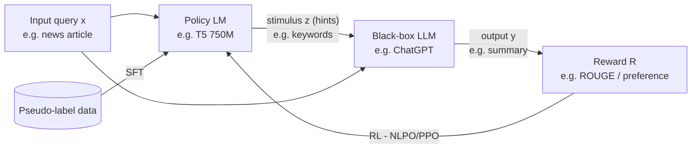

# Guiding Large Language Models via Directional Stimulus Prompting — Summary

> [!NOTE]
> **Source:** [2302.11520-directional-stimulus.pdf](../../sources/arXiv/2302.11520-directional-stimulus.pdf) · Li, Z., Peng, B., He, P., Galley, M., Gao, J., & Yan, X. (2023) · NeurIPS 36 · https://arxiv.org/abs/2302.11520.
> Study-guide summary of the full document. See the original for exact wording and figures.

## Abstract

Directional Stimulus Prompting (DSP) is a framework from UCSB and Microsoft for steering black-box LLMs (ChatGPT, Codex, InstructGPT) toward desired outputs without touching their parameters: a small tuneable policy model (T5-scale) generates an instance-specific "directional stimulus" — a hint such as keywords or dialogue acts — that is inserted into the prompt, and the policy model is optimised with supervised fine-tuning followed by reinforcement learning using the LLM's downstream performance as the reward.

**Key points**

- **Mechanism:** output is obtained via y ~ p_LLM(·|x, z), z ~ p_POL(·|x) — the frozen LLM is conditioned on both the input x and a stimulus z generated per instance by a small policy model (750M Flan-T5-Large or 220M T5-Base). The stimulus is generated solely from the input query, distinguishing DSP from retrieval augmentation.
- **Training:** SFT on heuristically derived "pseudo-stimulus" (e.g. textrank keywords that appear in the reference summary; annotated dialogue acts), then RL (PPO, in its NLPO variant) maximising a reward defined on the LLM's output — ROUGE for summarisation, sentence-level SacreBLEU for dialogue, reasoning accuracy for CoT — with an adaptive KL penalty against the SFT policy.
- **Summarisation (CNN/Daily Mail):** with only 1,000–4,000 training samples (of 287,113), DSP lifts ChatGPT's ROUGE and BLEU by 4–13% (e.g. ROUGE-1 38.45 → 40.19, BLEU 8.06 → 9.10 at 4K, SFT+RL); a GPT-4 judge preferred DSP summaries 51.0% vs 44.4% for standard prompting.
- **Dialogue (MultiWOZ):** with just 80 dialogues (1% of the training set), ChatGPT's combined score rises 41.4% (68.4 → 96.7 on MultiWOZ 2.0), beating several fully supervised task-oriented dialogue models trained on all 8,438 dialogues; with 800 dialogues Codex reaches 102.2, comparable to SOTA (GALAXY 110.4).
- **Chain-of-thought (InstructGPT, zero-shot):** a policy model generating instance-specific trigger prompts scores 84.0 on MultiArith and 38.6 on AQuA, beating all 14 human-crafted task-level triggers ("Let's think step by step" = 79.6/31.9) and APE's discovered prompt (81.6/34.3).
- RL is the workhorse: more SFT data does not guarantee gains, but RL fine-tuning consistently improves on SFT because it explores stimuli the LLM actually prefers rather than mimicking the pseudo-labels.

**Takeaways**

- Instance-specific hints in the prompt are a practical control channel for frozen, API-only LLMs — the optimisation burden shifts from the giant model to a small, cheap, tuneable one.
- The approach converts black-box LLM alignment into an RL problem over prompt text, using the LLM itself as the evaluation function; it exploits tiny labelled datasets far more efficiently than fine-tuning baselines.
- Limitations the authors note: gains on overlap metrics don't fully transfer to semantic metrics (BERTScore) or corpus-level BLEU, and SFT depends on heuristic pseudo-stimulus; future work proposes a "machine language" between policy model and LLM and non-text stimuli.

## 1 Introduction

- LLMs (Codex, InstructGPT, ChatGPT, GPT-4, PaLM) show emergent in-context learning and few-shot prompting absent from smaller LMs (BERT, RoBERTa, GPT-2, T5), but most are accessible only through **black-box APIs**; open-source alternatives are computationally expensive to fine-tune. The standard workaround — task-specific text prompts — still fails to fully align outputs with desired behaviours on specific tasks.
- **DSP's proposal:** add a new prompt component, the **directional stimulus** — instance-specific "hints" and "clues" (e.g. keywords a summary should cover) generated by a small tuneable policy LM (e.g. T5) for each input query. This differs from knowledge-retrieval augmentation because the stimulus is generated solely from the input query.
- The policy model is trained with **supervised fine-tuning (SFT)** on a small labelled collection, then **reinforcement learning (RL)** maximising rewards defined on the LLM's output (downstream metrics or other alignment measures such as human preference).
- Worked example (Figure 1): for a CNN article about Bob Barker returning to *The Price Is Right*, the hint "Bob Barker; TV; April 1; 'The Price Is Right'; 2007; 91." steers ChatGPT to a summary with ROUGE-1 48.39 vs 34.48 for standard prompting.
- Headline results previewed: T5 trained on 4,000 CNN/Daily Mail samples improves ChatGPT's ROUGE and BLEU by 4–13%; 80 MultiWOZ dialogues improve ChatGPT's combined score by up to 41.4%, matching or surpassing some fully supervised state-of-the-art models; instance-specific CoT triggers beat hand-crafted and auto-generated prompts.

The framework loop (Figure 2):

## 2 Directional stimulus prompting

- Setup: input space X, distribution D, output space Y. Task instructions plus demonstrations cannot always convey **fine-grained, instance-specific** desired behaviour (e.g. which aspects of an article a reference summary emphasises).
- DSP introduces a small sequence of discrete tokens **z ("directional stimulus")** into the prompt. A small tuneable policy LM p_POL(z|x) generates z; the frozen LLM then produces y ~ p_LLM(·|x, z) via API calls. The LLM's parameters are never accessed or tuned.

### 2.1 Supervised fine-tuning

- **Pseudo-stimulus** z\* is heuristically selected or annotated per (x, y) pair — keywords contained in the reference summary for summarisation; dialogue acts of the target response for dialogue.
- The policy model (pre-trained T5, GPT-2, etc.) is fine-tuned on D′ = {(x, z\*)} by maximising log-likelihood: L_SFT = −E log p_POL(z\*|x).
- SFT gives a good initial policy, but pseudo-stimuli are not necessarily optimal for the LLM — motivating RL.

### 2.2 Reinforcement learning

- **Objective:** maximise an alignment measure R(x, y) over y ~ p_LLM(·|x, z), z ~ p_POL(·|x). Defining R_LLM(x, z) = R(x, y) makes the LLM an **evaluation function** and turns LLM alignment into policy-model optimisation: max E[R_LLM(x, z)].
- **Formulation:** stimulus generation is a token-level Markov decision process; the policy network π is initialised from the SFT policy model and updated with **proximal policy optimization (PPO)** [Schulman et al.].
- **Reward:** r(x, z) = R_LLM(x, z) − β·log(π(z|x)/p_POL(z|x)) — a KL-divergence penalty keeps π near the SFT model, with β adapted dynamically toward a KL target (clipped update, Equations 7–8).
- **Implementation:** the **NLPO** variant of PPO (Ramamurthy et al.), designed for language generators, masks out less-relevant vocabulary via top-p sampling (p = 0.9) to shrink the action space. Policy and value networks are both initialised from the SFT model, the value head randomly initialised.

## 3 Experiments

Tasks: summarisation, dialogue response generation, and automatic (CoT) prompt generation. Policy models: pre-trained T5 / Flan-T5. Black-box LLMs: **ChatGPT** (gpt-3.5-turbo), **Codex** (code-davinci-002), **InstructGPT** (text-davinci-002).

### 3.1 Summarization

- **Setup:** CNN/Daily Mail benchmark. To keep API costs low, training subsets of 1,000 / 2,000 / 4,000 pairs (of 287,113); evaluation on 500 random samples (following prior work with sufficient statistical power). Metrics: ROUGE, BLEU, Meteor (overlap) and BERTScore (similarity); scores averaged over three ChatGPT inferences (temperature 0.7, top_p 1.0), three demonstration examples in all prompts.
- **SFT:** keywords extracted with **textrank** from article and summary, kept only if present in the reference summary, concatenated as "[Keyword1]; [Keyword2]; …". Input format "Extract the keywords: [Article]"; 5 epochs, lr 2×10⁻⁵. Policy model: Flan-T5-Large (750M; appendix states 780M).
- **RL:** reward = ROUGE-Avg between generated and reference summaries (rescaling coefficient 10; BLEU/Meteor perform similarly); four ChatGPT outputs per query averaged to reduce variance; plus a **step-wise reward** (+1 per keyword appearing in the reference summary, −0.2 otherwise) that improved training efficiency and stability. 51k episodes, batch 8, lr 2×10⁻⁶, KL_target 0.5, β₀ 0.005.
- **Results (Figure 3):** every metric improves over standard prompting; RL adds further gains over SFT alone, and gains grow with training-set size. ChatGPT's ROUGE, BLEU and Meteor rise by 1–2 points despite only 1,000–4,000 samples.

Selected scores at 4K training samples (from Figure 3):

| Metric | Standard prompting | DSP w/ SFT | DSP w/ SFT+RL |
|---|---|---|---|
| ROUGE-1 | 38.45 | 39.47 | 40.19 |
| ROUGE-2 | 16.20 | 17.08 | 17.70 |
| ROUGE-L | 25.52 | 26.25 | 26.84 |
| BLEU | 8.06 | 8.71 | 9.10 |
| METEOR | 31.59 | 32.24 | 32.72 |
| BERTScore | 0.8807 | 0.8832 | 0.8845 |

> [!WARNING]
> Because the reward is overlap-based (ROUGE), the improvement on the semantic metric BERTScore after RL is comparatively small. Training was stable under NLPO, with validation ROUGE-1 tracking training reward (Figure 4).

### 3.2 Dialogue response generation

- **Motivation:** LLM chatbots handle open-domain chat but struggle with **task-oriented dialogue** (reservations, ordering), which requires business logic and grounded responses. The policy model learns the dialogue policy from data and guides the LLM.
- **Setup:** MultiWOZ 2.0 and 2.1; stimulus = the **dialogue act** of the target system response (e.g. `<hotel, inform, choice>` verbalised as "[hotel] [inform] choice type [request] area"). Training uses only 1% (80 dialogues) or 10% (800) of the 8,438-dialogue training set; evaluation on the full 1,000-dialogue test set. Metrics: Inform, Success, BLEU, and Combined = (Inform+Success)×0.5 + BLEU; averaged over three inferences.
- **RL details:** sentence-level SacreBLEU as turn-level reward; four LLM outputs per input at temperature 0.7; 52k episodes; tighter KL (KL_target 0.2, β₀ 0.01) so generated acts stay within the ontology; top-k = 50 sampling in training, beam search (beam 5) at inference.
- **Results (Table 1, MultiWOZ 2.0):**

| Method | Training data | Inform | Success | BLEU | Combined |
|---|---|---|---|---|---|
| ChatGPT, standard prompting | – | 71.8 | 44.1 | 10.5 | 68.4 |
| ChatGPT, DSP w/ SFT | 1% (80) | 76.6 | 66.5 | 11.2 | 82.8 |
| ChatGPT, DSP w/ SFT+RL | 1% (80) | 90.9 | 82.2 | 10.2 | **96.7** |
| ChatGPT, DSP w/ SFT+RL | 10% (800) | 95.3 | 82.3 | 10.9 | 99.6 |
| Codex, standard prompting | – | 76.7 | 41.5 | 7.7 | 66.8 |
| Codex, DSP w/ SFT+RL | 1% (80) | 91.0 | 76.0 | 9.8 | 93.3 |
| Codex, DSP w/ SFT+RL | 10% (800) | 96.0 | 86.9 | 10.7 | 102.2 |
| UBAR (fully supervised) | 100% (8,438) | 95.4 | 80.7 | 17.0 | 105.1 |
| GALAXY (fully supervised) | 100% (8,438) | 94.4 | 85.3 | 20.5 | 110.4 |

- Observations: (1) DSP substantially raises Inform and Success; (2) corpus-level **BLEU does not improve** — the LLMs speak in a different style/vocabulary since they never see oracle responses; (3) more SFT data does not guarantee gains, but **RL consistently helps**, exploring model-preferred stimuli beyond the pseudo-labels; (4) with 80 dialogues DSP surpasses several fully trained TOD models (e.g. DAMD 85.0, SimpleTOD 92.3, Soloist 95.7) on Success/Inform, and with 800 it is comparable to full-data SOTA.

### 3.3 Chain-of-Thought reasoning

- LLMs are sensitive to trigger-prompt wording; prior work optimised **task-specific** prompts manually or automatically. DSP instead trains a **t5-base** policy model to generate an **instance-specific** CoT trigger per query.
- **Setup:** zero-shot CoT with InstructGPT (text-davinci-002). MultiArith: 600 examples split 300/50/250 train/val/test; AQuA: standard 254-sample test set, 300 training and 100 validation samples.
- **SFT:** run the 14 human-crafted triggers from Kojima et al. on the training set; keep (query, prompt) pairs that produced correct reasoning; train t5-base 2 epochs. **RL:** reward 1 for correct reasoning, 0 otherwise; 20 iterations (106k episodes).
- **Results (Table 2):** InstructGPT's accuracy varies widely across task-level triggers (MultiArith 42.8–81.2 for human prompts). DSP w/ SFT+RL reaches **84.0 (MultiArith)** and **38.6 (AQuA)**, beating the best human trigger (81.2 / 38.2), "Let's think step by step" (79.6 / 31.9), and APE's discovered prompt (81.6 / 34.3). SFT alone (75.2 / 35.8) is not enough — RL exploration is needed for peak performance.

## 4 Related work

- **Black-box LLMs:** most frontier models are API-only; open models (OPT-175B, BLOOM) demand infeasible compute to fine-tune locally. LLMs still misalign with specific downstream desiderata; DSP adds fine-grained control via a small tuneable LM.
- **Prompt optimization and engineering:** soft-prompt tuning (prefix-tuning, prompt tuning) needs gradients and continuous embeddings — impractical through black-box APIs. Discrete-prompt work (manual engineering, editing, RL-based like RLPrompt, automatic generation like APE) targets task-specific prompts, which cannot express instance-specific behaviour.
- **Controllable text generation:** class-conditioned LMs (CTRL), gradient-steering (PPLM), generative discriminators (GeDi, DExperts) all need LM training, gradients, or logits — unavailable for black-box LLMs. DSP controls generation purely through inserted prompt text optimised on returned outputs.
- **RL for NLP:** RL has aligned LMs with human preferences (e.g. InstructGPT/RLHF) by updating the LLM itself; DSP instead optimises a small policy model that generates guiding text, bypassing expensive LLM optimisation.

## 5 Conclusions and future work

- DSP provides fine-grained, instance-specific guidance for black-box LLMs by converting LLM optimisation into optimisation of a small policy model; it improves control, exploits labelled data efficiently, and the generated stimuli offer interpretable insight into LLM behaviour.
- **Future work:** a "machine language" between policy model and LLM — stimuli not intuitively human-preferred but better at conveying guidance — and directional stimuli beyond text. (Funding: DARPA PTG program, HR001122C0009.)

## Appendices (implementation details and additional results)

- **A. Implementation:** full hyperparameter tables per task (SFT ~lr 2×10⁻⁵; NLPO RL ~lr 2×10⁻⁶, 51.2k steps, discount 0.99, GAE λ 0.95, clip 0.2). Experiments ran on 8× NVIDIA RTX A6000 GPUs. MultiWOZ data processed as in UBAR with delexicalised slot placeholders; full dialogue-act/slot ontology given (Table 4).
- **B.1 Keyword analysis:** during training, keyword precision rises in step with ROUGE-1; high precision with too few keywords does not help. POS tagging shows generated keywords are mostly nouns and proper nouns; NER shows persons, geopolitical entities, dates, organisations and numerals dominate.
- **B.1 GPT-4 evaluation:** on the 500-sample test set, GPT-4 judged DSP summaries closer to the reference **255 times (51.0%)** vs 222 (44.4%) for standard prompting, with 23 ties (4.6%).
- **B.1 Zero-shot:** DSP trained and tested zero-shot still improves over standard prompting comparably to the 3-shot setting, and 3-shot-trained DSP transfers to zero-shot testing — the approach is robust to demonstration count.
- **B.2 Low-resource baselines (Table 7):** most supervised TOD models degrade sharply at 1% data (e.g. DAMD combined 29.9, Soloist 57.4, PPTOD 76.4 vs DSP+ChatGPT 96.7); even at 10% they trail DSP-guided Codex/ChatGPT on Inform/Success.
- **B.3 Newly discovered triggers:** after RL the policy model generates novel instance-specific prompts beyond the SFT data — modifications/combinations ("First step:", "Let's think like a detective step by step. First,") and new content ("Let's think step by step using proven methods.").
- **C–D:** running examples on CNN/Daily Mail and MultiWOZ, and the exact prompts used (same three demonstrations for standard prompting and DSP; DSP adds keywords or dialogue acts plus act explanations).
