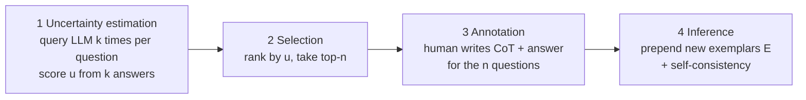

# Active Prompting with Chain-of-Thought for Large Language Models — Summary

> [!NOTE]
> **Source:** [2302.12246-active-prompt-cot.pdf](../../sources/arXiv/2302.12246-active-prompt-cot.pdf) · Diao, S., Wang, P., Lin, Y., Pan, R., Liu, X., & Zhang, T., 2023 (v5 July 2024) · arXiv:2302.12246. https://arxiv.org/abs/2302.12246
> Study-guide summary of the full document. See the original for exact wording and figures.

## Abstract

Active-Prompt attacks a weak point of chain-of-thought (CoT) prompting: the human-annotated exemplars in standard CoT (Wei et al., 2022) are fixed and arbitrary — randomly chosen or hand-composed — and not necessarily the most useful for a given task. Borrowing from uncertainty-based active learning, the method spends a small human-annotation budget on exactly the questions the model is most uncertain about, and those exemplars lift reasoning accuracy across eight benchmarks.

**Key points**

- **Mechanism (four stages):** (1) *uncertainty estimation* — query the LLM k = 10 times per question over a pool of up to 1,000 unlabelled training questions and score each question's uncertainty from the k answers; (2) *selection* — rank by uncertainty and take the top-n (n = 4–8, matching standard CoT exemplar counts); (3) *annotation* — a human writes CoT rationales and answers for only those n questions; (4) *inference* — prepend the new exemplars to every test question, with self-consistency (40 samples, T = 0.7).
- **Uncertainty metrics:** *disagreement* (unique answers ÷ k), *entropy*, and *variance* all work comparably well; *self-confidence* (asking the model to rate its own answer) fails because GPT-3 is systematically over-confident.
- **Headline results:** on eight reasoning benchmarks, Active-Prompt (D) beats self-consistency by an average of **7.0 points with text-davinci-002** (74.9 vs 67.9) and **1.8 with code-davinci-002** (80.9 vs 79.1); the entropy variant reaches 81.6 average on code-davinci-002. On GSM8K with code-davinci-002: CoT 63.1 → SC 78.0 → Active-Prompt (E) **83.4**.
- **Selection, not annotation, does the work:** Random-CoT — identical annotation process but random question choice — only matches self-consistency (78.6 vs 78.0 on GSM8K), while Active-Prompt adds ~3.6 points on top. A longer-CoT ablation shows padding rationales to comparable length *hurts* (GSM8K 74.2 → 69.4).
- **Uncertainty is task-inherent:** exemplars selected by one model transfer to others (code-davinci-002 → text-davinci-003; even Llama2-70b-chat-selected questions improve gpt-3.5-turbo, 74.2 → 78.7 on GSM8K), and uncertainty correlates strongly negatively with accuracy.

**Takeaways**

- Which few-shot examples you annotate matters more than how polished the annotations are — a cheap uncertainty probe (sample k answers, count disagreement) identifies the questions worth human effort.
- The approach needs no labels and works zero-shot ("Let's think step by step") for the estimation stage, and selection can be outsourced to a cheap open model, so the marginal cost over ordinary CoT engineering is modest.
- First demonstration that active-learning-style question selection benefits CoT prompting; diversity- (Auto-CoT) and complexity-based (Complex-CoT) selection are complementary directions it outperforms head-to-head.

## 1 Introduction

- In-context learning with LLMs performs well on conventional language tasks but poorly on complex reasoning; CoT prompting (Wei et al., 2022b) fixes this by writing reasoning steps into exemplars.
- **Problem:** current CoT relies on a fixed set of human-annotated exemplars — e.g. the original eight GSM8K questions were randomly selected or manually composed — with no principle for *which* questions deserve annotation, across tasks that vary in difficulty, scope, and domain.
- Annotating ~eight exemplars per task is cheap, so the key question becomes: **which questions are most important and helpful to annotate?**
- **Solution:** adapt uncertainty-based active learning. Ask the model k times per training question, compute uncertainty u from the k answers, annotate the n most-uncertain questions with human CoT, and prompt with those exemplars.
- Contributions: (1) judicious selection of the most informative questions to annotate, reducing human engineering; (2) an uncertainty-based selection strategy with several metrics; (3) large-margin improvements on multiple reasoning tasks — the first demonstration of active question selection for CoT prompting.

## 2 Active-Prompt

Setup: given l unlabelled training questions D_tr and m test questions D_te, annotate only n training questions into an exemplar set E = {(q, c, a)} of question, reasoning chain, and answer, then prompt D_te with E.

### 2.1 Uncertainty Estimation

Four candidate metrics over the k sampled answers per question:

| Metric | Definition | Verdict |
|---|---|---|
| **Disagreement** | u = h/k, where h = number of *unique* answers among the k predictions | Simple; primary metric (D) |
| **Entropy** | Entropy of the answer-frequency distribution; larger = more uncertain | Primary metric (E); needed where answer space is tiny |
| **Variance** | Variance of numeric answers, normalised by the numbers mentioned in the question (to stop large magnitudes dominating) | Competitive on arithmetic; weaker on GSM8K |
| **Self-confidence** | Ask the model to rate its own answer from {very confident, confident, not confident, wrong answer}; pick least-confident | Fails — LLMs are over-confident |

A pilot study found disagreement, entropy, and variance perform competitively well and significantly outperform self-confidence, so the main experiments use disagreement and entropy.

### 2.2 Selection and Annotation

Rank questions by u; select the top-n (random tie-break if more than n share the maximum). Human annotators write rationale chains and answers for these n questions, producing exemplar set E, which replaces the initial exemplars for few-shot CoT prompting.

### 2.3 Inference

Prompt each test question with E, applying **self-consistency** (Wang et al., 2022): sample m reasoning paths at temperature T and take the most consistent answer.

## 3 Experimental Settings

- **Datasets (8):** arithmetic — GSM8K, ASDiv, SVAMP, AQuA, SingleEq; commonsense — CSQA, StrategyQA; symbolic — last-letter concatenation, tested *out-of-distribution* (2-letter prompts, 4-letter test questions). Metric: exact-match accuracy.
- **Baselines:** CoT (Wei et al., 2022b), Self-Consistency (SC), Auto-CoT (Zhang et al., 2022b), and **Random-CoT** — identical annotation process and annotator, but questions chosen at random (the control isolating the selection strategy).
- **Models:** mainly code-davinci-002 (most capable available, free in beta); also text-davinci-002/003, gpt-3.5-turbo (0613 default), later Llama2-70b-chat.
- **Implementation:** exemplar counts follow Wei et al. (2022b) — 8 for GSM8K/ASDiv/SVAMP/SingleEq, 7 for CSQA, 6 for StrategyQA, 4 for AQuA and Letter (4). ASDiv, SVAMP, and SingleEq have no training split, so GSM8K's annotated exemplars are transferred to them. Inference: T = 0.7, 40 samples per question. Uncertainty estimation: candidate pool capped at 1,000 training questions; k = 10; a few Wei et al. exemplars stabilise generation (a "few-shot prompting trick" the method does not depend on). StrategyQA's two-label space makes disagreement saturate at 2/2 = 1, so frequency is folded into Active-Prompt (D) there.
- **Annotation:** one co-author, deliberately doing minimum engineering with no trial-and-error, since the claimed contribution is selection, not annotation quality.

## 4 Experimental Results

Selected rows from Table 1 (exact-match accuracy; averages over the eight datasets):

| Model | Method | GSM8K | AQuA | CSQA | Letter (4) | Avg. |
|---|---|---|---|---|---|---|
| text-davinci-002 | CoT | 46.9 | 35.8 | 73.5 | 56.6 | 61.5 |
| text-davinci-002 | SC | 58.2 | 41.8 | 72.9 | 57.6 | 67.9 |
| text-davinci-002 | Random-CoT | 63.9 | 44.1 | 74.5 | 65.5 | 71.8 |
| text-davinci-002 | **Active-Prompt (D)** | 73.2 | 48.4 | 76.6 | 67.7 | 74.9 |
| text-davinci-002 | **Active-Prompt (E)** | 71.1 | 50.3 | 78.8 | 66.7 | **75.3** |
| code-davinci-002 | CoT | 63.1 | 45.3 | 77.9 | 70.4 | 72.5 |
| code-davinci-002 | SC | 78.0 | 52.0 | 81.5 | 73.4 | 79.1 |
| code-davinci-002 | Random-CoT | 78.6 | 53.1 | 82.1 | 73.3 | 79.4 |
| code-davinci-002 | **Active-Prompt (D)** | 82.2 | 55.1 | 83.9 | 74.1 | 80.9 |
| code-davinci-002 | **Active-Prompt (E)** | 83.4 | 57.0 | 82.6 | 76.7 | **81.6** |
| gpt-3.5-turbo-0613 (no SC) | CoT | 74.2 | 50.0 | 79.9 | 82.0 | 78.5 |
| gpt-3.5-turbo-0613 (no SC) | **Active-Prompt (E)** | 78.2 | 57.3 | 80.7 | 84.0 | **81.0** |

- **Overall:** Active-Prompt (D) improves over self-consistency by an average of 7.0 points (text-davinci-002) and 1.8 points (code-davinci-002); gains also hold on gpt-3.5-turbo-0301 (77.1 → 80.1 average, entropy variant).
- **Arithmetic:** largest code-davinci-002 gains on GSM8K (+4.2) and AQuA (+3.1) — the two datasets whose exemplars come from their *own* training sets, whereas ASDiv/SVAMP/SingleEq rely on transferred GSM8K prompts; better cross-task prompt transfer is flagged as future work.
- **Commonsense and symbolic:** consistent wins over self-consistency on all three, including the harder out-of-distribution Letter (4).

## 5 Analysis

### 5.1 Ablation Study

(Table 2; GSM8K/ASDiv/SingleEq on code-davinci-002, CSQA/Letter (4) on text-davinci-002.)

- **Few-shot prompts not required:** *Zero-Shot-Active-Prompt* — replacing the seed exemplars with "Let's think step by step." during uncertainty estimation — performs competitively (82.2 GSM8K, same as Active-Prompt (D)).
- **Active selection is the ingredient that matters:** Random-CoT (78.6 GSM8K) only matches SC (78.0) and trails Active-Prompt (D) (82.2) by 3.6 points; the pattern is consistent across all datasets in Table 1.
- **Annotators:** annotator A (co-author, minimal engineering) vs annotator B (GSM8K's own published rationales) — both beat all baselines; B is slightly better on arithmetic (84.0 GSM8K), suggesting GSM8K's official solutions are high-quality. Question selection and prompt-template engineering are complementary levers.
- **Uncertainty metrics:** disagreement, entropy, and variance are competitive on ASDiv/SingleEq; disagreement and entropy beat variance on GSM8K (82.2/83.4 vs 75.2). Disagreement breaks on small answer spaces (StrategyQA's yes/no ties at 1), so entropy is used there. Self-confidence performs badly — GPT-3 rates a wrong answer "very confident" (Table 8 example) — consistent with known over-confidence (Si et al., 2022).
- **Pool size k:** accuracy rises with the number of sampled answers (1, 5, 10, 15 tested on text-davinci-003) and converges at k = 10; small k causes ties and confused selection.

### 5.2 Uncertainty Analysis

On GSM8K, ASDiv, and SingleEq there is a **highly negative correlation between uncertainty and accuracy** (Figure 3): as the selected questions' uncertainty falls, accuracy rises — supporting the premise that reducing model uncertainty is what improves few-shot prompting.

### 5.3 Transferability

Exemplars selected by code-davinci-002 improve inference on text-davinci-002 (SC 58.2 → 73.2 GSM8K) and text-davinci-003 (CoT 61.7 → 65.6), while same-model selection is best (TD-003 → TD-003: 67.2). Conclusion: **the uncertainty stems from the task, not the model**, so actively selected exemplars transfer across models.

### 5.4 Performance of Weaker Models

Active-Prompt also lifts Llama2-70b-chat over its own CoT baseline on all four arithmetic datasets (e.g. GSM8K 54.8 → 57.7; SVAMP 77.4 → 82.2), showing the method is not exclusive to frontier GPT models.

### 5.5 Transferability between GPT and Llama Models

Cross-family selection works in both directions (Table 5). Notably, questions selected by **Llama2-70b-chat improve gpt-3.5-turbo more than gpt-3.5-turbo's own selection** (GSM8K 78.7 vs 77.1; ASDiv 85.9 vs 83.6) — so a free open-source model can do the selection for a paid API model. Selecting with the larger model for the smaller also helps (gpt-3.5-turbo → Llama: 58.9 GSM8K vs 56.9 self-selected).

## 6 Related Work

- **CoT prompting:** descends from Wei et al. (2022b); improvements include self-consistency, least-to-most prompting, bootstrapping (STaR), self-training, verifiers, prompt augmentation/selection, metaheuristics — all limited to fixed exemplar sets, whereas Active-Prompt annotates the most important *task-specific* questions. Auto-CoT clusters test questions by diversity with zero-shot rationales but must traverse the test set; diversity and uncertainty are framed as complementary, with their combination left as future work.
- **Active learning:** builds on uncertainty-based data-selection literature (max-entropy, least-confidence), which has shown benefits for fine-tuning LLM classifiers; this work carries those ideas into in-context learning for complex reasoning.

## 7 Conclusion

Active-Prompt selects the most helpful questions for CoT annotation via uncertainty (disagreement, entropy, variance, self-confidence — the first two used in practice) instead of arbitrary choice, achieving strong results on eight arithmetic, commonsense, and symbolic reasoning datasets, with ablations covering metrics, annotators, pool sizes, zero-shot operation, and the uncertainty–accuracy relationship.

## Limitations

> [!WARNING]
> - **Model coverage:** full results only for text-davinci-002 and code-davinci-002 (the latter free in beta); GPT-4 and gpt-3.5-turbo self-consistency runs were too costly.
> - **Reproducibility:** OpenAI shut off code-davinci-002 access after the experiments (finished before March 2023); it remains reachable only via OpenAI's researcher access program, which even the authors lack.

## Appendices

- **A Experimental settings:** dataset statistics (Table 6) — e.g. GSM8K 7,473 train / 1,319 test with 8 exemplars; AQuA 97,467 train / 254 test with 4; ASDiv/SVAMP/SingleEq test-only and served by transferred GSM8K exemplars; CSQA and StrategyQA evaluated on dev splits (no public test labels); Letter (4) 1,000/1,000 OOD.
- **C Variance analysis:** three random 1,000-question samples of GSM8K's training set give 78.5/78.5/78.4 — the pool sampling is robust.
- **D Self-confidence estimation:** template asks the model to grade its answer from four confidence categories; the least-confident questions would be selected — but over-confidence defeats it.
- **E Logits-based uncertainty:** with gpt-3.5-turbo-0301 logits, Active-Prompt (Logits) beats CoT (88.2 vs 86.0 three-dataset average) and roughly matches disagreement; Llama-2-70b logits are over-confident and perform poorly, echoing known neural-network calibration problems.
- **F Diversity comparison:** Active-Prompt beats Auto-CoT on GSM8K (67.0 vs 62.8), MultiArith (95.5 vs 93.2), and AddSub (93.2 vs 91.9) under matched no-SC code-davinci-002 conditions.
- **G Complexity comparison:** beats Complex-CoT (Fu et al., 2022) on all four arithmetic datasets with gpt-3.5-turbo (e.g. SVAMP 85.5 vs 79.9).
- **H Costs:** uncertainty estimation is 10 inferences over ≤1,000 questions — cheaper than self-consistency's 40 inferences per test question — and selection can be delegated to free open models; replacing human annotation with zero-shot-CoT is flagged as future work.
- **I Longer-CoT ablation:** stretching the original Wei et al. exemplars to ~155 words (vs Active-Prompt's ~160) *reduces* accuracy (GSM8K 74.2 → 69.4; SingleEq 95.0 → 83.2), confirming question selection, not rationale length, drives the gains.
- **J Full exemplars:** Tables 13–18 list the complete selected-and-annotated exemplars for GSM8K (shared with ASDiv/SVAMP/SingleEq), AQuA, CSQA, StrategyQA, and Letter (4).
