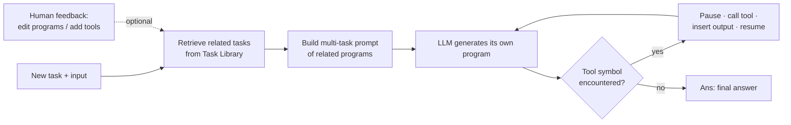

# ART: Automatic multi-step reasoning and tool-use for large language models — Summary

> [!NOTE]
> **Source:** [2303.09014-art-reasoning-tool-use.pdf](../../sources/arXiv/2303.09014-art-reasoning-tool-use.pdf) · Paranjape, Lundberg, Singh, Hajishirzi, Zettlemoyer & Ribeiro (University of Washington / Microsoft Research / UC Irvine / AI2 / Meta AI), 2023 · arXiv:2303.09014 · <https://arxiv.org/abs/2303.09014>.
> Study-guide summary of the full document. See the original for exact wording and figures.

## Abstract

ART (Automatic Reasoning and Tool-use) is a gradient-free framework in which a **frozen** LLM, given a new task, automatically writes a multi-step reasoning *program* by retrieving demonstrations of related tasks from a **task library**; at test time it pauses generation whenever a tool call appears, runs the tool, and splices the output back in before resuming. It automates what ReAct/PAL-style methods do by hand — no fine-tuning and no task- or tool-specific prompt-engineering.

**Key points**

- **Mechanism:** a task library of hand-written decompositions + a tool library (search, code generation, code execution). For a new task, ART selects related demonstrations, and a custom parsing-expression grammar (PeG) lets it stop generation at any tool symbol (e.g. `[search]`, `[generate code]`, `[exec code]`), call the tool, and resume — treating reasoning as a program with function calls.
- **No supervision for the new task:** decomposition and tool use transfer *zero-shot* from the library, so cross-task generalisation happens without any per-task reasoning/tool annotation.
- **Headline results (GPT-3 `text-davinci-002` frozen + Codex):** on unseen BigBench + MMLU tasks, ART beats direct few-shot prompting by **+10.8 points** on average and AutoCoT by over **+22 points**; it matches or beats AutoCoT on **32/34 BigBench** and **all MMLU** tasks. Tool use alone adds **+12.3 points** over the tools-off variant. On MMLU it wins on **5/6** tasks (+8.5 over few-shot).
- **Human-extensibility:** because programs are interpretable and no retraining is needed, a human can fix errors, add sub-steps, or register a new tool by editing the libraries. Editing just 5 error instances per task ("+Human Feedback") lifts ART to surpass the best published GPT-3 results by ~20 points on 12 tasks (avg 43.8 → 79.85).

**Takeaways**

- ART shows tool-augmented multi-step reasoning can be *automated and portable* rather than hand-scripted per task/tool — you can swap the base LLM or add tools without any fine-tuning.
- For prompt engineering: the value is a structured program grammar (parseable steps + tool symbols) plus a retrievable demonstration library, which together elicit better reasoning than free-form CoT and provide a clean human-in-the-loop editing surface.

## Introduction

In-context learning lets LLMs adapt to new tasks from instructions plus a few demonstrations, but has severe limits on multi-step reasoning, arithmetic/math, and up-to-date knowledge. Two lines of work address this: **chain-of-thought (CoT)** prompting for multi-step reasoning, and giving LLMs **tools** (calculators, search, code). Existing chained-reasoning-with-tools methods are hard to extend — they need fine-tuning or task/tool-specific prompt engineering (e.g. Toolformer per-tool, Parisi et al. per-task).

**ART** (Automatic Reasoning and Tool use) automatically generates decompositions for instances of new tasks and automatically selects/uses the right tools per step. Given a new task, it retrieves demonstrations of related tasks from a **task library** to enable few-shot decomposition and tool use. Demonstrations use a flexible, structured **query language** so intermediate steps are easy to parse, generation can stop to call a tool, and it can resume after the output is inserted. Users can fix mistakes or add tools by simply updating the task/tool libraries.

Setup and headline numbers:

- Task library built for **15 diverse BigBench tasks**; evaluated on **19 unseen BigBench tasks, 6 MMLU tasks**, and tool-use benchmarks (SQuAD, TriviaQA, SVAMP, MAWPS, T-REx, NQ).
- Matches or beats AutoCoT on **32/34 BigBench** and **all MMLU** tasks (avg **+22 pts**).
- Tool use adds **+12.3 pts** vs no tools (Table 3).
- Beats direct few-shot by **+10.8 pts** on unseen BigBench+MMLU; on arithmetic/algorithmic tasks **+12.5 pts** over few-shot and **+6.1 pts** over prior best GPT-3 results that use supervised decomposition/tools.
- With human feedback on 12 tasks, ART beats best-known GPT-3 by **>20 pts** on average (Table 6).

## Related Work

| Feature | CoT | AutoCoT | Toolformer | **ART** |
|---|:---:|:---:|:---:|:---:|
| Multi-step reasoning | ✓ | ✓ | | ✓ |
| Limited supervision | | ✓ | ✓ | ✓ |
| Tool use | | | ✓ | ✓ |
| Extendable libraries | | | | ✓ |
| Cross-task transfer | ✓ | ✓ | | ✓ |
| Human feedback | ✓ | | | ✓ |

(Table 1: ART is the only method combining all six.)

- **Scaled fine-tuning for adaptation:** instruction fine-tuning (T0, InstructGPT, Flan/Chung et al. at 540B) improves cross-task in-context learning. ART instead uses *frozen* API access to InstructGPT and Codex; future fine-tuning gains would carry over.
- **Prompting with intermediate steps:** CoT and variants (Least-to-most, Self-Ask, Ask-me-anything, Successive/Decomposed prompting). Kojima et al. showed zero-shot CoT via "Let's think step-by-step"; **AutoCoT** (Zhang et al.) auto-generates CoT prompts. ART adds a common language for cross-task demonstrations and extensible tool use.
- **Tool use:** search, browsers, calculators, translators, Python interpreters. Most need heavy human supervision or task/tool-specific prompts; **Toolformer** self-supervises tool use but is tool-specific. ART needs *no* additional training or tool-specific prompts, so the underlying LLM and the tools can be swapped freely, and it supports a human-in-the-loop feedback loop.

## ART (method)

A frozen LLM decomposes a new-task instance into multiple steps (using tools where appropriate) with **no** explicit supervision for decomposition or tool use. Running example: Physics Question Answering (PQA), high-school physics problems.

### Overview

The pipeline, given a task description, an input instance, and a few input-output pairs (no decomposition/tool supervision):

- **Prompt building:** retrieve similar tasks from the task library and add their instances as demonstrations. Demonstrations follow a custom parsing-expression grammar (PeG); each decomposition is a sequence of sub-steps, some invoking tool symbols. These decompositions are called **programs** (reasoning steps + symbolic tool calls resemble a program with function calls). The prompt of related programs teaches the LLM to decompose the new task and reuse sub-steps/tools — enabling cross-task generalisation.
- **Generation:** the LLM writes its own program; ART parses it as it streams, **pauses at each tool call**, runs the tool, integrates the output, then resumes. In the PQA example, `[search]` finds the physics formula, then `[generate code]`/`[exec code]` substitute values and compute the answer.
- **Human feedback (optional):** humans add decomposition demos or add/edit tools by updating the libraries — e.g. adding a step that rounds and appends the unit of measurement. Most experiments do *not* use feedback (so they measure zero-shot transfer), but it strongly boosts hard tasks and lets users add custom tools with no retraining.

### Task Library

Built from a small seed set of **BigBench** tasks (traditional NLP, maths, commonsense, QA). The authors identify **five skills** useful across more than half of BigBench short-answer tasks and cluster tasks by them:

| Cluster | What it covers |
|---|---|
| **Arithmetic** | arithmetic and algebra problems |
| **Code** | generating and executing Python code |
| **Search / question decomposition** | single- or multi-step questions needing search |
| **Free-form reasoning (CoT)** | step-by-step natural-language reasoning |
| **String operations** | reformatting/editing strings, string entailment, etc. |

They pick 2–4 tasks per cluster and write programs (decompositions) for a **few instances each**, including real tool calls and real tool outputs.

**Program grammar** (extends decomposed-prompting of Khot et al., using the query language of Beurer-Kellner et al.): each program is a sequence of nodes —

- an **input node**: task name + instruction + the instance input;
- a series of **sub-task nodes**, each a `(query, answer)` pair `Qi: [tool/sub-task name] ...` and `#i: ...` (the sub-step output);
- ends with a dummy `Qi: [EOQ]` then an **answer node** `Ans: ...`.

**Task retrieval** — two strategies:

| Strategy | Requires | How it selects |
|---|---|---|
| **Task-cluster** (default) | ~50 held-out labelled examples (10 if <100 available) | Try each of the 5 clusters as the prompt; keep the cluster with best held-out performance. No new-task decomposition supervision needed. |
| **LLM-similarity** | Fewer held-out examples | Prompt LLM to label task pairs "Similar"/"Not similar" with reasoning; rank library tasks by log-prob ratio; take top-N. Higher variance; worse on average (Appendix A.2). |

### Tool Library

When a sub-task query name matches a tool name, generation stops, the tool runs, and its output is inserted into the partial program. Seed tools:

- **Search** — SerpAPI (Google). Input is the text after `Qi: [search]`; extract the answer-box snippet or combine the top-2 result snippets.
- **Code generation** — Codex. Input is the instruction after `Qi: [generate python code]`, prompted as a multi-line Python comment; the generated code is appended to the program.
- **Code execution** — runs Python in a sandbox pre-loaded with arithmetic/symbolic/scientific packages. The argument is the previous sub-step's answer (the code snippet); for `i=1` the task input is used.

### Human feedback

ART is designed for feedback because it needs no fine-tuning — users edit the interpretable programs (debugging) rather than writing from scratch. Edit types:

- **C:** correct a sub-step's argument/output.
- **A:** add missing sub-steps (e.g. `[arithmetic]` to round, `[add unit]` to append a unit — still executed by the LLM, not new APIs).
- **T:** define and demonstrate a **new tool** in the tool library (e.g. a dictionary `[lookup]` for word unscrambling).

Only ~5 edited instances per task are needed to drastically improve target-task performance, and corrected programs/tools can be folded back into the libraries to help other tasks too.

## Experimental Setup

- **Datasets:** the 15 task-library tasks; 19 additional BigBench test tasks (same five clusters); a random MMLU subset (cross-benchmark check); and Toolformer's benchmarks (SQuAD, T-REx, SVAMP, MAWPS, NQ, TriviaQA).
- **Model details:** frozen **InstructGPT (`text-davinci-002`)** as the LLM, **Codex** for code generation, temperature **0.3**, **N=3** seed tasks in the prompt with **2 demonstration programs each**, metrics per Srivastava et al. (2022), averaged over **5 runs**.
- **Baselines:**
  - **Few-shot/Direct** — input-output pairs only (3 for BigBench, 5 for MMLU); higher of GPT-3 / Codex reported.
  - **AutoCoT** — auto-generated free-form NL CoT, no tools (isolates the value of the query language/library).
  - **ART w/o Tool Use** — ART with tools off (LLM generates every sub-step output).
  - **GPT-3 Best** — best published GPT-3/Codex (175B) result with decomposition and/or tools, often using extra human supervision and carefully crafted prompts.

## Results

### On the task library (Table 2)

With only two labelled decompositions per task, ART beats few-shot by **+14.9 pts** on average, and beats AutoCoT even with **no tools** by **+8 pts** (the structured program/PeG format elicits better reasoning than free-form CoT). With tools on, ART beats AutoCoT on all-but-one task (**+17.7 pts**); tools are called in **~95%** of instances and add **+7.91 pts**, with the biggest arithmetic gains (**+21.85** on average, from executing arithmetic as code). ART is stronger or comparable on **5/8** vs best published GPT-3; the shortfalls are tasks where others' hand-written demonstrations simply work better.

Illustrative rows (Few-shot / AutoCoT / ART w/o tools / **ART** / GPT-3 Best):

| Task (cluster) | Few-shot | AutoCoT | ART w/o tools | **ART** | GPT-3 Best |
|---|---:|---:|---:|---:|---:|
| GSM8K (Arithmetic) | 7.79 | 21.99 | 53.4 | **71.00** | 71.64 |
| Aqua-rat (Arithmetic) | 20.54 | 34.41 | 36.29 | **54.20** | 54.14 |
| K'th letter concat. (String) | 3.25 | 0.64 | 8.19 | **40.00** | 98.02 |
| Hyperbation (CoT) | 62.72 | 55.4 | — | **80.80** | 72.41 |

### Cross-task transfer — test tasks (Table 3)

On unseen BigBench tasks (no decomposition/tool supervision), ART beats few-shot by **+6.9 pts**, with large arithmetic gains (**+19.0**) and comparable search performance; tools are called in **~89%** of instances. ART beats AutoCoT on almost all tasks (**+24.6 pts**). Vs best GPT-3, ART is favourable on average, especially arithmetic (**+6.1 pts**); it lags where strong human decomposition demonstrations exist (addressed by feedback in §5.3).

**MMLU** (cross-benchmark): ART beats all baselines on **5/6** tasks, **+8.5 pts** over few-shot on average, despite no supervision — MMLU's world-knowledge needs benefit most from the search tool. Examples: Astronomy 62.1 → **79.1**; Business Ethics 61.6 → **81.16**; Virology 50.0 → **71.49**.

**Failure modes:** string-manipulation tasks (simple text editing, word unscrambling, repeat-copy logic) suffer from cascading **code-generation errors**; non-grammatical / not-in-input choices (ruin names, temporal sequences) are often mishandled.

### Vs Toolformer (Table 4)

ART (GPT-3 175B) beats Toolformer (fine-tuned smaller GPT-J) on **5/6** tasks — not an exact comparison (different scale), but vanilla GPT-3 is far worse than ART on all, so gains are not just scale. Deltas vs prior GPT-3: SVAMP **+46.8**, MAWPS **+27.0**, TriviaQA **+17.33**, NQ **+16.1**, SQuAD **+5.5**; T-REx **-3.1**.

### Improving ART (§5.3)

- **Self-consistency** (Table 5): ensembling **15** generations and taking the most frequent answer adds **~+3–5 pts** across tasks, at extra compute (e.g. CS Algorithms 88.11 → 90.99; Physics Questions 20.37 → 24.07).
- **Human feedback** (Table 6): one author edits **5** error instances per task. Feedback edited **~15.7%** of ART program tokens (vs **35%** of AutoCoT-baseline tokens); corrections in 72% of tasks, added sub-steps in 44%, new tools for two tasks (dictionary lookup for word unscrambling; a Prolog engine for formal fallacies). Both CoT and ART improve, but ART improves far more — averaging **CoT 30.2 → 43.8 (ART) → 79.85 (ART+feedback)**, consistently surpassing the best published GPT-3 baseline (56.0).

## Conclusion

ART is a **gradient-free** approach to automatic multi-step reasoning and automatic tool use with a large black-box LLM. Its contributions: a **lightweight grammar** for representing reasoning as a program with tool calls/arguments; an **extensible seed task library** of authored programs; and a **tool library** of utilities (search, code generation, execution). The interpretable framework lets humans improve decomposition and tool use. ART substantially beats few-shot and AutoCoT on unseen BigBench and MMLU, exceeds hand-crafted CoT once human feedback is added, and benefits further from self-consistency and from newer, tool-trained LLMs.

## Appendix highlights

- **A.1** — full example programs per cluster (arithmetic, search, code, CoT), each showing the `Qi: [tool] ... / #i: ...` grammar and ending in `[EOQ]` + `Ans:`.
- **A.2** — task-selection detail: task-cluster tuning uses ~50 held-out examples (10 if <100 available); LLM-similarity ranks by log-prob("Similar")/("Not similar") but has high variance and is worse on average.
- **A.3** — tool implementation detail: code generation passes both the previous answer/input and the post-`[generate python code]` instruction to Codex, since the prior context (e.g. the word problem) is needed for accurate code.
