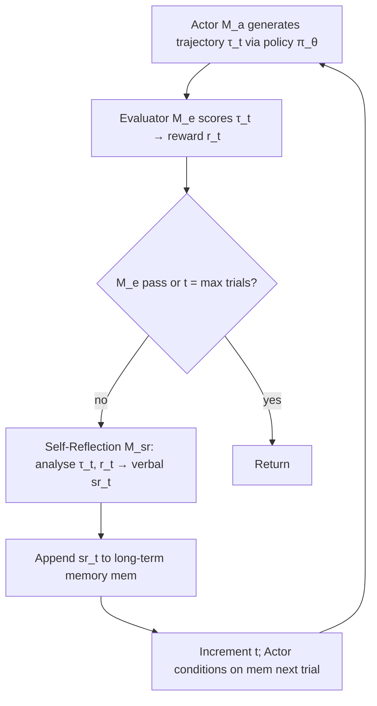

# Reflexion: Language Agents with Verbal Reinforcement Learning — Summary

> [!NOTE]
> **Source:** [2303.11366-reflexion-verbal-reinforcement.pdf](../../sources/arXiv/2303.11366-reflexion-verbal-reinforcement.pdf) · Shinn, Cassano, Berman, Gopinath, Narasimhan & Yao (Northeastern, MIT, Princeton), 2023 · arXiv:2303.11366v4 [cs.AI], 10 Oct 2023.
> Study-guide summary of the full document. See the original for exact wording and figures.

## Abstract

Reflexion is a framework that reinforces LLM-based agents **not by updating weights but through linguistic feedback**: an agent verbally reflects on task-failure signals, stores the reflection as text in an episodic memory buffer, and conditions its next attempt on that memory — a "verbal reinforcement learning" loop that lets an agent learn from trial-and-error over a handful of trials without fine-tuning.

**Key points**

- The agent is factored into three LLM-driven models: an **Actor** (M_a, generates text/actions, e.g. via Chain-of-Thought or ReAct), an **Evaluator** (M_e, scores the trajectory), and a **Self-Reflection** model (M_sr, turns a sparse success/fail signal plus the trajectory into a concrete verbal lesson stored in memory `mem`).
- Feedback flows: Evaluator → scalar/binary reward → Self-Reflection amplifies it into a natural-language "self-hint" → appended to long-term memory (`mem`, bounded to Ω = 1–3 experiences) → given as extra context to the Actor next trial. Trajectory history is short-term memory; reflections are long-term memory.
- **Coding (HumanEval Python):** Reflexion reaches **91% pass@1**, surpassing the prior GPT-4 state-of-the-art of 80%; sets new SOTA on HumanEval Rust (68.0), MBPP Rust (75.4) and LeetcodeHard Python (15.0 vs GPT-4's 7.5). It loses on MBPP Python (77.1 vs 80.1 baseline) due to a 16.3% false-positive test-execution rate.
- **Decision-making (ALFWorld):** ReAct+Reflexion solves **130/134 tasks** and improves on the baseline by an absolute **22%** over 12 trials, driving the hallucination rate down while ReAct-only plateaus at ~22% hallucination between trials 6–7 with no recovery.
- **Reasoning (HotPotQA):** Reflexion improves accuracy by **~20%** over baselines; an ablation shows the verbal self-reflection step adds an **8% absolute boost** over an episodic-memory-only (EPM) agent, and helps a CoT(GT) agent (with ground-truth context) correct **14%** of its previously-wrong answers.

**Takeaways**

- Verbal self-reflection over episodic memory is an effective, lightweight, interpretable alternative to gradient-based RL for agents — it works precisely because the LLM can localise its own mistake ("credit assignment") and phrase an actionable fix, which a scalar reward cannot.
- The gains come from the *reflection* step, not memory alone: refinement guided by a first-person verbal explanation beats blind retry and beats storing raw trajectories.
- Limits: self-correction is an **emergent ability of stronger models** (GPT-4 > GPT-3.5 > davinci; weak models like starchat-beta get no benefit), it has no formal success guarantee, and it fails on tasks needing broad creative exploration (WebShop: no improvement after 4 trials).

## 1 Introduction

- Recent LLM agents (ReAct, SayCan, Toolformer, HuggingGPT, generative agents, WebGPT) do autonomous decision-making with an LLM core, but are limited to **in-context examples** for teaching, because standard RL with gradient descent needs too much compute and time.
- **Reflexion** uses *verbal reinforcement*: convert binary/scalar environment feedback into a textual summary added as context for the next episode. This self-reflective feedback acts as a "**semantic gradient signal**" giving the agent a concrete direction to improve — akin to how humans reflect on failures to form a better plan.
- Generating useful reflection is hard: it requires solving the **credit-assignment problem** (understanding *where* the model erred) and producing an actionable summary. The paper explores three feedback sources: (1) simple binary environment feedback, (2) pre-defined heuristics for common failure cases, and (3) self-evaluation (LLM binary classification for decision-making; self-written unit tests for programming). In all cases the evaluation signal is amplified into a natural-language experience summary stored in long-term memory.

**Advantages of Reflexion over policy/value-based RL:**

1. Lightweight — no LLM fine-tuning.
2. Allows nuanced feedback (e.g. targeted action changes) vs hard-to-credit scalar/vector rewards.
3. More explicit, interpretable episodic memory of prior experience.
4. Gives more explicit hints for future actions.

**Disadvantages:** relies on the LLM's self-evaluation ability (or heuristics) and has no formal success guarantee.

**Contributions:**

- Propose Reflexion, a paradigm for "verbal" reinforcement that parameterises a policy as the agent's memory encoding paired with an LLM.
- Show self-reflection is an emergent property useful for learning complex tasks over a handful of trials.
- Introduce **LeetcodeHardGym**, a code-generation RL gym of 40 hard-level Leetcode questions in 19 programming languages.
- Achieve improvements over strong baselines and SOTA on several code-generation benchmarks.

Headline improvements: **+22%** on ALFWorld (12 steps), **+20%** on HotPotQA, **up to +11%** on HumanEval.

## 2 Related work

**Reasoning and decision-making**

- **Self-Refine** (Madaan et al.) — iterative self-refinement via self-evaluation, but limited to single-generation tasks (no memory, no decision-making). Pryzant et al. do semantic prompt optimisation, also single-generation. Paul et al. fine-tune critic models for intermediate feedback. Xie et al. use self-evaluation-guided stochastic beam search over actions. Yoran et al. and Nair et al. use decider models over multiple generations. Kim et al. use a fixed-step retry pattern *without* an evaluation step. Goodman does a qualitative self-evaluation step proposing optimisations.
- Reflexion's distinction: it adds **self-reflection to build a persisting memory** of self-reflective experiences, letting the agent identify its own errors and self-suggest lessons over time. In the comparison table, Reflexion is the only approach checking all of: self-refine, hidden constraints, decision-making, binary reward, **and memory**.

**Programming**

- AlphaCode (evaluates generations on hidden test cases), CodeT (self-generated unit tests to score implementations), Self-Debugging (debug given execution feedback), CodeRL (actor-critic RL to debug with execution feedback).
- AlphaCode, Self-Debugging and CodeRL rely on **ground-truth test cases that invalidate pass@1 eligibility** and don't use self-reflection to bridge error-identification and implementation improvement. CodeT avoids hidden tests but has no self-learning step. Reflexion is the only one combining test execution, debugging, self-generated tests, multiple languages, and self-reflection.

## 3 Reflexion: reinforcement via verbal reflection

A modular formulation with **three distinct models**:

| Model | Symbol | Role |
|---|---|---|
| **Actor** | M_a | LLM prompted to generate text and actions conditioned on state observations; samples action a_t from policy π_θ; explored variants include Chain-of-Thought and ReAct. Augmented with a memory component `mem`. |
| **Evaluator** | M_e | Scores an Actor trajectory into a reward. Variants: exact-match (EM) grading for reasoning; pre-defined heuristics for decision-making; an LLM used as evaluator for decision-making and programming. |
| **Self-Reflection** | M_sr | LLM that turns a sparse reward, the current trajectory, and memory into nuanced, specific verbal feedback stored in `mem`. |

> [!IMPORTANT]
> The core mechanism: given a failure signal, the Self-Reflection model can infer that a specific action a_i led to subsequent wrong actions a_{i+1}, a_{i+2}, then **verbally state it should have taken a different action a'_i** (yielding a'_{i+1}, a'_{i+2}), and store this. Next trial the Actor conditions on that hint and chooses a'_i. This iterative loop of trial, error, self-reflection, and persisting memory is what enables rapid improvement.

**Memory** — the design mirrors human recall of fine-grained recent detail plus distilled long-term lessons:

- **Short-term memory:** the trajectory history of the current trial.
- **Long-term memory:** the Self-Reflection outputs across trials, stored in `mem`.
- Combining them gives context that is both specific and shaped by lessons over several trials — the key advantage over other LLM action-choice works.

### The Reflexion process (Algorithm 1)

Formalised as iterative optimisation. Policy π_θ has parameters θ = {M_a, mem}. On trial t the Evaluator computes r_t = M_e(τ_t); r_t is a scalar reward that improves as task performance rises. To make r usable by an LLM, the Self-Reflection model analyses {τ, r} to produce a verbal summary sr_t appended to `mem`. In practice `mem` is bounded to a maximum Ω (usually **1–3**) stored experiences to fit the LLM context window.

**Algorithm 1 (Reinforcement via self-reflection):** initialise M_a, M_e, M_sr and policy π_θ (θ = {M_a, mem}); generate initial trajectory τ_0, evaluate with M_e, generate initial reflection sr_0, set mem ← [sr_0], t = 0; then **while M_e does not pass and t < max trials**: generate τ_t, evaluate, generate sr_t, append to mem, increment t.

## 4 Experiments

Evaluated across three task families: decision-making (**ALFWorld**), reasoning (**HotPotQA**), and code generation (**HumanEval**, **MBPP**, **LeetcodeHard**). Headline: **+22%** on ALFWorld, **+20%** on HotPotQA, **+11%** on HumanEval.

Figure 1 illustrates the shared loop (Task → Trajectory → Evaluation → Reflection → Next trajectory) instantiated for each domain: decision-making uses a rule/LM heuristic (e.g. detecting hallucination), programming uses self-generated unit-test failure, reasoning uses environment binary reward.

### 4.1 Sequential decision making: ALFWorld

- **ALFWorld** — text-based (TextWorld-based) environments; **134 environments across 6 task types** (finding hidden objects, moving objects, manipulating objects with others). Actor is **ReAct**.
- Two self-evaluation techniques for the "is the task complete?" signal: (1) **natural-language classification with an LLM**, and (2) a **hand-written heuristic** — self-reflect if the agent repeats the same action + response for >3 cycles, or if actions in the current environment exceed 30 (inefficient planning).
- Baseline runs skip reflection on the signal and just reset; Reflexion runs reflect, update memory, then reset. Memory truncated to the last **3** self-reflections. Two domain-specific few-shot trajectories provided; same few-shot examples as ReAct (Yao et al.) with GPT-3.

**Results:** ReAct+Reflexion completes **130/134 tasks** using the simple heuristic to detect hallucinations and inefficient planning, and keeps learning over **12 consecutive trials**; ReAct-only halts improvement between trials 6 and 7.

**Analysis:** A common baseline failure is the agent *thinking* it holds an item it doesn't, then continuing a long trajectory with no backtracking. Reflexion eliminates almost all such cases by distilling long failed trajectories into "self-hints." Two ways long-term memory helps: (1) an early mistake in a long trajectory is easily identified so the agent can propose a new action or plan; (2) with too many surfaces/containers to check, the agent exploits experience memory across trials to search thoroughly. The learning curve shows an immediate spike between the first two trials then a steady climb to near-perfect over ~11 trials — the agent balances both cases. ReAct-only converges at a **22% hallucination rate** with no long-term recovery.

Figure 3(b) breaks failures into **hallucination** and **inefficient planning**: for ReAct+Reflexion both decay across trials (hallucination from ~0.32 toward ~0.03; inefficient planning near 0), while ReAct-only hallucination stays ~0.21.

### 4.2 Reasoning: HotpotQA

- **HotPotQA** — Wikipedia-based, **113k** Q&A pairs requiring multi-hop reasoning over several supporting documents.
- Two setups: **Reflexion + CoT** for reasoning-only, with Q → A and Q, C_gt → A (C_gt = ground-truth context, to isolate reasoning over long text); and **Reflexion + ReAct** for holistic QA that retrieves context via a Wikipedia API and answers with step-by-step thinking.
- Prompting: CoT uses 6-shot, ReAct 2-shot, self-reflection 2-shot. **Exact-match** answer grading gives the binary success signal; memory size **3**; temperature 0.7; agents retry failed tasks until **3 consecutive failed attempts**.

**Results:** Reflexion outperforms all baselines by significant margins. **ReAct-only, CoT-only, and CoT(GT)-only fail to probabilistically improve on any tasks** — no first-trial failures got solved in later trials. CoT(GT) has higher raw accuracy (it sees ground truth) but still gets **39%** of questions wrong; Reflexion helps it correct mistakes without the ground-truth answer to improve accuracy by **14%**.

**Ablation — episodic memory (EPM):** Starting from CoT(GT), adding episodic memory (most recent trajectory) gives an EPM agent; adding the standard first-person verbal self-reflection step on top yields an **8% absolute boost over the EPM-only learning advantage**. Conclusion: **refinement-only approaches are less effective than self-reflection-guided refinement.**

Figure 4 shows the three curves: (a) Reflexion ReAct vs CoT both beat their non-Reflexion baselines; (b) CoT(GT)+Reflexion climbs above CoT(GT)-only; (c) CoT(GT) EPM+Reflexion beats EPM-only, which beats plain CoT(GT).

### 4.3 Programming

- Benchmarks: **MBPP**, **HumanEval**, and the new **LeetcodeHardGym**. **MultiPL-E** compiler used to translate HumanEval/MBPP subsets to **Rust** (MultiPL-E covers 18 languages), demonstrating Reflexion is language-agnostic across interpreted and compiled languages.
- **LeetcodeHardGym** — interactive gym of **40 Leetcode hard questions released after Oct 8 2022** (GPT-4's pre-training cutoff), so no memorisation.
- Programming is **pass@1-eligible** because it uses self-generated unit tests, not ground-truth tests. Test-suite generation: CoT prompting produces diverse tests with NL descriptions; tests filtered for validity by building an AST; sample **n ≤ 6** unit tests into suite T. Otherwise the loop is identical to reasoning/decision-making, with **max memory limit of 1 experience**.

**Table 1 — Pass@1 accuracy (base strategy = single sample, zero-shot):**

| Benchmark + Language | Prev SOTA Pass@1 | SOTA Pass@1 | **Reflexion Pass@1** |
|---|---|---|---|
| HumanEval (PY) | 65.8 (CodeT + GPT-3.5) | 80.1 (GPT-4) | **91.0** |
| HumanEval (RS) | – | 60.0 (GPT-4) | **68.0** |
| MBPP (PY) | 67.7 (CodeT + Codex) | **80.1** (GPT-4) | 77.1 |
| MBPP (RS) | – | 70.9 (GPT-4) | **75.4** |
| Leetcode Hard (PY) | – | 7.5 (GPT-4) | **15.0** |

**Results:** Reflexion sets new SOTA on all Python/Rust benchmarks **except MBPP Python** (the only case it loses to baseline GPT-4).

**Table 2 — overall accuracy and test-generation confusion (TP: tests pass + solution pass; FN: tests fail + solution pass; FP: tests pass + solution fail; TN: tests fail + solution fail):**

| Benchmark + Language | Base | Reflexion | TP | FN | FP | TN |
|---|---|---|---|---|---|---|
| HumanEval (PY) | 0.80 | **0.91** | 0.99 | 0.40 | 0.01 | 0.60 |
| MBPP (PY) | **0.80** | 0.77 | 0.84 | 0.59 | 0.16 | 0.41 |
| HumanEval (RS) | 0.60 | **0.68** | 0.87 | 0.37 | 0.13 | 0.63 |
| MBPP (RS) | 0.71 | **0.75** | 0.84 | 0.51 | 0.16 | 0.49 |

**Analysis — why MBPP Python loses:** self-reflecting code agents are bounded by their ability to write diverse, correct tests. A *flaky* test suite can pass an incorrect solution → **false positive** (agent prematurely reports an invalid submission). A wrong test suite can fail a correct solution → **false negative** (agent can often recover by keeping the original code). **False negatives are preferable to false positives.** Baseline pass@1 is similar for HumanEval-PY (82%) and MBPP-PY (80%), but the **false-positive test-execution rate is 16.3% for MBPP Python vs only 1.4% for HumanEval Python** — the high FP rate drags MBPP down while HumanEval reaches 91%.

**Ablation study (Table 3 — HumanEval Rust, 50 hardest problems, GPT-4):**

| Approach | Test Generation | Self-reflection | Pass@1 (Acc) |
|---|---|---|---|
| Base model | False | False | 0.60 |
| Test generation omission | False | True | 0.52 |
| Self-reflection omission | True | False | 0.60 |
| **Reflexion** | True | True | **0.68** |

- **Omitting test generation** (self-reflect with no test guidance) drops accuracy to **52% vs 60% baseline** — without unit tests the agent can't tell if the current implementation is correct, so it must run all iterations without early exit and makes harmful edits.
- **Omitting the self-reflection explanation** step (after failed tests) gives **no improvement over baseline (0.60)** — test generation and compilation catch syntax/logic errors, but the implementation fixes don't reflect those indications.
- Conclusion: **"blind" trial-and-error debugging without self-reflection is ineffective on harder tasks** (e.g. complex Rust programs). The two components must cooperate.

## 5 Limitations

- Reflexion is at heart **natural-language policy optimisation** — powerful for improving action choice through experience, but can still fall into **non-optimal local minima**.
- The study limits long-term memory to a sliding window with max capacity; future work could use vector-embedding or SQL databases.
- Test-driven development has practical limits: non-deterministic generators, impure functions calling APIs, hardware-dependent output, and parallel/concurrent behaviour are hard to specify with accurate input-output mappings.

## 6 Broader impact

- LLM agents interacting with the Internet, software, robotics, and humans can be reinforced toward greater automation and efficiency, but **misuse risk is amplified** — this direction needs more safety and ethics effort.
- Conversely, RL has suffered from black-box, hard-to-interpret policies; **"verbal" RL may improve interpretability and diagnosability**. For tool usage too complex for humans to follow, self-reflections could be **monitored to verify proper intent before a tool is used**.

## 7 Conclusion

Reflexion leverages verbal reinforcement to teach agents to learn from past mistakes, significantly outperforming widely-used decision-making approaches via self-reflection. Future work could bring in more advanced traditional-RL techniques such as value learning in natural language or off-policy exploration.

## 8 Reproducibility

The authors strongly advise **isolated execution environments** for autonomous code-writing experiments, since generated code is not validated before execution. Code, demos, and datasets released at github.com/noahshinn024/reflexion.

## Appendix highlights

### A — Evaluation with additional models: self-correction is emergent

Trial-and-error self-correction is an **emergent quality of stronger, larger models**.

- **Table 4 (HumanEval Python, starchat-beta, avg over 8 trials):** Baseline **0.26** vs Reflexion **0.26** — a weak model gets **no benefit**.
- **Table 5 (100 HotPotQA, various models):** Reflexion helps consistently, and more with stronger models:

| Model | Baseline | Reflexion |
|---|---|---|
| CoT (GT) + text-davinci-003 | 0.60 | **0.77** |
| CoT (GT) + gpt-3.5-turbo | 0.57 | **0.71** |
| CoT (GT) + gpt-4 | 0.68 | **0.80** |
| ReAct + text-davinci-003 | 0.30 | **0.55** |
| ReAct + gpt-3.5-turbo | 0.26 | **0.38** |
| ReAct + gpt-4 | 0.39 | **0.51** |

### B — Decision-making worked example (Figure 5)

An ALFWorld task "examine the mug with the desklamp": Trial #1 fails via **inefficient planning** — the agent finds and takes a mug then hunts for a desklamp and repeatedly "use desklamp 1 → Nothing happens" (status: Fail). Its **reflection** recognises the plan was backwards: it should have found the desklamp first, then the mug. Trial #2 goes straight to desk 1, takes the mug, uses the desklamp — status: **Success** — in a concise corrected trajectory.

### B.1 — WebShop limitation

- **WebShop** — web-based e-commerce navigation/purchase benchmark; two-shot ReAct+Reflexion tested in 100 environments.
- After only **4 trials the runs are terminated — no sign of improvement** (Figure 6: ReAct+Reflexion ~0.35 barely above ReAct ~0.34). The agent doesn't generate helpful reflections after failures.
- Conclusion: **Reflexion cannot solve tasks requiring significant diversity and exploration.** ALFWorld works because permissible actions are visible in observations; HotPotQA works because Wikipedia search is more forgiving; WebShop needs very diverse, creative search behaviour to handle ambiguous NL queries, which Reflexion doesn't provide.

### C — Programming prompt design

Programming LLM calls need strict instructions to produce **function bodies only** (LLMs are trained toward dialogue). The programming loop chains: (Function implementation) → (Unit test feedback) → (Self-reflection) → (Instruction for next function implementation). Full implementation and prompt/example templates for HumanEval Python etc. are in the released repo.
