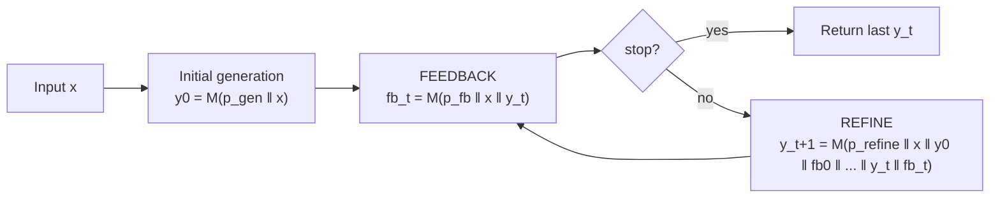

# Self-Refine: Iterative Refinement with Self-Feedback — Summary

> [!NOTE]
> **Source:** [2303.17651-self-refine-iterative-refinement.pdf](../../sources/arXiv/2303.17651-self-refine-iterative-refinement.pdf) · Madaan, Tandon, Gupta, Hallinan, Gao, Wiegreffe, Alon, Dziri, Prabhumoye, Yang, Gupta, Majumder, Hermann, Welleck, Yazdanbakhsh, Clark (CMU / Allen Institute for AI / UW / NVIDIA / UC San Diego / Google Research), 2023 · arXiv:2303.17651v2 [cs.CL], preprint; code/data at https://selfrefine.info/.
> Study-guide summary of the full document. See the original for exact wording and figures.

## Abstract

Self-Refine is a test-time method that improves a large language model's output by having **the same model** generate its output, critique it, and rewrite it — iterating feedback→refine until a stop condition. It needs no extra training, no supervised refinement data, and no reinforcement learning; the only supervision is the few-shot examples in three prompts (generate, feedback, refine).

**Key points**

- **One model, three roles.** A single frozen LLM (GPT-3.5 / ChatGPT / GPT-4, plus Codex for code) acts as generator, feedback-provider, and refiner. Feedback is natural language, and it must be **specific and actionable** — it names the concrete phrase/line to change and the concrete action to take.
- **Headline result: ~20% absolute average gain.** Across 7 diverse tasks, Self-Refine outputs are preferred (by humans and automatic metrics) over one-step generation from the *same* model, improving by roughly **20% absolute on average**, with a per-task range of **5–40% absolute**.
- **Biggest wins on preference / open-ended tasks.** Dialogue Response with GPT-4 rose from 25.4→74.6 (**+49.2**); Sentiment Reversal with GPT-4 3.8→36.2 (**+32.4**); Constrained Generation with GPT-4 15.0→45.0 (**+30.0**). Code Optimization with GPT-4 rose 27.3→36.0 (**+8.7**).
- **Iteration helps, with diminishing returns.** Averaged over models, Constrained Generation climbs 29.0→49.7 over three iterations, Code Optimization 22.0→28.8, Sentiment Reversal 33.9→36.8 — most of the gain lands in the first iteration.
- **Feedback quality is the load-bearing part.** Replacing specific feedback with generic feedback, or none, drops scores sharply (Sentiment Reversal 43.2→31.2→0). In failure cases, ~94% of the problem is bad *feedback*, not bad refinement.

**Takeaways**

- Even state-of-the-art models leave quality on the table in one-shot generation; a cheap self-critique loop recovers much of it at inference time, no retraining required.
- The method works only for tasks where the model can reliably tell good from bad. It barely helps **Math Reasoning** (≈0 gain without an external correctness signal) because the model cannot detect its own subtle errors, and it **fails on weaker models** like Vicuna-13B that cannot follow the feedback/refine prompt format.
- If you can inject an external oracle for correctness (e.g. a math checker or compiler), self-refinement gains grow (Math Reasoning GPT-3.5 +4.8% with Oracle feedback).

## 1. Introduction

LLMs produce coherent but often sub-optimal first drafts, especially on **multifaceted** tasks (dialogue) or **hard-to-specify** goals (code readability). Prior iterative-refinement work needs a trained, domain-specific refiner or expensive supervision (reward models, human annotations). The paper's motivation is **human self-refinement**: people draft, reflect, and revise (e.g. rewriting a blunt "Send me the data ASAP" into a polite request; refactoring quick-and-dirty code).

> [!IMPORTANT]
> Central thesis: an LLM can iteratively improve its own output **without any additional training** — it can produce useful feedback on its own generation and act on that feedback, using a single frozen model guided only by few-shot prompts.

Self-Refine outperforms direct generation from GPT-3.5, ChatGPT and GPT-4 by **5–40% absolute**, and improves strong code models (Codex) by up to **13% absolute** on code tasks.

## 2. Iterative Refinement with Self-Refine

The method needs one LLM `M` and three prompts: `p_gen`, `p_fb`, `p_refine`. No training.

**The steps (Algorithm 1):**

| Step | Equation | What happens |
|---|---|---|
| **Initial generation** | `y0 = M(p_gen ‖ x)` | `p_gen` is a task-specific few-shot prompt of input-output pairs ⟨x,y⟩. |
| **FEEDBACK** | `fb_t = M(p_fb ‖ x ‖ y_t)` | Same model critiques its own output. `p_fb` gives ⟨x, y, fb⟩ triples. Feedback may be multi-aspect (e.g. code: efficiency, readability, quality). |
| **REFINE** | `y_{t+1} = M(p_refine ‖ x ‖ y0 ‖ fb0 ‖ ... ‖ y_t ‖ fb_t)` | Same model rewrites, **conditioning on the full history** of prior outputs and feedback, so it does not repeat past mistakes. `p_refine` gives ⟨x, y_t, fb_t, y_{t+1}⟩ quadruples. |
| **Stop** | `stop(fb_t, t)` | Halt at a fixed step count, or when feedback emits a stop indicator (e.g. a scalar "stop score"); determined per task. |

> [!TIP]
> Feedback must be **actionable** (a concrete action likely to improve the output — "use the formula n(n+1)/2") and **specific** (names the exact phrase/construct to change — "the for loop"). This specificity is what makes refinement work.

Worked examples (Figure 2): a bland dialogue reply gets feedback "provides no information / lacks user understanding" and is rewritten into an engaging response; a brute-force `sum(n)` loop gets feedback "slow, use the closed-form formula" and is rewritten to `(n*(n+1))//2`.

## 3. Evaluation

### 3.1 Tasks and setup

Seven tasks span natural language and code. Two are new to this paper (Acronym Generation; Constrained Generation = "CommonGen-Hard").

| Task | Dataset / size | Metric |
|---|---|---|
| Sentiment Reversal | Zhang et al. 2015 — 1000 review passages | human / GPT-4 preference |
| Dialogue Response Generation | Mehri & Eskenazi 2020 — 372 conversations | human / GPT-4 preference |
| Code Optimization | Madaan et al. 2023 (PIE) — 1000 programs | % programs optimized (%OPT) |
| Code Readability Improvement | Puri et al. 2021 — 300 programs | GPT-4 meaningful-variable fraction |
| Math Reasoning | Cobbe et al. 2021 (GSM8K) — 1319 questions | % solve rate |
| Acronym Generation (new) | 250 acronyms (curated) | human / GPT-4 preference |
| Constrained Generation (new) | CommonGen-Hard, 20–30 concepts (vs 3–5) | concept coverage % |

- Base LLMs: **GPT-3.5 (text-davinci-003), ChatGPT (gpt-3.5-turbo), GPT-4**; Codex (code-davinci-002) for code tasks. Comparison is always against the *same* base model without the feedback-refine loop.
- Up to **4 iterations** max. Both FEEDBACK and REFINE implemented as **few-shot prompts** even for instruction-tuned models, for consistency. Greedy decoding, **temperature 0.7**.
- Metrics: task-specific automated metrics where available; blind human A/B preference where not; and **GPT-4 as a proxy for human preference** — correlation with humans was 82% (Sentiment), 71% (Dialogue), 68% (Acronym).

### 3.2 Main results (Table 1)

Base vs +Self-Refine, with absolute improvement in parentheses. Highest per-model gains in **bold**.

| Task | GPT-3.5 base → +SR | ChatGPT base → +SR | GPT-4 base → +SR |
|---|---|---|---|
| Sentiment Reversal | 8.8 → 30.4 (↑21.6) | 11.4 → 43.2 (↑31.8) | 3.8 → 36.2 (**↑32.4**) |
| Dialogue Response | 36.4 → 63.6 (↑27.2) | 40.1 → 59.9 (↑19.8) | 25.4 → 74.6 (**↑49.2**) |
| Code Optimization | 14.8 → 23.0 (↑8.2) | 23.9 → 27.5 (↑3.6) | 27.3 → 36.0 (↑8.7) |
| Code Readability | 37.4 → 51.3 (↑13.9) | 27.7 → 63.1 (↑35.4) | 27.4 → 56.2 (↑28.8) |
| Math Reasoning | 64.1 → 64.1 (0) | 74.8 → 75.0 (↑0.2) | 92.9 → 93.1 (↑0.2) |
| Acronym Generation | 41.6 → 56.4 (↑14.8) | 27.2 → 37.2 (↑10.0) | 30.4 → 56.0 (↑25.6) |
| Constrained Generation | 28.0 → 37.0 (↑9.0) | 44.0 → 67.0 (↑23.0) | 15.0 → 45.0 (↑30.0) |

Findings:
- **Consistent improvement across all model sizes**, and Self-Refine beats prior state-of-the-art on all tasks.
- **Largest gains on preference and constrained tasks.** Constrained Generation benefits because there are many chances to miss a concept on the first pass (and refinement fixes them), and the output space is huge (refinement explores it). Preference tasks (Dialogue, Sentiment, Acronym) see especially high gains.
- **Stronger base → stronger refined result.** GPT-4+Self-Refine generally beats GPT-3.5/ChatGPT+Self-Refine even where GPT-4's *base* score was lower — Self-Refine lets stronger models "unlock" latent capability not expressed in single-pass generation.
- **Math Reasoning barely moves** (~0). The model cannot reliably detect its own errors: math errors are subtle (a single wrong line/operation), and a plausible-looking chain fools the model — ChatGPT's feedback was "everything looks good" for **94%** of instances. Gains rise 5%+ if an external source flags incorrect answers (see §H.1).

Confidence intervals (Table 13): reported as Wilson 95% intervals; most improvements are marked statistically significant (starred).

## 4. Analysis

**Feedback quality matters (ablation, Table 2).** Compare specific/actionable feedback vs generic ("Improve the efficiency of the code") vs none:

| Task | Self-Refine feedback | Generic feedback | No feedback |
|---|---|---|---|
| Code Optimization | 27.5 | 26.0 | 24.8 |
| Sentiment Reversal | 43.2 | 31.2 | 0 |
| Acronym Generation | 56.4 | 54.0 | 48.0 |

Generic feedback gives some benefit; specific, actionable feedback gives the best results. Sentiment Reversal collapses entirely (to 0) without feedback.

**Iterations help, with diminishing returns (Figure 4).** Averaged over ChatGPT/GPT-3.5/GPT-4:

| Task | y0 | y1 | y2 | y3 |
|---|---|---|---|---|
| Code Optimization | 22.0 | 27.0 | 27.9 | 28.8 |
| Sentiment Reversal | 33.9 | 34.9 | 36.1 | 36.8 |
| Constrained Generation | 29.0 | 40.3 | 46.7 | 49.7 |

Most of the improvement (Δ) is in the first iteration; later iterations add little. Quality is not always monotonic — in multi-aspect tasks (Acronym) one aspect can improve while another declines. Table 10 shows an acronym whose total (out of 25) goes 11→17→12→17 across four iterations as pronunciation/spelling and relevance/connotation trade off. To handle this, Self-Refine emits **numerical per-aspect scores** and selects the output with the **maximum score across all iterations** (Algorithm 1, line 8); for tasks like Math Reasoning and Sentiment Reversal quality rises monotonically.

**Refining beats just sampling more.** In a 1-vs-k comparison, Self-Refine's single refined output is preferred by humans over **all k = 4** independent ChatGPT samples (the MULTI baseline). Even in this harder 1-vs-k setting, refinement wins over generating more candidates (Figure 6, % Self-Refine preferred / ties / baseline preferred):

| Comparison | Self-Refine | ties | baseline |
|---|---|---|---|
| Sentiment Reversal vs ChatGPT (single sample) | 37.2 | 35.6 | 27.2 |
| Sentiment Reversal vs MULTI (4 samples) | 33.3 | 51.1 | 15.5 |
| Acronym vs ChatGPT (single sample) | 43.2 | 45.4 | 11.4 |
| Acronym vs MULTI (4 samples) | 40.05 | 53.82 | 6.1 |

**Weaker models fail.** Vicuna-13B could produce initial outputs but could not consistently emit feedback in the required format, and even given oracle/hard-coded feedback it often failed to refine — repeating its output or hallucinating a conversation. The authors attribute this to it being trained on conversations, not generalizing to test-time few-shot tasks. A **mixed-refine** setup (Vicuna-13B initializes, ChatGPT does feedback+refine) lifts Math Reasoning from 24.18% to 40.5% (§G).

**Qualitative error analysis** (70 samples: 35 success / 35 failure, on Code Optimization + Math Reasoning). Feedback was predominantly actionable. When Self-Refine **failed**, the fault was overwhelmingly in the feedback, not the refiner:

| Failure cause | Share |
|---|---|
| Feedback suggested an inappropriate fix | 61% |
| Feedback wrongly located the error | 33% |
| Refiner mis-implemented good feedback | 6% |

In **successful** cases, the refiner made precise fixes from accurate feedback 61% of the time, and — notably — still succeeded with *partially incorrect* feedback in 33% of cases, showing some resilience to sub-optimal feedback. (Dialogue error breakdown in §H gives similar findings: the refiner was robust to incorrect/generic feedback ~60% of the time.)

Figure 5 shows a code example where Self-Refine's feedback diagnoses six nested loops and rewrites a brute-force coin-combination search into a **dynamic-programming** solution, reducing time complexity to O(amount * coins).

**Beyond benchmarks (§I).** In a website-generation demo, ChatGPT drafts a rudimentary HTML/CSS/JS layout, then FEEDBACK proposes concrete edits (colors, font sizes, added icons/paragraphs, dividers) that REFINE applies — showing the loop extends to open-ended creative tasks.

## 5. Related work

Refinement methods vary in the **source** of feedback, its **representation**, and how the **refiner** is obtained.

- **Source of feedback.** Humans (costly); scalar reward functions as surrogates; domain sources like compilers or Wikipedia edits; recently LLMs for general-domain feedback. Self-Refine is the only method that generates feedback with an LLM **on its own output** to refine with the **same** LLM.
- **Representation.** Feedback can be non-NL (example pairs, scalar rewards) or NL. Self-Refine uses **NL feedback**, because it lets the same LM both produce and consume feedback using pretrained LLMs.
- **Types of refiners.** Prior refiners are typically **trained per domain** (supervised, or from model generations). Self-Refine trains **no separate refiner** — one model does both refinement and feedback across domains.
- **Non-refinement RL.** RL methods optimize a scalar reward and never see feedback on an *intermediate* generation, and they **update model parameters** — Self-Refine does neither.

**Comparison table (Table 3):** Self-Refine is the only listed approach that is simultaneously **supervision-free refiner + supervision-free feedback + multi-aspect feedback + iterative**. Learned refiners (PEER, Self-critique, CodeRL, Self-Correction/Welleck et al.) and prompted refiners (Augmenter, Re3, Reflexion) each satisfy only some of these.

> [!NOTE]
> **vs Reflexion (Shinn et al. 2023, concurrent):** Reflexion gives free-form reflection on whether a ReAct planning step succeeded; Self-Refine's feedback is more granular and structured (multi-dimensional feedback + scores), suiting a wider range of NLG tasks, including open-ended ones without step-by-step planning.
>
> **vs Self-Correction (Welleck et al. 2022, closest work):** it (1) does not generate explicit feedback (trains a refine-only model), (2) trains a **separate refiner per task**, and (3) is empirically weaker. Self-Refine uses instructions + few-shot prompting, no per-task training.

**Fine-tuned / few-shot baselines** (Appendix F): Self-Refine is competitive or better while using **at most 4 samples**, vs 16–32 for other methods.

- *Math Reasoning* (Table 7): Self-Refine w/ GPT-4 = **94.5** solve rate (vs PaL w/ GPT-4 93.3; Self-Correct w/ GPT-3 45.9). Self-Refine w/ GPT-3 55.7, GPT-3.5 62.4, ChatGPT 75.1.
- *Code Optimization %OPT* (Table 8): Self-Refine w/ GPT-4 = **36.0** (vs GPT-4 base 27.3; human references 38.2; best fine-tuned PIE-Few-shot BEST@32 = 38.3, using far more samples).

## 6. Limitations and Discussion

> [!WARNING]
> The authors flag these limits:
> - **Needs a capable base model.** The base LLM must already have strong few-shot / instruction-following ability to give and use in-context feedback without a trained refiner. Weaker models (Vicuna-13B) do not benefit.
> - **Closed, non-free models.** Experiments used GPT-3.5, ChatGPT, GPT-4, Codex — not open-sourced; pretraining corpus, sizes, and biases are undocumented, and using them costs money (code and outputs released for reproducibility).
> - **English only.** Benefits may not transfer to other languages.
> - **Dual-use risk.** Prompting techniques could steer a model to more toxic/harmful output; Self-Refine does not explicitly guard against this.
> - **(from §3.3) Self-detection ceiling.** The loop cannot fix errors the model cannot recognize — hence the near-zero Math Reasoning gain absent an external correctness signal.

## 7. Conclusion

Self-Refine is a simple, standalone, training-free method: a single LLM iteratively feeds back on and refines its own output. It needs no supervised data and no RL, works across diverse NL and code tasks, and — the paper's core demonstration — improves even state-of-the-art models like GPT-4 at **test time**. The aim is to reduce the cost of human creative processes; code, data, and prompts are released.

## Appendix highlights

- **§H.1 Oracle feedback (Table 9).** With an external correctness signal that only triggers REFINE when the answer is wrong, Math Reasoning improves: GPT-3.5 64.06→68.9 (**+4.8**), ChatGPT 74.8→76.2 (+1.4), GPT-4 92.9→93.8 (+0.7) — showing external signals help where self-evaluation is weak.
- **§C Human evaluation (Table 6).** Blind A/B by the authors over 150 examples/task; Self-Refine preferred over Direct: Sentiment Transfer 75.0% vs 21.4%, Response Generation 47.6% vs 19.7%, Acronym 44.6% vs 12.2% (rest ties/either).
- **§L Code readability (Table 14).** On 60 examples, Self-Refine (T=0.7) matches or beats human annotator rewrites on meaningful-variable ratio (0.700 vs 0.653) and comments per line (0.25 vs 0.24).
- **§K New tasks.** *CommonGen-Hard* extends CommonGen to 20–30 concepts per sentence (vs 3–5). *Acronym Generation*: 250 acronyms, manually pruned of offensive/uninformative entries.
