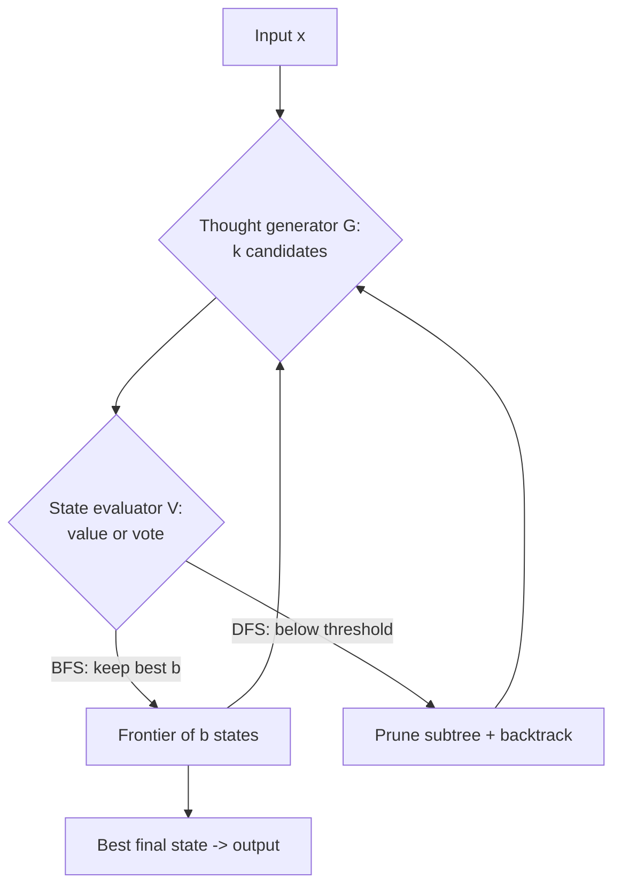

# Tree of Thoughts: Deliberate Problem Solving with Large Language Models — Summary

> [!NOTE]
> **Source:** [2305.10601-tree-of-thoughts.pdf](../../sources/arXiv/2305.10601-tree-of-thoughts.pdf) · Shunyu Yao, Dian Yu, Jeffrey Zhao, Izhak Shafran, Thomas L. Griffiths, Yuan Cao, Karthik Narasimhan (Princeton University & Google DeepMind), 2023 · NeurIPS 2023, arXiv:2305.10601v2 · Code: <https://github.com/princeton-nlp/tree-of-thought-llm>.
> Study-guide summary of the full document. See the original for exact wording and figures.

## Abstract

Tree of Thoughts (ToT) is an LLM inference framework that generalises Chain-of-Thought (CoT) prompting: instead of decoding one left-to-right reasoning chain, the model maintains a *tree* of coherent intermediate "thoughts," self-evaluates partial solutions as search heuristics, and uses classical search (BFS/DFS) to branch, look ahead, and backtrack toward a global solution. Across three tasks built to defeat GPT-4 with standard prompting, ToT sharply outperforms IO and CoT — most strikingly lifting Game of 24 success from 4% (CoT) to 74% (ToT).

**Key points**

- **The problem with CoT:** LLMs make token-level, left-to-right decisions ("System 1"), so they cannot locally explore alternative continuations within a reasoning step, nor globally plan, look ahead, or backtrack. In Game of 24, ~60% of CoT samples already fail after the *first* of three steps.
- **The ToT idea:** frame a problem as search over a tree where each node is a state `s = [x, z_1...i]` (input + thoughts so far). A "thought" is a coherent language unit sized so the LM can both *generate* diverse candidates and *evaluate* their promise. Search heuristics come from the LM's own deliberate self-evaluation — a third option beyond programmed (DeepBlue) or learned (AlphaGo) heuristics.
- **Four design choices** instantiate any ToT: (1) thought decomposition, (2) thought generator (sample i.i.d. vs. propose sequentially), (3) state evaluator (value each state vs. vote across states), (4) search algorithm (BFS vs. DFS).
- **Headline result — Game of 24:** IO 7.3%, CoT 4.0%, CoT-SC (k=100) 9.0%, **ToT (b=1) 45%, ToT (b=5) 74%**. Even best-of-100 CoT reaches only 49%, still far below ToT with b>1.
- **Creative Writing:** ToT scores 7.56 GPT-4 coherency vs CoT 6.93 / IO 6.19; humans prefer ToT over CoT in 41/100 pairs vs 21/100 the other way.
- **Mini Crosswords (5×5):** ToT reaches 60% word-level success and solves 4/20 games, vs CoT ~15.6% words and 1/20 games. Ablations show pruning and backtracking both matter (removing backtracking drops words to 20%).

**Takeaways**

- Adding a deliberate "System 2" search layer *on top of an unmodified pre-trained LM* — no fine-tuning — unlocks planning/search abilities that pure autoregressive decoding lacks. IO, CoT, CoT-SC, and self-refinement are all special cases of ToT (trees of limited depth/breadth).
- The cost is compute: ToT can use 5–100× more generated tokens than CoT. In Game of 24 one ToT solve (~5.5k completion tokens, $0.74/case) is comparable in token budget to 100 CoT trials but beats best-of-100 CoT (49% → 74%). Reserve ToT for tasks where CoT genuinely struggles.
- The framework is general, modular, adaptable, and training-free — the base LM, decomposition, generation, evaluation, and search can each be swapped independently, letting users tune the performance–cost tradeoff (beam size, votes, GPT-3.5 vs GPT-4, few- vs zero-shot).

## 1. Introduction

Scaled-up LMs (GPT, PaLM) handle mathematical, symbolic, commonsense, and knowledge reasoning, yet underneath sits the original **autoregressive mechanism**: token-level decisions made one at a time, left to right. The paper asks whether this is sufficient for a general problem solver, and what alternative mechanisms might help.

- **Cognitive-science framing.** "Dual process" theory distinguishes a fast, automatic, unconscious **System 1** from a slow, deliberate, conscious **System 2**. LMs' associative token-level choices resemble System 1; they might benefit from a System 2 planning process that (1) maintains and explores diverse alternatives instead of picking one, and (2) evaluates current status and actively looks ahead or backtracks to make global decisions.
- **Classical-AI framing.** Drawing on Newell, Shaw & Simon (1950s), problem solving is characterised as **search through a combinatorial problem space represented as a tree** — nodes are partial solutions, branches are operators, heuristics choose branches.
- **The ToT proposal.** Maintain a tree of thoughts (each a coherent language sequence = an intermediate step). The LM self-evaluates the progress of intermediate thoughts through deliberate reasoning that is itself expressed in language. This LM-self-evaluation-as-search-heuristic is novel (prior heuristics are programmed or learned). Combine it with search algorithms (BFS/DFS) for systematic exploration with lookahead and backtracking.
- **Three new benchmark tasks** that challenge even GPT-4 under IO/CoT prompting: **Game of 24, Creative Writing, Mini Crosswords** — requiring deductive, mathematical, commonsense, and lexical reasoning plus systematic planning/search.

> [!IMPORTANT]
> Central thesis: the associative "System 1" of LMs can be beneficially augmented by a "System 2" that searches a tree of possible solution paths, translating classical problem-solving insights into methods for modern LMs — with no extra training required.

## 2. Background

Notation: `p_θ` is a pre-trained LM with parameters θ; lowercase `x, y, z, s` are language sequences; uppercase `S` a collection of sequences.

| Method | Formulation | What it does | Limitation |
|---|---|---|---|
| **Input-output (IO) prompting** | `y ~ p_θ^IO(y|x)` | Wraps input with instructions / few-shot examples, maps input directly to output. | No intermediate reasoning. |
| **Chain-of-thought (CoT)** | `[z_1...n, y] ~ p_θ^CoT(z_1...n, y | x)` | Inserts a chain of intermediate thoughts `z_i` to bridge hard input→output mappings; sampled as one continuous sequence. | Decomposition of thoughts is left ambiguous; single chain, no branching. |
| **Self-consistency w/ CoT (CoT-SC)** | sample k i.i.d. chains, return `arg max_y #{i \| y^(i)=y}` | Ensembles k chains and returns the most frequent answer; more robust because there are many valid thought processes. | No *local* exploration within a chain; "most frequent" only works when the output space is small (e.g. multi-choice QA). |

## 3. Tree of Thoughts: Deliberate Problem Solving with LM

> "A genuine problem-solving process involves the repeated use of available information to initiate exploration, which discloses, in turn, more information until a way to attain the solution is finally discovered." — Newell et al.

Two key shortcomings of existing LM approaches, framed as tree search:
1. **Locally**, they do not explore different continuations within a thought process (the branches of the tree).
2. **Globally**, they incorporate no planning, lookahead, or backtracking to evaluate options — the heuristic-guided search characteristic of human problem-solving.

ToT frames any problem as search over a tree, each node a state `s = [x, z_1...i]` (a partial solution). A specific ToT instantiation answers **four questions**:

### 3.1 Thought decomposition

CoT samples thoughts coherently without explicit decomposition; ToT uses problem structure to design intermediate steps. A thought should be **"small" enough** that the LM produces promising, diverse samples (a whole book is too big to be coherent) yet **"big" enough** to be evaluable (a single token is too small to judge). Examples: a few words (Crosswords), a line of equation (Game of 24), a paragraph writing plan (Creative Writing).

### 3.2 Thought generator `G(p_θ, s, k)` — how to produce k next-step candidates

- **(a) Sample i.i.d. from a CoT prompt:** `z^(j) ~ p_θ^CoT(z_{i+1} | s)`. Best when the thought space is rich (e.g. a paragraph), where i.i.d. sampling yields diversity. *Used for Creative Writing.*
- **(b) Propose sequentially via a "propose prompt":** `[z^(1),...,z^(k)] ~ p_θ^propose(z_{i+1}^{1...k} | s)`. Best when the thought space is constrained (a word or a line), so proposing in one context avoids duplicates. *Used for Game of 24 and Crosswords.*

### 3.3 State evaluator `V(p_θ, S)` — LM as heuristic

Instead of programmed heuristics (DeepBlue) or learned ones (AlphaGo), use the LM to deliberately reason about states — more flexible than rules, more sample-efficient than learned models. Two strategies:

- **(a) Value each state independently:** `V(p_θ,S)(s) ~ p_θ^value(v|s)` — a value prompt emits a scalar (e.g. 1–10) or a class (sure/likely/impossible). Evaluation can use **few lookahead simulations** (e.g. confirm 5,5,14 → 24 via 5+5+14) plus **commonsense** (e.g. "1 2 3 are too small to reach 24"; "no word starts with tzxc"). Valuations need only be approximately helpful.
- **(b) Vote across states:** `V(p_θ,S)(s)=1[s=s*]`, where a "good" state `s*` is voted out by comparing states in a vote prompt. Natural when success is hard to value directly (e.g. passage coherency) — a step-wise self-consistency: cast "which state to explore" as a multi-choice QA.

Either strategy can be prompted multiple times to aggregate for more robust heuristics (trading cost for reliability).

### 3.4 Search algorithm

The paper uses two simple algorithms (leaving A*, MCTS to future work):

- **BFS (Algorithm 1):** keep the `b` most promising states per step. Used for Game of 24 and Creative Writing (shallow trees, T ≤ 3; b ≤ 5).
- **DFS (Algorithm 2):** explore the most promising state first until the output is reached (t > T) or the evaluator deems the state hopeless (value ≤ threshold `v_th`), at which point the subtree is **pruned** and DFS **backtracks** to the parent. Used for Crosswords.

**Four conceptual benefits of ToT:**

| Benefit | Meaning |
|---|---|
| **Generality** | IO, CoT, CoT-SC, and self-refinement are special cases (trees of limited depth/breadth). |
| **Modularity** | Base LM, decomposition, generation, evaluation, search each varied independently. |
| **Adaptability** | Accommodates different problem properties, LM capabilities, resource constraints. |
| **Convenience** | No extra training — a pre-trained LM suffices. |

## 4. Experiments

Three tasks hard for GPT-4 under IO/CoT. Default: Chat Completion GPT-4, sampling temperature 0.7 (experiments run May 5–16, 2023).

**Task overview (Table 1)**

| | Game of 24 | Creative Writing | 5×5 Crosswords |
|---|---|---|---|
| **Input** | 4 numbers (e.g. 4 9 10 13) | 4 random sentences | 10 clues (5 horizontal, 5 vertical) |
| **Output** | Equation reaching 24, e.g. `(13-9)*(10-4)=24` | 4-paragraph passage ending in the 4 given sentences | 5×5 = 25 letters |
| **Thoughts** | 3 intermediate equations | A short writing plan | Words to fill per clue |
| **# ToT steps** | 3 | 1 | 5–10 (variable) |

### 4.1 Game of 24

Goal: use 4 numbers with +−*/ to make 24. Data scraped from 4nums.com (1,362 games sorted easy→hard); test set is the *hard* games indexed 901–1,000, evaluated on 100 games. Success = a valid equation equalling 24 using each input number exactly once.

- **Baselines:** IO (5 in-context examples), CoT (augmented with 3 intermediate equations), CoT-SC (majority of 100 CoT samples), and iterative-refine on an IO sample for ≤10 iterations (uses groundtruth correctness feedback).
- **ToT setup:** decompose into 3 steps (one intermediate equation each) via a shared "propose prompt"; BFS keeping best **b = 5**; evaluate each candidate as **sure/maybe/impossible** re reaching 24 (few lookahead trials + "too big/small" commonsense), sampling values 3× per thought.

**Results (Table 2)**

| Method | Success |
|---|---|
| IO prompt | 7.3% |
| CoT prompt | 4.0% |
| CoT-SC (k=100) | 9.0% |
| **ToT (b=1)** | **45%** |
| **ToT (b=5)** | **74%** |
| IO + Refine (k=10) | 27% |
| IO (best of 100) | 33% |
| CoT (best of 100) | 49% |

- **Scaling (Fig 3a):** treating IO/CoT best-of-k as visiting k bandit nodes, ToT (b>1) beats them at matched node counts. Best-of-100 CoT reaches 49% — still well below ToT.
- **Error analysis (Fig 3b):** ~60% of CoT samples fail after just the **first** step (the first three words, e.g. "4 + 9"), exposing the weakness of left-to-right decoding.

> [!TIP]
> The Game of 24 jump — **CoT 4.0% → ToT 74%** (and ToT 45% at breadth b=1) — is the paper's most citable evidence that branching + self-evaluated lookahead + pruning beats a single chain, even a best-of-100 ensemble of chains (49%).

### 4.2 Creative Writing

Input: 4 random sentences; output: a coherent 4-paragraph passage whose paragraphs end in those sentences. 100 inputs from randomwordgenerator.com; no groundtruth. Coherency judged two ways: GPT-4 zero-shot 1–10 score (5 samples averaged, avg std ≈ 0.56) and blind human pairwise comparison.

- **Baselines:** zero-shot IO and CoT (CoT first makes a brief plan, then writes); 10 samples each; plus iterative-refine (k ≤ 5).
- **ToT setup:** depth 2, one intermediate step. Generate **k=5 plans → vote (5 votes) → best plan**, then generate **k=5 passages → vote → best passage**. Breadth **b=1**. Simple zero-shot vote prompt.

**Results (Fig 5):**

| Method | GPT-4 coherency (avg of 100) |
|---|---|
| IO | 6.19 |
| CoT | 6.93 |
| **ToT** | **7.56** |
| IO + refine | 7.67 |
| ToT + refine | 7.91 |

- **Human study:** ToT preferred over CoT in **41/100** pairs; CoT over ToT in **21/100**; 38 judged "similarly coherent."
- **Iterative-refine** is effective here (IO 6.19→7.67; ToT 7.56→7.91) — the authors suggest refinement is a *third* thought-generation mode within ToT (new thoughts from refining old ones, not just i.i.d./sequential).

### 4.3 Mini Crosswords

Harder, deeper search in natural language: 5×5 grids. (Goal is *not* to beat specialised retrieval-based crossword solvers, but to probe the LM as a general self-guided problem solver.) Data from GooBix (156 games); test = 20 games (indices 1,6,…,96), 5 games for prompting. Output: 25 letters. Three success levels: correct **letters** (25/game), **words** (10/game), **games**.

- **Baselines:** IO (5 example pairs) and CoT (adds intermediate words in order h1..5, v1..5); 10 samples each.
- **ToT setup:** **DFS** keeps exploring the most promising word clue, translating filled thoughts into letter constraints, prompting a proposal prompt 5× with **confidence levels** aggregated into a sorted queue. State evaluation checks each remaining clue for possibility; if any is "impossible," the subtree is **pruned** and DFS **backtracks**. Search capped at 100 steps; deepest explored state rendered as output. Subsequent thoughts can't change already-filled words/letters (≤10 intermediate steps).

**Results & ablations (Table 3)**

| Method | Letter % | Word % | Games |
|---|---|---|---|
| IO | 38.7 | 14 | 0 |
| CoT | 40.6 | 15.6 | 1 |
| **ToT (ours)** | **78** | **60** | **4** (of 20) |
| ToT +best state (oracle) | 82.4 | 67.5 | 7 |
| ToT −prune | 65.4 | 41.5 | 5 |
| ToT −backtrack | 54.6 | 20 | 5 |

- **Oracle:** outputting the oracle best DFS state (not the heuristic best) solves **7/20**, so the output heuristic is improvable.
- **Pruning matters but is imperfect:** the evaluator sometimes prunes solved games (5×5 grids include rare/obsolete words GPT-4 misjudges, e.g. "agend"). Ablating pruning is generally worse, though it found correct solutions for 4/20 (3 unsolvable by ToT+pruning within 100 steps) — better DFS pruning heuristics are critical.
- **Backtracking matters:** removing it (greedy b=1 BFS with overwrites, ≤20 steps) drops word success to **20%**.

## 5. Related Work

- **Planning & decision making.** LMs already absorb commonsense enabling reasonable plans. ToT extends planning by considering multiple feasible plans simultaneously per step and proceeding with the most promising. Unlike RL decision-making (dedicated reward/policy models, e.g. CHAI), ToT uses the LM *itself* for value estimates. **RAP** (concurrent) treats LM reasoning as planning with an internal world model via MCTS — but on simpler tasks, and lacks ToT's modularity to swap search algorithms.
- **Self-reflection.** LMs assessing their own predictions (self-reflection; feedback from code-execution results; "critic"/review steps). "Self-eval guided decoding" is closest — tree search with stochastic-beam leaves scored by LM self-eval — but uses the PAL (thoughts-as-code) formulation, which struggles on tasks like creative writing. ToT is more versatile.
- **Program-guided LM generation.** Systematic/symbolic procedures organise LM behaviour (e.g. Schlag et al. expand search trees with retrieved paragraphs, not the LM's own thoughts, and lack reflection/voting; LLM+P delegates planning to a classical planner).
- **Classical search methods.** ToT is a modern rendition of classical search — like A* with the heuristic supplied by the LM's self-assessment; related to NeuroLogic A*esque decoding (look-ahead heuristics), which is constrained to sentence generation whereas ToT targets complex multi-step problems guarded by value feedback.

## 6. Discussion

- **Limitations / future directions.** Deliberate search may be unnecessary for tasks GPT-4 already handles; this work covers only three relatively simple challenge tasks. Real-world deployment (coding, data analysis, robotics) will surface harder tasks. ToT costs more resources (API cost) than sampling, but its modularity lets users tune performance–cost tradeoffs, and open-source efforts should cut costs. Fine-tuning LMs with ToT-style high-level counterfactual decision making (deliberating over next-paragraph choices rather than next tokens) is a promising direction.
- **Conclusion.** The associative "System 1" of LMs can be augmented by a "System 2" that searches a tree of solution paths. ToT translates classical problem-solving insights into actionable methods; conversely, LMs let these classical methods tackle problems hard to formalise (e.g. creative writing).

## Broader Impact

ToT lets LMs make decisions and solve problems more autonomously. Future applications interacting with external environments or humans could bring danger (e.g. facilitating harmful uses). Conversely, ToT improves **interpretability** and the opportunity for human alignment — its representations are readable high-level language reasoning rather than implicit low-level token values.

## Appendix B — Additional Experiments

### B.1 New tasks with zero-shot ToT (GSM8K, StrategyQA)

A generic zero-shot ToT-BFS (sample 5 strategies → vote → sample 5 solutions → vote) added in a few lines of code. On 100 random questions each (Table 4): improvements over CoT are only slight because GPT-4+CoT is already strong (and StrategyQA's bottleneck is external knowledge, not reasoning).

| | GSM8K | StrategyQA |
|---|---|---|
| IO | 51 | 73 |
| CoT | 86 | 82 |
| ToT | 90 | 83 |

### B.2 New LMs (GPT-3.5)

"ToT > CoT > IO" holds for GPT-3.5 too.

- **Game of 24 (Table 5):** GPT-3.5 — IO 6%, CoT 3%, ToT 19% (far below GPT-4+ToT's 74%; used 3-shot proposal). Mixing models: GPT-4 generation + GPT-3.5 evaluation = **64%**; GPT-3.5 generation + GPT-4 evaluation = **31%** → the bottleneck is **thought generation**, not evaluation.
- **Creative Writing (Table 6):** GPT-3.5 — IO 4.47, CoT 5.16, ToT 6.62. GPT-3.5+ToT outperforms GPT-4+IO and is similar to GPT-4+CoT — ToT helps weaker models too.

### B.3 Cost and efficiency

ToT needs far more compute (5–100× more generated tokens than CoT).

**Game of 24 (Table 7):**

| | Generate/Prompt tokens | Cost per case | Success |
|---|---|---|---|
| IO (best of 100) | 1.8k / 1.0k | $0.13 | 33% |
| CoT (best of 100) | 6.7k / 2.2k | $0.47 | 49% |
| **ToT** | 5.5k / 1.4k | $0.74 | **74%** |

ToT's ~5.5k completion tokens are close to 100 CoT trials (6.7k) yet beat best-of-100 CoT. **Creative Writing (Table 8):** ToT uses ~5× the tokens/cost of IO/CoT ($0.32 vs ~$0.06–0.07). The full Game of 24 + Creative Writing main experiments cost ~$106; Crosswords DFS also under $100.

**Actionable insights:** use ToT where CoT struggles; tune the performance–cost tradeoff (beam size, vote number, few- vs zero-shot, GPT-3.5 vs GPT-4); improve efficiency (BFS early-stop on solution, trim beam when thoughts are "impossible"); more computation likely required for stronger intelligence, and (open-source) LMs will get cheaper.
