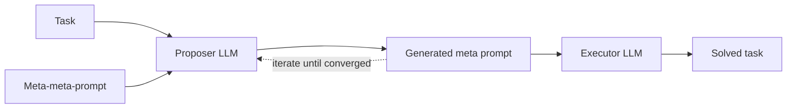

# Meta Prompting for AI Systems — Summary

> [!NOTE]
> **Source:** [2311.11482-meta-prompting.pdf](../../sources/arXiv/2311.11482-meta-prompting.pdf) · Zhang, Y., Yuan, Y., & Yao, A. C.-C. (2023). *Meta prompting for AI systems*. arXiv:2311.11482 (v9, Dec 2025) · https://arxiv.org/abs/2311.11482 · IIIS Tsinghua University & Shanghai Qi Zhi Institute.
> Study-guide summary of the full document. See the original for exact wording and figures.

## Abstract

Introduces **Meta Prompting (MP)**: a structure-oriented prompting paradigm that gives an LLM the *formal structure* of a problem and its solution — a typed, example-agnostic template for **how to think** — instead of the content-rich examples of few-shot prompting (**what has been thought**). The paper formalises MP with category theory and extends it to **Recursive Meta Prompting (RMP)**, where the model generates and refines its own prompts.

**Key points**

- **Mechanism:** a meta-prompt is a syntactic scaffold (e.g. a JSON/Markdown/XML schema with typed slots — `Problem`, `Step 1..n`, `Final Answer`) that the model fills with task-specific content. It defines a "type signature" for the output, in the spirit of type theory.
- **Theory:** MP is formalised as a **functor** M : 𝒯 → 𝒫 from a category of tasks to a category of prompts. Functoriality (M(g∘f) = M(g)∘M(f)) guarantees *compositionality*: decompose a complex task into sub-tasks and the meta-prompt composes from the sub-prompts.
- **RMP** turns prompting inward — an LLM refines its own prompts — and is modelled as a **monad** (a Writer monad accumulating edit scripts), whose associativity law makes nested refinement order-independent (stable).
- **Headline results (Qwen-72B base, one example-free structure-only prompt, no fine-tuning, no tools):** MATH **46.3%** PASS@1 (vs 35.2% CoT; GPT-4 2023-0314 CoT was 42.5%); GSM8K **83.5%** (vs 78.9% CoT); Game of 24 **100%** success over all 1,362 puzzles at ≈$0.0003 per case (ToT: 74% at $0.74).
- The experiment meta-prompts were themselves generated by RMP from a single task-agnostic **meta-meta-prompt** (MP-ICPD: in-context prompt design from an input document).

**Takeaways**

- Structure beats examples for token economy: a schema is far shorter than worked examples, and batching amortises to ~1/N API calls per instance.
- MP is a form of zero-shot prompting — no example bias, fairer model comparison.
- MP is orthogonal to ToT/GoT-style topologies (it defines node structure, they define macro search) and complementary to code-first PoT (structure-first vs execution-first).
- Authors flag results as proof-of-concept: sensitivity to template, recursion depth, and model scale is untested.

## 1 Introduction

- LLMs still struggle with deep abstract reasoning (advanced mathematics); their auto-regressive token prediction resembles **System 1** (fast, intuitive) in Kahneman's dual-process theory, not the deliberate **System 2** that multi-step reasoning demands.
- CoT (Wei et al., 2022) and ToT (Yao et al., 2023) push toward deliberation but rely on content-based examples and lack a formal, compositional structure.
- **Meta Prompting (MP)** shifts from content-based analogy to *formal procedural guidance*: not examples of what to think, but a structured template for how to think.
- **Recursive Meta Prompting (RMP)** applies MP to itself — analogous to metaprogramming — letting a model generate and refine its own prompts.
- Contributions: (1) MP formalised as a structure-preserving functor with a compositionality proposition; RMP as a monad; (2) proof-of-concept experiments — Qwen-72B base with a single example-agnostic meta-prompt reaches 46.3% on MATH, 83.5% on GSM8K, 100% on Game of 24, with substantial token-efficiency gains.
- Figures 1–3 contrast a JSON structure meta-prompt and a Markdown meta-prompt (the Minerva-style MATH template) with the standard content-rich few-shot MATH prompt.

## 2 Background

Category theory as the formal language relating task structures to prompt structures:

| Concept | Definition (as used) |
|---|---|
| **Category** | Objects plus morphisms Hom(A, B) between them; associative composition; identity morphisms |
| **Functor** | Structure-preserving map between categories: maps objects and morphisms, preserving identity and composition |
| **Contravariant functor** | Same but reverses morphism direction |
| **Natural transformation** | Family of morphisms between two functors making the relevant diagrams commute (used for the RMP monad's η and µ) |
| **Monad** | Triple (T, η, µ): endofunctor T, unit η : Id → T, multiplication µ : T∘T → T, satisfying associativity and identity laws; models computations with effects (state, I/O, recursive prompt refinement) |

## 3 Meta Prompting

> [!IMPORTANT]
> **Definition 3.1 (Meta Prompt):** an *example-agnostic structured prompt* capturing the reasoning structure of a category of tasks — a scaffold outlining the general approach, which the LLM fills with task-specific detail. It targets the procedural *how*, not the content *what*.

- Analogy to **type theory**: each prompt component gets a "type" (`ProblemStatement: string`, `ReasoningStep: list[string]`, `FinalAnswer: float`); the meta-prompt is a type signature for the desired output, enforcing syntactic as well as semantic correctness.

### 3.1 Formalising Meta Prompting

- **Category of tasks 𝒯**: objects are tasks/problems; morphisms are methodologies/reductions relating one problem to another.
- **Category of prompts 𝒫**: objects are structured prompts; morphisms are adaptations/refinements of one prompt into another.
- **Meta Prompting Functor M : 𝒯 → 𝒫** — maps each task X to a structured prompt M(X), and each task reduction f : X → Y to a prompt transformation M(f) : M(X) → M(Y), preserving composition and identities.
- **Proposition 3.4 (Compositionality):** M(g∘f) = M(g)∘M(f) — a composite task-reduction strategy compiles to the composition of the individual prompt transformations. Holds by construction: prompt morphisms are typed instruction sequences whose composition is concatenation. Guarantees modular, reusable prompt structures and principled problem decomposition.
- **Compiler view:** tasks ≙ typed schemas; morphisms ≙ schema-preserving edits; a reduction like parse → compute compiles to a modular prompt whose sections compose in the same order.
- Worked example (Fig. 4): a quadratic-equation meta-prompt with steps — identify coefficients, compute discriminant ∆ = b²−4ac, branch on ∆'s sign, apply the appropriate root formula — that guides any instance regardless of coefficients.

### 3.2 Distinctions from Few-Shot Prompting

| | Few-shot prompting | Meta Prompting |
|---|---|---|
| Provides | Concrete, content-rich (problem, solution) pairs | One content-agnostic structural template |
| Guides via | In-context analogy | Formal procedural structure |
| Teaches | *What has been thought* | *How to think* |

- Also distinct from programmatic frameworks (XML-tag styles, DSPy): those are programming layers that compile into traditional few/zero-shot prompts, whereas MP is the direct, example-agnostic mapping between a task's abstract structure and a prompt's syntactic structure.

### 3.3 Meta Prompting for Complex Reasoning

- Typed, structured prompts help models parse symbolic information and align with code environments (understanding, modifying, executing code) — the basis for the **MP-CR** (Meta Prompting for Complex Reasoning) agent used in the experiments (illustrated in Fig. 9: problem → preliminary content → hints → intermediate question/answer-sketch/code/output/answer loops → final verified solution in a LaTeX box).

### 3.4 Advantages of Meta Prompting

- **Token efficiency** — structure over exhaustive content sharply cuts token counts; vital under token limits.
- **Fair comparison / zero-shot efficacy** — MP is a form of zero-shot prompting; minimising example influence removes example-based bias and allows more equitable comparison across models.

## 4 Recursive Meta Prompting (RMP)

- RMP turns prompting inward: meta-prompts generate and refine other prompts — the LLM constructs and enhances its own guiding instructions, mirroring **metaprogramming**.
- **Workflow (Fig. 6 / Algorithm 1):**

- Algorithm 1: start from an initial prompt for task T₀; repeatedly apply the LLM under the meta-meta-prompt to refine the prompt until convergence (or N_max iterations); solve T₀ with the final prompt.

### 4.1 A Monadic Framework for Prompt Refinement

- RMP formalised as a monad (T, η, µ) on 𝒫 using a **Writer monad**: Σ is a monoid of valid edit scripts (concatenation ·, empty script e).
  - **Endofunctor** T(P) = P × Σ — a prompt paired with its edit history.
  - **Unit** η(P) = (P, e) — lift a prompt with empty refinement history.
  - **Multiplication** µ((P, s₁), s₂) = (P, s₁·s₂) — flatten nested meta-reasoning by concatenating edit scripts.
- **Proposition 4.1 (Algebraic consistency/stability):** monad associativity — inherited from monoid associativity (s₁·s₂)·s₃ = s₁·(s₂·s₃) — makes the collapsing of nested refinement layers *path-independent*: the cumulative edit script is unique regardless of flattening order.
- Iterative loop: LLM(µ(MP(η(T_unsolved)))) → T_solved.
- **Computational cost:** RMP's refinement is a one-time offline cost amortised across all downstream instances; inference is a single API call with a compact reusable meta-prompt — contrast with per-instance exploration in tree/graph-of-thought methods.

### 4.2 Case Study: Automatic Prompt Derivation (in-context Meta Prompting)

- **MP-ICPD** (Meta Prompting for In-Context Prompt Design, Fig. 7): a meta-meta-prompt instructing an LLM to (1) analyse a complex input document (possibly the prompt itself), (2) interpret the core task, (3) design a new structured prompt, (4) optionally propose a solution strategy. This self-referential loop is the practical route by which the paper's experiment prompts were generated.

## 5 Experiments

### 5.1 MATH and GSM8K

- **Setup:** MATH (5,000 competition-level problems), GSM8K (1,319 grade-school problems); Qwen-14B and Qwen-72B *base* models via vLLM; both benchmark prompts generated by RMP from one task-agnostic meta-meta-prompt (Markdown meta-prompt of Fig. 2 for MATH, JSON meta-prompt of Fig. 1 for GSM8K); rule-based evaluation with SymPy equivalence; binomial 95% CIs.
- **Results:** Qwen-72B base with the example-free, structure-only prompt: **MATH 46.3%** PASS@1 (95% CI [44.9, 47.7], n=5000); **GSM8K 83.5%** (95% CI [81.5, 85.5], n=1319). Framed as proof-of-concept under one template.

Table 1 (MATH PASS@1, no tools), essential rows:

| Model | Method | MATH (%) |
|---|---|---|
| Claude-2 | CoT | 32.5 |
| Minerva-540B | CoT | 33.6 |
| PaLM-2 | CoT | 34.3 |
| GPT-4 (2023-0314) | CoT | 42.5 |
| Qwen-14B (base) | CoT | 24.8 |
| Qwen-14B (base) | **MP** | **28.9** |
| Qwen-72B (base) | CoT | 35.2 |
| Qwen-72B-MetaMathQA (fine-tuned) | CoT | 41.7 |
| Qwen-72B (base) | **MP** | **46.3** |

Table 2 (GSM8K PASS@1, no tools), essential rows:

| Model | Method | GSM8K (%) |
|---|---|---|
| Qwen-14B (base) | CoT | 61.3 |
| Qwen-14B (base) | **MP** | **64.8** |
| WizardMath-70B (fine-tuned) | CoT | 81.6 |
| MetaMath-70B (fine-tuned) | CoT | 82.3 |
| Qwen-72B (base) | CoT | 78.9 |
| Qwen-72B (base) | **MP** | **83.5** |

### 5.2 Game of 24

- Task: combine four numbers with +, −, ×, ÷ to make 24. The **MP-CR Agent** (OpenAI Assistant API) autonomously generated a Python program that batch-solved *all* 1,362 puzzles in a single response.
- **Results:** 100% success on all 1,362 samples; average 0.08 s per sample; amortised ≈5.9 generated + 0.73 prompt tokens per case (8k/1k tokens for the whole batch).

Table 3 (Game of 24 comparison):

| Method | API calls | Generate/prompt tokens | Cost (USD)/case | Success |
|---|---|---|---|---|
| IO (best of 100) | 100 | 1.8k / 1.0k | $0.13 | 33% |
| CoT (best of 100) | 100 | 6.7k / 2.2k | $0.47 | 49% |
| ToT | 61.72 | 5.5k / 1.4k | $0.74 | 74% |
| **MP** | **1/N** | **≈1/N (8k / 1k)** | **≈$0.0003** | **100%** |

## 6 Related Work

- **Reasoning with AI systems:** prior work on intermediate reasoning steps and symbolic augmentation (code environments, knowledge graphs) is content-driven; MP shifts to a structural/formal treatment.
- **CoT lineage:** Self-Consistency, Complex CoT, Least-to-Most, Decomposed Prompting, multi-agent debate, verifier-based paths, progressive refinement, self-correction — all improve the *semantic content* of reasoning chains and often depend on complex few-shot examples; MP is example-agnostic and operates on the prompt's formal syntactic structure.
- **Structured/graph frameworks:** ToT, Cumulative Reasoning (CR), Graph-of-Thoughts (GoT), Diagram-of-Thought (DoT), Forest-of-Thoughts (FoT) define the *macro-level topology* of reasoning; MP is orthogonal and complementary — it gives a categorical language for the *micro-level structure* of nodes and compositional rules for edges.

## 7 Conclusion

- MP prioritises the formal structure of reasoning over content, with a categorical foundation (functor; RMP as monad under explicit assumptions); empirically competitive on hard maths benchmarks in an example-free setting with major token savings.
- Points toward moving from empirical prompt engineering to a "formal, programmatic science of prompt design", and toward LLMs that autonomously improve their own cognitive strategies.

## Appendices

### A Theoretical Foundations

- **A.1 Type theory:** typed λ-calculus / Martin-Löf intuitionistic type theory (underpinning Coq and Lean); every term has a type; computation as syntactic rewriting — the natural language for structured, computational meta-prompts.
- **A.2 / A.4 Proofs:** Prop. 3.4 follows from the functor axioms (composition preservation is definitional); Prop. 4.1 follows from the monad associativity law (commutative diagrams supplied).
- **A.5 Assumptions for the RMP monad:** typed prompts (records with problem/steps/answer fields); refinements as schema-preserving edit scripts (composition = concatenation + normalisation); confluent, terminating normalisation (unique normal form); equality is schema-level observational equivalence, *not* semantic accuracy.

### B Additional Prompt Examples

- Fig. 8: a generic system meta-prompt for reasoning tasks; Fig. 9: the full MP-CR complex-reasoning template (problem → preliminaries → hints → question/answer-sketch/code/output/answer sequences → verified final solution); Fig. 10: a "prompt simplification" meta-prompt.

### C Additional Experimental Details

- Game of 24: the MP-CR agent's generated Python enumerates permutations/operations exactly (Fig. 12); initial accuracy could be raised further via self-consistency, self-critique and reflection (Reflexion). Fig. 13 shows an MP-CR Assistant run on a MATH divisor problem (d(196) = 9). Figs. 14–15: XML-schema and system meta-prompts for MP-CR, the XML variant autonomously generated by the earlier agent version (metaprogramming in practice).

### D Reproducibility

- Verbatim artifacts released (meta-meta-prompt, task descriptors, RMP-generated meta-prompts for MATH/GSM8K/24-game, baseline CoT prompts), plus decoding parameters, vLLM/hardware details, and SymPy-based evaluator code.

### E Limitations and Scope

> [!WARNING]
> Experiments are proof-of-concept. The authors do **not** claim monotone accuracy gains with recursion or universality across tasks/models. Sensitivity to meta-prompt templates, recursion depth, proposer/executor swaps, and model scale (including reasoning-tuned models such as DeepSeek-R1) is left for future work. Evaluation is limited to maths/problem-solving benchmarks; RMP's benefit accrues mainly when prompts are reused across many instances (batched settings).

- **vs Program-of-Thought (PoT):** PoT is code-first (grounds reasoning in explicit execution); MP is structure-first (typed schemas, no mandated execution). Complementary: PoT wins when execution is cheap and available; MP wins under tight token budgets where structural/type guarantees drive reliability. Hybrid schema-first-plus-tools designs are promising.

### F Multi-Modal Meta Prompting

- The type-theoretic structure extends to multi-modal settings: a meta-prompt schema defines typed input "slots" for different data streams (e.g. `image/png` diagram, `audio/mp3` instructions, `model/obj` 3D model) and typed output slots (Fig. 17), enabling consistent cross-modal synthesis and tool interaction.
