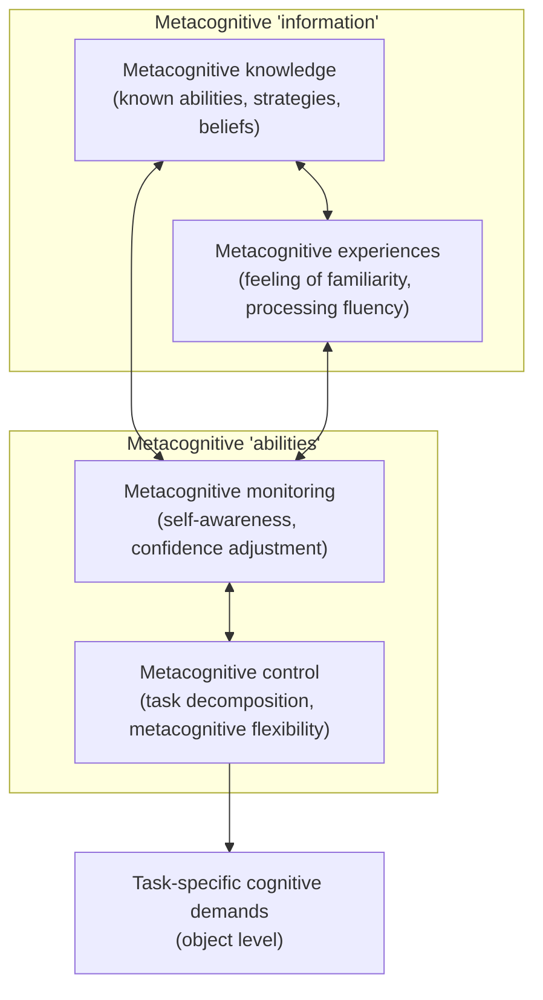
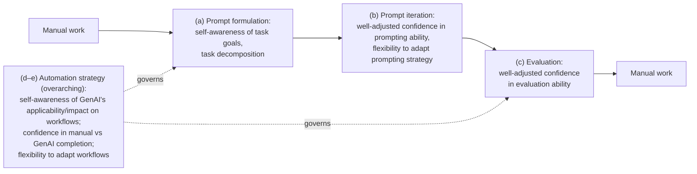

# The Metacognitive Demands and Opportunities of Generative AI — Summary

> [!NOTE]
> **Source:** [2312.10893-metacognitive-demands-genai.pdf](../../sources/arXiv/2312.10893-metacognitive-demands-genai.pdf) · Lev Tankelevitch, Viktor Kewenig, Auste Simkute, Ava Elizabeth Scott, Advait Sarkar, Abigail Sellen & Sean Rintel (Microsoft Research Cambridge / UCL / University of Edinburgh), 2024 · CHI '24, Honolulu · [doi:10.1145/3613904.3642902](https://doi.org/10.1145/3613904.3642902) · [arXiv:2312.10893](https://arxiv.org/abs/2312.10893).
> Study-guide summary of the full document. See the original for exact wording and figures.

## Abstract

A framework/synthesis paper arguing that **metacognition** — the psychological ability to monitor and control one's own thoughts and behaviour — is the missing theoretical lens for understanding why generative AI (GenAI) is hard to use. Drawing on psychology and cognitive-science research and recent GenAI user studies (it synthesises existing evidence rather than reporting new experiments), the authors show that GenAI's distinctive properties — model flexibility, generality, originality, and non-determinism — impose unusually high metacognitive demands on users, and propose two complementary design responses.

**Key points**

- Working with GenAI parallels a **manager delegating to a team**: one must know one's goals, decompose them into communicable tasks, assess output quality with well-adjusted confidence, and decide whether/when/how to delegate at all.
- **Three loci of metacognitive demand:** (1) *prompting* — verbalised prompting demands self-awareness of task goals (intentions that stay implicit in manual work must be made explicit) and task decomposition, then prompt iteration demands well-adjusted confidence in one's prompting ability and metacognitive flexibility; (2) *evaluating and relying on outputs* — user self-confidence, not confidence in the AI, is the key determinant of reliance, and GenAI uniquely stresses confidence adjustment via extensive outputs, effortless generation (misleading "processing fluency" cues), multiple non-intuitive failure modes, and scarce objective quality measures; (3) *automation strategy* — a higher-level demand to understand and adapt one's workflows: whether, when, and how to integrate GenAI at all ("critical integration").
- Illustrative synthesised evidence: novice prompters "don't even know what I want the computer to do"; experts prompt "as precisely as I would for a stupid collaborator"; users avoided effective prompt designs even after demonstration (low metacognitive flexibility); only ~20–30% of Copilot suggestions are accepted; 26% of surveyed programmers cite distraction and 38% cite debugging time as 'very important' reasons to avoid such tools.
- **Design opportunities**, two complementary directions: *improve users' metacognition* by embedding evidence-based support strategies into GenAI systems (planning — e.g. prompt chaining, feedforward; self-evaluation — reflective probes, 'not sure' options; self-management — context-aware timing, adaptive complexity), and *reduce the system's metacognitive demand* via task-appropriate explainability (offloading metacognitive processing onto the interface) and calibrated customizability.
- Metacognitive demand is distinguished from **cognitive load**; interventions may add load short-term, but the authors hypothesise a net reduction (and net quality gain), aided by adaptively fading prompts out — and they defend some 'seamful' friction against the "doctrine of simplicity".

**Takeaways**

- GenAI usability problems are not (only) interface problems: they are demands on users' self-awareness, confidence calibration, task decomposition, and strategic flexibility — so fixes must target the user's thinking about their own thinking, not just the model.
- The framework gives designers a vocabulary and a research agenda (two tables of open questions) for building systems that act, in Alan Kay's phrase, as "guide, as coach, and as amanuensis".

## 1 Introduction

- GenAI systems (LLM-based generators) promise to transform work through a unique combination of **model flexibility** (input/output space), **generality** (applicability across tasks), and **originality** (novel content generation) — but the same properties create usability challenges around prompting, evaluating/relying on outputs, and deciding on an automation strategy.
- There is no coherent, cognition-grounded account of these challenges; the paper argues **metacognition** — monitoring and controlling one's own thought processes — supplies one.
- **Manager analogy:** delegating to GenAI, like delegating to a team, requires clearly formulating goals, breaking them into communicable tasks, confidently assessing output quality, adjusting plans, and deciding whether/when/how to delegate in the first place.
- A footnote scopes the argument: search engines also tax metacognition, but GenAI is relevantly distinct — more flexible in responsiveness and parameters, general-purpose (generates/discriminates/edits rather than retrieves), and **non-deterministic**.
- Three stated contributions: (1) ground GenAI usability challenges in metacognition research plus GenAI user studies; (2) propose two directions — improving users' metacognition and reducing GenAI's metacognitive demand; (3) identify concrete research and design directions.

## 2 What is metacognition?

- Popularised by developmental psychologist **John H. Flavell** (late 1970s). **Nelson and Narens'** 'metacognitive model' distinguished **object-level** cognition (perceiving, remembering, deciding) from **meta-level** processes that monitor object-level functioning (e.g. assessing how well one grasped a text) and allocate resources (e.g. deciding to re-read).
- Improved metacognition is linked to better time/focus/effort management, problem-solving, academic performance, emotional well-being, and decision-making. HCI has mostly confined metacognition to computer-science education, partly because of a "confusing plethora" of overlapping frameworks across education, management, healthcare, and sports.

### 2.1 Metacognitive knowledge and experiences

- **Metacognitive knowledge** — explicit, conscious understanding of one's strategies, reasoning abilities, decision-making, beliefs.
- **Metacognitive experiences** — directly experienced, often implicit: feelings of familiarity or misunderstanding, and implicit cues like **'processing fluency'** (e.g. how quickly a memory is retrieved).
- The two interrelate: experiences become encoded as knowledge (repeated difficulty → "I'm poor at problem-solving"); knowledge is retrieved during experiences.

### 2.2 Metacognitive abilities: monitoring and control

The paper's simplified framework (its Figure 1) pairs two kinds of "information" (knowledge, experiences) with two kinds of "abilities":

| Ability | Type | Definition | Where GenAI demands it |
|---|---|---|---|
| **Self-awareness** | Monitoring | Recognising one's own thoughts, emotions, actions, and goals ("What am I trying to convey with this email?") | Prompting (§3.1), automation strategy (§3.3) |
| **Confidence and its adjustment** | Monitoring | Self-assessment of one's abilities; 'well-adjusted' confidence distinguishes correct from incorrect performance and matches actual ability | Prompting, output evaluation, automation strategy (§3.1–3.3) |
| **Metacognitive flexibility** | Control | Adaptively shifting cognitive strategies when information, effectiveness, or task demands change | Prompt iteration (§3.1), evaluation (§3.2), workflow adaptation (§3.3) |
| **Task decomposition** | Control | Breaking a task into concrete, actionable sub-tasks (partly object-level too) | Prompt formulation (§3.1) |

> [!NOTE]
> A footnote distinguishes two formally independent aspects of confidence: **resolution** (sensitivity — do confidence judgments discriminate correct from incorrect performance?) and **calibration** (bias — is confidence overall higher or lower than objective performance?). One can be well calibrated on average yet have poor resolution.

Monitoring and control are interrelated: assessing performance influences strategy change, and changed strategies feed back into assessment.

### 2.3 Interrelationship between knowledge/experiences and monitoring/control

All four elements influence each other — e.g. knowledge of one's strategies' weaknesses affects confidence adjustment; a felt sense of misunderstanding lowers confidence (monitoring) and triggers re-reading (control); better monitors are more attuned to their metacognitive experiences.

### 2.4 Domain generality and specificity

Whether metacognition is domain-general or domain-specific is actively debated, with evidence for both; what a situation demands is likely context-dependent — especially relevant given GenAI's cross-domain generality.

### 2.5 Heuristics and priming metacognition

People implicitly rely on heuristics such as **processing fluency**: fluently processed information triggers less further processing. Because fluency is experienced rather than known, it is a metacognitive experience. Manipulating it works — e.g. a degraded font increases subjective processing difficulty, stimulating more metacognitive control and improving performance on reasoning tasks that reward analytic processing.

### 2.6 Improving metacognition

Metacognitive abilities **can be taught**: feedback-based training improves judgment accuracy; other interventions adjust task-specific mental models or use guided reflection to improve discernment of output reliability. This grounds §4.1.

### 2.7 Measuring metacognition

Table 1 of the paper catalogues prospective and retrospective measures per ability — e.g. think-aloud, self-report, and prediction logs for self-awareness; judgments of learning, confidence self-ratings (with confidence–accuracy correlation estimating calibration, and **meta-d'** capturing resolution) for confidence; expectancy questionnaires and SRL (self-regulated learning) microanalysis for task decomposition; task switching, category fluency, post-task debriefs, and error analysis for metacognitive flexibility.

## 3 The metacognitive demands of generative AI

The core claim: across domains (programming, design, writing, data science), a common dimension of GenAI-driven change is greater demand on users' metacognition when they must (a) prompt, (b) evaluate and rely on output, and (c) decide their **workflow automation strategy** (whether/how to automate — previously termed "critical integration").

> [!IMPORTANT]
> **Metacognitive demand ≠ cognitive load.** Metacognitive demand is the need for extensive metacognitive monitoring and control; cognitive load is the total mental effort of a task. Metacognitive demand contributes to load but is sufficient, not necessary, for it (typing rather than speaking raises load with little metacognitive demand).

The paper's Figure 2 lays the demands along a simplified workflow:

Not all GenAI systems impose the same demands — automated-suggestion systems like GitHub Copilot relieve prompting demands but raise others (see §3.2, §3.3).

### 3.1 Prompting generative AI systems

End-user studies show prompting is hard, with non-experts making errors and adopting ineffective strategies — read here as a demand on metacognitive monitoring and control, exacerbated by GenAI's **non-determinism** and **model flexibility** (a wide range of explicit/implicit parameters; prompts accepted at a wide range of abstraction). A footnote notes prompt libraries help but rarely fit one's context precisely and still require metacognitive ability to apply.

#### 3.1.1 Prompt formulation: self-awareness and task decomposition

- In manual work, many goals stay implicit (one just *knows* to adopt a certain tone with a senior colleague). GenAI requires those intentions to be **verbalised and made explicit**, and tasks broken into sub-tasks ("combine my content", "condense into two paragraphs", "update the tone").
- Synthesised evidence:
  - Non-experts improving a chatbot via prompts struggled to get started — Zamfirescu-Pereira et al. read this as "*I don't even know what I want the computer to do*".
  - Dang et al. distinguish **diegetic** prompting (instructions implicit in the text users write) from **non-diegetic** (explicit instructions to the system); the latter is far more challenging because it "forces writers to shift from thinking about their narrative or argument to thinking about instructions to the system". The same difficulty appears in novice AI-assisted coding and in manufacturing designers who struggled to "think through the design problem in advance".
  - Experts differ precisely in explicit goal identification and decomposition: one developer's strategy — "*be incredibly specific with the instructions and write them as precisely as I would for a stupid collaborator*"; users who decomposed programming into "microtasks" worked effectively with Copilot; designers who succeeded abstracted and explained the problem to themselves.
- Diegetic prompting is easier but affords less control; non-diegetic systems (e.g. ChatGPT) are more demanding, yet their required explicitness may plausibly act as a **forcing function** that trains self-awareness and decomposition — assuming users persevere (an experience-vs-productivity divergence reminiscent of education).
- Pertinence rises as usage intentions concretise (casual 'play' worries less about prompting strategy); systems can also surface intentions users didn't know they had. Task decomposition may mean one multi-instruction prompt, step-wise prompting, or manual reassembly of outputs.

#### 3.1.2 Prompt iteration: confidence adjustment and metacognitive flexibility

After the first prompt, users must (a) evaluate output against the prompt, (b) **adjust confidence in their prompting ability**, disentangling it from the system's capability ("Is my prompt specific enough; are parameters set right; is the system just poor at this; or is this an 'unlucky' probabilistic output?"), and (c) **flexibly adjust strategy** (revise this prompt, an earlier one, decompose further, retry as-is...).

- Non-determinism exacerbates this — tweaking one aspect of a prompt can unintentionally change another aspect of the output, so users must hold their goals steady against ever-changing output or get derailed.
- GenAI's ability to respond plausibly "at an extremely wide range of abstraction" creates Sarkar et al.'s **'fuzzy abstraction matching'** problem: users cannot discern the system's capabilities and match their intent and prompting to them.
- In Zamfirescu-Pereira et al., participants over-generalised from limited experience (poorly adjusted confidence — drawing confident conclusions from thin evidence) and filtered prompts through a **social lens** of human-to-human expectations; they "avoided effective prompt designs even after their interviewer encouraged their use and demonstrated their effectiveness" — a metacognitive failure to update one's mental model, i.e. low metacognitive flexibility (partly also a system-feedback failure).

### 3.2 Evaluating and relying on generative AI outputs

Evaluating and relying on output requires **well-adjusted self-confidence** in one's domain expertise and evaluation ability (both good calibration and good resolution). Because GenAI's originality shifts workflows **from generating content to evaluating it** (documented in programming and manufacturing design), this demand intensifies: users must not blindly accept generated content.

#### 3.2.1 AI output evaluation and reliance: confidence adjustment

Evidence from AI-assisted decision-making (discriminative models, not yet GenAI): in chess, reliance on the AI was significantly predicted **only by participants' self-confidence, not by their confidence in the AI**; poor performers in logical reasoning tend to be overconfident (the **Dunning-Kruger effect**), causing *under*-reliance on AI; absent accuracy information, people use agreement-with-AI as a reliance heuristic — but only when self-confidence is high. GenAI user studies echo this: programmers reluctant to review AI code preferred rewriting it entirely; designers were unsure whether they or the system should fix errors; highly self-confident programmers actively questioned confusing AI output. Even promptless modes (Copilot's automated suggestions) demand evaluation — arguably harder, since users must infer the intent behind suggestions; novices are especially vulnerable ("if you do not know what you're doing, it can confuse you more").

Four aspects of GenAI that uniquely stress confidence adjustment:

| Challenge | Mechanism | Key evidence |
|---|---|---|
| **Extensiveness of novel output** | Evaluating whole emails/presentations/software is far more effortful than auto-complete phrases; increased effort discourages evaluation | Ackerman: people's internal confidence threshold *drops* as required effort rises — "willing to provide solutions with less confidence", even when an "I don't know" option exists; end-user programmers "eyeball" outputs |
| **Ease of generation** | Fast, fluent output is a misleading **processing-fluency cue** inflating confidence in the output *and* in one's ability to evaluate it, reducing deliberate processing effort | Faster-displayed answers judged more correct; easier memory retrieval inflates confidence despite objectively worse future recall; faster online search retrieval inflates memory confidence; mere technology use inflates knowledge confidence |
| **Multiple, non-intuitive failure modes** | Subtle errors a human would not make; non-determinism (a trade-off enabling output diversity) makes it unclear whether failure lies in prompt, parameters, system, or chance | "Developers [need] to learn new craft practices for debugging"; designers "unable to determine whether...design features were intended or caused by algorithmic glitches" |
| **Scarce objective quality measures** | Confidence adjustment normally needs objective performance feedback; generated-content quality is often subjective, diffuse, or indirect | Co-writers found LLM suggestions helpful even when not implemented; with easy idea generation, are generated ideas actually helpful, or do they merely *feel* helpful? |

### 3.3 Automation strategy and generative AI workflows

GenAI's **generality** poses a higher-level question: whether to employ GenAI, how, and how much utility it adds over conventional approaches — Sarkar's shift from production to **'critical integration'**. This demands self-awareness of GenAI's applicability and impact on one's workflow, well-adjusted confidence in manual-vs-GenAI completion, and metacognitive flexibility to adapt workflows.

#### 3.3.1 Early impact of generative AI on user workflows

- Copilot-style tools alter workflows in diverse ways; challenges include long, error-containing generations forcing switching between coding, reading, and debugging (high cognitive load); users feeling Copilot "forc[ed] them to jump in to write code before coming up with a high-level architectural design"; and writing (then deleting) specially worded comments for Copilot.
- Data scientists named workflow integration a key lever of AI-assistance usefulness; ChatGPT shifts writing time from rough-drafting to editing.
- These echo the decades-old **"ironies of automation"** literature, but GenAI differs twice over: generality across tasks, and wide availability to users of varying expertise/training — so *managing one's automation strategy is shifted onto the user*, a distinct metacognitive demand.

#### 3.3.2 Understanding one's workflows: self-awareness and confidence adjustment

- Inappropriate reliance risks lost productivity, errors, and de-skilling. The user must answer: do I know whether an available GenAI system can help my workflow; do I know how to work with it effectively; how confident am I in this knowledge? — akin to end-user programming's **'attention investment'** cost-benefit problem.
- Novices show the deficit: programming students repeatedly edited Copilot suggestions before abandoning them, or tried to coerce correct suggestions — unproductive patterns suggesting over-reliance; less experienced programmers over-relied before attempting tasks manually, unlike experienced developers. (Counter-evidence noted: Kazemitabaar et al. found *no* over-reliance among novice programmers learning with GenAI. Reports are limited to short, programming-focused studies.)
- Relying on GenAI is **cognitive offloading** — and unusually deep offloading: ideation, memory retrieval, and reasoning are partly delegated, not just storage. Offloading research shows subjective self-confidence strongly determines external-reminder use and information seeking (lower confidence → more offloading), *even controlling for objective performance* — matching the GenAI pattern of novice over-reliance.

#### 3.3.3 Adapting one's workflows: metacognitive flexibility

- Users should recognise when GenAI use nets a productivity loss and adjust. Experienced users demonstrably do: some disable Copilot entirely for excessive disruption; **26%** of surveyed programmers cite distracting suggestions and **38%** cite time-consuming debugging/modification of generated code as 'very important' reasons for avoidance; skeptical data scientists avoid hard-to-understand generated code; struggling manufacturing designers abandoned GenAI altogether.
- More nuanced adaptations exist — e.g. turning off auto-suggest and invoking Copilot only for known-repetitive work or curiosity ("I get the help without having it interrupt my thoughts"). Broadly, only about **20–30%** of Copilot suggestions are accepted.
- Interaction modes trade demands off: automated suggestions remove prompting demands but interrupt; prompt-based interaction gives control but demands metacognition; user-controlled suggestions sit between but require inferring system intent. Choosing among modes is itself part of the automation-strategy demand. These ad hoc strategies are not necessarily optimal, but reflect self-awareness, confidence, and exerted flexibility; Sarkar et al. call the underlying burden "a new cognitive burden of constantly evaluating whether the current situation would benefit from LLM assistance" — which this paper identifies as distinctly metacognitive.

Table 2 of the paper consolidates **open research questions** per area (prompt formulation, prompt iteration, output evaluation, understanding workflows, adapting workflows), each matched with candidate measures from §2.7 (think-aloud, SRL microanalysis, prospective/retrospective confidence self-ratings, meta-d', judgments of learning, reflective journals).

## 4 Addressing the metacognitive demands of generative AI

Two complementary (not clean-cut) directions: **(1) improve users' metacognition** via support strategies integrated into GenAI systems, and **(2) reduce systems' metacognitive demand** via task-appropriate explainability and customizability. Evidence that metacognition is improvable spans age groups, tasks, time-scales, and solitary/social settings; interventions can be adapted to each user's abilities and GenAI experience — productively using GenAI's own model flexibility and generality. Notably, the paper argues GenAI's flexibility/generality/originality can serve as the *design solution* to the very demands they create.

### 4.1 Improving user metacognition

#### 4.1.1 Planning

Planning = defining clear goals (self-awareness) + decomposing them into manageable steps (task decomposition).

- **Flexible, non-linear interfaces** support complex prompting strategy: *Sensecape* uses multilevel abstraction and visuo-spatial organisation for exploration and sensemaking with LLMs; similar systems improve planning and other metacognitive processes, situate users in the task, and help them build personalised representational schemas — which also improve understanding of system capabilities and failure points.
- **Prompt chaining** — "decomposing an overarching task into a series of highly targeted sub-tasks, mapping each to a distinct LLM step, and using the output from one step as an input to the next" — improved LLM task execution *and* helped participants "think through the task better"; it also raised goal self-awareness, with some users producing more generalisable outputs.
- **Feedforward design** (inviting an action and communicating what to expect — distinct from feedback) helps externalise tacit knowledge into explicit prompts and can warn that a vague prompt is unlikely to succeed *before* submission; the *Prompt Middleware* framework applies feedforward at levels of complexity to scaffold domain expertise into prompts. Caveat: feedforward information can increase cognitive load; balance is open.
- The paper's Figure 3 mocks up a ChatGPT-style intervention: the system automatically decomposes a "draft my resignation email" request into sub-tasks (content, tone, length) with proactive self-awareness prompts and a "skip to suggested draft" escape to cap cognitive load.

#### 4.1.2 Self-evaluation

Enabling users to reflect on their knowledge, strategies, performance, and confidence.

- Reflection cues via question prompts or conversational interfaces improve outcomes in workplaces, education, and beyond; GenAI can adaptively nudge self-evaluation at key workflow moments, "acting as a coach or guide".
- For prompting: designers guided by human experts appreciated critical questions that improved their prompting; systems could offer similar context-aware self-reflection prompts. Design resources include temporal comparison, similar-task comparison, and task re-framing.
- For output evaluation: surfacing previous outputs with think-aloud prompts promotes real-time self-awareness and helps users detect hallucinations; simple textual self-awareness prompts significantly decreased susceptibility to realistic-but-incorrect information; self-explanation prompts improved students' accuracy in judging their own understanding; even a **'not sure' option** for users auditing LLMs enables reflection on task specification.
- Self-evaluation also augments explainability (increasing receptiveness to mental-model-updating explanations) and can be interactive: guiding users through problem steps rather than handing over solutions — pair programming's benefits stem largely from verbalisation and resultant self-evaluation, which GenAI interaction could replicate; rationalising decisions to the system builds self-awareness, alternate perspectives build flexibility, adaptive explanations adjust confidence — and user critique also feeds back to the system.
- **Pitfall:** intuitive, fluent interfaces can inflate confidence without accuracy (processing fluency again), giving a misleading sense of competence. Designers should include periodic assumption-challenging checks — **'seamful' design** that reveals "complexity, ambiguity or inconsistency" to provoke reflection.
- Figure 4 mocks up Copilot-style personalised nudges from prompting history: "Previously, when you've requested drafts with a similar prompt, you spent an average of 45 minutes editing... Consider providing an outline first"; "you then provided an average of 15 follow-up prompts... consider asking more specific questions up front".

#### 4.1.3 Self-management

Strategic management of time, setting, and workflow — informed by user telemetry plus explicit requests.

- **Context-aware timing:** serve content or prompts at opportune moments; coding assistants can detect whether a user is in flow ('acceleration') or problem-solving ('exploration') and adapt suggestions; during sensitive tasks, display more salient reminders to critically evaluate output.
- **Adaptive complexity:** match AI-generated content complexity to the user's cognitive load — summaries when overwhelmed, escalation for proficient, engaged users; task-appropriate direction (e.g. backwards-oriented workflows for logical-puzzle tutoring); proposed data-science modes: 'think' (specific planning suggestions), 'reflection' (connecting decisions, flagging missed steps), 'exploration' (higher-level planning).
- **Timing paradigms:** on-demand vs **sequential** support (after the user decides independently — presumed to encourage independent reflection); "slower" interfaces let waiting time be used for reflective thinking; dynamic on-the-fly user control suits moment-to-moment judgment domains like pathology.
- Figure 5 mocks up Copilot coding support: self-evaluative prompts ("Anything here you're not sure about?", "Any other parameters you wanted to specify?"), broader-context nudges (other areas where the code may matter), plus load-limiting options — ignore, review later, or change 'proficiency settings' (explicitly setting one's self-confidence level to tune suggestion volume).

### 4.2 Reducing metacognitive demands

#### 4.2.1 Explainability

Adopting the definition of explainability as enabling "people's understanding of the AI to achieve their goals", and focusing on users of GenAI as workflow tools:

> [!TIP]
> The framing move: by providing contextual and performance information alongside inputs and outputs, explainability **partly offloads metacognitive processing from the user's mind onto the system interface**.

- **For prompting confidence:** explanations mapping output aspects to prompt aspects (e.g. attention visualisation), compared against examples of effective prompts, help users disentangle prompt problems from model-performance problems.
- **For evaluation confidence:** **'co-auditing'** support that reveals the model's step-by-step actions (e.g. in spreadsheets) clarifies long workflows; explanations introducing unfamiliar domain concepts can signal insufficient expertise to evaluate the output; indicating **model uncertainty** (e.g. colour-coding) plus an explanation *for* the uncertainty helps separate user ability from model capability.
- **For automation strategy:** global explanations of model capabilities for a task help users judge manual vs GenAI completion; AI-assisted coders requested overall output-quality and runtime information.
- **For self-awareness/flexibility:** explanations of effective prompting strategies for a task (the most-requested explainability feature in a GenAI coding system) translate goals into actionable prompts; granular uncertainty (line-level highlighting of generated code) helps prioritise evaluation.
- Explanations should enable concrete actions: 'mental state' actions (adjust confidence), system interactions (update prompts), or external actions (do the task without GenAI). **Interactivity** matters especially for GenAI, whose users' explanation needs are as diverse as their use-cases, outputs, and metacognitive abilities.

#### 4.2.2 System customizability

How many 'knobs' to expose is a design choice moderating metacognitive demand — a genuine two-sided trade:

- **More customizability raises demands** for self-awareness ("are any settings relevant?"), confidence ("did settings affect quality, or was it my prompt?"), decomposition ("what order to adjust settings?"), and flexibility ("which settings to change?") — especially for novices. In Perry et al., **half of users adjusted no model parameters even though many produced insecure code** with an AI assistant. Prompt Middleware reduces from-scratch prompt crafting by offering limited customizability.
- **But customizability can support metacognition in advanced users:** the temperature setting governs non-determinism (hence hallucination likelihood); letting experienced users tune it — or constrain factuality via post-processing and deterministic fact-checking — supports flexible, self-aware problem-solving, and may raise trust and satisfaction. Output-shortlist size and output-window size similarly cut both ways. Self-reports suggest users tuning settings enter an interactive feedback loop that itself forces goal formulation, confidence adjustment, and workflow adaptation.
- Where the balance lies is an open question; combining customizability with metacognitive support strategies is flagged as promising.

### 4.3 Managing cognitive load while addressing metacognitive demands

- Risk: support strategies (self-reflective prompts, sub-goal lists, explanations) add information to process, raising cognitive load. The authors hypothesise the metacognitive improvement brings a *simultaneous and larger* load reduction — a **net decrease** — and, most importantly, a net improvement in output quality; some studies find metacognitive support does not raise overall load.
- Explainability should reduce the load of metacognitive monitoring/control while possibly raising explanation-processing load (some interactive explanations do); as users adapt, a net reduction is hypothesised.
- **Training effects and fading:** users may internalise strategies and stop needing external prompts; one cited study found **adaptive, gradual fading-out of metacognitive prompts produced the largest performance benefits**. Gamification is another candidate balance-optimiser.
- Provocation: extending 'seamfulness', the paper questions the **'doctrine of simplicity'** — the assumption that interfaces should always be 'easy' or 'natural'. Some effort introduced by metacognitive support is justified if well designed and in the service of improved metacognition and productivity.

Table 3 of the paper lists open research questions for the design side — supporting metacognition (planning/self-evaluation/self-management interventions), reducing demand (interactive explanations at levels of complexity; monitoring users' metacognitive abilities to advance explainability; optimal customizability), and load management (how interventions should adapt or fade out over time).

## 5 Conclusion

- Analogy to Dan Russell's **'meta-literacy'** for the "Age of Google": as we offload more cognition to GenAI, the demand on our *metacognition* increases. Designing human-centred GenAI means grappling with these demands, and rich metacognition + HCI literatures can kickstart the effort; conversely, GenAI interaction is a powerful paradigm for advancing foundational metacognition research.
- Closing aspiration: metacognition plus GenAI's model flexibility, generality, and originality could realise Alan Kay's proposed "grand collaboration" with "agents: computer processes that act as guide, as coach, and as amanuensis".
