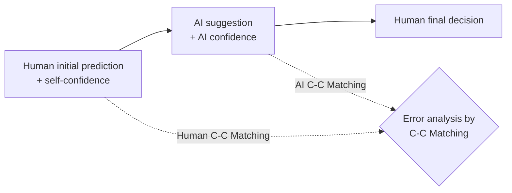

# "Are You Really Sure?" Understanding the Effects of Human Self-Confidence Calibration in AI-Assisted Decision Making — Summary

> [!NOTE]
> **Source:** [2403.09552-self-confidence-calibration.pdf](../../sources/arXiv/2403.09552-self-confidence-calibration.pdf) · Shuai Ma, Xinru Wang, Ying Lei, Chuhan Shi, Ming Yin & Xiaojuan Ma, 2024 · CHI '24 (Proceedings of the CHI Conference on Human Factors in Computing Systems, Honolulu) · [arXiv:2403.09552](https://arxiv.org/abs/2403.09552).
> Study-guide summary of the full document. See the original for exact wording and figures.

## Abstract

A CHI 2024 paper arguing that appropriate reliance on AI depends not just on trust in the AI but on how well the *human's own* confidence is calibrated — and showing, across three studies, that calibrating human self-confidence improves human–AI team performance.

**Key points**

- **Framework:** the paper introduces instance-level **Confidence–Correctness (C-C) Matching** — a prediction is *over-confident* (high confidence, incorrect) or *under-confident* (low confidence, correct), otherwise C-C Matched — and analyses reliance failures by crossing human and AI C-C Matching. Task-level miscalibration is measured with **Expected Calibration Error (ECE)**.
- **Study 1 (n = 94, income prediction):** human C-C Mismatch significantly raises final-decision error rates, and participants' ECE correlates positively with both under-reliance (ρ = 0.404, p < 0.001) and over-reliance (ρ = 0.343, p < 0.01). Merely showing the AI's confidence score changed neither ECE nor accuracy.
- **Study 2 (n = 241, no AI):** of three calibration mechanisms — *Think the Opposite*, *Thinking in Bets*, *Calibration Status Feedback* — Think and Feedback significantly reduced ECE versus control; Bet did not. All three improved accuracy. Think cost the most: higher mental demand and perceived complexity, lower preference/satisfaction. Uncalibrated controls *believed* their confidence was the most appropriate while it was actually the worst.
- **Study 3 (n = 117, Feedback mechanism + AI with confidence shown):** calibration lowered ECE (p < 0.001), made participants follow the higher-confidence party more often in disagreements (p = 0.022), reduced under-reliance (p = 0.047, over-reliance unchanged), and raised both initial (p = 0.003) and final accuracy (p = 0.013). Calibrated teams beat the AI alone (0.75); uncalibrated teams did not.
- **Caveat:** the gains flip when the *AI's* confidence is miscalibrated — calibrated humans rationally follow high confidence, so AI C-C Mismatch produced significantly *more* errors under calibration (p = 0.018).

**Takeaways**

- The reliance problem is two-sided: over-reliance can come from over-trusting the AI *or* under-confidence in oneself; under-reliance from under-trust *or* overconfidence. Interventions should target whichever side is miscalibrated.
- Lowering human ECE is a lever on misreliance — but calibrate the AI's confidence first (DR6), and expect no single mechanism to suit all tasks: feedback needs ground truth, opposite-thinking taxes cognition, betting needs workable incentives.
- Calibration doubles as training: it improved participants' *independent* accuracy before they ever saw the AI's advice.

## 1 Introduction

- In AI-assisted decision-making the AI recommends and the human decides; the key challenge is **appropriate reliance**. Displaying AI confidence scores has been the standard remedy but yields mixed results — "only displaying AI confidence can be insufficient".
- A key reason: reliance depends on the human's **self-confidence** as well as the AI's. Overconfident people dismiss correct AI advice; underconfident people adopt wrong AI advice. Prior work assumes people hold appropriate self-confidence; cognitive-science evidence says they frequently do not.
- Three research questions drive three consecutive studies:
  - **RQ1** — how does inappropriate self-confidence affect reliance appropriateness? (Study 1)
  - **RQ2** — how can self-confidence be calibrated, and how do mechanisms affect perception and user experience? (Study 2)
  - **RQ3** — how does self-confidence calibration affect reliance appropriateness and task performance? (Study 3)

## 2 Related work

- **2.1 Appropriate reliance and its measurement.** HCI has shifted from increasing trust to calibrating it; automation bias and algorithm aversion illustrate both failure directions. *Trust* is subjective (self-report); *reliance* is behavioural, and self-reported trust does not reliably track reliance behaviour. Two measurement families: **behaviour-based** (does reliance track AI confidence? — often calibrates reliance without improving outcomes) and **outcome-based** (over-reliance = agreeing with wrong AI; under-reliance = rejecting correct AI). The paper uses outcome-based measures.
- **2.2 Existing strategies** to promote appropriate reliance: (1) conveying AI uncertainty (confidence scores, adjusted decision time, violin plots) — inconsistent benefits; (2) teaching AI error boundaries / behaviour descriptions (Bansal et al.; Cabrera et al.); (3) AI explanations — which can *increase* over-reliance because people take explainability as a heuristic for trustworthiness. Closest prior work: He et al. (Dunning–Kruger tutorial calibration, but task-level and without AI confidence shown) and Ma et al. (system-modelled human correctness likelihood, which nudges choices and raises autonomy/ethics concerns). This paper instead calibrates the human's own case-by-case confidence, preserving autonomy.
- **2.3 Human self-confidence.** Self-confidence shapes advice-taking, including from AI. Miscalibration is pervasive (clinicians' confidence uncorrelated with accuracy — Miller et al.; overconfidence harms financial decisions — Grežo). Calibration approaches draw on feedback (Pulford), Moore's *Perfectly Confident*, and Duke's *Thinking in Bets*.

## 3 Unpacking inappropriate reliance from a self-confidence perspective

### 3.1 Appropriateness of human self-confidence

- **Task level:** reliability diagrams bin predictions by stated confidence and compare per-bin accuracy to per-bin confidence. **Expected Calibration Error (ECE)** = the bin-size-weighted mean of |accuracy − confidence| across bins; the paper's task-level metric throughout.
- **Instance level — Confidence–Correctness (C-C) Matching** (confidence treated as binary high/low):

| Confidence | Correctness | C-C Matching |
|---|---|---|
| High | Correct | C-C Matched |
| High | Incorrect | **Over-confident** (C-C Mismatched) |
| Low | Correct | **Under-confident** (C-C Mismatched) |
| Low | Incorrect | C-C Matched |

Matching depends on whether confidence aligns with correctness, not on whether the prediction is right.

### 3.2 Analytical framework: crossing human and AI C-C Matching

Built on the **Judge–Advisor System (JAS)**: human initial prediction → AI suggestion → human final decision. Focusing on disagreement cases (people keep their answer when the AI agrees), the framework crosses human C-C Matching with AI C-C Matching to locate the *cause* of each incorrect reliance:

- A person who is right but **under-confident** is prone to adopt a wrong AI suggestion (incorrect AI reliance).
- A person who is wrong but **over-confident** is prone to ignore a correct AI suggestion (incorrect self-reliance).
- An AI that is wrong with **high confidence** misleads; an AI that is right with **low confidence** gets ignored.
- Both sides mismatched is the worst case; both matched, the best.

Uses: post-hoc diagnosis of whose confidence is causing inappropriate reliance, and targeted system design (calibrate the AI's confidence, or intervene on the human's).

## 4 Study 1 — Self-confidence appropriateness vs reliance appropriateness

**Design.** Income prediction (will this person earn > $50K?) on the UCI Adult dataset (48,842 instances, 14 attributes; 8 shown to participants: age, education years, work class, occupation, marital status, gender, race, weekly work hours). AI = logistic regression (sklearn defaults, well-calibrated confidence), trained on a 70% split. 20 main-task instances: 10 low-AI-confidence (< 0.75, mean 0.6, 6/10 correct = 60% accuracy) and 10 high-AI-confidence (> 0.75, mean 0.9, 9/10 correct = 90% accuracy) — so AI confidence is calibrated on the sample itself. Two between-subjects conditions: **With** vs **Without AI Confidence** shown. JAS three-step procedure per case; confidence reported on a 50–100% slider. Power analysis (G*Power, f = 0.6, α = 0.05, power 0.8) required 90; **94 valid Prolific participants** (50 with / 44 without AI confidence), ~15 min, ≈$10.50/hr, $1 bonus for > 90% accuracy.

**Measures.** ECE; **Over-Reliance** = incorrect finals with incorrect AI advice ÷ all incorrect AI advice; **Under-Reliance** = incorrect finals with correct AI advice ÷ all correct AI advice; error rates by human–AI C-C Matching situation. Mann-Whitney U, Wilcoxon signed-rank, Spearman correlations.

**Results.**

- **RQ1.1:** Human C-C Mismatched cases showed significantly higher final-error rates than Human C-C Matched — regardless of whether the AI was C-C Matched. Both-mismatched was the hardest situation of all.
- **RQ1.2:** ECE correlated positively with **Under-Reliance (ρ = 0.404, p < 0.001)** and **Over-Reliance (ρ = 0.343, p < 0.01)** — the paper's core empirical link between human miscalibration and misreliance.
- **RQ1.3/1.4:** showing AI confidence produced **no significant difference** in participants' ECE or accuracy; it raised under-reliance and lowered over-reliance (participants became generally warier). So displaying AI confidence alone neither calibrates humans nor improves outcomes in this setting.

## 5 Study 2 — Comparing self-confidence calibration mechanisms (no AI)

### 5.1 The three mechanisms

| Mechanism | Design | Theoretical basis |
|---|---|---|
| **Think the Opposite (Think)** | Before rating confidence, answer: "Which features might favour an alternative prediction?" and "If your prediction is wrong, what's the most likely reason?" | Pre-mortem (Klein; Mitchell); counters anchoring and confirmation bias |
| **Thinking in Bets (Bet)** | 200-coin bonus account; optionally bet 0–10 coins per prediction (win/lose the stake; 200 coins = $1 bonus; no live balance shown) | Duke's *Thinking in Bets*; Moore — incentivise honest confidence |
| **Calibration Status Feedback (Feedback)** | A prior feedback session: real-time per-item feedback (answer + match / over- / under-confident status bar) plus post-hoc summary (proportions, accuracy vs mean confidence, a 5-bin reliability diagram against an "ideal" one) | Moore — evidence-based feedback on performance |

**Design.** Between-subjects, four conditions (three mechanisms + Control), income prediction *without* AI to avoid confounds. 10 uncalibrated familiarisation tasks, then 20 main tasks (Feedback adds a separate 20-prediction feedback session first). Power analysis (f = 0.25, α = 0.05, power 0.9) required 232; **241 valid participants** (Think 57, Bet 67, Feedback 55, Control 62), ~20 min, ≈$11/hr. Measures: ECE, Over-/Under-Confident Ratios, and 7-point Likert perception/UX items (perceived confidence appropriateness, perceived performance, mental demand, complexity, preference, satisfaction). Kruskal–Wallis with Bonferroni correction.

**Results (RQ2.1).** No condition differences in the familiarisation tasks. In the main task:

- **Accuracy:** Think, Bet and Feedback all significantly beat Control (χ² = 19.686, p < 0.001) — calibration itself mobilises more careful thinking and lifts independent performance.
- **ECE:** Think and Feedback significantly lower than Control (χ² = 12.167, p = 0.007); **Bet not significantly different** (coin losses perhaps insufficiently motivating).
- Over-/Under-Confident Ratios: no significant differences (a non-significant trend for Think and Bet to reduce overconfidence).

**Results (RQ2.2).**

> [!IMPORTANT]
> Participants in **Control** rated their own self-confidence as *more* appropriate than Think or Feedback participants did — while their actual calibration was the worst. People cannot tell they are miscalibrated, which is itself the argument for external calibration.

- Think had significantly higher mental demand and perceived complexity than the other conditions, and a trend to lower preference and satisfaction — consistent with cognitive-forcing-function findings (Buçinca et al.). Bet and Feedback did not degrade user experience.

**Trade-off summary (source Table 2).**

| Mechanism | Pros | Cons | Applicability |
|---|---|---|---|
| Think | Improves calibration and accuracy | Worse user experience | Not for quick decisions |
| Bet | May reduce overconfidence; improves accuracy | Doesn't improve overall calibration | Needs a workable incentive scheme |
| Feedback | Improves calibration and accuracy without hurting UX | Extra time for the feedback session | Needs ground-truth samples |

Feedback was chosen for Study 3 (effective, UX-neutral, ground truth available).

## 6 Study 3 — Calibration's effect on AI-assisted decision-making

**Design.** Same income task; AI confidence always shown (common practice, and lets humans compare confidences). Between-subjects: **Calibration** (Feedback session first) vs **No Calibration**. Power analysis (f = 0.6, α = 0.05, power 0.8) → 90; **117 valid participants** (Calibration 57, No Calibration 60), ~20 min, ≈$12/hr.

**Measures.** ECE and confidence ratios; reliance behaviour (Agreement fraction, Switch fraction, Follow-higher-confidence-in-disagreement fraction); initial and final accuracy; Under-/Over-Reliance plus **Accuracy-wid** (accuracy when initially disagreeing with the AI — a stringent reliance metric independent of initial skill); C-C Matching distributions and error attributions. Mann-Whitney U / Wilcoxon tests.

**Results.**

- **Manipulation check:** Calibration significantly reduced ECE (U = 1051.0, p < 0.001); Over-/Under-Confident Ratios showed decreasing trends only (p = 0.077 / 0.335).
- **RQ3.1 Reliance behaviour:** no differences in Agreement or Switch fractions, but calibrated participants **followed the higher-confidence party significantly more often in disagreements** (U = 2126.0, p = 0.022) — more rational use of confidence information.
- **RQ3.2 Reliance appropriateness:** **Under-Reliance significantly lower** with calibration (U = 1350.5, p = 0.047); **Over-Reliance (p = 0.247) and Accuracy-wid (p = 0.136) unchanged** — calibration improves reliance only in some respects.
- **RQ3.3 Performance:** calibration raised both **initial accuracy (U = 2260.0, p = 0.003)** and **final accuracy (U = 2159.0, p = 0.013)**. Calibrated participants' final accuracy exceeded the AI alone (0.75) and their own initial accuracy — evidence of **complementary team performance** — whereas uncalibrated participants beat neither. (Initial→final gain within Calibration wasn't significant, partly because calibration had already lifted initial accuracy to M = 0.78, SD = 0.11, above the 0.75 AI; participants still switched in 27% of disagreements.)
- **Framework analysis:** calibration significantly shrank the *Human C-C Mismatched & AI C-C Matched* share of disagreements (p = 0.014) and its resulting errors (p = 0.008) — it removes human-side confidence errors while AI-side errors stay put.

> [!WARNING]
> **The side effect:** splitting by the AI's calibration, calibrated humans made significantly *fewer* errors when the AI was C-C Matched (p = 0.002) but significantly *more* when the AI was C-C Mismatched (p = 0.018) — rationally following the higher confidence backfires when the AI's confidence is wrong. Since a well-calibrated AI is C-C Matched far more often than not, the net effect is positive, but AI confidence calibration is a precondition.

## 7 Discussion

- **7.1 Two-sided attribution.** Prior work reads over-reliance as over-trusting the AI and under-reliance as under-trust. The paper argues each misreliance can equally stem from the human side — under- or over-confidence in oneself (from thin expertise, recent failures, incomplete information) — and the C-C framework lets designers diagnose which side to fix.
- **7.2 Rational reliance with limited information.** With ground truth unknown, following the higher calibrated confidence is the rational policy — but Study 3 shows it isn't always the *accurate* one when the AI is miscalibrated; handling AI C-C Mismatch needs complements such as teaching AI error boundaries.
- **7.3 Why the improvement is partial.** Three reasons over-reliance and Accuracy-wid didn't move: (1) calibration only partially fixed confidence (ratio trends non-significant); (2) the follow-higher-confidence policy backfires under AI C-C Mismatch; (3) the confidence–reliance relationship is nonlinear and multi-causal (expertise, AI literacy, intrinsic trust, cognitive biases) — correlation in Study 1 isn't causation, and *calibrating self-confidence alone may not suffice for appropriate reliance*.
- **7.4 Why performance improved:** three joint factors — better independent accuracy (System-2 engagement), fewer human C-C Mismatch errors, and more rational reliance in disagreements. Design the human–AI team as a whole system.
- **7.5 Design recommendations (DR1–DR7):**
  1. **DR1** — calibrate user self-confidence before task deployment (test-phase prediction data; consider calibration as a default).
  2. **DR2** — use the C-C framework to diagnose whether human or AI confidence is the problem, and fix that side.
  3. **DR3** — pick the mechanism to fit purpose and task (Bet/Think against overconfidence; Feedback when ground truth exists).
  4. **DR4** — weigh UX costs; tailor to users (e.g. Need-for-Cognition screening before assigning Think).
  5. **DR5** — use calibration as training: it directly improves independent performance.
  6. **DR6** — ensure the **AI's** confidence is calibrated *before* calibrating the human's.
  7. **DR7** — actively teach users to weight the higher-confidence party when both are calibrated.
- **7.6 Limitations / future work:** binary high/low confidence (multi-level and relative-confidence extensions bring combinatorial complexity); mechanisms need independent pre-AI judgments and explicit confidence reports (future: infer confidence from behaviour such as hesitation); each mechanism has scope limits; population-level rather than personalised calibration; and even dual C-C Matched cases still yield some errors — humans' *perception of AI confidence* may need calibrating too ("dual calibration").

## 8 Conclusion

Via a C-C Matching framework and three studies, the paper shows: (1) human self-confidence appropriateness and reliance appropriateness are linked (ECE ↔ over-/under-reliance); (2) mechanisms differ — feedback calibrates without UX cost, opposite-thinking calibrates at cognitive cost, betting doesn't calibrate overall; (3) calibrating human self-confidence in AI-assisted decisions yields more rational confidence use, less under-reliance, and complementary team performance — a distinct, human-centred lever alongside trust-in-AI calibration.
