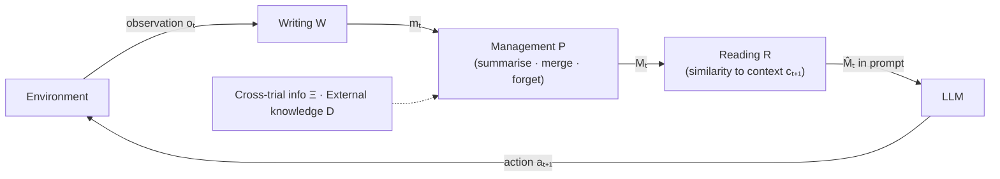

# A Survey on the Memory Mechanism of Large Language Model based Agents — Summary

> [!NOTE]
> **Source:** [2404.13501-agent-memory-survey.pdf](../../sources/arXiv/2404.13501-agent-memory-survey.pdf) · Zeyu Zhang, Xiaohe Bo, Chen Ma, Rui Li, Xu Chen, Quanyu Dai, Jieming Zhu, Zhenhua Dong & Ji-Rong Wen, 2024 · arXiv preprint arXiv:2404.13501 (v1, 21 Apr 2024; "Preprint. Under review") · <https://arxiv.org/abs/2404.13501>.
> Study-guide summary of the full document. See the original for exact wording and figures.

## Abstract

The first survey devoted specifically to the memory mechanism of LLM-based agents (Renmin University + Huawei Noah's Ark Lab; 39 pp., ~174 references, with a companion repository at `github.com/nuster1128/LLM_Agent_Memory_Survey`). Its central claim: memory is *the* key component supporting agent–environment interaction — the module that most differentiates a self-evolving agent from a bare LLM.

**Key points**

- **Definition.** *Narrow* memory = historical information within the current trial (the action–observation sequence so far). *Broad* memory adds two further sources: information accumulated **across trials** (including failed attempts at the same task and trials of earlier tasks) and **external knowledge** beyond the agent–environment loop (e.g. Wikipedia, APIs, domain databases). Formally, memory at step *t* of task *k* derives from the triple (ξᵏₜ, Ξᵏ, Dᵏₜ).
- **Three operations implement the interaction loop:** memory **writing** (project raw action/observation pairs into stored contents, W), memory **management** (process stored contents — summarise/reflect, merge, forget, P) and memory **reading** (retrieve what supports the next action, usually by similarity, R). Unified as: aᵏₜ₊₁ = LLM{R(P(Mᵏₜ₋₁, W({aᵏₜ, oᵏₜ})), cᵏₜ₊₁)}.
- **Design space = sources × forms × operations.** Sources: inside-trial / cross-trial / external knowledge. Forms: **textual** (complete, recent, retrieved interactions, or external knowledge — the current mainstream: interpretable, easy to write, but prompt-length-bound) vs **parametric** (fine-tuning or knowledge editing: denser and read-efficient, but under-researched, costly to write, and opaque).
- **Why memory is needed** — three perspectives: cognitive psychology (human memory as the design template), self-evolution (experience accumulation, environment exploration, knowledge abstraction) and applications (conversation and role-play collapse without it).
- **Evaluation** splits into **direct** (memory as a stand-alone component: subjective coherence/rationality judgments; objective result correctness, reference accuracy (F1), time and GPU cost) and **indirect** (via end-to-end tasks: conversation consistency/engagement, multi-source QA, long-context tasks, success rate, exploration degree). As of writing, **no open-sourced benchmark exists tailored to agent memory modules**.
- Surveys ~28 representative memory-equipped agents (Reflexion, Generative Agents, MemGPT, MemoryBank, Voyager, ExpeL, ReAct, MetaGPT, ChatDev …) and seven application families, then flags four frontiers: parametric memory, multi-agent memory, memory-based lifelong learning, and human-aligned memory for humanoid agents.

**Takeaways**

- Treat agent memory as an engineered module with explicit write/manage/read operations, not as "whatever fits in the context window" — concatenating everything into the prompt fails on cost, length limits and position bias.
- Choose form by task: textual-retrieved memory for conversational/personalised work; parametric memory where large, stable domain knowledge must be internalised.
- Almost every agent uses inside-trial memory; the differentiators are whether it also learns across trials (long-term experience) and imports external knowledge.
- Evaluation is the field's soft spot: task success confounds memory with everything else, and direct benchmarks don't yet exist.

## 1 Introduction

Original LLMs accomplish tasks without interacting with environments; progress toward AGI requires agents that improve themselves by autonomously exploring and learning from the real world (e.g. a trip-planning agent observing a ticket site's response before acting again; a personal assistant adapting to user feedback). Among the modules added to make an LLM an agent, **memory is the key component that differentiates agents from original LLMs, "making an agent truly an agent"** — it determines how the agent accumulates knowledge, processes historical experience and retrieves informative knowledge to support action. Prior memory designs (e.g. Reflexion's in-trial + cross-trial memory; MemoryBank's natural-language storage; RET-LLM's read/write operations) are scattered across papers with no holistic review. The survey's stated contributions: (1) formally define the memory module and analyse its necessity; (2) systematically taxonomise design (sources, forms, operations) and evaluation (direct, indirect); (3) present typical memory-enhanced applications; (4) analyse limitations and future directions. The authors claim it is, to their knowledge, the first survey on agent memory.

## 2 Related Surveys

A meta-survey positioning the work. **LLM surveys** are grouped into holistic overviews (Zhao et al. and others) plus four categories: *fundamental problems* (fine-tuning, alignment, RAG, tool use, knowledge editing, long context, multimodality, efficiency/compression), *evaluation*, *applications* (IR/IE, recommendation, software engineering, robotics, autonomous driving, medicine, finance, psychology) and *challenges* (hallucination, bias/fairness, explainability, security/privacy). **LLM-agent surveys** cover the field holistically (Wang et al. 2023 first; also Xi et al.) or by aspect — multimodal agents, planning (Huang et al.), multi-agent interaction (Guo et al.), personal-assistant applications (Li et al.). Within that organisation, memory is the fundamental-problem slot this survey fills.

## 3 What is the Memory of LLM-based Agent

Agent–environment interaction has three phases: the agent (1) perceives information and stores it in memory, (2) processes the stored information to make it more usable, and (3) takes the next action based on the processed memory.

### 3.1 Basic Knowledge

- **Task (T):** the final target (book Alice a flight; recommend Bob a restaurant).
- **Environment:** narrowly, the object interacted with (Alice, Bob); broadly, any contextual factor influencing decisions (weather, time, location).
- **Trial and step:** one action–response turn is a *step*; the complete interaction process for one attempt at a task is a *trial*, ξ_T = {a₁, o₁, …, o_T, a_T}. A task may take multiple trials.

A running **toy example**: task (A) plan Alice's Beijing trip 5/1–5/3/2024 (book round-trip flights, pick attractions from her preferences using the magazine *Attractions in Beijing*, order the visits); task (B) recommend Alice a movie on 5/10/2024 (learn she watches at 9:00 PM, read her Netflix want-to-watch list, rule out horror at night, pick *Interstellar*).

### 3.2 Narrow Definition of the Agent Memory

Memory is derived only from the historical information **within the same trial**: ξₜ = {a₁, o₁, …, aₜ₋₁, oₜ₋₁}. E.g. at step 3 of task (A), memory holds the flights booked and attractions chosen in steps 1–2.

### 3.3 Broad Definition of the Agent Memory

For sequential tasks {T₁ … T_K}, memory at step *t* of task T_k draws on three sources:

| Source | Formal object | Toy-example instance |
|---|---|---|
| Inside-trial history | ξᵏₜ = {aᵏ₁, oᵏ₁, …, aᵏₜ₋₁, oᵏₜ₋₁} | earlier steps of the current trip-planning trial |
| Cross-trial history | Ξᵏ = {ξ¹, …, ξᵏ⁻¹, ξᵏ′} — trials of earlier tasks plus previous trials of the current task | failed trip plans Alice rejected (avoid repeat errors); attractions visited in task (A) informing movie taste in task (B) |
| External knowledge | Dᵏₜ | the magazine *Attractions in Beijing* |

Memory is derived from (ξᵏₜ, Ξᵏ, Dᵏₜ).

### 3.4 Memory-assisted Agent-Environment Interaction

The three phases are implemented by three operations:

- **Memory writing** — mᵏₜ = W({aᵏₜ, oᵏₜ}): project raw observations into stored contents (natural language or parameters) that are more informative and concise.
- **Memory management** — Mᵏₜ = P(Mᵏₜ₋₁, mᵏₜ): iteratively process stored contents — summarise higher-level concepts (generalisability), merge similar entries (reduce redundancy), forget the unimportant. Under the narrow definition the iteration stays within a trial and memory empties when it ends; under the broad definition it spans trials, tasks and external-knowledge integration.
- **Memory reading** — M̂ᵏₜ = R(Mᵏₜ, cᵏₜ₊₁): extract the information supporting the next action, usually by similarity between memory and the next-action context; the result becomes part of the prompt.

Unified evolving function: **aᵏₜ₊₁ = LLM{R(P(Mᵏₜ₋₁, W({aᵏₜ, oᵏₜ})), cᵏₜ₊₁)}** — the whole interaction process is this function iteratively expanded. Prior work specialises it differently: Reflexion sets R and P to identity with P acting only at trial end; Generative Agents implement R via similarity + time interval (recency) + importance and P via reflection into abstract thoughts.

## 4 Why We Need the Memory in LLM-based Agent

- **4.1 Cognitive psychology.** Memory is central to human mental processes — accumulating knowledge, abstracting concepts, forming social norms, imagining consequences of behaviour. Since agents aim to behave like humans, following human working mechanisms is natural, and cognitive psychology contributes ready-made memory theories and architectures.
- **4.2 Self-evolution.** Memory underpins three self-evolution needs: **experience accumulation** (remember failed plans and errors to handle similar tasks better), **environment exploration** (use history to decide when/how to explore — e.g. revisit failed trials or low-frequency actions) and **knowledge abstraction** (summarise high-level information from raw observations, the basis of adaptivity to unseen environments).
- **4.3 Agent applications.** Memory is not optional: a conversational agent cannot continue a conversation without stored context; a simulation agent steps out of role without memory of its profile.

The first perspective gives memory's cognitive basis; the other two show it is required by the agent's evolving principles and applications.

## 5 How to Implement the Memory of LLM-based Agent

Three design dimensions: **sources** (where contents come from), **forms** (how they are represented), **operations** (how they are processed). The survey tabulates ~28 models against each dimension (Tables 1–3).

### 5.1 Memory Sources

1. **Inside-trial information (§5.1.1).** Historical steps within a trial — the most relevant signal; used by essentially all systems, and includes interaction context (time, location), not just the exchanges. Examples: Generative Agents (behaviour history in a human-behaviour simulation), MemoChat (session dialogue history), TiM (self-generated thoughts after a task), Voyager (executable code for basic Minecraft actions). Limitation: on its own it prevents accumulating generalisable knowledge across tasks.
2. **Cross-trial information (§5.1.2).** Experience across multiple trials — successful/failed actions and their insights (failure reasons, success patterns). Reflexion (verbal reinforcement: verbal experiences from past trials applied to later trials of the same task), Retroformer (fine-tunes the reflection model to extract cross-trial information more effectively), Synapse (successful exemplars for computer-control tasks), ExpeL (stores completed trajectories, recalls similar ones, contrasts successes with failures to find success patterns). The survey frames inside-trial observations as **short-term memory** and cross-trial experience as **long-term memory**. Limitation: both still require the agent's own participation.
3. **External knowledge (§5.1.3).** Textual knowledge beyond the interaction loop, often fetched dynamically via APIs: ReAct (Wikipedia lookups mid-reasoning), GITM (Minecraft Wiki and crafting recipes), CodeAgent (web search for repo-level code generation), ChatDoctor (Wikipedia + medical databases). It expands knowledge boundaries with up-to-date, well-founded information the agent could not obtain by interaction alone.

Per the survey's Table 1, every listed model uses inside-trial information; only a minority (Reflexion, Retroformer, ExpeL, Synapse, GITM, MetaGPT) add cross-trial information; roughly half add external knowledge.

### 5.2 Memory Forms

#### 5.2.1 Textual form (the mainstream)

Explicit natural language (unstructured text or structured tuples/databases); better interpretability, easier implementation, faster read–write. Four storage strategies:

| Strategy | Idea | Examples | Main weakness |
|---|---|---|---|
| **Complete interactions** | Concatenate the whole history into the prompt (long-context strategies) | LongChat (fine-tuned for long context), Memory Sandbox (interactive removal of irrelevant memory) | Quadratic attention cost, context-length overflow forcing truncation, and position bias — citing "Lost in the Middle" (Liu et al.), segment position in a long prompt greatly affects utilisation, so memory in the prompt is not treated equally or stably |
| **Recent interactions** | Keep a recency window (Principle of Locality) | SCM (flash memory caching recent t−1 steps), MemGPT (working context in OS-style virtual context management), RecAgent (short-term memory as intermediate cache) | Loses distant-but-crucial information outside the window |
| **Retrieved interactions** | Select by relevance/importance/topic: embed entries at write time, score and take top-K at read time | Generative Agents (cosine relevance + importance + recency), MemoryBank (dual-tower dense retrieval, FAISS index), RET-LLM (locality-sensitive hashing over tuples), ChatDB (LLM-generated SQL over a symbolic database) | Depends on retrieval accuracy/efficiency; struggles with heterogeneous information |
| **External knowledge (as text)** | Pull knowledge in via tools/APIs (Wikipedia, OpenWeatherMap …) | Toolformer (teaches LLM tool calls), ToolLLM (RapidAPI multi-tool use on Llama), TPTU (planning + tool use), ToRA (program-based tools for maths) | Reliability, alignment with internal decisions, privacy/compliance overhead |

#### 5.2.2 Parametric form (under-researched)

Memory encoded into model parameters — no prompt-length constraint. Two families:

- **Fine-tuning:** infuse domain knowledge into weights — Character-LLM (role experience via SFT), Huatuo (Llama on Chinese medical knowledge bases), DoctorGLM (ChatGLM + LoRA), Radiology-GPT, InvestLM (financial investment data). Risks: overfitting, catastrophic forgetting, heavy compute/data — hence mostly offline; per-step online fine-tuning is unaffordable.
- **Memory editing:** target and adjust only the facts that changed, leaving unrelated knowledge intact — suited to small-scale, online updates. MAC (meta-learning replaces the optimisation step), MEND (lightweight hyper-model generates parameter edits), KnowledgeEditor (hyper-network for learning-to-update), PersonalityEdit (edits Big-Five-style traits), APP (studies neighbour perturbation/catastrophic forgetting when adding facts). Editing bad memories acts as a **forgetting mechanism**. Remaining challenges: meta-training cost and preserving unrelated memories.

#### 5.2.3 Trade-offs: textual vs parametric

| Aspect | Textual | Parametric |
|---|---|---|
| Effectiveness | Comprehensive, detailed raw records; capped by prompt token limits | No length limit; risks information loss in text→parameter conversion; complex training |
| Efficiency | Cheap to **write**, but every inference pays the context cost | Cheap to **read** (knowledge is in the weights); expensive to write |
| Interpretability | High (natural language) — at the price of lower information density (discrete space) | Low (latent space) — but denser (continuous space) |

Rule of thumb: textual memory for recalling recent interactions (conversational, context-specific tasks); parametric memory for large volumes of well-established knowledge.

### 5.3 Memory Operations

- **Writing (§5.3.1).** Decide what to store and in what shape — raw records vs summaries. TiM extracts entity-relations into a structured DB grouping similar contents; SCM adds a memory controller deciding when operations run; MemGPT's writing is fully self-directed; MemoChat summarises conversation segments into topic keys for indexing. Extraction strategy matters because raw feedback is long and noisy and environments differ in feedback form.
- **Management (§5.3.2).** Brain-inspired processing: **reflection** into higher-level memories (Generative Agents — reflection triggers once enough events accumulate), refinement from environment feedback (Voyager), distilling conversations into daily-event summaries and evolving personality insights (MemoryBank), summarising key actions from multiple plans into common reference plans (GITM). Sub-operations tabulated across systems: merging, reflection, forgetting.
- **Reading (§5.3.3).** Obtain what supports the next action from a large memory pool: ChatDB executes agent-generated SQL as a "Chain-of-Memory"; MPC retrieves from a memory pool with chain-of-thought examples for ignoring irrelevant memory; ExpeL takes the top-K most similar successful trajectories from a FAISS store. Reading and writing are collaborative — the write format largely fixes the read method; parametric memory is "read" implicitly through the updated weights.

## 6 How to Evaluate the Memory in LLM-based Agent

Two broad strategies.

### 6.1 Direct evaluation (memory as a stand-alone component)

- **Subjective (§6.1.1)** — human judgment where ground truth is absent, along two aspects: **coherence** (is the recalled memory natural and suitable for the current context?) and **rationality** (is it reasonable — "the Summer Palace is in Beijing", not "on the Moon"?). Process design questions: evaluator selection (task-familiar, diverse backgrounds to reduce group bias) and labelling scheme (absolute scoring vs pairwise comparison; rating granularity). Explainable but costly and hard to reproduce.
- **Objective (§6.1.2)** — numeric metrics:
  - **Result correctness:** accuracy of answers to predefined questions answerable from memory (ChatDB, MemGPT build QA sets from past histories/sessions).
  - **Reference accuracy:** does the *retrieved* memory match ground-truth references (intermediate support, not just final answers)? Measured by F1 (MemoChat, MemoryBank).
  - **Time & hardware cost:** adaptation time (writing + management), inference time (reading), and peak GPU memory allocation (MAC).

### 6.2 Indirect evaluation (via end-to-end tasks)

- **Conversation:** consistency of responses with context (MemoChat, scored by GPT-4) and engagement (MPC's SCE-p score; MemGPT's CSIM score).
- **Multi-source question-answering:** integrates all three memory sources — ReAct (trial + Wikipedia), Reflexion and Retroformer (+ cross-trial experience), MemGPT (multi-document QA); also surfaces memory-contradiction and knowledge-update issues.
- **Long-context applications:** long prompts treated as memory — zero-shot long-context benchmarks (Shaham et al.), long-context passage retrieval, long-context summarisation (ROUGE).
- **Other tasks:** **success rate** (ReAct/Reflexion/ExpeL on AlfWorld; GITM item production in Minecraft; Reflexion on code problems; Synapse on computer control) and **exploration degree** (Voyager's count of distinct Minecraft items discovered). Nearly all memory-equipped agents can be evaluated by with/without-memory ablations.

### 6.3 Discussion

Indirect evaluation is easier (public benchmarks exist) but confounded — task performance reflects many factors besides memory. Direct evaluation is more reliable, **but no open-sourced benchmark tailored to agent memory modules existed** at the time of the survey.

## 7 Memory-enhanced Agent Applications

Seven families (Table 4 lists ~46 systems); what memory stores and how varies by application:

| Application | Representative systems | Role of memory / design insight |
|---|---|---|
| Role-playing | Character-LLM, ChatHaruhi, RoleLLM, NarrativePlay, CharacterGLM | Role experience via SFT or script-extracted character memory; memory must stay consistent with the role's characteristics and shape subsequent behaviour; humanoid memory should follow cognitive-psychology features (forgetting, long/short-term) |
| Social simulation | Generative Agents, Lyfe Agents (Summarize-and-Forget), S3, MetaAgents, WarAgent | Per-agent memory pools sustain realistic multi-agent dynamics (macro-economic decisions, job-seeking, inter-country war decisions) |
| Personal assistant | MemoryBank, RET-LLM, MemoChat, MemGPT, MPC, AutoGen, ChatDB, TiM, SCM | Mostly **textual retrieval**: remember facts of user–agent interaction plus the user's personal style; recall what is relevant to the current query to keep conversations consistent and personalised |
| Open-world game | Voyager, GITM, JARVIS, LARP | Store skills/successful trajectories, reflect on past interactions, and absorb external knowledge (Minecraft Wiki) to explore effectively without repeating mistakes |
| Code generation | RTLFixer, GameGPT, ChatDev, MetaGPT, CodeAgent | Compiler errors + expert instructions in external memory; per-role conversation memory in multi-agent development; memory supports continuity, coherence and iterative optimisation of code |
| Recommendation | RecAgent, InteRecAgent, RecMind, AgentCF | Hierarchical/user-profile memory to simulate users or personalise; challenge: aligning personalised feedback with LLMs |
| Expert systems (medicine, finance, science) | Huatuo, DoctorGLM, Radiology-GPT, EHRAgent, ChatDoctor; InvestLM, TradingGPT, QuantAgent, FinMem; Chemist-X, ChemDFM, MatChat | Domain knowledge fine-tuned into weights or retrieved from external sources; layered memory for market information; challenges: accuracy demands, time-sensitive knowledge needing partial updates, sheer volume complicating recall |
| Other | cloud root-cause analysis, ontology matching, autonomous driving (vector DB of driving scenarios), user-acceptance testing | Memory design must follow the downstream task's requirements |

## 8 Limitations & Future Directions

1. **More advances in parametric memory (§8.1).** Textual memory dominates, but parametric memory offers higher information density (continuous latent space vs discrete tokens), robustness of soft encoding, storage efficiency (knowledge compression), learned rather than hand-ruled management, and "pluggable" memory like a *digital life card*. Blockers: efficiently turning text into parameter changes (SFT is too slow/data-hungry for situational knowledge — meta-learning "learning to memorise", e.g. MEND, is one route) and poor interpretability, a problem in high-trust domains like medicine.
2. **Memory in multi-agent systems (§8.2).** Open problems: memory **synchronisation** across cooperating agents (a unified knowledge base for consistent decisions, e.g. multi-robot collaboration), memory-driven **communication** (maintaining context and shared understanding between agents), and **information asymmetry** in competitive settings.
3. **Memory-based lifelong learning (§8.3).** Continuous interaction over an agent's whole lifespan requires memory that captures **temporality** (with memory-overlap interactions), stores vast amounts and retrieves on demand — likely needing a forgetting mechanism. High practical value in long-term social simulation and personal assistance.
4. **Memory in humanoid agents (§8.4).** Unlike task-oriented agents where more capability is better, humanoid agents should mimic human proficiency: memory aligned with cognitive processes (distortion, forgetfulness) and **knowledge boundaries** matching the replicated entity — a child-role agent should not command advanced mathematics.

## 9 Conclusion

The survey systematically reviews agent memory around "what is", "why do we need" and "how to design and evaluate" the memory module, presents applications where memory is pivotal, and hopes to serve newcomers and inspire more advanced memory mechanisms.

## Editorial note: relation to Du et al. (2026)

*(Editorial addition, not part of the source.)* The repo already summarises and cites a later memory survey — Du et al., 2026, [`2603.07670`](2603.07670-agent-memory-survey.md), used in Ch2's "A Map of Memory Patterns". The two are complementary rather than redundant:

- **Zhang et al. (2024)** organise memory by **source and mechanism** — inside-trial / cross-trial / external knowledge, textual vs parametric form — and contribute the formal write→manage→read operator framework (W, P, R) plus the "memory is what makes an agent an agent" thesis. It is the earlier, foundational taxonomy (self-described first survey of the topic).
- **Du et al. (2026)** organise memory by **time horizon and function** — working / episodic / semantic / procedural — and add the headline empirical claim that the with/without-memory gap can exceed the gap between model versions.
- The write→manage→read cycle appears in both (Du et al. adopt the same operation triad), so Zhang et al. is the natural citation for the *operations* framework and for trial/cross-trial/external-knowledge sourcing, while Du et al. remains the citation for the layered (working/episodic/semantic/procedural) map and the memory-vs-model-version comparison. Both surveys converge on the same gap: memory evaluation lacks dedicated benchmarks.
