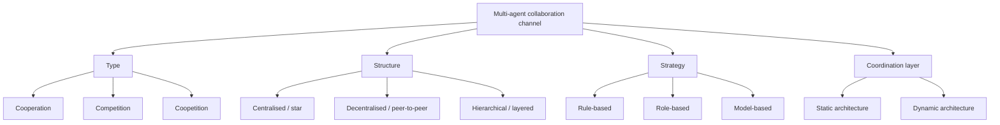

# Multi-Agent Collaboration Mechanisms: A Survey of LLMs — Summary

> [!NOTE]
> **Source:** [2501.06322-multi-agent-collab-mechanisms.pdf](../../sources/arXiv/2501.06322-multi-agent-collab-mechanisms.pdf) · Khanh-Tung Tran, Dung Dao, Minh-Duong Nguyen, Quoc-Viet Pham, Barry O'Sullivan & Hoang D. Nguyen, 2025 · arXiv preprint, 35 pp. · <https://arxiv.org/abs/2501.06322>.
> Study-guide summary of the full document. See the original for exact wording and figures.

## Abstract

A 35-page survey of the *collaborative* side of LLM-based multi-agent systems (MASs), proposing an extensible framework that characterises every collaboration channel between agents along five dimensions: **actors** (the agents involved), **type** (cooperation, competition, coopetition), **structure** (peer-to-peer, centralised, or distributed; elaborated as centralised / decentralised-distributed / hierarchical communication topologies), **strategy** (rule-based, role-based, model-based), and the **coordination/orchestration layer** (static vs dynamic).

**Key points**

- A collaboration **channel** is the unit of analysis: a difference in any attribute (actors, type, structure, strategy) makes a distinct channel, and one system can mix channels — e.g. a debate (competitive) feeding a judge (cooperative). Collaboration can occur **late-stage** (ensembling outputs), **mid-stage** (exchanging model parameters, as in federated learning), or **early-stage** (sharing data, context, environment).
- **Types:** cooperation aligns agent objectives to a shared goal (simple, exploits specialisation, but one agent's failure can amplify); competition pits conflicting objectives (drives robustness and strategic adaptability, needs conflict-resolution mechanisms); coopetition blends the two (negotiation, mixture-of-experts) but is under-studied.
- **Structures and their trade-offs:** centralised (star) topologies are simple and resource-efficient but the central node is a single point of failure; decentralised/peer-to-peer topologies are fault-tolerant, scalable and autonomous but carry high communication overhead and inefficient resource allocation; hierarchical (layered) topologies distribute tasks across levels with low bottleneck but add complexity and latency, and edge failures become critical. One cited work maps four communication paradigms (memory, report, relay, debate) onto bus, star, ring and tree network topologies.
- **Strategies:** rule-based protocols are efficient, predictable and fair but brittle and hard to scale; role-based protocols (MetaGPT's SOPs, AgentVerse, BabyAGI) give modularity and expertise-matching but risk rigidity; model-based protocols (Theory-of-Mind, probabilistic graphical models) handle uncertainty and dynamic environments at high implementation and compute cost.
- **A cautionary result:** a MAS with poorly designed (competitive) collaboration channels can be *beaten by a single agent with strong prompts* on a range of reasoning tasks — collaboration design, not agent count, is what pays.
- **Open challenges:** unified governance (role assignment, failure recovery), shared decision-making beyond dictatorial/majority voting, cascading hallucinations across agents ("agents as digital species"), unknown scaling laws for agent populations, absence of standardised MAS benchmarks, and safety risks that amplify with agent count (adversarial compromise, deception, over-reliance).

**Takeaways**

- The five-dimension framework is a ready-made vocabulary for describing agent team topologies: pick a type, structure, strategy and coordination architecture per channel, and match each to the task — rules for well-defined procedures, roles for specialised structured work, models for uncertainty; static coordination when domain knowledge is strong, dynamic when tasks evolve.
- Topology choice is a trade-off between simplicity/control (centralised), resilience/scalability (decentralised) and layered efficiency (hierarchical) — no structure dominates, and the optimal structure varies with task and agent composition.
- Multi-agent is not automatically better: without well-designed channels, coordination overhead, amplified hallucinations and misaligned goals can make a MAS worse than one good agent.

## 1 Introduction

**Motivation.** Individual LLMs suffer intrinsic limits — hallucination, an auto-regressive nature incapable of slow thinking, and scaling laws. Agentic AI uses the LLM as brain/orchestrator with tools and planning; researchers now explore *horizontal scaling* — multiple LLM-based agents collaborating toward collective intelligence, inspired by human collective intelligence (the society of mind, theory of mind). Claimed benefits of MASs: **knowledge memorisation** (distributed agents retain diverse knowledge without overloading one system), **long-term planning** (delegation supports persistent problem-solving), **generalisation** (pooling specialised prompts/personas), and **interaction efficiency** (parallel subtask handling). The goal is collective intelligence where the whole exceeds the sum of the parts.

**Gap and contributions.** A comparison of eight prior surveys (Table 1) finds each rates Low–Medium on reviewing collaborative aspects and mechanisms — earlier surveys focus on single agents, only communication structures, only cooperative strategies (merging/ensemble/cooperation), or specific domains (simulation, digital twins, software engineering). This survey rates itself High on all four axes (MAS focus, collaboration mechanisms, general framework, real-world applications). Contributions: (1) the operational "know-how" of collaboration — type, strategy, communication structure, coordination architecture; (2) a general framework for LLM-based MASs; (3) a review of real-world applications; (4) lessons learned and open problems.

## 2 Background

- **Multi-agent systems.** Components: agents (roles, capabilities, behaviours, knowledge), environment, interactions (cooperation, coordination, negotiation), organisation (hierarchical control or emergent). Salient features: flexibility/scalability, robustness/reliability (decentralised control survives component failure), self-organisation, real-time operation. Efficiency stems from division of labour — costs amortised across agents; failed agents' tasks can be reassigned.
- **LLMs.** Transformer-based models (GPT, LLaMA, Gemini) with emergent abilities past a parameter threshold (analogical reasoning, zero-shot learning). As agent "brains" they bring reasoning and language, but multi-agent settings expose weaknesses — notably **cascading hallucinations**, where one erroneous output compounds through interactions; MetaGPT's structured workflows and Consensus-LLM's negotiation mechanisms are early mitigations.
- **Collaborative AI.** AI designed to work with other AI agents or humans, spanning MAS research, human–machine interaction, game theory and NLP. The collaboration spectrum extends beyond cooperation to competition and coopetition. A key caveat: **LLMs are not inherently designed or trained to communicate with one another**, leaving open problems in the LLM–MAS fusion.

## 3 Multi-Agent Collaboration Concept

**Agent definition.** An agent is *a* = {*m*, *o*, *e*, *x*, *y*}: model *m* = {architecture, memory, optional adapters} (for LLM agents the memory is typically the system prompt), objective *o*, environment *e* (for LLMs, the token-bounded context window), input *x*, and output *y* = *m*(*o*, *e*, *x*).

**Collaborative system.** A system *S* comprises agents A = {*a₁*…*aₙ*} (n fixed or dynamic), collective goals O_collab (partitionable into per-agent objectives), a shared environment E (e.g. vector databases or common messaging interfaces), **collaboration channels** C, system input x_collab and output y_collab. Channels are distinguished by their mechanisms — actors, type, structure, strategy; *any* attribute difference makes a separate channel. Agents are assumed to share common ground (e.g. all use English, on topic).

**Stages of collaboration** (from the framework figure): **early-stage** (data exchange, context sharing, input embedding), **mid-stage** (model/weight sharing, intelligence exchange — e.g. federated, privacy-preserving parameter exchange), **late-stage** (output/action sharing, task sharing, objective sharing — e.g. majority voting, ensembling).

**Problem definition.** Collaboration involves (1) delegating two or more agents with objectives matched to their expertise, (2) defining their collaboration mechanisms, and (3) decision-making between agents to reach the final goal. Working together goes beyond communication — it requires coordination and management. Illustrations: channels predefined as a directed acyclic graph (edges = agents handing outputs on) for collaborative tasks in a simulated Minecraft environment, and plan-first collaboration for coding tasks.

## 4 Methodology (the framework in detail)

### 4.2 Collaboration types

Summary of the paper's Table 2:

| Type | Definition | Advantages | Disadvantages | Example scenarios |
|---|---|---|---|---|
| **Cooperation** | Agents align objectives and work toward a shared goal (O_collab = union of all *oᵢ*) | Sub-tasks assigned to strengths; simple to design and execute with clear goals | Misaligned goals cause inefficiencies; one agent's failure can be amplified | Code generation, decision making, game environments, question answering, recommendation |
| **Competition** | Agents prioritise their own objectives, which may conflict (*oᵢ* ≠ *oⱼ*) | Pushes agents to perform better; promotes adaptive strategies | Needs conflict-resolution mechanisms; must ensure competition stays beneficial | Debate, game environments, question answering |
| **Coopetition** | Blend: collaborate on shared tasks while competing on others | Balances trade-offs to reach mutual agreements | Few studies explore it in depth | Negotiation |

- **Cooperation** examples: a feedback-loop channel in which an Actor LLM's output is rated by Evaluator and Self-Reflection models that produce verbal guidance for improvement; Theory-of-Mind agents with a shared belief state (emergent collaborative behaviour, but long-horizon planning and hallucination remain hard); AgentVerse's specialised roles (recruitment, decision-making, evaluation); MetaGPT's assembly-line model encoding Standardised Operating Procedures (SOPs) into prompts. Open frameworks: CAMEL (role-playing User/Assistant conversations) and AutoGen (flexible agent behaviours cooperating through conversation, decomposing tasks into subtasks). Challenges: communication cost, coordination difficulty in dynamic environments, divergent interpretation of shared goals (agents in a book-marketplace simulation messaged *themselves* pretending to be clients), and dependence on individual reliability (infinite conversation loops, amplified hallucinations).
- **Competition** examples: LLMARENA benchmarks competitive MASs across **seven** dynamic gaming environments, showing competition exercises spatial reasoning, strategic planning, numerical reasoning, risk assessment, communication, opponent modelling and team collaboration — while finding LLMs still weak at opponent modelling and team collaboration. A simulation of **two restaurant managers competing for 50 customers** reproduced classic sociological/economic theories. LEGO pairs an Explainer with a Critic for causality explanation. **Warning result:** a MAS with suboptimal competitive channel design can be *overtaken by single-agent counterparts with strong prompts* (including few-shot demonstrations) across reasoning tasks and backbone LLMs.
- **Coopetition** examples: negotiation simulations where agents with conflicting interests trade off toward mutually beneficial agreements; mixture-of-experts, where experts compete via a gating mechanism during training yet jointly produce the output.
- **Hybrid channels (§4.2.4).** Real systems coordinate channels of different types: in LEGO, three agents first cooperate to augment task information, then a competitive Explainer–Critic channel refines outputs; in multi-agent debate, two debaters compete while a judge agent cooperates with both. Managing hybrid collaboration needs role assignments, communication protocols and shared knowledge representations.

### 4.3 Collaboration strategies

Summary of the paper's Table 3:

| Strategy | Definition | Advantages | Disadvantages | Example scenarios |
|---|---|---|---|---|
| **Rule-based** | Interactions strictly controlled by predefined rules | Efficient, highly predictable; consistency and fairness ensured (limits each agent's power) | Low adaptability to uncertainty; rule count can grow exponentially — hard to scale | Question answering, consensus seeking, navigation, peer review |
| **Role-based** | Distinct predefined roles / division of labour; each agent works a segmented objective | Modularity and reusability; leverages each agent's expertise | Rigid if roles are mis-specified; performance depends on inter-role communication | Decision making, software development, robotics |
| **Model-based** | Probabilistic decision-making from uncertain inputs, environment and shared goals | Adapts to dynamic environments; robust to noise and uncertainty | Complex to implement; computationally expensive (limits real-time use) | Game environments, decision making, robotics |

- **Rule-based** examples: social-psychology-inspired debate and majority rule; event-triggered communication rules that cut unnecessary messages; a peer-review mechanism (critique, revise, refine); Consensus-LLM, which tested **four consensus strategies** and found agent personality and network topology affect rule-following, with LLM agents notably considerate and cooperative in consensus seeking.
- **Role-based** examples: AgentVerse role adherence; MetaGPT's SOP-encoded expert roles that verify each other's results, preventing error propagation by modularising task distribution; RoCo assigning LLMs to dialogue roles in multi-robot settings; BabyAGI's three parallel chains (task creation, task prioritisation, execution).
- **Model-based** examples: Theory-of-Mind inferences about peers' likely mental states; probabilistic logical reasoning with hierarchical RL for human–AI collaboration (large gains on Watch-and-Help and HandMeThat); Probabilistic Graphical Modelling in the game Chameleon; probabilistic timed automata for an adaptive parking system.

### 4.4 Communication structures (team topologies)

Summary of the paper's Table 4 — the core "topology trade-offs" content:

| Structure | Definition | Advantages | Disadvantages | Example scenarios |
|---|---|---|---|---|
| **Centralised** (star) | Collaboration decisions concentrated in a central agent; all others communicate through the hub | Simple to design and implement; efficient resource allocation | Central-node failure can collapse the whole system; less resilient to disruption | Question answering, decision making |
| **Decentralised / distributed** (peer-to-peer) | Decisions distributed among agents acting on local information | Keeps functioning if some agents fail; high scalability; agents operate autonomously and adapt | Inefficient resource allocation; high communication overheads | Question answering, decision making, reasoning, code generation, storyboard generation |
| **Hierarchical** (layered) | Agents arranged in layers with distinct roles and levels of authority, interacting mainly within or between adjacent layers | Low bottleneck — communication and tasks distributed across levels; efficient resource allocation; task offloading between levels | Edge-device failure leads to system failure; high complexity and latency | Code generation, question answering, reasoning, storyboard generation |

- **Centralised.** Two flavours: LLMs on distributed agents with a central aggregator (federated learning, e.g. FedIT; Google trained next-word prediction on mobile keyboard data via FL), or the LLM hosted centrally (AutoAct). LLM-Blender calls multiple LLMs in one round and pairwise-ranks to fuse top responses; AgentCoord provides a visual tool for designing coordination strategies.
- **Decentralised.** Multi-LLM debate for a fixed number of rounds boosts factuality and reasoning; dynamic directed-acyclic-graph structures help on reasoning tasks; **optimal communication structures vary with tasks and agent composition**. Domain examples: MedAgent (medical specialties), MetaGPT/ChatDev (software roles), MARG (paper review), AutoAgents and OKR-Agent (creative work), SOA (self-organised agents scale codebases by adding agents — no single agent must comprehend the whole codebase), AgentCF (users *and items* as agents in collaborative filtering), ProAgent (infers teammates' intentions to cut communication), generative-agent societies with memory/reflection/retrieval, OpenAgents (Data/Plugins/Web agents).
- **Hierarchical.** DyLAN organises agents in a multi-layered feed-forward network with two stages — *Team Optimization* (unsupervised selection of top-contributing agents for the task) and *Task Solving* — plus an LLM-powered ranker that dynamically deactivates low performers, inference-time agent selection and early stopping. CAMEL-style agent groups show autonomously emerging social behaviours. One study proposes **four communication paradigms — memory, report, relay, debate — mapped to bus, star, ring and tree topologies**.

### 4.5 Coordination and orchestration

Coordination operates *above* individual channels: how channels are created, ordered and characterised. Summary of the paper's Table 5:

| Architecture | Definition | Advantages | Disadvantages | Mechanisms / implementations |
|---|---|---|---|---|
| **Static** | Predefined channel list, leveraging prior/domain knowledge | Consistent task execution; exploits domain knowledge | Relies on accurate initial design; fixed channels limit scalability and flexibility | Predefined rules, domain knowledge; sequential chaining, code generation (MapCoder), recommendation (MACRec), literary translation |
| **Dynamic** | Channels and roles adapt to evolving environments and task requirements | Adaptable roles/channels per task; handles complex, evolving tasks | Higher resource use from real-time adjustment; dynamic adjustments can fail | Management agent; DAG-based orchestration, persona-based (SPP), input-based |

- **Static** example: three sequentially chained agents (two domain experts + a summariser, each receiving the prior output concatenated with the human input) outperformed single-agent chain-of-thought on college-level science multiple-choice questions. MapCoder's channels emulate program synthesis (recall, planning, coding, debugging agents); MACRec fixes Manager/Analyst/Reflector channels for recommendation.
- **Dynamic** example: Solo Performance Prompting (SPP) identifies personas from the input and spawns tailored agents to brainstorm (GPT-4 finds accurate personas across scenarios); a graph-based Orchestrator builds a DAG of tasks from user input, agents execute in parallel/sequence per the DAG, and a Delegator consolidates results.

### 4.6 Summary and lessons learned

The section restates the channel characterisation (actors, type, structure, strategy) and notes collaboration is possible at training stages too (data sharing, federated model sharing, ensemble fine-tuning). LLMs remain standalone algorithms not trained for collaboration, so agent behaviour can be hard to explain or predict; safety concerns arise especially in competitive settings (exploitation, hallucination). Emerging frameworks: AutoGen, CAMEL, crewAI. Lessons:

- **Effective collaboration channels** — well-designed mechanisms let MASs beat single agents (AutoGen); badly designed ones lose to a single strongly-prompted agent.
- **Collective domain knowledge** — domain expertise should shape architectures and prompts; channels are often predefined to match domain workflows.
- **Adaptive role and channel assignment** — dynamic assignment by agent strength and task need improves flexibility.
- **Optimal collaborative strategy** — rules for procedure-bound tasks (consistency, fairness); roles for structured, specialised work; models for uncertain/dynamic situations.
- **Scalability** — coordination complexity grows with agent count; scalable architectures are essential.
- **Ethics and safety** — safety protocols and ethical guidelines prevent unintended consequences.

## 5 Applications

Three domains surveyed (Table 6 summarises ~17 systems with contributions, advantages, disadvantages):

- **5G/B6G and Industry 5.0 (IoT).** LLMs applied to semantic communication — LLM-SC (LLM probabilistically models transmitted sequences, balancing semantic- and technical-level performance), LaMoSC (multimodal fusion via LLM-generated prompts), LAM-MSC (multimodal alignment with GPT-4 knowledge base), GMAC (semantic compression enabling multi-agent collaboration with less transmission), MSADM (network health management), RIS optimisation for Internet of Vehicles. Industry 5.0: local open-source LLM IoT systems, SAGE smart-home agent (dynamically constructed prompt tree), LSGLLM (edge-distributed spatio-temporal traffic learning), Internet-of-Senses WebXR generation, CASIT (multiple LLMs for IoT anomaly detection). Recurring disadvantage: **high computational demands** of LLMs.
- **QA / NLG.** Industry frameworks: **OpenAI Swarm** (routines and handoffs — an agent transfers an active conversation to a specialised peer; lightweight but not production-ready, mainly role-based and centralised/decentralised), **Microsoft Magentic-One** (an Orchestrator plans, tracks progress and re-plans, delegating to web-browsing/file/code agents), **IBM Bee Agent Framework** (modular open-source workflows over IBM Granite and Llama 3, with agent-state serialisation), **LangChain agents**. Research systems: multi-agent debate (MAD — reduces bias, but LLMs struggle with coherence in long debates), FORD (three-stage debate), SOT (skeleton-of-thought parallel answering), Meta-Prompting, LLM-Blender (needs O(n²) inference calls), ChatDev, AgentVerse. Evaluation is being reimagined: **Agent-as-a-Judge** uses agentic systems to evaluate other agents, aligning closely with human experts and beating LLM-as-a-judge on the DevAI benchmark of **55 realistic AI development tasks**; **Benchmark Self-Evolving** mutates benchmark instances via role-based agents to counter data contamination. **Orca-AgentInstruct** generates synthetic training data via three agentic flows (Content Transformation, Seed Instruction Generation, Instruction Refinement), yielding up to **54%** benchmark improvements when fine-tuning Mistral 7B. Caveat: most existing frameworks focus mainly on role-based strategy and centralised or decentralised structures.
- **Social and cultural domains.** MASs simulate social interactions (agents as office employees or family members driven by GPT-4, Qwen2.5-14b, Llama-3-8b), eliciting human-like capabilities: theory of mind, Hobbesian social-contract behaviour, non-verbal action inference. Applications: replacing human participants in some social-science experiments, policy testing, norm-violation detection, and SocialMind — a multi-tier collaborative agent system integrating verbal, non-verbal and social cues to generate in-situ suggestions through augmented-reality glasses (though it needs advanced edge hardware); culturally, CulturePark simulates cross-cultural communication, Mango extracts cultural knowledge for fine-tuning, and cultural-evolution simulations model information transmission among agents. **Limits:** LLMs falter under information asymmetry and in competition/conflict-resolution tasks; standardised benchmarks of social/cultural awareness are needed.

## 6 Open problems and discussion

### 6.1 The road to artificial collective intelligence

- **Unified governance** — coordination and planning mechanisms: which steps, which agents, how tasks are distributed; optimal role assignment and adaptation; failure detection and recovery (e.g. redundancy or fallback agents).
- **Shared decision making** — current MASs mostly use dictatorial or popular voting, which can miss preference diversity or aggregate LLM overconfidence; novel decision methods are needed for diversity and fairness.
- **Agent as digital species** — LLMs were not designed for collaborative, multi-participant settings; one agent's hallucination can spread and be reinforced by others, turning minor inaccuracies into critical cascading effects. Fixes require error detection *and* control of collaboration channels; models designed for collaboration (e.g. Gemini 2.0) are a step forward.
- **Scalability and resource maintenance** — growing agent populations strain memory, processing time and coordination; **the scaling laws of MAS behaviour and performance are unknown**.
- **Discovering unexpected generalisation** — emergent collective behaviours (coordinated problem-solving, innovation) arise under the right conditions, but identifying and fostering those conditions is open.

### 6.2 Comprehensive evaluation and benchmarking

MAS evaluation needs criteria beyond single-LLM metrics: overall performance (reasoning, task completion) plus coordination efficiency and contextual appropriateness; fine-grained agent- and channel-level evaluation enables root-cause analysis. Evaluations today are run in narrow, differently configured scenarios, yielding inconsistent, incomparable results; standardised protocols and **dynamic benchmarks** (to avoid data leakage/overfitting to static ones) are needed.

### 6.3 Ethical risk and safety

Hallucinations propagate and amplify through agent interactions, driven by (1) LLM overconfidence — persistently asserting incorrect outputs — and (2) inter-agent misunderstandings. MASs are attractive adversarial targets: a compromised agent can be manipulated into harmful behaviour, and **risks scale proportionally with agent count**. Human-like MASs risk deceiving users: anthropomorphising fosters over-reliance, increases susceptibility to manipulation, and obscures the systems' limitations (the survey points to the EU AI Act context).

## 7 Conclusion

The survey's framework characterises multi-agent collaboration along **five dimensions — actors, types, structures, strategies, and coordination mechanisms** — as a systematic lens for analysing and designing collaborative interactions in LLM-based MASs, intended as a foundation for advancing MASs toward artificial collective intelligence.
