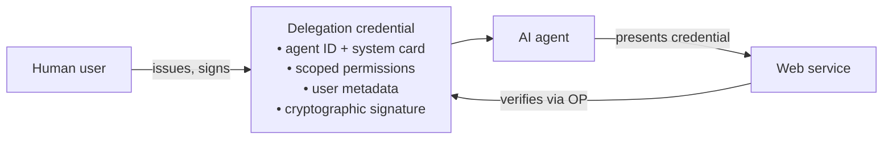
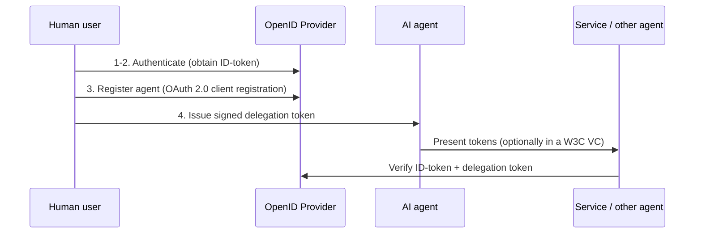

# Authenticated Delegation and Authorized AI Agents — Summary

> [!NOTE]
> **Source:** [2501.09674-authenticated-delegation.pdf](../../sources/arXiv/2501.09674-authenticated-delegation.pdf) · South, T., Marro, S., Hardjono, T., Mahari, R., Whitney, C. D., Greenwood, D., Chan, A., & Pentland, A. (2025) · arXiv:2501.09674v1 [cs.CY], 16 Jan 2025 · https://arxiv.org/abs/2501.09674 · Affiliations: MIT, University of Oxford, Harvard Law School, UC Berkeley, Centre for the Governance of AI, Stanford.
> **Preprint — not peer-reviewed.** The proposed protocol is an unratified design proposal, not a deployed or standardised specification; read "extends OAuth 2.0 / OIDC" as a research proposal, and the three-token scheme as the authors' design rather than an adopted standard.
> Study-guide summary of the full document. See the original for exact wording and figures.

## Abstract

A framework for **authenticated, authorized, and auditable delegation** of authority from human users to AI agents, built by extending OAuth 2.0 and OpenID Connect (OIDC) with agent-specific credentials and metadata — so that any third-party service can verify (a) that it is talking to an AI agent, (b) which human that agent acts for, and (c) exactly what the agent is permitted to do.

**Key points**

- **Three-token design**: the user's standard OIDC **ID-token**, a new **Agent-ID token** (the agent registered as an OAuth 2.0 native client, carrying unique identifiers, capability/limitation metadata, system documentation), and a new **Delegation token** — issued and *signed by the human delegator*, referencing (e.g. hashing) both other tokens, and carrying scope restrictions, validity conditions (expiry, revocation endpoints), and optional audit/logging URLs.
- **Accountability chain**: every agent action is cryptographically traceable to the delegating human — the delegation token is verifiable at a standard OpenID Provider, so services can confirm authenticity and scope before granting access. This replaces reliance on agency law's "apparent authority" doctrine with automatic verification.
- **Least privilege via scoping**: the paper distinguishes **task scoping** (which actions) from **resource scoping** (which resources), and argues structured, machine-readable resource permissions (e.g. XACML, ODRL) must be the enforcement foundation — natural-language instructions are translated by an LLM into structured policies which the human reviews and approves. Even a jailbroken agent is then constrained by the underlying resource permissions.
- **Deployment story**: deliberately incremental — reuses battle-tested OAuth 2.0/OIDC flows (client registration, token validation, UMA for multi-agent policy), stays compatible with existing web authentication infrastructure, and interoperates with W3C Verifiable Credentials (e.g. OID4VC hybrids). Contrasted with MCP and GPT Actions, which handle system communication but not identity management or delegation.
- **Stated limitations**: repeated sign-in flow overhead; OpenID Providers become a surveillance/correlation point (privacy risk); OIDC may be heavier than a native W3C VC approach; natural-language-to-policy translation is error-prone, adds a prompt-injection attack surface, and drifts as context changes; third-party enforcement is a point of failure.

**Takeaways**

- Delegation to agents should be an *infrastructure* problem, not an alignment problem: don't trust the model to obey its prompt — bind it with verifiable credentials and deterministic resource permissions that hold even if the model is tricked.
- The framework is deployable now because it extends what the web already runs on (OAuth 2.0/OIDC), rather than requiring new identity rails.
- Legally, verifiable delegation gives agency law, UETA-style electronic-transaction rules, and EU AI Act human-oversight requirements something concrete to attach to (the Air Canada chatbot case shows firms are liable for their agents anyway).

## 1. Introduction

- **Agentic AI systems** pursue complex goals with limited direct supervision on behalf of a user, interacting with external tools and services — e.g. a travel-booking agent that browses the web, calls flight APIs, or messages an airline's chat agent; this can extend to agent–agent negotiation.
- Despite current limitations (task failures, prompt-injection susceptibility), rapid progress and commercial interest raise governance concerns: the world needs ways to **explicitly delegate authority** to agents, **transparently identify** them as AI, and **enforce human-centred permissions**.
- Three key concepts are distinguished:

| Concept | Definition |
|---|---|
| **Authentication** | Confirms an entity's identity |
| **Authorization** | Determines the permissible actions and resource accesses of the authenticated identity — the scope and limits of delegated activity |
| **Auditability** | Lets all parties inspect and verify that claims, credentials, and attributes remain unaltered |

- **Three contributions**: (1) §2 motivates why authenticated delegation matters and where current practice falls short; (2) §3 extends OIDC/OAuth 2.0 for authenticated delegation to AI agents; (3) §4 proposes translating flexible natural-language permissions into auditable, fine-grained access-control rules across agent modalities (web requests, computer use, language interfaces). Appendix C gives use cases; §5.5 a legal analysis.

## 2. Why authenticated delegation is important

> [!IMPORTANT]
> **Authenticated delegation** = instructing an AI system to perform a task requiring access to tools, the web, or computer environments such that third parties can verify: (a) the interacting entity is an AI agent; (b) the agent acts on behalf of a specific human user; and (c) the agent has been granted the necessary permissions for specific actions.

- The authorization is a digital artifact the agent presents to services (or other agents), which can include the agent instance's unique identifiers, permissions, capabilities/failure modes, and user information. It must be **uniquely and cryptographically linked to the digital identity of the human delegator** — via email accounts, a more robust digital identity, or domain-specific identifiers (e.g. organizational accounts).
- This holds whether the AI is run locally or by a vendor — harm can occur in both — and need not differ much from familiar flows (like authorizing a calendar app), but agents' autonomy and capability demand more care.

### 2.1 Functions of authenticated delegation

Five functions, each with a worked example:

1. **Current challenges in delegating authority** — Simple tasks (web search, code, images) need no special authorization; interacting with personal/organizational accounts, sensitive data, or consequential infrastructure does. *Example:* pasting a credit card into a travel agent's context window and prompting it to "follow a budget" relies on model reliability against jailbreaks; instead the agent should be authenticated and authorized on specific booking services where cards are stored securely and explicit spending limits are enforced. (Limited OAuth 2.0 support already exists in tools like OpenAI GPT Actions.)
2. **Communicating limitations and restricting scope** — Current scoping is one-sided: prompts fail in known ways; blocking tools/sites is coarse; deployer-side monitoring isn't communicated to the counterparty service. *Example:* a text-only diagnostic agent logs into a telemedicine portal with generic physician credentials, is granted all patient records including a video assessment it cannot process, and issues a diagnosis from text alone with an overlooked caveat — explicit limitation-communication would have flagged the need for human review of the multimedia content.
3. **Verification in multi-agent communication** — Securing channels is not enough; agents must **mutually authenticate** that they genuinely represent claimed users/organizations, preventing impersonation. *Example:* hospital and insurer agents processing a claim — without mutual authentication, a malicious third-party agent could impersonate the hospital and submit fraudulent claims.
4. **Protecting human spaces online** — As agents mimic humans, human-only spaces need personhood verification; but many agents are legitimate proxies. Authenticated delegation lets platforms **selectively admit AI agents linked to verified human principals**. *Example:* rather than Australia's age-verification social-media ban inadvertently blocking all agents, platforms could admit agents transparently acting for verified users under platform policy.
5. **Supporting contextual integrity** — Adherence to context-specific norms of information flow (actors, attributes, transmission principles, social context). *Example:* distinct credentials for an enterprise-context assistant and a personal one; services enforce the scoped credentials and reject cross-context actions (e.g. using work documents to fill personal forms).

Figure 1 (conceptual overview): a **delegation credential** binds together — the AI system's unique identity and properties (system cards), delegated permissions with contextual scope restrictions, parent identifiers and permissions, and user metadata plus cryptographic signatures — enabling verifiable agent↔service interaction.

### 2.2 Background

- **Other identifiers:** human identity online spans OAuth 2.0, W3C Verifiable Credentials, decentralized identifiers (DIDs), and the EU Digital Identity wallet; personhood is proven via proof-of-personhood systems (anti-Sybil), CAPTCHAs, and personhood credentials. Websites limit bots crudely via `robots.txt` user-agent bans (e.g. banning all 'GPTBot'). Watermarking and content provenance (C2PA) track AI *outputs* but face reliability challenges and cannot establish comprehensive accountability. Know-your-customer schemes for compute providers and API tokens manage access to AI capabilities themselves. Recent work proposes IDs for AI systems (Chan et al.), which this paper builds on.
- **Versus MCP and GPT Actions:** Anthropic's Model Context Protocol enables secure, structured model↔tool/data interactions but is "limited in its full scope towards authorized delegation, enabling only system communication and optionally access controls rather than broader authentication and identity management." OpenAI's GPT Actions are a more constrained version sharing the same shortcomings; LangChain's Agent Protocol/LangGraph extends toward multi-agent interoperability.
- **Documentation and governance:** datasheets, model cards, and data statements document static systems; agentic AI needs documentation of evolving capabilities, decision processes, and risks; related work covers action-reversal runtimes, dangerous-capability evals, incident tracking, and agent governance.
- **Synthesis:** authenticated delegation combines agent IDs/credentials, personhood/identity verification, and provenance methods into one framework — granular enforceable permissions, clearer accountability chains, and richer context signals (certifications, limitations) attached to each delegated action, "anchoring the actions of AI agents to verifiable human principals."

## 3. Extending OpenID Connect for identifying and authenticating AI agents

### 3.1 OAuth 2.0 and OpenID Connect

- **OAuth 2.0** (RFC 6749) solves delegated authorization between services over RESTful HTTP/TLS, including continued access while the user is offline; the requesting service is the *Client*, the resource holder the *Resource Server (RS)*; both may be third parties.
- **OIDC** adds user authentication via the *OpenID Provider (OP)* and the **ID-token**, which relying parties validate at the OP's token-validation endpoint to learn about the user — a capability the authors extend to AI agents.
- **User-Managed Access (UMA)** lets a user manage multiple distributed resource servers from a single policy point — fitting users who own multiple AI agents (agents viewed as user-owned resource servers), with policies set once at the UMA Authorization Server and propagated to all agents.

### 3.2 Delegation of authority from the user to the AI agent

Flow (Figure 3): (1–2) the human authenticates to the OP; (3) the user **registers the AI agent** with the OP (existing OAuth 2.0 client-registration protocols, customized to designate the agent as delegate/surrogate — registration could happen automatically when an agent is created via a vendor); (4) the user **issues a delegation token** authorizing scoped tasks on their behalf.

- Both the user ID-token and the delegation token can be referenced from within (or copied into) a **W3C Verifiable Credentials** data structure the agent wields with other entities, while both tokens remain verifiable at the standard OP. The exchanges could alternatively be implemented natively with W3C VC issuance/delegation generating OpenID-compatible credentials — formalization left to future work.

### 3.3 Token-based authentication framework

| Token | Issuer/signer | Contents & role |
|---|---|---|
| **User's ID-token** | OpenID Provider | Standard OIDC token representing the human user — unchanged from everyday login |
| **Agent-ID token** | Issued as an OAuth 2.0 *Native Client* (owner controls all keying material) | Unique agent identifier, optionally richer metadata: system documentation, capabilities/limitations, relationship attributes to other AI systems, system characteristics (cf. Chan et al.'s agent IDs) |
| **Delegation token** (new) | **The human delegator** (digitally signed) | Explicitly authorizes the agent to act on the user's behalf; references (e.g. hash of) the user's ID-token and the Agent-ID token; carries delegation context (summarized goal, scope limitations), validity conditions (expiration, revocation endpoints), and supplemental metadata such as logging/audit URLs |

- By verifying that the delegation token references a valid user ID-token and a properly issued Agent-ID token, "remote services can confirm the authenticity and scope of the AI agent's authority before granting access." The user signature prevents forgery and ensures the user knowingly granted the listed privileges.

### 3.4 Scope limitations on delegation

Users can optionally encode explicit boundaries in the delegation token — but agents' flexible, enormous action space makes scoping "a unique and interesting challenge" (addressed in §4).

### 3.5 Using verifiable credentials as an alternative

- **W3C VCs** are transport-agnostic, verifiable peer-to-peer without a central identity provider, and support **selective disclosure** — sharing only the claims needed for an interaction, mitigating OIDC's centralized-logging/correlation concerns.
- Trade-offs: OIDC has a mature ecosystem (token refresh, revocation, audience restriction); VCs need extra work to replicate those flows at scale, especially if each verification requires a fresh signature check or a ledger interaction. Enterprises may prefer folding VCs into existing SSO/MFA.
- **Hybrids are most pragmatic**: e.g. an Agent-ID token embedding a VC with detailed behavioural/property/context/relationship metadata — familiar OIDC handshake plus an optional deeper trust layer. OID4VC supports this.

## 4. Defining scope and permissions for AI agents

> [!IMPORTANT]
> Pure natural-language prompts are an incomplete scoping, permission, and security tool (misinstruction, prompt injection, poor auditability). The proposal: **convert flexible natural-language scoping instructions into machine-readable, version-controllable, auditable structured permission languages**, with humans in the loop.

Two kinds of scoping, conceptually distinct but connected (each constrains the other):

| Scoping | Specifies | Example |
|---|---|---|
| **Task scoping** | Which actions/workflows the agent may perform | "draft a financial report"; "create a new database entry" |
| **Resource scoping** | Which resources (information, APIs, tools) the agent can use or modify | read-only directory access; URL whitelists |

### 4.1 Structured permission languages

- Machine-readable policy specifications: **XACML** (XML access-control policies), **ODRL** (usage permissions over digital content), plus ontology-based OBAC, ROWLBAC, KaOS, Multi-OrBAC; in web contexts, often just URL/subdomain white/blacklists.
- Strengths: reliably enforceable by traditional (non-AI) systems; well-suited to resource scoping since resources are discrete, enumerable, and groupable into security domains.
- Three drawbacks: (1) inflexible for open-ended task scoping; (2) policies become lengthy/complex at scale (the web's interaction space is enormous); (3) often environment-specific, needing updates per system.

### 4.2 Authentication flows

- Dynamic user-confirmation prompts for borderline/high-risk operations, instead of frontloading every edge case into static policy; combinable with policy (e.g. "anything neither explicitly approved nor forbidden requires human approval").
- **Caveat:** frequent prompts cause **"prompt fatigue"** — users grant without review; and misclassifying which requests need approval yields either excessive prompting or critical operations slipping through. Best practice: structured policies for common cases + dynamic flows for rare/sensitive ones.

### 4.3 Natural language mechanisms

- LLMs can be prompted/trained to interpret plain-language permissions ("summarise public documents but reveal no confidential metrics"). User-friendly, captures nuance, works for both task and resource scoping, and can police natural-language interactions with other agents.
- But imprecise ("sensitive data", "private emails" are context-dependent), conflict-prone between policies, and risky as the sole mechanism in security-sensitive contexts — "not reliable enough to be used as standalone policy mechanisms."

### 4.4 Combining structured permissions, natural language, and user oversight

- **Resource scoping with structured permissions as the foundation**: unambiguous, deterministic, verifiable; independent of how tasks are delegated; compatible with existing non-AI access-control systems; suited to structured logging and version control. "Even if an LLM or another AI agent is tricked or misaligned, its ability to execute harmful actions is constrained by the underlying resource permissions."
- **Connecting to natural language**: natural-language scopes are converted to structured format by the agent or an environment-side AI system with knowledge of local resource profiles (prior art: LLM-generated PostgreSQL restrictions; retrieval-based JSON policy generation).
- **Human in the loop**: the delegator reviews and approves the generated structured controls.
- **Hybrid workflow**: (1) user writes e.g. "Allow the agent to read and write the 'projectAlpha' directories, but no access to financial folders"; (2) LLM translates into a policy (universal language like XACML, or resource-native like SQL access policies), enumerating projectAlpha resources and explicitly denying "financials2023"; (3) user reviews, corrects, finalizes. Intermediate validation checks and evaluation of LLM-translation robustness are left to future work.
- Net effect: natural language handles the vast action space; its transformation into access controls grounds limitations in finite auditable controls, reducing reliance on model alignment alone, prompt-injection risk, and integration friction.

#### 4.4.1 Inter-agent scoping

Agents can propagate their limitations onto other agents acting for them: agent Alice forwards the user's request plus a description of her authorizations to agent Bob; Bob replies with a structured interpretation (e.g. "Read-only access to 'transactions2025' dataset, columns: total amount, vendor name"), which is logged and approved by the user or Alice. Even with flexible natural-language communication, scoping and record-keeping stay anchored in auditable, deterministic policy; each agent's capacity to "inherit" restricted credentials is tightly controlled — useful across organizations with separate policies.

## 5. Discussion

### 5.1 Problems with an OpenID Connect approach

> [!WARNING]
> The authors flag three trade-offs of their own OIDC-based design:
> - **Sign-in overhead**: multiple authorization flows per service provider (like configuring a new email client); bypassing full OIDC by presenting delegation tokens directly sacrifices token freshness and verification guarantees.
> - **Reliance on OpenID Providers = privacy risk**: OPs (Google, Facebook, etc.) mediate all authentication and can track/correlate agent interactions across services — behavioral profiling and a single point of surveillance. Mitigations (pairwise pseudonymous identifiers, minimized log-sharing) add complexity.
> - **Heavier than native W3C VCs**: VC issuance/delegation could fulfil the same requirements without repeated flows and central mediation, and is inherently more privacy-preserving; GNAP (RFC 9635) is another possible drop-in alternative to OAuth 2.0.

### 5.2 Limitations of natural language scoping

- **Reliability/correctness of translation**: ambiguous terms invite misinterpretation; human review is fallible and gets harder (technically and cognitively) as policies grow.
- **New LLM attack vectors**: prompt injection/jailbreaks can coerce a model into generating or accepting policies exceeding user intent — a differentiated attack surface even if scoping is separated from normal chat.
- **Contextual drift**: earlier instructions become outdated/misaligned as policies, tasks, and resources evolve; consistency across revisions is nontrivial.
- **Third-party enforcement**: where external environments must enforce the rules (beyond trusting the agent), the third party's reliability becomes a critical point of failure.

### 5.3 Can model vendors provide this?

Vendors (OpenAI, Anthropic, Google) sharing which user an AI represents via user-agent strings or fields written into API calls is "insufficient from a security and verifiability perspective." Instead vendors could act as (or partner with) an OpenID Provider with no user-experience change, or issue W3C VCs paired with robust unique IDs for agents and users. Authenticated delegation is also feasible for **self-hosted** agents, using internal IAM infrastructure and custom permission controls across an organization's stacks and modalities.

### 5.4 Interaction with robots.txt

`robots.txt` — directives per user-agent, without legal force — still has a place: sites may block scraping yet **guide agents to dedicated interaction routes**. A new `AgentBot` user agent could be steered to e.g. `/AgentInterface/`, where richer detail of accessible services and sitemaps lives; robots.txt serves as the initial guide.

### 5.5 Legal grounding for authenticated delegation

- **Agency law** governs when a principal is liable for an agent's acts; the "apparent authority" doctrine (Restatement (Third) of Agency) binds principals to what a reasonable third party perceives as authorized. How these doctrines adapt to autonomous, self-modifying AI is uncertain — traditional intent/consent/observable-authority notions fit poorly. Authenticated delegation makes each delegation *verifiable*, so third parties automatically confirm authority rather than relying on appearances, reducing mis-attribution risk.
- **Air Canada chatbot case** (Civil Resolution Tribunal, BC, 2024): the airline argued it wasn't liable for its chatbot's information; the tribunal held the chatbot is part of Air Canada's digital infrastructure and the company responsible — firms must stand behind representations made "whether through humans or machines."
- **UETA** (adopted by 49 U.S. states) recognizes electronic communications and automated processes in contract formation and encourages agreed security procedures and error-detection protocols, with relief when they're ignored; the framework supplies "the digital equivalent of an agreed-upon security procedure."
- **Human-in-the-loop**: the EU AI Act emphasizes human involvement in high-risk AI decisions; the framework makes the human role explicit — third parties can establish when, how, and under what conditions the AI is authorized, letting humans verify decisions and correct errors.

## 6. Conclusion

The token-based framework (user ID-tokens, Agent-ID tokens, delegation tokens) provides a foundation for verifying agent identities, controlling permissions, and maintaining audit trails, with granular scope limitations generated from natural-language instructions. The key contribution is showing that established internet-scale authentication (OIDC, W3C VCs) and access-management protocols (XACML) can be adapted to AI-agent delegation while preserving compatibility with current systems. Future directions: standardized scope definitions for common agent tasks, privacy-preserving delegation mechanisms, and tools for service providers to implement and manage agent-authentication policies.

## Appendix A — Technical details

- **A.1 Federated OPs for agent mutual authentication** (Figure 4): agent A1 presents its VC to agent A2; A2 validates the claims (user ID-token, Agent-ID token) via A1's OP (OP1); since OP1's APIs are protected, A2 authenticates with its own Agent-ID token from its home-domain OP2; **federation** between OP1 and OP2 enables the cross-domain verification. The process is mutual.
- **A.2 Identification of AI systems and agents**: distinguish **local identifiers** (e.g. UUIDv2, unique within a domain) from **global identifiers** (referenceable Internet-wide; can be embedded in DID structures for DLT-based services); global→local mapping supports home-domain services. OAuth 2.0's existing `client_id`/`client_secret` can be reused — the client-ID as a local identifier and the basis on which the OP issues a delegation token with action scopes.
- **A.3 ID-token threat model**: from Chan et al. — three threats an AI ID system must resist: **tampering** (modifying an ID in transit), **ID spoofing** (fraudulent ID falsely attributed to a legitimate author, e.g. a major AI company), and **instance spoofing** (using a legitimate ID with unauthorized AI instances). Defence: digital signatures covering both the ID and system outputs (HTTPS-certificate-like) — with the noted limitation that any output modification invalidates the ID (security/usability trade-off). OIDC adds further protections: pairwise pseudonymous identifiers against cross-service correlation, session management against hijacking, dynamic client registration against endpoint impersonation, scoping/audience restriction against scope abuse and cross-instance privilege escalation, and discovery mechanisms against identity-provider spoofing.

## Appendix B — Alternatives in access control management

- **B.1 Schema validation as scoping**: constrain agent outputs/queries to predefined schemas (JSON-Schema, SHACL over RDF) — e.g. an agent restricted to RDF triples with permitted predicates ("hasTitle", "hasSummary") and classes ("Document") cannot mutate data outside that domain. Fast, deterministic verification and structured logging; but rigid schemas reduce flexibility for nuanced tasks, and designing an expressive-yet-safe schema is hard. Powerful for resource scoping when permissible actions can be codified.
- **B.2 Controlled Natural Languages (CNLs)**: restricted-grammar subsets of natural language — a middle ground preserving readability while supporting automated parsing and formal verification. Too much freedom reintroduces ambiguity and prompt-injection exposure; too little inherits structured languages' problems.

## Appendix C — Example use cases

Four scenarios, each with a delegation credential (user identity + agent identity + scope), enforcement, and audit logging:

| Use case | Scope restrictions | Enforcement & audit |
|---|---|---|
| **Web-browsing agent** (scheduling, payments) | Approved websites, permitted actions, spending limits, validity duration | Websites validate the credential at login/transaction; unauthorized sites or over-limit spends auto-blocked; logs tied to the agent's unique identity |
| **API-only data manager** (internal analytics) | Specific APIs, read-only access, rate limits, expiration | APIs deny writes/restricted endpoints; delegation tokens periodically rotated against stale credentials |
| **Remote virtual environment via SSH** (simulations) | Specific directories, defined commands, restricted time frame | Server rejects config modification / sensitive-directory access; per-command audit trail tied to the credential |
| **Agent-to-agent collaboration** (logistics agent + finance agent) | Per-agent role credentials; finance agent has explicit budget constraints | Cross-agent verification: each request carries the sender's credential; the receiver verifies scope before acting; interaction log with credential references |
