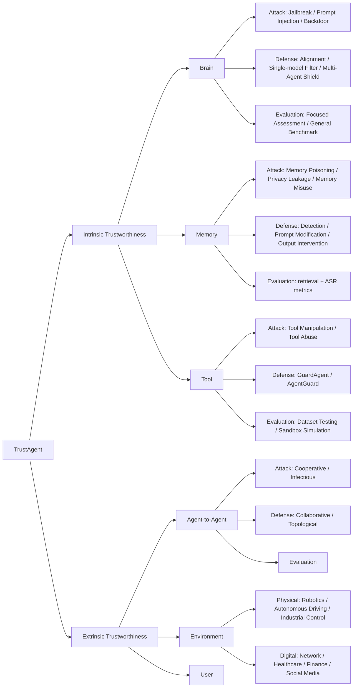

# A Survey on Trustworthy LLM Agents: Threats and Countermeasures — Summary

> [!NOTE]
> **Source:** [2503.09648-trustagent-survey.pdf](../../sources/arXiv/2503.09648-trustagent-survey.pdf) · Miao Yu, Fanci Meng, Xinyun Zhou, Shilong Wang, Junyuan Mao, Linsey Pang, Tianlong Chen, Kun Wang, Xinfeng Li, Yongfeng Zhang, Bo An, Qingsong Wen (Squirrel AI Learning, Salesforce, UNC Chapel Hill, Nanyang Technological University, Rutgers), 2025 · arXiv:2503.09648v1 [cs.MA], 12 Mar 2025 · [arxiv.org/abs/2503.09648](https://arxiv.org/abs/2503.09648).
> Study-guide summary of the full document. See the original for exact wording and figures.

## Abstract

This survey proposes **TrustAgent**, a framework for reasoning about the trustworthiness of LLM-based agents and multi-agent systems (MAS). Its thesis: adding modules (memory, tools, environment, other agents) to an LLM turns a static model into a dynamic "cognitive subject", which delivers a validated performance hierarchy (**MAS > Single Agent > LLM**) but is a double-edged sword — each new module expands the attack surface and creates trustworthiness problems that LLM-only research cannot cover.

**Key points**

- **Modular taxonomy.** Trustworthiness is split into **intrinsic** (internal modules: brain, memory, tool) and **extrinsic** (external interactions: agent-to-agent, agent-to-environment, agent-to-user). Each module is analysed through three technical lenses — **attack, defense, evaluation** — plus an insight/future-directions note.
- **Multi-dimensional connotation.** Agent trustworthiness spans five dimensions — **safety, privacy, truthfulness, fairness, robustness** — plus "others" (accountability, ethics, transparency, explainability). This extends the older 6–7 dimension LLM-trustworthiness taxonomies (Liu et al.; Huang et al.) into the agent context.
- **New agent-native threats.** Modules create attacks impossible in a plain LLM: **memory poisoning** and **privacy leakage** via RAG/vector databases; **tool manipulation/abuse** (agents autonomously hacking websites, exploiting one-day vulnerabilities); and — most distinctively — **infectious attacks** that self-propagate across a MAS (one poisoned agent's brain infects others, e.g. Agent Smith's single image jailbreaking a million agents exponentially fast).
- **Uneven defenses.** Countermeasures are relatively mature for the brain (alignment, single-model filters, multi-agent shields) but **notably scarce for tools**, and memory/inter-agent evaluation lacks systematic benchmarks.

**Takeaways**

- Agent safety ≠ LLM safety: it is emergent from interaction, context-dependent, multi-dimensional, and propagative — so static, single-model evaluation is insufficient and dynamic, collaborative, topology-aware methods are needed.
- The survey doubles as a map of open gaps: tool-invocation defenses, memory/agent-interaction benchmarks, environment-as-adversary modelling, and trust-calibration in agent-to-user interaction.

## 1. Introduction

The "LLM-based Agent" is an LLM **backbone** extended with modules — memory, tool, environment — transforming a static neural network into a dynamic cognitive subject capable of memory retrieval, tool use, and environmental interaction. Adding inter-agent communication yields **Multi-agent Systems (MAS)**, a "hyper LLM ecosystem" that is more intricate, interactive, and intelligent. Research and practice validate the hierarchy **MAS > Single Agent > LLM**.

But extra modules are a **double-edged sword**: they raise trustworthiness concerns across safety, privacy, fairness, and truthfulness, expand the attack surface, and challenge existing defenses and evaluations built only for LLMs or single agents.

Prior surveys fall short: Liu et al. dissect LLM trustworthiness into **seven** categories (alignment focus); Huang et al. (TrustLLM) into **six** perspectives (benchmark focus) — both only partially transfer to agents. Other agent surveys focus narrowly on security/privacy sub-aspects, or only on the LLM-as-brain issues, overlooking threats from the other modules.

> [!IMPORTANT]
> TrustAgent's distinguishing claim: extend "Trustworthy LLM" into "Trustworthy Agent" with a taxonomy that is **(I) Modular** — organised by internal/external components; **(II) Technical** — organised around attack/defense/evaluation implementation; and **(III) Multi-dimensional** — safety, privacy, truthfulness, fairness, robustness applied to both single agent and MAS.

**How TrustAgent compares to prior surveys** (Table 1): it is the only one covering **both LLM + Agent**, all three techniques (**Atk/Def/Eval**), modular structure, and MAS. Prior surveys cover subsets — e.g. Liu et al. (LLM, Atk/Eval), Huang et al. (LLM, Eval), He et al. (Agent, Atk/Def), Gan et al. (Agent, Atk/Def/Eval but not the full modular+MAS view).

### The three axes of the taxonomy (Figure 1)

| Axis | Content |
| --- | --- |
| **Multi-dimensional** | Safety, Privacy, Fairness, Robustness, Truthfulness, Others (accountability, ethics, transparency, explainability) |
| **Technical** | Attack, Defense, Evaluation (per module) |
| **Modular** | Internal modules (brain, memory, tool) + external modules (agent-to-agent, agent-to-user, agent-to-environment) |

Each module subsection follows a fixed shape: overview of the module's role → attacks → defenses → evaluations → insight/future directions.

## 2. Intrinsic Trustworthiness

The internal modules of an agent, defined as an independent entity with human-like cognition: a **brain** (§2.1) with **memory** (§2.2), acting through **tools** (§2.3).

### 2.1 Trustworthy LLM as Brain

The central LLM "brain" is the core reasoning/decision-making centre integrating inputs from auxiliary modules. Connecting it to other modules enhances ability but **expands the attack surface** — the brain in an agent/MAS faces more frequent, complex information dynamics (textual + visual, internal + external) than a single LLM. (Misalignment attacks that modify internal parameters are excluded — attackers usually lack such access.)

**Attacks** (three paradigms by manipulation mechanism):

| Paradigm | What it does | Examples |
| --- | --- | --- |
| **Jailbreak** | Bypass aligned safety via adversarial prompts | GCG + variants (optimised adversarial suffixes coercing a "Sure" reply); MRJ-Agent (single attack agent, multi-round covert prompts); PrivAgent (RL-trained attack agent leaking system prompts/training data); Evil Geniuses, PANDORA (MAS as attack optimisers, role-specific jailbreak, Red-Blue exercises); AgentSmith, Tan et al. (self-replicating images → **viral/infectious jailbreak**, exponential MAS spread) |
| **Prompt Injection** | Embed malicious prompts overriding original instructions | Manual injection into retrieved data (Greshake et al.); automated gradient/optimisation methods; multimodal perturbations in images/audio (Bagdasaryan et al.); cross-module surface exploitation causing repetitive/irrelevant actions → malfunction (Zhang et al.) |
| **Backdoor** | Insert triggers at training, retrieved at inference to force predefined generation | Two types (Yang et al.): manipulate final output (via query/observation triggers) vs. inject malicious intermediate reasoning without altering final output. DemonAgent (fragmented, dynamically-encrypted backdoor); BLAST ("infectious backdoor" spreading through agents' reasoning) |

**Defenses** (three paradigms by operational scope):

- **Alignment** — fine-tuning/reward updates to match human values: intrinsic reward functions, neuro-symbolic rule-learning (validated in Minecraft), fine-tuning on social-simulation data, iterative alignment via user feedback / belief networks (historical edits).
- **Single-model Filter** — an external model monitors input/output: embedding classifiers (Ayub et al.), small-model harmful-query detection (Kwon et al.), StruQ (structured queries), ShieldLM (fine-tuned safety detector), and **guardrail agents** GuardAgent / AgentGuard (safety-constraint generation, action checking, tool-use validation).
- **Multi-agent Shield** — collaborative MAS protects the target brain, differing by communication pattern: multi-agent **debate** (critique to consensus), a **reviewing** agent (Kwartler et al.), AutoDefense (role-assigned smaller models collaborating against jailbreak).

**Evaluation** (two dimensions):

- **Focused Assessment** — trustworthiness under specific attacks/domains: InjecAgent, AgentDojo (indirect prompt injection), AgentBackdoorEval/DemonAgent (backdoor), RedAgent (context-aware red teaming), RiskAwareBench (physical risk in embodied agents), RedCode (risky code execution).
- **General Benchmark** — systematic multi-dimensional evaluation: S-Eval (4 hierarchical levels, 8 risk dimensions), BELLS (safeguard tests), Agent-SafetyBench & Agent Security Bench, AgentHarm (**110** explicitly malicious tasks: fraud, cybercrime, harassment), R-Judge (**27** risk scenarios, multi-turn interaction records).

> [!TIP]
> **Insight (§2.1.4):** Collaborative attacks can spread brain-to-brain across a MAS, so **collaborative security** (agents monitoring/validating each other, distributed consensus before critical decisions) is needed. Static-dataset evaluation is insufficient given the brain's dynamic interactions — **dynamic, continuous-learning evaluation** in evolving real-time environments is called for.

### 2.2 Trustworthy Memory in Retrieval

Memory splits into **long-term** (usually RAG over a vector database of real-world data) and **short-term** (real-time interaction history: dialogue context, task logs). It boosts capability but adds trustworthiness risk.

**Attacks** (three types):

| Type | Mechanism | Sub-paradigms & examples |
| --- | --- | --- |
| **Memory Poisoning** | Inject malicious data into long-term memory, later retrieved to mislead output (undermines truthfulness; dangerous because *stealthy* — persists until detected) | ❶ Memory Injection: PoisonedRAG (optimised retrievable text), GARAG (genetic-algorithm adversarial examples), RobustRag/Zhong et al. (even small injections succeed with high probability). ❷ Backdoor: AgentPoison (optimised triggers on queries to boost malicious retrieval) |
| **Privacy Leakage** | Exploit the agent↔long-term-memory link to steal stored private data (enables phishing, identity trafficking) | ❶ Jailbreak: RAG-Thief (optimised anchor queries/adversarial commands), RAG-MIA (jailbreak templates). ❷ Embedding Inversion: restore original data from embeddings — Morris et al. (iterative text-hypothesis optimisation), Li et al. (generative decoder) |
| **Memory Misuse** | Craft query sequences to gradually bypass safety alignment via multi-turn interaction, exploiting short-term memory storage | ❶ Jailbreak: Agarwal et al. (flattering challenge + reiterated attack across rounds), Russinovich et al. (start harmless, steer toward harm). ❷ Backdoor: Tong et al. (triggers hidden across multi-turn dialogue, fire only when all appear) |

**Defenses** (three types):

- **Detection** — identify/remove harmful retrieved text: TrustRAG (K-means clustering on embeddings), Xian et al. (Mahalanobis-distance threshold), Agarwal et al. (LLM filters private-data-accessing prompt parts), ASB (perplexity- + LLM-based detection).
- **Prompt Modification** — make the query safer: Anderson et al. (prompt template that ignores direct DB-content requests), Agarwal et al. (security instructions / query rewriting to strip privacy-leaking parts).
- **Output Intervention** — intervene before final response: RobustRAG's **Isolate-then-Aggregate** (independent per-passage responses aggregated by keyword, so minority malicious passages are outvoted), Chen et al. (safety filter blocking unsafe tokens in multi-turn dialogue).

**Evaluation:** No systematic benchmark yet; common metrics extend beyond ASR to retrieval effectiveness — PoisonedRAG (precision/recall/F1 for malicious-text retrieval), AgentPoison (**ASR-r**, ASR for retrieval), Zeng et al. (quantity of retrieved private data), RAG-Thief (**CRR** chunk recovery rate, **SS** semantic similarity).

> [!WARNING]
> **Insight (§2.2.4):** Memory attacks lack cross-task generalisation (poisoning needs task-specific samples; misuse depends on dialogue context). Future defenses should act at the **vector-database end** (prevent toxic injection, reducing response-time defense cost); privacy needs query-rewriting/fine-tuning; misuse needs **multi-round adversarial dialogue training**. Systematic memory benchmarks are missing and recommended.

### 2.3 Trustworthy Tool for Action

Tools are the medium between the agent and the external world — gathering information (search engines) or reflecting decided actions outward (UI operations). Forms include API functions, sensors, embodied robots. Closer integration with agents imposes **stricter** trustworthiness demands than in plain LLMs, since some agent actions affect the real world, potentially causing more severe harm.

**Attacks** (two paradigms by the tool's role):

- **Tool Manipulation** — target specific steps of tool calling (planning, selection, execution) to induce malicious/sensitive behaviour:
  - ❶ **Jailbreak:** Cheng et al. (extract personal info from a code-gen agent), Imprompter / Fu et al. (gradient-optimised prompts/images inducing privacy-leaking or destructive tool calls).
  - ❷ **Prompt Injection:** BreakingAgents (malfunction — repetitive/irrelevant actions, with MAS propagation).
  - ❸ **Tool Injection:** ToolCommander (two-stage — inject malicious tools to steal queries, then manipulate tool selection → privacy theft + denial-of-service).
  - ❹ **Command Forgery:** AUTOCMD (an LLM trained on tool-calling data mimics valid commands to deduce sensitive info).
  - ❺ **Direct Manipulation:** Zhao et al. (tamper third-party API outputs → biased/incorrect behaviour).
- **Tool Abuse** — exploit the agent's tool-using capability to attack external entities: Fang et al. (agents autonomously hack websites; autonomously exploit real-world **one-day vulnerabilities**); BadAgent, Kumar et al. (backdoor or even refusal-based safety alignment can trigger harmful tool use).

**Defenses:** Research is **notably scarce**. GuardAgent (first step — guardrail code for task plans), AgentGuard (identifies unsafe tool-use workflows, generates safety constraints).

**Evaluation** (two paradigms):

- **Dataset Testing** — static adversarial-query datasets: ToolSword (attacks across input/execution/output phases), InjectAgent (indirect prompt injection during tool use), AgentHarm (harmfulness of sequential multi-tool invocation; jailbreak templates transfer effectively), PrivacyLens (privacy during tool execution).
- **Sandbox Simulation** — dynamic, controlled tool interactions for emergent multi-turn risks: ToolEmu (emulator LLM simulates tool execution + evaluator LLM assesses risk), HAICosystem (role-play sandbox + scenario checklists — finds LLMs riskier when acting as tool-equipped agents).

> [!CAUTION]
> **Insight (§2.3.4):** The key pain point is the **lack of tool defenses**. Suggested directions: review tools before integration, sandbox-simulate execution before real use; guard against **malicious API providers** (harmless-looking descriptions, malicious execution); and shift attack/defense/evaluation from single tool calls to **tool chains**.

## 3. Extrinsic Trustworthiness

External modules the agent interacts with during operation: **agent-to-agent** (§3.1), **agent-to-environment** (§3.2), **agent-to-user** (§3.3).

### 3.1 Agent-to-Agent Interaction

Inter-agent interaction (cooperation, competition, debate) shapes system dynamics but differs sharply in trustworthiness risk.

**Attacks:**

- **Cooperative Attack** — malicious agents collude to compromise interactions: Ju et al. (spread counterfactual/harmful info amplified by persuasion — truthfulness), Agent-in-the-Middle (intermediary intercepts/manipulates communication — robustness), Amayuelas et al. (adversarial persuasion), Evil Geniuses (compromised agents craft adversarial prompts — safety).
- **Infectious Attack** — malicious effects self-propagate through the MAS: Prompt Infection (silent adversarial diffusion → data theft, misinformation), CORBA (self-propagating, **topology-independent**, resource-draining), Agent Smith / Tan et al. (image-modality contagion accelerating MAS collapse), NetSafe (analyses how hallucination/misinformation propagate across MAS **topologies**).

**Defenses:**

- **Collaborative Defense** — cooperation/information-sharing to vet responses: BlockAgents (multi-round debate voting with Proof-of-Thought consensus, Byzantine-robust via blockchain), Audit-LLM, Chern et al. (debate for hallucination/safety/robustness), AutoDefense (adversarial prompt filtering), LLAMOS (dynamic attacker-defender equilibrium), PsySafe (targets dark-property injection).
- **Topological Defense** — use network structure to isolate/limit spread: GPTSwarm (topology optimisation for robustness), G-Safeguard (**graph neural networks** detect anomalies in discourse graphs across topologies).

**Evaluation:** In its infancy — SafeAgentBench/SafeAgentEnv (multi-agent execution, defense success rate), R-Judge (multi-turn interaction safety), JAILJUDGE (synthetic/adversarial/outdoor/multilingual risks, manually annotated, multi-agent evaluation).

> [!TIP]
> **Insight (§3.1.4):** **Infectious Attack** is a novel, severe MAS-level threat; future work should automate such attacks and build **anti-propagation defenses/evaluations**. Modelling MAS as **(temporal) graphs** (agents = nodes, interactions = directed edges) enables topology-based defense/evaluation. No research strictly evaluates inter-agent-interaction trustworthiness — a gap possibly filled by LLMs/agents as dynamic detectors; evaluation is the more urgent need.

### 3.2 Agent-to-Environment Interaction

Agents face unique risks getting information and acting in dynamic, heterogeneous environments (physical + digital). Because solutions are fragmented, the survey classifies by **environment** rather than technique (Figure 6).

**Physical Environment:**

- **Robotics:** Yang et al. (Linear Temporal Logic constraint module — safety-violation reasoning, unsafe-action pruning), SELP (equivalence voting + domain fine-tuning for safe task plans, e.g. drone navigation).
- **Autonomous Driving:** Hudson (formalise perception data into language + attack detection, causal reasoning under perception attacks), ChatScene (generate safety-critical scenarios via CARLA simulation).
- **Industrial Control:** Vyas et al. (validation + reprompting architecture, real-time error detection/recovery), Agents4PLC (verified PLC code generation via RAG + CoT).

**Digital Environment:**

- **Network:** Fang et al. (agents autonomously find/exploit web vulnerabilities), Debenedetti et al. (evaluate defenses, e.g. email-client management).
- **Healthcare:** Xiang et al. (knowledge-driven reasoning to protect medical data — privacy), Polaris (multi-agent architecture for reliable real-time patient-AI interaction — robustness).
- **Finance:** Chen et al. (risks: hallucination, temporal misalignment, adversarial vulnerability), Park et al. (role-play manager-analyst anomaly detection).
- **Social Media:** Jeptoo et al. (multi-agent fake-news detection), La et al. (simulate evasion of content regulation to aid regulation).

> [!WARNING]
> **Insight (§3.2.3):** The environment is usually treated as a **static backdrop**, with safety focused only on action outcomes — overlooking trustworthy agent-environment *interaction*, a real vulnerability (e.g. adversaries subtly altering environmental feedback). Systematic environment-agent attack/defense mechanisms and **cross-domain, interdisciplinary** evaluations are needed.

### 3.3 Agent-to-User Interaction

Focuses on the user perspective; the survey notes prior sections already cover much of it, so this is mainly discussion.

- **Discussion:** Research emphasises safety/reliability but **overlooks trust mechanisms** in the interaction process — notably how users *adjust* trust based on agent behaviour. Personalisation boosts engagement but risks manipulation (must be balanced with robustness). **Transparency** (clear explanations) helps users manage risk. Most work covers single-agent interaction; **multi-agent trust dynamics** are largely unexplored.
- **Insight (§3.3.2):** Develop **adaptive trust-calibration** frameworks (users dynamically adjust trust thresholds in real time); optimise feedback to reinforce good behaviour and prevent trust erosion; unify fairness/reliability across users and personalised agents; build **explainable agents** (interpretable reasons for decisions); in MAS, use **supervisor agents** to oversee user interactions for consistency.

## 4. Conclusion

The survey introduces six agent components (internal + external), summarising trustworthy-agent research per module across multiple dimensions from the attack/defense/evaluation perspectives, defining a typical method paradigm for each to standardise future work. It flags key gaps — **defense mechanisms for trustworthy tool invocation**, and **evaluation of trustworthiness in memory and agent interactions** — and offers future directions, emphasising the distinctive attributes of agents and MAS.

## Appendix A — Trustworthiness Definitions

The five dimensions, each defined for agents/MAS with MAS-level and agent-level manifestations:

| Dimension | Definition | MAS-level threats | Agent-level threats | Defenses cited |
| --- | --- | --- | --- | --- |
| **Safety** | Prevent harmful actions/outputs; guard against adversarial behaviour and system failure | Cooperative attacks (Evil Geniuses), infectious attacks (Agent Smith self-replicating images → exponential spread) | Jailbreak (MRJ-Agent), prompt injection (BreakingAgents) on the brain | Multi-agent debate (BlockAgents), guardrail agents (GuardAgent) |
| **Privacy** | Protect user data and autonomy; prevent leakage via inter-agent communication | Prompt Infection (spreads adversarial prompts to steal data), ToolCommander (manipulate tool selection to leak) | Memory poisoning (PoisonedRAG), embedding inversion | Query rewriting (Anderson et al.), multi-round adversarial dialogue training |
| **Truthfulness** | Accurate, reliable, consistent generation; avoid misinformation propagation | Topological spread (CORBA, NetSafe's hallucination-propagation analysis) | Hallucination worsened by tool misuse (faulty API returns) or environmental misalignment (perception attacks) | Multi-agent debate (Du et al.), graph anomaly detection (G-Safeguard) |
| **Fairness** | Impartial user treatment, equitable resource allocation, no bias | Resource monopolisation (high-capability agents dominating API access), task-allocation bias (GPTSwarm central-node overload) | Memory-retrieval bias (underrepresented RAG data), tool-access disparity (privileged agents) | Dynamic resource scheduling (game-theoretic), federated reward mechanisms |
| **Robustness** | Maintain stable performance under uncertainty and adversarial conditions | Topological vulnerabilities (GPTSwarm optimisation failures), dynamic environmental change | Tool-chain failures (ToolEmu execution errors), memory corruption (GARAG poisoning) | Topology-guided defense (G-Safeguard GNNs), real-time error detection (Vyas et al.) |

**Others:** Trustworthiness also spans **accountability** (traceable actions, e.g. blockchain logging in finance, preventing blame-shifting), **ethics** (aligning with human values, addressing bias/misuse), **transparency** (revealing internal processes, e.g. tool-selection logic), and **explainability** (clear justifications, e.g. natural-language explanations in healthcare).

## Appendix B — Comprehensive Taxonomy (Figure 7)

The full taxonomy tree confirms the modular structure and populates each leaf with references:

## How agent trustworthiness differs from LLM safety

The survey's throughline — why agent trustworthiness is a distinct problem, not just LLM safety re-labelled:

- **Emergent from interaction, not the model alone.** Risks arise from the *added modules* and their interactions (brain↔memory↔tool↔environment↔other agents), not just the weights. Threats such as memory poisoning, tool abuse, and infectious attacks have no single-LLM analogue.
- **Multi-dimensional.** Five dimensions (safety, privacy, truthfulness, fairness, robustness) plus accountability/ethics/transparency/explainability — extending, and re-grounding in agent mechanics, the 6–7 dimensions earlier LLM surveys defined.
- **Propagative (MAS-level).** Inter-agent communication lets a single compromised agent infect many (Agent Smith, BLAST, CORBA, Prompt Infection), a class of "infectious" threat the survey flags as novel and severe.
- **Context-dependent and dynamic.** Agents continuously adapt to their environment, so behaviour is variable and static-dataset evaluation is insufficient — dynamic, real-time, collaborative, and topology-aware evaluation/defense are required.
- **Real-world consequence.** Because tools let agents act on the world (hacking sites, exploiting one-day vulnerabilities, driving cars, industrial control), tool-related failures can be far more harmful than an LLM's text output — yet tool defenses are the least developed area.
