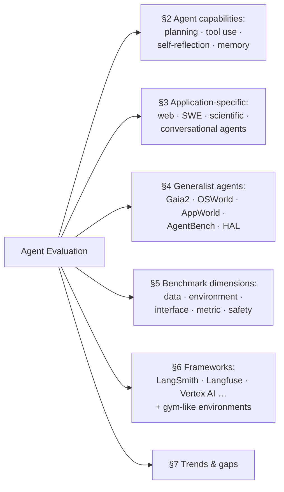

# A Survey on Evaluation of LLM-based Agents — Summary

> [!NOTE]
> **Source:** [2503.16416-llm-agent-evaluation-survey.pdf](../../sources/arXiv/2503.16416-llm-agent-evaluation-survey.pdf) · Asaf Yehudai, Lilach Eden, Alan Li, Guy Uziel, Yilun Zhao, Roy Bar-Haim, Arman Cohan & Michal Shmueli-Scheuer (Hebrew University of Jerusalem, IBM Research, Yale University), 2025 · arXiv preprint, <https://arxiv.org/abs/2503.16416> (v2, revised 23 April 2026).
> Study-guide summary of the full document. See the original for exact wording and figures.

## Abstract

The first comprehensive survey of evaluation methods for LLM-based agents. It maps the field across five perspectives — (1) core agent capabilities (planning, tool use, self-reflection, memory), (2) application-specific benchmarks (web, software engineering, scientific, conversational agents), (3) generalist-agent benchmarks, (4) shared benchmark dimensions (data curation, environment, interface, metric, safety), and (5) developer-facing evaluation frameworks — then names the field's trends and gaps.

**Key points**

- **Agents need a new evaluation paradigm.** Static text-to-text LLM benchmarks cannot assess sequential decision-making in dynamic environments; agent benchmarks must test task completion via sequences of actions and must co-evolve with agent capabilities.
- **Four fundamental capabilities are evaluated separately:** planning/multi-step reasoning (PlanBench, FlowBench, Natural Plan — SOTA models still struggle with long-horizon planning), function calling and tool use (BFCL v1→v3, ToolBench, ComplexFuncBench, now MCP-server-based frontier benchmarks like MCP Atlas and Tool Decathlon), self-reflection (LLF-Bench, LLM-Evolve — no standardised benchmark exists yet), and memory (episodic/semantic/procedural; StreamBench, MemBench — long-range consistency remains weak).
- **Application benchmarks got dramatically more realistic:** web agents moved from toy simulations (WebShop) to real-site environments (Mind2Web, WebArena); SWE agents from HumanEval-style snippets to real GitHub issues (SWE-bench Verified, the de facto standard, 500 human-validated tasks) and paid freelance work (SWE-Lancer: 1,400 Upwork tasks worth over $1M; SWE-bench Pro: 1,865 tasks where models stay below 25% Pass@1).
- **Two trends:** a shift toward realistic, challenging, long-horizon evaluations approximating professional workflows, and "live" benchmarks continuously updated to fight saturation (BFCL versions, the SWE-bench family).
- **Five named gaps:** fine-grained/trajectory-level metrics (binary end-to-end success obscures failure diagnosis), cost-and-efficiency metrics (token usage, API expense, inference time — capability-first evaluation breeds resource-hungry agents), scalable/automated evaluation (synthetic data, LLM/agent-as-judge), safety and policy compliance (rarely tested; robustness via pass^k; "guardrail" metrics needed to penalise non-compliant success), and decoupling backbone-LLM evaluation from agent-harness evaluation.

**Takeaways**

- Evaluate agents on what they *do* over a trajectory, not what they *say* at the end — and expect any static benchmark to saturate and be replaced.
- Task-success numbers alone are misleading buy-signals: cost, robustness across repeated runs (pass^k), and policy compliance are precisely the dimensions current benchmarks skip.
- Practical benchmark picks (Appendix E): WebArena (dynamic web), SWE-bench Verified (coding, ~80% top score, near saturation; SWE-bench Pro at ~46% for headroom), τ-bench (conversational), GAIA (generalist reasoning), OSWorld (GUI), AppWorld (tool interface), HAL for cross-domain comparison.

## 1 Introduction

LLMs are static — fixed knowledge, text-to-text interaction. LLM-based agents build on an LLM backbone integrated into multi-step workflows with external tools, so they can compute, retrieve current information, and autonomously plan, execute, and adapt strategies in real-world settings. This shift demands evaluation beyond textual outputs: benchmarks must assess sequential decision-making within dynamic environments and co-evolve with agent capabilities. The survey addresses developers, benchmark creators, practitioners, and researchers, and maintains a companion GitHub repository tracking the field.

The survey's structure (its Figure 1):

## 2 Agent Capabilities Evaluation

An LLM-based agent = a backbone LLM + an agent harness. Four core abilities can each be evaluated in isolation or within a full agent workflow (expanded in Appendix B).

**Planning and multi-step reasoning** — decomposing problems into subtasks and creating strategic execution paths. Multi-hop LLM reasoning benchmarks (e.g. HotpotQA) were repurposed for agent approaches like ReAct; PlanBench adapts classical planning tasks and reveals long-term-planning gaps; FlowBench tests structured-workflow following; Natural Plan poses real-world planning tasks in natural language, with newer work on long-horizon planning under verifiable constraints. **Even SOTA models struggle with long-horizon planning.** Appendix B distils five abilities these benchmarks probe: task decomposition, state tracking/belief maintenance, self-correction, causal understanding of action outcomes, and meta-planning. Multi-step reasoning typically means 3–10 intermediate logical steps.

**Function calling and tool use** — sub-tasks include intent recognition, function selection, and parameter–value mapping (Appendix B adds function execution and response generation). Evaluation evolved in stages:

| Stage | Benchmarks | Character |
|---|---|---|
| Early, one-step | ToolAlpaca, ToolBench, BFCL v1 | Synthetic data, explicit parameters, rule-based matching (pass rates, structural accuracy) |
| Multi-turn / multi-step | BFCL v2–v3, NESTFUL, ComplexFuncBench | Continuous state management; nested calls whose outputs feed later calls; implicit parameter inference, user constraints, long context |
| Agentic / real tools | MCP Atlas (Scale), Tool Decathlon | Longer interactions; domains and tools sourced from real MCP servers; still challenging despite model advances |

Appendix B adds ToolSandbox (stateful execution, built-in user simulator), Seal-Tools, API-Bank, API-Blend, RestBench, APIGen, StableToolBench (virtual API server to stabilise flaky live APIs).

**Self-reflection** — self-correcting by adjusting reasoning or actions from feedback. Early work repurposed existing benchmarks into multi-turn feedback loops; LLM-Evolve reuses past feedback as in-context examples; LLF-Bench assesses feedback-driven decision-making across diverse environments (with randomised instruction wording to reduce overfitting); Reflection-Bench decomposes reflection cognitively (perception, memory use, belief updating after surprise, counterfactual reasoning, meta-reflection).

> [!WARNING]
> A standardised benchmark or methodology for assessing self-reflection remains a critical gap — measured improvement often depends on unstandardised prompting techniques.

**Memory** — managing information across extended interactions, in three types: **episodic** (past interactions), **semantic** (factual knowledge), **procedural** (operational information). Early studies used long-context benchmarks; dedicated agentic-memory benchmarks now exist — episodic (continual improvement across multi-session tasks, e.g. StreamBench) and semantic (retrieval effectiveness and long-range understanding, e.g. MemBench, MemoryAgentBench) — revealing that current methods remain limited in long-range consistency and dynamic memory. Appendix B notes LTM-benchmark's finding that LLMs handle single tasks well but struggle with interleaved tasks, and that short-context LLMs with long-term memory systems can match or exceed larger-context models.

## 3 Application-Specific Agents Evaluation

Four representative application classes (of many: web, software, game, embodied, search, scientific).

### 3.1 Web Agents

E-commerce, information search, personal-assistant tasks. Early work was simplified simulation (MiniWoB; WebShop simulates online shopping from search to checkout). The field then shifted to realistic environments — the two foundations are **Mind2Web** (offline: real websites, rich interactions, intermediate-goal evaluation against gold actions) and **WebArena** (dynamic: fully functional multi-domain websites, long-horizon human tasks with functional-correctness tests). Extensions cover multi-turn dialogue, enterprise knowledge-worker workflows (WorkArena/WorkArena++), multi-site time-intensive tasks (AssistantBench), granular performance analysis, and LLM-as-a-judge scoring. **ST-WebAgentBench (Levy et al., 2024) stands out for evaluating safety and trustworthiness — policy compliance and risk mitigation.** Multimodal benchmarks (VisualWebArena, MMInA, WebVoyager) require integrating visual and textual signals via a GUI; WebVoyager gained commercial traction but shows over-optimistic estimates, with Online-Mind2Web proposed as a more rigorous alternative.

### 3.2 Software Engineering Agents

From short, self-contained coding tasks (HumanEval) to end-to-end real-world evaluation:

- **SWE-bench** (Jimenez et al., 2023): real GitHub issues with full repository context, executable Docker environments, and validation tests for automatic patch verification.
- Follow-ups fixed evaluation flaws (overly specific/unrelated unit tests, underspecified issues, broken setups): SWE-bench Lite, SWE-bench+, and — most adopted — **SWE-bench Verified** (OpenAI, 2024): a human-validated 500-sample subset with containerised execution and difficulty annotations; **the de facto standard for SWE agents.**
- Extensions: multilingual, multimodal, test generation from issues (TDD-Bench Verified, SWT-Bench), IT automation (ITBench), interactive terminal use (Terminal-Bench).
- Harder and more realistic: **SWE-Lancer** — 1,400 freelance tasks from Upwork with total payouts over $1M, mixing technical fixes and managerial decisions (scored by verified tests or comparison to human managers' choices); exposes gaps in long-term reasoning and decision-making. **SWE-bench Pro** — 1,865 human-verified tasks across 41 repositories, often multi-file and hours of effort; model performance remains below 25% Pass@1.

### 3.3 Scientific Agents

Progressed from knowledge recall/reasoning and literature understanding to full-research-pipeline benchmarks: (1) **scientific ideation** (novel expert-level research ideas); (2) **experiment design** (AAAR-1.0: planning, hypothesis formulation, methodology, rigour); (3) **code generation** (SciCode, ScienceAgentBench, CORE-Bench, PaperBench — accurate, executable scientific code); (4) **peer review** (substantive review generation). The field is moving toward full-research-cycle benchmarks. Appendix C adds unified frameworks (gym-style workflow simulators, DiscoveryWorld, LAB-Bench for biology) and **deep-research agents**: Patel et al. (2025) propose evaluating them on retrieval quality, knowledge synthesis, and verifiability; agent-as-a-judge evaluation shows deep-research agents achieving 50–70% of human performance.

### 3.4 Conversational Agents

Goal-directed multi-turn dialogue (booking flights, customer support), extending Task-Oriented Dialogue Systems (TODS) from text-only to environment-interacting tasks. Early TODS benchmarks: MultiWOZ, SMCalFlow, ABCD. **τ-Bench** (Sierra) tests agents interacting with simulated users using API tools while adhering to domain policies (retail, airline) — dominant, but limited in scale and user simulation, and only coarse end-to-end metrics that overlook policy violations and dialogue-flow errors. **τ²-Bench** adds a Telecom domain where the *user* also acts via tools in a shared dynamic environment, plus a compositional task generator producing diverse verifiable tasks. IntellAgent auto-generates synthetic test scenarios from database schemas and policy documents (results correlate highly with τ-Bench); ALMITA uses a hybrid intent-graph-plus-manual-filtering pipeline for realistic customer-support scenarios.

## 4 Generalist Agent Evaluation

Agents are transitioning from application-specific to general-purpose, requiring integrated planning, reasoning, tool use, web interaction, file handling, and code execution. Two complementary approaches:

1. **Inherently broad benchmarks.** GAIA: human-crafted real-world questions requiring reasoning, multimodality, browsing, and tool use — conceptually simple for humans, hard for agents; its easier portion saturated, prompting **Gaia2**, a mobile environment (email, messaging, calendar apps) adding ambiguity, noise, temporal constraints, and multi-agent collaboration. Full computer environments: **OSWorld** (UI interaction), **AppWorld** (code/API interaction), TheAgentCompany (simulated software company: browse internal sites, write code, collaborate), CRMArena (enterprise CRM with UI+API and domain policies), WindowsAgentArena.
2. **Unifying task-specific benchmarks.** AgentBench spans OS operations, databases, games, household tasks; **HAL (Holistic Agent Leaderboard)** unifies benchmarks across coding, web, and other domains. Neither runs the *same agent harness* across every environment — Harbor and Exgentic propose unified protocols as first steps toward holistic, standardised, cross-environment evaluation.

## 5 Core Benchmark Dimensions

Benchmarks analysed along five orthogonal dimensions: data curation, environment, interface, metric, safety. The survey's Table 1 (reproduced):

| Benchmark | Data | Environment | Interface | Metric | Safety |
|---|---|---|---|---|---|
| SWE-bench Verified | Hybrid | Dynamic | Code | Unit tests | No |
| SWE-Lancer | Hybrid | Dynamic | Code | End-to-end | No |
| Mind2Web | Hybrid | Static | GUI | Action match | No |
| WebArena | Hybrid | Dynamic | GUI | Mix | No |
| PaperBench | Hybrid | Dynamic | Code | End-to-end | No |
| τ-Bench (TAU-Bench) | Hybrid | Dynamic | Tools | State match | Yes |
| AppWorld | Hybrid | Dynamic | Tools | State match | No |
| GAIA | Human | Dynamic | Mix | Answer match | No |

- **Data curation.** Most benchmarks use hybrid strategies: SWE-bench Verified refines harvested GitHub issues by human validation; AppWorld builds a synthetic "world" of 100 fictitious users validated by programmatic checks; Mind2Web cleans and annotates real interaction logs; GAIA is fully human-crafted. Tension: human annotation ensures validity but doesn't scale — automation without quality loss is the open need.
- **Environment.** *Static* environments (offline traces, cached pages — original Mind2Web) scale but miss the cascading effects of errors; *dynamic* environments (Docker containers, browser sandboxes) let actions alter observed state, enabling diagnosis of long-horizon failure modes. Benchmarks must move toward dynamic.
- **Interaction interface.** Three types: **code/terminal** (Python/Bash/SQL — dominant in SWE and scientific), **tools** (predefined function calls with schema adherence — τ-Bench, AppWorld), **GUI** (accessibility trees / visual UI — web and consumer applications, tests visual grounding).
- **Metric.** Task completion is ubiquitous but implemented differently: execution-based unit tests (SWE), state matching against a gold state (τ-Bench), answer matching for short-form responses (GAIA). Binary outcome metrics cannot expose intermediate progress — hence the call for fine-grained evaluation.
- **Safety and robustness.** Robustness quantified via **pass^k** — the fraction of tasks the agent succeeds on across *all* k independent runs. Policy adherence (data privacy, access control) is rarely tested; SWE-Lancer doesn't penalise risky behaviour unless it breaks the target behaviour. Future benchmarks need "guardrail" metrics penalising success achieved via non-compliant actions (e.g. deleting production databases).

## 6 Frameworks for Agent Evaluation

Unlike fixed benchmarks, developer frameworks integrate into the development cycle for continuous monitoring, evaluation, error analysis, and optimisation: LangSmith, Langfuse, Google Vertex AI evaluation, Arize AI, Galileo Agentic Evaluation, Patronus AI, W&B Weave, LangChain AgentEvals, Databricks Mosaic AI (mostly RAG-like tasks), Botpress and AutoGen (multi-agent). All monitor trajectories with metrics like task-completion rate, latency, execution speed, sometimes throughput and memory; several build on OpenTelemetry.

Quality assessment operates at three granularities:

- **Final-response evaluation** — LLM judges against criteria (faithfulness, politeness); some offer proprietary judge models (Databricks Mosaic, Patronus AI). Fast, cheap, automatable — but blind to intermediate decisions, efficiency, and failure causes.
- **Stepwise evaluation** — judging individual LLM generations, tool invocations, routing decisions for error localisation; tool-specific checks of tool choice, parameter schemas, output usability; Arize Phoenix ships stage-specific templates (routing, planning, retrieval, reflection). Assumes steps are independently assessable — Galileo's goal-progress "action advancement" metric addresses inter-step dependence.
- **Trajectory-based assessment** — *reference-based* (align observed vs gold action sequence: exact/partial/unordered/subset matching; AgentEvals adds graph-based node/transition checking) vs *reference-free* (LLM judges score coherence, efficiency, goal-directedness without a gold path). Reference-based is precise but brittle (many valid paths exist; references are costly); reference-free is flexible but less reliable. Same tension in judge design: general-purpose judges = broad but imprecise; task-specific = precise but narrow.

Framework capabilities (survey's Table 2):

| Framework | Stepwise | Monitoring | Trajectory | Human-in-loop | Synthetic data | A/B |
|---|---|---|---|---|---|---|
| LangSmith | ✓ | ✓ | ✓ | ✓ | × | ✓ |
| Langfuse | ✓ | ✓ | × | ✓ | × | ✓ |
| Google Vertex AI | ✓ | ✓ | ✓ | × | × | ✓ |
| Arize AI | ✓ | ✓ | × | ✓ | ✓ | ✓ |
| Galileo Agentic | ✓ | ✓ | × | ✓ | × | ✓ |
| Patronus AI | ✓ | ✓ | × | ✓ | ✓ | ✓ |
| AgentEvals (LangChain) | × | × | ✓ | × | × | × |
| Mosaic AI (Databricks) | ✓ | ✓ | × | ✓ | ✓ | ✓ |

> [!WARNING]
> Open framework challenges: (1) cross-run insight is unsupported — root-causing agent failures at scale, and causally attributing outcome differences to specific steps, is not yet possible; (2) frameworks ignore the cost of evaluation itself when scaling LLM judges over many traces; (3) most lack built-in safety/policy-compliance evaluation.

**Gym-like environments** — controlled, interactive simulations inspired by OpenAI Gym, adapted for training and evaluating LLM agents with standardised cross-benchmark evaluation: BrowserGym (web), MLGym (AI research agents), SWE-Gym (software engineering).

## 7 Discussion

### 7.1 Current Trends

- **Realistic and challenging evaluation.** From simplified static settings to dynamic real-world ones (WebShop → WebArena; synthetic coding → real GitHub issues), and growing interest in long-horizon tasks normally done by highly trained human experts — pushing evaluation toward real professional workflows.
- **Live benchmarks.** Static benchmarks quickly become obsolete, saturated, and abandoned; the response is continuously updated benchmarks (BFCL's versions; the SWE-bench family: Verified, Pro, …) that match rising capabilities, fix prior flaws, and adapt to ecosystem shifts such as MCP-based tool calling.

### 7.2 Future Directions (the gaps)

| Gap | What's missing | What the survey calls for |
|---|---|---|
| **Granular evaluation** | Coarse end-to-end success obscures intermediate decisions (tool selection, reasoning quality) | Standardised fine-grained, step-by-step trajectory metrics |
| **Cost and efficiency** | Performance-first evaluation breeds capable but resource-intensive agents (citing Kapoor et al. 2024) | Cost efficiency as a core metric: token usage, API expenses, inference time, resource consumption |
| **Scaling & automating** | Static human-annotated data is resource-intensive and dates quickly | Synthetic data generation; LLM/agent-as-a-judge |
| **Safety and compliance** | Little testing of adversarial robustness, bias mitigation, organisational/societal policy compliance | Safety metrics inside benchmarks plus dedicated realistic safety benchmarks — especially multi-agent settings with emergent risks (Hammond et al., 2025) |
| **Decoupling LLM & harness** | Benchmarks conflate backbone-LLM capability with harness (scaffold) design | Controlled protocols varying each factor independently (Harbor, Exgentic are first steps) |

## 8 Conclusion

The field has progressed from assessing isolated capabilities in simplified settings to evaluating agents in realistic, dynamic, challenging environments. Future work should build fine-grained, scalable methods beyond overall success rates and standardise cost-efficiency, safety, and robustness metrics for responsible deployment.

## Limitations (authors' own)

A snapshot of an exceptionally fast-moving field (mitigated by their continuously updated GitHub repository); representative rather than exhaustive benchmark selection; breadth constrains per-benchmark depth; the "future directions" involve interpretive foresight.

## Appendices (highlights)

- **A — Methodology:** systematic search (Google Scholar, ACL Anthology, HuggingFace Papers, arXiv) with forward/backward citation snowballing; inclusion required a novel benchmark, framework, or evaluation-methodology contribution (agent architectures without evaluation contributions, and purely static LLM evaluation, excluded); validated by consulting domain experts and benchmark creators.
- **B — Capability detail:** expanded per-capability benchmark reviews (folded into §2 above).
- **C/D — Extra applications:** deep-research agent evaluation (retrieval quality, synthesis, verifiability; 50–70% of human performance) and realistic-workplace benchmarks (TheAgentCompany, CRMArena).
- **E — Benchmark recommendations** (selection criteria: community adoption, active maintenance, reporting standards in recent literature):

| Domain | Recommendation | Notes |
|---|---|---|
| Web (dynamic) | WebArena | Top performance 74.3% as of 19 Apr 2026 — headroom remains |
| Web (static) | Mind2Web | Standard for cached-trace evaluation |
| Web (online/multimodal) | WebVoyager; Mind2Web-Live / Online-Mind2Web | Latter two newer, more reactive |
| SWE | SWE-bench Verified | Gold standard, but top scores ~80% — near saturation |
| SWE (harder) | SWE-bench Pro | SOTA ~46% |
| SWE (specialised) | SWE-Lancer (freelance tasks); Terminal-Bench (CLI) | |
| Conversational | τ-bench | Community standard despite high success rates; no adopted alternative |
| Generalist (reasoning) | GAIA | |
| Generalist (tools) | AppWorld | |
| Generalist (GUI) | OSWorld | |
| Holistic | HAL | Standardises cross-domain comparison |
