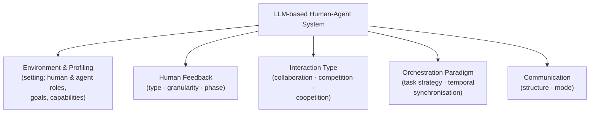

# LLM-Based Human-Agent Collaboration and Interaction Systems: A Survey — Summary

> [!NOTE]
> **Source:** [2505.00753-llm-has-survey.pdf](../../sources/arXiv/2505.00753-llm-has-survey.pdf) · Henry Peng Zou, Wei-Chieh Huang, Yaozu Wu, Jizhou Guo, Yankai Chen, Chunyu Miao, Hoang Nguyen, Yue Zhou, Weizhi Zhang, Liancheng Fang, Hanrong Zhang, Fangxin Wang, Pengfei Zhang, Huacan Wang, Langzhou He, Yangning Li, Dongyuan Li, Renhe Jiang, Xue Liu & Philip S. Yu, 2025 · [arXiv:2505.00753](https://arxiv.org/abs/2505.00753) (v5, cs.CL; no conference venue is printed on the PDF — cite as an arXiv preprint).
> Study-guide summary of the full document. See the original for exact wording and figures.

## Abstract

The first comprehensive survey of **LLM-based Human-Agent Systems (LLM-HAS)** — interactive frameworks where humans actively provide information, feedback, or control to an LLM-powered agent — arguing that human involvement, not full autonomy, is the practical path to performant, reliable, and safe agent systems.

**Key points**

- **Full autonomy faces three critical hurdles:** (1) *reliability* — hallucination generates plausible-but-wrong outputs whose errors compound when actions are chained; (2) *complexity* — agents stall on tasks needing deep domain expertise, long multi-step execution, or strict long-context consistency; (3) *safety and ethical risk* — unintended harmful actions, amplified bias, and accountability gaps in finance, healthcare, and security.
- **LLM-HAS definition:** systems where humans actively (1) provide information/clarification (credentials, domain expertise, constraints), (2) provide feedback/error correction, and (3) take control — retaining authority to override, redirect, or halt agents in high-stakes scenarios.
- **Five core components** organise the taxonomy: **Environment & Profiling**, **Human Feedback**, **Interaction Types** (collaboration, competition, coopetition), **Orchestration Paradigm** (task strategy + temporal synchronisation), and **Communication** (structure + mode).
- **Four-way human-feedback taxonomy:** *evaluative* (ratings/rankings — easy to collect, weak signal), *corrective* (direct edits — highly informative, high effort), *guidance* (proactive instructions/demonstrations/critiques), and *implicit* (inferred from observed behaviour — unobtrusive but ambiguous); each further varies by granularity (holistic vs segment-level) and phase (initial setup, during task, post-task).
- **Human Agency Scale (A1–A5):** a system-level framework quantifying desired human involvement, from A1 Full Automation to A5 Human-Driven; A1–A2 = automation (agent replaces effort), A3–A5 = augmentation (agent enhances humans).
- **Empirical skew across 61 surveyed papers:** conversation dominates communication modes (88.5%), one-by-one turn-taking dominates task strategy (90.2%), guidance is the commonest feedback type (63.9%), and implicit feedback is the least used (24.6%) — an under-explored opportunity.
- **Open challenges:** human flexibility/variability (and the gap between simulated and real humans), mostly agent-centred designs that relegate humans to passive evaluators, evaluation that ignores human workload and cognitive load, and unresolved safety/privacy vulnerabilities.

**Takeaways**

- Design agent systems for *synergy*: combine human intuition, expertise, and ethical judgement with agent knowledge recall, speed, and language processing — the paper positions this as a paradigm shift away from pure automation.
- Pick the human-agency level (A1–A5) to match the task: routine well-structured tasks suit A1–A2; open-ended/creative tasks and high-stakes domains (healthcare, finance, legal) demand A3–A5 with supervision, synchronous orchestration, and continuous feedback loops.
- Effective collaboration arises from complementary learning signals — recent systems hybridise prompting, SFT, and RL rather than betting on a single implementation strategy.

## 1. Introduction

- Enthusiasm for fully autonomous LLM agents (perceive → decide → act, with memory, planning, tool use) collides with three hurdles: **reliability** (hallucination undermines trust, especially when actions are chained), **complexity** (agents struggle with tasks needing deep domain expertise, long multi-step execution, nuanced reasoning, dynamic adaptation, or strict long-context consistency — e.g. scientific research), and **safety/ethical risks** (unintended harmful actions, amplified societal bias, accountability gaps in finance, healthcare, security).
- The persistence of these challenges suggests **full autonomy may be unsuitable for many real-world applications**, underscoring "the indispensable role of human involvement": information, clarification, domain knowledge, feedback, corrections, oversight, and control.
- Surveys exist for autonomous LLM agents, multi-agent systems, and specific applications, but this is (to the authors' knowledge) **the first survey dedicated to LLM-based human-agent systems**. A companion GitHub repository (Awesome-Human-Agent-Collaboration-Interaction-Systems) tracks the fast-moving field.

## 2. LLM-Based Human-Agent Systems (definition)

> [!IMPORTANT]
> **LLM-HAS** = "interactive frameworks where humans actively provide additional information, feedback, or control during interaction with an LLM-powered agent to enhance system performance, reliability, and safety." The core idea is **synergy**: human intuition, creativity, expertise, ethical judgement, and adaptability combined with agent knowledge recall, computational speed, and language processing.

Humans contribute in three ways:

1. **Providing information/clarification** — things agents lack or cannot reliably infer: login credentials, payment details, domain expertise, constraints, ambiguity resolution.
2. **Providing feedback/error correction** — from simple ratings to complex critiques, demonstrations, or corrections.
3. **Taking control/action** — in high-stakes or sensitive scenarios (healthcare, privacy, ethics), humans retain authority to override, redirect, or halt agent actions, ensuring accountability, safety, and value alignment.

## 3. Core Components

The survey analyses LLM-HAS through five core aspects, "a unified standard for analyzing existing work and guiding the design of future systems."

### 3.1 Environment and Profiling

- **Environment setting:** a shared interaction space, either physical (e.g. offices) or fully simulated/virtual under controlled conditions. Configurations span **single-human single-agent, single-human multi-agent, multi-human single-agent, and multi-human multi-agent** setups.
- **Human profiling:** users divide broadly into **lazy** (minimal guidance — binary correctness or scalar ratings) and **informative** (demonstrations, detailed guidance, refinements, even taking over parts of the task).
- **Agent profiling:** roles and capabilities range from versatile general assistants to specialised experts (mathematics, engineering, medicine, robotic cleaning).

### 3.2 Human Feedback

**Feedback type** — the four-way taxonomy (Table 1 in the paper):

| Type | Definition | Trade-offs | Example systems |
|---|---|---|---|
| **Evaluative** | Assessment of output quality: binary, scalar rating, or preference ranking (the basis of RLHF) | Easy to collect, scalable; less specific improvement signal | Uni-RLHF, EmoAgent, MINT, SOTOPIA |
| **Corrective** | Direct edits or fixes to agent behaviour | Highly informative, clear signal; higher user effort, often fine-grained | PRELUDE (learns latent preferences from user edits), SWEET-RL, AI Chains |
| **Guidance** | Human proactively provides instructions, demonstrations, or critiques | Bootstraps learning, conveys complex goals proactively; requires clear specification | InteractGen, AutoManual, Drive As You Speak, Ask Before Plan |
| **Implicit** | Inferred from observed user actions or control signals, not explicit statements | Natural, unobtrusive; ambiguous, needs careful interpretation | VeriPlan (control sliders), AgentA/B (clicks/purchases), MTOM |

**Feedback granularity:**

- **Coarse-grained/holistic** — one assessment for the whole output; simple to collect (standard RLHF) but struggles with credit assignment.
- **Fine-grained/segment-level** — targets specific sentences, turns, or code blocks (ConvCodeWorld, PDFChatAnnotator); more precise learning signal, crucial for debugging, but higher user burden.

**Feedback phase:**

- **Initial setup & goal definition** — before execution: configuring coordination strategies (AgentCoord), critiquing plans (Ask-before-Plan). Proactive alignment, prevents costly errors.
- **During task execution** — online, interactive: instruction editing (InstructEdit), mid-task refinements (Mutual Theory of Mind, Collaborative Gym), online interventions (HG-DAgger, InterruptBench). Enables real-time adaptation.
- **Post-task evaluation & refinement** — after completion: feedback loops for benchmarking/offline learning (MAIH, EmoAgent); AdaPlanner archives successful plans as reusable skills. Non-disruptive but cannot affect the completed task.

### 3.3 Human-Agent Interaction Types

Interactions in LLM-HAS are more dynamic and complex than in multi-agent systems. Three top-level types, with collaboration split into four subtypes:

| Interaction type | Definition | Examples |
|---|---|---|
| **Collaboration** (most common, foundational) | Humans and agents work toward a common goal | see subtypes below |
| — Delegation & direct command | Controlling party (usually human) assigns explicit upfront instructions; agent executes a predetermined set of tasks rather than adapting | FinArena (investor sets risk preference), Drive as you Speak |
| — Supervision | Human oversees, monitors, and guides in real time — alert thresholds, corrective inputs, a continuous feedback loop that catches errors before they propagate | Agents notify humans to verify alignment; teleoperators monitor LLM motion plans |
| — Cooperation | Voluntary joint effort — pooled resources, mutual assistance toward a shared result | PARTNR household activities, CoELA embodied agents |
| — Coordination | Aligning and synchronising actions to *avoid conflict* — clear communication, strategic planning, intentional task division | Shared-workspace interdependent tasks (MTOM), AgentCoord |
| **Competition** | Participants pursue their own conflicting goals; needs balancing mechanisms (performance regulation, conflict resolution) | SOTOPIA social simulation |
| **Coopetition** | Cooperation and competition coexist — joint work on shared tasks while competing on e.g. efficiency or precision; needs trust-building mechanisms | Human-agent prisoner's dilemma in a shared workspace |

### 3.4 Orchestration Paradigm

How tasks and interactions are managed, along two orthogonal dimensions:

- **Task strategy** (ordering):
  - **One-by-one** — turn-taking (human plans → agent executes → human reviews → agent refines). Clear order, lower concurrency complexity; rigidity limits efficiency in dynamic scenarios.
  - **Simultaneous** — humans and agents act concurrently in real time (e.g. agent streams suggestions while the human types). Mirrors real-world conditions but demands latency mitigation and coordination mechanisms.
- **Temporal synchronisation** (timing):
  - **Synchronous** — real-time engagement with immediate responses expected (live chat, voice assistants like Siri/Alexa, collaborative decision-making).
  - **Asynchronous** — no expectation of immediate response; flexible timing (email queues, human leaves comments, agent processes offline). Suits complex issues needing thoughtful analysis or different time zones.

### 3.5 Communication

The survey proposes a two-dimensional taxonomy, from macro-structure to micro-interaction rules. LLM-HAS communication is broader than multi-agent communication because it adds "flexible, and cognitively diverse human participation."

**Communication structure** (macro-level; humans treated as specialised agents):

- **Centralized** — a primary agent (or core group) coordinates all communication; simplifies coordination, minimises conflict.
- **Decentralized** — peer-to-peer, no central control; more flexible, adaptable, robust.
- **Hierarchical** — clearly defined levels: high-level agents in managerial/strategic roles, lower-level agents executing specialised tasks.

**Communication mode** (micro-level):

- **Conversation** — natural-language dialogue, the most prevalent and intuitive mode; relies on the agent's dialogue-management competence.
- **Observation** — agents infer intentions/preferences/states from behaviour, decisions, or traces (e.g. a tutoring system watching problem-solving); ambiguous without robust inference.
- **Shared message pool** — participants publish/subscribe to a common repository (e.g. MetaGPT); reduces communication complexity but needs careful access control.

### 3.6 Human Agency Scale

Addresses the question the five components leave open: *how much* should humans be involved? Drawing on Shao et al. (2025) on worker preferences across occupational tasks:

| Level | Name | Description | Agent role |
|---|---|---|---|
| A1 | Full Automation | Agent handles the task entirely without human involvement | Automation |
| A2 | Minimal Human Input | Human input only at key points (spot-checking, exception handling) | Automation |
| A3 | Equal Partnership | Human and agent collaborate closely, outperforming either alone | Augmentation |
| A4 | Agent-Assisted | Agent requires substantial human input to complete the task | Augmentation |
| A5 | Human-Driven | Task fully relies on continuous human involvement | Augmentation |

## 4. Implementation Strategies

Three widely used categories, with a clear message that hybrids win:

| Strategy | How it works | Strengths | Limitations |
|---|---|---|---|
| **Prompting-based** | Structured prompts elicit collaborative behaviours — proactive clarification, shared planning, theory-of-mind reasoning (MToM, Collaborative Gym); interactive benchmarks (RECODE-H, Magentic-UI, InterruptBench, ARIA) inject real-time feedback at inference time | Flexible, easy, minimal training overhead; most widely adopted | Brittle: prompt-sensitive, limited controllability, no learning accumulated across sessions |
| **Supervised fine-tuning (SFT)** | Converts interaction traces (edits, revisions, clarifications) into persistent behaviour — PRELUDE, XtraGPT; hybrids (Ask-before-Plan, CollabLLM) combine prompting + SFT | More consistent behaviour, stronger task performance | Higher data/engineering cost; constrained by coverage and bias of collected interaction data |
| **Reinforcement learning (RL)** | Frames human-agent interaction as sequential decision-making with explicit rewards — UserRL, MUA-RL, SWEET-RL, ReHAC optimise proactive help-seeking, tool use, multi-turn coordination under delayed rewards; UserBench provides controlled testbeds | Long-horizon reasoning; trades immediate assistance against future user satisfaction | Reward specification, sample efficiency, training stability |

> [!TIP]
> Many recent works bootstrap RL from prompting or SFT — "effective human-agent collaboration arises from complementary learning signals rather than a single paradigm."

## 5. Applications

Five most frequent domains (datasets/benchmarks catalogued in the paper's Table 4):

- **Embodied AI** — LLMs in human-robot assembly (increasing operator trust); REVECA for memory management and planning under suboptimal environment changes; Attentive Support lets agents stay silent so as not to disturb a group.
- **Software development** — ReHAC trains agents to pick the optimal stages for human intervention (better generalisation than heuristics); SWEET-RL, ConvCodeWorld, MINT explore broader feedback via multi-turn interaction.
- **Conversational systems** — Proactive Agent Planning predicts clarification needs from conversation + environment; AI Chains improves outcome quality, transparency, controllability.
- **Gaming** — MindAgent shows measurable task-outcome gains from human-agent collaboration; confusion detection with clarification questions improves outcomes; Hierarchical Language Agent gives faster responses and stronger cooperation.
- **Finance** — FinArena pairs experienced investors with agents for stock prediction, improving investment performance with competitive annualised returns and Sharpe ratios.

## 6. Implementation Tools and Resources

- **Three representative open-source frameworks:**
  - **Collaborative Gym** — asynchronous human/agent/environment interaction across simulated and real tasks (travel planning, data analysis, academic writing); evaluates both outcomes and interaction quality.
  - **COWPILOT** — Chrome extension for collaborative web navigation; "Suggest-then-Execute" under human supervision; dynamic interventions raise completion rates and cut human workload.
  - **DPT-Agent** — applies Dual Process Theory for real-time simultaneous interaction: fast intuitive decisions plus deliberative reasoning, with Theory of Mind and asynchronous reflection to manage latency.
- Others: A2C (cybersecurity), FinArena (financial forecasting), a human-robot collaboration framework (robotic manipulation).
- **Datasets/benchmarks** span embodied AI (TaPA, PARTNR, MINT), conversational systems (WebLINX, Ask-before-Plan, HOTPOTQA), software development (ColBench, ConvCodeBench, RECODE-H), gaming (CuisineWorld, MineWorld), healthcare (EmoEval, GenoTEX), retail/travel (τ-Bench, τ2-Bench, UserBench), finance (FinArena), and web/computer use (InterruptBench). The authors note a "clear necessity" for more comprehensive, standardised benchmarking frameworks.

## 7. Challenges and Opportunities

- **Human flexibility and variability.** Feedback varies widely in role, timing, and style; different individuals produce different outcomes. Needs: benchmarks on how varied human feedback affects whole systems, and frameworks that adapt to it. Humans are a "special agent" facing fewer restrictions and evaluations than LLM agents — the bottleneck may be the human side. Many studies substitute LLM-simulated human proxies (e.g. CollabLLM's user simulator) whose knowledge exceeds an average human's and who rarely make grammatical errors or struggle to articulate intent — so the human-vs-simulated performance gap remains unknown.
- **Mostly agent-centred work.** Guidance flows one way: humans evaluate agents. This relegates humans to passive evaluators and forgoes bidirectional collaboration in which agents observe human actions, detect errors or inefficiencies, and coach in real time. The authors call for human-centred or "equalized" LLM-HAS.
- **Inadequate evaluation methodologies.** Current evaluation focuses on agent accuracy and static benchmarks, ignoring human burden — no standard metric captures time, attention, cognitive effort, or perceived mental workload. Evaluation should cover every phase from task assignment to post-execution review and quantify contributions and costs for both humans and agents.
- **Unresolved safety vulnerabilities.** Safety, robustness, and privacy are under-explored in the human-interaction context: MetaGPT lacks input sanitisation, privacy-preserving data handling, and error-containment; MINT omits analysis of code-injection or data-exfiltration risks. Humans need safeguards around data sharing, error recovery, and privacy across every interaction stage.
- **Applications and beyond.** Opportunity domains include healthcare, finance, scientific research, and education — precisely where fully autonomous agents struggle to earn trust.

## 8. Conclusion

The survey contributes a structured taxonomy over five core dimensions, classifies existing LLM-HAS research, summarises frameworks/datasets/metrics for reproducibility, and identifies the challenges above as "major obstacles to the development of effective, adaptive, safe and trustworthy human-agent systems."

> [!WARNING]
> **Limitations (authors' own):** despite covering venues such as ACL, EMNLP, NAACL, EACL, COLM, NeurIPS, ICLR, and ICML, some relevant research — recent preprints and interdisciplinary work (e.g. cognitive science) — may be missing.

## Appendix highlights

### A. Motivation — why LLM-HAS

Rather than replacing humans, LLM-HAS presuppose active human involvement to compensate for agent limitations. Example evidence: the "FTT" hybrid team of human clinicians and agents surpassed both humans alone and agents alone in a diagnostic-reasoning challenge — "human-agent collaboration can surpass both humans and agents alone."

### B. Evolution of human-agent systems

Three paradigm shifts: (1) rule-based/symbolic systems (ELIZA 1966, SHRDLU 1972) — deterministic, one-directional command-execution; (2) 2010s machine-learning/data-driven NLP (Siri, Google Assistant) — more flexible but agent-centric, users as passive input providers; (3) LLM era (ChatGPT, Claude) — reasoning, co-creation, open-ended problem solving, with human-AI collaboration as a core design principle and co-optimisation of human-agent teams.

### C. Human Agency Scale for design and analysis

Serves three purposes: system design, system analysis, responsible deployment. Level implies configuration: **A1–A2** → delegation, asynchronous orchestration, centralised communication, evaluative post-task feedback; **A3** → cooperation/coordination, guidance and corrective feedback during execution, decentralised communication; **A4–A5** → supervision as primary interaction, synchronous orchestration, continuous feedback loops, hierarchical structures with conversation + observation modes.

### D. Empirical distributions (N = 61 surveyed papers)

| Dimension | Dominant category | Others |
|---|---|---|
| Communication structure | Decentralized 65.6% (N=40) | Hierarchical 21.3%, Centralized 14.8% |
| Communication mode | Conversation 88.5% (N=54) | Observation 13.1%, Message pool 4.9% |
| Task strategy | One-by-one 90.2% (N=55) | Simultaneous 9.8% |
| Temporal synchronisation | Synchronous 78.7% (N=48) | Asynchronous 21.3% |
| Feedback type | Guidance 63.9% (N=39) | Corrective 37.7%, Evaluative 32.8%, Implicit 24.6% |

Reading: workflows align with the linear, turn-taking cognitive limits of human collaborators rather than exploiting agent parallelism; humans act mainly as *directors* (guidance) rather than graders; implicit feedback is a significant under-explored opportunity.

### E. Evaluation metrics

Domain-specific metric proposals cover feedback mechanisms (feedback frequency levels from inactive to superactive; seven feedback-quality metrics — expressiveness, ease, definiteness, context independence, precision, unbiasedness, informativeness), adaptability (cyber-incident response across five NIST phases), trust and safety (policy compliance, unsafe-behaviour avoidance, graceful error handling, seeking user input), and communication effectiveness/interpretability.

### F. Ethical and societal issues

- **Emotional connection and dependence** — anthropomorphisation and long-term emotionally charged interaction can weaken real-world social connections and exacerbate loneliness, especially among socially isolated people.
- **Responsibility gaps and ambiguous autonomy** — partial autonomy makes it hard to separate user intent from agent behaviour or assign blame; current architectures lack accountability mechanisms; needs interpretability, procedural transparency, governance standards.
- **Privacy and data-protection risks** — generative outputs can leak sensitive data (identity numbers, medical records); risk compounds as data flows through the LLM controller, multi-source inputs, and long-term memory.

### H–I. How LLM-HAS differ from HITL, HCI, and MAS

- **vs traditional human-in-the-loop:** HITL inserts humans at fixed pipeline stages (labelling, model selection, post-correction) with offline, structured feedback; LLM-HAS support continuous, multi-round, natural-language interaction where humans are active collaborators shaping both process and results.
- **vs classic HCI:** HCI systems are command-response with no independent agent initiative; LLM-HAS agents plan and act with their own reasoning.
- **vs multi-agent systems:** LLM-HAS add the flexible, cognitively diverse human participant, changing communication, evaluation, and interaction dynamics.
